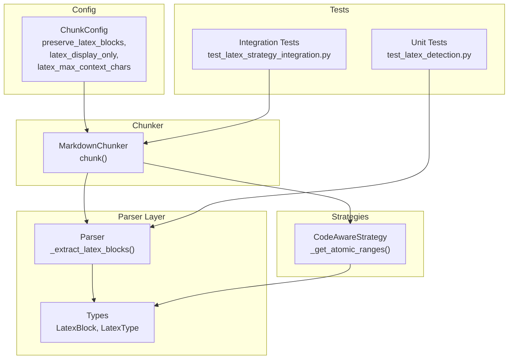
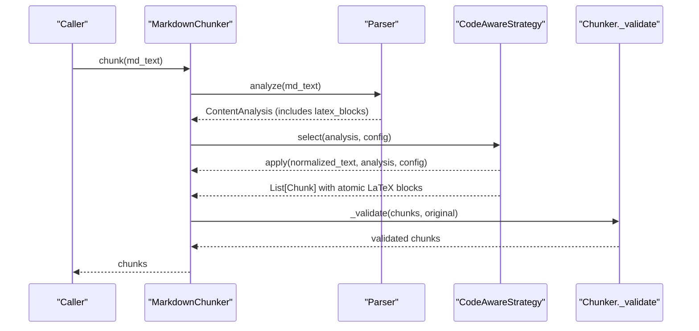
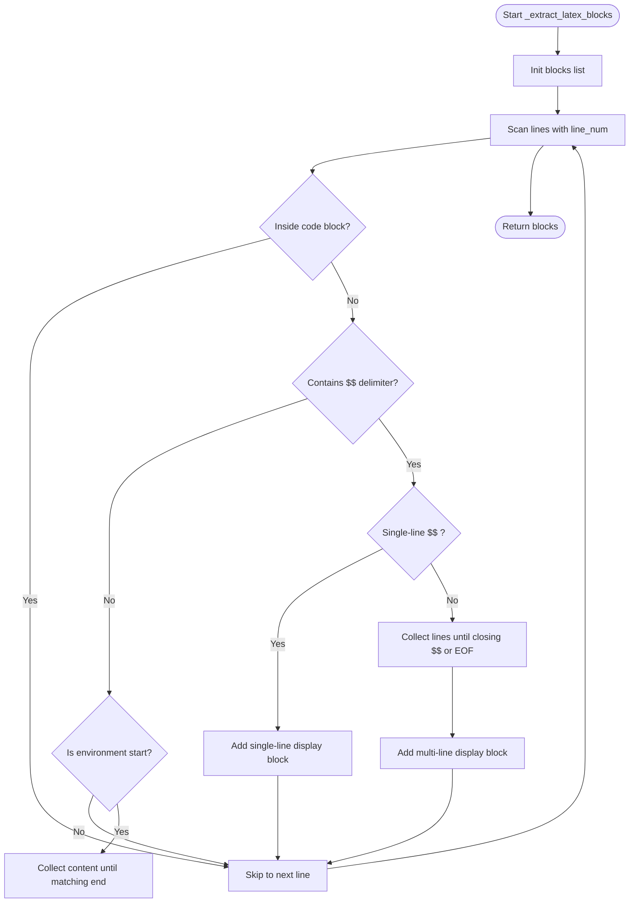
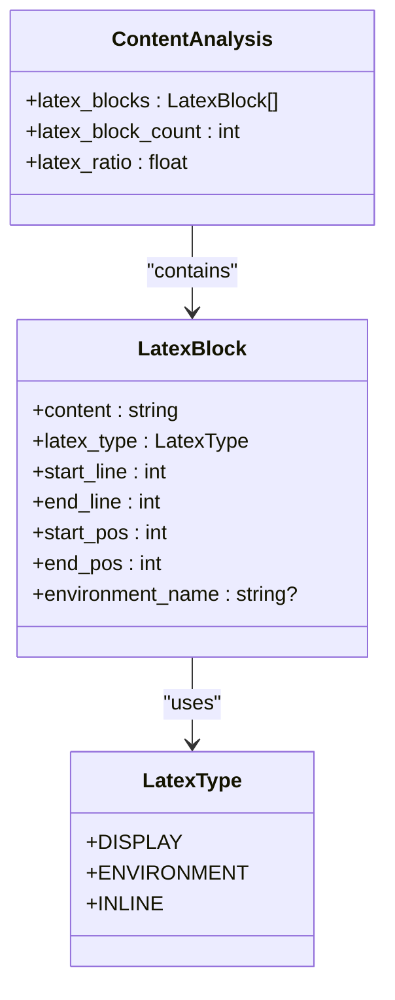
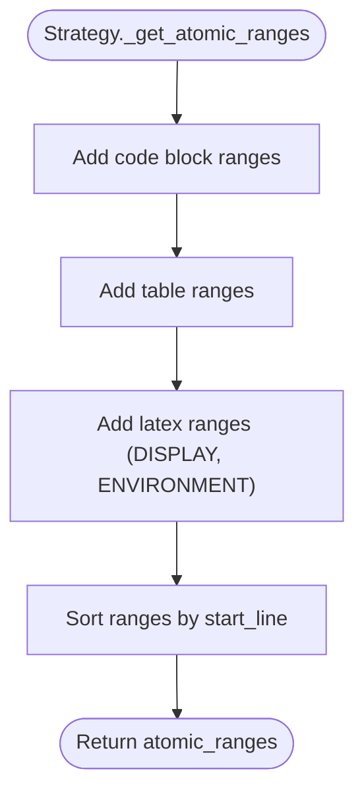
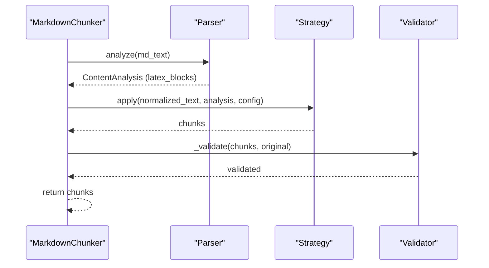
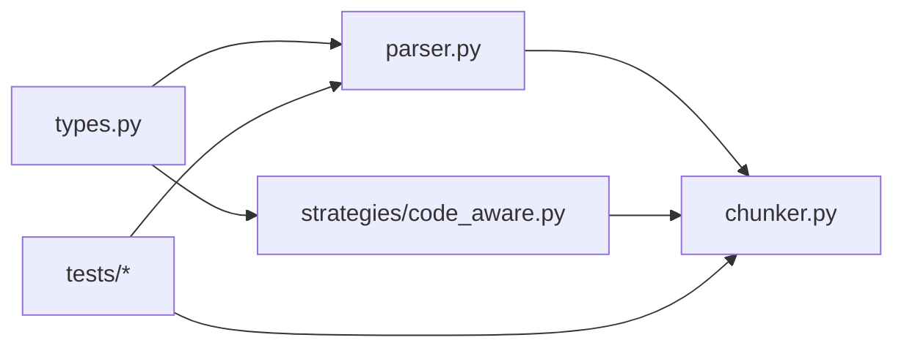

# LaTeX Formula Handling

<cite>
**Referenced Files in This Document**
- [parser.py](file://markdown_chunker_v2/parser.py)
- [types.py](file://markdown_chunker_v2/types.py)
- [code_aware.py](file://markdown_chunker_v2/strategies/code_aware.py)
- [chunker.py](file://markdown_chunker_v2/chunker.py)
- [config.py](file://markdown_chunker_v2/config.py)
- [test_latex_detection.py](file://tests/chunker/test_latex_detection.py)
- [test_latex_strategy_integration.py](file://tests/integration/test_latex_strategy_integration.py)
- [machine-learning-equations.md](file://tests/corpus/scientific/machine-learning-equations.md)
- [physics-equations.md](file://tests/corpus/scientific/physics-equations.md)
</cite>

## Table of Contents
1. [Introduction](#introduction)
2. [Project Structure](#project-structure)
3. [Core Components](#core-components)
4. [Architecture Overview](#architecture-overview)
5. [Detailed Component Analysis](#detailed-component-analysis)
6. [Dependency Analysis](#dependency-analysis)
7. [Performance Considerations](#performance-considerations)
8. [Troubleshooting Guide](#troubleshooting-guide)
9. [Conclusion](#conclusion)
10. [Appendices](#appendices)

## Introduction
This document explains how LaTeX formula handling is implemented in the markdown chunker. It focuses on how formulas are detected, represented, preserved as atomic blocks during chunking, and validated across strategies. The feature ensures that display math and LaTeX environments are never split across chunks, and that atomic LaTeX blocks are treated consistently with code blocks and tables.

## Project Structure
The LaTeX feature spans the parser, types, strategies, and configuration layers, with unit and integration tests validating behavior across multiple scientific corpus files.

**Diagram sources**
- [parser.py](file://markdown_chunker_v2/parser.py#L378-L520)
- [types.py](file://markdown_chunker_v2/types.py#L156-L179)
- [code_aware.py](file://markdown_chunker_v2/strategies/code_aware.py#L397-L424)
- [chunker.py](file://markdown_chunker_v2/chunker.py#L76-L163)
- [config.py](file://markdown_chunker_v2/config.py#L106-L110)
- [test_latex_detection.py](file://tests/chunker/test_latex_detection.py#L1-L207)
- [test_latex_strategy_integration.py](file://tests/integration/test_latex_strategy_integration.py#L1-L349)

**Section sources**
- [parser.py](file://markdown_chunker_v2/parser.py#L378-L520)
- [types.py](file://markdown_chunker_v2/types.py#L156-L179)
- [code_aware.py](file://markdown_chunker_v2/strategies/code_aware.py#L397-L424)
- [chunker.py](file://markdown_chunker_v2/chunker.py#L76-L163)
- [config.py](file://markdown_chunker_v2/config.py#L106-L110)

## Core Components
- Parser: Detects LaTeX display math and environments, skipping LaTeX inside code blocks, and records line ranges and positions.
- Types: Defines LatexBlock and LatexType to represent LaTeX elements uniformly.
- Strategies: Treats display math and environments as atomic blocks alongside code and tables.
- Chunker: Applies strategies and validates that LaTeX formulas remain intact.
- Config: Controls whether LaTeX is preserved and how strictly it is treated as atomic.

Key responsibilities:
- Parser extracts LaTeX blocks and computes metrics (counts and ratios).
- Strategy selection includes LaTeX atomic ranges when deciding chunk boundaries.
- Chunker applies overlap and validation, ensuring no LaTeX split occurs.

**Section sources**
- [parser.py](file://markdown_chunker_v2/parser.py#L378-L520)
- [types.py](file://markdown_chunker_v2/types.py#L156-L179)
- [code_aware.py](file://markdown_chunker_v2/strategies/code_aware.py#L397-L424)
- [chunker.py](file://markdown_chunker_v2/chunker.py#L76-L163)
- [config.py](file://markdown_chunker_v2/config.py#L106-L110)

## Architecture Overview
The LaTeX handling pipeline integrates with the existing chunking architecture:

**Diagram sources**
- [chunker.py](file://markdown_chunker_v2/chunker.py#L76-L163)
- [parser.py](file://markdown_chunker_v2/parser.py#L47-L127)
- [code_aware.py](file://markdown_chunker_v2/strategies/code_aware.py#L397-L424)

## Detailed Component Analysis

### Parser: LaTeX Extraction
- Purpose: Identify display math and LaTeX environments while skipping LaTeX inside code blocks.
- Algorithm highlights:
  - Skips lines inside code blocks by building code block ranges.
  - Detects display math by scanning for delimiters and handling single-line vs multi-line cases.
  - Detects environments by recognizing begin/end pairs and supports starred variants.
  - Records start/end lines and positions for atomic treatment.
- Edge cases covered:
  - Unclosed display math extends to end of document.
  - LaTeX inside fenced code blocks is ignored.
  - Empty display math blocks are captured.

**Diagram sources**
- [parser.py](file://markdown_chunker_v2/parser.py#L378-L520)

**Section sources**
- [parser.py](file://markdown_chunker_v2/parser.py#L378-L520)

### Types: LatexBlock and LatexType
- LatexType enumerates supported LaTeX block types: display math, environments, and inline math (optional).
- LatexBlock stores content, type, and positional metadata (start/end lines and positions), enabling precise atomic treatment.

**Diagram sources**
- [types.py](file://markdown_chunker_v2/types.py#L20-L26)
- [types.py](file://markdown_chunker_v2/types.py#L156-L179)
- [types.py](file://markdown_chunker_v2/types.py#L181-L219)

**Section sources**
- [types.py](file://markdown_chunker_v2/types.py#L20-L26)
- [types.py](file://markdown_chunker_v2/types.py#L156-L179)
- [types.py](file://markdown_chunker_v2/types.py#L181-L219)

### Strategy: Atomic LaTeX Blocks
- CodeAwareStrategy treats LaTeX display and environment blocks as atomic, alongside code and tables.
- Atomic ranges are built from code_blocks, tables, and latex_blocks (display and environment only).
- Oversize reasons include “latex_integrity” when a LaTeX block exceeds max chunk size.

**Diagram sources**
- [code_aware.py](file://markdown_chunker_v2/strategies/code_aware.py#L397-L424)

**Section sources**
- [code_aware.py](file://markdown_chunker_v2/strategies/code_aware.py#L397-L424)

### Chunker: Application and Validation
- MarkdownChunker orchestrates parsing, strategy selection, chunk creation, overlap, metadata enrichment, and validation.
- Validation enforces domain properties and marks oversized LaTeX chunks with appropriate metadata.

**Diagram sources**
- [chunker.py](file://markdown_chunker_v2/chunker.py#L76-L163)

**Section sources**
- [chunker.py](file://markdown_chunker_v2/chunker.py#L76-L163)

### Configuration: LaTeX Options
- preserve_latex_blocks: Treat LaTeX as atomic blocks.
- latex_display_only: Only extract display math and environments; inline math is not extracted by default.
- latex_max_context_chars: Maximum surrounding text bound with LaTeX blocks (used by enhanced code-context binding when applicable).

**Section sources**
- [config.py](file://markdown_chunker_v2/config.py#L106-L110)

### Tests: Detection and Preservation
- Unit tests verify:
  - Single-line and multi-line display math extraction with correct line ranges.
  - Equation and align environments extraction.
  - Ignoring LaTeX inside code blocks.
  - Unclosed display math extending to end.
  - LaTeX ratio calculation.
- Integration tests verify:
  - No LaTeX split across chunks for all strategies.
  - Environments not split.
  - Correct content_type and oversize metadata for LaTeX chunks.

**Section sources**
- [test_latex_detection.py](file://tests/chunker/test_latex_detection.py#L1-L207)
- [test_latex_strategy_integration.py](file://tests/integration/test_latex_strategy_integration.py#L1-L349)

## Dependency Analysis
- Parser depends on types for LatexBlock and LatexType.
- Strategy depends on ContentAnalysis and LatexType to build atomic ranges.
- Chunker depends on Parser for analysis and on Strategy for chunk creation.
- Tests depend on Parser and Chunker to validate LaTeX handling.

**Diagram sources**
- [types.py](file://markdown_chunker_v2/types.py#L156-L179)
- [parser.py](file://markdown_chunker_v2/parser.py#L378-L520)
- [code_aware.py](file://markdown_chunker_v2/strategies/code_aware.py#L397-L424)
- [chunker.py](file://markdown_chunker_v2/chunker.py#L76-L163)

**Section sources**
- [types.py](file://markdown_chunker_v2/types.py#L156-L179)
- [parser.py](file://markdown_chunker_v2/parser.py#L378-L520)
- [code_aware.py](file://markdown_chunker_v2/strategies/code_aware.py#L397-L424)
- [chunker.py](file://markdown_chunker_v2/chunker.py#L76-L163)

## Performance Considerations
- Parser’s LaTeX extraction scans lines and uses precomputed position indices for O(1) lookups, minimizing overhead.
- Atomic ranges are sorted once per strategy application.
- Oversized LaTeX blocks are flagged with metadata rather than reprocessing, reducing cost.

[No sources needed since this section provides general guidance]

## Troubleshooting Guide
Common issues and resolutions:
- LaTeX appears split across chunks:
  - Ensure preserve_latex_blocks is enabled and strategy selects CodeAwareStrategy (which treats LaTeX as atomic).
  - Verify no strategy_override forces a non-atomic-aware strategy.
- LaTeX inside code blocks is not recognized:
  - This is expected behavior; LaTeX inside code blocks is intentionally ignored.
- Very large LaTeX blocks exceed max_chunk_size:
  - Oversize metadata is set with reason “latex_integrity”; adjust max_chunk_size or use adaptive sizing.
- Inline math ($...$) not extracted:
  - latex_display_only is enabled by default; disable it if inline math extraction is required.

**Section sources**
- [config.py](file://markdown_chunker_v2/config.py#L106-L110)
- [code_aware.py](file://markdown_chunker_v2/strategies/code_aware.py#L397-L424)
- [chunker.py](file://markdown_chunker_v2/chunker.py#L368-L408)

## Conclusion
The LaTeX formula handling feature integrates tightly with the parser and strategies to ensure display math and environments are preserved as atomic blocks. The design leverages existing atomic block mechanisms (code and tables) and adds LaTeX to the same treatment, validated by comprehensive unit and integration tests across scientific corpus files.

[No sources needed since this section summarizes without analyzing specific files]

## Appendices

### Example Corpus Files
- Machine learning equations with display math and align environments.
- Physics equations including Maxwell’s equations in align environments.

**Section sources**
- [machine-learning-equations.md](file://tests/corpus/scientific/machine-learning-equations.md#L1-L228)
- [physics-equations.md](file://tests/corpus/scientific/physics-equations.md#L1-L402)