# Markdown AST Parsing

<cite>
**Referenced Files in This Document**
- [markdown_chunker/parser/__init__.py](file://markdown_chunker/parser/__init__.py)
- [markdown_chunker/parser/ast.py](file://markdown_chunker/parser/ast.py)
- [markdown_chunker/parser/markdown_ast.py](file://markdown_chunker/parser/markdown_ast.py)
- [markdown_chunker/parser/enhanced_ast_builder.py](file://markdown_chunker/parser/enhanced_ast_builder.py)
- [markdown_chunker/parser/core.py](file://markdown_chunker/parser/core.py)
- [markdown_chunker/parser/types.py](file://markdown_chunker/parser/types.py)
- [markdown_chunker/parser/validation.py](file://markdown_chunker/parser/validation.py)
- [markdown_chunker/parser/nesting_resolver.py](file://markdown_chunker/parser/nesting_resolver.py)
- [tests/fixtures/real_documents/readme.md](file://tests/fixtures/real_documents/readme.md)
- [tests/fixtures/mixed.md](file://tests/fixtures/mixed.md)
- [README.md](file://README.md)
</cite>

## Table of Contents
1. [Introduction](#introduction)
2. [AST Architecture Overview](#ast-architecture-overview)
3. [Standard vs Enhanced AST](#standard-vs-enhanced-ast)
4. [Markdown-it-py Integration](#markdown-it-py-integration)
5. [AST Node Structure](#ast-node-structure)
6. [Parsing Pipeline](#parsing-pipeline)
7. [Content Analysis and Traversal](#content-analysis-and-traversal)
8. [Edge Cases and Challenges](#edge-cases-and-challenges)
9. [Performance Considerations](#performance-considerations)
10. [Validation and Error Handling](#validation-and-error-handling)
11. [Practical Examples](#practical-examples)
12. [Best Practices](#best-practices)

## Introduction

The Markdown AST (Abstract Syntax Tree) parsing system in this library serves as the foundational component for intelligent document chunking. It transforms raw Markdown text into a structured tree representation that preserves document semantics, positional information, and nesting relationships. This enhanced AST enables sophisticated content analysis and chunking strategies by maintaining rich contextual information throughout the parsing process.

The system employs a dual-parser approach using markdown-it-py as the primary parser with mistune as a fallback, ensuring robust parsing capabilities across different Markdown dialects and edge cases. The enhanced AST builder extends the standard parsing with inline token support, comprehensive position tracking, and semantic element detection.

## AST Architecture Overview

The AST parsing system follows a layered architecture that separates concerns between parsing, enhancement, and validation:

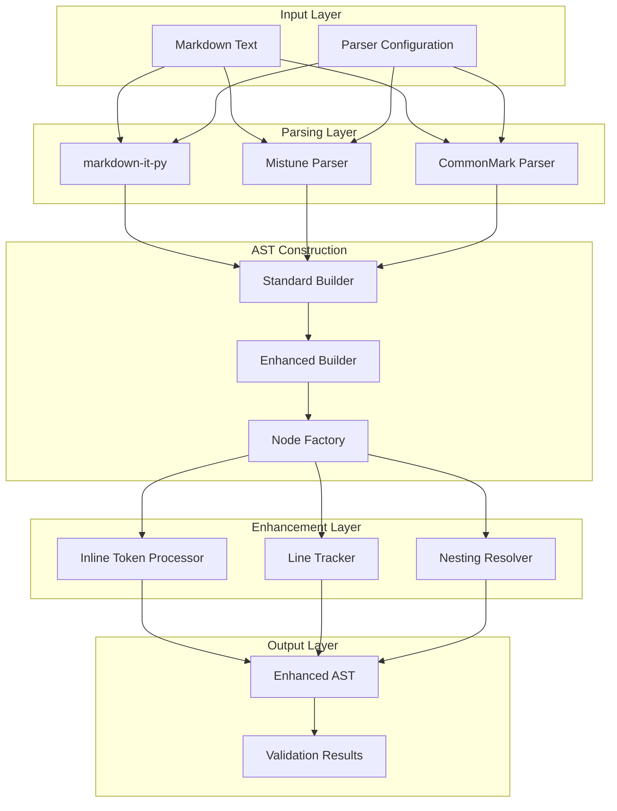

**Diagram sources**
- [markdown_chunker/parser/markdown_ast.py](file://markdown_chunker/parser/markdown_ast.py#L31-L50)
- [markdown_chunker/parser/enhanced_ast_builder.py](file://markdown_chunker/parser/enhanced_ast_builder.py#L319-L350)

**Section sources**
- [markdown_chunker/parser/__init__.py](file://markdown_chunker/parser/__init__.py#L1-L50)
- [markdown_chunker/parser/ast.py](file://markdown_chunker/parser/ast.py#L111-L150)

## Standard vs Enhanced AST

The library maintains two distinct AST representations to balance performance and functionality:

### Standard AST (MarkdownNode)

The standard AST provides basic structural parsing with essential node types and position information:

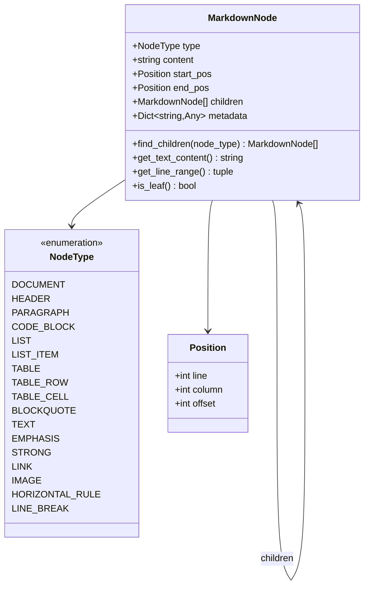

**Diagram sources**
- [markdown_chunker/parser/types.py](file://markdown_chunker/parser/types.py#L36-L56)
- [markdown_chunker/parser/types.py](file://markdown_chunker/parser/types.py#L18-L35)

### Enhanced AST (EnhancedASTBuilder)

The enhanced AST adds comprehensive inline token support and advanced positioning:

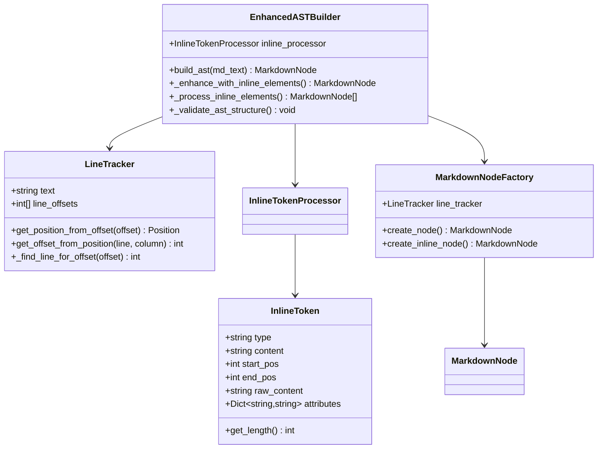

**Diagram sources**
- [markdown_chunker/parser/enhanced_ast_builder.py](file://markdown_chunker/parser/enhanced_ast_builder.py#L319-L350)
- [markdown_chunker/parser/enhanced_ast_builder.py](file://markdown_chunker/parser/enhanced_ast_builder.py#L17-L30)

**Section sources**
- [markdown_chunker/parser/ast.py](file://markdown_chunker/parser/ast.py#L30-L110)
- [markdown_chunker/parser/enhanced_ast_builder.py](file://markdown_chunker/parser/enhanced_ast_builder.py#L319-L350)

## Markdown-it-py Integration

The primary parsing engine utilizes markdown-it-py, a high-performance Python port of the popular JavaScript markdown-it library. This choice provides:

### Parser Selection and Fallback

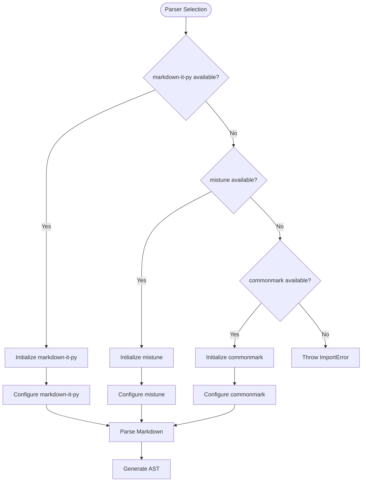

**Diagram sources**
- [markdown_chunker/parser/ast.py](file://markdown_chunker/parser/ast.py#L114-L140)
- [markdown_chunker/parser/markdown_ast.py](file://markdown_chunker/parser/markdown_ast.py#L474-L515)

### Token-to-Node Conversion

The markdown-it-py integration handles the conversion from markdown-it tokens to structured AST nodes:

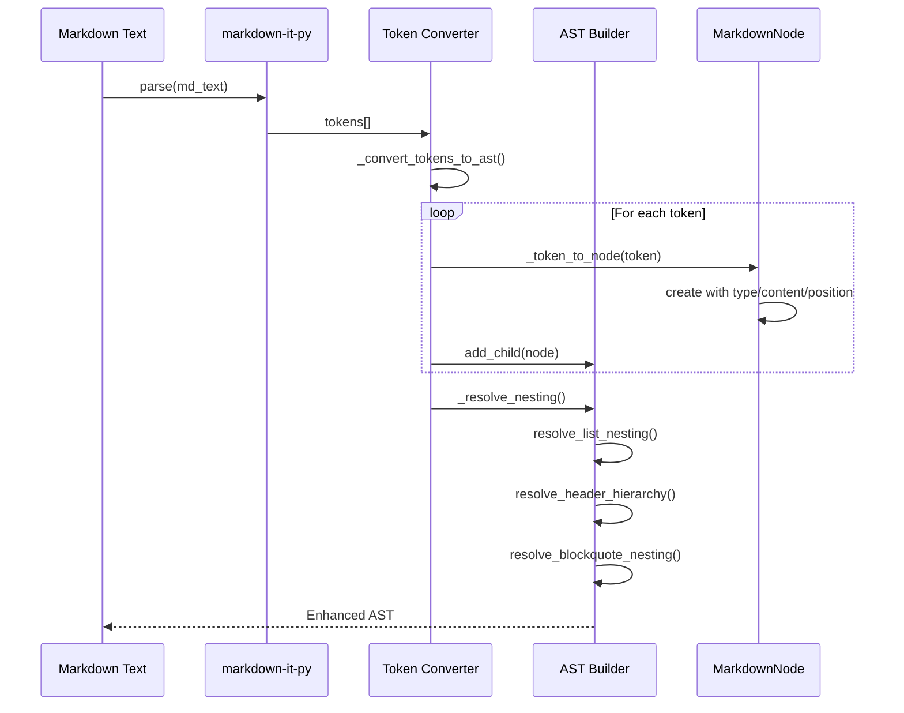

**Diagram sources**
- [markdown_chunker/parser/ast.py](file://markdown_chunker/parser/ast.py#L141-L202)
- [markdown_chunker/parser/markdown_ast.py](file://markdown_chunker/parser/markdown_ast.py#L58-L103)

**Section sources**
- [markdown_chunker/parser/ast.py](file://markdown_chunker/parser/ast.py#L111-L202)
- [markdown_chunker/parser/markdown_ast.py](file://markdown_chunker/parser/markdown_ast.py#L31-L103)

## AST Node Structure

### Core Node Properties

Each AST node maintains comprehensive structural and semantic information:

| Property | Type | Description | Usage |
|----------|------|-------------|-------|
| `type` | NodeType | Node category (header, paragraph, code, etc.) | Content identification |
| `content` | string | Raw text content | Text extraction |
| `start_pos` | Position | Beginning position (line, column, offset) | Location tracking |
| `end_pos` | Position | End position (line, column, offset) | Range determination |
| `children` | List[MarkdownNode] | Child nodes | Hierarchical navigation |
| `metadata` | Dict[str, Any] | Additional properties | Language, nesting level, etc. |

### Position Tracking System

The position tracking system provides precise document location information:

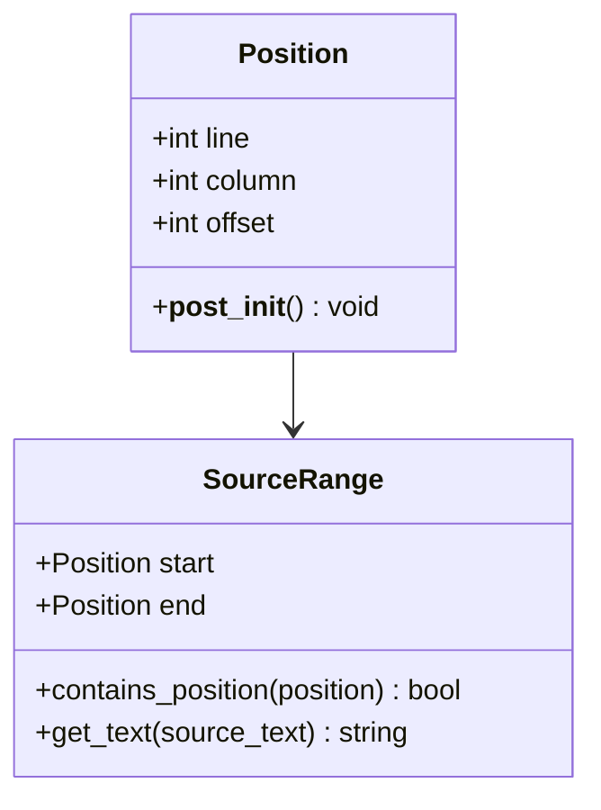

**Diagram sources**
- [markdown_chunker/parser/types.py](file://markdown_chunker/parser/types.py#L18-L35)
- [markdown_chunker/parser/enhanced_ast_builder.py](file://markdown_chunker/parser/enhanced_ast_builder.py#L33-L57)

**Section sources**
- [markdown_chunker/parser/types.py](file://markdown_chunker/parser/types.py#L18-L35)
- [markdown_chunker/parser/types.py](file://markdown_chunker/parser/types.py#L58-L110)

## Parsing Pipeline

### Stage 1 Processing

The parsing pipeline operates in stages to ensure robustness and flexibility:

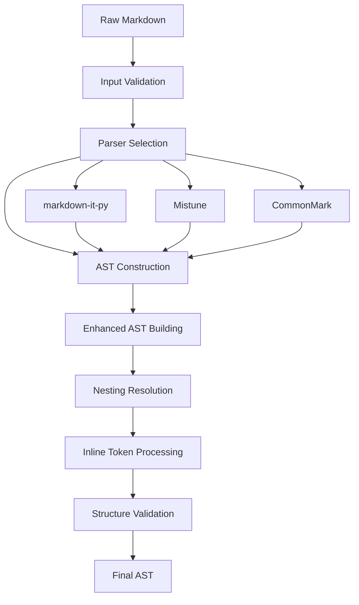

**Diagram sources**
- [markdown_chunker/parser/core.py](file://markdown_chunker/parser/core.py#L418-L480)

### Node Traversal and Analysis

The system provides efficient traversal mechanisms for content analysis:

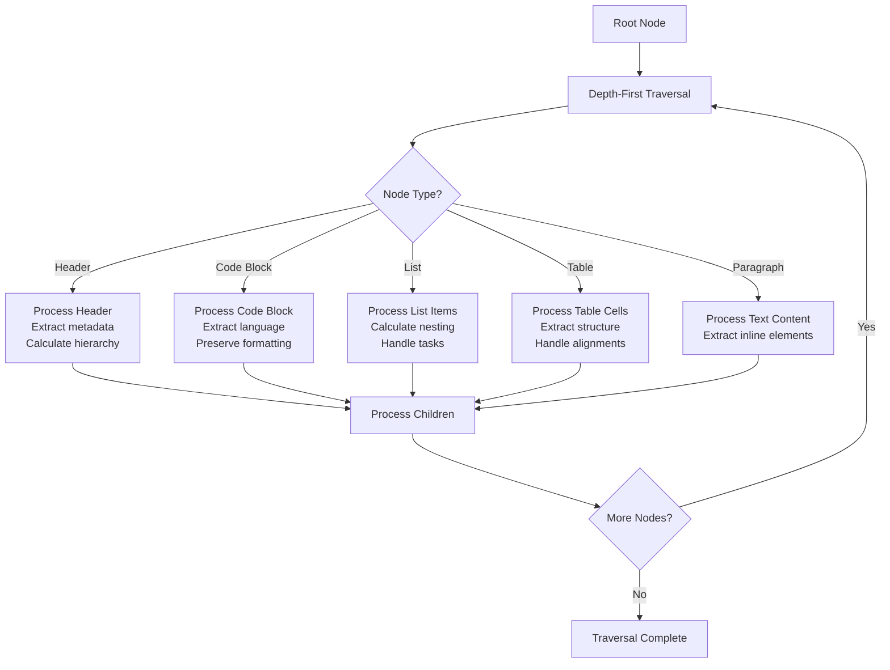

**Diagram sources**
- [markdown_chunker/chunker/section_builder.py](file://markdown_chunker/chunker/section_builder.py#L132-L146)

**Section sources**
- [markdown_chunker/parser/core.py](file://markdown_chunker/parser/core.py#L418-L480)
- [markdown_chunker/chunker/section_builder.py](file://markdown_chunker/chunker/section_builder.py#L132-L146)

## Content Analysis and Traversal

### Semantic Element Detection

The AST parsing system identifies and categorizes semantic elements for intelligent chunking:

| Element Type | Detection Method | Metadata Captured | Use Case |
|--------------|------------------|-------------------|----------|
| Headers | Level-based parsing | Level, text, anchor | Structural chunking |
| Code Blocks | Fence pattern matching | Language, content | Code strategy |
| Lists | Marker recognition | Type, nesting, items | List strategy |
| Tables | Structure analysis | Headers, cells, alignment | Table strategy |
| Links | Inline token processing | URL, text, reference | Content preservation |
| Emphasis | Inline markup parsing | Type (em/strong) | Formatting preservation |

### Content Ratio Calculation

The system calculates content ratios for strategy selection:

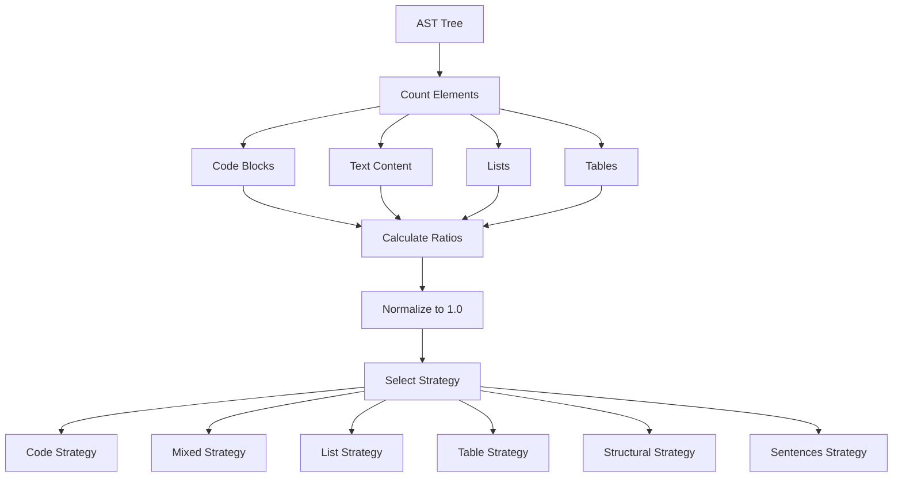

**Diagram sources**
- [markdown_chunker/parser/validation.py](file://markdown_chunker/parser/validation.py#L270-L340)

**Section sources**
- [markdown_chunker/parser/validation.py](file://markdown_chunker/parser/validation.py#L270-L340)

## Edge Cases and Challenges

### Nested Fence Handling

The system handles complex nesting scenarios with sophisticated resolution:

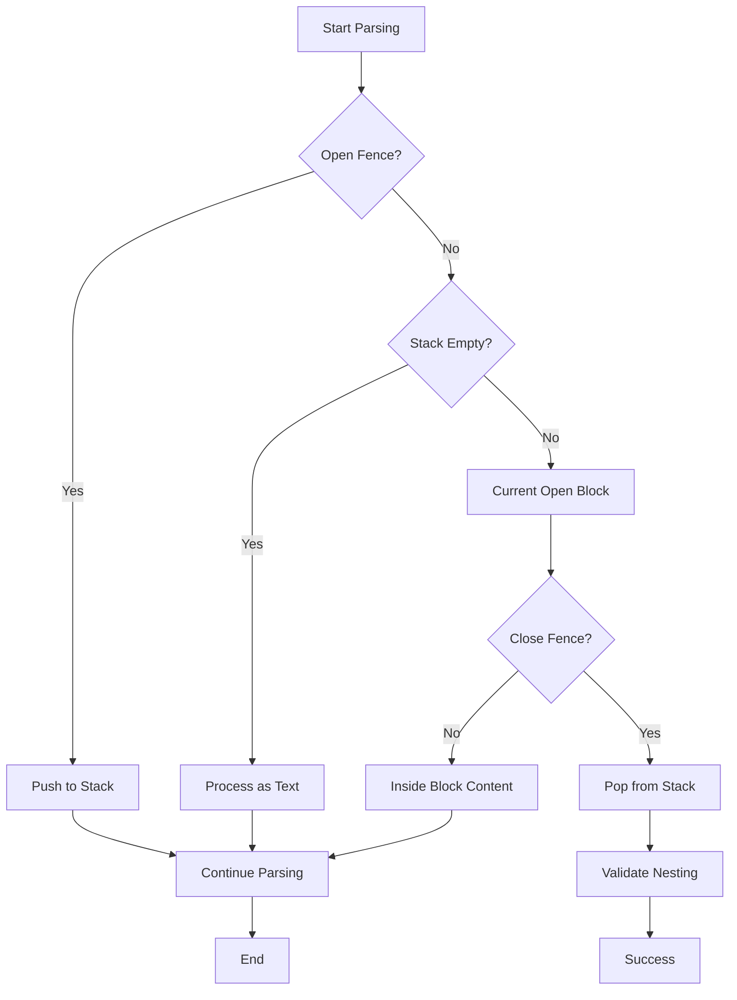

**Diagram sources**
- [markdown_chunker/parser/core.py](file://markdown_chunker/parser/core.py#L72-L135)

### Mixed List Types

The system handles various list formats and their interactions:

| List Type | Marker Pattern | Nesting Behavior | Special Features |
|-----------|---------------|------------------|------------------|
| Unordered | `-`, `*`, `+` | Indented nesting | Bullet points |
| Ordered | `1.`, `2.` | Numeric sequences | Auto-numbering |
| Task Lists | `- [ ]`, `- [x]` | Checkbox support | Task completion |
| Definition Lists | Term: Description | Colon separation | Metadata-like |

### Unclosed Blocks

Robust handling of unclosed blocks prevents parsing failures:

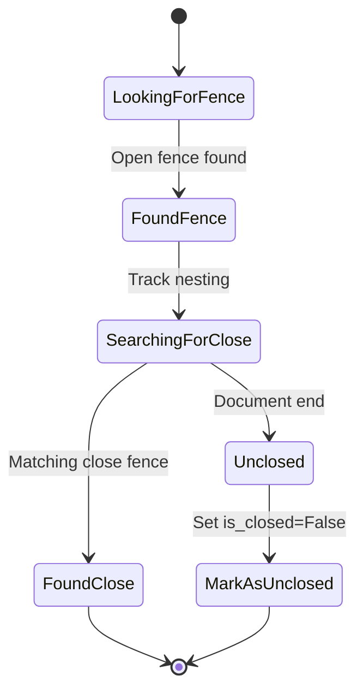

**Diagram sources**
- [markdown_chunker/parser/core.py](file://markdown_chunker/parser/core.py#L118-L135)

**Section sources**
- [markdown_chunker/parser/core.py](file://markdown_chunker/parser/core.py#L72-L135)
- [markdown_chunker/parser/nesting_resolver.py](file://markdown_chunker/parser/nesting_resolver.py#L182-L202)

## Performance Considerations

### Parsing Performance Metrics

The enhanced AST builder maintains high performance while adding comprehensive features:

| Operation | Time Complexity | Space Complexity | Notes |
|-----------|----------------|------------------|-------|
| Basic Parsing | O(n) | O(n) | Linear with document size |
| Inline Processing | O(n × m) | O(n + m) | n = document chars, m = inline tokens |
| Nesting Resolution | O(k²) | O(k) | k = block count |
| Position Lookup | O(log n) | O(1) | Binary search optimization |

### Memory Optimization Strategies

The system employs several memory optimization techniques:

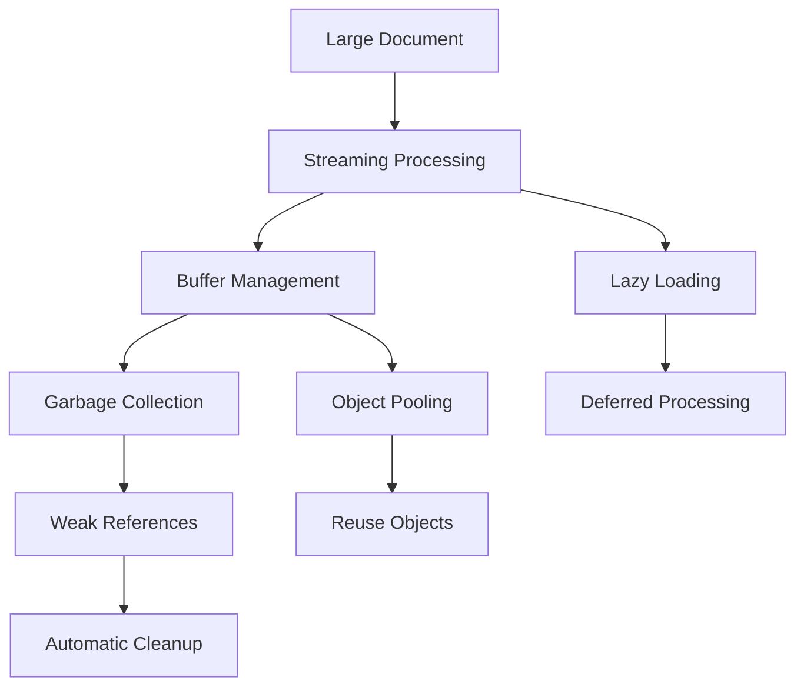

**Diagram sources**
- [markdown_chunker/parser/enhanced_ast_builder.py](file://markdown_chunker/parser/enhanced_ast_builder.py#L58-L123)

**Section sources**
- [markdown_chunker/parser/enhanced_ast_builder.py](file://markdown_chunker/parser/enhanced_ast_builder.py#L58-L123)

## Validation and Error Handling

### AST Structure Validation

Comprehensive validation ensures AST integrity:

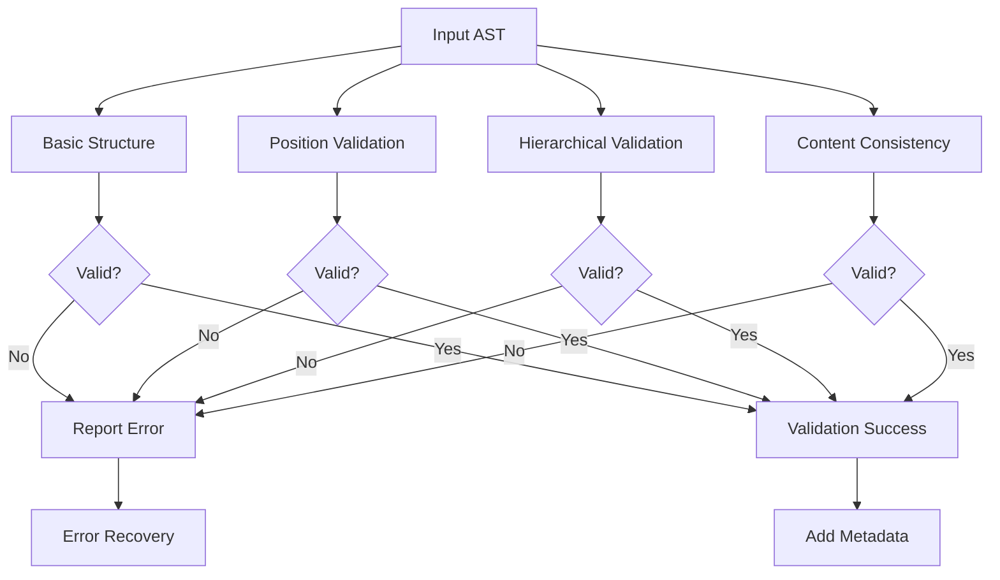

**Diagram sources**
- [markdown_chunker/parser/validation.py](file://markdown_chunker/parser/validation.py#L652-L700)

### Error Recovery Mechanisms

The system implements graceful error recovery:

| Error Type | Recovery Strategy | Impact | Prevention |
|------------|------------------|--------|------------|
| Parser Failure | Fallback to mistune | Reduced features | Dependency management |
| Invalid Nesting | Adjust nesting levels | Structural changes | Validation rules |
| Position Mismatches | Recalculate positions | Minor inaccuracies | Position tracking |
| Missing Content | Generate placeholders | Content loss | Input validation |

**Section sources**
- [markdown_chunker/parser/validation.py](file://markdown_chunker/parser/validation.py#L652-L700)
- [markdown_chunker/parser/validation.py](file://markdown_chunker/parser/validation.py#L220-L280)

## Practical Examples

### Real Document Analysis

Consider the README.md example document:

**Headers Example:**
```markdown
# Python Markdown Chunker
## Features
### Smart Chunking
```

**AST Representation:**
- Root Document node
  - Header node (level 1, "Python Markdown Chunker")
  - Header node (level 2, "Features")
    - Header node (level 3, "Smart Chunking")

**Code Blocks Example:**
```markdown
```python
def greet(name):
    return f"Hello, {name}!"
```
```

**AST Representation:**
- Code Block node (language: "python", content: "def greet(name):\n    return f\"Hello, {name}!\"")

**Lists Example:**
```markdown
- First point
  - Nested point
- Second point
```

**AST Representation:**
- List node
  - List Item node (content: "First point")
    - List Item node (content: "Nested point")
  - List Item node (content: "Second point")

### Mixed Content Document

The mixed.md document demonstrates complex AST structure:

**AST Structure:**
```
Document
├── Header (Overview)
├── Paragraph
├── Header (Code Section)
├── Paragraph
├── Code Block (Python)
├── Header (List Section)
├── List
│   ├── List Item (First point)
│   ├── List Item (Second point)
│   │   └── List Item (Nested point A)
│   │   └── List Item (Nested point B)
│   ├── List Item (Fourth point)
├── Header (Table Section)
├── Table
│   ├── Table Row (Feature, Description, Status)
│   ├── Table Row (Auth, User authentication, ✅ Complete)
│   └── Table Row (UI, User interface, ⏳ Planned)
├── Header (Text Section)
├── Paragraph (Multiple sentences)
└── Header (Conclusion)
```

**Section sources**
- [tests/fixtures/real_documents/readme.md](file://tests/fixtures/real_documents/readme.md#L1-L50)
- [tests/fixtures/mixed.md](file://tests/fixtures/mixed.md#L1-L51)

## Best Practices

### Parser Selection Guidelines

Choose the appropriate parser based on requirements:

| Requirement | Recommended Parser | Fallback | Reason |
|-------------|-------------------|----------|--------|
| Performance | markdown-it-py | mistune | Speed and features |
| Compatibility | mistune | commonmark | Broader Markdown support |
| Simplicity | commonmark | None | Minimal dependencies |
| Production | markdown-it-py | mistune | Battle-tested |

### AST Navigation Patterns

Efficient AST traversal patterns:

```python
# Depth-first traversal for content analysis
def traverse_ast(node):
    yield node
    for child in node.children:
        yield from traverse_ast(child)

# Breadth-first traversal for structural analysis
def traverse_bfs(root):
    queue = [root]
    while queue:
        node = queue.pop(0)
        yield node
        queue.extend(node.children)
```

### Memory Management

Optimize memory usage for large documents:

- Use streaming parsers for very large files
- Process AST nodes incrementally
- Clear references to processed subtrees
- Monitor memory usage during parsing

### Error Handling

Implement robust error handling:

- Validate input before parsing
- Catch and log parsing exceptions
- Provide meaningful error messages
- Implement graceful degradation

**Section sources**
- [markdown_chunker/parser/__init__.py](file://markdown_chunker/parser/__init__.py#L474-L515)
- [markdown_chunker/parser/validation.py](file://markdown_chunker/parser/validation.py#L220-L280)