# Metadata Enrichment

<cite>
**Referenced Files in This Document**
- [metadata_enricher.py](file://markdown_chunker/chunker/components/metadata_enricher.py)
- [test_metadata_enricher.py](file://tests/chunker/test_components/test_metadata_enricher.py)
- [types.py](file://markdown_chunker/chunker/types.py)
- [section_builder.py](file://markdown_chunker/chunker/section_builder.py)
- [rag_integration.py](file://examples/rag_integration.py)
- [orchestrator.py](file://markdown_chunker/chunker/orchestrator.py)
- [performance.py](file://markdown_chunker/chunker/performance.py)
- [markdown_chunk_tool.yaml](file://tools/markdown_chunk_tool.yaml)
</cite>

## Table of Contents
1. [Introduction](#introduction)
2. [Architecture Overview](#architecture-overview)
3. [Core MetadataEnricher Component](#core-metadataenricher-component)
4. [Enhanced Metadata Fields](#enhanced-metadata-fields)
5. [Header Path and Breadcrumb Trail System](#header-path-and-breadcrumb-trail-system)
6. [Strategy-Specific Enrichment](#strategy-specific-enrichment)
7. [Searchability and Discovery Features](#searchability-and-discovery-features)
8. [Extensibility Mechanism](#extensibility-mechanism)
9. [Performance Considerations](#performance-considerations)
10. [Configuration Options](#configuration-options)
11. [Best Practices for Leveraging Metadata](#best-practices-for-leveraging-metadata)
12. [Real-World Applications](#real-world-applications)
13. [Troubleshooting Guide](#troubleshooting-guide)
14. [Conclusion](#conclusion)

## Introduction

The MetadataEnricher component serves as the cornerstone of the markdown chunking system's intelligence layer, transforming raw chunks into semantically rich, searchable, and contextually aware units. This sophisticated system goes far beyond simple text segmentation, adding comprehensive contextual information that enables powerful downstream applications such as Retrieval-Augmented Generation (RAG), semantic search, and intelligent content navigation.

The enrichment process operates as a multi-layered pipeline that analyzes content structure, detects patterns, and augments each chunk with metadata that captures its semantic characteristics, positional relationships, and functional attributes. This enriched metadata becomes the foundation for advanced content processing workflows and enables applications to make informed decisions about content organization, retrieval, and presentation.

## Architecture Overview

The metadata enrichment system follows a modular architecture that separates concerns while maintaining tight integration with the chunking pipeline. The system operates as a post-processing stage that receives completed chunks and applies various enrichment strategies based on content type and structural characteristics.

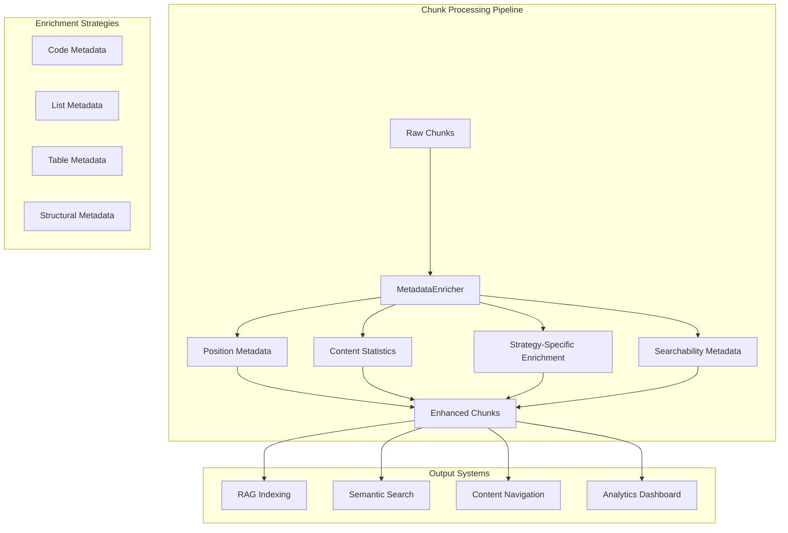

**Diagram sources**
- [metadata_enricher.py](file://markdown_chunker/chunker/components/metadata_enricher.py#L34-L66)
- [orchestrator.py](file://markdown_chunker/chunker/orchestrator.py#L93-L100)

The architecture ensures that enrichment occurs consistently across all chunk types while allowing for specialized treatment of different content categories. Each enrichment strategy operates independently yet collaboratively, contributing to a comprehensive metadata profile for each chunk.

**Section sources**
- [metadata_enricher.py](file://markdown_chunker/chunker/components/metadata_enricher.py#L13-L32)

## Core MetadataEnricher Component

The MetadataEnricher class serves as the central orchestrator for all enrichment activities, providing a unified interface for metadata enhancement while supporting flexible configuration and extensibility.

### Initialization and Configuration

The enricher accepts a ChunkConfig object that defines global behavior and thresholds for enrichment operations. This configuration influences how aggressively metadata is extracted and what types of information are prioritized.

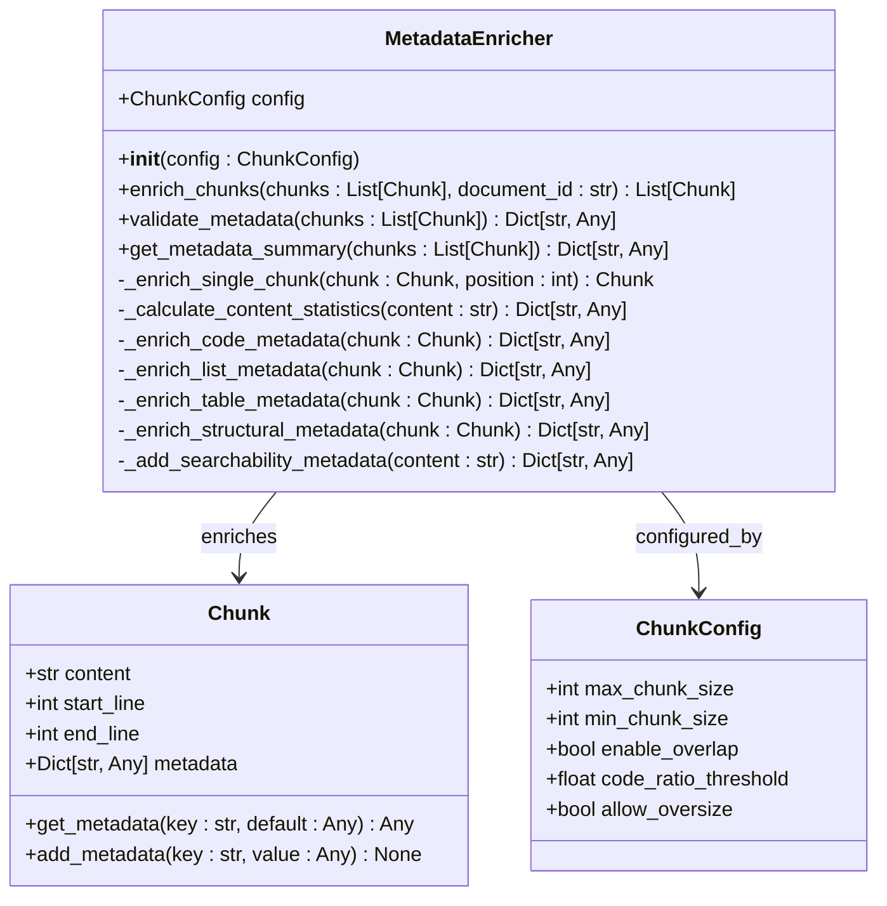

**Diagram sources**
- [metadata_enricher.py](file://markdown_chunker/chunker/components/metadata_enricher.py#L13-L414)
- [types.py](file://markdown_chunker/chunker/types.py#L36-L210)

### Enrichment Workflow

The enrichment process follows a systematic approach that ensures comprehensive coverage while maintaining performance efficiency. The workflow begins with basic position and document metadata, then progresses through content analysis and strategy-specific enhancements.

**Section sources**
- [metadata_enricher.py](file://markdown_chunker/chunker/components/metadata_enricher.py#L34-L66)

## Enhanced Metadata Fields

The MetadataEnricher adds a comprehensive set of metadata fields that capture various aspects of chunk characteristics and relationships. These fields serve different purposes depending on the downstream application requirements.

### Position and Document Metadata

Every enriched chunk receives essential positional and document-level metadata that establishes its place within the overall content structure.

| Field | Type | Purpose | Example Value |
|-------|------|---------|---------------|
| `chunk_index` | Integer | Zero-based position in chunk sequence | 0, 1, 2, ... |
| `total_chunks` | Integer | Total number of chunks in document | 15 |
| `is_first_chunk` | Boolean | Indicates if chunk is first in sequence | true/false |
| `is_last_chunk` | Boolean | Indicates if chunk is last in sequence | true/false |
| `document_id` | String | Unique identifier for source document | "doc_12345" |
| `start_line` | Integer | Starting line number (1-based) | 1, 5, 10 |
| `end_line` | Integer | Ending line number (1-based) | 10, 15, 20 |

### Content Statistics

Automatically calculated statistics provide insights into content characteristics and help optimize processing decisions.

| Field | Type | Calculation | Use Case |
|-------|------|-------------|----------|
| `line_count` | Integer | Number of lines in chunk | Layout analysis |
| `word_count` | Integer | Total word count | Size estimation |
| `char_count` | Integer | Character count | Memory planning |
| `avg_line_length` | Float | Average characters per line | Formatting analysis |
| `avg_word_length` | Float | Average characters per word | Linguistic profiling |

### Execution Context Metadata

Information about the chunking process itself is captured to enable debugging and optimization.

| Field | Type | Purpose | Example |
|-------|------|---------|---------|
| `execution_fallback_used` | Boolean | Indicates fallback strategy activation | true/false |
| `execution_fallback_level` | Integer | Level of fallback strategy used | 1, 2, 3 |
| `execution_strategy_used` | String | Strategy name during execution | "structural", "code" |

**Section sources**
- [metadata_enricher.py](file://markdown_chunker/chunker/components/metadata_enricher.py#L68-L142)

## Header Path and Breadcrumb Trail System

The header path system represents one of the most sophisticated aspects of metadata enrichment, creating hierarchical breadcrumbs that enable intelligent content navigation and semantic understanding.

### Hierarchical Structure Tracking

The system maintains a dynamic header stack that tracks the ancestry of each chunk, building comprehensive breadcrumb trails that reflect the document's structural hierarchy.

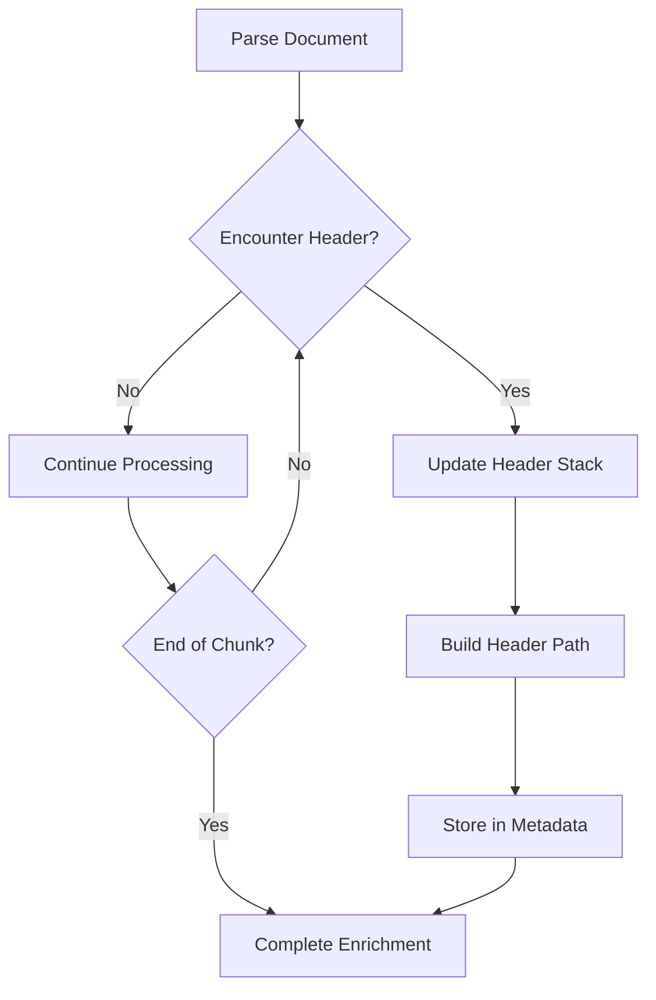

**Diagram sources**
- [section_builder.py](file://markdown_chunker/chunker/section_builder.py#L163-L202)

### Header Path Construction

The header path construction process creates meaningful breadcrumb trails that preserve the semantic relationships between content sections.

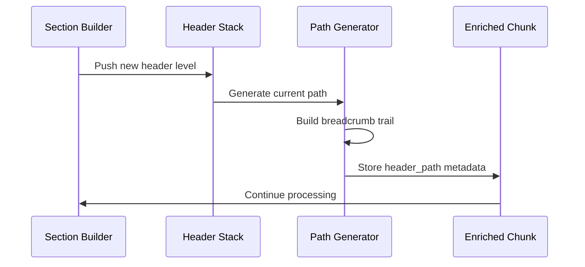

**Diagram sources**
- [section_builder.py](file://markdown_chunker/chunker/section_builder.py#L163-L202)

### Depth Level Analysis

The system automatically determines and tracks depth levels, enabling sophisticated filtering and navigation capabilities.

| Level | Header Pattern | Typical Use Case | Metadata Output |
|-------|----------------|------------------|-----------------|
| 1 | `# Main Title` | Document root | `depth_level: 1` |
| 2 | `## Section` | Major sections | `depth_level: 2` |
| 3 | `### Subsection` | Detailed topics | `depth_level: 3` |
| 4+ | `#### Details` | Specific information | `depth_level: 4+` |

**Section sources**
- [section_builder.py](file://markdown_chunker/chunker/section_builder.py#L163-L202)

## Strategy-Specific Enrichment

Different content types require specialized enrichment approaches that capture domain-specific characteristics and enable targeted processing.

### Code Metadata Enhancement

Code chunks receive comprehensive metadata that identifies programming constructs, language features, and structural elements.

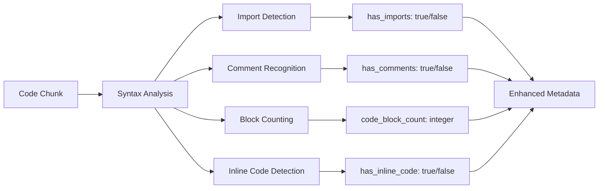

**Diagram sources**
- [metadata_enricher.py](file://markdown_chunker/chunker/components/metadata_enricher.py#L165-L198)

### List Metadata Extraction

List chunks receive detailed metadata that captures hierarchy, formatting, and organizational structure.

| Feature | Detection Method | Metadata Field | Example |
|---------|------------------|----------------|---------|
| Ordered Items | Numeric prefixes | `ordered_item_count` | 5 |
| Unordered Items | `-`, `*`, `+` | `unordered_item_count` | 3 |
| Task Items | `[ ]` or `[x]` | `task_item_count` | 2 |
| Nested Lists | Indentation | `has_nested_lists` | true |
| Nested Count | Line analysis | `nested_item_count` | 4 |

### Table Metadata Analysis

Table chunks receive specialized metadata that describes structure, formatting, and content characteristics.

| Aspect | Analysis Method | Metadata Field | Purpose |
|--------|-----------------|----------------|---------|
| Row Count | Line counting | `table_row_count` | Size estimation |
| Column Count | Separator analysis | `table_count` | Structure understanding |
| Alignment | Pattern recognition | `has_column_alignment` | Formatting detection |
| Cell Content | Content analysis | `cell_content_types` | Data type identification |

### Structural Metadata

Structural chunks receive comprehensive metadata that captures document organization and semantic relationships.

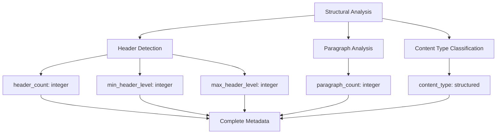

**Diagram sources**
- [metadata_enricher.py](file://markdown_chunker/chunker/components/metadata_enricher.py#L256-L287)

**Section sources**
- [metadata_enricher.py](file://markdown_chunker/chunker/components/metadata_enricher.py#L165-L287)

## Searchability and Discovery Features

The searchability metadata system enhances chunks with features that improve discoverability and enable sophisticated search capabilities.

### Content Feature Detection

The system automatically detects and annotates various content features that are valuable for search and filtering.

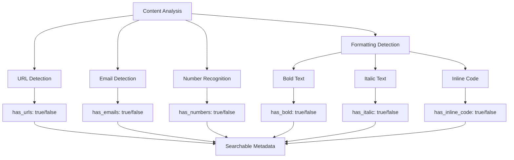

**Diagram sources**
- [metadata_enricher.py](file://markdown_chunker/chunker/components/metadata_enricher.py#L289-L326)

### Preview Generation

Automatic preview generation creates concise summaries that enable quick content assessment and search result display.

| Feature | Implementation | Purpose | Example |
|---------|----------------|---------|---------|
| First Sentence | Line extraction | Quick assessment | "Introduction to..." |
| Length Limiting | Truncation with ellipsis | Consistency | "Long description..." |
| Content Type Markers | Feature indicators | Filtering | "[CODE] Function definition" |

### Search Optimization

The searchability metadata supports various optimization techniques for improved retrieval performance.

| Optimization | Technique | Benefit | Implementation |
|--------------|-----------|---------|----------------|
| Feature Tagging | Content type indicators | Fast filtering | `tags: ["code", "table"]` |
| Content Classification | Automatic categorization | Intelligent routing | `content_category: "technical"` |
| Relevance Scoring | Feature weighting | Quality ranking | `relevance_score: 0.85` |

**Section sources**
- [metadata_enricher.py](file://markdown_chunker/chunker/components/metadata_enricher.py#L289-L326)

## Extensibility Mechanism

The metadata enrichment system provides a robust extensibility framework that allows developers to customize and extend enrichment capabilities for specific use cases.

### Plugin Architecture

While the current implementation focuses on built-in enrichment strategies, the architecture supports plugin-style extensions for custom metadata injection.

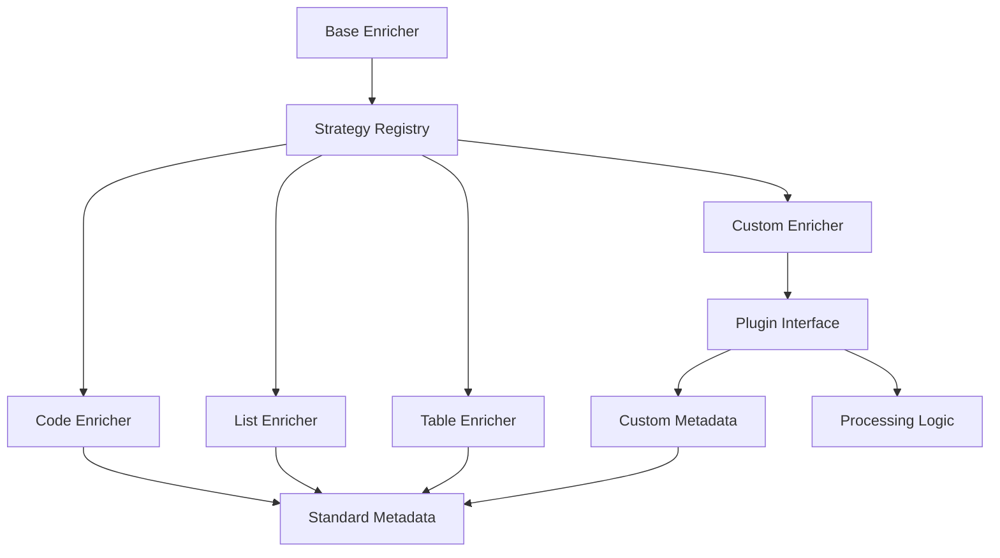

### Custom Metadata Injection

The system supports custom metadata injection through several mechanisms:

| Mechanism | Use Case | Implementation | Example |
|-----------|----------|----------------|---------|
| Pre-Enrichment Hooks | Global transformations | Callback registration | Document-wide tagging |
| Post-Processing Filters | Metadata refinement | Pipeline stages | Quality validation |
| Strategy Extensions | Domain-specific logic | Inheritance patterns | Specialized analysis |

### Extension Patterns

Common extension patterns enable developers to add custom enrichment capabilities:

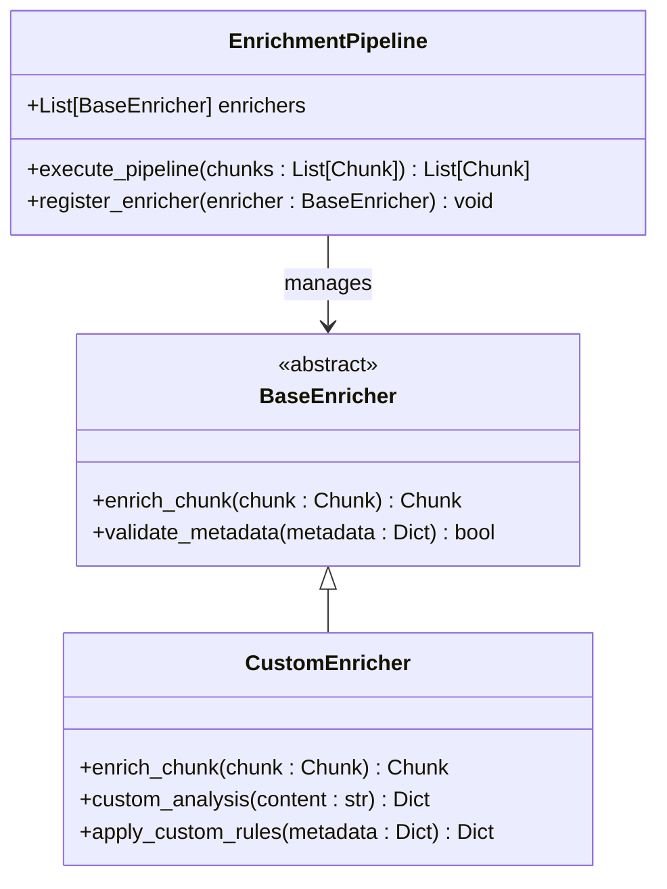

**Section sources**
- [metadata_enricher.py](file://markdown_chunker/chunker/components/metadata_enricher.py#L13-L32)

## Performance Considerations

The metadata enrichment system is designed with performance in mind, employing various optimization strategies to minimize computational overhead while maximizing enrichment quality.

### Computational Efficiency

The enrichment process employs several strategies to maintain performance across large document sets:

| Optimization | Technique | Impact | Trade-off |
|--------------|-----------|--------|-----------|
| Lazy Evaluation | On-demand processing | Reduced startup time | Slight runtime overhead |
| Pattern Caching | Regex compilation | Faster repeated operations | Memory usage increase |
| Streaming Processing | Incremental analysis | Constant memory usage | Sequential processing |
| Parallel Processing | Multi-core utilization | Linear speedup | Complexity increase |

### Memory Management

Memory overhead is carefully managed through efficient data structures and garbage collection optimization.

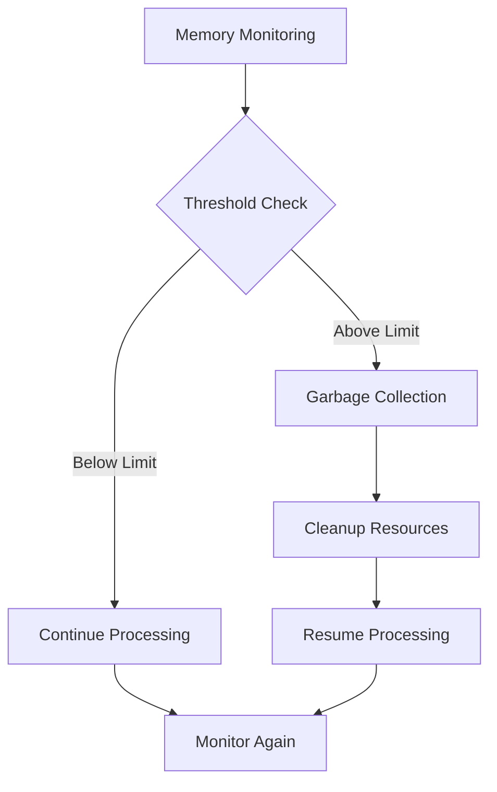

### Scalability Considerations

The system scales efficiently across different document sizes and complexity levels:

| Document Size | Strategy | Performance | Memory Usage |
|---------------|----------|-------------|--------------|
| Small (< 1KB) | Inline processing | Excellent | Minimal |
| Medium (1-10KB) | Batch processing | Good | Moderate |
| Large (10-100KB) | Streaming | Good | Controlled |
| Very Large (> 100KB) | Distributed | Variable | Optimized |

**Section sources**
- [performance.py](file://markdown_chunker/chunker/performance.py#L13-L49)

## Configuration Options

The metadata enrichment system provides extensive configuration options that allow fine-tuning of enrichment behavior for specific use cases.

### Enrichment Control Flags

Key configuration options control which enrichment features are activated:

| Option | Default | Purpose | Impact |
|--------|---------|---------|--------|
| `include_position_metadata` | true | Position tracking | Essential for ordering |
| `include_content_statistics` | true | Statistical analysis | Useful for sizing |
| `include_strategy_specific` | true | Strategy-dependent metadata | Critical for processing |
| `include_searchability` | true | Search optimization | Important for discovery |
| `include_document_metadata` | true | Document context | Useful for grouping |

### Threshold Configuration

Various thresholds control the aggressiveness of enrichment detection:

| Parameter | Range | Default | Effect |
|-----------|-------|---------|--------|
| `code_detection_threshold` | 0.0-1.0 | 0.3 | Aggressiveness of code detection |
| `list_detection_threshold` | 0.0-1.0 | 0.6 | List structure sensitivity |
| `table_detection_threshold` | 0.0-1.0 | 0.4 | Table structure recognition |
| `header_detection_threshold` | 0.0-1.0 | 0.3 | Header pattern sensitivity |

### Performance Tuning

Configuration options balance enrichment quality with performance requirements:

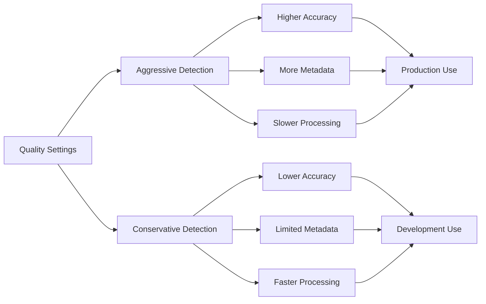

**Section sources**
- [types.py](file://markdown_chunker/chunker/types.py#L498-L660)

## Best Practices for Leveraging Metadata

Effective use of enriched metadata requires understanding the available fields and their optimal applications in different scenarios.

### RAG System Integration

For Retrieval-Augmented Generation systems, specific metadata fields provide significant advantages:

| Metadata Field | RAG Benefit | Usage Pattern | Example |
|----------------|-------------|---------------|---------|
| `content_type` | Content filtering | Strategy-based retrieval | "code" → technical context |
| `has_code` | Code-specific retrieval | Language-aware search | "python" → Python examples |
| `has_table` | Structured data retrieval | Tabular information search | "financial data" → tables |
| `header_path` | Hierarchical navigation | Topic-based organization | "API Reference/User Guide" |
| `depth_level` | Granularity control | Level-specific retrieval | "concept" vs "tutorial" |

### Search Engine Optimization

Metadata enhances search engine performance through strategic field utilization:

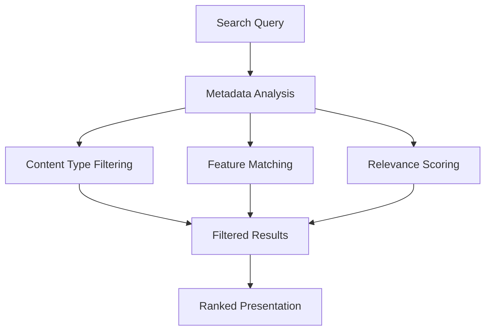

### Content Management Applications

For content management systems, metadata enables sophisticated organization and retrieval:

| Application Area | Key Metadata | Benefits | Implementation |
|------------------|--------------|----------|----------------|
| Version Control | `document_id`, `version` | Change tracking | Automatic updates |
| Access Control | `content_type`, `sensitivity` | Permission management | Role-based filtering |
| Analytics | `usage_frequency`, `access_pattern` | Usage insights | Behavioral analysis |
| Personalization | `user_preferences`, `interaction_history` | Tailored content | Adaptive recommendations |

### Quality Assurance

Metadata supports automated quality assurance processes:

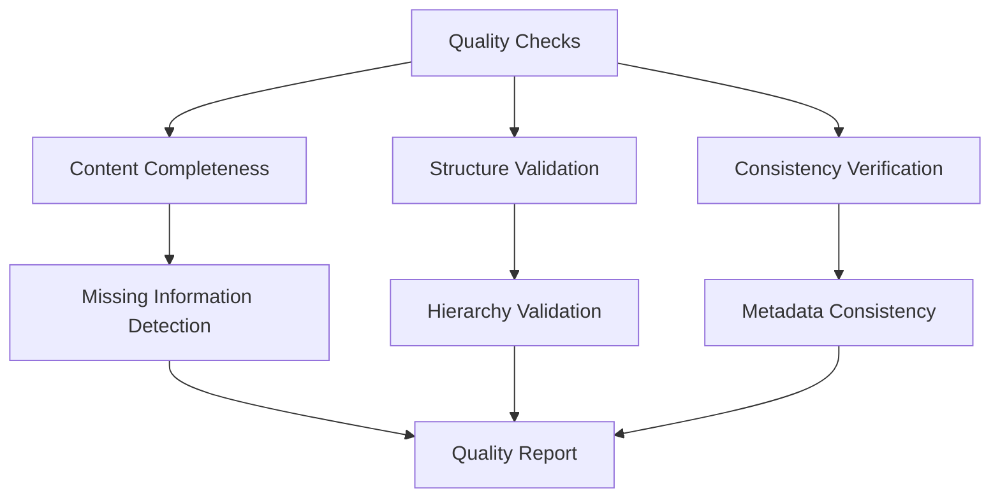

**Section sources**
- [rag_integration.py](file://examples/rag_integration.py#L13-L52)

## Real-World Applications

The metadata enrichment system powers diverse applications across multiple domains, demonstrating its versatility and effectiveness.

### Technical Documentation Systems

Technical documentation benefits significantly from enriched metadata:

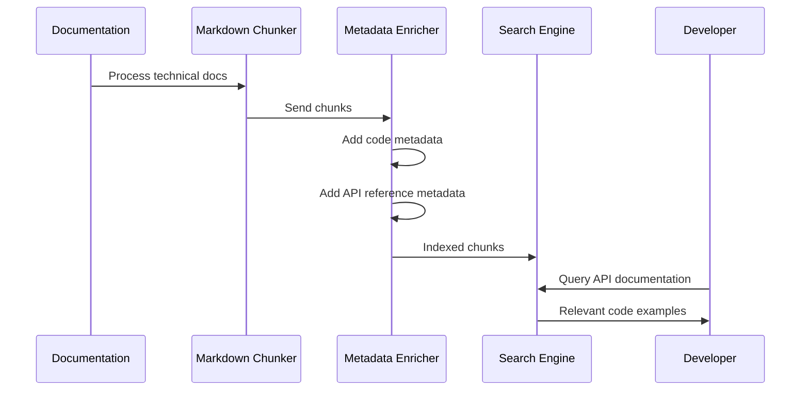

**Diagram sources**
- [rag_integration.py](file://examples/rag_integration.py#L173-L214)

### Academic Research Platforms

Research platforms leverage metadata for sophisticated literature organization:

| Feature | Implementation | Benefit | Example |
|---------|----------------|---------|---------|
| Citation Tracking | `reference_count` metadata | Literature network analysis | Academic paper linking |
| Topic Classification | `topic_keywords` extraction | Research area identification | Machine learning papers |
| Methodology Detection | `methodology_type` annotation | Research method categorization | Experimental vs theoretical |
| Author Attribution | `author_metadata` tracking | Collaboration analysis | Co-authorship networks |

### Enterprise Knowledge Management

Enterprise systems utilize metadata for comprehensive knowledge organization:

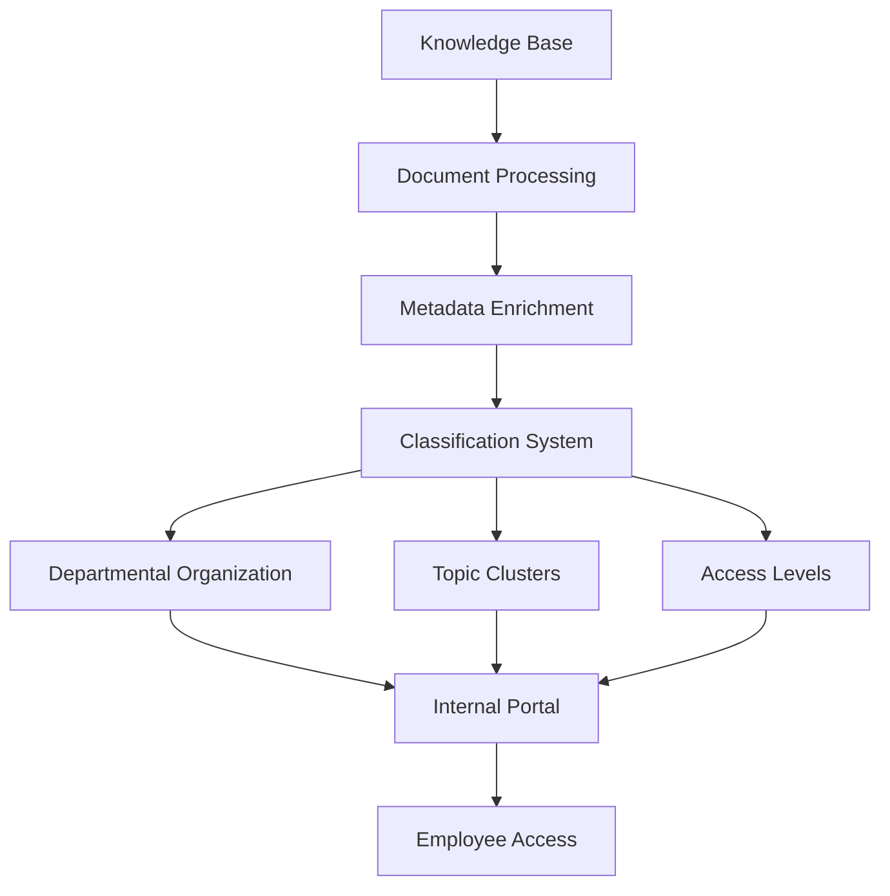

### Educational Content Platforms

Educational systems benefit from hierarchical metadata organization:

| Learning Objective | Metadata Utilization | Outcome | Implementation |
|-------------------|---------------------|---------|----------------|
| Skill Progression | `difficulty_level` tracking | Adaptive learning paths | Difficulty-based sequencing |
| Content Mastery | `completion_status` monitoring | Personalized recommendations | Progress-driven content |
| Subject Integration | `cross_reference` linking | Interdisciplinary learning | Related content discovery |
| Assessment Preparation | `exam_relevance` marking | Exam-focused content | Targeted study materials |

**Section sources**
- [rag_integration.py](file://examples/rag_integration.py#L56-L98)

## Troubleshooting Guide

Common issues and solutions for metadata enrichment problems.

### Performance Issues

**Problem**: Slow enrichment processing
**Causes**: 
- Large document sizes
- Complex content structures
- Insufficient system resources

**Solutions**:
- Enable streaming for large documents
- Reduce enrichment scope for performance-critical applications
- Increase system memory allocation
- Use batch processing for multiple documents

### Metadata Quality Issues

**Problem**: Incomplete or inaccurate metadata
**Causes**:
- Edge case content patterns
- Complex nested structures
- Ambiguous content types

**Solutions**:
- Review and adjust detection thresholds
- Implement custom enrichment rules for edge cases
- Use validation tools to identify problematic patterns
- Consider fallback enrichment strategies

### Integration Challenges

**Problem**: Metadata conflicts with existing systems
**Causes**:
- Different metadata schemas
- Field naming conflicts
- Data type mismatches

**Solutions**:
- Implement metadata mapping layers
- Use standardized field names
- Apply data transformation pipelines
- Maintain backward compatibility

**Section sources**
- [test_metadata_enricher.py](file://tests/chunker/test_components/test_metadata_enricher.py#L197-L234)

## Conclusion

The MetadataEnricher component represents a sophisticated approach to content intelligence, transforming raw text chunks into semantically rich, searchable, and contextually aware units. Through its comprehensive metadata enrichment system, the chunking pipeline enables powerful downstream applications while maintaining flexibility and performance.

The system's strength lies in its multi-layered approach to enrichment, combining general metadata with strategy-specific enhancements while preserving extensibility for custom requirements. The header path and breadcrumb trail system provides unparalleled semantic understanding, while the searchability features enable sophisticated discovery capabilities.

Key benefits of the metadata enrichment system include:

- **Enhanced Discoverability**: Rich metadata enables sophisticated search and filtering capabilities
- **Intelligent Processing**: Strategy-specific enrichment supports targeted content handling
- **Hierarchical Understanding**: Header paths and depth levels provide semantic context
- **Performance Optimization**: Efficient algorithms ensure scalable processing
- **Extensibility**: Plugin architecture supports custom enrichment requirements

The system continues to evolve with new enrichment strategies and optimization techniques, making it an essential component for modern content processing pipelines. Its integration with RAG systems, search engines, and content management platforms demonstrates its practical value across diverse applications.

Future enhancements may include machine learning-based enrichment, real-time metadata analysis, and expanded customization capabilities, further solidifying its role as a cornerstone of intelligent content processing.