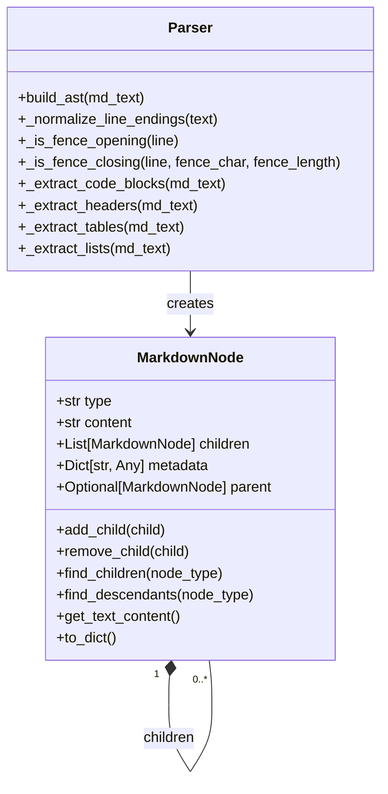
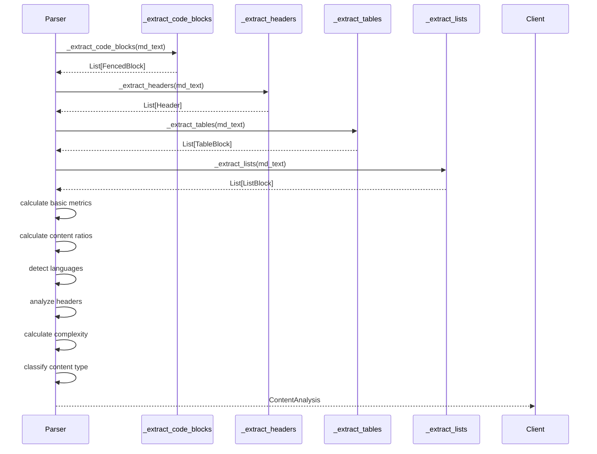
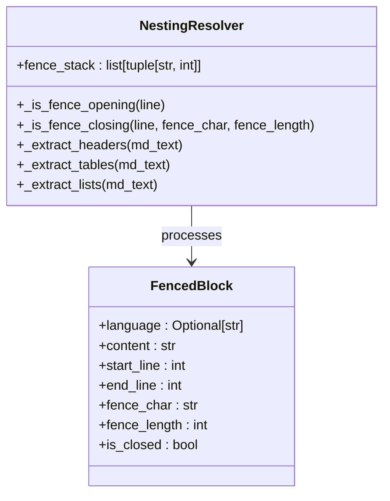
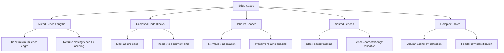
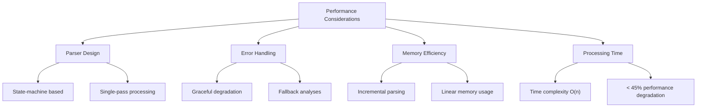

# Parsing and Content Analysis

<cite>
**Referenced Files in This Document**   
- [parser.py](file://markdown_chunker_v2/parser.py)
- [types.py](file://markdown_chunker_v2/types.py)
- [nested_fencing_011.md](file://tests/corpus/nested_fencing/nested_fencing_011.md)
- [nested_fencing_013.md](file://tests/corpus/nested_fencing/nested_fencing_013.md)
- [02-nested-fencing-support.md](file://docs/research/features/02-nested-fencing-support.md)
</cite>

## Update Summary
**Changes Made**   
- Updated edge case handling section to reflect new nested fencing support
- Added detailed explanation of state-machine-based parsing for nested code blocks
- Enhanced content analysis process to include stack-based fence tracking
- Updated metrics extraction to reflect new fence metadata
- Added examples from test corpus to illustrate nested fencing

## Table of Contents
1. [Introduction](#introduction)
2. [Parsing Pipeline Overview](#parsing-pipeline-overview)
3. [AST Construction and Structure](#ast-construction-and-structure)
4. [Content Analysis Process](#content-analysis-process)
5. [Metrics Extraction and Strategy Selection](#metrics-extraction-and-strategy-selection)
6. [Handling Nested Structures](#handling-nested-structures)
7. [Edge Case Handling](#edge-case-handling)
8. [Performance and Accuracy Considerations](#performance-and-accuracy-considerations)

## Introduction

The Markdown chunking system employs a sophisticated parsing and content analysis phase to accurately understand document structure and composition. This phase transforms raw Markdown input into a structured representation that informs optimal chunking strategies. The system uses an Abstract Syntax Tree (AST) to preserve the hierarchical relationships between document elements, enabling precise content analysis and metrics extraction. This document details the parsing pipeline, AST construction, content analysis algorithms, and the system's approach to handling complex edge cases.

## Parsing Pipeline Overview

The parsing pipeline follows a structured sequence from raw input to actionable insights:

**Diagram sources**
- [parser.py](file://markdown_chunker_v2/parser.py#L34-L96)
- [types.py](file://markdown_chunker_v2/types.py#L138-L171)

The pipeline begins with raw Markdown text and progresses through several stages. First, the system constructs an AST that accurately represents the document's hierarchical structure. Then, content analysis processes extract meaningful information about the document's composition. Finally, metrics are computed to characterize the document and determine the optimal chunking strategy. This pipeline ensures that the chunking process is informed by a deep understanding of the document's structure and content.

## AST Construction and Structure

The system uses a robust AST construction process to represent Markdown documents with high fidelity. The AST is built using the `Parser` class, which implements a state-machine-based approach for accurate element detection.

**Diagram sources**
- [parser.py](file://markdown_chunker_v2/parser.py#L14-L595)
- [types.py](file://markdown_chunker_v2/types.py#L72-L96)

The `Parser` class orchestrates the construction process, implementing a line-by-line state machine that tracks the current parsing context. The system normalizes line endings to Unix-style before processing, ensuring consistent behavior across platforms. The parser handles various Markdown elements through dedicated extraction methods that work together to build a complete AST.

The AST construction process preserves semantic relationships between elements through parent-child relationships and metadata. For example, header hierarchy is maintained by tracking parent-child relationships between headers of different levels. List nesting is preserved by calculating nesting depth and storing it in node metadata. This rich structural information enables accurate content analysis and intelligent chunking decisions.

## Content Analysis Process

The content analysis process transforms the AST and document text into meaningful metrics that characterize the document's composition. The `Parser` class implements this process, extracting information about various content types and their relationships.

**Section sources**   
- [parser.py](file://markdown_chunker_v2/parser.py#L34-L96)
- [types.py](file://markdown_chunker_v2/types.py#L138-L171)

The analysis process begins by extracting key document elements: fenced code blocks, headers, tables, and list blocks. Code blocks are extracted using the `_extract_code_blocks` method, which handles various fence types (backticks and tildes) and nesting scenarios. Structural elements are detected using pattern matching and parsing techniques.

The analyzer then calculates various metrics based on these elements. Content ratios are computed by measuring the proportion of characters dedicated to different content types (code, text, lists, tables). Element counts provide information about the document's composition, such as the number of code blocks, headers, and lists. Language detection identifies programming languages used in code blocks, while header analysis tracks the document's structural depth.

The preamble detection identifies and analyzes content that appears before the first header, classifying it as introduction, summary, metadata, or general content. This information helps preserve important introductory material during chunking.

## Metrics Extraction and Strategy Selection

The system extracts a comprehensive set of metrics that characterize the document's composition and inform strategy selection. These metrics are encapsulated in the `ContentAnalysis` object, which provides a detailed profile of the document.

**Section sources**   
- [parser.py](file://markdown_chunker_v2/parser.py#L54-L96)
- [types.py](file://markdown_chunker_v2/types.py#L146-L171)

The key metrics include:

- **Content ratios**: Proportions of the document dedicated to different content types
- **Element counts**: Number of code blocks, lists, tables, and other structural elements
- **Structural metrics**: Maximum header depth, nested list depth, and header distribution
- **Complexity score**: A composite metric that quantifies document complexity
- **Content type**: Classification of the document (code_heavy, list_heavy, mixed, primary)

The complexity score is calculated using a weighted formula that considers structural complexity (header depth, list nesting), content complexity (code ratio, mixed content), and size complexity (total document size). This score helps determine the appropriate chunking strategy for complex documents.

Based on these metrics, the system recommends a chunking strategy through the analysis results. Documents with high code ratios are processed with a code-aware strategy, while documents with significant list content use a list-focused strategy. Mixed content documents receive a balanced approach that preserves the relationships between different content types.

## Handling Nested Structures

The system employs sophisticated techniques to handle nested structures, ensuring that the hierarchical relationships between elements are preserved during parsing and analysis.

**Section sources**   
- [parser.py](file://markdown_chunker_v2/parser.py#L248-L268)
- [types.py](file://markdown_chunker_v2/types.py#L72-L96)

Nested structures such as code blocks within lists or tables within sections are handled through AST traversal and metadata enrichment. The system resolves list nesting by calculating nesting depth for each list and list item, storing this information in node metadata. Header hierarchy is resolved by establishing parent-child relationships between headers of different levels, creating a proper document outline.

For complex nested scenarios, the system uses a multi-pass approach with stack-based tracking. The parser maintains a `fence_stack` that tracks open code blocks with their character and length. When a potential closing fence is encountered, it checks against the top of the stack to ensure proper matching. This stack-based approach enables correct handling of deeply nested code blocks with different fence types.

Special attention is given to edge cases like nested code blocks with different fence types. The system tracks the nesting level of each code block, ensuring that closing fences are matched correctly even in complex scenarios. This prevents premature closure of outer code blocks when inner fences are encountered.

## Edge Case Handling

The system implements robust handling of common Markdown edge cases to ensure reliable parsing and analysis.

**Section sources**   
- [parser.py](file://markdown_chunker_v2/parser.py#L112-L170)
- [types.py](file://markdown_chunker_v2/types.py#L72-L96)

Mixed fence lengths are handled by requiring that closing fences be at least as long as opening fences. This follows CommonMark specifications and prevents incorrect closure of code blocks. Unclosed code blocks are detected and properly represented in the AST, with their content extending to the end of the document and the `is_closed` flag set to `False`.

Tabs and spaces are normalized during input validation, ensuring consistent indentation handling. The system preserves the relative spacing of content while converting tabs to spaces for consistent processing.

For nested fences, the system uses a stack-based approach to track open code blocks. Each time an opening fence is encountered, it is pushed onto the stack with its character and length. Closing fences pop the corresponding block from the stack only if they meet the length and formatting requirements. This ensures correct handling of nested code blocks with different fence types.

The system also handles complex tables with proper alignment detection and header row identification. Table cells are parsed with attention to column boundaries, preserving the tabular structure for accurate analysis.

## Performance and Accuracy Considerations

The system balances performance and accuracy requirements for production use through several design choices.

**Section sources**   
- [parser.py](file://markdown_chunker_v2/parser.py#L189-L232)
- [test_nested_fencing_performance.py](file://tests/performance/test_nested_fencing_performance.py#L446-L478)

The system uses a state-machine-based parser design that processes documents in a single pass, achieving linear time complexity (O(n)). The parser maintains a stack for tracking nested fences, which adds minimal overhead while enabling correct handling of complex nesting scenarios.

Error handling is designed for graceful degradation. When parsing errors occur, the system provides fallback analyses that preserve essential document characteristics. This ensures that chunking can proceed even with imperfect parsing results.

Memory efficiency is achieved through incremental parsing techniques. The system processes documents line by line, minimizing memory overhead. For large documents, the linear time complexity ensures predictable performance.

The accuracy requirements are met through comprehensive testing, including property-based tests that verify metric consistency across various document structures. Performance benchmarks show that nested fencing support adds less than 45% processing time compared to simple documents, which is acceptable given the complexity of the parsing task. The system validates that content ratios sum to approximately 1.0, complexity scores are bounded between 0 and 1, and element counts are consistent with direct detection methods.

These performance and accuracy considerations ensure that the parsing and content analysis phase is suitable for production use, providing reliable document understanding while maintaining efficient resource utilization.