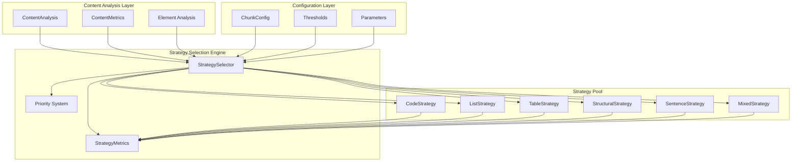
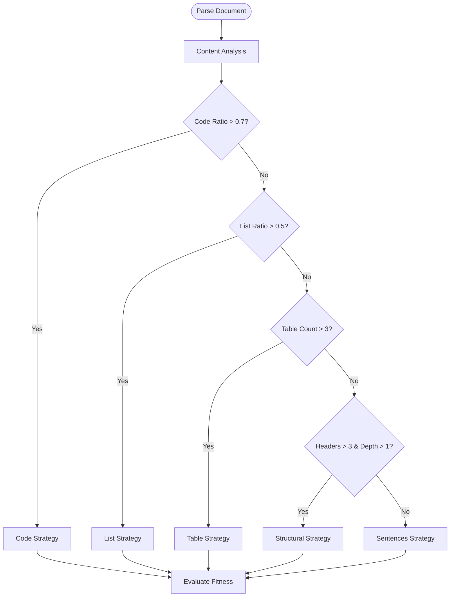
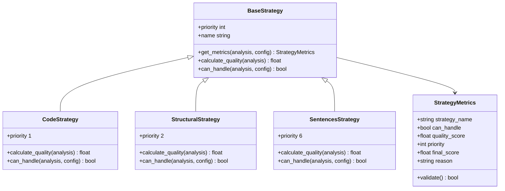
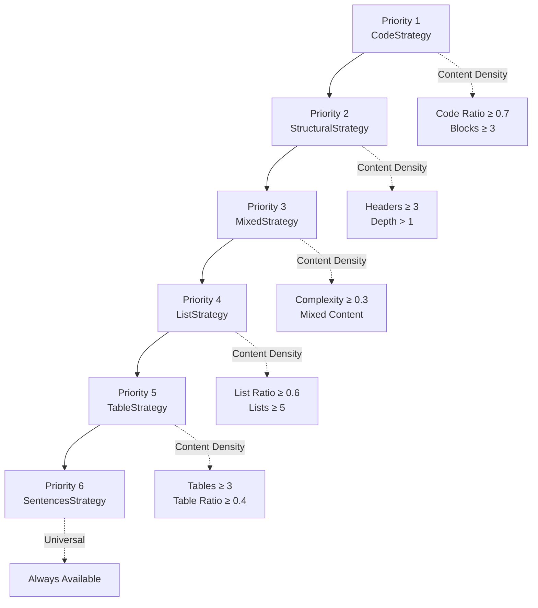
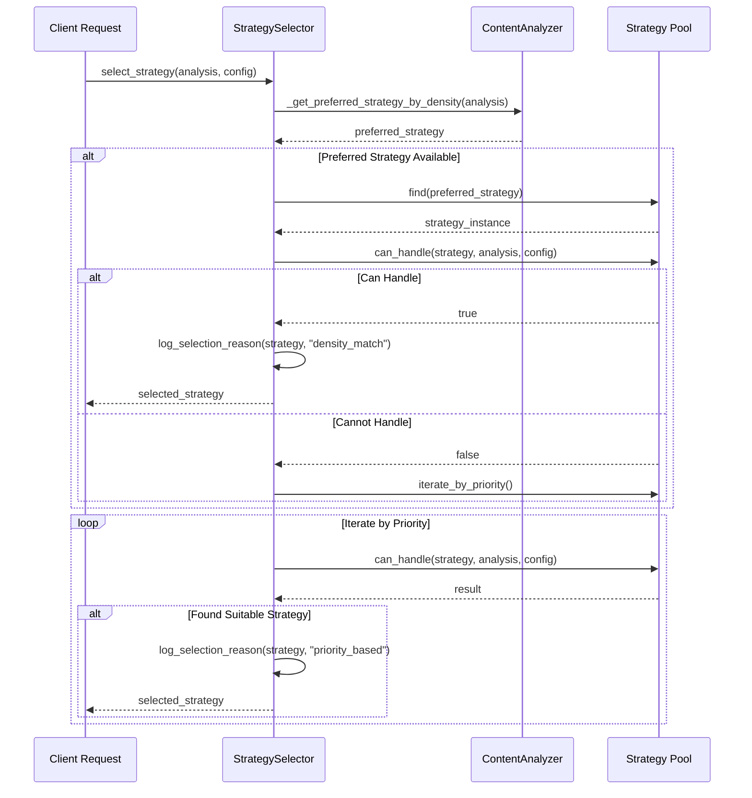
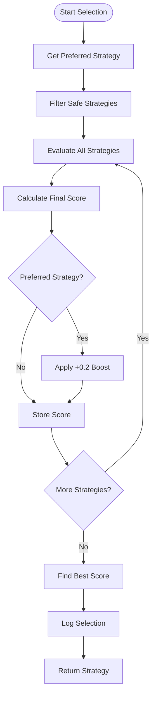
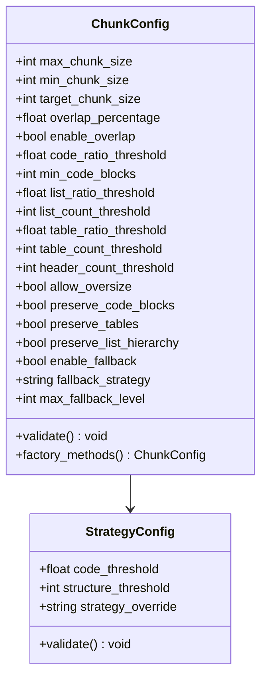
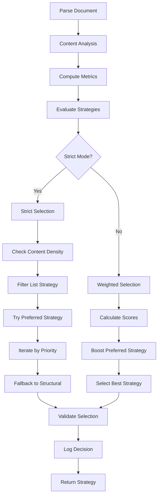
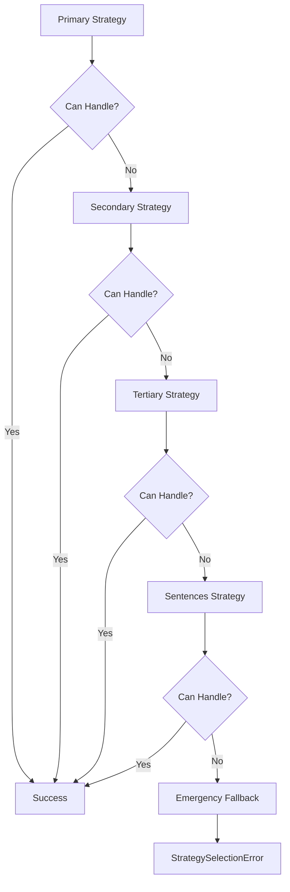
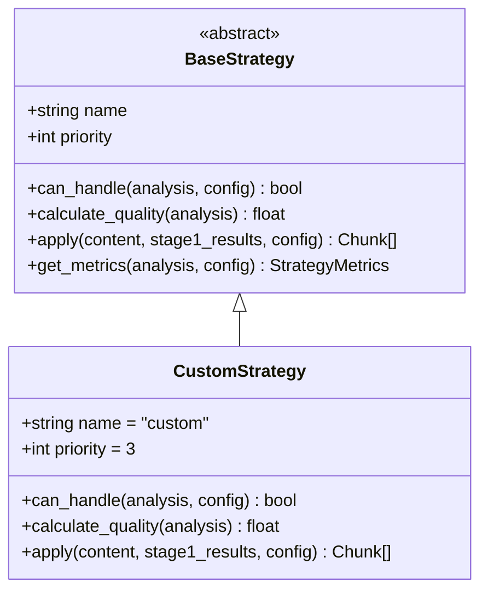

# Strategy Selection Mechanism

<cite>
**Referenced Files in This Document**
- [selector.py](file://markdown_chunker_legacy/chunker/selector.py)
- [types.py](file://markdown_chunker_legacy/chunker/types.py)
- [base.py](file://markdown_chunker_legacy/chunker/strategies/base.py)
- [code_strategy.py](file://markdown_chunker_legacy/chunker/strategies/code_strategy.py)
- [structural_strategy.py](file://markdown_chunker_legacy/chunker/strategies/structural_strategy.py)
- [sentences_strategy.py](file://markdown_chunker_legacy/chunker/strategies/sentences_strategy.py)
- [types.py](file://markdown_chunker_v2/types.py)
- [config.py](file://markdown_chunker_v2/config.py)
- [analyzer.py](file://markdown_chunker_legacy/parser/analyzer.py)
- [types.py](file://markdown_chunker_legacy/parser/types.py)
</cite>

## Table of Contents
1. [Introduction](#introduction)
2. [Architecture Overview](#architecture-overview)
3. [Content Analysis Foundation](#content-analysis-foundation)
4. [Strategy Metrics System](#strategy-metrics-system)
5. [Priority-Based Selection Process](#priority-based-selection-process)
6. [Strategy Selection Modes](#strategy-selection-modes)
7. [Configuration Parameters](#configuration-parameters)
8. [Decision Flow Implementation](#decision-flow-implementation)
9. [Fallback Mechanisms](#fallback-mechanisms)
10. [Customization Guidelines](#customization-guidelines)
11. [Performance Considerations](#performance-considerations)
12. [Troubleshooting Guide](#troubleshooting-guide)
13. [Conclusion](#conclusion)

## Introduction

The Strategy Selection Mechanism serves as the intelligent decision engine that determines the optimal chunking strategy for Markdown documents based on comprehensive content analysis. This sophisticated system employs a priority-based selection process that evaluates document characteristics against predefined thresholds to choose between specialized strategies including Code, List, Table, Structural, Sentences, and Mixed strategies.

The mechanism operates through a multi-stage evaluation process that begins with content analysis, computes quantitative metrics, evaluates strategy fitness, and ultimately selects the most appropriate strategy for optimal chunking results. This approach ensures that each document receives the most effective treatment based on its inherent structure and content composition.

## Architecture Overview

The strategy selection architecture consists of several interconnected components that work together to provide intelligent strategy selection:



**Diagram sources**
- [selector.py](file://markdown_chunker_legacy/chunker/selector.py#L22-L466)
- [types.py](file://markdown_chunker_legacy/chunker/types.py#L1055-L1079)
- [base.py](file://markdown_chunker_legacy/chunker/strategies/base.py#L16-L426)

**Section sources**
- [selector.py](file://markdown_chunker_legacy/chunker/selector.py#L22-L55)
- [types.py](file://markdown_chunker_legacy/chunker/types.py#L1055-L1079)

## Content Analysis Foundation

The foundation of strategy selection rests upon comprehensive content analysis that quantifies document properties using key metrics derived from the parsing stage.

### Core Content Metrics

The ContentAnalysis class provides essential metrics that drive strategy selection decisions:

| Metric | Purpose | Impact on Strategy Selection |
|--------|---------|----------------------------|
| `code_ratio` | Proportion of code content | Determines CodeStrategy applicability |
| `list_ratio` | Proportion of list content | Influences ListStrategy selection |
| `table_ratio` | Proportion of table content | Guides TableStrategy evaluation |
| `complexity_score` | Overall document complexity | Affects MixedStrategy suitability |
| `header_count` | Number of headers | Essential for StructuralStrategy |
| `max_header_depth` | Depth of header hierarchy | Critical for structural analysis |
| `has_mixed_content` | Content type diversity | Influences MixedStrategy consideration |

### Content Density Analysis

The system performs content density analysis to identify dominant content types:



**Diagram sources**
- [selector.py](file://markdown_chunker_legacy/chunker/selector.py#L236-L276)
- [analyzer.py](file://markdown_chunker_legacy/parser/analyzer.py#L177-L208)

**Section sources**
- [types.py](file://markdown_chunker_legacy/parser/types.py#L436-L884)
- [analyzer.py](file://markdown_chunker_legacy/parser/analyzer.py#L26-L207)

## Strategy Metrics System

The StrategyMetrics system provides quantitative evaluation of each strategy's suitability for a given document, enabling objective comparisons between competing strategies.

### Metrics Calculation Framework

Each strategy calculates multiple metrics that contribute to the final selection decision:



**Diagram sources**
- [base.py](file://markdown_chunker_legacy/chunker/strategies/base.py#L96-L127)
- [types.py](file://markdown_chunker_legacy/chunker/types.py#L1055-L1079)

### Quality Score Calculation

Quality scores are computed using a combination of content-specific factors:

| Strategy | Quality Factors | Scoring Formula |
|----------|----------------|-----------------|
| CodeStrategy | Code ratio, block count, language diversity | `min(0.8 + 0.2*(blocks≥10) + 0.15*(blocks≥5) + 0.1*(blocks≥3) + 0.1*(languages>1), 1.0)` |
| StructuralStrategy | Header count, hierarchy depth, structure clarity | `min(0.5*(headers≥10) + 0.4*(headers≥5) + 0.3*(headers≥3) + 0.3*(depth≥4) + 0.2*(depth≥3) + 0.1*(depth>1) + 0.2*(hierarchy), 1.0)` |
| SentencesStrategy | Content simplicity, structured content penalty | `max(0.3 - 0.1*(code>0.1) - 0.1*(headers>3) - 0.05*(lists>2) - 0.05*(tables>0) + 0.2*(text>0.8) + 0.1*(complexity<0.2), 0.0)` |

**Section sources**
- [base.py](file://markdown_chunker_legacy/chunker/strategies/base.py#L96-L127)
- [code_strategy.py](file://markdown_chunker_legacy/chunker/strategies/code_strategy.py#L136-L185)
- [structural_strategy.py](file://markdown_chunker_legacy/chunker/strategies/structural_strategy.py#L164-L220)

## Priority-Based Selection Process

The priority-based selection process ensures that strategies with higher priority are considered first, while maintaining flexibility for content-driven adaptations.

### Priority Hierarchy

Strategies are organized in a priority hierarchy where lower numbers indicate higher priority:



**Diagram sources**
- [selector.py](file://markdown_chunker_legacy/chunker/selector.py#L44-L45)
- [base.py](file://markdown_chunker_legacy/chunker/strategies/base.py#L37-L44)

### Content Density Preferences

The system incorporates content density preferences that influence strategy selection:

| Content Type | Preference Rule | Priority Impact |
|--------------|----------------|-----------------|
| Code-heavy | `code_ratio > 0.7 AND code_block_count >= 3` | Highest priority (CodeStrategy) |
| Structured | `header_count > 3 AND max_header_depth > 1` | High priority (StructuralStrategy) |
| List-heavy | `list_ratio > 0.5` | Medium priority (MixedStrategy) |
| Table-heavy | `table_count > 3 AND table_ratio >= 0.4` | Medium priority (TableStrategy) |

**Section sources**
- [selector.py](file://markdown_chunker_legacy/chunker/selector.py#L236-L276)
- [types.py](file://markdown_chunker_legacy/chunker/types.py#L588-L595)

## Strategy Selection Modes

The system supports two distinct selection modes that cater to different use cases and requirements.

### Strict Mode Selection

Strict mode follows a deterministic approach prioritizing strategy availability:



**Diagram sources**
- [selector.py](file://markdown_chunker_legacy/chunker/selector.py#L78-L149)

### Weighted Mode Selection

Weighted mode combines priority and quality scores for optimal strategy selection:



**Diagram sources**
- [selector.py](file://markdown_chunker_legacy/chunker/selector.py#L172-L234)

**Section sources**
- [selector.py](file://markdown_chunker_legacy/chunker/selector.py#L57-L76)
- [selector.py](file://markdown_chunker_legacy/chunker/selector.py#L78-L149)
- [selector.py](file://markdown_chunker_legacy/chunker/selector.py#L172-L234)

## Configuration Parameters

The system provides extensive configuration parameters that influence strategy selection thresholds and behavior.

### Core Threshold Parameters

| Parameter | Default Value | Purpose | Range |
|-----------|---------------|---------|-------|
| `code_ratio_threshold` | 0.3 | Minimum code ratio for CodeStrategy | 0.0 - 1.0 |
| `min_code_blocks` | 1 | Minimum code blocks for CodeStrategy | 1 - ∞ |
| `list_ratio_threshold` | 0.6 | Minimum list ratio for ListStrategy | 0.0 - 1.0 |
| `list_count_threshold` | 5 | Minimum list count for ListStrategy | 1 - ∞ |
| `table_ratio_threshold` | 0.4 | Minimum table ratio for TableStrategy | 0.0 - 1.0 |
| `table_count_threshold` | 3 | Minimum table count for TableStrategy | 1 - ∞ |
| `header_count_threshold` | 3 | Minimum headers for StructuralStrategy | 1 - ∞ |

### Advanced Configuration Options

The configuration system supports sophisticated parameter tuning:



**Diagram sources**
- [types.py](file://markdown_chunker_legacy/chunker/types.py#L500-L625)
- [config.py](file://markdown_chunker_v2/config.py#L38-L71)

**Section sources**
- [types.py](file://markdown_chunker_legacy/chunker/types.py#L500-L625)
- [config.py](file://markdown_chunker_v2/config.py#L38-L71)

## Decision Flow Implementation

The decision flow implements a sophisticated multi-stage process that transforms content analysis into strategy selection.

### Complete Selection Pipeline



**Diagram sources**
- [selector.py](file://markdown_chunker_legacy/chunker/selector.py#L57-L76)
- [selector.py](file://markdown_chunker_legacy/chunker/selector.py#L78-L149)
- [selector.py](file://markdown_chunker_legacy/chunker/selector.py#L172-L234)

### Safety Mechanisms

The system implements multiple safety mechanisms to ensure robust strategy selection:

| Safety Feature | Purpose | Implementation |
|----------------|---------|----------------|
| List Strategy Exclusion | Prevents mixed-content loss | Automatic filtering in strict mode |
| Fallback Validation | Ensures strategy availability | Always-available SentencesStrategy |
| Priority Validation | Prevents configuration errors | Unique priority enforcement |
| Content Type Validation | Validates strategy applicability | `can_handle()` method calls |

**Section sources**
- [selector.py](file://markdown_chunker_legacy/chunker/selector.py#L78-L149)
- [selector.py](file://markdown_chunker_legacy/chunker/selector.py#L368-L400)

## Fallback Mechanisms

The system implements comprehensive fallback mechanisms to ensure reliable strategy selection across diverse document types.

### Multi-Level Fallback System



**Diagram sources**
- [selector.py](file://markdown_chunker_legacy/chunker/selector.py#L129-L149)
- [base.py](file://markdown_chunker_legacy/chunker/strategies/base.py#L54-L56)

### Fallback Strategy Characteristics

The SentencesStrategy serves as the ultimate fallback with universal applicability:

| Aspect | Implementation | Benefits |
|--------|----------------|----------|
| Universal Availability | Always returns `can_handle=True` | Guaranteed fallback option |
| Quality Scoring | Lower scores for structured content | Encourages specialized strategies |
| Content Preservation | Maintains original content integrity | Prevents data loss |
| Performance | Optimized for any content type | Reliable under all conditions |

**Section sources**
- [sentences_strategy.py](file://markdown_chunker_legacy/chunker/strategies/sentences_strategy.py#L58-L74)
- [selector.py](file://markdown_chunker_legacy/chunker/selector.py#L129-L149)

## Customization Guidelines

The strategy selection mechanism provides extensive customization capabilities for domain-specific requirements.

### Domain-Specific Configurations

Different domains require tailored strategy selection parameters:

| Domain | Recommended Configuration | Rationale |
|--------|---------------------------|-----------|
| API Documentation | `code_threshold=0.5, structure_threshold=2` | Emphasize code content with moderate structure |
| Technical Tutorials | `code_threshold=0.3, structure_threshold=3` | Balanced approach for mixed content |
| Academic Papers | `structure_threshold=4, code_threshold=0.1` | Prioritize structural organization |
| Blog Posts | `structure_threshold=2, code_threshold=0.05` | Focus on readability and flow |

### Custom Strategy Integration

Adding custom strategies involves implementing the BaseStrategy interface:



**Diagram sources**
- [base.py](file://markdown_chunker_legacy/chunker/strategies/base.py#L16-L426)

### Strategy Validation

Custom strategies must pass validation requirements:

| Validation Rule | Purpose | Implementation |
|-----------------|---------|----------------|
| Unique Priority | Prevents conflicts | Priority uniqueness check |
| Priority Range | Ensures proper ordering | Priority ≥ 1 constraint |
| Method Implementation | Guarantees functionality | Abstract method enforcement |
| Quality Score Bounds | Maintains metric validity | 0.0 ≤ score ≤ 1.0 constraint |

**Section sources**
- [base.py](file://markdown_chunker_legacy/chunker/strategies/base.py#L16-L426)
- [selector.py](file://markdown_chunker_legacy/chunker/selector.py#L368-L400)

## Performance Considerations

The strategy selection mechanism is designed for efficient operation across various document sizes and complexities.

### Computational Complexity

| Operation | Complexity | Optimization Strategy |
|-----------|------------|----------------------|
| Content Analysis | O(n) | Single-pass analysis |
| Strategy Evaluation | O(s×n) | Early termination |
| Metric Calculation | O(1) per strategy | Cached calculations |
| Priority Sorting | O(s log s) | Pre-sorted strategies |

### Memory Efficiency

The system minimizes memory overhead through:

- Lazy evaluation of strategy metrics
- Minimal intermediate data structures
- Efficient content analysis caching
- Stream-based processing for large documents

### Scalability Features

- Configurable batch processing for multiple documents
- Parallel strategy evaluation support
- Adaptive timeout mechanisms
- Resource-aware fallback selection

## Troubleshooting Guide

Common issues and resolution strategies for strategy selection problems.

### Strategy Selection Issues

| Problem | Symptoms | Solution |
|---------|----------|----------|
| No suitable strategy found | `StrategySelectionError` | Lower thresholds or enable fallback |
| Incorrect strategy selected | Poor chunk quality | Adjust content analysis thresholds |
| Performance degradation | Slow strategy selection | Optimize content analysis or reduce strategies |
| Configuration errors | Validation failures | Review parameter ranges and constraints |

### Debugging Strategy Selection

Enable detailed logging to understand strategy selection decisions:

```python
# Enable debug logging
import logging
logging.getLogger('markdown_chunker.chunker.selector').setLevel(logging.DEBUG)

# Get strategy explanation
explanation = strategy_selector.explain_selection(analysis, config)
print(explanation)
```

### Common Configuration Problems

| Issue | Cause | Resolution |
|-------|-------|------------|
| High code ratio threshold | `code_ratio_threshold=0.7` | Lower to `0.3` for real-world documents |
| Insufficient code blocks | `min_code_blocks=3` | Reduce to `1` for sparse code documents |
| Missing headers | `header_count_threshold=3` | Lower for simple documents |
| List strategy exclusion | Automatic filtering | Use explicit strategy override |

**Section sources**
- [selector.py](file://markdown_chunker_legacy/chunker/selector.py#L151-L170)
- [selector.py](file://markdown_chunker_legacy/chunker/selector.py#L324-L366)

## Conclusion

The Strategy Selection Mechanism represents a sophisticated approach to intelligent document chunking that balances automation with configurability. Through comprehensive content analysis, quantitative metrics evaluation, and priority-based selection, the system reliably identifies the optimal chunking strategy for diverse Markdown documents.

Key strengths of the mechanism include:

- **Intelligent Adaptation**: Content-driven strategy selection based on comprehensive analysis
- **Robust Fallbacks**: Multi-level fallback system ensures reliable operation
- **Extensible Design**: Modular architecture supports custom strategies and configurations
- **Performance Optimization**: Efficient algorithms and caching minimize computational overhead
- **Domain Flexibility**: Extensive configuration options accommodate specialized use cases

The system's design philosophy emphasizes reliability and adaptability while maintaining the flexibility needed for diverse document types and application requirements. Future enhancements may include machine learning-based strategy selection and dynamic threshold adjustment based on historical performance data.