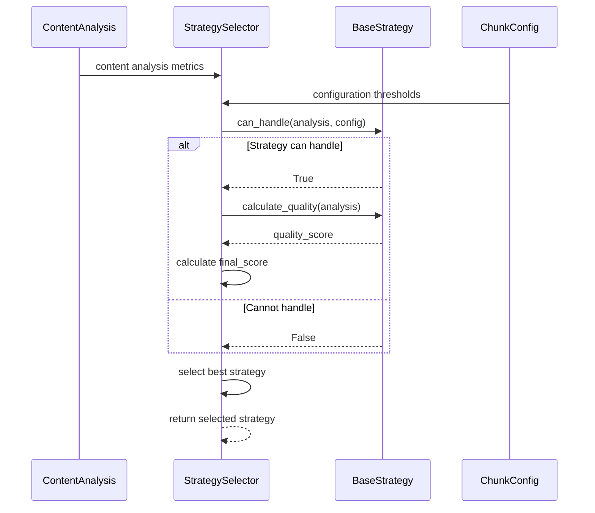
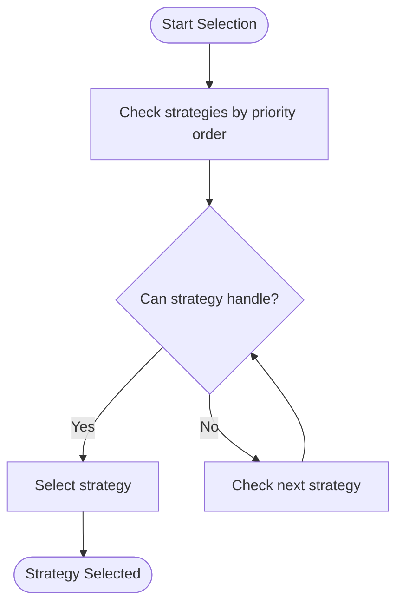
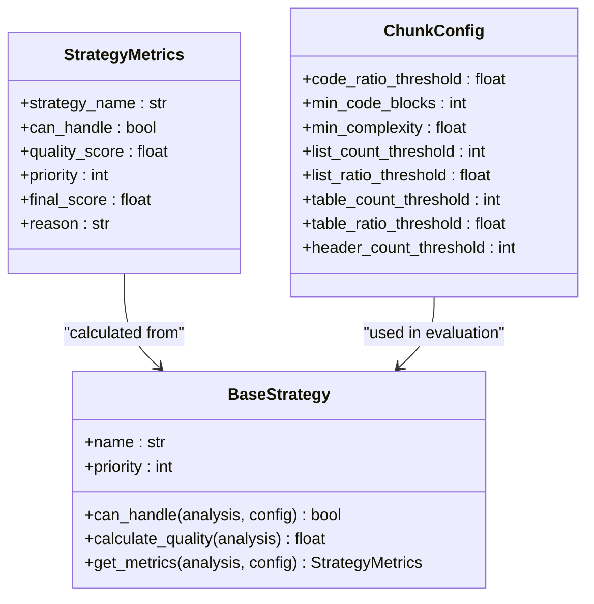
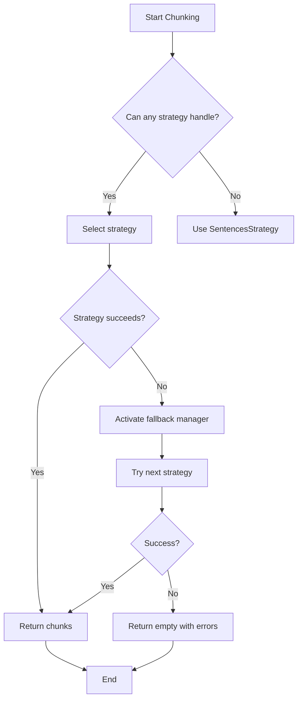

# Strategy Selection Mechanism

<cite>
**Referenced Files in This Document**   
- [selector.py](file://markdown_chunker/chunker/selector.py)
- [types.py](file://markdown_chunker/chunker/types.py)
- [base.py](file://markdown_chunker/chunker/strategies/base.py)
- [code_strategy.py](file://markdown_chunker/chunker/strategies/code_strategy.py)
- [mixed_strategy.py](file://markdown_chunker/chunker/strategies/mixed_strategy.py)
- [test_strategy_selector.py](file://tests/chunker/test_strategy_selector.py)
</cite>

## Table of Contents
1. [Introduction](#introduction)
2. [Strategy Selection Process](#strategy-selection-process)
3. [Content Analysis Metrics](#content-analysis-metrics)
4. [Selection Modes](#selection-modes)
5. [Strategy Scoring and Thresholds](#strategy-scoring-and-thresholds)
6. [Configuration Profiles](#configuration-profiles)
7. [Fallback Selection Logic](#fallback-selection-logic)
8. [Debugging Strategy Selection](#debugging-strategy-selection)
9. [Conclusion](#conclusion)

## Introduction
The strategy selection mechanism in the Markdown chunker enables adaptive chunking based on document characteristics. This system automatically selects the optimal chunking strategy by evaluating content analysis metrics against configurable thresholds. The selection process considers various document features such as code ratio, list count, table count, and complexity score to determine the most appropriate strategy for preserving semantic meaning while meeting size constraints. The mechanism supports both strict priority-based selection and weighted scoring approaches, allowing users to balance between performance and quality based on their specific use cases.

**Section sources**
- [selector.py](file://markdown_chunker/chunker/selector.py#L1-L322)

## Strategy Selection Process
The strategy selection process begins after Stage 1 content analysis, where the document is examined to extract key characteristics. The StrategySelector evaluates all available strategies against the content analysis results and configuration parameters to determine the best approach. Each strategy implements a `can_handle` method that checks whether the strategy can process the given content based on predefined thresholds. Strategies also provide a `calculate_quality` method that returns a score between 0.0 and 1.0 indicating how well-suited the strategy is for the content.

The selection process follows a two-phase approach: first determining applicability, then scoring. For applicable strategies, the system calculates a final score that combines the strategy's priority (inversely weighted) with its quality score. The selection mode determines how the final decision is made—either by selecting the first applicable strategy in priority order (strict mode) or by choosing the strategy with the highest combined score (weighted mode).



**Diagram sources**
- [selector.py](file://markdown_chunker/chunker/selector.py#L58-L134)
- [base.py](file://markdown_chunker/chunker/strategies/base.py#L47-L60)

**Section sources**
- [selector.py](file://markdown_chunker/chunker/selector.py#L58-L134)
- [base.py](file://markdown_chunker/chunker/strategies/base.py#L47-L60)

## Content Analysis Metrics
The strategy selection mechanism relies on a comprehensive set of content analysis metrics extracted during Stage 1 processing. These metrics provide quantitative measures of the document's characteristics, enabling the system to make informed decisions about the optimal chunking approach. Key metrics include:

- **code_ratio**: Proportion of content that consists of code blocks
- **code_block_count**: Number of code blocks in the document
- **list_count**: Number of list elements
- **list_ratio**: Proportion of content that consists of lists
- **table_count**: Number of tables
- **table_ratio**: Proportion of content that consists of tables
- **header_count**: Number of header elements
- **complexity_score**: Overall complexity of the document structure
- **has_mixed_content**: Boolean indicating whether multiple content types are present

These metrics are used by individual strategies to determine their applicability and quality score. For example, the CodeStrategy requires both a minimum code ratio (configurable via `code_ratio_threshold`) and a minimum number of code blocks (configurable via `min_code_blocks`) to be considered applicable. Similarly, the MixedStrategy evaluates whether the content is truly mixed by checking that no single content type dominates excessively.

**Section sources**
- [selector.py](file://markdown_chunker/chunker/selector.py#L198-L207)
- [types.py](file://markdown_chunker/chunker/types.py#L584-L592)

## Selection Modes
The strategy selection mechanism supports two distinct modes: strict and weighted. These modes offer different trade-offs between selection speed and optimization quality.

### Strict Mode
In strict mode, the selector evaluates strategies in priority order and selects the first strategy that can handle the content. This approach prioritizes performance and predictability, making it suitable for scenarios where processing speed is critical. The selection process stops as soon as an applicable strategy is found, without evaluating the quality of other potential strategies.



### Weighted Mode
In weighted mode, the selector evaluates all strategies and selects the one with the highest combined score. The final score combines the strategy's priority weight (1/priority) with its quality score using equal weighting: `(priority_weight * 0.5) + (quality_score * 0.5)`. This approach optimizes for quality by considering both how well-suited a strategy is for the content and its inherent priority.

The weighted mode is particularly useful when document characteristics are ambiguous or when multiple strategies could potentially handle the content effectively. It allows the system to make more nuanced decisions based on a comprehensive evaluation of all options.

**Section sources**
- [selector.py](file://markdown_chunker/chunker/selector.py#L74-L134)
- [base.py](file://markdown_chunker/chunker/strategies/base.py#L113-L116)

## Strategy Scoring and Thresholds
The strategy scoring system combines priority and quality metrics to determine the optimal strategy for a given document. Each strategy has a priority level (1=highest, 6=lowest) that reflects its general applicability and performance characteristics. The quality score, calculated by each strategy's `calculate_quality` method, indicates how well-suited the strategy is for the specific content being processed.

### Strategy Scoring Formula
The final selection score is calculated using the formula:
```
final_score = (priority_weight * 0.5) + (quality_score * 0.5)
```
where `priority_weight = 1.0 / strategy.priority`. This balanced approach ensures that both priority and quality contribute equally to the final decision.

### Threshold Configuration
The system uses configurable thresholds to determine strategy applicability:

- **CodeStrategy**: Requires `code_ratio >= code_ratio_threshold` (default: 0.3) and `code_block_count >= min_code_blocks` (default: 1)
- **MixedStrategy**: Requires mixed content with `complexity_score >= min_complexity` (default: 0.3)
- **ListStrategy**: Requires `list_count >= list_count_threshold` (default: 5) and `list_ratio >= list_ratio_threshold` (default: 0.6)
- **TableStrategy**: Requires `table_count >= table_count_threshold` (default: 3) and `table_ratio >= table_ratio_threshold` (default: 0.4)
- **StructuralStrategy**: Requires `header_count >= header_count_threshold` (default: 3)

These thresholds can be customized through the ChunkConfig object, allowing users to adapt the selection behavior to their specific requirements.



**Diagram sources**
- [types.py](file://markdown_chunker/chunker/types.py#L1040-L1045)
- [base.py](file://markdown_chunker/chunker/strategies/base.py#L113-L116)
- [types.py](file://markdown_chunker/chunker/types.py#L584-L592)

**Section sources**
- [base.py](file://markdown_chunker/chunker/strategies/base.py#L113-L116)
- [types.py](file://markdown_chunker/chunker/types.py#L584-L592)

## Configuration Profiles
The system provides several configuration profiles through factory methods on the ChunkConfig class, allowing users to quickly apply optimized settings for common use cases. These profiles pre-configure thresholds and other parameters to suit specific document types and processing requirements.

### Available Profiles
- **for_code_heavy()**: Optimized for code-heavy documents with larger chunk sizes (6144), aggressive code detection (code_ratio_threshold=0.5), and larger overlap (300) to maintain code context
- **for_structured_docs()**: Optimized for structured documentation with medium-sized chunks (3072), aggressive structural detection (header_count_threshold=2), and preserved list hierarchy
- **for_large_documents()**: Optimized for large documents with streaming enabled, large chunks (8192), and memory-efficient processing
- **default()**: Balanced settings suitable for most markdown documents with max_chunk_size=4096 and target_chunk_size=2048

Users can also create custom configurations by directly instantiating ChunkConfig with specific parameter values. This flexibility allows fine-tuning of the strategy selection behavior to match specific requirements, such as adjusting thresholds for different content types or modifying size limits for particular use cases.

**Section sources**
- [types.py](file://markdown_chunker/chunker/types.py#L694-L782)

## Fallback Selection Logic
The fallback selection logic ensures robust processing even when primary strategies cannot handle the content. The system includes a comprehensive fallback mechanism that activates when no strategy can process the document or when a selected strategy fails during execution.

The SentencesStrategy serves as the ultimate fallback strategy with the lowest priority (highest number), ensuring it is selected only when no other strategy can handle the content. This strategy can process any text content by splitting on sentence boundaries, providing a reliable baseline for chunking.

The fallback process follows a hierarchical approach:
1. Attempt primary strategy selection based on content analysis
2. If no strategy can handle the content, fall back to SentencesStrategy
3. If the selected strategy fails during execution, activate the fallback manager
4. The fallback manager attempts alternative strategies in order of priority
5. If all strategies fail, return an empty result with appropriate error messages

This multi-layered approach ensures maximum reliability while maintaining the quality of chunking for well-structured documents.



**Diagram sources**
- [selector.py](file://markdown_chunker/chunker/selector.py#L96-L98)
- [test_components/test_fallback_manager.py](file://tests/chunker/test_components/test_fallback_manager.py#L67-L370)

**Section sources**
- [selector.py](file://markdown_chunker/chunker/selector.py#L96-L98)
- [test_components/test_fallback_manager.py](file://tests/chunker/test_components/test_fallback_manager.py#L67-L370)

## Debugging Strategy Selection
When troubleshooting unexpected strategy choices, several tools and techniques are available to diagnose the selection process. The system provides comprehensive debugging capabilities through the `explain_selection` method, which returns a detailed explanation of why a particular strategy was selected.

### Debugging Tools
- **explain_selection()**: Returns a dictionary with the selected strategy, selection mode, content analysis metrics, and evaluation of all strategies
- **get_strategy_metrics()**: Provides detailed metrics for all strategies, including quality scores and final scores
- **get_applicable_strategies()**: Lists all strategies that can handle the content with their final scores
- **validate_strategies()**: Checks for configuration issues such as duplicate priorities or missing fallback strategies

### Common Issues and Solutions
- **CodeStrategy not selected for code-heavy documents**: Check that `code_ratio_threshold` and `min_code_blocks` are appropriately configured. The default `code_ratio_threshold` is 0.3, meaning at least 30% of the content must be code.
- **MixedStrategy selected instead of specialized strategies**: Verify that the content meets the threshold requirements for specialized strategies. The MixedStrategy may be selected if no single content type dominates sufficiently.
- **Unexpected fallback behavior**: Ensure the SentencesStrategy is properly configured as the fallback strategy with the lowest priority.

The logging system also provides detailed information about the selection process, with debug-level logs showing the evaluation of each strategy and info-level logs indicating the final selection.

**Section sources**
- [selector.py](file://markdown_chunker/chunker/selector.py#L181-L223)
- [test_strategy_selector.py](file://tests/chunker/test_strategy_selector.py#L188-L224)

## Conclusion
The strategy selection mechanism provides a sophisticated, adaptive approach to Markdown chunking that optimizes for both quality and performance. By evaluating content analysis metrics against configurable thresholds, the system automatically selects the most appropriate strategy for each document. The dual-mode selection (strict and weighted) offers flexibility for different use cases, while comprehensive configuration profiles simplify setup for common scenarios.

The integration of strategy scoring, fallback logic, and debugging tools creates a robust system that handles a wide variety of document types effectively. From code-heavy technical documentation to mixed-content articles, the mechanism adapts to preserve semantic meaning while meeting size constraints. This adaptive approach ensures optimal chunking results across diverse content types and use cases.

**Section sources**
- [selector.py](file://markdown_chunker/chunker/selector.py#L1-L322)
- [base.py](file://markdown_chunker/chunker/strategies/base.py#L1-L380)