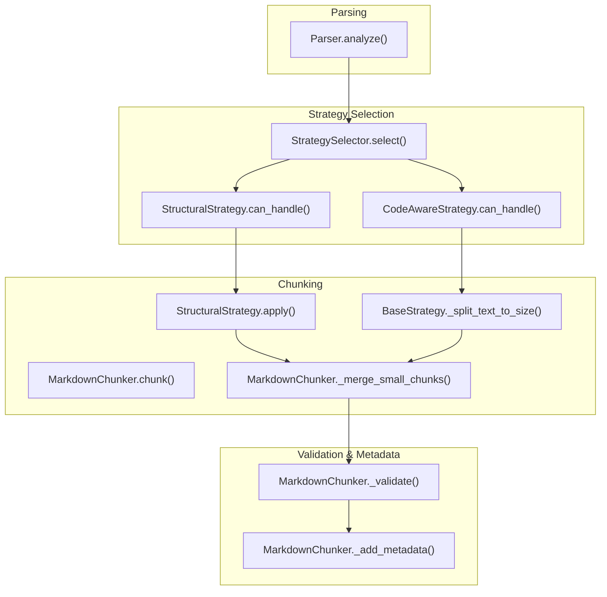
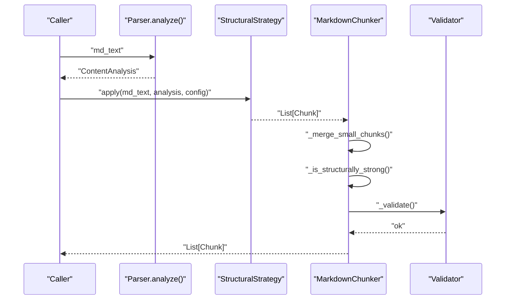
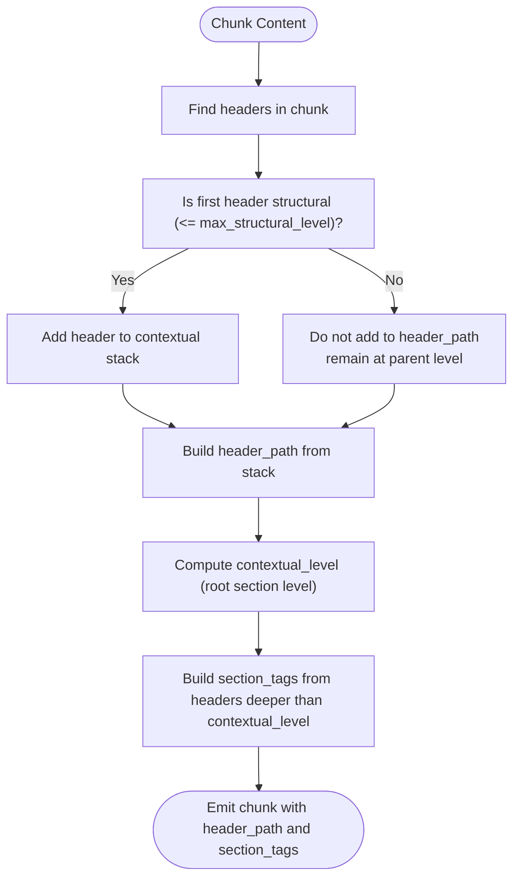
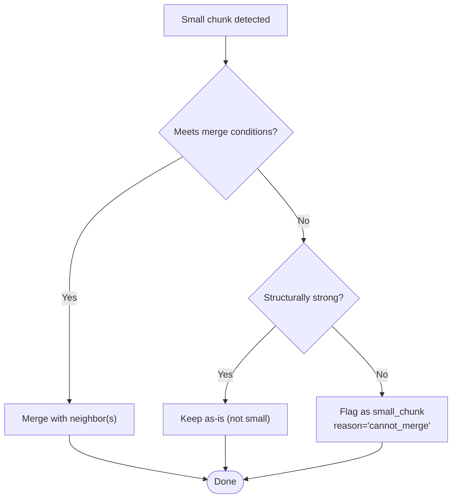
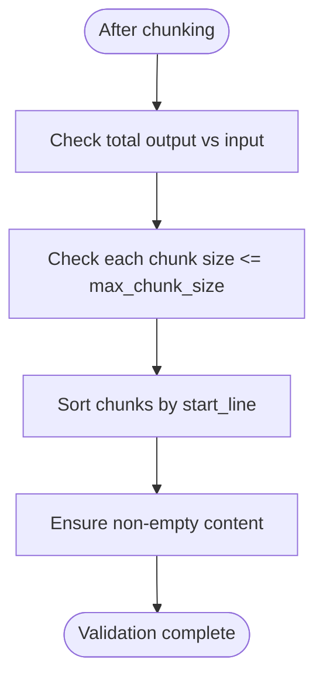
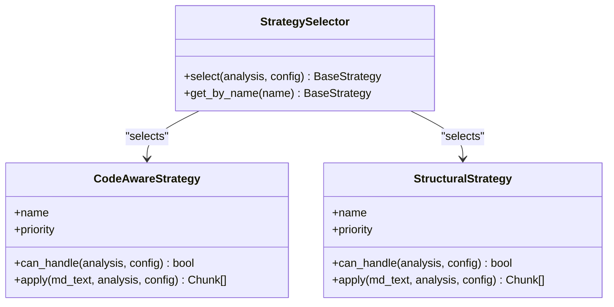
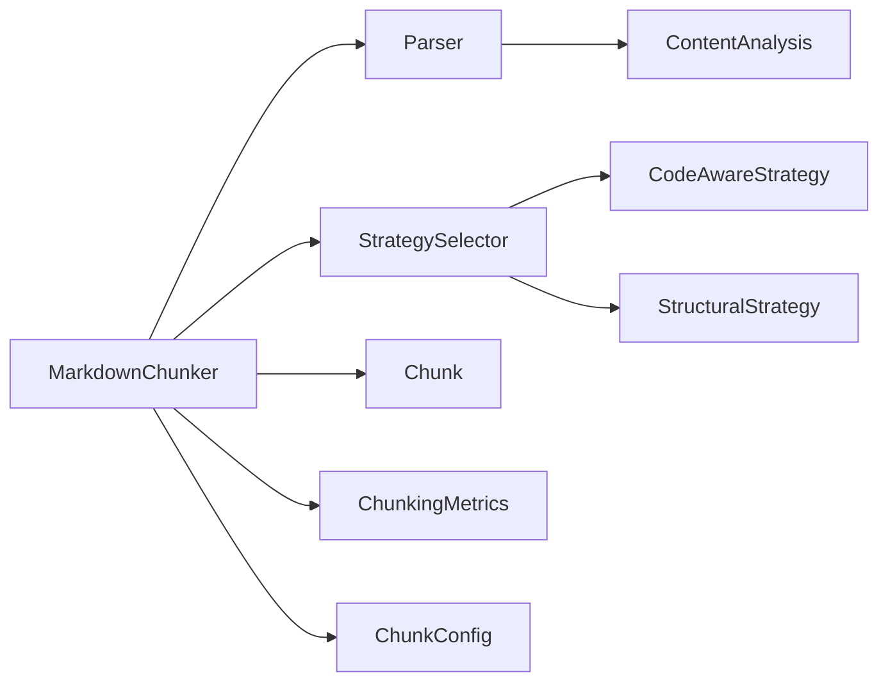

# Structural Strength Evaluation

<cite>
**Referenced Files in This Document**
- [markdown_chunker_v2/chunker.py](file://markdown_chunker_v2/chunker.py)
- [markdown_chunker_v2/strategies/structural.py](file://markdown_chunker_v2/strategies/structural.py)
- [markdown_chunker_v2/strategies/base.py](file://markdown_chunker_v2/strategies/base.py)
- [markdown_chunker_v2/strategies/__init__.py](file://markdown_chunker_v2/strategies/__init__.py)
- [markdown_chunker_v2/parser.py](file://markdown_chunker_v2/parser.py)
- [markdown_chunker_v2/types.py](file://markdown_chunker_v2/types.py)
- [markdown_chunker_v2/config.py](file://markdown_chunker_v2/config.py)
- [tests/test_structural_strength.py](file://tests/test_structural_strength.py)
- [docs/research/09_final_report.md](file://docs/research/09_final_report.md)
- [docs/architecture-audit/02-code-analysis.md](file://docs/architecture-audit/02-code-analysis.md)
- [docs/architecture-audit/03-data-flow-issues.md](file://docs/architecture-audit/03-data-flow-issues.md)
</cite>

## Table of Contents
1. [Introduction](#introduction)
2. [Project Structure](#project-structure)
3. [Core Components](#core-components)
4. [Architecture Overview](#architecture-overview)
5. [Detailed Component Analysis](#detailed-component-analysis)
6. [Dependency Analysis](#dependency-analysis)
7. [Performance Considerations](#performance-considerations)
8. [Troubleshooting Guide](#troubleshooting-guide)
9. [Conclusion](#conclusion)
10. [Appendices](#appendices)

## Introduction
This document evaluates the structural strength of the markdown chunker’s small chunk handling logic. It focuses on how the system identifies structurally weak versus structurally strong small chunks to avoid false positives in downstream RAG pipelines. The evaluation covers the design rationale, implementation details, validation logic, and integration points across parsing, strategy selection, chunking, and post-processing.

## Project Structure
The structural strength evaluation spans several modules:
- Parser: extracts headers, code blocks, and tables; computes content metrics and preamble detection.
- Strategies: selection and application of chunking strategies (code-aware, structural, fallback).
- Chunker: orchestrates parsing, strategy selection, chunk application, merging, overlap, metadata enrichment, and validation.
- Types and Config: shared data structures and configuration for sizing, thresholds, and behavior.
- Tests: unit tests validating structural strength logic and small chunk flagging behavior.

**Diagram sources**
- [markdown_chunker_v2/parser.py](file://markdown_chunker_v2/parser.py#L38-L81)
- [markdown_chunker_v2/strategies/__init__.py](file://markdown_chunker_v2/strategies/__init__.py#L30-L59)
- [markdown_chunker_v2/strategies/structural.py](file://markdown_chunker_v2/strategies/structural.py#L51-L80)
- [markdown_chunker_v2/chunker.py](file://markdown_chunker_v2/chunker.py#L43-L106)
- [markdown_chunker_v2/chunker.py](file://markdown_chunker_v2/chunker.py#L223-L262)
- [markdown_chunker_v2/chunker.py](file://markdown_chunker_v2/chunker.py#L564-L588)

**Section sources**
- [markdown_chunker_v2/parser.py](file://markdown_chunker_v2/parser.py#L38-L81)
- [markdown_chunker_v2/strategies/__init__.py](file://markdown_chunker_v2/strategies/__init__.py#L30-L59)
- [markdown_chunker_v2/chunker.py](file://markdown_chunker_v2/chunker.py#L43-L106)

## Core Components
- Parser: Normalizes line endings, extracts headers, code blocks, and tables, and computes metrics including code ratio, header count, max header depth, and preamble detection.
- StrategySelector: Chooses among CodeAwareStrategy, StructuralStrategy, and FallbackStrategy based on document characteristics and thresholds.
- StructuralStrategy: Splits by headers, builds header_path and section_tags, and creates chunks with structural context.
- MarkdownChunker: Orchestrates the pipeline, merges small chunks, applies overlap, enriches metadata, validates domain properties, and returns chunks.
- Types and Config: Define Chunk, ContentAnalysis, ChunkingMetrics, and ChunkConfig with size bounds, thresholds, and overlap behavior.

Key structural strength indicators used during small chunk evaluation:
- Presence of header level 2 or 3 within the chunk.
- Multiple paragraph breaks (double newline).
- Non-header content line count ≥ 3.
- Non-header content length > 100 characters.

**Section sources**
- [markdown_chunker_v2/parser.py](file://markdown_chunker_v2/parser.py#L38-L81)
- [markdown_chunker_v2/strategies/structural.py](file://markdown_chunker_v2/strategies/structural.py#L51-L80)
- [markdown_chunker_v2/chunker.py](file://markdown_chunker_v2/chunker.py#L263-L308)
- [markdown_chunker_v2/chunker.py](file://markdown_chunker_v2/chunker.py#L422-L468)
- [markdown_chunker_v2/types.py](file://markdown_chunker_v2/types.py#L100-L180)
- [markdown_chunker_v2/config.py](file://markdown_chunker_v2/config.py#L12-L46)

## Architecture Overview
The structural strength evaluation is embedded within the small chunk merging and flagging logic. The flow is:
1. Parser produces ContentAnalysis with headers, code blocks, tables, and metrics.
2. StrategySelector selects StructuralStrategy when headers exceed thresholds and depth > 1.
3. StructuralStrategy splits by headers, builds header_path and section_tags, and emits chunks.
4. MarkdownChunker merges small chunks, preferring merges within the same logical section and honoring preamble separation.
5. Structural strength is evaluated for small chunks; if structurally strong, they are not flagged as small.
6. Validation enforces monotonic ordering and size bounds; metadata enrichment adds chunk_index, content_type, has_code, header_path, and strategy.

**Diagram sources**
- [markdown_chunker_v2/parser.py](file://markdown_chunker_v2/parser.py#L38-L81)
- [markdown_chunker_v2/strategies/structural.py](file://markdown_chunker_v2/strategies/structural.py#L60-L167)
- [markdown_chunker_v2/chunker.py](file://markdown_chunker_v2/chunker.py#L263-L308)
- [markdown_chunker_v2/chunker.py](file://markdown_chunker_v2/chunker.py#L422-L468)
- [markdown_chunker_v2/chunker.py](file://markdown_chunker_v2/chunker.py#L223-L262)

## Detailed Component Analysis

### Structural Strategy and Header Path Semantics
StructuralStrategy builds header_path and section_tags with explicit semantics:
- header_path: structural context reflecting where in the document tree a chunk sits.
- section_tags: local sections inside a chunk (children of the root section), determined relative to contextual_level.

It also handles:
- Preamble detection and special header_path for preamble chunks.
- Splitting large sections into sub-chunks while inheriting the parent section’s header_path.
- Determining contextual header stack from headers before chunk start, with max_structural_level affecting chunk boundaries but not header_path construction.

**Diagram sources**
- [markdown_chunker_v2/strategies/structural.py](file://markdown_chunker_v2/strategies/structural.py#L390-L481)

**Section sources**
- [markdown_chunker_v2/strategies/structural.py](file://markdown_chunker_v2/strategies/structural.py#L168-L270)
- [markdown_chunker_v2/strategies/structural.py](file://markdown_chunker_v2/strategies/structural.py#L271-L339)
- [markdown_chunker_v2/strategies/structural.py](file://markdown_chunker_v2/strategies/structural.py#L340-L389)
- [markdown_chunker_v2/strategies/structural.py](file://markdown_chunker_v2/strategies/structural.py#L390-L481)

### Small Chunk Flagging and Structural Strength Logic
MarkdownChunker’s small chunk handling:
- Phase 1: Merge small header-only chunks with their section body when conditions are met.
- Phase 2: For remaining small chunks, attempt merges with adjacent chunks while respecting max_chunk_size and preamble separation.
- If a small chunk cannot be merged and is structurally weak, flag it as small_chunk with reason "cannot_merge".
- Structural strength is evaluated using:
  - Presence of header level 2 or 3.
  - Multiple paragraph breaks (≥ 2).
  - Non-header content line count ≥ 3.
  - Non-header content length > 100 characters.

**Diagram sources**
- [markdown_chunker_v2/chunker.py](file://markdown_chunker_v2/chunker.py#L263-L308)
- [markdown_chunker_v2/chunker.py](file://markdown_chunker_v2/chunker.py#L422-L468)
- [markdown_chunker_v2/chunker.py](file://markdown_chunker_v2/chunker.py#L469-L536)

**Section sources**
- [markdown_chunker_v2/chunker.py](file://markdown_chunker_v2/chunker.py#L263-L308)
- [markdown_chunker_v2/chunker.py](file://markdown_chunker_v2/chunker.py#L422-L468)
- [markdown_chunker_v2/chunker.py](file://markdown_chunker_v2/chunker.py#L469-L536)

### Validation and Domain Properties
The validator enforces:
- No content loss (relaxed check with tolerance).
- Size bounds enforcement; oversized chunks are flagged with reasons (code_block_integrity, table_integrity, section_integrity).
- Monotonic ordering correction by sorting chunks by start_line.
- Chunk.__post_init__ ensures valid line numbers and non-empty content.

**Diagram sources**
- [markdown_chunker_v2/chunker.py](file://markdown_chunker_v2/chunker.py#L223-L262)
- [markdown_chunker_v2/types.py](file://markdown_chunker_v2/types.py#L155-L163)

**Section sources**
- [markdown_chunker_v2/chunker.py](file://markdown_chunker_v2/chunker.py#L223-L262)
- [markdown_chunker_v2/types.py](file://markdown_chunker_v2/types.py#L155-L163)

### Strategy Selection and Thresholds
StrategySelector chooses:
- CodeAwareStrategy when code blocks or tables are present or code_ratio exceeds threshold.
- StructuralStrategy when header_count ≥ structure_threshold and max_header_depth > 1.
- FallbackStrategy otherwise.

**Diagram sources**
- [markdown_chunker_v2/strategies/__init__.py](file://markdown_chunker_v2/strategies/__init__.py#L30-L59)
- [markdown_chunker_v2/strategies/code_aware.py](file://markdown_chunker_v2/strategies/code_aware.py#L33-L41)
- [markdown_chunker_v2/strategies/structural.py](file://markdown_chunker_v2/strategies/structural.py#L51-L59)

**Section sources**
- [markdown_chunker_v2/strategies/__init__.py](file://markdown_chunker_v2/strategies/__init__.py#L30-L59)
- [markdown_chunker_v2/strategies/code_aware.py](file://markdown_chunker_v2/strategies/code_aware.py#L33-L41)
- [markdown_chunker_v2/strategies/structural.py](file://markdown_chunker_v2/strategies/structural.py#L51-L59)

### Tests for Structural Strength
The test suite validates:
- Chunks with level 2 or 3 headers are not flagged as small.
- Multi-paragraph chunks are not flagged as small.
- Chunks with sufficient non-header lines are not flagged as small.
- Chunks with meaningful non-header content (>100 chars) are not flagged as small.
- Structurally weak small chunks may be flagged appropriately.
- Lists are not currently considered structural strength indicators.

**Section sources**
- [tests/test_structural_strength.py](file://tests/test_structural_strength.py#L12-L141)
- [tests/test_structural_strength.py](file://tests/test_structural_strength.py#L143-L266)

## Dependency Analysis
- Parser depends on regex patterns to extract code blocks, headers, and tables; it normalizes line endings early.
- StructuralStrategy depends on ContentAnalysis and uses BaseStrategy helpers for chunk creation and splitting.
- MarkdownChunker composes Parser, StrategySelector, and strategies; it also manages overlap, metadata enrichment, and validation.
- Types and Config define shared structures and constraints.

**Diagram sources**
- [markdown_chunker_v2/parser.py](file://markdown_chunker_v2/parser.py#L38-L81)
- [markdown_chunker_v2/strategies/__init__.py](file://markdown_chunker_v2/strategies/__init__.py#L30-L59)
- [markdown_chunker_v2/chunker.py](file://markdown_chunker_v2/chunker.py#L43-L106)
- [markdown_chunker_v2/types.py](file://markdown_chunker_v2/types.py#L100-L180)
- [markdown_chunker_v2/config.py](file://markdown_chunker_v2/config.py#L12-L46)

**Section sources**
- [markdown_chunker_v2/parser.py](file://markdown_chunker_v2/parser.py#L38-L81)
- [markdown_chunker_v2/strategies/__init__.py](file://markdown_chunker_v2/strategies/__init__.py#L30-L59)
- [markdown_chunker_v2/chunker.py](file://markdown_chunker_v2/chunker.py#L43-L106)
- [markdown_chunker_v2/types.py](file://markdown_chunker_v2/types.py#L100-L180)
- [markdown_chunker_v2/config.py](file://markdown_chunker_v2/config.py#L12-L46)

## Performance Considerations
- Parsing performs linear scans with regex-based extraction; complexity is O(n) in document length.
- Strategy selection is O(1) with constant-time checks against ContentAnalysis.
- StructuralStrategy splits by headers and uses paragraph-aware splitting; worst-case complexity scales with content size.
- Small chunk merging iterates through chunks once; complexity is O(k) where k is number of chunks.
- Overlap extraction operates in O(k) and respects word boundaries to minimize fragmentation.

[No sources needed since this section provides general guidance]

## Troubleshooting Guide
Common issues and resolutions:
- Unexpected small_chunk flags: Verify structural strength indicators (header level, paragraph breaks, non-header content length/lines). Adjust min_chunk_size or structure_threshold if needed.
- Oversized chunks: Check allow_oversize metadata and reason (code_block_integrity, table_integrity, section_integrity). Consider increasing max_chunk_size or disabling preserve_atomic_blocks if appropriate.
- Incorrect ordering: The validator sorts by start_line; ensure inputs are parsed with normalized line endings.
- Preamble separation: Preamble chunks are separated and receive special header_path; confirm extract_preamble setting.

**Section sources**
- [markdown_chunker_v2/chunker.py](file://markdown_chunker_v2/chunker.py#L223-L262)
- [markdown_chunker_v2/chunker.py](file://markdown_chunker_v2/chunker.py#L564-L588)
- [markdown_chunker_v2/config.py](file://markdown_chunker_v2/config.py#L12-L46)

## Conclusion
The structural strength evaluation prevents false positives by combining header semantics, paragraph structure, and textual density heuristics. Together with strategy selection, overlap-aware chunking, and robust validation, the system maintains high-quality chunk boundaries suitable for RAG applications. The design choices—explicit header_path and section_tags, careful small chunk merging, and oversize metadata—support both structural and content-aware chunking.

[No sources needed since this section summarizes without analyzing specific files]

## Appendices

### Recommendations for Further Enhancement
- Introduce list-awareness as a structural strength indicator to reduce false positives on compact but meaningful list-heavy sections.
- Add adaptive sizing to tailor chunk sizes to content complexity.
- Consider semantic boundary detection to improve chunk coherence across paragraphs.

**Section sources**
- [docs/research/09_final_report.md](file://docs/research/09_final_report.md#L37-L110)
- [docs/research/09_final_report.md](file://docs/research/09_final_report.md#L174-L221)

### Architectural Audit Notes
- The current v2 pipeline consolidates parsing, strategy selection, and post-processing into a linear flow, reducing duplication compared to earlier designs.
- Legacy mechanisms (e.g., dual overlap managers and repeated preamble processing) were simplified in v2.

**Section sources**
- [docs/architecture-audit/02-code-analysis.md](file://docs/architecture-audit/02-code-analysis.md#L70-L120)
- [docs/architecture-audit/03-data-flow-issues.md](file://docs/architecture-audit/03-data-flow-issues.md#L204-L233)