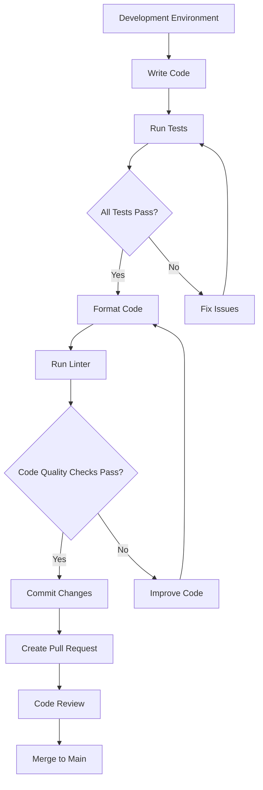
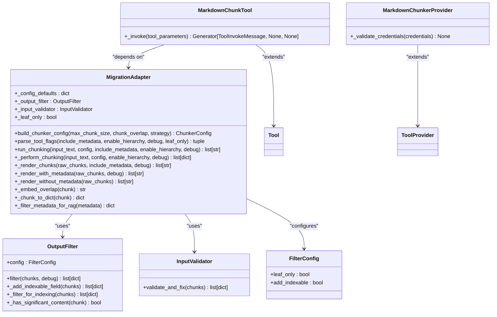

# Developer Resources

<cite>
**Referenced Files in This Document**   
- [CONTRIBUTING.md](file://CONTRIBUTING.md)
- [DEVELOPMENT.md](file://DEVELOPMENT.md)
- [Makefile](file://Makefile)
- [requirements.txt](file://requirements.txt)
- [pytest.ini](file://pytest.ini)
- [run_test.sh](file://run_test.sh)
- [main.py](file://main.py)
- [adapter.py](file://adapter.py)
- [input_validator.py](file://input_validator.py)
- [output_filter.py](file://output_filter.py)
- [manifest.yaml](file://manifest.yaml)
- [provider/markdown_chunker.py](file://provider/markdown_chunker.py)
- [tools/markdown_chunk_tool.py](file://tools/markdown_chunk_tool.py)
- [tests/test_migration_adapter.py](file://tests/test_migration_adapter.py)
- [tests/test_integration_basic.py](file://tests/test_integration_basic.py)
- [tests/test_error_handling.py](file://tests/test_error_handling.py)
</cite>

## Table of Contents
1. [Development Environment Setup](#development-environment-setup)
2. [Contribution Guidelines](#contribution-guidelines)
3. [Testing Strategy](#testing-strategy)
4. [Codebase Structure](#codebase-structure)
5. [Debugging and Performance](#debugging-and-performance)
6. [Code Quality Tools](#code-quality-tools)

## Development Environment Setup

The dify-markdown-chunker-1 project uses a Makefile-driven development workflow with Python virtual environments for dependency isolation. The setup process follows standard Python development practices with additional tooling for plugin packaging.

To set up the development environment:

1. Clone the repository and create a virtual environment:
```bash
git clone https://github.com/yourusername/dify-markdown-chunker.git
cd dify-markdown-chunker
python3.12 -m venv venv
source venv/bin/activate  # Linux/Mac
# or
venv\Scripts\activate  # Windows
```

2. Install dependencies using the Makefile:
```bash
make install
```

The Makefile provides several convenience targets for development setup:
- `make venv`: Creates a Python virtual environment
- `make setup`: Creates venv and installs all dependencies (equivalent to venv + install-dev)
- `make install`: Installs runtime dependencies (requires existing venv)
- `make install-dev`: Instains development tools (linters, formatters)
- `make install-dify-plugin`: Installs the dify-plugin CLI tool

The project's dependencies are defined in requirements.txt, which includes both runtime and optional development dependencies. Runtime dependencies include the core chunkana library, markdown processing libraries (markdown-it-py, mistune, markdown2), and configuration handling (PyYAML, pydantic). Development dependencies (listed as comments) include testing and code quality tools like pytest, black, isort, flake8, and mypy.

**Section sources**
- [DEVELOPMENT.md](file://DEVELOPMENT.md#L15-L37)
- [Makefile](file://Makefile#L45-L65)
- [requirements.txt](file://requirements.txt#L1-L22)

## Contribution Guidelines

Contributions to dify-markdown-chunker-1 follow a structured workflow designed to maintain code quality and consistency. The contribution process is documented in CONTRIBUTING.md and DEVELOPMENT.md, with key guidelines covering code style, testing, documentation, and pull request management.

The development workflow consists of:
1. Creating a feature branch from the main branch
2. Making changes with comprehensive tests
3. Running tests, formatting, and linting
4. Validating the structure
5. Submitting a pull request with a clear description

Code style guidelines require adherence to PEP 8, with type hints for all functions and docstrings for public APIs. The project uses a commit message format with specific types:
- `feat`: New feature
- `fix`: Bug fix
- `docs`: Documentation changes
- `style`: Code style changes
- `refactor`: Code refactoring
- `test`: Test changes
- `chore`: Build/tooling changes

Pull requests should be focused, addressing a single feature or fix. Contributors must update documentation, including README.md and CHANGELOG.md, and ensure all tests pass before submission. The project emphasizes small, focused PRs with clear commit messages that reference related issues.

**Section sources**
- [CONTRIBUTING.md](file://CONTRIBUTING.md#L1-L196)
- [DEVELOPMENT.md](file://DEVELOPMENT.md#L371-L393)

## Testing Strategy

The dify-markdown-chunker-1 project employs a comprehensive testing strategy with multiple test categories to ensure reliability and correctness. The test suite consists of unit tests, integration tests, and property-based tests, with a total of 445 tests providing extensive coverage.

Tests are organized in the tests/ directory with a clear structure:
- `test_migration_adapter.py`: Tests for the migration adapter functionality
- `test_integration_basic.py`: Basic integration tests for core functionality
- `test_error_handling.py`: Tests for error handling and validation
- `test_provider_class.py`: Tests for the provider class
- `test_tool_yaml.py`: Tests for tool YAML configuration

The project uses pytest as the testing framework, configured through pytest.ini. Key pytest configuration includes:
- Test discovery in the tests directory
- Strict markers for test categorization (slow, integration, unit, blocker)
- Warning filters to ignore expected deprecation warnings from dependencies
- Verbose output by default

Property-based testing is implemented using the Hypothesis library, providing formal correctness guarantees by testing universal properties with generated data. Integration tests verify end-to-end workflows, ensuring the plugin functions correctly within the Dify ecosystem.

Test execution is managed through the Makefile with several targets:
- `make test`: Runs all tests
- `make test-quick`: Runs quick migration tests only
- `make test-coverage`: Runs tests with coverage reporting
- `make test-verbose`: Runs tests with verbose output

The run_test.sh script provides an alternative method to run tests, activating the virtual environment and executing a specific test file.



**Diagram sources**
- [CONTRIBUTING.md](file://CONTRIBUTING.md#L29-L43)
- [pytest.ini](file://pytest.ini#L1-L37)
- [run_test.sh](file://run_test.sh#L1-L6)

**Section sources**
- [CONTRIBUTING.md](file://CONTRIBUTING.md#L179-L196)
- [pytest.ini](file://pytest.ini#L1-L37)
- [run_test.sh](file://run_test.sh#L1-L6)
- [tests/test_migration_adapter.py](file://tests/test_migration_adapter.py#L1-L189)
- [tests/test_integration_basic.py](file://tests/test_integration_basic.py#L1-L233)
- [tests/test_error_handling.py](file://tests/test_error_handling.py#L1-L111)

## Codebase Structure

The dify-markdown-chunker-1 codebase follows a modular architecture with clear separation of concerns between components. The core structure consists of entry points, adapters, utilities, and configuration files that work together to provide advanced markdown chunking capabilities.

The main components are:
- **main.py**: Entry point that initializes the Dify plugin with a 300-second timeout for processing large documents
- **adapter.py**: Migration adapter that provides compatibility between the plugin interface and the chunkana library
- **input_validator.py**: Validates and fixes data from the chunkana library to ensure resilience to library changes
- **output_filter.py**: Filters hierarchical output for downstream consumers, preventing accidental indexing of technical nodes
- **provider/markdown_chunker.py**: Provider class that manages the tool with no required credentials
- **tools/markdown_chunk_tool.py**: Implements the core tool functionality for chunking markdown documents

The adapter pattern is central to the architecture, with MigrationAdapter providing a compatibility layer between the plugin's tool interface and the chunkana library. This adapter handles parameter mapping, input validation, output filtering, and backward compatibility. The two-stage processing pipeline separates chunking (boundary-invariant) from rendering (format-dependent), ensuring consistent behavior across different output formats.

Configuration is managed through multiple files:
- **manifest.yaml**: Plugin metadata including version, author, and resource requirements
- **requirements.txt**: Python dependencies
- **Makefile**: Development and build automation
- **pytest.ini**: Test configuration

The project uses a hierarchical chunking model with parent-child relationships between chunks, supporting both flat and hierarchical modes. When hierarchical mode is enabled, chunks are organized in a tree structure with root, internal, and leaf nodes, allowing for multi-level retrieval and programmatic navigation.



**Diagram sources**
- [main.py](file://main.py#L1-L38)
- [adapter.py](file://adapter.py#L43-L352)
- [input_validator.py](file://input_validator.py#L14-L46)
- [output_filter.py](file://output_filter.py#L24-L116)
- [manifest.yaml](file://manifest.yaml#L1-L49)
- [provider/markdown_chunker.py](file://provider/markdown_chunker.py#L15-L36)
- [tools/markdown_chunk_tool.py](file://tools/markdown_chunk_tool.py#L29-L126)

**Section sources**
- [main.py](file://main.py#L1-L38)
- [adapter.py](file://adapter.py#L43-L352)
- [input_validator.py](file://input_validator.py#L14-L46)
- [output_filter.py](file://output_filter.py#L24-L116)
- [manifest.yaml](file://manifest.yaml#L1-L49)
- [provider/markdown_chunker.py](file://provider/markdown_chunker.py#L15-L36)
- [tools/markdown_chunk_tool.py](file://tools/markdown_chunk_tool.py#L29-L126)

## Debugging and Performance

The dify-markdown-chunker-1 project includes comprehensive debugging and performance monitoring capabilities to assist developers in troubleshooting and optimizing the codebase.

Debugging is supported through a dedicated debug mode that can be enabled by creating a .env file from the .env.example template and configuring debug parameters. The debug process involves:
1. Creating a .env file from .env.example
2. Obtaining a debug key from the Dify UI (Settings → Plugins → Debug Mode)
3. Updating the .env file with the debug key and host information
4. Running the plugin with python main.py

When debug mode is enabled, the plugin connects to a remote Dify instance for real-time debugging. It's important to delete the .env file before packaging to prevent accidental exposure of debug credentials.

Performance considerations are addressed through several mechanisms:
- The plugin is configured with a 300-second timeout to handle large documents
- Memory usage is optimized through streaming processing for large files
- The chunkana library provides performance benchmarks and automated regression detection
- Hierarchical chunking supports O(1) chunk lookup performance

The project includes performance testing through the Makefile, though benchmark targets are currently disabled in the production release. Developers can monitor performance through the comprehensive test suite, which includes performance benchmarks in the research documentation.

For troubleshooting common issues, the DEVELOPMENT.md file provides specific solutions:
- "tool icon not found" errors are resolved by ensuring correct icon paths in YAML files
- "Plugin package size is too large" errors are fixed by verifying venv/ is in .gitignore
- Tag validation errors are resolved by using only standard tags (productivity, business, etc.)

**Section sources**
- [DEVELOPMENT.md](file://DEVELOPMENT.md#L187-L215)
- [main.py](file://main.py#L23-L24)
- [DEVELOPMENT.md](file://DEVELOPMENT.md#L281-L328)

## Code Quality Tools

The dify-markdown-chunker-1 project enforces code quality through a suite of automated tools configured in the Makefile and configuration files. These tools ensure consistent code style, proper formatting, and high code quality standards across the codebase.

The primary code quality tools are:
- **flake8**: Python style guide enforcement (PEP 8)
- **black**: Code formatter with 88-character line length
- **isort**: Import sorting with black profile
- **mypy**: Static type checking
- **pytest-cov**: Test coverage reporting

These tools are integrated into the development workflow through Makefile targets:
- `make lint`: Runs flake8 on adapter.py and tools/
- `make format`: Formats code with black and sorts imports with isort
- `make quality-check`: Runs linting and type checking
- `make test-coverage`: Generates test coverage reports

The flake8 configuration is defined in .flake8, enforcing PEP 8 compliance with specific rules for complexity and line length. The project uses black for code formatting with a line length of 88 characters, following modern Python conventions. Import sorting is handled by isort with the black profile to ensure consistent import organization.

Code quality checks are designed to be non-blocking for development while providing clear feedback on potential issues. The lint target uses --exit-zero to prevent failures on non-critical issues, allowing developers to focus on critical errors. Type checking with mypy is run with --ignore-missing-imports to accommodate dynamic imports in the plugin system.

The Makefile's quality-check target runs a comprehensive suite of checks, ensuring that all code meets the project's quality standards before submission. This integrated approach to code quality helps maintain a clean, consistent, and maintainable codebase.

**Section sources**
- [Makefile](file://Makefile#L80-L99)
- [.flake8](file://.flake8)
- [requirements.txt](file://requirements.txt#L17-L21)