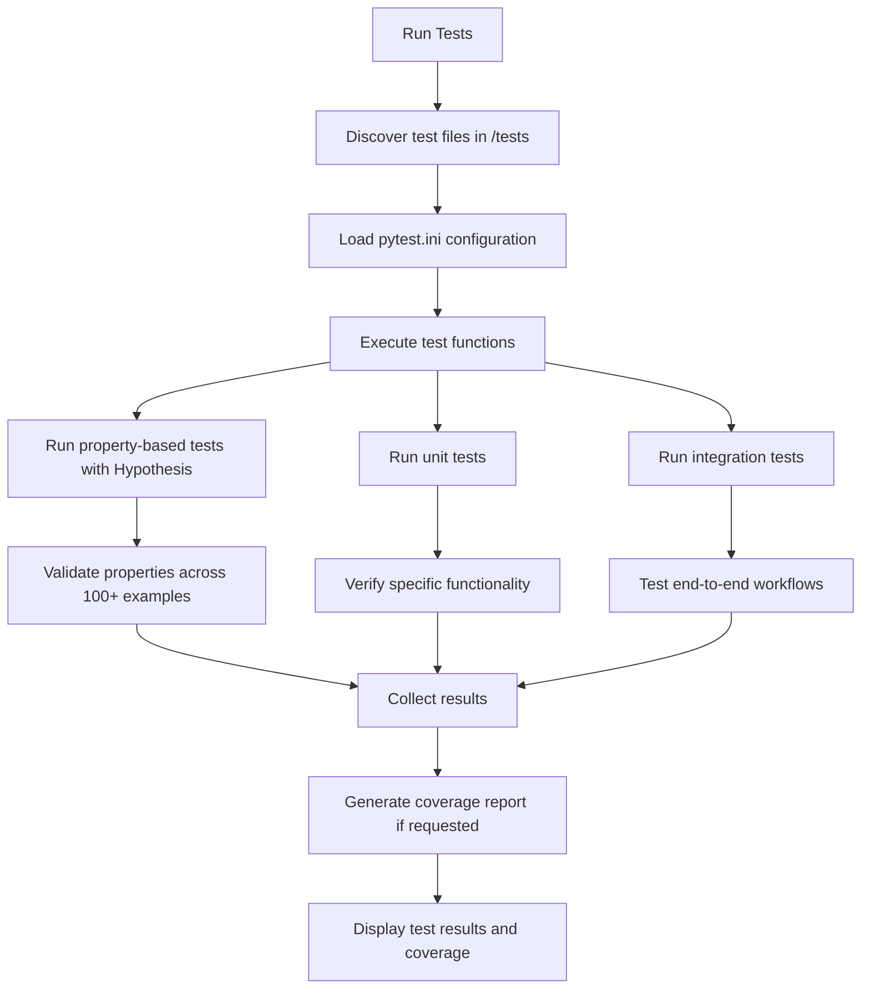
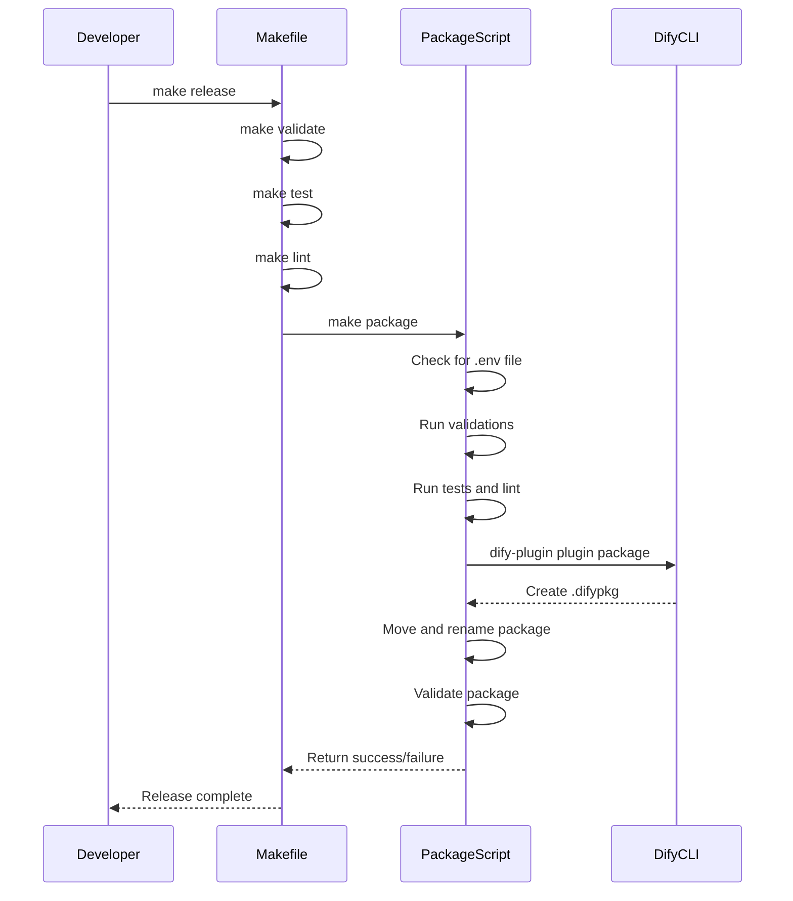
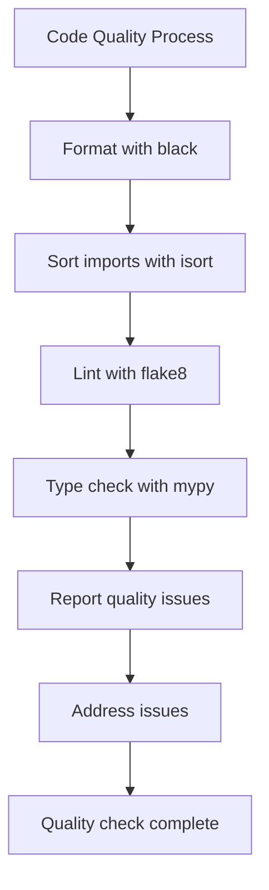
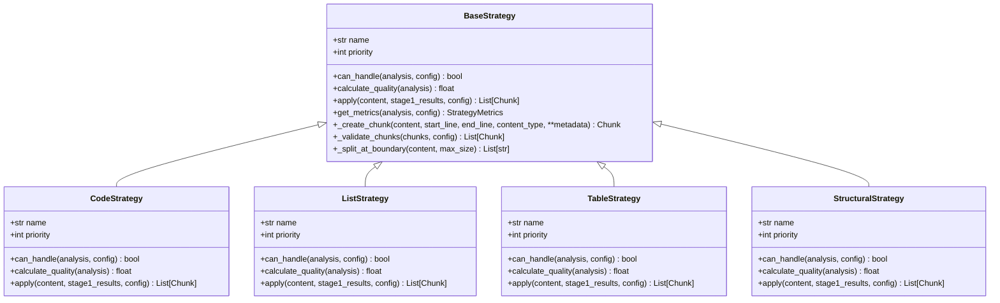
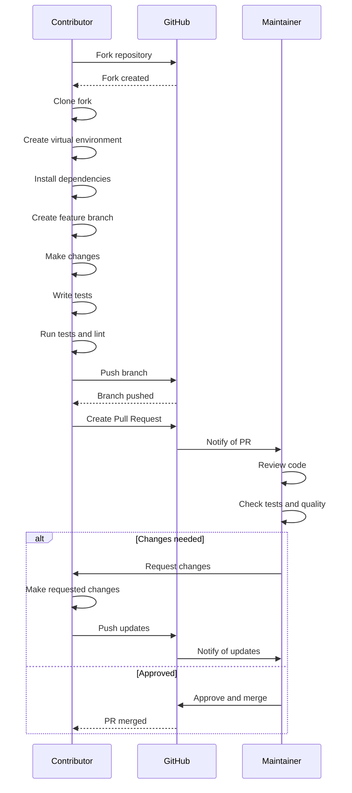
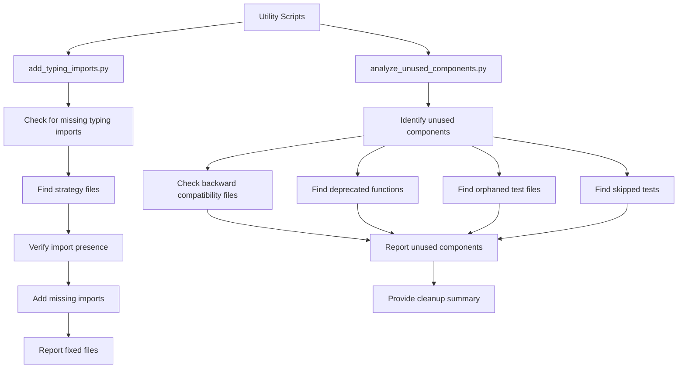

# Development Guide

<cite>
**Referenced Files in This Document**   
- [DEVELOPMENT.md](file://DEVELOPMENT.md)
- [CONTRIBUTING.md](file://CONTRIBUTING.md)
- [requirements.txt](file://requirements.txt)
- [pytest.ini](file://pytest.ini)
- [Makefile](file://Makefile)
- [package.sh](file://package.sh)
- [package_official.sh](file://package_official.sh)
- [main.py](file://main.py)
- [provider/markdown_chunker.py](file://provider/markdown_chunker.py)
- [scripts/add_typing_imports.py](file://scripts/add_typing_imports.py)
- [scripts/analyze_unused_components.py](file://scripts/analyze_unused_components.py)
- [markdown_chunker/chunker/strategies/base.py](file://markdown_chunker/chunker/strategies/base.py)
- [markdown_chunker/__init__.py](file://markdown_chunker/__init__.py)
- [tests/conftest.py](file://tests/conftest.py)
- [tests/chunker/test_chunker.py](file://tests/chunker/test_chunker.py)
</cite>

## Table of Contents
1. [Setting Up the Development Environment](#setting-up-the-development-environment)
2. [Running Tests and Generating Coverage Reports](#running-tests-and-generating-coverage-reports)
3. [Build and Packaging Process](#build-and-packaging-process)
4. [Code Quality Standards](#code-quality-standards)
5. [Adding or Modifying Chunking Strategies](#adding-or-modifying-chunking-strategies)
6. [Contribution Workflow](#contribution-workflow)
7. [Utility Scripts for Code Maintenance](#utility-scripts-for-code-maintenance)
8. [Additional Resources](#additional-resources)

## Setting Up the Development Environment

To set up the development environment for the Advanced Markdown Chunker plugin, follow these steps:

1. Clone the repository:
```bash
git clone <repository_url>
cd dify-markdown-chunker
```

2. Create a virtual environment using Python 3.12+:
```bash
python3.12 -m venv venv
source venv/bin/activate  # Linux/Mac
# or
venv\Scripts\activate  # Windows
```

3. Install the required dependencies:
```bash
pip install -r requirements.txt
```

4. Install the dify-plugin CLI tool:
```bash
# Linux/Mac
curl -L https://github.com/langgenius/dify-plugin-daemon/releases/latest/download/dify-plugin-linux-amd64 -o /tmp/dify-plugin
chmod +x /tmp/dify-plugin
sudo mv /tmp/dify-plugin /usr/local/bin/dify-plugin

# Verify installation
dify-plugin version
```

The project requires Python 3.12 or higher, Git, and the dify-plugin CLI for packaging. The `requirements.txt` file contains all necessary dependencies including core packages like `dify_plugin`, `markdown-it-py`, `pydantic`, `PyYAML`, and development tools such as `pytest`, `hypothesis`, `black`, `isort`, `flake8`, and `mypy`.

**Section sources**
- [DEVELOPMENT.md](file://DEVELOPMENT.md#L1-L408)
- [requirements.txt](file://requirements.txt#L1-L21)
- [CONTRIBUTING.md](file://CONTRIBUTING.md#L1-L171)

## Running Tests and Generating Coverage Reports

The project uses pytest for testing with comprehensive test coverage (1366+ tests). The test suite includes unit tests, integration tests, property-based tests using Hypothesis, and end-to-end workflow tests.

To run tests, use the following commands:

```bash
# Run all tests
make test

# Run quick tests only
make test-quick

# Run tests with coverage report
make test-coverage

# Run specific test
venv/bin/pytest tests/test_manifest.py -v
```

The pytest configuration is defined in `pytest.ini`, which specifies test discovery paths, output options, warning filters, and markers for different test types (slow, integration, unit). The configuration includes specific filters to ignore warnings from dependencies like gevent and Pydantic.

Property-based testing is implemented using Hypothesis, with custom strategies defined in `tests/conftest.py` for generating various Markdown structures including headers, paragraphs, lists, code blocks, tables, and complete documents with nested structures.



**Diagram sources**
- [pytest.ini](file://pytest.ini#L1-L37)
- [tests/conftest.py](file://tests/conftest.py#L1-L220)

**Section sources**
- [CONTRIBUTING.md](file://CONTRIBUTING.md#L25-L39)
- [Makefile](file://Makefile#L38-L51)
- [pytest.ini](file://pytest.ini#L1-L37)

## Build and Packaging Process

The build and packaging process uses Makefile commands and shell scripts to create distributable packages for the Dify platform.

### Using Makefile Commands

The Makefile provides several targets for the build process:

```bash
# Validate structure, syntax, and YAML
make validate

# Create package
make package

# Validate created package
make validate-package

# Full release build (validate → test → lint → package → validate-package)
make release

# Clean temporary files
make clean
```

The `make release` command executes a complete release pipeline that validates the code, runs tests, lints the code, creates the package, and validates the package.

### Packaging Scripts

Two packaging scripts are available:

1. `package.sh` - Comprehensive script that validates the plugin before packaging:
   - Checks for the presence of `.env` file (should not be packaged)
   - Runs structure, syntax, and YAML validation
   - Executes tests and linting
   - Creates the package using the official dify-plugin CLI
   - Validates the created package

2. `package_official.sh` - Simpler script that directly uses the dify-plugin CLI to create the package with timestamped naming.

The packaging process creates a `.difypkg` file named with the pattern `dify-markdown-chunker-official-YYYYMMDD_HHMMSS.difypkg`.



**Diagram sources**
- [Makefile](file://Makefile#L1-L136)
- [package.sh](file://package.sh#L1-L121)
- [package_official.sh](file://package_official.sh#L1-L32)

**Section sources**
- [DEVELOPMENT.md](file://DEVELOPMENT.md#L107-L130)
- [Makefile](file://Makefile#L1-L136)
- [package.sh](file://package.sh#L1-L121)
- [package_official.sh](file://package_official.sh#L1-L32)

## Code Quality Standards

The project enforces strict code quality standards to maintain consistency and reliability.

### Type Hints and Docstring Conventions

All functions must use type hints according to PEP 484. Public APIs require comprehensive docstrings following Google-style format with sections for Args, Returns, Raises, and Examples.

The project uses several utility scripts to maintain code quality:
- `scripts/add_typing_imports.py` - Adds missing typing imports to strategy files
- `scripts/analyze_unused_components.py` - Identifies unused components after refactoring

### Linting and Formatting Requirements

The project uses the following tools for code quality:

- **black**: Code formatter with line length of 88
- **isort**: Import sorter with black profile
- **flake8**: Linter with max complexity of 10 and line length of 88
- **mypy**: Type checker with ignore-missing-imports and no-strict-optional flags

Run quality checks with:
```bash
# Format code
make format

# Run linter
make lint

# Run all quality checks
make quality-check
```

The Makefile target `quality-check` runs linting followed by type checking, providing comprehensive code quality validation.



**Diagram sources**
- [Makefile](file://Makefile#L61-L72)
- [scripts/add_typing_imports.py](file://scripts/add_typing_imports.py#L1-L94)
- [scripts/analyze_unused_components.py](file://scripts/analyze_unused_components.py#L1-L323)

**Section sources**
- [CONTRIBUTING.md](file://CONTRIBUTING.md#L41-L52)
- [Makefile](file://Makefile#L61-L72)
- [requirements.txt](file://requirements.txt#L15-L21)

## Adding or Modifying Chunking Strategies

Chunking strategies are implemented in the `markdown_chunker/chunker/strategies/` directory. Each strategy inherits from the `BaseStrategy` abstract class and implements the required methods.

### Strategy Implementation Requirements

All strategies must implement:
- `name`: Human-readable strategy name
- `priority`: Strategy priority (1=highest, 6=lowest)
- `can_handle()`: Check if strategy can handle the content
- `calculate_quality()`: Calculate quality score for strategy selection
- `apply()`: Apply the strategy to create chunks

The base strategy class provides helper methods:
- `_create_chunk()`: Create a chunk with standard metadata
- `_validate_chunks()`: Validate and potentially fix chunks
- `_split_at_boundary()`: Split content at semantic boundaries (paragraph > sentence > word)

### Adding a New Strategy

To add a new chunking strategy:

1. Create a new Python file in `markdown_chunker/chunker/strategies/`
2. Implement a class that inherits from `BaseStrategy`
3. Implement all abstract methods
4. Add the strategy to the strategy registry
5. Write comprehensive tests in `tests/chunker/test_strategies/`

The strategy selection process uses a scoring system that combines priority and quality score to determine the optimal strategy for a given document.



**Diagram sources**
- [markdown_chunker/chunker/strategies/base.py](file://markdown_chunker/chunker/strategies/base.py#L1-L380)

**Section sources**
- [markdown_chunker/chunker/strategies/base.py](file://markdown_chunker/chunker/strategies/base.py#L1-L380)
- [CONTRIBUTING.md](file://CONTRIBUTING.md#L25-L32)

## Contribution Workflow

The contribution workflow follows a standard fork-branch-pull request model.

### Getting Started

1. Fork the repository
2. Clone your fork: `git clone https://github.com/yourusername/dify-markdown-chunker.git`
3. Create a virtual environment: `python3 -m venv venv`
4. Activate it: `source venv/bin/activate` (Linux/Mac) or `venv\Scripts\activate` (Windows)
5. Install dependencies: `make install`
6. Create a feature branch: `git checkout -b feature/your-feature-name`

### Making Changes

1. Make your changes in your feature branch
2. Write or update tests as needed
3. Run tests: `make test`
4. Format code: `make format`
5. Run linter: `make lint`
6. Validate structure: `make validate`

### Submitting a Pull Request

1. Update CHANGELOG.md with your changes
2. Ensure all tests pass
3. Update documentation as needed
4. Push to your fork
5. Create a Pull Request with:
   - Clear description of changes
   - Reference to related issues
   - Test results
   - Screenshots (if UI changes)

Pull requests should be focused on a single feature or fix. Commit messages should follow the format:
```
<type>: <subject>

<body>

<footer>
```

Where type is one of: `feat`, `fix`, `docs`, `style`, `refactor`, `test`, `chore`.



**Diagram sources**
- [CONTRIBUTING.md](file://CONTRIBUTING.md#L1-L171)

**Section sources**
- [CONTRIBUTING.md](file://CONTRIBUTING.md#L1-L171)
- [DEVELOPMENT.md](file://DEVELOPMENT.md#L1-L408)

## Utility Scripts for Code Maintenance

The project includes several utility scripts to assist with code maintenance and analysis.

### add_typing_imports.py

This script automatically adds missing typing imports to strategy files. It checks for the presence of typing imports and adds them if missing, specifically for the strategy files in the chunker/strategies directory.

Usage:
```bash
python scripts/add_typing_imports.py
```

The script processes the following files:
- code_strategy.py
- list_strategy.py
- structural_strategy.py
- table_strategy.py
- sentences_strategy.py

It adds imports for `Any`, `Dict`, `List`, and `Optional` from the typing module.

### analyze_unused_components.py

This comprehensive analysis script identifies various types of unused components after refactoring:

1. Unused backward compatibility files
2. Orphaned test files
3. Deprecated functions with no callers
4. Skipped tests

The script performs static analysis of the codebase to identify components that can be safely removed, helping to maintain a clean and efficient codebase.

Usage:
```bash
python scripts/analyze_unused_components.py
```

The script provides a detailed report of cleanup opportunities, including unused compatibility files, deprecated functions, orphaned test files, and skipped tests.



**Diagram sources**
- [scripts/add_typing_imports.py](file://scripts/add_typing_imports.py#L1-L94)
- [scripts/analyze_unused_components.py](file://scripts/analyze_unused_components.py#L1-L323)

**Section sources**
- [scripts/add_typing_imports.py](file://scripts/add_typing_imports.py#L1-L94)
- [scripts/analyze_unused_components.py](file://scripts/analyze_unused_components.py#L1-L323)

## Additional Resources

For additional information and policy details, refer to the following documentation files:

- **DEVELOPMENT.md**: Comprehensive development guide covering setup, testing, packaging, and troubleshooting
- **CONTRIBUTING.md**: Contribution guidelines including workflow, code style, documentation standards, and community expectations
- **CHANGELOG.md**: Record of changes for each version
- **README.md**: Project overview and usage examples

The project also includes example files in the `examples/` directory demonstrating various use cases:
- `basic_usage.py`: Basic usage of the markdown chunker
- `api_usage.py`: API usage examples
- `dify_integration.py`: Dify platform integration
- `rag_integration.py`: RAG system integration

**Section sources**
- [DEVELOPMENT.md](file://DEVELOPMENT.md#L1-L408)
- [CONTRIBUTING.md](file://CONTRIBUTING.md#L1-L171)
- [examples/](file://examples/)