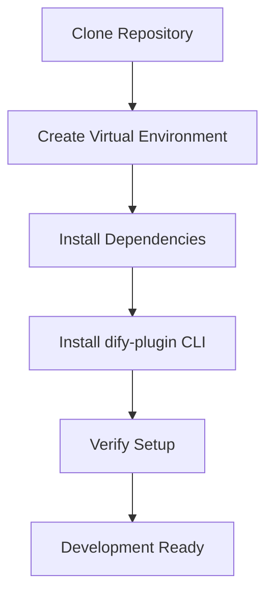
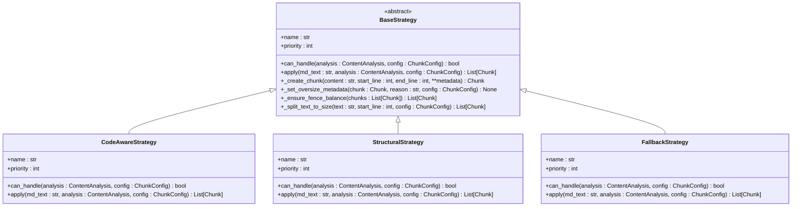
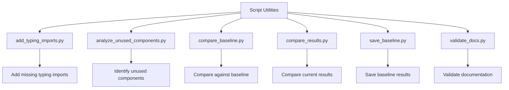
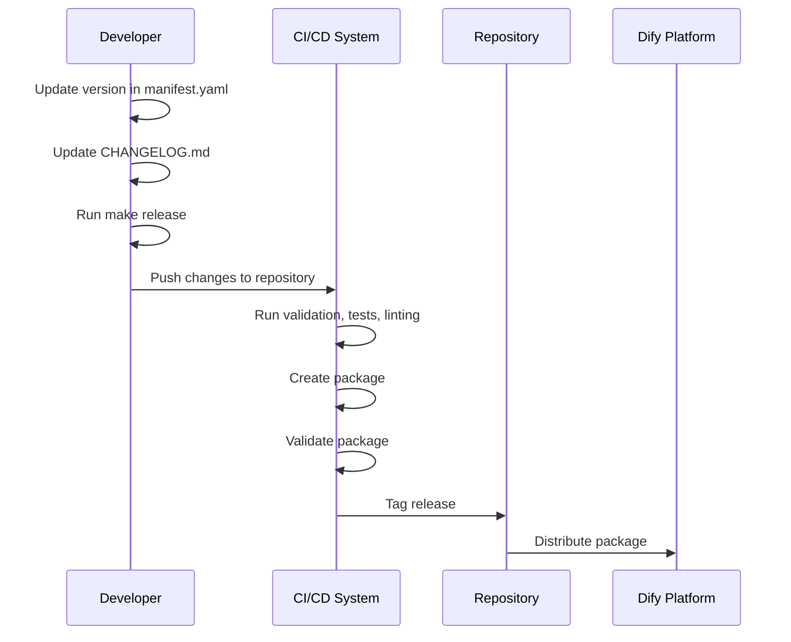
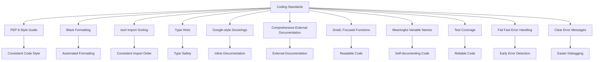
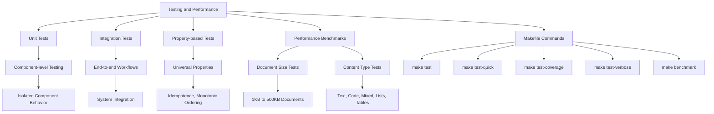

# Development Guide

<cite>
**Referenced Files in This Document**   
- [CONTRIBUTING.md](file://CONTRIBUTING.md)
- [DEVELOPMENT.md](file://DEVELOPMENT.md)
- [Makefile](file://Makefile)
- [requirements.txt](file://requirements.txt)
- [MIGRATION.md](file://docs/MIGRATION.md)
- [developer-guide.md](file://docs/guides/developer-guide.md)
- [testing-guide.md](file://docs/guides/testing-guide.md)
- [add_typing_imports.py](file://scripts/add_typing_imports.py)
- [analyze_unused_components.py](file://scripts/analyze_unused_components.py)
- [compare_baseline.py](file://scripts/compare_baseline.py)
- [compare_results.py](file://scripts/compare_results.py)
- [save_baseline.py](file://scripts/save_baseline.py)
- [validate_docs.py](file://scripts/validate_docs.py)
- [benchmark_chunker.py](file://benchmarks/benchmark_chunker.py)
- [base.py](file://markdown_chunker_v2/strategies/base.py)
- [chunker.py](file://markdown_chunker_v2/chunker.py)
- [manifest.yaml](file://manifest.yaml)
</cite>

## Table of Contents
1. [Contribution Workflow](#contribution-workflow)
2. [Development Environment Setup](#development-environment-setup)
3. [Implementing New Chunking Strategies](#implementing-new-chunking-strategies)
4. [Script Utilities](#script-utilities)
5. [Versioning and Release Process](#versioning-and-release-process)
6. [Coding Standards and Best Practices](#coding-standards-and-best-practices)
7. [Testing and Performance Evaluation](#testing-and-performance-evaluation)

## Contribution Workflow

The contribution workflow for the Markdown chunker follows a structured process to ensure code quality, maintainability, and consistency across the codebase. Contributors should follow the branching strategy, pull request requirements, and code review process outlined below.

The workflow begins with forking the repository and creating a feature branch using the naming convention `feature/your-feature-name`. This ensures that changes are isolated and can be reviewed independently. After implementing changes, contributors must write or update tests as needed, run the test suite, format the code, and validate the structure before submitting a pull request.

Pull requests should be focused on a single feature or fix, with clear commit messages following the conventional commit format. The commit message should include a type (feat, fix, docs, style, refactor, test, chore), a subject, and an optional body and footer. This standardized format helps maintain a clean and understandable commit history.

All submissions require code review through GitHub pull requests. Reviewers will evaluate code quality, test coverage, documentation completeness, performance implications, and potential breaking changes. Contributors should respond promptly to review feedback and make necessary adjustments before the changes are merged.

**Section sources**
- [CONTRIBUTING.md](file://CONTRIBUTING.md#L1-L178)
- [DEVELOPMENT.md](file://DEVELOPMENT.md#L1-L417)

## Development Environment Setup

Setting up the development environment for the Markdown chunker involves several steps to ensure a consistent and reproducible setup across different systems. The process includes installing dependencies, configuring the development environment, and verifying the setup.

The development environment requires Python 3.12 or later, the dify-plugin CLI for packaging, and Git for version control. After cloning the repository, developers should create a virtual environment to isolate dependencies. This can be done using the built-in `venv` module in Python.

Dependencies are managed through the `requirements.txt` file, which lists all required packages and their versions. The Makefile provides convenient commands for installing dependencies, including a separate command for development tools. Running `make install` installs the core dependencies, while `make install-dev` includes additional tools for linting, formatting, and testing.

The Makefile also includes commands for validating the development environment, such as checking the structure, syntax, and YAML files. These validation steps help catch potential issues early in the development process and ensure that the codebase remains consistent.

**Diagram sources**
- [DEVELOPMENT.md](file://DEVELOPMENT.md#L15-L317)
- [Makefile](file://Makefile#L1-L140)
- [requirements.txt](file://requirements.txt#L1-L21)

**Section sources**
- [DEVELOPMENT.md](file://DEVELOPMENT.md#L15-L317)
- [Makefile](file://Makefile#L1-L140)
- [requirements.txt](file://requirements.txt#L1-L21)

## Implementing New Chunking Strategies

Implementing new chunking strategies in the Markdown chunker requires adherence to specific interface requirements and testing expectations. The system is designed to be extensible, allowing developers to add new strategies that can handle different types of Markdown content.

New strategies should inherit from the `BaseStrategy` class defined in `markdown_chunker_v2/strategies/base.py`. This abstract base class defines the required interface that all strategies must implement, including properties for the strategy name and priority, and methods for determining if the strategy can handle a document and for applying the strategy to produce chunks.

The `can_handle` method should evaluate whether the strategy is appropriate for the given document based on content analysis and configuration. This method receives a `ContentAnalysis` object containing metrics about the document's structure and content, and a `ChunkConfig` object with the chunking configuration. The method should return `True` if the strategy can handle the document, and `False` otherwise.

The `apply` method is responsible for actually chunking the Markdown content. It receives the normalized Markdown text, the content analysis results, and the chunking configuration, and returns a list of `Chunk` objects. This method should implement the specific logic for the strategy, such as preserving code blocks, handling tables, or maintaining structural integrity.

When implementing a new strategy, developers should also consider the metadata that will be attached to each chunk. The base class provides helper methods for creating chunks with strategy-specific metadata, marking oversize chunks, ensuring fence balance, and splitting text to size. These methods help maintain consistency across different strategies and ensure that chunks have the necessary metadata for downstream processing.

Testing for new strategies should include unit tests, integration tests, and property-based tests. Unit tests should verify the basic functionality of the strategy, including the `can_handle` and `apply` methods. Integration tests should ensure that the strategy works correctly within the overall chunking pipeline. Property-based tests using Hypothesis should verify universal properties, such as idempotence and monotonic ordering.

**Diagram sources**
- [markdown_chunker_v2/strategies/base.py](file://markdown_chunker_v2/strategies/base.py#L1-L233)
- [markdown_chunker_v2/strategies/code_aware.py](file://markdown_chunker_v2/strategies/code_aware.py)
- [markdown_chunker_v2/strategies/structural.py](file://markdown_chunker_v2/strategies/structural.py)
- [markdown_chunker_v2/strategies/fallback.py](file://markdown_chunker_v2/strategies/fallback.py)

**Section sources**
- [markdown_chunker_v2/strategies/base.py](file://markdown_chunker_v2/strategies/base.py#L1-L233)
- [developer-guide.md](file://docs/guides/developer-guide.md#L1-L937)

## Script Utilities

The scripts directory contains various utility scripts that support maintenance tasks and development workflows. These scripts automate common operations, improve code quality, and facilitate testing and validation.

The `add_typing_imports.py` script adds missing typing imports to strategy files. It checks each file for the presence of typing imports and adds them if they are missing. This ensures consistent type hinting across the codebase and helps maintain code quality.

The `analyze_unused_components.py` script identifies unused components after parser refactoring. It analyzes the codebase to find backward compatibility files, orphaned test files, deprecated functions with no callers, duplicate test coverage, and skipped tests. This helps developers identify code that can be safely removed, reducing technical debt and improving maintainability.

The `compare_baseline.py` and `compare_results.py` scripts support the comparison of chunking results against a baseline. These scripts are particularly useful during migration from one version to another, allowing developers to verify that changes do not introduce unexpected differences in chunking behavior. The `save_baseline.py` script creates a baseline of chunking results that can be used for comparison.

The `validate_docs.py` script validates documentation files for internal link correctness, version consistency, and code example syntax. It checks all Markdown files in the repository for broken links, inconsistent version numbers, and code blocks without language tags. This helps maintain high-quality documentation and ensures that users have access to accurate and up-to-date information.

These utility scripts are essential for maintaining the health of the codebase and ensuring that development workflows are efficient and effective. They automate repetitive tasks, reduce the potential for human error, and provide valuable insights into the state of the codebase.

**Diagram sources**
- [scripts/add_typing_imports.py](file://scripts/add_typing_imports.py#L1-L94)
- [scripts/analyze_unused_components.py](file://scripts/analyze_unused_components.py#L1-L323)
- [scripts/compare_baseline.py](file://scripts/compare_baseline.py)
- [scripts/compare_results.py](file://scripts/compare_results.py)
- [scripts/save_baseline.py](file://scripts/save_baseline.py)
- [scripts/validate_docs.py](file://scripts/validate_docs.py#L1-L202)

**Section sources**
- [scripts/add_typing_imports.py](file://scripts/add_typing_imports.py#L1-L94)
- [scripts/analyze_unused_components.py](file://scripts/analyze_unused_components.py#L1-L323)
- [scripts/compare_baseline.py](file://scripts/compare_baseline.py)
- [scripts/compare_results.py](file://scripts/compare_results.py)
- [scripts/save_baseline.py](file://scripts/save_baseline.py)
- [scripts/validate_docs.py](file://scripts/validate_docs.py#L1-L202)

## Versioning and Release Process

The versioning and release process for the Markdown chunker follows a structured approach to ensure stability, compatibility, and transparency. Changes are tracked in the MIGRATION.md file, which documents breaking changes, deprecations, and migration paths between versions.

The versioning scheme follows semantic versioning principles, with major, minor, and patch versions. Major versions (e.g., 2.0.0) indicate breaking changes that require migration efforts. Minor versions (e.g., 2.1.0) indicate new features that are backward compatible. Patch versions (e.g., 2.1.1) indicate bug fixes and minor improvements.

The MIGRATION.md file provides detailed guidance for migrating from one version to another. It includes an overview of changes, breaking changes with replacements, removed methods, strategy selection changes, removed classes, and metadata changes. This comprehensive documentation helps users understand the impact of upgrades and plan their migrations accordingly.

The release process is automated through the Makefile, which includes a `release` target that executes a sequence of validation steps. The `make release` command runs validation, tests, linting, packaging, and package validation in sequence. This ensures that only high-quality, well-tested code is released.

Before creating a release, developers should update the version in manifest.yaml and CHANGELOG.md. The version should be updated in both the top-level `version` field and the `meta.version` field. The CHANGELOG.md should include a section for the new version with details of added features, fixed bugs, and any breaking changes.

The packaging process creates a .difypkg file that can be installed in Dify. The package size is limited to 50 MB (uncompressed), and the CLI automatically checks this during packaging. The .gitignore file is used to exclude files from the package, including the virtual environment, cache directories, tests, and markdown files (except README.md).

**Diagram sources**
- [MIGRATION.md](file://docs/MIGRATION.md#L1-L223)
- [Makefile](file://Makefile#L1-L140)
- [manifest.yaml](file://manifest.yaml#L1-L48)

**Section sources**
- [MIGRATION.md](file://docs/MIGRATION.md#L1-L223)
- [Makefile](file://Makefile#L1-L140)
- [manifest.yaml](file://manifest.yaml#L1-L48)

## Coding Standards and Best Practices

The Markdown chunker project adheres to strict coding standards and best practices to ensure code quality, maintainability, and consistency. These standards cover Python code style, type hints, documentation, and general development practices.

The project follows PEP 8 style guide for Python code, with some modifications to accommodate modern Python features and project-specific requirements. Code should be formatted using Black with a line length of 88 characters, and imports should be sorted using isort with the Black profile. These tools are integrated into the development workflow through the Makefile commands `make format` and `make lint`.

Type hints are required for all functions and methods. This improves code readability, enables better IDE support, and helps catch type-related errors early. The project uses the typing module for type annotations, including common types like Any, Dict, List, and Optional. The mypy static type checker is used to verify type correctness, and warnings are treated as non-critical issues.

Documentation is a critical aspect of the project's coding standards. Public APIs should have docstrings that describe the function's purpose, parameters, return values, and exceptions. The project uses Google-style docstrings for consistency. In addition to inline documentation, the project maintains comprehensive external documentation in the docs/ directory, including architecture guides, API references, and user guides.

General development best practices include keeping functions focused and small, using meaningful variable names, and writing tests for all new code. The project emphasizes code readability and maintainability over cleverness or conciseness. When faced with a trade-off between performance and readability, readability should be prioritized unless there is a compelling performance reason to do otherwise.

The project also follows the principle of "fail fast" in error handling. Functions should validate their inputs and raise appropriate exceptions when invalid data is provided. This helps catch errors early and makes debugging easier. Error messages should be clear and informative, providing enough context to understand the problem and how to fix it.

**Diagram sources**
- [CONTRIBUTING.md](file://CONTRIBUTING.md#L47-L51)
- [Makefile](file://Makefile#L65-L69)
- [requirements.txt](file://requirements.txt#L16-L21)

**Section sources**
- [CONTRIBUTING.md](file://CONTRIBUTING.md#L47-L51)
- [Makefile](file://Makefile#L65-L69)
- [requirements.txt](file://requirements.txt#L16-L21)

## Testing and Performance Evaluation

Testing and performance evaluation are critical components of the development process for the Markdown chunker. The project maintains comprehensive test coverage with over 1366 tests, ensuring the reliability and correctness of the codebase.

The testing strategy includes unit tests, integration tests, and property-based tests. Unit tests focus on individual components and functions, verifying their behavior in isolation. Integration tests cover end-to-end workflows, ensuring that components work together correctly. Property-based tests using Hypothesis verify universal properties, such as idempotence, monotonic ordering, and data preservation.

The Makefile provides convenient commands for running tests. The `make test` command runs all tests, while `make test-quick` runs only quick tests. The `make test-coverage` command runs tests with coverage reporting, generating an HTML report in the htmlcov/ directory. The `make test-verbose` command runs tests with verbose output, which is useful for debugging failing tests.

Performance benchmarks are used to evaluate the efficiency of the chunking algorithms and identify potential bottlenecks. The benchmarks measure performance across different document sizes and content types, providing insights into how the system scales. The benchmark results are saved to a JSON file for comparison across versions.

The benchmark suite includes tests for document size and content type. The document size tests measure performance for documents of various sizes, from 1KB to 500KB. The content type tests measure performance for different types of content, including text, code, mixed content, lists, and tables. These benchmarks help ensure that the system performs well across a wide range of use cases.

Before submitting changes, developers should run the full test suite and performance benchmarks to ensure that their changes do not introduce regressions. The `make release` command includes test execution as one of its steps, ensuring that only well-tested code is released.

**Diagram sources**
- [testing-guide.md](file://docs/guides/testing-guide.md#L1-L32)
- [Makefile](file://Makefile#L38-L140)
- [benchmark_chunker.py](file://benchmarks/benchmark_chunker.py#L1-L195)

**Section sources**
- [testing-guide.md](file://docs/guides/testing-guide.md#L1-L32)
- [Makefile](file://Makefile#L38-L140)
- [benchmark_chunker.py](file://benchmarks/benchmark_chunker.py#L1-L195)