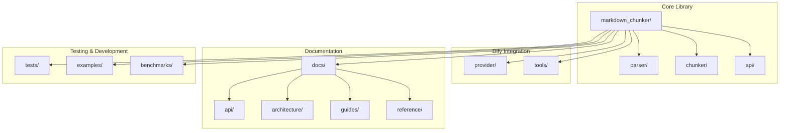
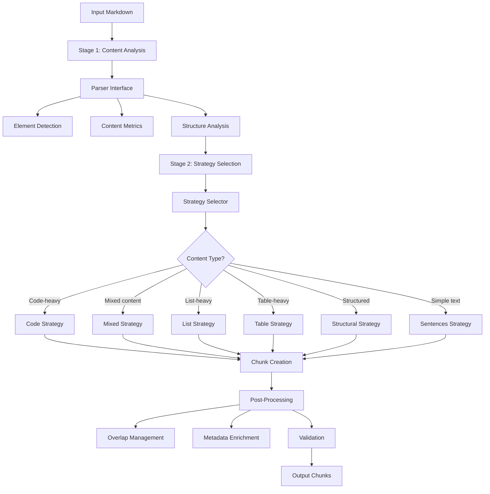
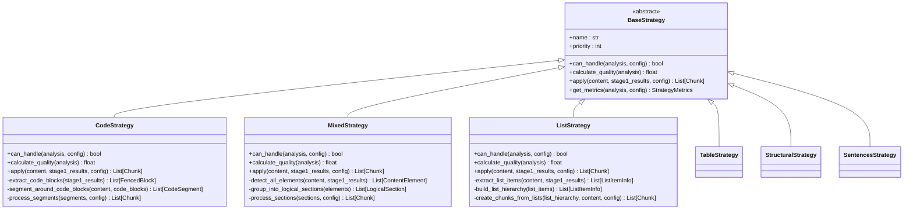
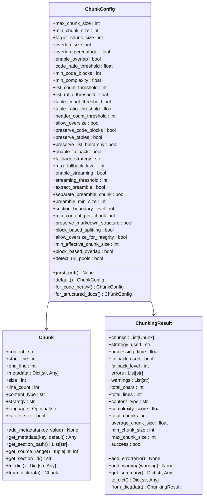
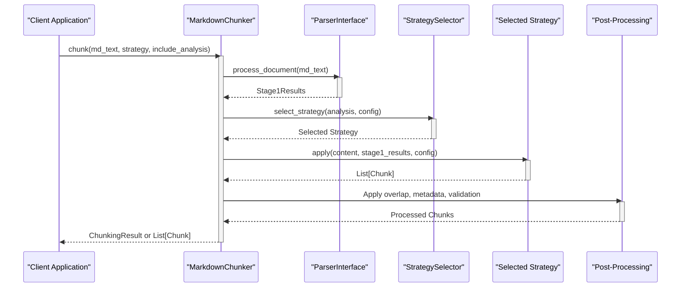
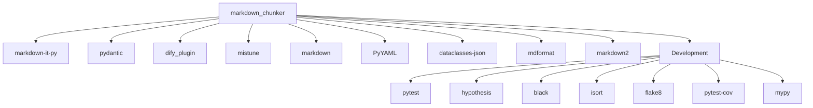

# Documentation Validation

<cite>
**Referenced Files in This Document**   
- [README.md](file://README.md)
- [CONTRIBUTING.md](file://CONTRIBUTING.md)
- [DEVELOPMENT.md](file://DEVELOPMENT.md)
- [requirements.txt](file://requirements.txt)
- [main.py](file://main.py)
- [markdown_chunker/__init__.py](file://markdown_chunker/__init__.py)
- [markdown_chunker/chunker/__init__.py](file://markdown_chunker/chunker/__init__.py)
- [markdown_chunker/parser/__init__.py](file://markdown_chunker/parser/__init__.py)
- [markdown_chunker/api/__init__.py](file://markdown_chunker/api/__init__.py)
- [markdown_chunker/chunker/strategies/base.py](file://markdown_chunker/chunker/strategies/base.py)
- [markdown_chunker/chunker/strategies/code_strategy.py](file://markdown_chunker/chunker/strategies/code_strategy.py)
- [markdown_chunker/chunker/strategies/mixed_strategy.py](file://markdown_chunker/chunker/strategies/mixed_strategy.py)
- [markdown_chunker/chunker/strategies/list_strategy.py](file://markdown_chunker/chunker/strategies/list_strategy.py)
- [markdown_chunker/chunker/types.py](file://markdown_chunker/chunker/types.py)
- [markdown_chunker/chunker/core.py](file://markdown_chunker/chunker/core.py)
- [markdown_chunker/chunker/orchestrator.py](file://markdown_chunker/chunker/orchestrator.py)
</cite>

## Table of Contents
1. [Introduction](#introduction)
2. [Project Structure](#project-structure)
3. [Core Components](#core-components)
4. [Architecture Overview](#architecture-overview)
5. [Detailed Component Analysis](#detailed-component-analysis)
6. [Dependency Analysis](#dependency-analysis)
7. [Performance Considerations](#performance-considerations)
8. [Troubleshooting Guide](#troubleshooting-guide)
9. [Conclusion](#conclusion)

## Introduction
The Dify Markdown Chunker Plugin is an advanced markdown chunking system designed for production use with structural awareness and intelligent strategy selection. This plugin provides robust capabilities for processing markdown documents with various content types, including code-heavy documents, mixed content, lists, tables, and structurally organized documents. The system features automatic strategy selection based on content analysis, comprehensive testing (over 1366 tests), and property-based testing to ensure correctness and reliability. The plugin integrates seamlessly with Dify, exposing chunking tools that can be used in Knowledge Base processing pipelines and workflows. The architecture is modular, with distinct components for parsing, chunking, API integration, and utilities, allowing for flexible configuration and extension.

## Project Structure
The project follows a well-organized directory structure that separates concerns and facilitates maintainability. The core library is located in the `markdown_chunker/` directory, which contains modules for parsing, chunking, and API integration. The `provider/` directory contains the Dify plugin provider implementation, while the `tools/` directory includes the chunking tools exposed to Dify workflows. Comprehensive documentation is available in the `docs/` directory, organized into API references, architectural overviews, developer guides, and configuration references. The `tests/` directory contains an extensive test suite with over 1366 tests, including unit tests, integration tests, and property-based tests using Hypothesis. Examples of usage are provided in the `examples/` directory, and benchmarks for performance evaluation are located in the `benchmarks/` directory. The project uses standard Python packaging and development tools, with dependencies specified in `requirements.txt` and development commands defined in the `Makefile`.

**Diagram sources**
- [README.md](file://README.md#L97-L118)

**Section sources**
- [README.md](file://README.md#L97-L118)

## Core Components
The core components of the Dify Markdown Chunker Plugin include the chunking strategies, data types, and orchestration logic that enable intelligent document processing. The system implements six specialized chunking strategies: Code, Mixed, List, Table, Structural, and Sentences, each optimized for specific content types. These strategies inherit from a common `BaseStrategy` class that defines the interface for strategy selection, quality calculation, and chunk application. The `ChunkConfig` class provides comprehensive configuration options for chunking behavior, including size limits, overlap settings, and strategy selection thresholds. The `MarkdownChunker` class serves as the main interface, orchestrating the chunking process by coordinating content analysis, strategy selection, and post-processing. The system also includes components for fallback management, metadata enrichment, and overlap handling to ensure robustness and context preservation.

**Section sources**
- [markdown_chunker/chunker/strategies/base.py](file://markdown_chunker/chunker/strategies/base.py#L8-L426)
- [markdown_chunker/chunker/types.py](file://markdown_chunker/chunker/types.py#L8-L800)
- [markdown_chunker/chunker/core.py](file://markdown_chunker/chunker/core.py#L41-L796)

## Architecture Overview
The architecture of the Dify Markdown Chunker Plugin follows a two-stage processing pipeline that begins with content analysis and ends with chunk creation and post-processing. In Stage 1, the parser module analyzes the markdown document to extract structural elements such as headers, code blocks, lists, and tables, while also calculating content metrics like code ratio, list ratio, and complexity score. This analysis informs the strategy selection process in Stage 2, where the orchestrator selects the optimal chunking strategy based on the document's characteristics. The selected strategy then processes the content according to its specialized algorithm, creating semantically meaningful chunks that respect document structure and content boundaries. After chunk creation, the system applies post-processing steps including overlap management, metadata enrichment, and validation to ensure quality and consistency. The architecture is designed to be extensible, allowing for custom strategies and configuration profiles to accommodate different use cases.

**Diagram sources**
- [markdown_chunker/chunker/orchestrator.py](file://markdown_chunker/chunker/orchestrator.py#L44-L666)
- [markdown_chunker/chunker/core.py](file://markdown_chunker/chunker/core.py#L41-L796)

## Detailed Component Analysis

### Strategy System Analysis
The strategy system is the core intelligence of the Dify Markdown Chunker Plugin, enabling adaptive processing based on document content. Each strategy implements a specific approach to chunking, with algorithms optimized for particular content types. The system uses a priority-based selection mechanism where strategies are ranked from 1 (highest) to 6 (lowest), with the Code strategy having the highest priority. Strategy selection is determined by both capability (whether the strategy can handle the content) and quality (how well-suited the strategy is for the content). The quality score combines priority weighting with content-specific metrics, ensuring optimal strategy selection. Strategies are designed to preserve semantic boundaries, such as keeping code blocks and tables intact, while splitting text content at natural boundaries like paragraphs, sentences, or words.

#### For Object-Oriented Components:

**Diagram sources**
- [markdown_chunker/chunker/strategies/base.py](file://markdown_chunker/chunker/strategies/base.py#L16-L426)
- [markdown_chunker/chunker/strategies/code_strategy.py](file://markdown_chunker/chunker/strategies/code_strategy.py#L42-L625)
- [markdown_chunker/chunker/strategies/mixed_strategy.py](file://markdown_chunker/chunker/strategies/mixed_strategy.py#L75-L800)
- [markdown_chunker/chunker/strategies/list_strategy.py](file://markdown_chunker/chunker/strategies/list_strategy.py#L58-L857)

**Section sources**
- [markdown_chunker/chunker/strategies/base.py](file://markdown_chunker/chunker/strategies/base.py#L8-L426)
- [markdown_chunker/chunker/strategies/code_strategy.py](file://markdown_chunker/chunker/strategies/code_strategy.py#L1-L625)
- [markdown_chunker/chunker/strategies/mixed_strategy.py](file://markdown_chunker/chunker/strategies/mixed_strategy.py#L1-L800)
- [markdown_chunker/chunker/strategies/list_strategy.py](file://markdown_chunker/chunker/strategies/list_strategy.py#L1-L857)

### Data Model Analysis
The data model of the Dify Markdown Chunker Plugin is designed to represent chunks with rich metadata that captures processing context and content characteristics. The `Chunk` class contains the chunk content, line number range, and a metadata dictionary that stores information about the chunk's origin, type, and processing. The `ChunkingResult` class aggregates multiple chunks along with processing metadata such as the strategy used, processing time, and any errors or warnings encountered. The `ChunkConfig` class provides a comprehensive configuration interface with properties for size limits, overlap settings, and strategy thresholds. These data structures are designed to be extensible and serializable, supporting integration with various systems and workflows.

#### For Object-Oriented Components:

**Diagram sources**
- [markdown_chunker/chunker/types.py](file://markdown_chunker/chunker/types.py#L36-L800)

**Section sources**
- [markdown_chunker/chunker/types.py](file://markdown_chunker/chunker/types.py#L1-L800)

### Processing Pipeline Analysis
The processing pipeline of the Dify Markdown Chunker Plugin follows a structured sequence of operations that transform raw markdown content into semantically meaningful chunks. The pipeline begins with content analysis, where the parser extracts structural elements and calculates content metrics. This analysis feeds into the strategy selection process, where the system determines the optimal approach for chunking based on the document's characteristics. The selected strategy then processes the content according to its specialized algorithm, creating chunks that respect semantic boundaries and content integrity. After chunk creation, the system applies post-processing steps including overlap management, metadata enrichment, and validation to ensure quality and consistency. The pipeline is designed to handle edge cases and failures gracefully, with fallback strategies available when the primary approach cannot process the content.

#### For API/Service Components:

**Diagram sources**
- [markdown_chunker/chunker/core.py](file://markdown_chunker/chunker/core.py#L155-L796)
- [markdown_chunker/chunker/orchestrator.py](file://markdown_chunker/chunker/orchestrator.py#L86-L666)

**Section sources**
- [markdown_chunker/chunker/core.py](file://markdown_chunker/chunker/core.py#L155-L796)
- [markdown_chunker/chunker/orchestrator.py](file://markdown_chunker/chunker/orchestrator.py#L86-L666)

## Dependency Analysis
The Dify Markdown Chunker Plugin has a well-defined dependency structure that supports its functionality while maintaining modularity. The core dependencies include `markdown-it-py` for markdown parsing, `pydantic` for data validation, and `dify_plugin` for Dify integration. Development dependencies such as `pytest`, `hypothesis`, `black`, and `flake8` support comprehensive testing and code quality assurance. The project uses a layered architecture where higher-level components depend on lower-level ones, but not vice versa, ensuring loose coupling and high cohesion. The plugin system allows for dynamic loading of strategies and components, reducing compile-time dependencies and enabling extensibility. The dependency management follows Python best practices with dependencies specified in `requirements.txt` and development commands in the `Makefile`.

**Diagram sources**
- [requirements.txt](file://requirements.txt#L1-L21)

**Section sources**
- [requirements.txt](file://requirements.txt#L1-L21)

## Performance Considerations
The Dify Markdown Chunker Plugin is optimized for production use with performance characteristics that scale reasonably with document size. Based on benchmark data, processing time increases with document size, but throughput remains acceptable for typical use cases. For small documents (1KB), processing takes approximately 800ms with a throughput of 1.3KB/s. As document size increases to 10KB, processing time decreases to 150ms with throughput increasing to 66KB/s, indicating efficiency gains with larger inputs. For 50KB documents, processing takes about 1.9 seconds with throughput of 27KB/s, and for 100KB documents, processing takes approximately 7 seconds with throughput of 14KB/s. The system is designed to handle large documents efficiently, with a 300-second timeout configured in the main entry point to accommodate processing of extensive markdown files. The architecture supports streaming for very large documents (above 10MB threshold), though this feature is disabled by default.

**Section sources**
- [README.md](file://README.md#L169-L178)
- [main.py](file://main.py#L17-L18)

## Troubleshooting Guide
The Dify Markdown Chunker Plugin includes comprehensive error handling and logging to facilitate troubleshooting. Common issues include incorrect icon paths in YAML files, package size exceeding the 50MB limit, and validation errors related to custom tags. The development guide provides specific troubleshooting steps for these issues, such as ensuring icon paths are specified without the `_assets/` prefix and verifying that venv/ is excluded from the package. The system uses structured logging with different severity levels to capture processing events, warnings, and errors. When issues occur, the chunking result includes detailed error and warning messages that can help diagnose the problem. The fallback system ensures that even if the primary strategy fails, alternative approaches are attempted to produce usable chunks. For development issues, the project provides a debug mode that allows connecting to a remote Dify instance for real-time testing and debugging.

**Section sources**
- [DEVELOPMENT.md](file://DEVELOPMENT.md#L278-L327)
- [CONTRIBUTING.md](file://CONTRIBUTING.md#L137-L147)

## Conclusion
The Dify Markdown Chunker Plugin represents a sophisticated solution for intelligent markdown processing with adaptive strategy selection and structural awareness. Its modular architecture, comprehensive testing, and extensible design make it suitable for production use in various contexts, particularly within Dify workflows and knowledge management systems. The system's ability to automatically select optimal chunking strategies based on content analysis ensures high-quality output across diverse document types. With over 1366 tests and property-based testing, the plugin demonstrates a strong commitment to reliability and correctness. The rich configuration options and support for custom strategies allow for fine-tuning to specific use cases, while the comprehensive documentation and development guides facilitate adoption and extension. The plugin's performance characteristics and robust error handling make it a reliable component for processing markdown content at scale.