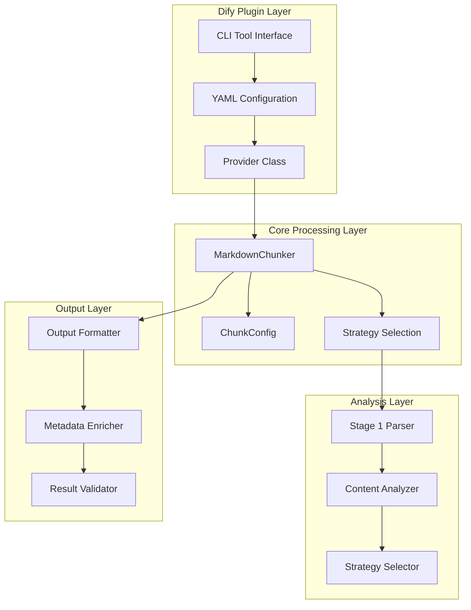
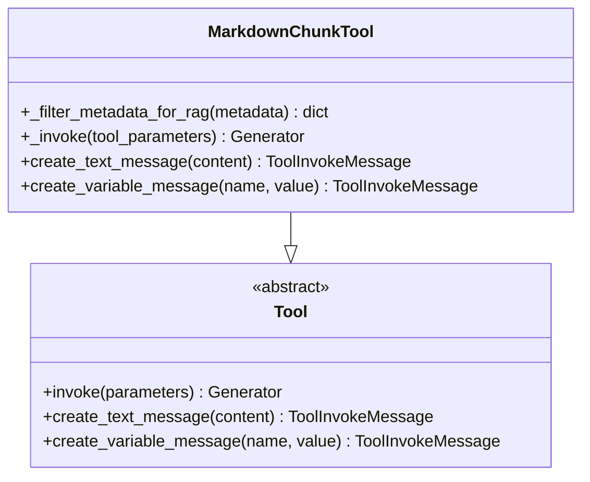
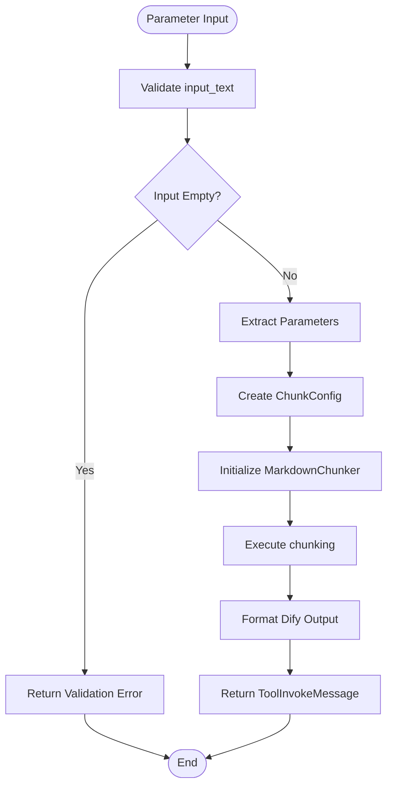
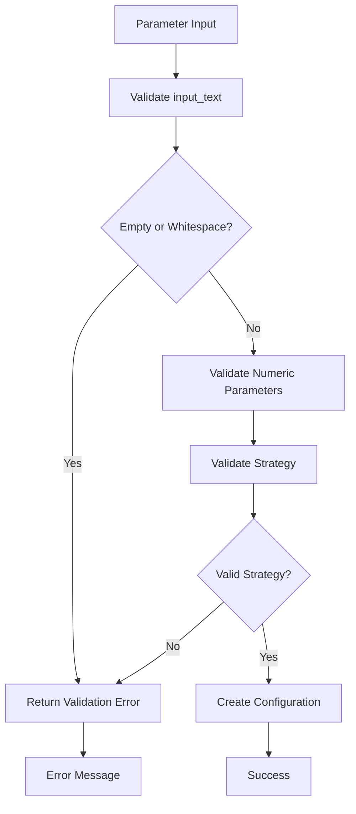
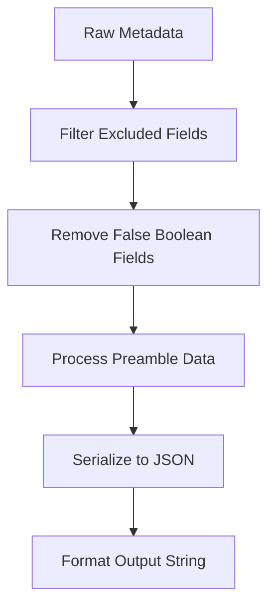
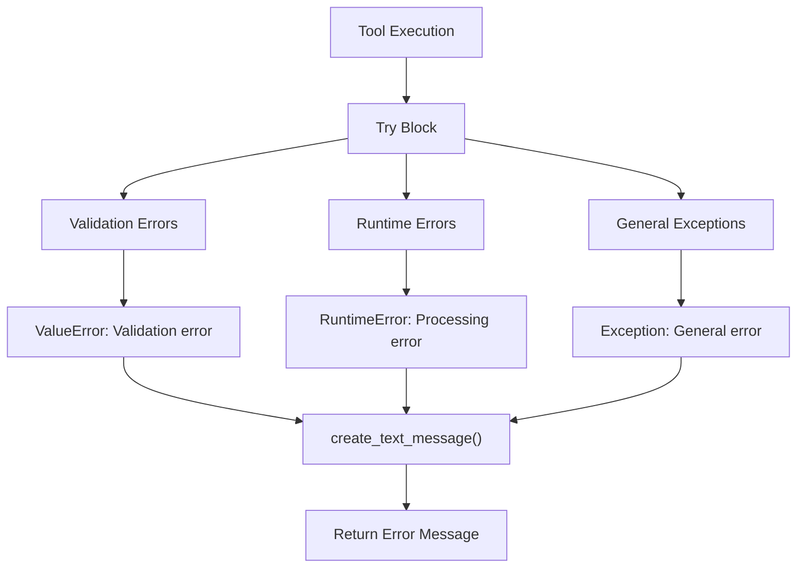
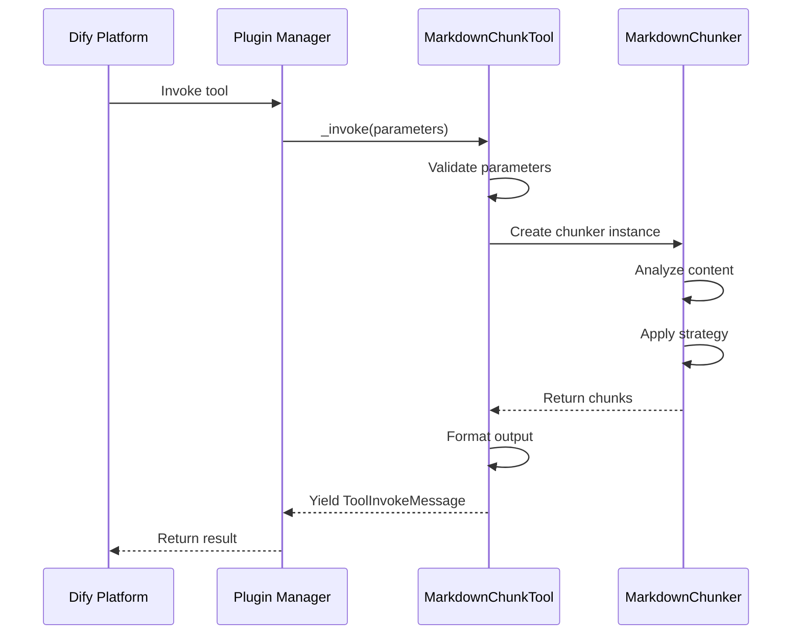

# CLI Tool Usage

<cite>
**Referenced Files in This Document**
- [tools/markdown_chunk_tool.py](file://tools/markdown_chunk_tool.py)
- [tools/markdown_chunk_tool.yaml](file://tools/markdown_chunk_tool.yaml)
- [provider/markdown_chunker.py](file://provider/markdown_chunker.py)
- [provider/markdown_chunker.yaml](file://provider/markdown_chunker.yaml)
- [examples/basic_usage.py](file://examples/basic_usage.py)
- [examples/dify_integration.py](file://examples/dify_integration.py)
- [markdown_chunker/__init__.py](file://markdown_chunker/__init__.py)
- [markdown_chunker/chunker/types.py](file://markdown_chunker/chunker/types.py)
- [tests/test_tool_yaml.py](file://tests/test_tool_yaml.py)
- [tests/test_error_handling.py](file://tests/test_error_handling.py)
- [main.py](file://main.py)
</cite>

## Table of Contents
1. [Introduction](#introduction)
2. [Tool Architecture](#tool-architecture)
3. [Command-Line Interface](#command-line-interface)
4. [Parameter Configuration](#parameter-configuration)
5. [Output Format](#output-format)
6. [Usage Examples](#usage-examples)
7. [Error Handling](#error-handling)
8. [Integration Patterns](#integration-patterns)
9. [Best Practices](#best-practices)
10. [Troubleshooting](#troubleshooting)

## Introduction

The Advanced Markdown Chunker CLI tool provides intelligent, structure-aware chunking of Markdown documents for RAG (Retrieval-Augmented Generation) systems. This tool integrates seamlessly with Dify's plugin ecosystem through a comprehensive YAML configuration system, offering sophisticated content analysis and adaptive chunking strategies.

The tool analyzes Markdown content and intelligently splits it into semantically meaningful chunks while preserving document structure, maintaining semantic context, and supporting configurable chunk size and overlap parameters. It automatically selects the optimal chunking strategy based on content analysis, making it suitable for various document types including code documentation, technical manuals, and mixed-content documents.

## Tool Architecture

The markdown chunker follows a layered architecture designed for Dify integration:



**Diagram sources**
- [tools/markdown_chunk_tool.py](file://tools/markdown_chunk_tool.py#L21-L178)
- [provider/markdown_chunker.py](file://provider/markdown_chunker.py#L15-L36)
- [markdown_chunker/__init__.py](file://markdown_chunker/__init__.py#L28-L30)

**Section sources**
- [tools/markdown_chunk_tool.py](file://tools/markdown_chunk_tool.py#L21-L32)
- [provider/markdown_chunker.py](file://provider/markdown_chunker.py#L15-L36)

## Command-Line Interface

The CLI tool exposes a comprehensive interface through the `MarkdownChunkTool` class, which inherits from Dify's `Tool` base class. The tool provides intelligent parameter validation and structured output formatting.

### Core Interface Methods

The tool implements several key methods for processing markdown content:



**Diagram sources**
- [tools/markdown_chunk_tool.py](file://tools/markdown_chunk_tool.py#L21-L178)

### Parameter Processing Pipeline

The tool processes parameters through a structured pipeline:



**Diagram sources**
- [tools/markdown_chunk_tool.py](file://tools/markdown_chunk_tool.py#L83-L178)

**Section sources**
- [tools/markdown_chunk_tool.py](file://tools/markdown_chunk_tool.py#L83-L178)

## Parameter Configuration

The tool accepts five primary parameters, each with specific validation rules and default values:

### Available Parameters

| Parameter | Type | Required | Default | Description |
|-----------|------|----------|---------|-------------|
| `input_text` | string | Yes | - | The Markdown text content to be chunked |
| `max_chunk_size` | number | No | 1000 | Maximum size of each chunk in characters |
| `chunk_overlap` | number | No | 100 | Number of characters to overlap between consecutive chunks |
| `strategy` | select | No | auto | Chunking strategy selection |
| `include_metadata` | boolean | No | true | Include structural metadata with each chunk |

### Strategy Options

The `strategy` parameter supports six distinct chunking approaches:

| Strategy | Description | Best For |
|----------|-------------|----------|
| `auto` | Automatic strategy selection based on content analysis | General use cases |
| `code` | Code-focused chunking with emphasis on code blocks | Technical documentation, API references |
| `structural` | Header-based chunking preserving document hierarchy | Well-structured documents |
| `mixed` | Mixed content handling for diverse document types | Documents with varied content |
| `list` | List-aware chunking for bullet-point content | Lists, tutorials, procedures |
| `table` | Table-aware chunking for tabular data | Data tables, comparison matrices |

### Parameter Validation

The tool implements comprehensive parameter validation:



**Diagram sources**
- [tools/markdown_chunk_tool.py](file://tools/markdown_chunk_tool.py#L100-L112)

**Section sources**
- [tools/markdown_chunk_tool.yaml](file://tools/markdown_chunk_tool.yaml#L24-L118)
- [tools/markdown_chunk_tool.py](file://tools/markdown_chunk_tool.py#L100-L112)

## Output Format

The tool produces structured output specifically designed for Dify's variable message system. The output format follows a standardized structure with embedded metadata:

### Output Structure

Each chunk is formatted as:
```
<metadata>
{JSON_METADATA}
</metadata>
<content>
CHUNK_CONTENT
```

### Metadata Filtering

The tool applies sophisticated metadata filtering to optimize for RAG performance:



**Diagram sources**
- [tools/markdown_chunk_tool.py](file://tools/markdown_chunk_tool.py#L34-L81)

### Included Metadata Fields

The filtered metadata includes only RAG-relevant information:

- **Content Information**: `content_type`, `strategy`, `language`, `size`
- **Structure Data**: `section_path`, `section_id`, `has_overlap`
- **Quality Metrics**: `complexity_score`, `processing_time`
- **Source Information**: `start_line`, `end_line`, `total_chunks`

**Section sources**
- [tools/markdown_chunk_tool.py](file://tools/markdown_chunk_tool.py#L34-L81)
- [tools/markdown_chunk_tool.py](file://tools/markdown_chunk_tool.py#L133-L167)

## Usage Examples

### Basic Usage

Simple markdown chunking with default parameters:

```python
# Basic invocation
params = {
    "input_text": "# My Document\n\nContent here...",
    "max_chunk_size": 1000,
    "chunk_overlap": 100,
    "strategy": "auto",
    "include_metadata": True
}

# Tool execution would produce:
# <metadata>
# {
#   "content_type": "text",
#   "strategy": "structural",
#   "size": 50
# }
# </metadata>
# # My Document
# 
# Content here...
```

### Advanced Configuration

Custom configuration for specific use cases:

```python
# Code-heavy documentation
params = {
    "input_text": "# API Reference\n\n```python\ndef func():\n    pass\n```",
    "max_chunk_size": 2000,
    "chunk_overlap": 200,
    "strategy": "code",
    "include_metadata": True
}
```

### Workflow Integration

Example workflow for processing multiple documents:

```python
# Process multiple documents in sequence
documents = [
    {"id": "doc1", "content": "# Doc 1"},
    {"id": "doc2", "content": "# Doc 2"}
]

results = []
for doc in documents:
    params = {
        "input_text": doc["content"],
        "max_chunk_size": 1500,
        "strategy": "auto"
    }
    # Tool execution...
    results.append(processed_chunks)
```

**Section sources**
- [examples/basic_usage.py](file://examples/basic_usage.py#L14-L48)
- [examples/dify_integration.py](file://examples/dify_integration.py#L17-L68)

## Error Handling

The tool implements comprehensive error handling with structured error reporting:

### Error Categories



**Diagram sources**
- [tools/markdown_chunk_tool.py](file://tools/markdown_chunk_tool.py#L172-L178)

### Common Error Scenarios

| Error Type | Cause | Resolution |
|------------|-------|------------|
| `Validation error: input_text is required and cannot be empty` | Empty or null input text | Provide valid markdown content |
| `Validation error: strategy 'invalid' not found` | Invalid strategy parameter | Use one of: auto, code, structural, mixed, list, table |
| `Error chunking document: ...` | Processing failure | Check input format and system resources |

### Error Recovery

The tool provides graceful degradation:
- Empty input returns validation error immediately
- Processing errors are caught and reported as text messages
- Fallback mechanisms ensure system stability

**Section sources**
- [tools/markdown_chunk_tool.py](file://tools/markdown_chunk_tool.py#L172-L178)
- [tests/test_error_handling.py](file://tests/test_error_handling.py#L12-L111)

## Integration Patterns

### Dify Plugin Integration

The tool integrates with Dify through a standardized plugin architecture:



**Diagram sources**
- [tools/markdown_chunk_tool.py](file://tools/markdown_chunk_tool.py#L83-L178)
- [main.py](file://main.py#L14-L31)

### Provider Configuration

The provider system manages tool registration and credential validation:

```yaml
# provider/markdown_chunker.yaml
identity:
  author: asukhodko
  name: markdown_chunker
  label:
    en_US: Advanced Markdown Chunker
    zh_Hans: 高级 Markdown 分块器
    ru_RU: Продвинутый Markdown чанкер
  icon: icon.svg
  
tools:
  - tools/markdown_chunk_tool.yaml
```

**Section sources**
- [provider/markdown_chunker.py](file://provider/markdown_chunker.py#L15-L36)
- [provider/markdown_chunker.yaml](file://provider/markdown_chunker.yaml#L1-L23)

## Best Practices

### Parameter Optimization

1. **Chunk Size Selection**: 
   - Use smaller chunks (500-1000 chars) for fine-grained retrieval
   - Use larger chunks (2000-4000 chars) for context-rich content
   - Consider embedding model limitations

2. **Overlap Configuration**:
   - Enable overlap for RAG systems (100-200 chars)
   - Disable for simple search applications
   - Adjust based on content type and use case

3. **Strategy Selection**:
   - Use `auto` for general documents
   - Use `code` for technical documentation
   - Use `structural` for well-organized content

### Performance Considerations

- **Memory Usage**: Monitor chunk size to prevent memory issues
- **Processing Time**: Large documents may require timeout adjustments
- **Batch Processing**: Process multiple documents efficiently

### Quality Assurance

- **Content Validation**: Ensure input text is valid UTF-8
- **Metadata Review**: Verify metadata inclusion meets requirements
- **Output Testing**: Validate output format compliance

## Troubleshooting

### Common Issues and Solutions

| Issue | Symptoms | Solution |
|-------|----------|----------|
| Empty Results | No chunks returned | Check input text validity and strategy selection |
| Large Processing Time | Slow response | Reduce chunk size or use simpler strategy |
| Memory Issues | Out of memory errors | Decrease max_chunk_size or enable streaming |
| Invalid Strategy | Strategy not found error | Verify strategy name spelling and availability |

### Debugging Techniques

1. **Parameter Validation**: Use validation messages to identify input issues
2. **Metadata Inspection**: Review filtered metadata for content analysis insights
3. **Output Verification**: Check Dify output format compliance
4. **Error Logging**: Monitor error messages for processing failures

### Performance Monitoring

Enable performance monitoring for optimization:
```python
# Enable monitoring during development
chunker = MarkdownChunker(enable_performance_monitoring=True)
# Get statistics after processing
stats = chunker.get_performance_stats()
```

**Section sources**
- [tests/test_error_handling.py](file://tests/test_error_handling.py#L12-L111)
- [tools/markdown_chunk_tool.py](file://tools/markdown_chunk_tool.py#L100-L112)