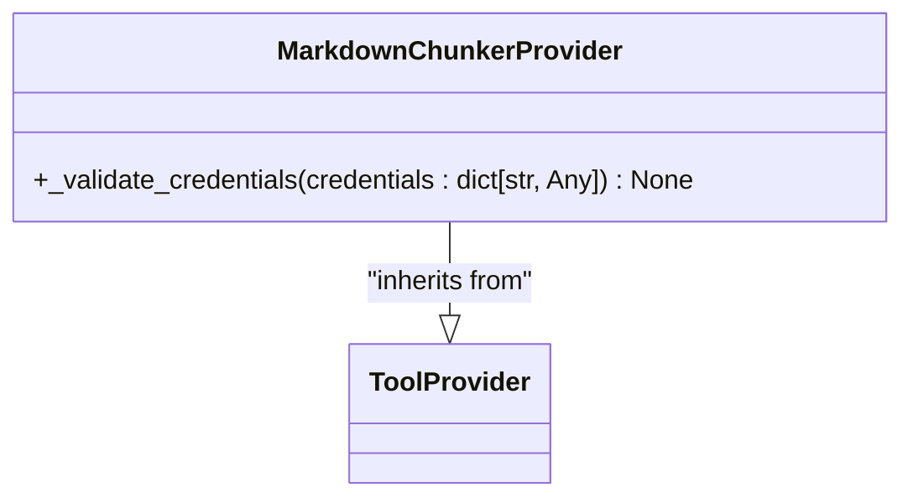
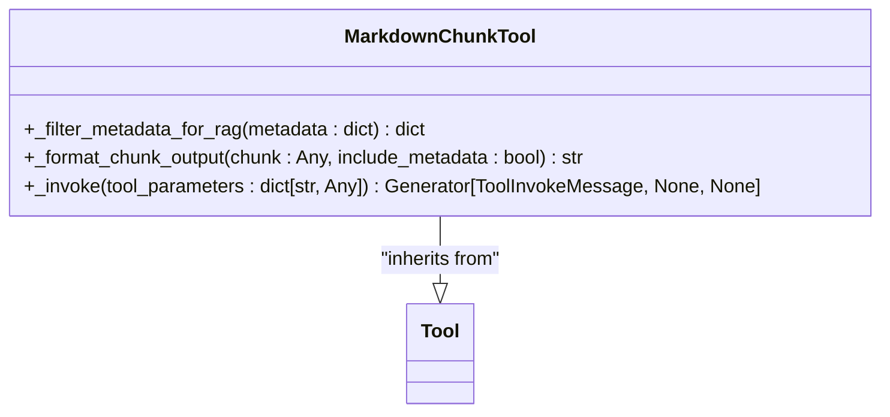
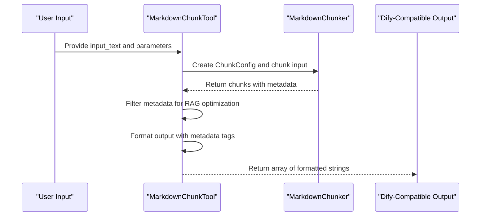

# Dify Plugin Integration

<cite>
**Referenced Files in This Document**   
- [provider/markdown_chunker.py](file://provider/markdown_chunker.py)
- [tools/markdown_chunk_tool.py](file://tools/markdown_chunk_tool.py)
- [examples/dify_integration.py](file://examples/dify_integration.py)
- [manifest.yaml](file://manifest.yaml)
- [provider/markdown_chunker.yaml](file://provider/markdown_chunker.yaml)
- [tools/markdown_chunk_tool.yaml](file://tools/markdown_chunk_tool.yaml)
</cite>

## Table of Contents
1. [Introduction](#introduction)
2. [Provider Implementation](#provider-implementation)
3. [Tool Implementation](#tool-implementation)
4. [Dify-Compatible Output Formatting](#dify-compatible-output-formatting)
5. [Manifest and Configuration](#manifest-and-configuration)
6. [Error Handling and Best Practices](#error-handling-and-best-practices)
7. [Conclusion](#conclusion)

## Introduction
The Dify plugin integration for the Advanced Markdown Chunker enables intelligent, structure-aware chunking of Markdown documents for Retrieval-Augmented Generation (RAG) systems. This documentation details the implementation of the `MarkdownChunkerProvider` and `MarkdownChunkTool` classes, their integration with Dify's plugin architecture, and best practices for deployment within Dify workflows. The plugin provides local processing of Markdown content without requiring external credentials or API keys.

## Provider Implementation

The `MarkdownChunkerProvider` class implements the `ToolProvider` interface from the Dify plugin framework. As chunking is a local operation that doesn't require external services, no credentials are needed for this provider.

The provider's `_validate_credentials` method acknowledges this by implementing a no-op validation that accepts any credentials dictionary without performing validation. This design choice reflects the local nature of the chunking operation, where authentication to external services is unnecessary.

**Diagram sources**
- [provider/markdown_chunker.py](file://provider/markdown_chunker.py#L15-L35)

**Section sources**
- [provider/markdown_chunker.py](file://provider/markdown_chunker.py#L15-L35)
- [tests/test_provider_class.py](file://tests/test_provider_class.py#L13-L108)

## Tool Implementation

The `MarkdownChunkTool` class implements the core functionality of the Dify plugin, processing tool parameters and generating Dify-compatible output. The tool's `_invoke` method handles the chunking workflow, extracting parameters such as `input_text`, `max_chunk_size`, `chunk_overlap`, `strategy`, and `include_metadata`.

The `_filter_metadata_for_rag` method plays a crucial role in optimizing the output for RAG systems by removing statistical and internal fields that don't contribute to retrieval effectiveness. It preserves only metadata fields that are useful for search and retrieval, such as content type, structural information, and semantic context.

**Diagram sources**
- [tools/markdown_chunk_tool.py](file://tools/markdown_chunk_tool.py#L20-L157)

**Section sources**
- [tools/markdown_chunk_tool.py](file://tools/markdown_chunk_tool.py#L20-L157)
- [tests/test_metadata_filtering.py](file://tests/test_metadata_filtering.py#L16-L319)
- [tests/integration/test_dify_plugin_integration.py](file://tests/integration/test_dify_plugin_integration.py#L22-L398)

## Dify-Compatible Output Formatting

The plugin generates output compatible with Dify's expectations through the `_format_chunk_output` method. When `include_metadata` is enabled, chunks are formatted with metadata enclosed in `<metadata>` tags containing JSON-formatted metadata. This structure allows Dify to parse both the content and associated metadata.

The examples in `dify_integration.py` demonstrate various use cases including Dify-compatible output formatting, RAG-optimized chunking configurations, and API endpoint simulation. These examples show how to transform chunked results into formats suitable for different Dify workflows, such as semantic search preparation and embedding generation.

**Diagram sources**
- [tools/markdown_chunk_tool.py](file://tools/markdown_chunk_tool.py#L74-L157)
- [examples/dify_integration.py](file://examples/dify_integration.py#L17-L487)

**Section sources**
- [examples/dify_integration.py](file://examples/dify_integration.py#L17-L487)
- [tools/markdown_chunk_tool.py](file://tools/markdown_chunk_tool.py#L74-L157)

## Manifest and Configuration

The plugin's configuration is defined in several YAML files that specify the tool's parameters and expected response format. The `manifest.yaml` file contains metadata about the plugin including version, author, description, and resource requirements. It specifies that the plugin requires 512MB of memory and is compatible with Dify version 1.9.0 and later.

The `tools/markdown_chunk_tool.yaml` file defines the tool's parameters with their types, defaults, and descriptions. Key parameters include:
- `input_text` (required string): The Markdown content to be chunked
- `max_chunk_size` (number, default: 1000): Maximum characters per chunk
- `chunk_overlap` (number, default: 100): Overlap between consecutive chunks
- `strategy` (select, default: auto): Chunking strategy selection
- `include_metadata` (boolean, default: true): Whether to include metadata

The output schema is defined to return a result object that conforms to Dify's general structure specification.

**Section sources**
- [manifest.yaml](file://manifest.yaml#L1-L48)
- [provider/markdown_chunker.yaml](file://provider/markdown_chunker.yaml#L1-L23)
- [tools/markdown_chunk_tool.yaml](file://tools/markdown_chunk_tool.yaml#L1-L128)

## Error Handling and Best Practices

The plugin implements comprehensive error handling patterns to ensure robust operation within Dify workflows. The `_invoke` method includes validation for required parameters, particularly ensuring that `input_text` is provided and not empty. Error conditions are communicated through Dify's messaging system using `create_text_message` to return descriptive error messages.

Best practices for deploying the plugin include:
- Using appropriate chunk sizes based on the target LLM's context window
- Enabling metadata inclusion for better retrieval performance
- Selecting the appropriate chunking strategy based on document content
- Handling large documents by adjusting chunk size and overlap parameters

The integration tests verify that the plugin handles various scenarios correctly, including edge cases like empty input, whitespace-only content, and invalid parameters.

**Section sources**
- [tools/markdown_chunk_tool.py](file://tools/markdown_chunk_tool.py#L115-L157)
- [tests/integration/test_dify_plugin_integration.py](file://tests/integration/test_dify_plugin_integration.py#L137-L394)

## Conclusion
The Dify plugin integration for the Advanced Markdown Chunker provides a robust solution for processing Markdown documents in RAG systems. By implementing the `MarkdownChunkerProvider` and `MarkdownChunkTool` classes, the plugin enables structure-aware chunking without requiring external credentials. The careful design of metadata filtering and output formatting ensures compatibility with Dify's expectations while optimizing for retrieval effectiveness. The comprehensive configuration and error handling make this plugin suitable for deployment in production Dify workflows.