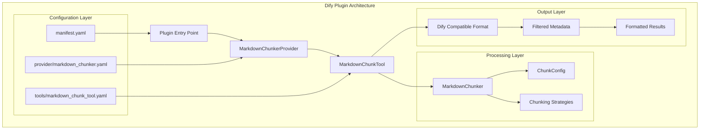
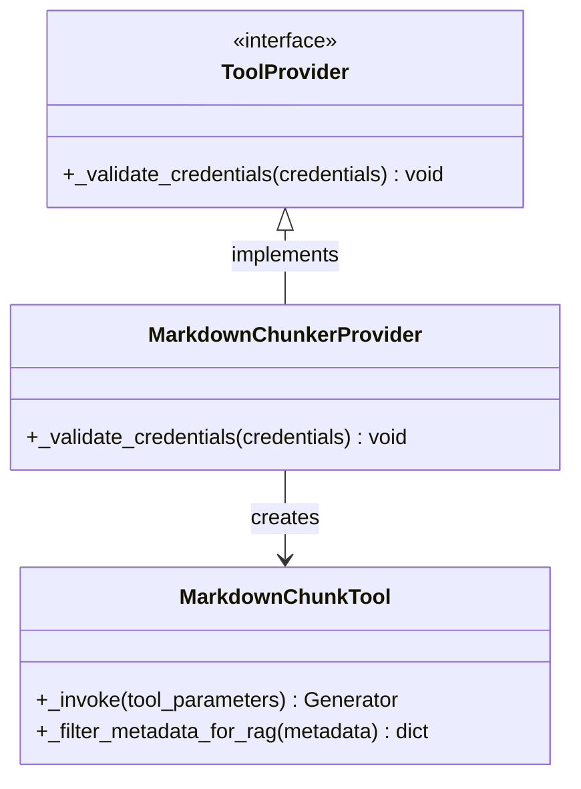
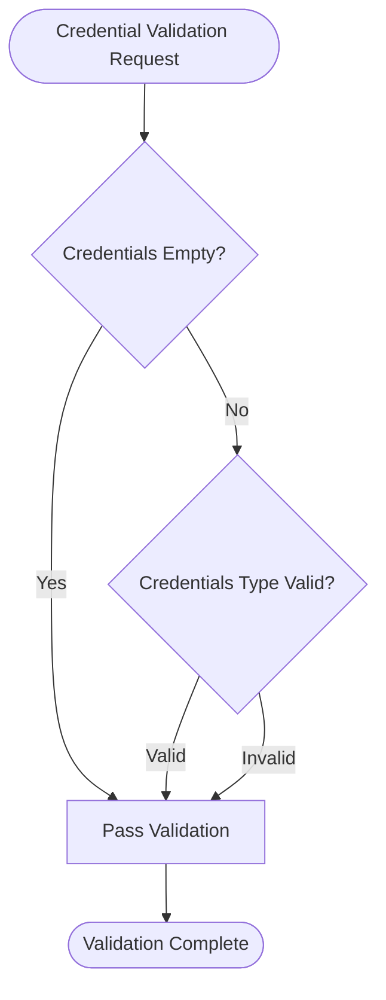
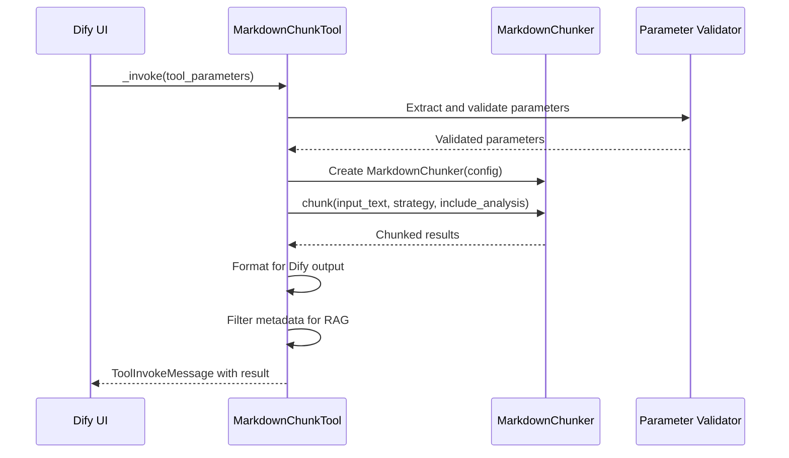
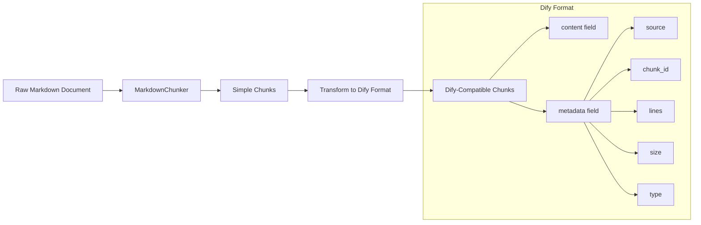
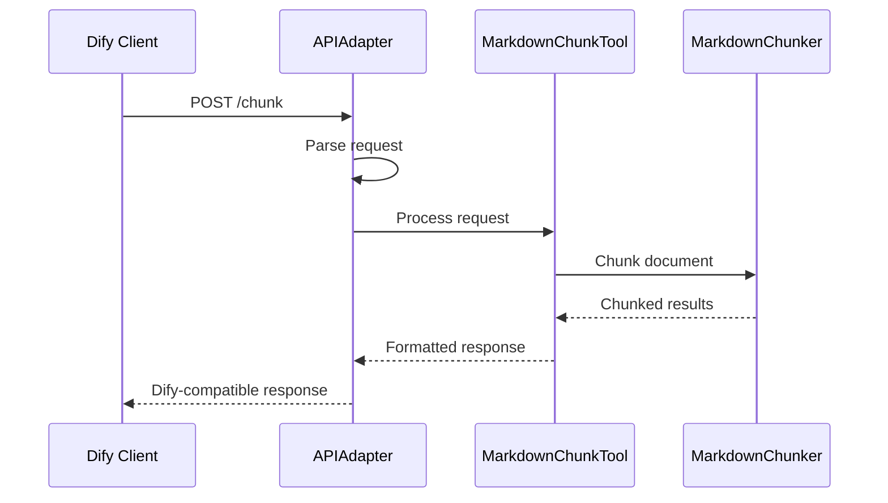
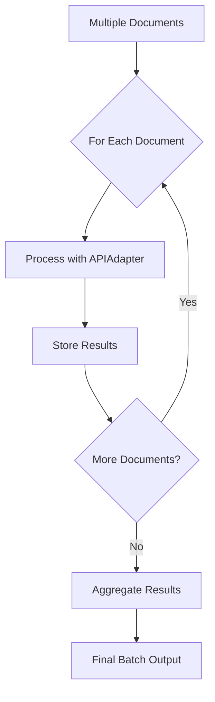
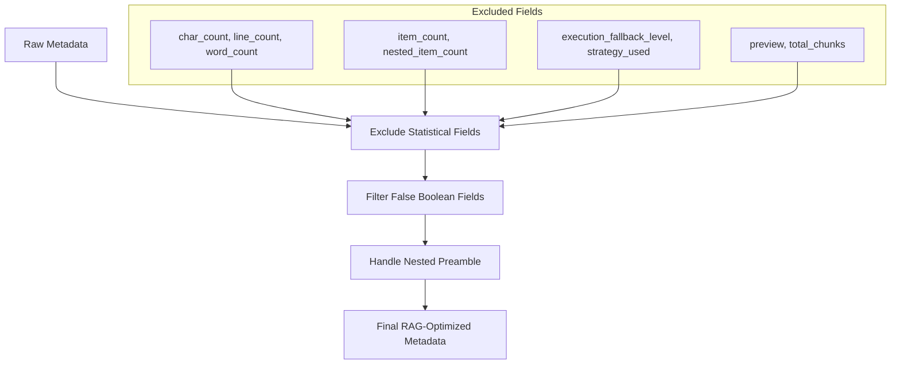
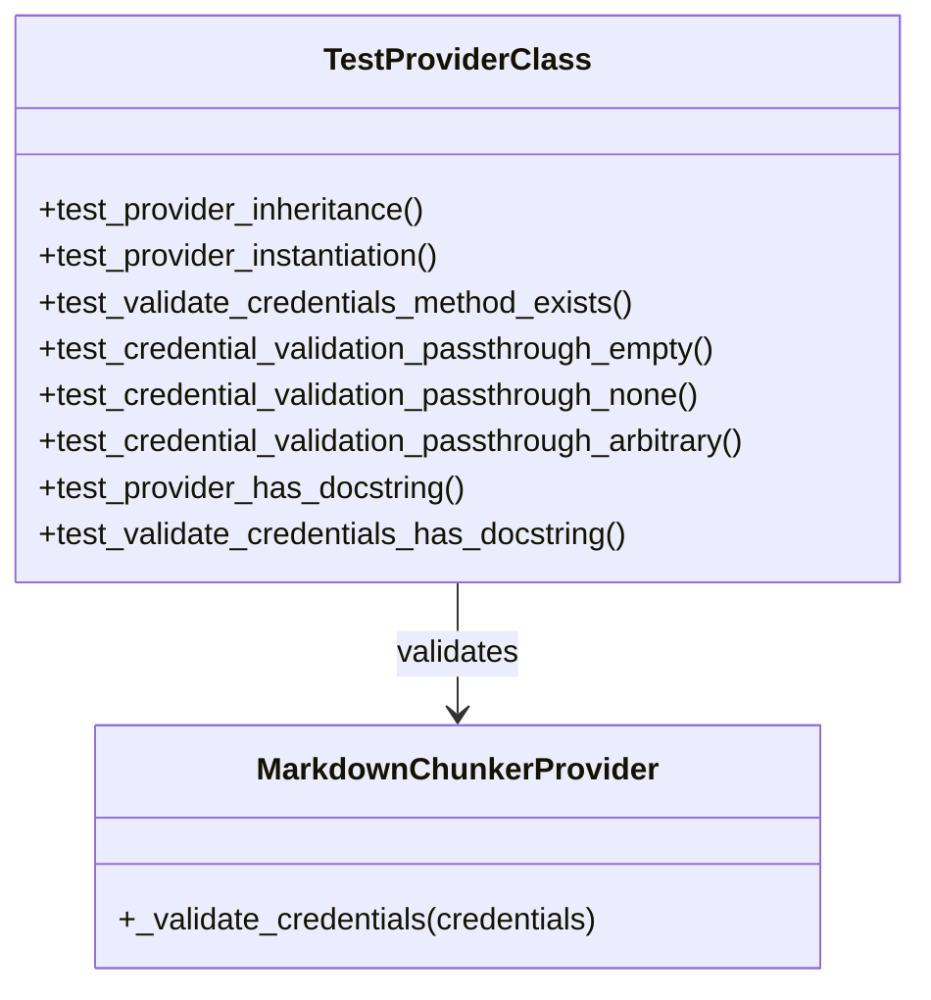
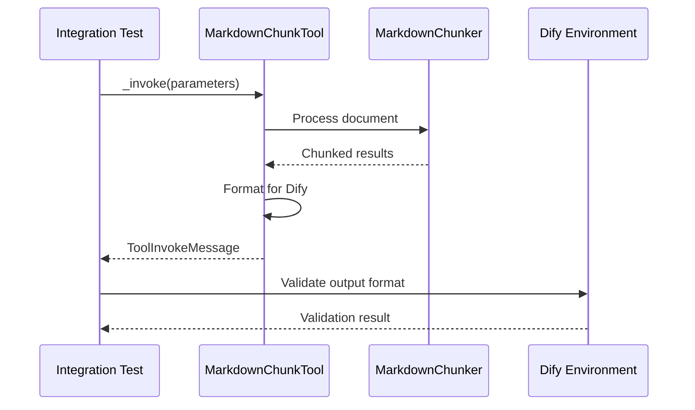

# Dify Plugin Integration

<cite>
**Referenced Files in This Document**
- [provider/markdown_chunker.py](file://provider/markdown_chunker.py)
- [tools/markdown_chunk_tool.py](file://tools/markdown_chunk_tool.py)
- [provider/markdown_chunker.yaml](file://provider/markdown_chunker.yaml)
- [tools/markdown_chunk_tool.yaml](file://tools/markdown_chunk_tool.yaml)
- [manifest.yaml](file://manifest.yaml)
- [examples/dify_integration.py](file://examples/dify_integration.py)
- [main.py](file://main.py)
- [tests/test_provider_class.py](file://tests/test_provider_class.py)
- [tests/test_provider_yaml.py](file://tests/test_provider_yaml.py)
- [tests/test_tool_yaml.py](file://tests/test_tool_yaml.py)
- [tests/integration/test_dify_plugin_integration.py](file://tests/integration/test_dify_plugin_integration.py)
</cite>

## Table of Contents
1. [Introduction](#introduction)
2. [Architecture Overview](#architecture-overview)
3. [Provider Implementation](#provider-implementation)
4. [Tool Implementation](#tool-implementation)
5. [Configuration Files](#configuration-files)
6. [Integration Examples](#integration-examples)
7. [Metadata Processing](#metadata-processing)
8. [Error Handling](#error-handling)
9. [Testing and Validation](#testing-and-validation)
10. [Troubleshooting Guide](#troubleshooting-guide)
11. [Best Practices](#best-practices)

## Introduction

The Dify plugin integration for the Advanced Markdown Chunker provides intelligent, structure-aware chunking of Markdown documents for Retrieval-Augmented Generation (RAG) systems. This plugin seamlessly integrates with Dify's Knowledge Base ingestion pipeline, offering sophisticated document processing capabilities while maintaining compatibility with Dify's tool provider interface.

The integration consists of two primary components: a provider class that manages tool credentials and lifecycle, and a tool class that performs the actual Markdown chunking operations. Both components are designed to work within Dify's plugin architecture while providing robust error handling and metadata enrichment for RAG systems.

## Architecture Overview

The Dify plugin integration follows a modular architecture that separates concerns between provider management and tool execution:



**Diagram sources**
- [main.py](file://main.py#L14-L31)
- [provider/markdown_chunker.py](file://provider/markdown_chunker.py#L15-L36)
- [tools/markdown_chunk_tool.py](file://tools/markdown_chunk_tool.py#L21-L178)

The architecture ensures clean separation between Dify-specific integration logic and the core chunking functionality, making the system maintainable and testable.

**Section sources**
- [main.py](file://main.py#L1-L31)
- [manifest.yaml](file://manifest.yaml#L1-L48)

## Provider Implementation

The `MarkdownChunkerProvider` class serves as the entry point for the plugin, managing tool lifecycle and credential validation. It conforms to Dify's `ToolProvider` interface while implementing the specific requirements for the Markdown chunking tool.

### Class Structure and Inheritance



**Diagram sources**
- [provider/markdown_chunker.py](file://provider/markdown_chunker.py#L15-L36)
- [tools/markdown_chunk_tool.py](file://tools/markdown_chunk_tool.py#L21-L178)

### Credential Validation

The provider implements a minimal credential validation mechanism since the chunking operations are performed locally without external dependencies:



**Diagram sources**
- [provider/markdown_chunker.py](file://provider/markdown_chunker.py#L25-L35)

The `_validate_credentials` method accepts any credential input without validation, as the chunking operations do not require external authentication or API keys. This design choice simplifies deployment while maintaining security through local processing.

**Section sources**
- [provider/markdown_chunker.py](file://provider/markdown_chunker.py#L15-L36)

## Tool Implementation

The `MarkdownChunkTool` class implements the core chunking functionality, processing Markdown documents according to Dify's tool interface requirements. It handles parameter validation, document processing, and output formatting for Dify's UI.

### Parameter Processing and Validation

The tool accepts five parameters with comprehensive validation:

| Parameter | Type | Required | Default | Description |
|-----------|------|----------|---------|-------------|
| `input_text` | string | Yes | N/A | Markdown text to be chunked |
| `max_chunk_size` | number | No | 1000 | Maximum chunk size in characters |
| `chunk_overlap` | number | No | 100 | Characters to overlap between chunks |
| `strategy` | select | No | "auto" | Chunking strategy selection |
| `include_metadata` | boolean | No | true | Include structural metadata |

### Processing Workflow



**Diagram sources**
- [tools/markdown_chunk_tool.py](file://tools/markdown_chunk_tool.py#L83-L178)

### Output Formatting for Dify

The tool formats chunked results according to Dify's expectations, using a specific structure that includes embedded metadata:

```mermaid
flowchart TD
Input[Raw Chunk Data] --> CheckMeta{"Include Metadata?"}
CheckMeta --> |Yes| FilterMeta[Filter RAG-Optimized Metadata]
CheckMeta --> |No| PlainContent[Plain Content Only]
FilterMeta --> SerializeJSON[Serialize Metadata to JSON]
SerializeJSON --> FormatString[Format: <metadata>\n{json}\n</metadata>\n{content}]
PlainContent --> FormatPlain[Format: {content}]
FormatString --> DifyOutput[Dify Compatible Output]
FormatPlain --> DifyOutput
```

**Diagram sources**
- [tools/markdown_chunk_tool.py](file://tools/markdown_chunk_tool.py#L133-L167)

**Section sources**
- [tools/markdown_chunk_tool.py](file://tools/markdown_chunk_tool.py#L21-L178)

## Configuration Files

The plugin uses three YAML configuration files that define the provider and tool specifications according to Dify's requirements.

### Manifest Configuration

The main manifest file defines plugin metadata and dependencies:

| Field | Value | Purpose |
|-------|-------|---------|
| `version` | 2.0.0 | Plugin version compatibility |
| `type` | plugin | Dify plugin type identifier |
| `minimum_dify_version` | 1.9.0 | Minimum Dify version requirement |
| `resource.memory` | 536870912 | 512MB memory allocation |
| `meta.arch` | [amd64, arm64] | Supported architectures |

### Provider Configuration

The provider YAML defines the plugin's identity and tool references:

```yaml
identity:
  author: asukhodko
  name: markdown_chunker
  label:
    en_US: Advanced Markdown Chunker
    zh_Hans: 高级 Markdown 分块器
    ru_RU: Продвинутый Markdown чанкер
  description:
    en_US: Advanced Markdown chunking with structural awareness for better RAG performance
    zh_Hans: 具有结构感知的高级 Markdown 分块，提升 RAG 性能
    ru_RU: Продвинутое чанкование Markdown с учётом структуры для улучшения RAG
  icon: icon.svg
  tags:
    - productivity
    - business

tools:
  - tools/markdown_chunk_tool.yaml

extra:
  python:
    source: provider/markdown_chunker.py
```

### Tool Configuration

The tool YAML defines parameter schemas and output specifications:

```yaml
parameters:
  - name: input_text
    type: string
    required: true
    form: llm
    label:
      en_US: Input Text
      zh_Hans: 输入文本
      ru_RU: Входной текст
    human_description:
      en_US: The Markdown text content to be chunked
      zh_Hans: 要分块的 Markdown 文本内容
      ru_RU: Текстовое содержимое Markdown для разделения на части

output_schema:
  type: object
  properties:
    result:
      $ref: "https://dify.ai/schemas/v1/general_structure.json"
```

**Section sources**
- [manifest.yaml](file://manifest.yaml#L1-L48)
- [provider/markdown_chunker.yaml](file://provider/markdown_chunker.yaml#L1-L23)
- [tools/markdown_chunk_tool.yaml](file://tools/markdown_chunk_tool.yaml#L1-L128)

## Integration Examples

The integration examples demonstrate various use cases for the Dify plugin, showcasing different approaches to document processing and metadata enrichment.

### Basic Dify-Compatible Output

The simplest integration involves transforming chunker output to match Dify's expected format:



**Diagram sources**
- [examples/dify_integration.py](file://examples/dify_integration.py#L17-L68)

### RAG-Optimized Chunking

For optimal RAG performance, the integration uses specialized configurations:

| Configuration | Value | Purpose |
|---------------|-------|---------|
| `max_chunk_size` | 1536 | Optimized for embedding models |
| `min_chunk_size` | 200 | Minimum content preservation |
| `overlap_size` | 200 | Context continuity |
| `enable_overlap` | true | Cross-chunk context |

### API Endpoint Simulation

The plugin can simulate Dify API endpoints for testing and development:



**Diagram sources**
- [examples/dify_integration.py](file://examples/dify_integration.py#L192-L262)

### Batch Processing

The integration supports processing multiple documents efficiently:



**Diagram sources**
- [examples/dify_integration.py](file://examples/dify_integration.py#L264-L312)

**Section sources**
- [examples/dify_integration.py](file://examples/dify_integration.py#L1-L487)

## Metadata Processing

The tool implements sophisticated metadata filtering specifically designed for RAG systems, removing unnecessary fields while preserving valuable structural information.

### Metadata Filtering Strategy



**Diagram sources**
- [tools/markdown_chunk_tool.py](file://tools/markdown_chunk_tool.py#L34-L81)

### Filtered Metadata Fields

The metadata filtering removes the following categories:

| Category | Excluded Fields | Rationale |
|----------|----------------|-----------|
| **Statistical** | `char_count`, `line_count`, `word_count`, `avg_line_length` | Not useful for semantic search |
| **Count** | `item_count`, `nested_item_count`, `unordered_item_count` | Redundant for retrieval |
| **Internal** | `execution_fallback_level`, `execution_strategy_used` | Implementation details |
| **Redundant** | `preview`, `total_chunks` | Duplicate information |

### RAG-Optimized Metadata Structure

The filtered metadata includes only fields that enhance retrieval performance:

```json
{
  "content_type": "list",
  "start_line": 10,
  "end_line": 25,
  "size": 500,
  "has_code": true,
  "has_table": false,
  "is_header": false,
  "complexity_score": 0.7
}
```

**Section sources**
- [tools/markdown_chunk_tool.py](file://tools/markdown_chunk_tool.py#L34-L81)

## Error Handling

The plugin implements comprehensive error handling to ensure robust operation within Dify's environment.

### Error Categories and Responses

```mermaid
flowchart TD
Error[Tool Execution Error] --> Category{Error Type}
Category --> |Schema Mismatch| SchemaError[Validation Error Response]
Category --> |Empty Input| EmptyError[Empty Input Error Response]
Category --> |Processing Failure| ProcessingError[General Error Response]
SchemaError --> SchemaMsg[Validation error: {message}]
EmptyError --> EmptyMsg[Error: input_text is required and cannot be empty]
ProcessingError --> GeneralMsg[Error chunking document: {message}]
SchemaMsg --> DifyResponse[Dify Error Response]
EmptyMsg --> DifyResponse
GeneralMsg --> DifyResponse
```

**Diagram sources**
- [tools/markdown_chunk_tool.py](file://tools/markdown_chunk_tool.py#L172-L178)

### Error Response Formats

The plugin returns structured error messages that Dify can display to users:

| Error Type | Response Format | Example |
|------------|----------------|---------|
| **Validation Error** | `"Validation error: {message}"` | `"Validation error: Invalid chunk size"` |
| **Empty Input** | `"Error: input_text is required and cannot be empty"` | Standardized empty input handling |
| **Processing Error** | `"Error chunking document: {message}"` | Detailed processing failure information |

**Section sources**
- [tools/markdown_chunk_tool.py](file://tools/markdown_chunk_tool.py#L172-L178)

## Testing and Validation

The plugin includes comprehensive testing suites that validate both individual components and end-to-end integration scenarios.

### Provider Class Validation

The provider class tests ensure compliance with Dify's requirements:



**Diagram sources**
- [tests/test_provider_class.py](file://tests/test_provider_class.py#L13-L108)

### Tool YAML Validation

The tool YAML validation ensures all required fields are present and correctly configured:

| Validation Test | Purpose | Expected Behavior |
|-----------------|---------|-------------------|
| **Identity Presence** | Verify tool identity section | Must exist with author, name, label, icon |
| **Parameter Completeness** | Check all required parameters | Must include input_text, max_chunk_size, chunk_overlap, strategy, include_metadata |
| **Localization** | Verify multi-language support | Must have en_US, zh_Hans, ru_RU translations |
| **Output Schema** | Validate output format | Must reference Dify's general structure schema |

### Integration Testing

End-to-end integration tests verify the complete workflow:



**Diagram sources**
- [tests/integration/test_dify_plugin_integration.py](file://tests/integration/test_dify_plugin_integration.py#L51-L388)

**Section sources**
- [tests/test_provider_class.py](file://tests/test_provider_class.py#L1-L108)
- [tests/test_provider_yaml.py](file://tests/test_provider_yaml.py#L1-L95)
- [tests/test_tool_yaml.py](file://tests/test_tool_yaml.py#L1-L188)
- [tests/integration/test_dify_plugin_integration.py](file://tests/integration/test_dify_plugin_integration.py#L1-L388)

## Troubleshooting Guide

Common issues and their solutions when integrating the Markdown chunker with Dify.

### Schema Mismatches

**Problem**: Dify reports schema validation errors
**Solution**: Verify parameter definitions in `tools/markdown_chunk_tool.yaml` match expected types and requirements.

**Common Issues**:
- Missing required parameters
- Incorrect parameter types
- Missing localization fields
- Invalid default values

### Empty Input Handling

**Problem**: Tool fails silently with empty input
**Solution**: The tool validates input_text parameter and returns appropriate error messages.

**Debugging Steps**:
1. Check if input_text parameter is provided
2. Verify input_text is not empty or whitespace-only
3. Ensure proper parameter passing from Dify UI

### Metadata Filtering Issues

**Problem**: Metadata appears in RAG results when not expected
**Solution**: Verify `include_metadata` parameter is set correctly and metadata filtering is applied.

**Common Causes**:
- `include_metadata` set to true when false is desired
- Metadata filtering not being applied
- RAG system not respecting metadata filtering

### Performance Issues

**Problem**: Large documents cause timeouts or memory issues
**Solution**: Adjust chunking parameters and monitor resource usage.

**Optimization Tips**:
- Reduce `max_chunk_size` for large documents
- Increase `chunk_overlap` gradually
- Monitor memory usage during processing
- Consider batch processing for multiple documents

### Integration Failures

**Problem**: Plugin fails to load or execute
**Solution**: Verify configuration files and dependencies.

**Verification Checklist**:
- All YAML files are properly formatted
- Python dependencies are installed
- Plugin entry point is correct
- Dify version compatibility

**Section sources**
- [tests/integration/test_dify_plugin_integration.py](file://tests/integration/test_dify_plugin_integration.py#L131-L147)

## Best Practices

### Configuration Recommendations

For optimal Dify plugin performance and reliability:

1. **Memory Allocation**: Allocate at least 512MB for processing large documents
2. **Timeout Settings**: Set appropriate timeouts (300 seconds for large documents)
3. **Chunk Size**: Use 1536 characters for optimal embedding compatibility
4. **Overlap**: Maintain 200-300 character overlap for context preservation

### Metadata Management

- Enable metadata inclusion for RAG systems requiring structural information
- Use metadata filtering to reduce storage overhead
- Include relevant document identifiers in metadata for tracking

### Error Handling

- Implement comprehensive error handling for all parameter combinations
- Provide clear error messages for user feedback
- Log processing errors for debugging and monitoring

### Testing Strategy

- Test with various document types (code-heavy, list-heavy, mixed content)
- Validate metadata filtering behavior
- Test edge cases (empty documents, very large documents)
- Verify localization support across all languages

### Deployment Considerations

- Ensure compatibility with Dify 1.9.0+ requirements
- Test on both amd64 and arm64 architectures
- Monitor resource usage in production environments
- Implement proper logging for troubleshooting