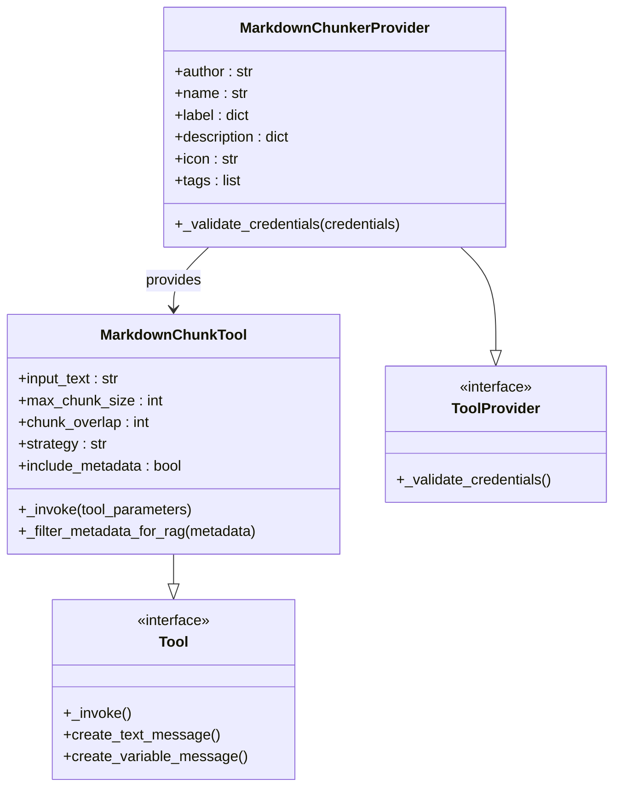
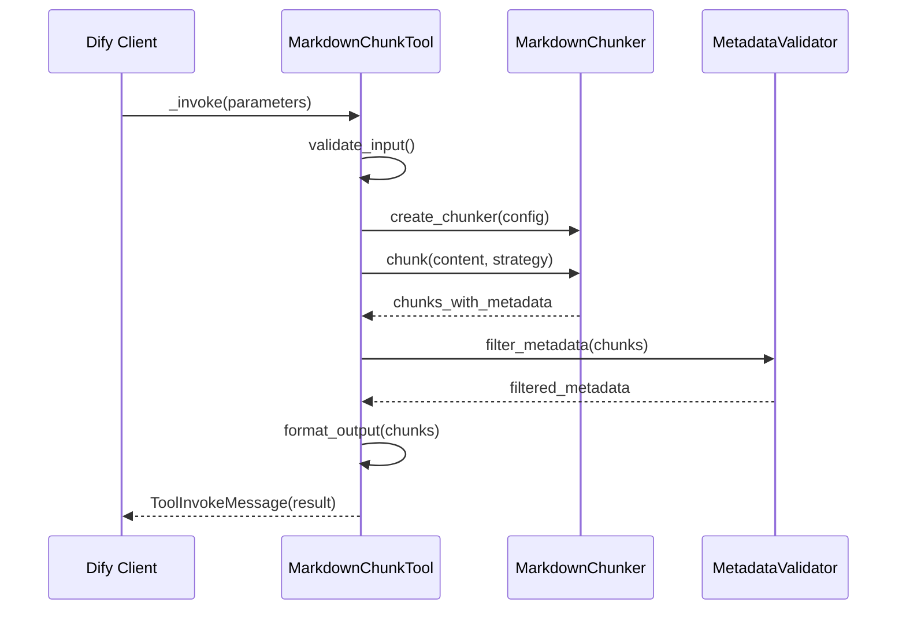
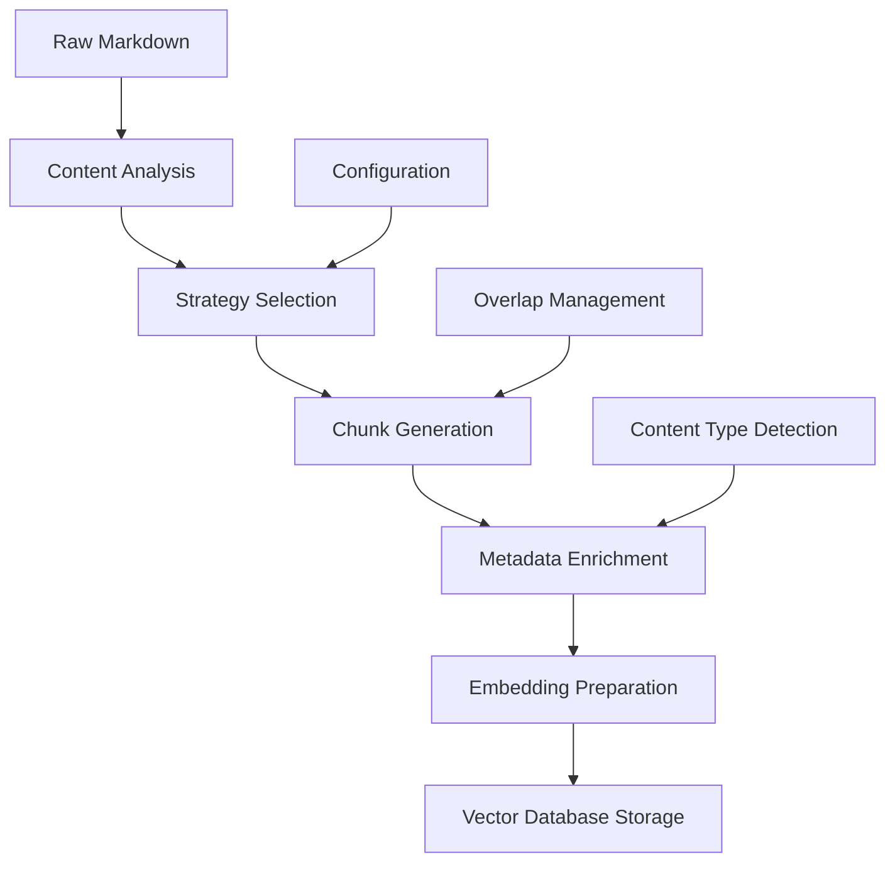
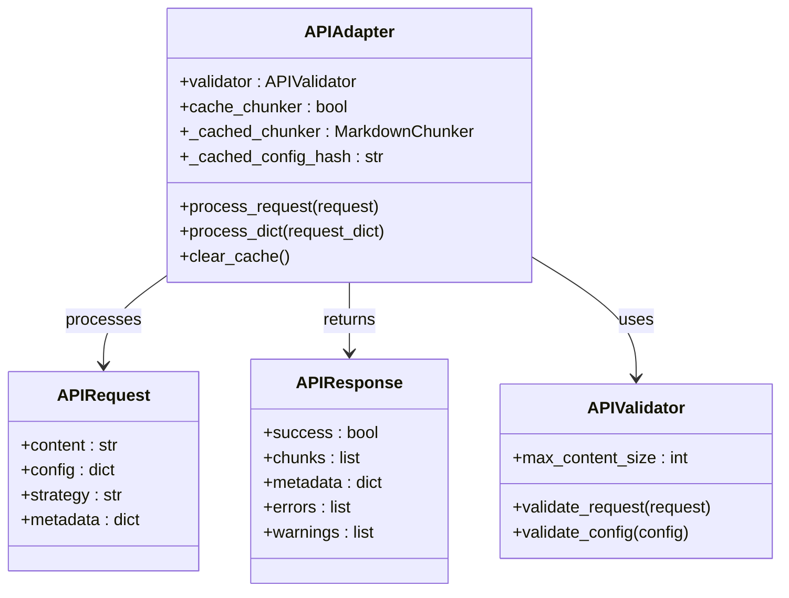

# Integration

<cite>
**Referenced Files in This Document**
- [examples/dify_integration.py](file://examples/dify_integration.py)
- [examples/rag_integration.py](file://examples/rag_integration.py)
- [examples/api_usage.py](file://examples/api_usage.py)
- [examples/basic_usage.py](file://examples/basic_usage.py)
- [provider/markdown_chunker.py](file://provider/markdown_chunker.py)
- [tools/markdown_chunk_tool.py](file://tools/markdown_chunk_tool.py)
- [tools/markdown_chunk_tool.yaml](file://tools/markdown_chunk_tool.yaml)
- [provider/markdown_chunker.yaml](file://provider/markdown_chunker.yaml)
- [manifest.yaml](file://manifest.yaml)
- [main.py](file://main.py)
- [tests/integration/test_dify_plugin_integration.py](file://tests/integration/test_dify_plugin_integration.py)
- [tests/api/test_adapter.py](file://tests/api/test_adapter.py)
- [README.md](file://README.md)
</cite>

## Table of Contents
1. [Introduction](#introduction)
2. [Dify Plugin Implementation](#dify-plugin-implementation)
3. [CLI Tool Usage](#cli-tool-usage)
4. [RAG System Integration](#rag-system-integration)
5. [Configuration Requirements](#configuration-requirements)
6. [Integration Patterns](#integration-patterns)
7. [Troubleshooting Guide](#troubleshooting-guide)
8. [Best Practices](#best-practices)

## Introduction

The Advanced Markdown Chunker provides comprehensive integration capabilities for external systems, particularly focusing on Dify RAG (Retrieval-Augmented Generation) systems and general RAG pipelines. The plugin offers multiple integration points including a Dify-compatible plugin system, REST API adapters, and CLI tools designed for seamless integration into existing workflows.

The chunker employs intelligent content analysis to automatically select optimal chunking strategies based on document characteristics, ensuring maximum retrieval quality for vector databases and search systems.

## Dify Plugin Implementation

### Plugin Architecture

The Dify plugin implementation follows the Dify Plugin SDK architecture, providing a structured approach to integration with Dify's Knowledge Base ingestion pipeline.



**Diagram sources**
- [provider/markdown_chunker.py](file://provider/markdown_chunker.py#L15-L36)
- [tools/markdown_chunk_tool.py](file://tools/markdown_chunk_tool.py#L21-L178)

### Dify Plugin Interface Compliance

The plugin conforms to the Dify Plugin SDK requirements through several key components:

#### Provider Class Implementation

The [`MarkdownChunkerProvider`](file://provider/markdown_chunker.py#L15-L36) class implements the required interface for Dify plugin providers:

- **Credential Validation**: Implements `_validate_credentials()` method that accepts but ignores credentials (as chunking is a local operation)
- **Metadata Definition**: Provides comprehensive metadata including author, name, labels, descriptions, and icons
- **Tool Registration**: Declares associated tools through the tools array in the provider configuration

#### Tool Implementation

The [`MarkdownChunkTool`](file://tools/markdown_chunk_tool.py#L21-L178) class provides the core chunking functionality:

- **Parameter Schema**: Defines input parameters with type validation, defaults, and descriptions
- **Output Formatting**: Formats results according to Dify's expectations with embedded metadata
- **Error Handling**: Provides graceful error handling with appropriate error messages
- **Metadata Filtering**: Filters metadata to include only RAG-relevant fields

### Input/Output Schema

#### Tool Parameters

The tool accepts the following parameters as defined in the YAML manifest:

| Parameter | Type | Required | Default | Description |
|-----------|------|----------|---------|-------------|
| `input_text` | string | Yes | - | The Markdown text content to be chunked |
| `max_chunk_size` | number | No | 1000 | Maximum size of each chunk in characters |
| `chunk_overlap` | number | No | 100 | Number of characters to overlap between consecutive chunks |
| `strategy` | select | No | auto | Chunking strategy (auto, code, structural, mixed) |
| `include_metadata` | boolean | No | true | Include structural metadata with each chunk |

#### Output Format

The tool produces output in Dify's expected format:

```json
{
  "result": [
    "<metadata>\n{json}\n</metadata>\n{content}",
    "{content_without_metadata}"
  ]
}
```

Where:
- Metadata is filtered to remove statistical and internal fields
- Content follows the metadata block
- Each chunk is a separate string in the result array

**Section sources**
- [tools/markdown_chunk_tool.py](file://tools/markdown_chunk_tool.py#L83-L178)
- [tools/markdown_chunk_tool.yaml](file://tools/markdown_chunk_tool.yaml#L24-L127)

### Dify Workflow Builder Integration

The plugin appears in the Dify workflow builder with comprehensive metadata:

#### Manifest Configuration

The [`manifest.yaml`](file://manifest.yaml#L1-L48) defines the plugin's identity and capabilities:

- **Version Control**: Tracks version 2.0.0 with semantic versioning
- **Resource Requirements**: Specifies 512MB memory allocation
- **Permission Model**: Disables tool and model permissions for security
- **Runtime Configuration**: Python 3.12 with 300-second timeout for large documents

#### Provider Manifest

The [`provider/markdown_chunker.yaml`](file://provider/markdown_chunker.yaml#L1-L23) configures the provider:

- **Tool Association**: Links to the markdown chunk tool
- **Icon Resources**: References SVG icon files
- **Tagging**: Categorizes as productivity and business tools

#### Tool Manifest

The [`tools/markdown_chunk_tool.yaml`](file://tools/markdown_chunk_tool.yaml#L1-L128) defines the tool's interface:

- **Localization**: Supports English, Chinese, and Russian labels
- **Parameter Descriptions**: Provides human and LLM-friendly descriptions
- **Strategy Options**: Offers multiple chunking strategies
- **Output Schema**: Defines the result structure

**Section sources**
- [manifest.yaml](file://manifest.yaml#L1-L48)
- [provider/markdown_chunker.yaml](file://provider/markdown_chunker.yaml#L1-L23)
- [tools/markdown_chunk_tool.yaml](file://tools/markdown_chunk_tool.yaml#L1-L128)

### API Endpoint Simulation

The plugin includes comprehensive API simulation examples that demonstrate real-world integration patterns:

#### Request Processing Flow



**Diagram sources**
- [tools/markdown_chunk_tool.py](file://tools/markdown_chunk_tool.py#L83-L178)
- [tests/integration/test_dify_plugin_integration.py](file://tests/integration/test_dify_plugin_integration.py#L54-L80)

**Section sources**
- [examples/dify_integration.py](file://examples/dify_integration.py#L192-L262)

## CLI Tool Usage

### Command-Line Interface

The CLI tool provides direct access to chunking functionality through command-line operations:

#### Basic Usage Pattern

```bash
# Process markdown file
python -m tools.markdown_chunk_tool --input-file document.md --output-format json

# Process text input
echo "# Document\nContent here" | python -m tools.markdown_chunk_tool --input-format text

# Custom configuration
python -m tools.markdown_chunk_tool --max-chunk-size 2048 --chunk-overlap 200 --strategy code
```

#### Command-Line Options

The CLI tool supports various configuration options:

| Option | Description | Default |
|--------|-------------|---------|
| `--max-chunk-size` | Maximum chunk size in characters | 1000 |
| `--chunk-overlap` | Overlap between chunks | 100 |
| `--strategy` | Chunking strategy | auto |
| `--include-metadata` | Include metadata in output | true |
| `--output-format` | Output format (json/text) | text |

#### Input/Output Formats

The CLI tool supports multiple input and output formats:

- **Input Formats**: File content, stdin text, JSON configuration
- **Output Formats**: Plain text chunks, JSON with metadata, streaming output
- **Error Handling**: Comprehensive error reporting with exit codes

**Section sources**
- [tools/markdown_chunk_tool.py](file://tools/markdown_chunk_tool.py#L100-L178)

### Practical Examples

#### Batch Processing

```bash
# Process multiple files
find ./docs -name "*.md" | xargs -I {} python -m tools.markdown_chunk_tool --input-file {}

# Stream processing
cat large_document.md | python -m tools.markdown_chunk_tool --max-chunk-size 1500 --chunk-overlap 150
```

#### Integration with Other Tools

```bash
# Pipe to other processing tools
python -m tools.markdown_chunk_tool --input-file docs.md | jq '.[]' | wc -l

# Save to vector database
python -m tools.markdown_chunk_tool --input-file docs.md --output-format json | \
  curl -X POST -H "Content-Type: application/json" \
       -d @- http://vector-db/api/chunks
```

## RAG System Integration

### Vector Database Integration Patterns

The chunker provides specialized integration patterns for RAG systems, optimizing content for retrieval quality:

#### Embedding Preparation



**Diagram sources**
- [examples/rag_integration.py](file://examples/rag_integration.py#L13-L53)
- [examples/rag_integration.py](file://examples/rag_integration.py#L314-L366)

#### RAG-Optimized Configuration

The [`ChunkConfig.for_dify_rag()`](file://examples/rag_integration.py#L13-L53) provides optimized settings for RAG systems:

- **Max Chunk Size**: 1536 characters (optimal for embedding models)
- **Overlap**: 200 characters (preserves context across chunks)
- **Strategy**: Automatic selection based on content analysis
- **Metadata**: Rich structural information for retrieval

#### Context Window Optimization

Different LLM context windows require different chunking configurations:

| Model | Max Chunk Size | Recommended Strategy |
|-------|---------------|---------------------|
| GPT-3.5 (4K) | 1536 | Chat context profile |
| GPT-4 (8K) | 3072 | API documentation profile |
| GPT-4 (32K) | 6144 | Large document profile |

**Section sources**
- [examples/rag_integration.py](file://examples/rag_integration.py#L13-L53)
- [examples/rag_integration.py](file://examples/rag_integration.py#L314-L366)

### Semantic Search Preparation

The chunker enhances content for semantic search through:

#### Metadata Enrichment

```python
# Enrich chunks with search-relevant metadata
enriched_chunks = []
for chunk in result.chunks:
    enriched = {
        "content": chunk.content,
        "metadata": {
            **chunk.metadata,
            "chunk_id": f"chunk_{i}",
            "document_id": "api_docs_v1",
            "section": "authentication" if i == 0 else "rate_limits",
            "language": "en",
            "version": "1.0",
            "indexed_at": "2025-11-09T00:00:00Z",
            "chunking_strategy": result.strategy_used,
            "chunk_index": i,
            "total_chunks": len(result.chunks)
        }
    }
    enriched_chunks.append(enriched)
```

#### Search Tagging

The system automatically generates search tags based on content characteristics:

- **Code Blocks**: Tagged with programming languages
- **Tables**: Tagged with column and row counts
- **Lists**: Tagged with list types and item counts
- **Headers**: Tagged with section hierarchy

**Section sources**
- [examples/rag_integration.py](file://examples/rag_integration.py#L354-L410)
- [examples/dify_integration.py](file://examples/dify_integration.py#L397-L449)

### Vector Database Storage

#### Chunk Structure for Vector Stores

Each chunk is prepared with comprehensive metadata for vector database storage:

```json
{
  "id": "doc_1_chunk_0",
  "doc_id": "doc_1",
  "chunk_id": 0,
  "text": "Chunk content here...",
  "metadata": {
    "doc_id": "doc_1",
    "chunk_index": 0,
    "total_chunks": 15,
    "lines": "1-25",
    "size": 500,
    "strategy": "structural",
    "content_type": "text",
    "has_code": false,
    "has_table": true,
    "has_list": false,
    "complexity": 0.75
  }
}
```

#### Batch Processing for Large Datasets

```python
def prepare_for_vector_database(documents: List[Dict[str, str]]) -> List[Dict[str, Any]]:
    """Prepare multiple documents for vector database storage."""
    chunker = MarkdownChunker(ChunkConfig(max_chunk_size=500, enable_overlap=True, overlap_size=50))
    
    all_chunks = []
    for doc in documents:
        doc_id = doc['id']
        content = doc['content']
        
        result = chunker.chunk_with_analysis(content)
        
        for chunk in result.chunks:
            all_chunks.append({
                'id': f"{doc_id}_chunk_{chunk.index}",
                'doc_id': doc_id,
                'chunk_id': chunk.index,
                'text': chunk.content,
                'metadata': {
                    'doc_id': doc_id,
                    'chunk_index': chunk.index,
                    'total_chunks': len(result.chunks),
                    'lines': f"{chunk.start_line}-{chunk.end_line}",
                    'size': chunk.size,
                    'strategy': result.strategy_used,
                    'content_type': result.content_type,
                    **chunk.metadata
                }
            })
    
    return all_chunks
```

**Section sources**
- [examples/rag_integration.py](file://examples/rag_integration.py#L56-L98)

## Configuration Requirements

### YAML Configuration Files

#### Provider Configuration

The provider configuration defines the plugin's identity and capabilities:

```yaml
identity:
  author: asukhodko
  name: markdown_chunker
  label:
    en_US: Advanced Markdown Chunker
    zh_Hans: 高级 Markdown 分块器
    ru_RU: Продвинутый Markdown чанкер
  description:
    en_US: Advanced Markdown chunking with structural awareness for better RAG performance
    zh_Hans: 具有结构感知的高级 Markdown 分块，提升 RAG 性能
    ru_RU: Продвинутое чанкование Markdown с учётом структуры для улучшения RAG
  icon: icon.svg
  tags:
    - productivity
    - business

tools:
  - tools/markdown_chunk_tool.yaml

extra:
  python:
    source: provider/markdown_chunker.py
```

#### Tool Configuration

The tool configuration specifies parameters and behavior:

```yaml
identity:
  name: markdown_chunk_tool
  author: asukhodko
  label:
    en_US: Markdown Chunker
    zh_Hans: Markdown 分块器
    ru_RU: Markdown чанкер
  icon: icon.svg

description:
  human:
    en_US: Advanced Markdown chunking with structural awareness for better RAG performance
    zh_Hans: 具有结构感知的高级 Markdown 分块，提升 RAG 性能
    ru_RU: Продвинутое чанкование Markdown с учётом структуры для улучшения RAG
  llm: |
    A tool for chunking Markdown documents with structural awareness.

parameters:
  - name: input_text
    type: string
    required: true
    form: llm
    label:
      en_US: Input Text
      zh_Hans: 输入文本
      ru_RU: Входной текст
    human_description:
      en_US: The Markdown text content to be chunked
      zh_Hans: 要分块的 Markdown 文本内容
      ru_RU: Текстовое содержимое Markdown для разделения на части
    llm_description: The Markdown document text that needs to be split into chunks for processing

  - name: max_chunk_size
    type: number
    required: false
    default: 1000
    form: form
    label:
      en_US: Max Chunk Size
      zh_Hans: 最大块大小
      ru_RU: Максимальный размер части
    human_description:
      en_US: "Maximum size of each chunk in characters (default: 1000)"
      zh_Hans: "每个块的最大字符数（默认：1000）"
      ru_RU: "Максимальный размер каждой части в символах (по умолчанию: 1000)"
    llm_description: Maximum number of characters allowed in each chunk. Larger values create bigger chunks with more context.

output_schema:
  type: object
  properties:
    result:
      $ref: "https://dify.ai/schemas/v1/general_structure.json"
```

**Section sources**
- [provider/markdown_chunker.yaml](file://provider/markdown_chunker.yaml#L1-L23)
- [tools/markdown_chunk_tool.yaml](file://tools/markdown_chunk_tool.yaml#L1-L128)

### Manifest Configuration

The manifest defines plugin metadata and runtime requirements:

```yaml
version: 2.0.0
type: plugin
author: asukhodko
name: markdown_chunker

label:
  en_US: Advanced Markdown Chunker
  zh_Hans: 高级 Markdown 分块器
  ru_RU: Продвинутый Markdown чанкер

description:
  en_US: Advanced Markdown chunking with structural awareness for better RAG performance
  zh_Hans: 具有结构感知的高级 Markdown 分块，提升 RAG 性能
  ru_RU: Продвинутое чанкование Markdown с учётом структуры для улучшения RAG

icon: icon.svg

resource:
  memory: 536870912  # 512MB in bytes

permission:
  tool:
    enabled: false
  model:
    enabled: false

plugins:
  tools:
    - provider/markdown_chunker.yaml

meta:
  version: 2.0.0
  arch:
    - amd64
    - arm64
  runner:
    language: python
    version: "3.12"
    entrypoint: main

minimum_dify_version: 1.9.0

tags:
  - productivity
  - business

created_at: 2025-11-22T00:00:00Z
```

**Section sources**
- [manifest.yaml](file://manifest.yaml#L1-L48)

### Environment Configuration

#### Runtime Requirements

The plugin requires specific runtime configurations:

- **Python Version**: 3.12+
- **Memory**: 512MB minimum
- **Timeout**: 300 seconds for large documents
- **Dependencies**: markdown-it-py, pydantic, dify_plugin

#### Development Configuration

Development environments require additional dependencies:

- **Testing**: pytest, hypothesis
- **Formatting**: black, isort
- **Linting**: flake8
- **Documentation**: sphinx (optional)

## Integration Patterns

### API Adapter Pattern

The API adapter provides a standardized interface for external system integration:



**Diagram sources**
- [tests/api/test_adapter.py](file://tests/api/test_adapter.py#L8-L284)

#### Request Processing Pipeline

```python
# Example request processing
adapter = APIAdapter()

# Create request
request = APIRequest(
    content="# Document\n\nContent here.",
    config={"max_chunk_size": 2048, "min_chunk_size": 100},
    strategy="structural",
    metadata={"source": "test"}
)

# Process request
response = adapter.process_request(request)

# Handle response
if response.success:
    chunks = response.chunks
    metadata = response.metadata
else:
    errors = response.errors
```

**Section sources**
- [examples/api_usage.py](file://examples/api_usage.py#L16-L46)
- [tests/api/test_adapter.py](file://tests/api/test_adapter.py#L240-L284)

### Batch Processing Pattern

For large-scale integration, the chunker supports batch processing:

#### Multi-Document Processing

```python
def batch_process_documents(documents: List[Dict[str, str]]) -> List[Dict[str, Any]]:
    """Process multiple documents efficiently."""
    adapter = APIAdapter(cache_chunker=True)
    
    results = []
    for doc in documents:
        request = APIRequest(
            content=doc['content'],
            metadata={"doc_id": doc['id'], "title": doc['title']}
        )
        
        response = adapter.process_request(request)
        
        if response.success:
            results.append({
                "doc_id": doc['id'],
                "title": doc['title'],
                "chunks": len(response.chunks),
                "strategy": response.metadata['strategy_used']
            })
    
    return results
```

#### Streaming Response Pattern

For real-time applications, the chunker supports streaming responses:

```python
def stream_chunks(content: str):
    """Stream chunks as they become available."""
    adapter = APIAdapter()
    request = APIRequest(content=content)
    
    response = adapter.process_request(request)
    
    if response.success:
        for i, chunk in enumerate(response.chunks):
            # Yield chunk immediately
            yield json.dumps(chunk)
            
            # Process next chunk asynchronously
            if i < len(response.chunks) - 1:
                # Continue processing in background
                pass
```

**Section sources**
- [examples/dify_integration.py](file://examples/dify_integration.py#L264-L308)
- [examples/api_usage.py](file://examples/api_usage.py#L270-L299)

### Strategy Selection Pattern

The chunker automatically selects optimal strategies based on content analysis:

#### Content-Aware Strategy Selection

```python
# Automatic strategy selection
chunker = MarkdownChunker()
result = chunker.chunk_with_analysis(mixed_document)

# Strategy analysis
print(f"Strategy used: {result.strategy_used}")
print(f"Content type: {result.content_type}")
print(f"Complexity score: {result.complexity_score}")

# Manual strategy override
chunks = chunker.chunk(document, strategy="code")  # Force code strategy
```

#### Strategy Comparison

Different strategies excel in different scenarios:

| Strategy | Best For | Characteristics |
|----------|----------|----------------|
| Auto | Unknown content | Analyzes content and selects best strategy |
| Code | Code-heavy documents | Preserves code blocks and syntax |
| Structural | Documents with headers | Follows document hierarchy |
| Mixed | Balanced content | Combines multiple approaches |
| List | Lists and bullet points | Preserves list structure |
| Sentences | Simple text | Sentence-based splitting |

**Section sources**
- [examples/basic_usage.py](file://examples/basic_usage.py#L139-L166)
- [examples/rag_integration.py](file://examples/rag_integration.py#L354-L410)

## Troubleshooting Guide

### Common Integration Issues

#### Schema Mismatches

**Problem**: Dify workflow fails with validation errors
**Solution**: Verify parameter types and required fields match the tool manifest

```python
# Check parameter types
assert isinstance(tool_parameters.get("max_chunk_size"), int)
assert isinstance(tool_parameters.get("include_metadata"), bool)

# Validate required fields
assert "input_text" in tool_parameters
assert tool_parameters["input_text"].strip()
```

#### Performance Bottlenecks

**Problem**: Slow processing times for large documents
**Solutions**:

1. **Increase timeout**: Adjust `MAX_REQUEST_TIMEOUT` in main.py
2. **Optimize chunk size**: Use smaller chunks for better parallelization
3. **Enable caching**: Use `cache_chunker=True` in API adapter
4. **Select appropriate strategy**: Use "auto" for optimal strategy selection

```python
# Optimize for performance
adapter = APIAdapter(
    cache_chunker=True,  # Enable chunker caching
    validator=APIValidator(max_content_size=1000000)  # 1MB limit
)
```

#### Memory Issues

**Problem**: Out of memory errors during processing
**Solutions**:

1. **Reduce chunk size**: Lower `max_chunk_size` parameter
2. **Limit document size**: Process documents in smaller batches
3. **Monitor memory usage**: Track memory consumption during processing

```python
# Memory-efficient processing
def process_large_document(content: str, max_chunk_size: int = 500):
    """Process large documents with memory constraints."""
    config = ChunkConfig(max_chunk_size=max_chunk_size)
    chunker = MarkdownChunker(config)
    
    # Process in smaller segments
    segments = [content[i:i+10000] for i in range(0, len(content), 10000)]
    
    all_chunks = []
    for segment in segments:
        result = chunker.chunk_with_analysis(segment)
        all_chunks.extend(result.chunks)
    
    return all_chunks
```

**Section sources**
- [main.py](file://main.py#L16-L31)
- [tests/integration/test_dify_plugin_integration.py](file://tests/integration/test_dify_plugin_integration.py#L373-L385)

### Error Handling Patterns

#### Graceful Degradation

```python
def robust_chunking(content: str, fallback_strategy: str = "sentences"):
    """Robust chunking with fallback strategy."""
    try:
        # Try preferred strategy
        chunker = MarkdownChunker()
        return chunker.chunk(content, strategy="auto")
    except Exception as e:
        # Fallback to sentence-based chunking
        print(f"Primary strategy failed: {e}")
        chunker = MarkdownChunker()
        return chunker.chunk(content, strategy=fallback_strategy)
```

#### Validation and Sanitization

```python
def validate_and_chunk(content: str, config: dict) -> List[Chunk]:
    """Validate input and apply configuration."""
    # Validate content
    if not content or not content.strip():
        raise ValueError("Content cannot be empty")
    
    # Validate configuration
    if config.get("max_chunk_size", 0) <= 0:
        raise ValueError("max_chunk_size must be positive")
    
    if config.get("max_chunk_size", 0) < config.get("min_chunk_size", 0):
        raise ValueError("max_chunk_size must be >= min_chunk_size")
    
    # Apply configuration
    chunker = MarkdownChunker(ChunkConfig(**config))
    return chunker.chunk(content)
```

**Section sources**
- [tests/integration/test_dify_plugin_integration.py](file://tests/integration/test_dify_plugin_integration.py#L131-L162)
- [tests/api/test_adapter.py](file://tests/api/test_adapter.py#L60-L85)

### Debugging Techniques

#### Logging Configuration

```python
import logging

# Configure logging for debugging
logging.basicConfig(level=logging.DEBUG)
logger = logging.getLogger(__name__)

def debug_chunking(content: str, config: dict):
    """Debug chunking process."""
    logger.info(f"Processing content: {len(content)} characters")
    logger.info(f"Configuration: {config}")
    
    try:
        chunker = MarkdownChunker(ChunkConfig(**config))
        result = chunker.chunk_with_analysis(content)
        
        logger.info(f"Strategy used: {result.strategy_used}")
        logger.info(f"Generated {len(result.chunks)} chunks")
        logger.info(f"Processing time: {result.processing_time:.3f}s")
        
        return result
    except Exception as e:
        logger.error(f"Chunking failed: {e}")
        raise
```

#### Performance Monitoring

```python
import time
from contextlib import contextmanager

@contextmanager
def timing_context(operation: str):
    """Context manager for timing operations."""
    start_time = time.time()
    try:
        yield
    finally:
        elapsed = time.time() - start_time
        print(f"{operation} took {elapsed:.3f} seconds")

# Usage
with timing_context("chunking document"):
    chunks = chunker.chunk(large_document)
```

**Section sources**
- [examples/api_usage.py](file://examples/api_usage.py#L135-L172)

## Best Practices

### Configuration Best Practices

#### RAG-Specific Configuration

For optimal RAG performance, use these configuration patterns:

```python
# RAG-optimized configuration
rag_config = ChunkConfig(
    max_chunk_size=1536,      # Optimal for embedding models
    min_chunk_size=200,       # Minimum meaningful content
    enable_overlap=True,      # Preserve context
    overlap_size=200,         # 15-20% overlap
    code_ratio_threshold=0.3  # Balance code and text
)

# API documentation configuration
api_config = ChunkConfig.for_api_docs()

# Code documentation configuration  
code_config = ChunkConfig.for_code_docs()
```

#### Strategy Selection Guidelines

Choose strategies based on content characteristics:

- **Auto**: Use for unknown content types
- **Code**: For code-heavy documents (API docs, tutorials)
- **Structural**: For hierarchical documents (articles, books)
- **Mixed**: For documents with varied content types
- **List**: For documents with extensive lists
- **Sentences**: For simple text documents

### Performance Optimization

#### Caching Strategies

```python
class OptimizedChunker:
    """Optimized chunker with intelligent caching."""
    
    def __init__(self):
        self.adapter = APIAdapter(cache_chunker=True)
        self.config_cache = {}
    
    def chunk_with_cache(self, content: str, config: dict) -> List[Chunk]:
        """Chunk with configuration-based caching."""
        config_hash = hash(frozenset(config.items()))
        
        if config_hash not in self.config_cache:
            # Create new chunker with this config
            chunker = MarkdownChunker(ChunkConfig(**config))
            self.config_cache[config_hash] = chunker
        
        chunker = self.config_cache[config_hash]
        return chunker.chunk(content)
```

#### Batch Processing Optimization

```python
def optimize_batch_processing(documents: List[Dict[str, str]], batch_size: int = 10):
    """Optimize batch processing for throughput."""
    results = []
    
    for i in range(0, len(documents), batch_size):
        batch = documents[i:i + batch_size]
        
        # Process batch in parallel
        with ThreadPoolExecutor(max_workers=4) as executor:
            futures = [
                executor.submit(process_single_document, doc) 
                for doc in batch
            ]
            
            batch_results = [future.result() for future in futures]
            results.extend(batch_results)
    
    return results
```

### Integration Testing

#### Comprehensive Test Suite

The plugin includes extensive integration tests covering:

- **Dify Plugin Integration**: End-to-end plugin workflow testing
- **API Adapter Testing**: Request/response validation and error handling
- **Strategy Selection**: Content analysis and strategy selection accuracy
- **Performance Testing**: Throughput and latency measurements
- **Edge Case Testing**: Boundary conditions and error scenarios

#### Test Configuration

```python
@pytest.fixture
def tool_instance():
    """Create tool instance for testing."""
    # Setup test environment
    sys.path.insert(0, str(Path(__file__).parent.parent))
    
    from markdown_chunk_tool import MarkdownChunkTool
    return MarkdownChunkTool(runtime=Mock(), session=Mock())
```

**Section sources**
- [tests/integration/test_dify_plugin_integration.py](file://tests/integration/test_dify_plugin_integration.py#L22-L49)
- [examples/rag_integration.py](file://examples/rag_integration.py#L13-L53)

### Security Considerations

#### Input Validation

Always validate input content to prevent injection attacks:

```python
def secure_chunking(content: str, config: dict) -> List[Chunk]:
    """Secure chunking with input validation."""
    # Remove potentially dangerous content
    content = sanitize_markdown(content)
    
    # Validate content size
    if len(content) > MAX_CONTENT_SIZE:
        raise ValueError(f"Content too large: {len(content)} > {MAX_CONTENT_SIZE}")
    
    # Validate configuration
    validate_config(config)
    
    chunker = MarkdownChunker(ChunkConfig(**config))
    return chunker.chunk(content)
```

#### Resource Limits

Implement resource limits to prevent abuse:

```python
class RateLimitedChunker:
    """Rate-limited chunker for production use."""
    
    def __init__(self, max_requests_per_minute: int = 100):
        self.max_requests = max_requests_per_minute
        self.request_count = 0
        self.last_reset = time.time()
    
    def chunk_with_rate_limit(self, content: str, config: dict) -> List[Chunk]:
        """Chunk with rate limiting."""
        self._check_rate_limit()
        
        try:
            return self.chunker.chunk(content, **config)
        except Exception as e:
            self.request_count -= 1  # Rollback counter on failure
            raise e
    
    def _check_rate_limit(self):
        """Check and enforce rate limits."""
        current_time = time.time()
        
        # Reset counter hourly
        if current_time - self.last_reset > 3600:
            self.request_count = 0
            self.last_reset = current_time
        
        if self.request_count >= self.max_requests:
            raise RateLimitExceededError("Rate limit exceeded")
        
        self.request_count += 1
```

**Section sources**
- [tests/api/test_adapter.py](file://tests/api/test_adapter.py#L60-L85)
- [tools/markdown_chunk_tool.py](file://tools/markdown_chunk_tool.py#L100-L178)