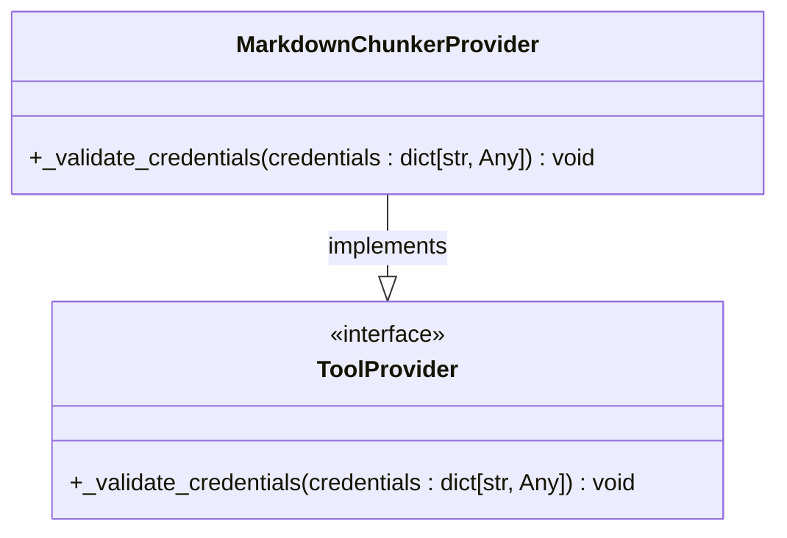
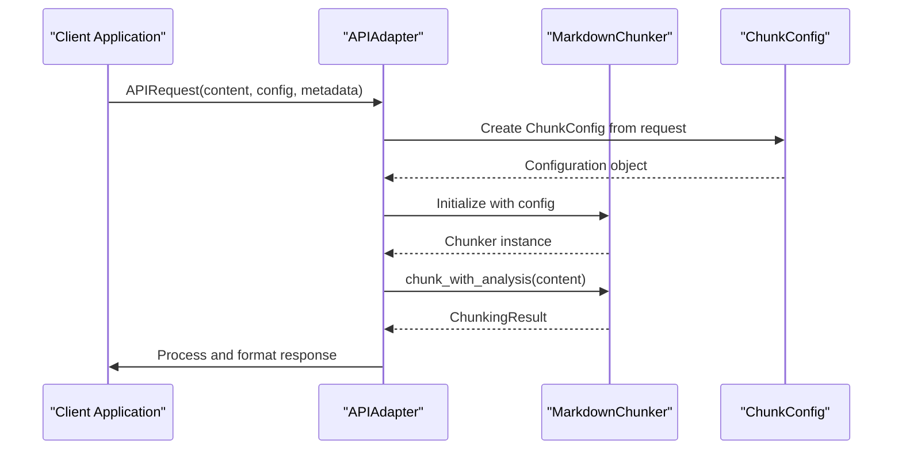
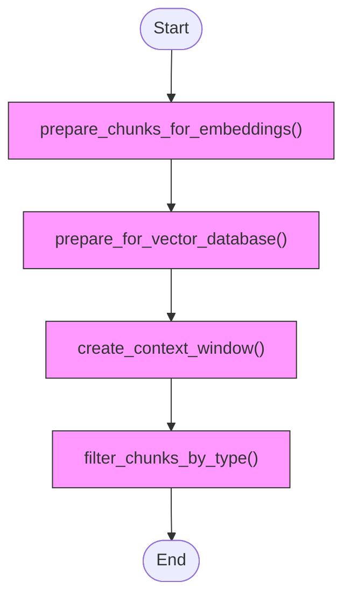

# Integration

<cite>
**Referenced Files in This Document**   
- [dify_integration.py](file://examples/dify_integration.py)
- [rag_integration.py](file://examples/rag_integration.py)
- [markdown_chunker.py](file://provider/markdown_chunker.py)
- [markdown_chunker.yaml](file://provider/markdown_chunker.yaml)
- [manifest.yaml](file://manifest.yaml)
- [markdown_chunk_tool.py](file://tools/markdown_chunk_tool.py)
- [markdown_chunk_tool.yaml](file://tools/markdown_chunk_tool.yaml)
</cite>

## Table of Contents
1. [Dify Plugin Integration](#dify-plugin-integration)
2. [Standalone Library Usage](#standalone-library-usage)
3. [API Compatibility and Versioning](#api-compatibility-and-versioning)
4. [Error Handling and Monitoring](#error-handling-and-monitoring)

## Dify Plugin Integration

The Markdown chunker integrates with Dify through a well-defined plugin architecture that implements the required interface for tool providers. The integration consists of a provider class, configuration files, and a tool implementation that work together to enable intelligent, structure-aware chunking of Markdown documents.

### Provider Class Implementation

The `MarkdownChunkerProvider` class in `provider/markdown_chunker.py` implements the `ToolProvider` interface required by Dify. This class manages the Advanced Markdown Chunker tool and handles the provider lifecycle. Since chunking is a local operation that doesn't require external services or API keys, the provider doesn't need credentials validation.

The provider implements the `_validate_credentials` method as required by the interface, but this method performs no validation since no credentials are needed. This design choice reflects the local nature of the chunking operation, making the tool immediately usable without configuration overhead.



**Diagram sources**
- [markdown_chunker.py](file://provider/markdown_chunker.py#L15-L36)

**Section sources**
- [markdown_chunker.py](file://provider/markdown_chunker.py#L1-L36)

### Plugin Configuration

The plugin is configured through two YAML files that define its metadata, capabilities, and integration points with the Dify platform.

The `provider/markdown_chunker.yaml` file defines the provider configuration:

```yaml
identity:
  author: asukhodko
  name: markdown_chunker
  label:
    en_US: Advanced Markdown Chunker
    zh_Hans: 高级 Markdown 分块器
    ru_RU: Продвинутый Markdown чанкер
  description:
    en_US: Advanced Markdown chunking with structural awareness for better RAG performance
    zh_Hans: 具有结构感知的高级 Markdown 分块，提升 RAG 性能
    ru_RU: Продвинутое чанкование Markdown с учётом структуры для улучшения RAG
  icon: icon.svg
  tags:
    - productivity
    - business

tools:
  - tools/markdown_chunk_tool.yaml

extra:
  python:
    source: provider/markdown_chunker.py
```

This configuration specifies the provider's identity, multi-language labels, description, tags, and references the tool implementation. The `extra.python.source` field points to the Python module that implements the provider class.

The `manifest.yaml` file provides package-level metadata for the plugin:

```yaml
version: 2.0.2-a0
type: plugin
author: asukhodko
name: markdown_chunker
label:
  en_US: Advanced Markdown Chunker
  zh_Hans: 高级 Markdown 分块器
  ru_RU: Продвинутый Markdown чанкер
description:
  en_US: Advanced Markdown chunking with structural awareness for better RAG performance
  zh_Hans: 具有结构感知的高级 Markdown 分块，提升 RAG 性能
  ru_RU: Продвинутое чанкование Markdown с учётом структуры для улучшения RAG
icon: icon.svg
resource:
  memory: 536870912  # 512MB in bytes
permission:
  tool:
    enabled: false
  model:
    enabled: false
plugins:
  tools:
    - provider/markdown_chunker.yaml
meta:
  version: 2.0.2-a0
  arch:
    - amd64
    - arm64
  runner:
    language: python
    version: "3.12"
    entrypoint: main
minimum_dify_version: 1.9.0
tags:
  - productivity
  - business
created_at: 2025-11-22T00:00:00Z
```

This manifest defines the plugin version, type, resource requirements, supported architectures, runtime environment, and minimum Dify version compatibility.

**Section sources**
- [markdown_chunker.yaml](file://provider/markdown_chunker.yaml#L1-L23)
- [manifest.yaml](file://manifest.yaml#L1-L48)

## Standalone Library Usage

The Markdown chunker can be used as a standalone library in custom applications and RAG pipelines. The examples in `examples/dify_integration.py` and `examples/rag_integration.py` demonstrate various integration patterns.

### Dify Integration Patterns

The `dify_integration.py` example shows how to integrate the chunker with Dify RAG systems through several usage patterns:

1. **Dify-Compatible Output**: Transform chunker output to the format expected by Dify, including metadata enrichment with source information, chunk IDs, line ranges, size, and content type.

2. **RAG-Optimized Chunking**: Configure the chunker with parameters optimized for RAG systems, such as maximum chunk size of 1536 characters (optimal for embedding models) and 200-character overlap for context preservation.

3. **Semantic Search Preparation**: Prepare chunks for semantic search by creating documents with IDs, text content, and metadata that includes chunk index, line ranges, type, and size.

4. **API Endpoint Simulation**: Simulate a Dify API endpoint using the `APIAdapter` class to process requests with content, metadata, and chunking configuration.

5. **Batch Document Processing**: Process multiple documents in batch mode, tracking results by document ID, title, chunk count, and strategy used.

6. **Embedding Preparation**: Format chunks for embedding generation with text content and metadata that includes line information and content type.

7. **Context Window Optimization**: Configure chunking for different LLM context windows (GPT-3.5, GPT-4 with 8K and 32K contexts) by adjusting maximum chunk sizes accordingly.

8. **Metadata Enrichment**: Enrich chunks with additional metadata such as document ID, section, language, version, indexed timestamp, chunking strategy, chunk index, and total chunk count.



**Diagram sources**
- [dify_integration.py](file://examples/dify_integration.py#L1-L487)

**Section sources**
- [dify_integration.py](file://examples/dify_integration.py#L1-L487)

### RAG Pipeline Integration

The `rag_integration.py` example demonstrates how to use the chunker in RAG pipelines with functions that prepare data for vector databases, create context windows, and filter chunks by type.

Key integration patterns include:

1. **Embedding Preparation**: The `prepare_chunks_for_embeddings` function configures the chunker with smaller chunk sizes (default 500 characters) and 10% overlap (50 characters) to optimize for embedding generation.

2. **Vector Database Preparation**: The `prepare_for_vector_database` function processes multiple documents and formats chunks for storage in vector databases, including document ID, chunk ID, text, and comprehensive metadata.

3. **Context Window Creation**: The `create_context_window` function creates a context window around a target chunk by including adjacent chunks, which helps maintain context in RAG applications.

4. **Chunk Filtering**: Functions like `filter_chunks_by_type`, `get_code_chunks`, and `get_table_chunks` allow filtering chunks based on content type, enabling specialized processing for different content types.



**Diagram sources**
- [rag_integration.py](file://examples/rag_integration.py#L1-L432)

**Section sources**
- [rag_integration.py](file://examples/rag_integration.py#L1-L432)

## API Compatibility and Versioning

The Markdown chunker maintains API compatibility across versions through several mechanisms:

1. **Configuration Profiles**: The chunker provides predefined configuration profiles for different use cases:
   - `for_dify_rag()`: Optimized for RAG applications with 2048 max chunk size and 200-character overlap
   - `for_search_indexing()`: Optimized for search engines with 1024 max chunk size
   - `for_chat_context()`: Optimized for chat/LLM context with 1536 max chunk size

2. **Backward Compatibility**: The API adapter maintains backward compatibility by supporting both legacy and current configuration formats, allowing gradual migration between versions.

3. **Caching Strategy**: The `APIAdapter` implements a caching strategy that reuses chunker instances between requests when configurations are identical, improving performance while maintaining consistency.

4. **Configuration Validation**: The adapter validates configurations and handles errors gracefully, providing meaningful error messages when invalid configurations are provided.

5. **Version Requirements**: The manifest specifies a minimum Dify version (1.9.0), ensuring compatibility with the required platform features.

**Section sources**
- [dify_integration.py](file://examples/dify_integration.py#L1-L487)
- [rag_integration.py](file://examples/rag_integration.py#L1-L432)
- [manifest.yaml](file://manifest.yaml#L1-L48)

## Error Handling and Monitoring

The integration includes comprehensive error handling and monitoring capabilities for production deployments.

### Error Handling

The system implements multiple layers of error handling:

1. **Input Validation**: The tool validates that `input_text` is provided and not empty, returning appropriate error messages when validation fails.

2. **Exception Handling**: The `_invoke` method uses try-except blocks to catch and handle different types of exceptions:
   - `ValueError` for validation errors
   - General `Exception` for unexpected errors during chunking

3. **Error Reporting**: Errors are reported through Dify's messaging system using `create_text_message`, ensuring users receive clear error information.

4. **Graceful Degradation**: When errors occur, the system fails gracefully without crashing, allowing the application to continue processing other requests.

### Monitoring

The integration provides several monitoring capabilities:

1. **Processing Metrics**: The chunking result includes statistics such as total chunks, total size, average chunk size, and processing time.

2. **Strategy Tracking**: The system tracks which chunking strategy was used, enabling analysis of strategy effectiveness.

3. **Complexity Analysis**: The chunker calculates a complexity score for each document, helping identify challenging content.

4. **Metadata Enrichment**: Comprehensive metadata is included with each chunk, facilitating debugging and analysis.

5. **Caching Metrics**: The adapter tracks whether chunker instances are being reused from cache, providing insight into performance optimization.

The `example_4_error_handling` function in `api_usage.py` demonstrates testing various error conditions, including empty content, invalid strategies, and invalid configurations, ensuring robust error handling in production environments.

**Section sources**
- [markdown_chunk_tool.py](file://tools/markdown_chunk_tool.py#L1-L157)
- [dify_integration.py](file://examples/dify_integration.py#L1-L487)
- [api_usage.py](file://examples/api_usage.py#L134-L166)