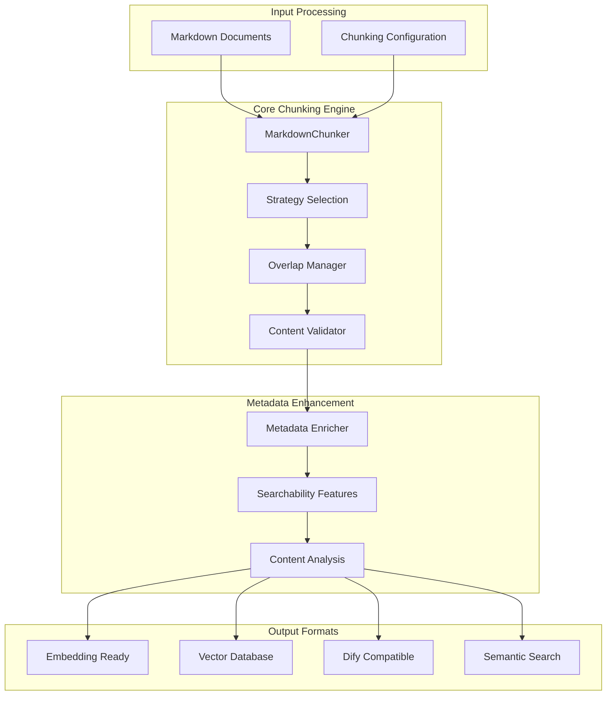
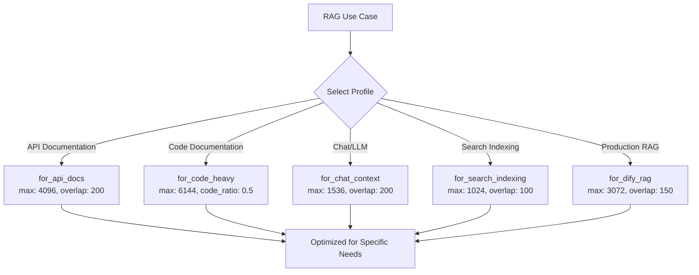
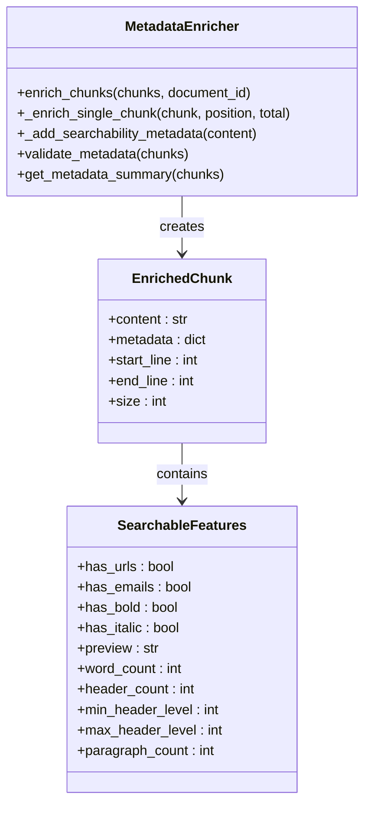
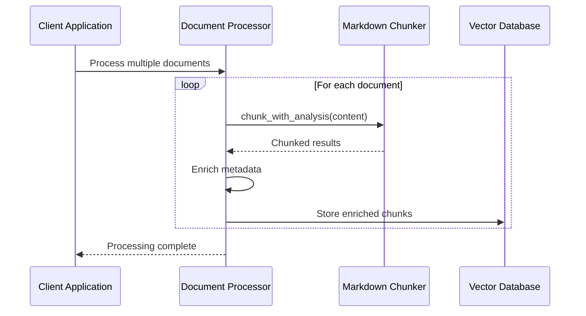
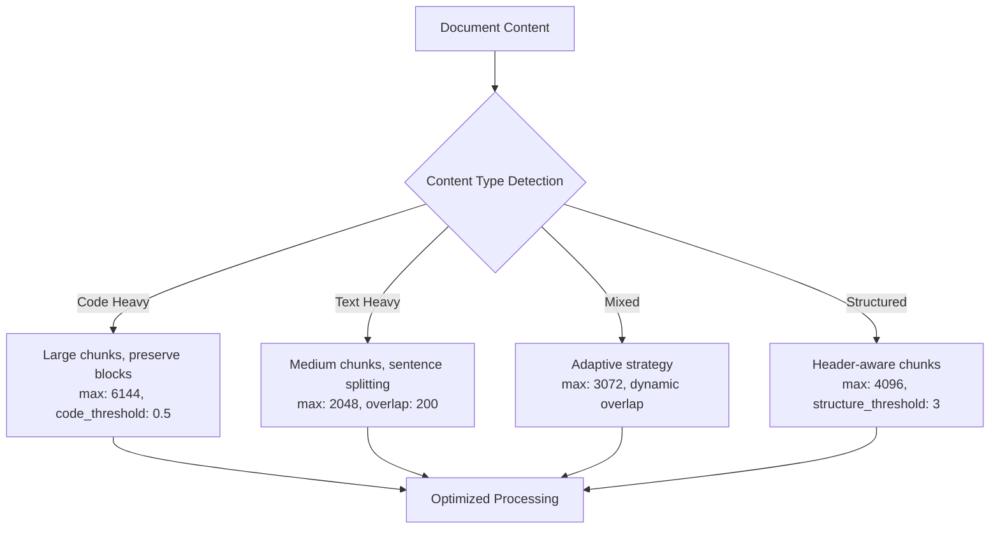
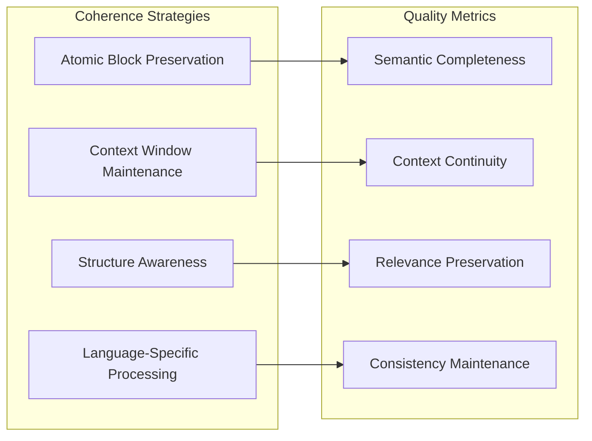

# RAG System Integration

<cite>
**Referenced Files in This Document**
- [examples/dify_integration.py](file://examples/dify_integration.py)
- [examples/rag_integration.py](file://examples/rag_integration.py)
- [benchmarks/benchmark_chunker.py](file://benchmarks/benchmark_chunker.py)
- [docs/guides/performance.md](file://docs/guides/performance.md)
- [markdown_chunker_v2/config.py](file://markdown_chunker_v2/config.py)
- [markdown_chunker/chunker/types.py](file://markdown_chunker/chunker/types.py)
- [tests/chunker/test_config_profiles.py](file://tests/chunker/test_config_profiles.py)
- [tests/chunker/test_components/test_metadata_enricher.py](file://tests/chunker/test_components/test_metadata_enricher.py)
- [markdown_chunker_legacy/chunker/components/metadata_enricher.py](file://markdown_chunker_legacy/chunker/components/metadata_enricher.py)
</cite>

## Table of Contents
1. [Introduction](#introduction)
2. [System Architecture Overview](#system-architecture-overview)
3. [Chunking Configuration for RAG Systems](#chunking-configuration-for-rag-systems)
4. [Metadata Enrichment for Retrieval](#metadata-enrichment-for-retrieval)
5. [Vector Database Preparation](#vector-database-preparation)
6. [Advanced RAG Patterns](#advanced-rag-patterns)
7. [Performance Optimization](#performance-optimization)
8. [Best Practices](#best-practices)
9. [Integration Examples](#integration-examples)
10. [Troubleshooting Guide](#troubleshooting-guide)

## Introduction

The Python Markdown Chunker provides comprehensive support for Retrieval-Augmented Generation (RAG) systems through optimized chunking strategies, metadata enrichment, and vector database preparation. This documentation covers the essential patterns and configurations needed to integrate the chunker effectively into RAG workflows.

RAG systems rely heavily on intelligent document chunking to balance semantic coherence with retrieval accuracy. The chunker offers multiple configuration profiles and advanced features specifically designed for RAG applications, including context window optimization, metadata enrichment, and vector database compatibility.

## System Architecture Overview

The RAG integration system consists of several interconnected components that work together to prepare documents for retrieval and generation workflows:



**Diagram sources**
- [examples/dify_integration.py](file://examples/dify_integration.py#L1-L487)
- [examples/rag_integration.py](file://examples/rag_integration.py#L1-L432)

## Chunking Configuration for RAG Systems

### Core Configuration Parameters

The chunker provides several configuration profiles optimized for different RAG scenarios. The most commonly used parameters for RAG systems include:

| Parameter | Purpose | Recommended Values | Impact |
|-----------|---------|-------------------|---------|
| `max_chunk_size` | Maximum chunk size in characters | 1536, 2048, 3072 | Directly affects embedding costs and context limits |
| `min_chunk_size` | Minimum chunk size for normalization | 200-512 | Prevents overly small chunks |
| `overlap_size` | Character overlap between chunks | 200-300 | Preserves context across chunk boundaries |
| `enable_overlap` | Whether to enable chunk overlap | True | Essential for maintaining semantic continuity |

### RAG-Optimized Configuration Examples

#### Standard RAG Configuration (1536 tokens)
Based on the examples in `dify_integration.py`, this configuration is optimized for embedding models with 1536 token contexts:

```python
# Configuration optimized for embedding models
config = ChunkConfig(
    max_chunk_size=1536,    # Optimal for embedding models
    min_chunk_size=200,     # Minimum meaningful content
    overlap_size=200,       # Preserve context across chunks
    enable_overlap=True     # Essential for RAG
)
```

#### Chat Context Optimization
For LLM context windows, the chunker provides specialized configurations:

```python
# Chat context optimized (GPT-3.5, GPT-4)
configs = {
    "GPT-3.5 (4K)": ChunkConfig(max_chunk_size=1536),
    "GPT-4 (8K)": ChunkConfig(max_chunk_size=3072),
    "GPT-4 (32K)": ChunkConfig(max_chunk_size=6144),
}
```

### Configuration Profiles for Different Use Cases

The chunker includes several predefined profiles for common RAG scenarios:



**Diagram sources**
- [tests/chunker/test_config_profiles.py](file://tests/chunker/test_config_profiles.py#L20-L31)
- [markdown_chunker_v2/config.py](file://markdown_chunker_v2/config.py#L142-L169)

**Section sources**
- [examples/dify_integration.py](file://examples/dify_integration.py#L76-L82)
- [examples/dify_integration.py](file://examples/dify_integration.py#L374-L396)
- [markdown_chunker_v2/config.py](file://markdown_chunker_v2/config.py#L12-L69)

## Metadata Enrichment for Retrieval

### Comprehensive Metadata Structure

The chunker automatically enriches chunks with comprehensive metadata that enhances retrieval capabilities. This metadata includes both structural information and searchability features.

#### Basic Metadata Fields

Each chunk receives enriched metadata containing:

- **Position Information**: `chunk_index`, `total_chunks`, `is_first_chunk`, `is_last_chunk`
- **Content Analysis**: `content_type`, `word_count`, `line_count`, `char_count`
- **Strategy Details**: `strategy_used`, `complexity_score`
- **Content Features**: `has_code`, `has_table`, `has_list`, `header_count`

#### Advanced Searchability Metadata

The metadata enricher adds sophisticated searchability features:



**Diagram sources**
- [markdown_chunker_legacy/chunker/components/metadata_enricher.py](file://markdown_chunker_legacy/chunker/components/metadata_enricher.py#L13-L96)

### Dify-Specific Metadata Enrichment

For Dify integration, the chunker provides enhanced metadata structure:

```python
# Example of enriched chunk metadata for Dify
enriched_chunk = {
    "content": chunk.content,
    "metadata": {
        # Original metadata
        **chunk.metadata,
        # Additional Dify metadata
        "chunk_id": f"chunk_{i}",
        "document_id": "api_docs_v1",
        "section": "authentication" if i == 0 else "rate_limits",
        "language": "en",
        "version": "1.0",
        "indexed_at": "2025-11-09T00:00:00Z",
        # Chunking metadata
        "chunking_strategy": result.strategy_used,
        "chunk_index": i,
        "total_chunks": len(result.chunks)
    }
}
```

### Content Type Classification

The chunker automatically classifies content types for specialized processing:

- **Code Blocks**: Identified by language detection and preserved as atomic units
- **Tables**: Structured with column and row counts for tabular data processing
- **Lists**: Hierarchical structure with list type detection
- **Structured Content**: Headers and organizational elements
- **Plain Text**: Unstructured content with sentence-level processing

**Section sources**
- [examples/dify_integration.py](file://examples/dify_integration.py#L397-L449)
- [markdown_chunker_legacy/chunker/components/metadata_enricher.py](file://markdown_chunker_legacy/chunker/components/metadata_enricher.py#L13-L96)
- [tests/chunker/test_components/test_metadata_enricher.py](file://tests/chunker/test_components/test_metadata_enricher.py#L49-L362)

## Vector Database Preparation

### Standard Vector Database Format

The `prepare_for_vector_database` function transforms chunks into a format suitable for vector database storage:

```python
def prepare_for_vector_database(documents: List[Dict[str, str]]) -> List[Dict[str, Any]]:
    """
    Prepare multiple documents for vector database storage.
    
    Args:
        documents: List of documents with 'id' and 'content' keys
        
    Returns:
        List of chunks ready for vector database
    """
    chunker = MarkdownChunker(ChunkConfig(
        max_chunk_size=500,
        enable_overlap=True,
        overlap_size=50
    ))
    
    all_chunks = []
    
    for doc in documents:
        doc_id = doc['id']
        content = doc['content']
        
        result = chunker.chunk_with_analysis(content)
        
        for chunk in result.chunks:
            all_chunks.append({
                'id': f"{doc_id}_chunk_{chunk.index}",
                'doc_id': doc_id,
                'chunk_id': chunk.index,
                'text': chunk.content,
                'metadata': {
                    'doc_id': doc_id,
                    'chunk_index': chunk.index,
                    'total_chunks': len(result.chunks),
                    'lines': f"{chunk.start_line}-{chunk.end_line}",
                    'size': chunk.size,
                    'strategy': result.strategy_used,
                    'content_type': result.content_type,
                    **chunk.metadata
                }
            })
    
    return all_chunks
```

### Embedding Preparation Format

For embedding generation, the function creates a specialized format:

```python
def prepare_chunks_for_embeddings(markdown: str, max_chunk_size: int=500) -> List[Dict[str, Any]]:
    """
    Prepare markdown chunks for embedding generation.
    
    Args:
        markdown: Markdown content to process
        max_chunk_size: Maximum chunk size (smaller for embeddings)
        
    Returns:
        List of dictionaries ready for embedding
    """
    config = ChunkConfig(
        max_chunk_size=max_chunk_size,
        min_chunk_size=100,
        enable_overlap=True,
        overlap_size=50  # 10% overlap for context
    )
    
    chunker = MarkdownChunker(config)
    result = chunker.chunk_with_analysis(markdown)
    
    embeddings_data = []
    for chunk in result.chunks:
        embeddings_data.append({
            'id': f"chunk_{chunk.index}",
            'text': chunk.content,
            'metadata': {
                'chunk_index': chunk.index,
                'lines': f"{chunk.start_line}-{chunk.end_line}",
                'size': chunk.size,
                'content_type': chunk.metadata.get('content_type', 'text'),
                'strategy': result.strategy_used,
                'has_code': 'language' in chunk.metadata,
                'has_table': 'column_count' in chunk.metadata,
                'has_list': 'list_type' in chunk.metadata,
                'complexity': result.complexity_score,
            }
        })
    
    return embeddings_data
```

### Vector Database Schema Design

The prepared chunks follow a standardized schema for vector database compatibility:

| Field | Type | Purpose | Example |
|-------|------|---------|---------|
| `id` | String | Unique chunk identifier | `"doc1_chunk_0"` |
| `doc_id` | String | Original document identifier | `"api_reference"` |
| `chunk_id` | Integer | Chunk sequence number | `0, 1, 2, ...` |
| `text` | String | Chunk content for embedding | `"Authentication is required..."` |
| `metadata` | Object | Enriched metadata | `{...}` |

**Section sources**
- [examples/rag_integration.py](file://examples/rag_integration.py#L56-L98)
- [examples/rag_integration.py](file://examples/rag_integration.py#L13-L53)

## Advanced RAG Patterns

### Context Window Creation

Creating effective context windows around target chunks is crucial for RAG performance:

```python
def create_context_window(chunks: List[Dict[str, Any]], target_chunk_id: str,
                         window_size: int=2) -> str:
    """
    Create context window around a target chunk for RAG.
    
    Args:
        chunks: List of all chunks
        target_chunk_id: ID of the target chunk
        window_size: Number of chunks before/after to include
        
    Returns:
        Combined context string
    """
    # Find target chunk index
    target_idx = None
    for i, chunk in enumerate(chunks):
        if chunk['id'] == target_chunk_id:
            target_idx = i
            break
    
    if target_idx is None:
        return ""
    
    # Get window
    start_idx = max(0, target_idx - window_size)
    end_idx = min(len(chunks), target_idx + window_size + 1)
    
    window_chunks = chunks[start_idx:end_idx]
    
    # Combine with markers
    context_parts = []
    for chunk in window_chunks:
        marker = ">>> TARGET <<<" if chunk['id'] == target_chunk_id else ""
        context_parts.append(f"{marker}\n{chunk['text']}\n")
    
    return "\n".join(context_parts)
```

### Content Type Filtering

Specialized processing for different content types enables targeted retrieval:

```python
def filter_chunks_by_type(chunks: List[Dict[str, Any]], content_type: str) -> List[Dict[str, Any]]:
    """Filter chunks by content type."""
    return [
        chunk for chunk in chunks
        if chunk['metadata'].get('content_type') == content_type
    ]

def get_code_chunks(chunks: List[Dict[str, Any]]) -> List[Dict[str, Any]]:
    """Get only chunks containing code."""
    return [
        chunk for chunk in chunks
        if chunk['metadata'].get('has_code', False)
    ]

def get_table_chunks(chunks: List[Dict[str, Any]]) -> List[Dict[str, Any]]:
    """Get only chunks containing tables."""
    return [
        chunk for chunk in chunks
        if chunk['metadata'].get('has_table', False)
    ]
```

### Multi-Document Processing

Efficient batch processing for large document collections:



**Diagram sources**
- [examples/rag_integration.py](file://examples/rag_integration.py#L216-L267)

**Section sources**
- [examples/rag_integration.py](file://examples/rag_integration.py#L101-L137)
- [examples/rag_integration.py](file://examples/rag_integration.py#L139-L172)

## Performance Optimization

### Benchmark Results and Performance Characteristics

The chunker includes comprehensive benchmarking to help optimize performance for different use cases:

| Document Size | Processing Time | Throughput | Chunks Generated |
|---------------|----------------|------------|------------------|
| 1 KB | ~800 ms | 1.3 KB/s | 6 |
| 10 KB | ~150 ms | 66 KB/s | 44 |
| 50 KB | ~1.9 s | 27 KB/s | 215 |
| 100 KB | ~7 s | 14 KB/s | 429 |

### Performance Optimization Strategies

#### 1. Configuration Tuning

Different configurations impact performance differently:

```python
# Fast processing (larger chunks, no overlap)
fast_config = ChunkConfig(
    max_chunk_size=8192,
    min_chunk_size=1024,
    overlap_size=100,
    enable_overlap=False
)

# Balanced configuration
balanced_config = ChunkConfig(
    max_chunk_size=2048,
    min_chunk_size=256,
    overlap_size=200,
    enable_overlap=True
)

# Memory-efficient configuration
memory_config = ChunkConfig(
    max_chunk_size=1024,
    min_chunk_size=128,
    overlap_size=50,
    enable_overlap=True
)
```

#### 2. Content-Type Optimization

Different content types require different optimization strategies:



**Diagram sources**
- [benchmarks/benchmark_chunker.py](file://benchmarks/benchmark_chunker.py#L92-L146)

#### 3. Memory Management

The chunker provides several memory optimization features:

- **Streaming Processing**: Process large documents without loading entirely into memory
- **Lazy Evaluation**: Metadata enrichment occurs only when needed
- **Configurable Buffer Sizes**: Control memory usage for different document sizes

### Performance Trade-offs

Understanding the trade-offs between different configuration parameters:

| Parameter | Performance Impact | Retrieval Quality | Use Case |
|-----------|-------------------|-------------------|----------|
| `max_chunk_size` | Linear memory usage | Higher for context | Large documents |
| `overlap_size` | Quadratic processing time | Better semantic continuity | High-quality retrieval |
| `enable_overlap` | Significant overhead | Much better context | Production RAG |
| `min_chunk_size` | Prevents fragmentation | Better quality control | Consistent results |

**Section sources**
- [benchmarks/benchmark_chunker.py](file://benchmarks/benchmark_chunker.py#L27-L146)
- [docs/guides/performance.md](file://docs/guides/performance.md#L1-L21)

## Best Practices

### Configuration Guidelines

1. **Start with Profiles**: Use predefined profiles as starting points
2. **Environment-Specific**: Create different configurations for development, staging, and production
3. **Performance vs Quality**: Balance features with performance requirements
4. **Validation**: Always validate configurations before deployment
5. **Documentation**: Document custom configuration choices

### Semantic Coherence Strategies

Maintaining semantic coherence while maximizing retrieval accuracy:



### Integration Patterns

#### Production Deployment Patterns

1. **Caching Strategy**: Implement multi-level caching for processed chunks
2. **Batch Processing**: Process documents in batches for efficiency
3. **Async Operations**: Use asynchronous processing for high-throughput scenarios
4. **Monitoring**: Track chunking performance and quality metrics

#### Error Handling and Resilience

```python
def robust_chunking_pipeline(document, fallback_config):
    """Robust chunking pipeline with fallback strategies."""
    try:
        # Primary processing
        primary_config = ChunkConfig.for_dify_rag()
        return chunk_with_fallback(document, primary_config)
    except ProcessingError as e:
        # Fallback to simpler configuration
        return chunk_with_fallback(document, fallback_config)
    except Exception as e:
        # Last resort: basic chunking
        return basic_chunking(document)
```

### Monitoring and Quality Assurance

Key metrics to monitor for RAG system effectiveness:

- **Chunk Quality**: Semantic completeness and context preservation
- **Processing Speed**: Time per document and throughput rates
- **Memory Usage**: Peak memory consumption during processing
- **Error Rates**: Failure rates and error types
- **Retrieval Performance**: Success rate and relevance of retrieved chunks

## Integration Examples

### Dify Integration Example

The Dify integration demonstrates production-ready RAG system patterns:

```python
# Dify-compatible chunk format
def prepare_dify_chunks(chunks):
    dify_chunks = []
    for chunk in chunks:
        dify_chunk = {
            "content": chunk['content'],
            "metadata": {
                "source": "documentation",
                "chunk_id": f"chunk_{chunk['start_line']}_{chunk['end_line']}",
                "lines": f"{chunk['start_line']}-{chunk['end_line']}",
                "size": chunk['size'],
                "type": chunk['content_type']
            }
        }
        dify_chunks.append(dify_chunk)
    return dify_chunks
```

### API Endpoint Simulation

Complete API endpoint simulation for RAG system integration:

```python
def simulate_dify_api_endpoint(request_data):
    """Simulate Dify API endpoint for chunking requests."""
    adapter = APIAdapter()
    
    # Process request
    request = APIRequest(
        content=request_data['document']['content'],
        config=request_data['chunking_config'],
        metadata=request_data['document']['metadata']
    )
    
    response = adapter.process_request(request)
    
    if response.success:
        # Format response for Dify
        dify_response = {
            "status": "success",
            "chunks": response.chunks,
            "metadata": {
                "strategy": response.metadata['strategy_used'],
                "total_chunks": response.metadata['statistics']['total_chunks'],
                "processing_time": response.metadata['processing_time'],
                "source_metadata": request_data['document']['metadata']
            }
        }
        return dify_response
```

### Batch Processing Pipeline

Efficient batch processing for large document collections:

```python
def batch_process_documents(documents, chunking_config):
    """Process multiple documents efficiently."""
    adapter = APIAdapter()
    results = []
    
    for doc in documents:
        request = APIRequest(
            content=doc['content'],
            metadata={"doc_id": doc['id'], "title": doc['title']}
        )
        
        response = adapter.process_request(request)
        
        if response.success:
            results.append({
                "doc_id": doc['id'],
                "title": doc['title'],
                "chunks": len(response.chunks),
                "strategy": response.metadata['strategy_used']
            })
    
    return results
```

**Section sources**
- [examples/dify_integration.py](file://examples/dify_integration.py#L192-L262)
- [examples/dify_integration.py](file://examples/dify_integration.py#L264-L312)

## Troubleshooting Guide

### Common Issues and Solutions

#### 1. Poor Retrieval Quality

**Symptoms**: Irrelevant or fragmented search results
**Causes**: 
- Incorrect chunk size configuration
- Insufficient overlap between chunks
- Poor metadata enrichment

**Solutions**:
- Increase `max_chunk_size` for more context
- Enable `enable_overlap` with appropriate `overlap_size`
- Use content-type-specific configurations

#### 2. Performance Degradation

**Symptoms**: Slow processing times, high memory usage
**Causes**:
- Very large `max_chunk_size` values
- Excessive overlap settings
- Complex content types without optimization

**Solutions**:
- Reduce `max_chunk_size` for better performance
- Decrease `overlap_size` for faster processing
- Use content-type-specific profiles

#### 3. Memory Issues

**Symptoms**: Out of memory errors, excessive memory usage
**Causes**:
- Processing very large documents
- Streaming configuration not enabled
- Insufficient memory allocation

**Solutions**:
- Implement streaming processing
- Use smaller chunk sizes
- Increase available memory

#### 4. Metadata Loss

**Symptoms**: Missing or incorrect metadata in chunks
**Causes**:
- Disabled metadata enrichment
- Corrupted chunk data
- Improper configuration

**Solutions**:
- Ensure `enable_metadata_enrichment` is True
- Validate chunk data integrity
- Review configuration parameters

### Debugging Tools and Techniques

#### Configuration Validation

```python
def validate_chunk_config(config):
    """Validate chunk configuration for common issues."""
    issues = []
    
    if config.max_chunk_size <= config.min_chunk_size:
        issues.append("max_chunk_size must be greater than min_chunk_size")
    
    if config.overlap_size >= config.max_chunk_size:
        issues.append("overlap_size must be less than max_chunk_size")
    
    if config.overlap_size < 0:
        issues.append("overlap_size must be non-negative")
    
    return issues
```

#### Performance Monitoring

```python
def monitor_chunking_performance(document, config):
    """Monitor chunking performance metrics."""
    import time
    import psutil
    
    start_time = time.time()
    start_memory = psutil.Process().memory_info().rss / 1024 / 1024
    
    try:
        result = chunker.chunk_with_analysis(document, config)
        
        end_time = time.time()
        end_memory = psutil.Process().memory_info().rss / 1024 / 1024
        
        metrics = {
            'processing_time': end_time - start_time,
            'memory_usage': end_memory - start_memory,
            'chunks_generated': len(result.chunks),
            'average_chunk_size': sum(len(c.content) for c in result.chunks) / len(result.chunks),
            'strategy_used': result.strategy_used
        }
        
        return metrics
    
    except Exception as e:
        return {'error': str(e)}
```

### Performance Tuning Checklist

- [ ] Use appropriate configuration profile for your use case
- [ ] Enable overlap for semantic continuity
- [ ] Monitor memory usage during processing
- [ ] Validate chunk quality with sample documents
- [ ] Implement caching for frequently processed documents
- [ ] Use batch processing for large document collections
- [ ] Monitor retrieval performance metrics
- [ ] Regular configuration validation and testing

**Section sources**
- [tests/chunker/test_components/test_metadata_enricher.py](file://tests/chunker/test_components/test_metadata_enricher.py#L223-L234)