# Content Filtering Strategies

<cite>
**Referenced Files in This Document**
- [examples/rag_integration.py](file://examples/rag_integration.py)
- [markdown_chunker/chunker/types.py](file://markdown_chunker/chunker/types.py)
- [markdown_chunker/chunker/strategies/base.py](file://markdown_chunker/chunker/strategies/base.py)
- [markdown_chunker/chunker/strategies/code_strategy.py](file://markdown_chunker/chunker/strategies/code_strategy.py)
- [markdown_chunker/chunker/strategies/table_strategy.py](file://markdown_chunker/chunker/strategies/table_strategy.py)
- [markdown_chunker/chunker/strategies/list_strategy.py](file://markdown_chunker/chunker/strategies/list_strategy.py)
- [markdown_chunker/chunker/components/metadata_enricher.py](file://markdown_chunker/chunker/components/metadata_enricher.py)
- [tests/test_metadata_filtering.py](file://tests/test_metadata_filtering.py)
- [tests/chunker/test_metadata_properties.py](file://tests/chunker/test_metadata_properties.py)
- [tests/chunker/test_components/test_metadata_enricher.py](file://tests/chunker/test_components/test_metadata_enricher.py)
</cite>

## Table of Contents
1. [Introduction](#introduction)
2. [Core Filtering Functions](#core-filtering-functions)
3. [Metadata Flag System](#metadata-flag-system)
4. [Content Type Classification](#content-type-classification)
5. [Advanced Filtering Scenarios](#advanced-filtering-scenarios)
6. [Search Tag Creation](#search-tag-creation)
7. [Performance Considerations](#performance-considerations)
8. [Combining Multiple Filters](#combining-multiple-filters)
9. [Best Practices](#best-practices)
10. [Troubleshooting](#troubleshooting)

## Introduction

The markdown chunker provides a sophisticated content filtering system designed specifically for RAG (Retrieval-Augmented Generation) applications. This system enables precise targeting of different content types through metadata flags, content type classification, and advanced filtering capabilities. The filtering infrastructure supports specialized processing pipelines for code blocks, tables, lists, and mixed content, enabling optimal retrieval and processing strategies for each content type.

The filtering system operates on a comprehensive metadata enrichment model that automatically detects and categorizes content characteristics during the chunking process. This allows for intelligent routing of content to appropriate processing pipelines and enables targeted retrieval based on content attributes.

## Core Filtering Functions

The filtering system provides three primary functions for content type isolation and retrieval:

### Basic Type Filtering

The [`filter_chunks_by_type()`](file://examples/rag_integration.py#L139-L154) function provides universal content type filtering across all chunk categories:

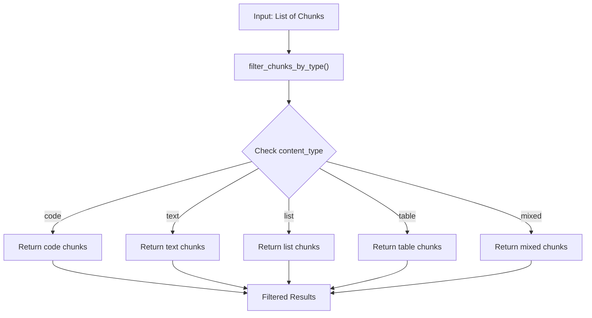

**Diagram sources**
- [examples/rag_integration.py](file://examples/rag_integration.py#L139-L154)

### Specialized Content Retrieval

The [`get_code_chunks()`](file://examples/rag_integration.py#L157-L162) and [`get_table_chunks()`](file://examples/rag_integration.py#L165-L169) functions provide optimized retrieval for specific content types:

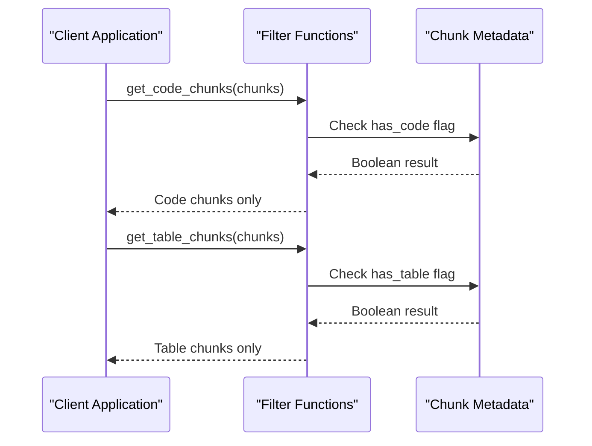

**Diagram sources**
- [examples/rag_integration.py](file://examples/rag_integration.py#L157-L169)

**Section sources**
- [examples/rag_integration.py](file://examples/rag_integration.py#L139-L170)

## Metadata Flag System

The filtering system relies on a comprehensive metadata flag system that automatically populates content characteristics during the chunking process. These flags enable efficient filtering and routing decisions.

### Core Metadata Flags

| Flag | Purpose | Usage Pattern |
|------|---------|---------------|
| `has_code` | Indicates presence of code blocks | `chunk['metadata'].get('has_code', False)` |
| `has_table` | Indicates presence of tables | `chunk['metadata'].get('has_table', False)` |
| `has_list` | Indicates presence of lists | `chunk['metadata'].get('has_list', False)` |
| `content_type` | Primary content classification | `chunk['metadata'].get('content_type')` |
| `language` | Programming language identification | `chunk['metadata'].get('language')` |

### Strategy-Specific Flags

Each chunking strategy contributes additional metadata flags:

#### Code Strategy Flags
- `language`: Detected programming language
- `function_names`: Extracted function identifiers
- `class_names`: Extracted class identifiers
- `is_fenced`: Whether code is in fenced blocks

#### Table Strategy Flags
- `column_count`: Number of table columns
- `row_count`: Number of table rows
- `has_header`: Presence of table header
- `has_column_alignment`: Column alignment indicators

#### List Strategy Flags
- `list_type`: Ordered, unordered, or task list
- `item_count`: Total number of list items
- `max_nesting`: Maximum nesting level
- `has_nested_items`: Presence of nested lists

**Section sources**
- [markdown_chunker/chunker/strategies/base.py](file://markdown_chunker/chunker/strategies/base.py#L145-L178)
- [markdown_chunker/chunker/strategies/code_strategy.py](file://markdown_chunker/chunker/strategies/code_strategy.py#L400-L440)
- [markdown_chunker/chunker/strategies/table_strategy.py](file://markdown_chunker/chunker/strategies/table_strategy.py#L355-L370)
- [markdown_chunker/chunker/strategies/list_strategy.py](file://markdown_chunker/chunker/strategies/list_strategy.py#L605-L640)

## Content Type Classification

The system employs a hierarchical content type classification system that enables precise filtering and processing routing.

### Content Type Hierarchy

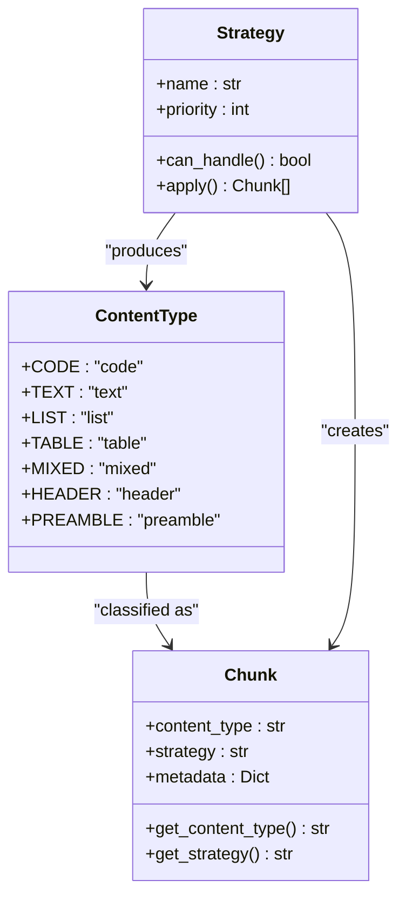

**Diagram sources**
- [markdown_chunker/chunker/types.py](file://markdown_chunker/chunker/types.py#L13-L23)
- [markdown_chunker/chunker/strategies/base.py](file://markdown_chunker/chunker/strategies/base.py#L16-L45)

### Strategy-Based Classification

Each strategy produces chunks with specific content type classifications:

#### Code Strategy (`content_type: "code"`)
- High code ratio (≥70%)
- Minimum code blocks (≥3)
- Language detection and extraction
- Function/class identification

#### Table Strategy (`content_type: "table"`)
- High table density (≥40%)
- Multiple tables (≥3)
- Column and row counting
- Alignment detection

#### List Strategy (`content_type: "list"`)
- High list ratio (≥60%)
- Nested list support
- Task list detection
- Ordered vs unordered differentiation

**Section sources**
- [markdown_chunker/chunker/strategies/code_strategy.py](file://markdown_chunker/chunker/strategies/code_strategy.py#L109-L135)
- [markdown_chunker/chunker/strategies/table_strategy.py](file://markdown_chunker/chunker/strategies/table_strategy.py#L85-L96)
- [markdown_chunker/chunker/strategies/list_strategy.py](file://markdown_chunker/chunker/strategies/list_strategy.py#L89-L100)

## Advanced Filtering Scenarios

The filtering system supports sophisticated scenarios for specialized content processing and retrieval.

### High Complexity Content Filtering

Filtering chunks based on complexity scores enables targeted processing for complex documents:

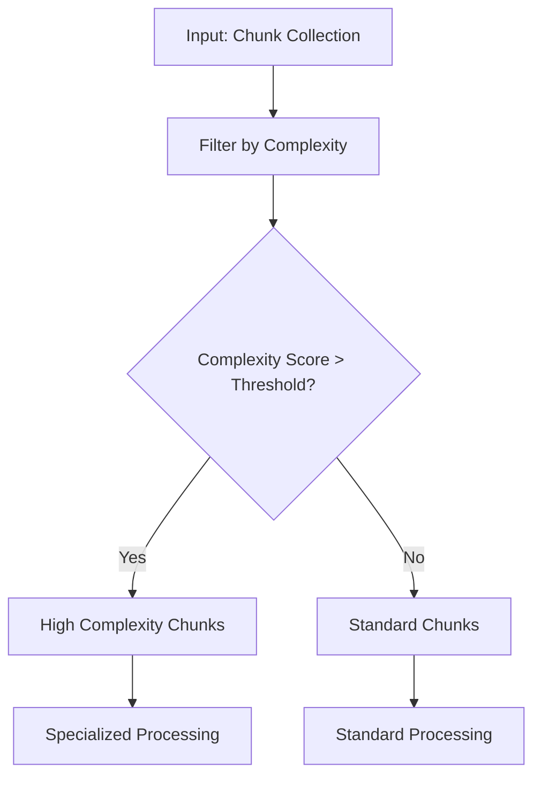

### Programming Language Filtering

Advanced language-specific filtering enables targeted code processing:

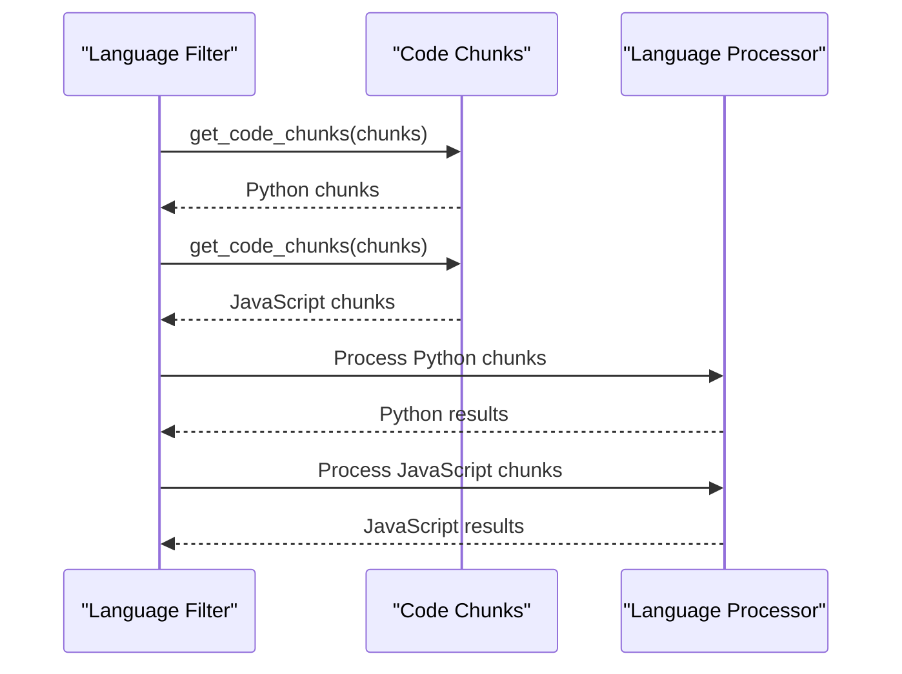

### Table Type Isolation

Specific table type filtering enables specialized processing:

| Table Attribute | Filter Criteria | Use Case |
|----------------|-----------------|----------|
| `column_count` | > 5 columns | Wide table processing |
| `row_count` | > 100 rows | Large dataset handling |
| `has_header` | True | Structured data processing |
| `has_column_alignment` | True | Formatted table processing |

### Content Characteristic Filtering

Boolean characteristic flags enable fine-grained filtering:

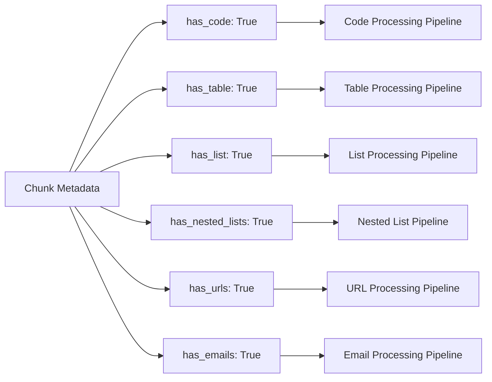

**Section sources**
- [markdown_chunker/chunker/strategies/code_strategy.py](file://markdown_chunker/chunker/strategies/code_strategy.py#L77-L97)
- [markdown_chunker/chunker/strategies/table_strategy.py](file://markdown_chunker/chunker/strategies/table_strategy.py#L228-L290)
- [markdown_chunker/chunker/strategies/list_strategy.py](file://markdown_chunker/chunker/strategies/list_strategy.py#L301-L370)

## Search Tag Creation

The filtering system enables creation of semantic search tags based on content characteristics, enhancing retrieval precision in RAG applications.

### Automatic Tag Generation

The system automatically generates search tags from content metadata:

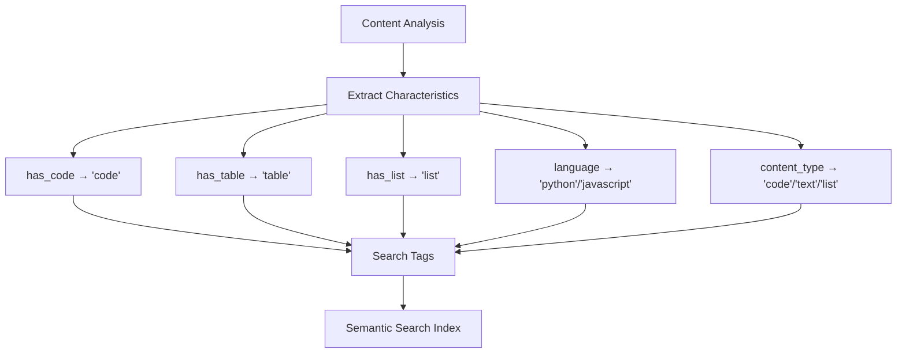

### Tag-Based Retrieval Patterns

Search tags enable sophisticated retrieval patterns:

| Tag Pattern | Retrieval Strategy | Use Case |
|-------------|-------------------|----------|
| `code` | Code-focused retrieval | API documentation |
| `table` | Table-focused retrieval | Data specifications |
| `list` | List-focused retrieval | Instructions, features |
| `python` | Language-specific retrieval | Python tutorials |
| `javascript` | Language-specific retrieval | JavaScript guides |

### Dynamic Tag Composition

Tags can be dynamically composed based on multiple content characteristics:

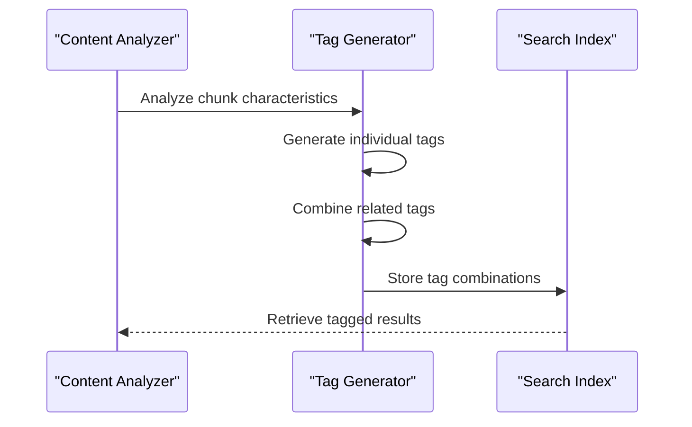

**Section sources**
- [examples/rag_integration.py](file://examples/rag_integration.py#L396-L408)

## Performance Considerations

Efficient filtering of large chunk collections requires careful consideration of performance characteristics and optimization strategies.

### Memory Efficiency

Large-scale filtering operations require memory-efficient processing:

#### Streaming Processing
- Process chunks in batches
- Use generator patterns for large datasets
- Implement lazy evaluation where possible

#### Memory Optimization Techniques
- Filter in-place when possible
- Release unused chunk references
- Use weak references for large metadata objects

### Computational Efficiency

Filtering performance scales with collection size and complexity:

#### Index-Based Filtering
- Pre-compute frequently accessed metadata
- Use hash-based lookups for boolean flags
- Implement binary search for sorted chunk collections

#### Parallel Processing
- Leverage multi-core processors for bulk filtering
- Use concurrent processing for independent filter operations
- Implement pipeline processing for large datasets

### Scalability Patterns

For production-scale deployments:

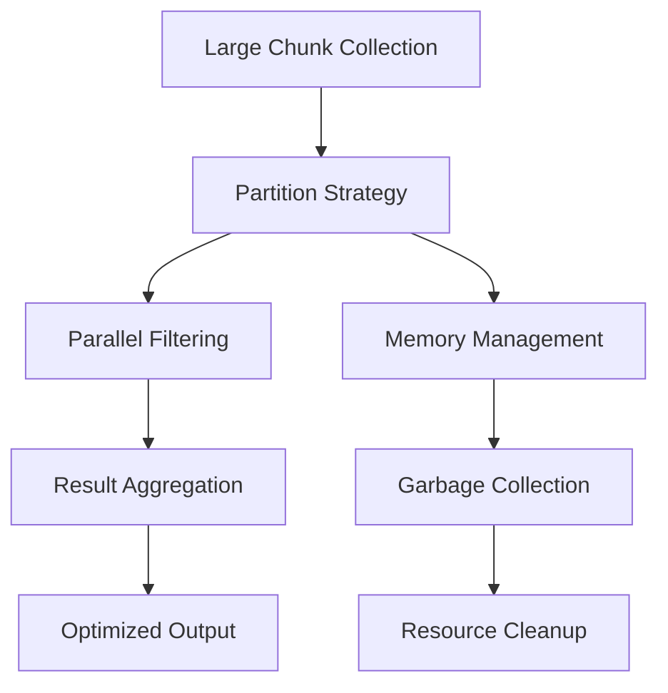

### Performance Monitoring

Key metrics for filtering performance:

| Metric | Measurement | Optimization Target |
|--------|-------------|-------------------|
| Filter Throughput | Chunks/second | > 1000 chunks/sec |
| Memory Usage | MB per million chunks | < 50 MB |
| Latency | Milliseconds per filter | < 10 ms |
| CPU Utilization | Percentage | < 80% |

**Section sources**
- [markdown_chunker/chunker/types.py](file://markdown_chunker/chunker/types.py#L573-L665)

## Combining Multiple Filters

The filtering system supports sophisticated combination of multiple criteria for precise content targeting.

### Boolean Logic Combinations

Multiple filters can be combined using boolean logic:

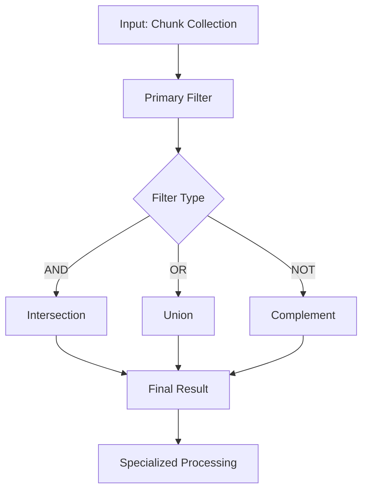

### Multi-Criteria Filtering Examples

#### Code with Specific Language
```python
# Filter code chunks written in Python
python_code = [
    chunk for chunk in chunks 
    if (chunk['metadata'].get('has_code', False) and 
        chunk['metadata'].get('language') == 'python')
]
```

#### High-Quality Tables
```python
# Filter tables with good structure
good_tables = [
    chunk for chunk in chunks
    if (chunk['metadata'].get('has_table', False) and
        chunk['metadata'].get('column_count', 0) > 3 and
        chunk['metadata'].get('row_count', 0) > 10)
]
```

#### Mixed Content with Complexity
```python
# Filter complex mixed content
complex_mixed = [
    chunk for chunk in chunks
    if (chunk['metadata'].get('content_type') == 'mixed' and
        chunk['metadata'].get('complexity_score', 0) > 0.7)
]
```

### Hierarchical Filtering

Complex filtering scenarios benefit from hierarchical approaches:

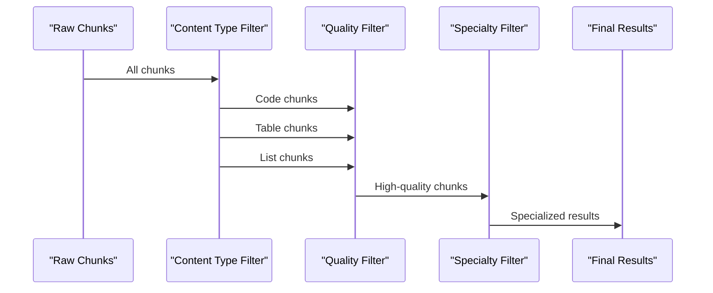

### Filter Composition Patterns

Common filter composition patterns:

| Pattern | Use Case | Implementation |
|---------|----------|----------------|
| Type + Quality | High-quality content | `type_filter AND quality_filter` |
| Language + Content | Language-specific content | `language_filter AND content_filter` |
| Structure + Size | Structured large content | `structure_filter AND size_filter` |
| Temporal + Content | Recent content | `temporal_filter AND content_filter` |

**Section sources**
- [examples/rag_integration.py](file://examples/rag_integration.py#L157-L170)

## Best Practices

Effective content filtering requires adherence to established best practices for reliability, performance, and maintainability.

### Filter Design Principles

#### Single Responsibility
Each filter function should have a single, well-defined purpose:
- Use `get_code_chunks()` for code-only retrieval
- Use `get_table_chunks()` for table-only retrieval
- Use `filter_chunks_by_type()` for universal type filtering

#### Consistency in Naming
Maintain consistent naming conventions across filter functions:
- Use descriptive function names
- Follow established patterns for boolean checks
- Use clear parameter naming

#### Defensive Programming
Implement robust error handling in filter functions:
- Check for null or missing metadata
- Handle unexpected data types gracefully
- Provide meaningful error messages

### Metadata Enrichment Guidelines

#### Comprehensive Coverage
Ensure metadata enrichment covers all relevant content characteristics:
- Include language detection for code blocks
- Capture table structure information
- Preserve list hierarchy information

#### Performance Optimization
Optimize metadata enrichment for large-scale processing:
- Use efficient regular expressions
- Minimize computational overhead
- Cache expensive computations

### Testing Strategies

#### Unit Testing
Test individual filter functions with various input scenarios:
- Empty collections
- Collections with mixed content types
- Collections with edge cases

#### Integration Testing
Test filter combinations in realistic scenarios:
- Multi-stage filtering pipelines
- Performance under load
- Memory usage patterns

### Maintenance Considerations

#### Version Compatibility
Maintain backward compatibility when extending filter functionality:
- Preserve existing filter signatures
- Add optional parameters for new features
- Document breaking changes clearly

#### Documentation Standards
Maintain comprehensive documentation for filter functions:
- Parameter descriptions
- Return value specifications
- Usage examples
- Performance characteristics

**Section sources**
- [tests/test_metadata_filtering.py](file://tests/test_metadata_filtering.py#L16-L312)
- [tests/chunker/test_metadata_properties.py](file://tests/chunker/test_metadata_properties.py#L228-L262)

## Troubleshooting

Common issues and solutions when working with content filtering in RAG systems.

### Missing Metadata Issues

#### Problem: Filters Returning Empty Results
**Symptoms:** Filter functions return empty collections despite expected content.

**Causes:**
- Metadata not properly enriched during chunking
- Incorrect metadata key access
- Content type detection failures

**Solutions:**
- Verify metadata enrichment configuration
- Check metadata key spelling and case sensitivity
- Review content type detection logic

#### Problem: Inconsistent Filter Results
**Symptoms:** Same content produces different filter results across runs.

**Causes:**
- Race conditions in metadata enrichment
- Asynchronous processing issues
- Inconsistent chunking configurations

**Solutions:**
- Ensure deterministic chunking configuration
- Use synchronized processing where necessary
- Implement result caching for repeated queries

### Performance Issues

#### Problem: Slow Filter Execution
**Symptoms:** Filter operations take excessive time on large datasets.

**Causes:**
- Linear search algorithms
- Inefficient metadata access patterns
- Memory allocation overhead

**Solutions:**
- Implement indexed access patterns
- Use batch processing for large collections
- Optimize memory allocation strategies

#### Problem: High Memory Usage
**Symptoms:** Filter operations consume excessive memory.

**Causes:**
- Retaining unnecessary chunk references
- Inefficient data structures
- Memory leaks in filter implementations

**Solutions:**
- Implement proper resource cleanup
- Use memory-efficient data structures
- Monitor and optimize garbage collection

### Content Detection Issues

#### Problem: Incorrect Content Type Classification
**Symptoms:** Content appears in wrong filter buckets.

**Causes:**
- Threshold configuration issues
- Content analysis errors
- Strategy selection problems

**Solutions:**
- Adjust strategy thresholds appropriately
- Review content analysis configuration
- Implement fallback strategy selection

### Integration Problems

#### Problem: Filter Integration Failures
**Symptoms:** Filters don't work correctly in RAG pipeline.

**Causes:**
- Metadata format mismatches
- Pipeline configuration errors
- Serialization issues

**Solutions:**
- Standardize metadata formats across pipeline stages
- Validate pipeline configuration
- Implement proper serialization handling

**Section sources**
- [tests/test_metadata_filtering.py](file://tests/test_metadata_filtering.py#L42-L312)