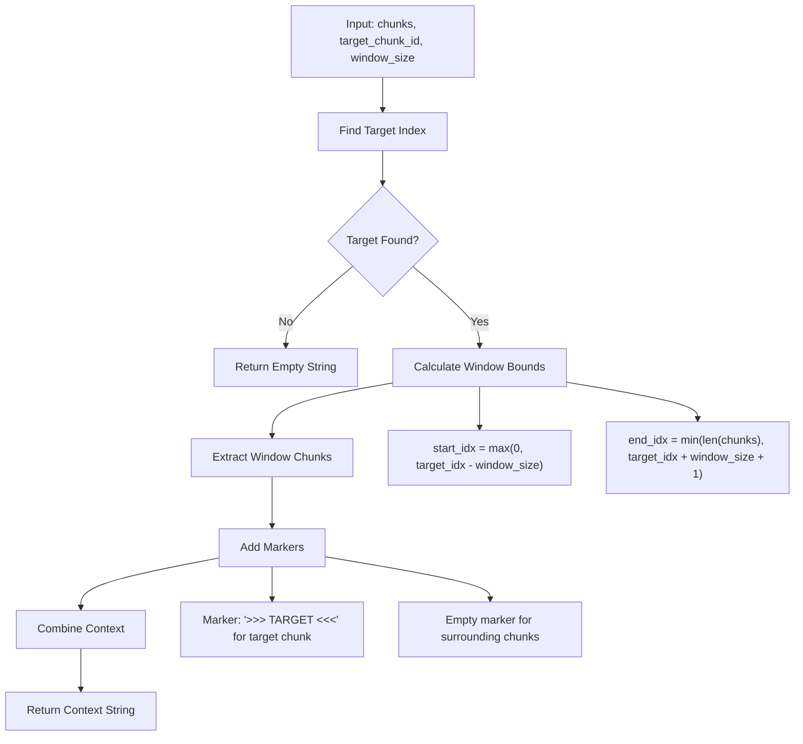
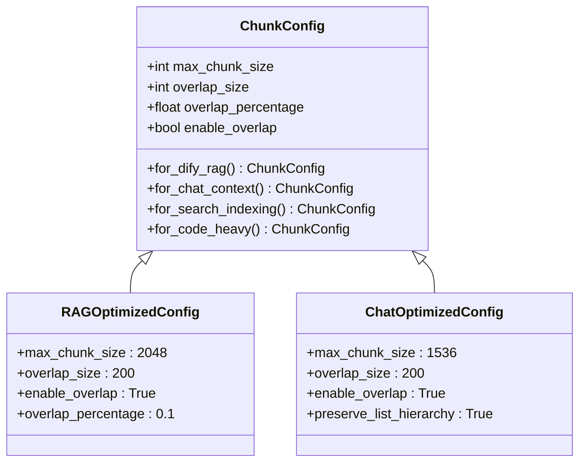
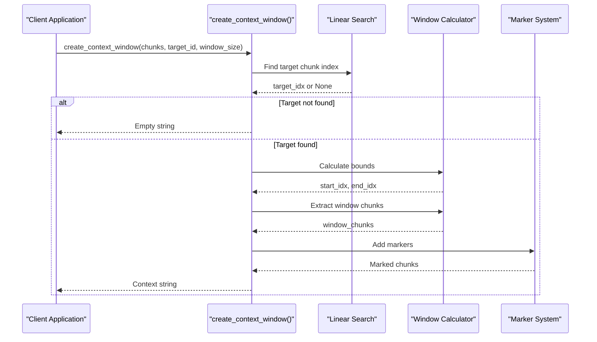
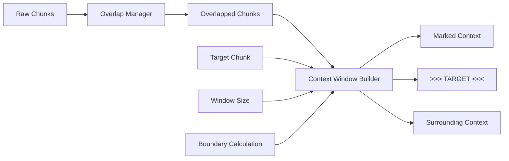
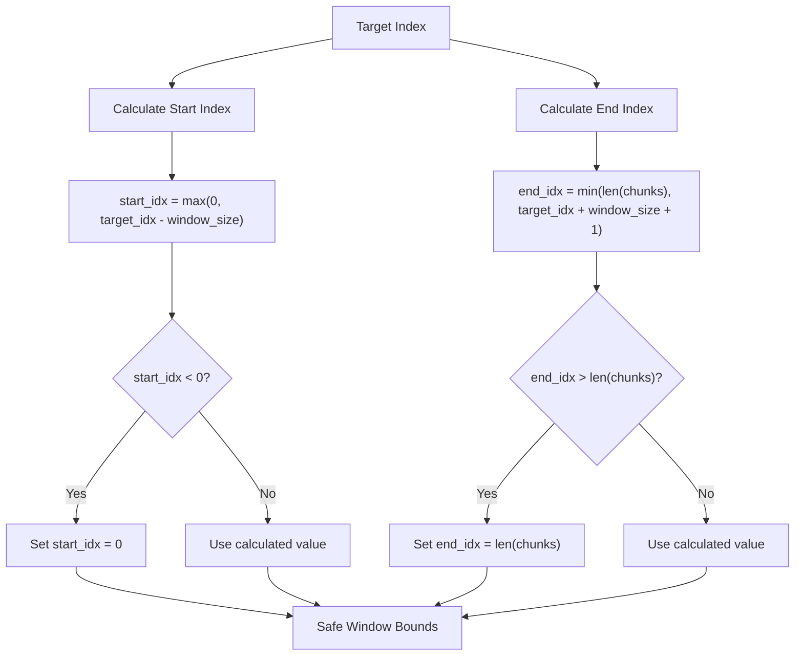
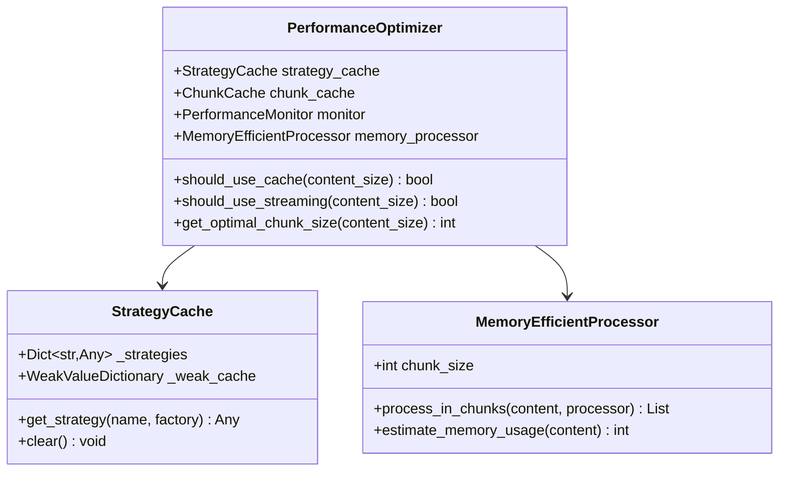
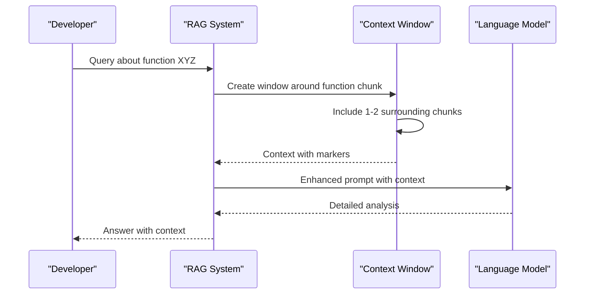
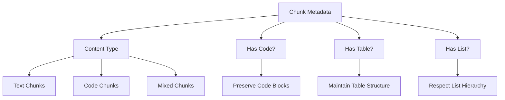

# Context Window Management

<cite>
**Referenced Files in This Document**
- [examples/rag_integration.py](file://examples/rag_integration.py)
- [markdown_chunker/chunker/types.py](file://markdown_chunker/chunker/types.py)
- [markdown_chunker/chunker/components/overlap_manager.py](file://markdown_chunker/chunker/components/overlap_manager.py)
- [markdown_chunker/chunker/performance.py](file://markdown_chunker/chunker/performance.py)
- [tests/chunker/test_chunk_config_validation.py](file://tests/chunker/test_chunk_config_validation.py)
- [tests/chunker/test_overlap_properties.py](file://tests/chunker/test_overlap_properties.py)
- [tests/chunker/test_components/test_overlap_manager.py](file://tests/chunker/test_components/test_overlap_manager.py)
- [tests/chunker/test_config_profiles.py](file://tests/chunker/test_config_profiles.py)
</cite>

## Table of Contents
1. [Introduction](#introduction)
2. [Core Context Window Function](#core-context-window-function)
3. [Window Size Configuration](#window-size-configuration)
4. [Implementation Details](#implementation-details)
5. [Edge Case Handling](#edge-case-handling)
6. [Performance Optimization](#performance-optimization)
7. [Use Cases and Applications](#use-cases-and-applications)
8. [Best Practices](#best-practices)
9. [Troubleshooting Guide](#troubleshooting-guide)
10. [Conclusion](#conclusion)

## Introduction

Context window management is a critical component in Retrieval-Augmented Generation (RAG) systems that enhances the quality of AI-generated responses by providing surrounding context for target chunks. The `create_context_window()` function serves as the primary mechanism for constructing these contextual windows, enabling LLMs to understand the broader document structure and make more informed decisions.

The system balances several competing factors: providing sufficient context to improve answer quality, maintaining token budget constraints, preserving logical document flow, and optimizing for low-latency applications. This comprehensive approach ensures that context windows enhance retrieval quality while remaining practical for production deployments.

## Core Context Window Function

The `create_context_window()` function is the cornerstone of context window management in this RAG system. It creates a cohesive context window around a target chunk by combining surrounding chunks with strategic markers.

**Diagram sources**
- [examples/rag_integration.py](file://examples/rag_integration.py#L101-L136)

The function accepts three primary parameters:
- **chunks**: A list of all document chunks with their metadata
- **target_chunk_id**: The identifier of the specific chunk requiring context
- **window_size**: The number of chunks to include before and after the target (typically 1-3)

**Section sources**
- [examples/rag_integration.py](file://examples/rag_integration.py#L101-L136)

## Window Size Configuration

Window size configuration represents one of the most critical trade-offs in context window management. The optimal window size depends on multiple factors including document structure, content type, and token budget constraints.

### Standard Window Sizes

| Window Size | Use Case | Token Impact | Quality Gain |
|-------------|----------|--------------|--------------|
| 1 | Code sections, tables | Low overhead | Moderate improvement |
| 2 | General text, API docs | Medium overhead | High improvement |
| 3 | Complex documents | Higher overhead | Maximum improvement |
| 4+ | Very complex documents | Significant overhead | Diminishing returns |

### Configuration Strategies

The system provides several configuration approaches through factory methods:

**Diagram sources**
- [markdown_chunker/chunker/types.py](file://markdown_chunker/chunker/types.py#L542-L1001)

### Token Budget Optimization

The system implements sophisticated token budget management through several mechanisms:

1. **Percentage-based Limits**: Overlap never exceeds 40% of source chunk size
2. **Ratio Constraints**: Final overlap ratio never exceeds 50% of total chunk size
3. **Size Validation**: Automatic adjustment of configuration parameters to maintain validity

**Section sources**
- [markdown_chunker/chunker/types.py](file://markdown_chunker/chunker/types.py#L542-L600)
- [markdown_chunker/chunker/components/overlap_manager.py](file://markdown_chunker/chunker/components/overlap_manager.py#L136-L140)

## Implementation Details

The context window creation process involves multiple sophisticated components working in harmony to produce optimal results.

### Target Chunk Identification

The system uses a linear search approach for target chunk identification, which is efficient for typical document sizes:

**Diagram sources**
- [examples/rag_integration.py](file://examples/rag_integration.py#L115-L122)

### Context Reconstruction Logic

The context reconstruction process preserves logical document flow through several mechanisms:

1. **Sequential Ordering**: Chunks are always processed in document order
2. **Boundary Preservation**: Sentence boundaries are respected during overlap creation
3. **Marker System**: Clear visual indicators for target chunks
4. **Metadata Preservation**: All chunk metadata is maintained throughout the process

### Overlap Management Integration

The context window system integrates seamlessly with the overlap management component:

**Diagram sources**
- [markdown_chunker/chunker/components/overlap_manager.py](file://markdown_chunker/chunker/components/overlap_manager.py#L35-L80)

**Section sources**
- [examples/rag_integration.py](file://examples/rag_integration.py#L101-L136)
- [markdown_chunker/chunker/components/overlap_manager.py](file://markdown_chunker/chunker/components/overlap_manager.py#L35-L80)

## Edge Case Handling

Robust edge case handling ensures reliable operation across diverse document types and sizes.

### Document Boundaries

The system handles document boundaries gracefully through careful index calculation:

**Diagram sources**
- [examples/rag_integration.py](file://examples/rag_integration.py#L124-L126)

### Missing Target Chunks

When the target chunk cannot be found, the system returns an empty string rather than throwing an error, providing graceful failure handling:

- **Return Value**: Empty string ("")
- **Error Handling**: Silent failure with appropriate logging
- **Fallback Strategy**: Caller should handle empty results appropriately

### Single Chunk Documents

For documents with only one chunk, the window size effectively becomes irrelevant:

- **Behavior**: Returns the single chunk with target marker
- **Use Case**: Useful for testing and edge case scenarios
- **Limitation**: No surrounding context available

### Empty Chunk Lists

The system handles empty chunk lists gracefully:

- **Input Validation**: Early exit for empty lists
- **Output**: Empty string
- **Performance**: Minimal computational overhead

**Section sources**
- [examples/rag_integration.py](file://examples/rag_integration.py#L115-L122)

## Performance Optimization

The context window system incorporates multiple performance optimization strategies to ensure low-latency operation in production environments.

### Memory Efficiency

The system employs several memory optimization techniques:

1. **Lazy Loading**: Overlap calculations are performed only when needed
2. **Weak References**: Strategy caching uses weak references to prevent memory leaks
3. **Streaming Support**: Large documents can be processed in chunks

**Diagram sources**
- [markdown_chunker/chunker/performance.py](file://markdown_chunker/chunker/performance.py#L210-L242)

### Computational Efficiency

The system optimizes computational performance through:

- **Early Termination**: Quick rejection of invalid inputs
- **Bounds Checking**: Efficient index calculation avoiding unnecessary operations
- **String Concatenation**: Optimized string building using join operations

### Caching Strategies

Multiple caching layers optimize repeated operations:

| Cache Type | Purpose | Trigger Conditions |
|------------|---------|-------------------|
| Strategy Cache | Reuse strategy instances | Same strategy name, same factory |
| Chunk Cache | Store processed chunks | Content size < 50KB |
| Streaming Cache | Process large documents | Content size > 1MB |

**Section sources**
- [markdown_chunker/chunker/performance.py](file://markdown_chunker/chunker/performance.py#L13-L242)

## Use Cases and Applications

Context window management serves diverse use cases in RAG systems, each with specific requirements and optimization strategies.

### Code Section Analysis

For analyzing specific code sections, the system provides targeted context:

**Example Scenario**: Understanding a function implementation within a larger codebase

**Benefits**:
- Surrounding function signatures
- Variable declarations and types
- Import statements and dependencies
- Related function calls

### Table Data Analysis

For tabular data analysis, context preservation is crucial:

**Key Considerations**:
- Header row context
- Column relationships
- Data type information
- Row relationships

### API Documentation Enhancement

API documentation benefits from comprehensive context windows:

**Optimal Configuration**:
- Window size: 2-3 chunks
- Enable overlap: True
- Preserve structure: True
- Target-specific markers

### Question Answering Systems

General Q&A systems leverage context windows for improved accuracy:

**Strategies**:
- Semantic proximity matching
- Content type filtering
- Relevance scoring
- Multi-document context

**Section sources**
- [examples/rag_integration.py](file://examples/rag_integration.py#L139-L170)

## Best Practices

Effective context window management requires adherence to established best practices.

### Configuration Guidelines

1. **Start Conservative**: Begin with window size 1-2 and increase gradually
2. **Monitor Token Usage**: Track token consumption per context window
3. **Content-Type Specific**: Adjust window size based on content type
4. **Test Thoroughly**: Validate results across different document types

### Window Size Selection

| Document Type | Recommended Window Size | Rationale |
|---------------|------------------------|-----------|
| Code Documentation | 1-2 | Code blocks are self-contained |
| API Reference | 2-3 | Context helps understand usage |
| Technical Articles | 2-4 | Complex ideas benefit from context |
| Blog Posts | 1-3 | Narrative flow matters |
| Research Papers | 3-5 | Long-form context is valuable |

### Metadata Utilization

Leverage chunk metadata for intelligent context selection:

**Diagram sources**
- [examples/rag_integration.py](file://examples/rag_integration.py#L139-L170)

### Performance Monitoring

Implement comprehensive monitoring for production deployments:

- **Latency Tracking**: Measure context window creation time
- **Token Usage**: Monitor average tokens per window
- **Success Rates**: Track successful context retrievals
- **Error Rates**: Monitor missing target chunks

**Section sources**
- [examples/rag_integration.py](file://examples/rag_integration.py#L139-L170)

## Troubleshooting Guide

Common issues and their solutions when working with context windows.

### Missing Target Chunk

**Symptoms**: Empty context window returned
**Causes**: 
- Incorrect chunk ID
- Chunk not found in list
- ID format mismatch

**Solutions**:
1. Verify chunk ID format matches exactly
2. Check chunk list contains all expected chunks
3. Implement fallback strategies for missing targets

### Excessive Token Usage

**Symptoms**: Context windows exceed token limits
**Causes**:
- Large window size
- Insufficient overlap limits
- Poor chunk size distribution

**Solutions**:
1. Reduce window_size parameter
2. Implement dynamic sizing based on content
3. Use content-aware truncation

### Broken Context Flow

**Symptoms**: Context appears disjointed
**Causes**:
- Improper chunk ordering
- Missing overlap
- Structural inconsistencies

**Solutions**:
1. Verify chunk ordering matches document flow
2. Enable overlap for continuous context
3. Use structured chunking strategies

### Performance Issues

**Symptoms**: Slow context window creation
**Causes**:
- Large document sizes
- Inefficient search algorithms
- Memory constraints

**Solutions**:
1. Implement chunk caching
2. Use streaming for large documents
3. Optimize search algorithms

**Section sources**
- [examples/rag_integration.py](file://examples/rag_integration.py#L115-L122)
- [markdown_chunker/chunker/components/overlap_manager.py](file://markdown_chunker/chunker/components/overlap_manager.py#L136-L140)

## Conclusion

Context window management represents a sophisticated balance between providing sufficient context for high-quality AI responses and maintaining operational efficiency. The `create_context_window()` function, combined with the comprehensive configuration system and performance optimizations, enables robust RAG implementations across diverse use cases.

Key takeaways for successful implementation:

1. **Configuration Matters**: Choose appropriate window sizes based on content type and use case
2. **Edge Cases Handle Gracefully**: The system provides robust handling of boundary conditions
3. **Performance Optimized**: Multiple optimization layers ensure production viability
4. **Extensible Design**: The modular architecture supports future enhancements

The system's factory methods provide sensible defaults for common scenarios, while the underlying architecture allows for fine-tuned customization when specialized requirements emerge. This combination of simplicity and power makes it an excellent foundation for RAG system development.

Future enhancements may include dynamic window sizing based on content complexity, machine learning-driven optimization, and enhanced streaming capabilities for extremely large documents. The current implementation provides a solid foundation for these advanced features while remaining accessible for immediate deployment.