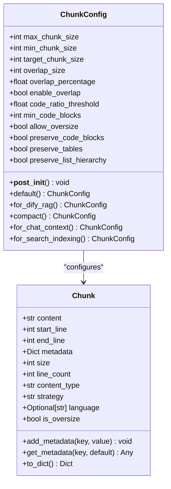
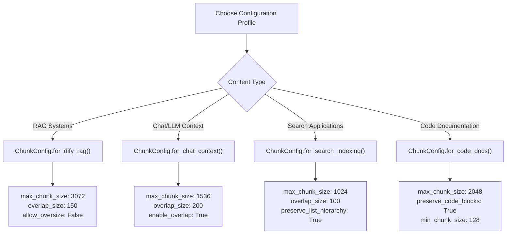
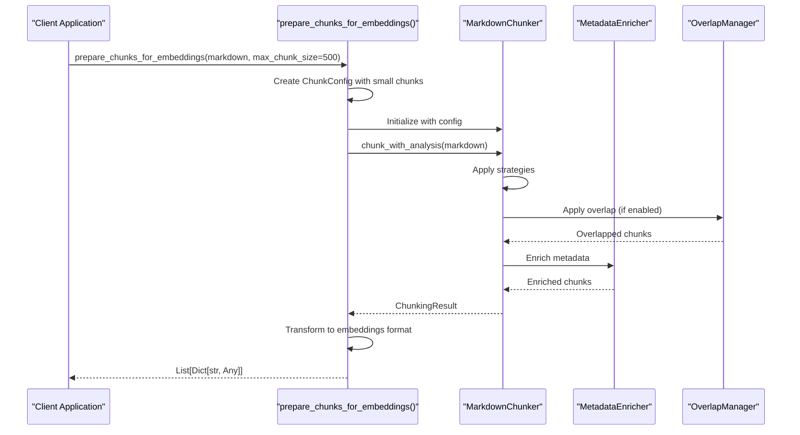
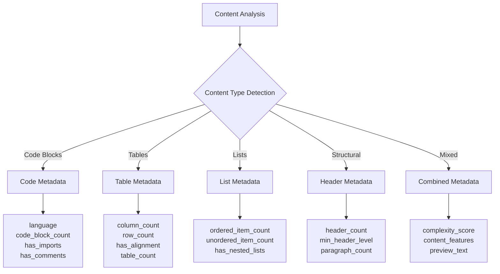
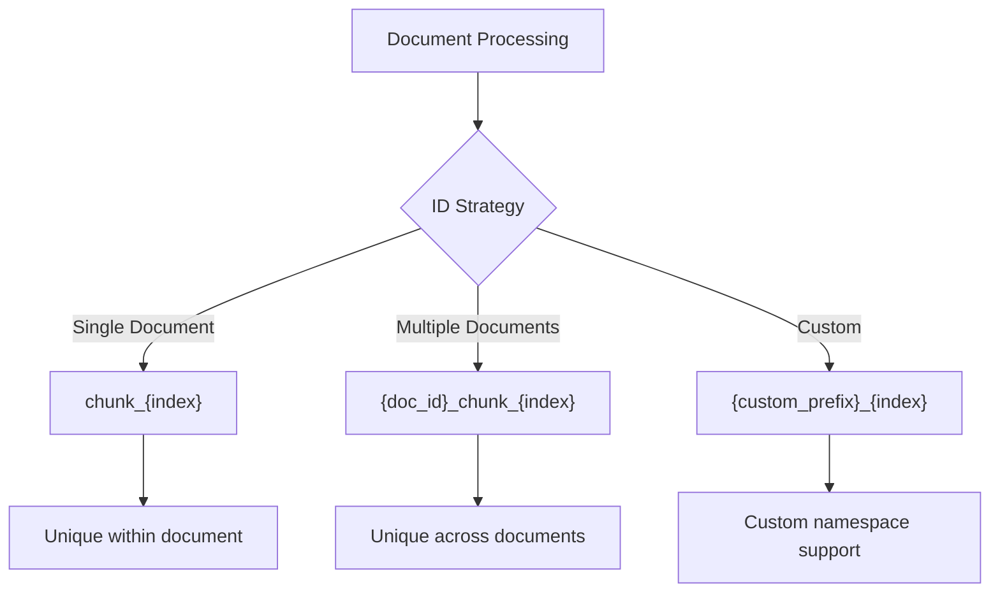
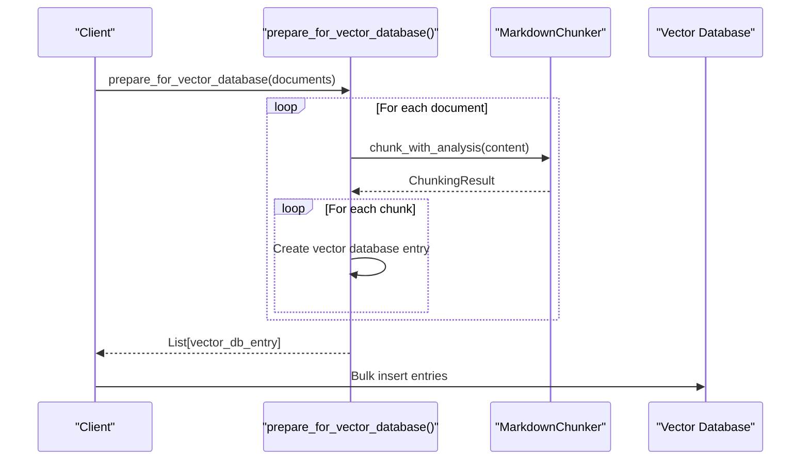
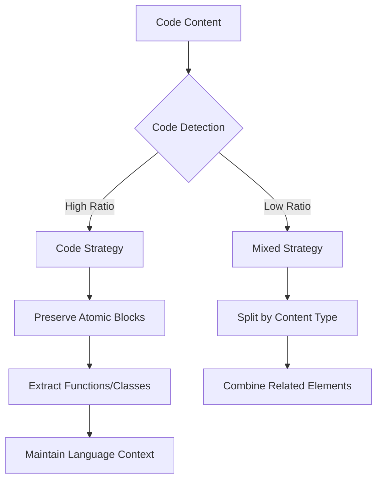

# Embedding Preparation

<cite>
**Referenced Files in This Document**
- [examples/rag_integration.py](file://examples/rag_integration.py)
- [markdown_chunker/chunker/types.py](file://markdown_chunker/chunker/types.py)
- [markdown_chunker/chunker/core.py](file://markdown_chunker/chunker/core.py)
- [markdown_chunker/chunker/components/metadata_enricher.py](file://markdown_chunker/chunker/components/metadata_enricher.py)
- [markdown_chunker/chunker/strategies/code_strategy.py](file://markdown_chunker/chunker/strategies/code_strategy.py)
- [markdown_chunker/chunker/strategies/table_strategy.py](file://markdown_chunker/chunker/strategies/table_strategy.py)
- [tests/chunker/test_config_profiles.py](file://tests/chunker/test_config_profiles.py)
- [tools/markdown_chunk_tool.py](file://tools/markdown_chunk_tool.py)
</cite>

## Table of Contents
1. [Introduction](#introduction)
2. [ChunkConfig Configuration](#chunkconfig-configuration)
3. [Embedding Preparation Functions](#embedding-preparation-functions)
4. [Metadata Enhancement System](#metadata-enhancement-system)
5. [Vector Database Integration](#vector-database-integration)
6. [Optimal Configuration Settings](#optimal-configuration-settings)
7. [Handling Special Content Types](#handling-special-content-types)
8. [Best Practices](#best-practices)
9. [Troubleshooting](#troubleshooting)

## Introduction

The markdown chunker provides sophisticated embedding preparation capabilities designed specifically for Retrieval-Augmented Generation (RAG) systems and semantic search applications. This system transforms markdown documents into optimally sized chunks with rich metadata, enabling high-quality vector embeddings and precise retrieval.

The embedding preparation process involves configuring ChunkConfig for smaller chunk sizes (typically 300-500 characters), enabling overlap (10-20% of chunk size), and enriching metadata to enhance retrieval quality. The system automatically detects and handles special content types like code blocks, tables, and lists, preserving their structural integrity while maintaining semantic coherence.

## ChunkConfig Configuration

### Core Configuration Parameters

The ChunkConfig class provides comprehensive control over chunking behavior for embedding generation:



**Diagram sources**
- [markdown_chunker/chunker/types.py](file://markdown_chunker/chunker/types.py#L498-L620)
- [markdown_chunker/chunker/types.py](file://markdown_chunker/chunker/types.py#L36-L290)

### Recommended Embedding-Specific Settings

For optimal embedding generation, configure ChunkConfig with these parameters:

| Parameter | Recommended Value | Purpose |
|-----------|------------------|---------|
| `max_chunk_size` | 300-500 characters | Small chunks for better semantic precision |
| `min_chunk_size` | 100-200 characters | Prevents overly small fragments |
| `overlap_size` | 30-50 characters (10-20% of chunk size) | Maintains context across boundaries |
| `enable_overlap` | `True` | Essential for RAG applications |
| `allow_oversize` | `False` | Prevents fragmentation of atomic elements |
| `preserve_code_blocks` | `True` | Keeps code integrity |
| `preserve_tables` | `True` | Maintains table structure |
| `code_ratio_threshold` | 0.6-0.7 | Adjust based on content type |

### Factory Methods for Embedding Configurations

The system provides specialized factory methods for different embedding scenarios:



**Diagram sources**
- [markdown_chunker/chunker/types.py](file://markdown_chunker/chunker/types.py#L887-L1000)

**Section sources**
- [markdown_chunker/chunker/types.py](file://markdown_chunker/chunker/types.py#L498-L620)
- [markdown_chunker/chunker/types.py](file://markdown_chunker/chunker/types.py#L887-L1000)

## Embedding Preparation Functions

### prepare_chunks_for_embeddings()

The primary function for preparing markdown content for embedding generation:



**Diagram sources**
- [examples/rag_integration.py](file://examples/rag_integration.py#L13-L53)
- [markdown_chunker/chunker/core.py](file://markdown_chunker/chunker/core.py#L259-L285)

Key features of the function:
- **Small chunk sizes**: Configured for embeddings (typically 300-500 characters)
- **Automatic overlap**: 10-20% overlap for context preservation
- **Rich metadata**: Comprehensive metadata enrichment
- **Format conversion**: Transforms to dictionary format for embedding systems

### prepare_for_vector_database()

Function for preparing multiple documents for vector database storage:

This function creates a unified format suitable for vector database ingestion, including document identification and chunk metadata.

**Section sources**
- [examples/rag_integration.py](file://examples/rag_integration.py#L13-L53)
- [examples/rag_integration.py](file://examples/rag_integration.py#L56-L98)

## Metadata Enhancement System

### Content Type Detection

The metadata enricher automatically detects and categorizes content types:



**Diagram sources**
- [markdown_chunker/chunker/components/metadata_enricher.py](file://markdown_chunker/chunker/components/metadata_enricher.py#L120-L132)

### Rich Metadata Fields

The system generates comprehensive metadata for each chunk:

| Category | Fields | Purpose |
|----------|--------|---------|
| **Basic Info** | `chunk_index`, `total_chunks`, `size`, `lines` | Position and sizing information |
| **Content Type** | `content_type`, `strategy`, `has_code`, `has_table`, `has_list` | Content classification |
| **Quality Metrics** | `complexity_score`, `word_count`, `line_count` | Content analysis |
| **Code Information** | `language`, `code_block_count`, `has_imports`, `has_comments` | Programming content |
| **Table Information** | `column_count`, `row_count`, `has_alignment` | Tabular data |
| **List Information** | `ordered_item_count`, `unordered_item_count`, `has_nested_lists` | Hierarchical content |
| **Search Features** | `has_urls`, `has_emails`, `has_numbers`, `preview` | Search optimization |

### Strategy-Specific Enrichment

Different strategies contribute specialized metadata:

**Code Strategy Metadata:**
- Language detection and extraction
- Function and class identification
- Import statement recognition
- Comment presence detection

**Table Strategy Metadata:**
- Column and row counting
- Alignment detection
- Separator pattern analysis

**List Strategy Metadata:**
- Ordered vs unordered item counts
- Nested list detection
- Task list identification

**Section sources**
- [markdown_chunker/chunker/components/metadata_enricher.py](file://markdown_chunker/chunker/components/metadata_enricher.py#L120-L328)

## Vector Database Integration

### ID Generation Strategy

The system provides flexible ID generation for vector databases:



**Diagram sources**
- [examples/rag_integration.py](file://examples/rag_integration.py#L38-L40)
- [examples/rag_integration.py](file://examples/rag_integration.py#L82-L83)

### Vector Database Input Format

The prepared chunks follow this standardized format:

```json
{
    "id": "doc1_chunk_3",
    "text": "This is the chunk content...",
    "metadata": {
        "doc_id": "doc1",
        "chunk_index": 3,
        "total_chunks": 10,
        "lines": "25-35",
        "size": 420,
        "strategy": "code",
        "content_type": "code",
        "has_code": true,
        "has_table": false,
        "has_list": false,
        "complexity": 0.75,
        "language": "python",
        "code_block_count": 2,
        "word_count": 85,
        "line_count": 5
    }
}
```

### Batch Processing for Multiple Documents

The system efficiently handles batch processing of multiple documents:



**Diagram sources**
- [examples/rag_integration.py](file://examples/rag_integration.py#L56-L98)

**Section sources**
- [examples/rag_integration.py](file://examples/rag_integration.py#L56-L98)

## Optimal Configuration Settings

### Embedding Model Compatibility

Different embedding models have varying optimal configurations:

| Model Provider | Recommended Chunk Size | Overlap Percentage | Notes |
|----------------|----------------------|-------------------|-------|
| **OpenAI** | 300-400 chars | 15-20% | Works well with smaller chunks |
| **Cohere** | 350-500 chars | 10-15% | Can handle slightly larger chunks |
| **Hugging Face** | 250-400 chars | 10-20% | Variable depending on model |
| **Sentence Transformers** | 300-500 chars | 15-25% | Model-dependent |

### Content-Type Specific Configurations

**Code Documentation:**
```python
config = ChunkConfig.for_code_docs()
# max_chunk_size: 2048
# min_chunk_size: 128
# preserve_code_blocks: True
# overlap_size: 100
```

**Technical Documentation:**
```python
config = ChunkConfig.for_dify_rag()
# max_chunk_size: 3072
# overlap_size: 150
# allow_oversize: False
```

**Search-Focused Content:**
```python
config = ChunkConfig.for_search_indexing()
# max_chunk_size: 1024
# overlap_size: 100
# preserve_list_hierarchy: True
```

### Performance Optimization

For large-scale embedding generation:

```python
config = ChunkConfig.for_fast_processing()
# max_chunk_size: 8192
# overlap_size: 100
# enable_streaming: True
# enable_overlap: False
```

**Section sources**
- [markdown_chunker/chunker/types.py](file://markdown_chunker/chunker/types.py#L887-L1000)
- [tests/chunker/test_config_profiles.py](file://tests/chunker/test_config_profiles.py#L33-L69)

## Handling Special Content Types

### Code Block Processing

The code strategy preserves code integrity while extracting meaningful chunks:



**Diagram sources**
- [markdown_chunker/chunker/strategies/code_strategy.py](file://markdown_chunker/chunker/strategies/code_strategy.py#L109-L134)

**Code Metadata Features:**
- Automatic language detection
- Function and class extraction
- Import statement identification
- Comment preservation
- Code block counting

### Table Processing

Table strategy maintains structural integrity:

**Table Metadata:**
- Column and row counting
- Alignment detection
- Header preservation
- Separator pattern analysis

### List Processing

List strategy handles hierarchical content:

**List Metadata:**
- Ordered vs unordered item counts
- Nested list detection
- Task list identification
- List depth analysis

**Section sources**
- [markdown_chunker/chunker/strategies/code_strategy.py](file://markdown_chunker/chunker/strategies/code_strategy.py#L109-L134)
- [markdown_chunker/chunker/strategies/table_strategy.py](file://markdown_chunker/chunker/strategies/table_strategy.py#L109-L125)
- [markdown_chunker/chunker/components/metadata_enricher.py](file://markdown_chunker/chunker/components/metadata_enricher.py#L165-L254)

## Best Practices

### Chunk Size Guidelines

**For Embedding Quality:**
- **Small chunks (200-400 chars)**: Better semantic precision, more retrieval candidates
- **Medium chunks (400-600 chars)**: Balanced quality and efficiency
- **Large chunks (600+ chars)**: Less precise but faster processing

### Overlap Strategy

**Recommended Overlap Patterns:**
- **10-20% of chunk size** for most applications
- **Higher overlap (20-30%)** for critical content
- **Lower overlap (5-10%)** for search-focused applications

### Metadata Utilization

**Effective Metadata Usage:**
- Use `content_type` for filtering
- Leverage `has_code` and `has_table` for specialized retrieval
- Apply `complexity_score` for relevance ranking
- Utilize `strategy` for understanding chunk origin

### Performance Considerations

**Optimization Tips:**
- Use appropriate factory methods for your use case
- Enable streaming for large documents
- Choose efficient overlap settings
- Batch process multiple documents when possible

## Troubleshooting

### Common Issues and Solutions

**Issue: Chunks are too fragmented**
- **Solution**: Increase `max_chunk_size` or decrease `overlap_percentage`
- **Impact**: Larger chunks reduce retrieval granularity

**Issue: Context loss across boundaries**
- **Solution**: Increase overlap size or percentage
- **Impact**: More overlap increases storage requirements

**Issue: Poor retrieval quality**
- **Solution**: Adjust content type thresholds or use specialized profiles
- **Impact**: Better matching but potentially more noise

**Issue: Memory usage with large documents**
- **Solution**: Enable streaming or use `for_fast_processing()` profile
- **Impact**: Faster processing but less sophisticated chunking

### Debugging Tools

**Validation Functions:**
- `validate_metadata()` for metadata consistency
- `get_metadata_summary()` for statistics
- `get_performance_stats()` for timing analysis

**Monitoring:**
- Enable performance monitoring for optimization insights
- Use chunk size validators to prevent extreme values
- Monitor strategy usage for effectiveness assessment

**Section sources**
- [markdown_chunker/chunker/components/metadata_enricher.py](file://markdown_chunker/chunker/components/metadata_enricher.py#L330-L414)
- [markdown_chunker/chunker/core.py](file://markdown_chunker/chunker/core.py#L661-L710)