# Multi-Document Processing

<cite>
**Referenced Files in This Document**
- [examples/rag_integration.py](file://examples/rag_integration.py)
- [markdown_chunker/chunker/orchestrator.py](file://markdown_chunker/chunker/orchestrator.py)
- [markdown_chunker/chunker/core.py](file://markdown_chunker/chunker/core.py)
- [markdown_chunker/chunker/types.py](file://markdown_chunker/chunker/types.py)
- [markdown_chunker/chunker/components/metadata_enricher.py](file://markdown_chunker/chunker/components/metadata_enricher.py)
- [markdown_chunker/chunker/strategies/base.py](file://markdown_chunker/chunker/strategies/base.py)
- [markdown_chunker/chunker/performance.py](file://markdown_chunker/chunker/performance.py)
- [markdown_chunker/api/error_handler.py](file://markdown_chunker/api/error_handler.py)
- [markdown_chunker/parser/errors.py](file://markdown_chunker/parser/errors.py)
- [tests/chunker/test_integration.py](file://tests/chunker/test_integration.py)
</cite>

## Table of Contents
1. [Introduction](#introduction)
2. [Core Processing Pattern](#core-processing-pattern)
3. [Document-Level Context Preservation](#document-level-context-preservation)
4. [Multi-Document Workflow Architecture](#multi-document-workflow-architecture)
5. [Memory-Efficient Processing](#memory-efficient-processing)
6. [Batch Processing Optimization](#batch-processing-optimization)
7. [Error Handling in Bulk Scenarios](#error-handling-in-bulk-scenarios)
8. [Performance Considerations](#performance-considerations)
9. [Best Practices](#best-practices)
10. [Advanced Patterns](#advanced-patterns)

## Introduction

Multi-document processing in RAG (Retrieval-Augmented Generation) workflows requires careful orchestration of document chunking while maintaining contextual integrity across multiple sources. The `prepare_for_vector_database()` function demonstrates a sophisticated pattern for handling collections of documents with proper ID scoping, metadata preservation, and scalable processing strategies.

This documentation explores the comprehensive approach to processing multiple documents efficiently, covering everything from basic chunking patterns to advanced optimization techniques for large-scale deployments.

## Core Processing Pattern

The foundation of multi-document processing lies in the `prepare_for_vector_database()` function, which exemplifies the optimal pattern for handling document collections.

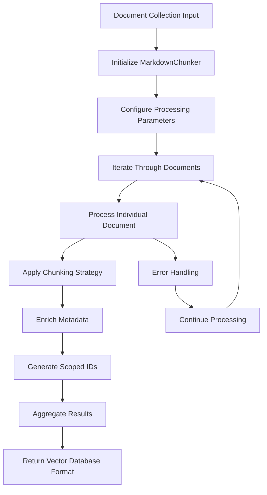

**Diagram sources**
- [examples/rag_integration.py](file://examples/rag_integration.py#L56-L98)

### Fundamental Processing Loop

The core processing pattern involves iterating through documents while maintaining state and generating scoped identifiers:

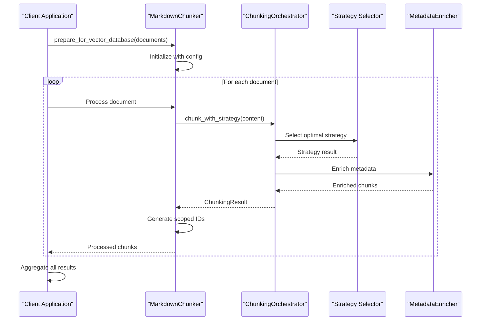

**Diagram sources**
- [examples/rag_integration.py](file://examples/rag_integration.py#L56-L98)
- [markdown_chunker/chunker/orchestrator.py](file://markdown_chunker/chunker/orchestrator.py#L55-L118)

**Section sources**
- [examples/rag_integration.py](file://examples/rag_integration.py#L56-L98)

## Document-Level Context Preservation

Maintaining document-level context is crucial for effective RAG systems. The system achieves this through comprehensive metadata preservation and strategic ID scoping.

### ID Scoping Strategy

The pattern uses hierarchical ID generation to maintain document provenance:

| ID Component | Purpose | Format | Example |
|--------------|---------|--------|---------|
| `doc_id` | Document identifier | String | `"doc1"` |
| `chunk_index` | Chunk position | Integer | `0, 1, 2, ...` |
| `scoped_id` | Unique combined ID | `{doc_id}_chunk_{index}` | `"doc1_chunk_0"` |

### Metadata Enrichment Pattern

The `MetadataEnricher` component adds comprehensive context information:

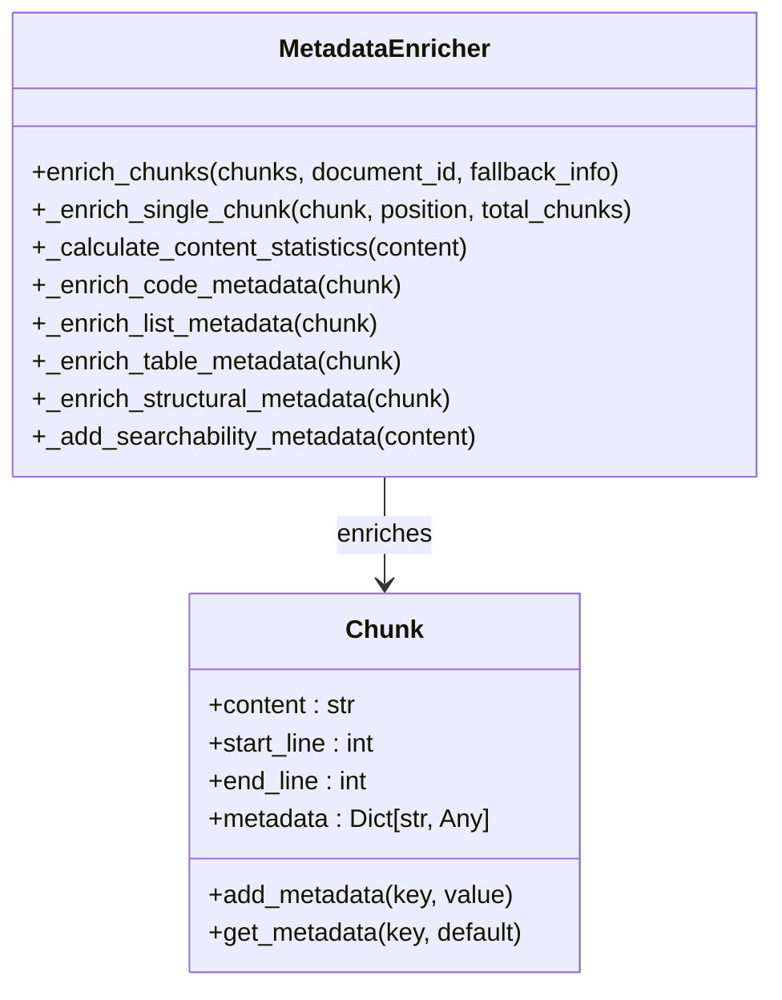

**Diagram sources**
- [markdown_chunker/chunker/components/metadata_enricher.py](file://markdown_chunker/chunker/components/metadata_enricher.py#L13-L414)

### Context Window Creation

The system supports context window creation for RAG applications:

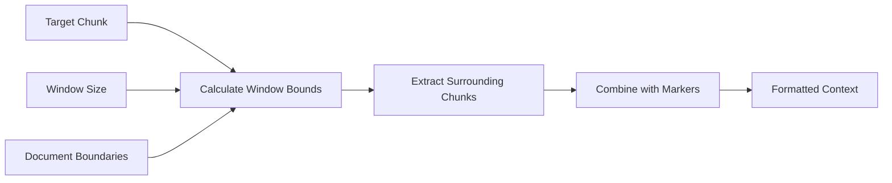

**Diagram sources**
- [examples/rag_integration.py](file://examples/rag_integration.py#L101-L136)

**Section sources**
- [markdown_chunker/chunker/components/metadata_enricher.py](file://markdown_chunker/chunker/components/metadata_enricher.py#L35-L142)
- [examples/rag_integration.py](file://examples/rag_integration.py#L101-L136)

## Multi-Document Workflow Architecture

The architecture supports various processing patterns for different use cases.

### Processing Pipeline Stages

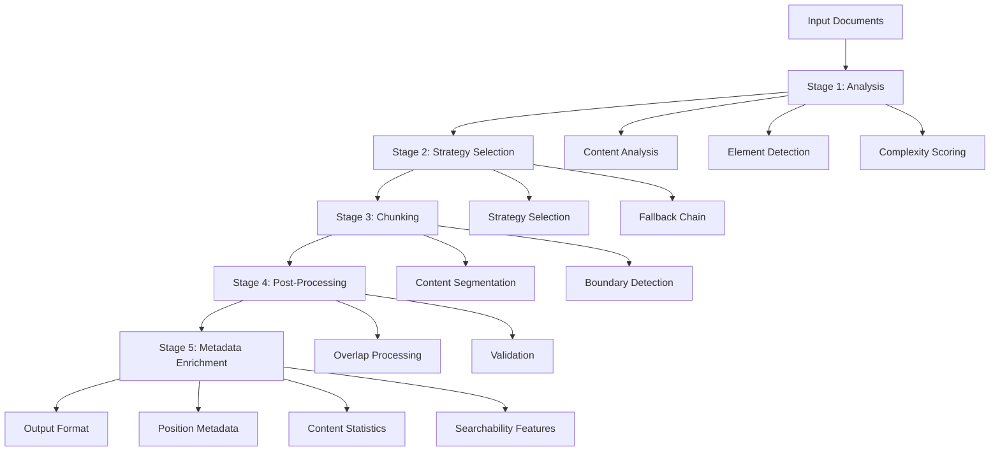

**Diagram sources**
- [markdown_chunker/chunker/orchestrator.py](file://markdown_chunker/chunker/orchestrator.py#L55-L118)
- [markdown_chunker/chunker/core.py](file://markdown_chunker/chunker/core.py#L265-L345)

### Configuration Management

Different document types require specialized configurations:

| Document Type | Configuration Profile | Key Settings |
|---------------|----------------------|--------------|
| Code Documentation | `for_code_heavy()` | Larger chunks, aggressive code detection |
| Technical Manuals | `for_structured_docs()` | Respect header hierarchy, medium chunks |
| API References | `for_dify_rag()` | Optimized for embedding generation |
| General Docs | Default | Balanced settings for versatility |

**Section sources**
- [markdown_chunker/chunker/orchestrator.py](file://markdown_chunker/chunker/orchestrator.py#L55-L118)
- [markdown_chunker/chunker/core.py](file://markdown_chunker/chunker/core.py#L265-L345)

## Memory-Efficient Processing

For large document collections, memory efficiency becomes critical.

### Streaming and Chunking Strategy

The system implements several memory optimization techniques:

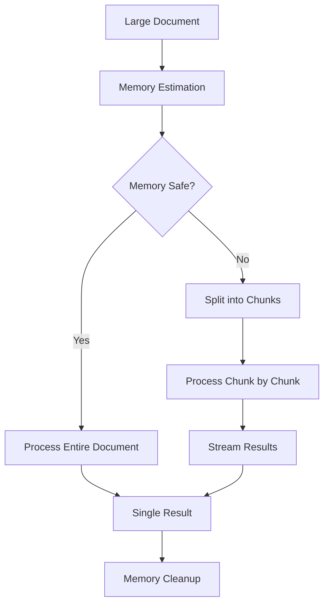

**Diagram sources**
- [markdown_chunker/chunker/performance.py](file://markdown_chunker/chunker/performance.py#L184-L207)

### Memory Management Patterns

The system provides several approaches for memory-efficient processing:

1. **Streaming Processing**: Process documents in chunks to limit memory usage
2. **Lazy Loading**: Load document content only when needed
3. **Result Aggregation**: Stream results to avoid holding all chunks in memory
4. **Garbage Collection**: Explicit cleanup of intermediate results

**Section sources**
- [markdown_chunker/chunker/performance.py](file://markdown_chunker/chunker/performance.py#L184-L207)

## Batch Processing Optimization

Optimizing batch processing for large document collections requires careful consideration of throughput, latency, and resource utilization.

### Parallel Processing Patterns

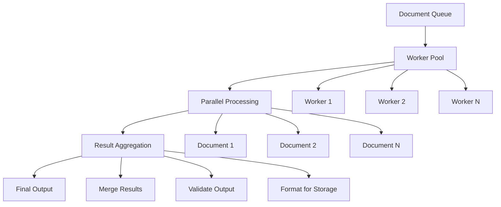

### Batch Size Optimization

The optimal batch size depends on several factors:

| Factor | Small Batches | Medium Batches | Large Batches |
|--------|---------------|----------------|---------------|
| Memory Usage | Low | Medium | High |
| Processing Latency | High | Medium | Low |
| CPU Utilization | Low | Medium | High |
| Throughput | Low | High | High |
| Resource Contention | Low | Medium | High |

### Concurrent Processing Implementation

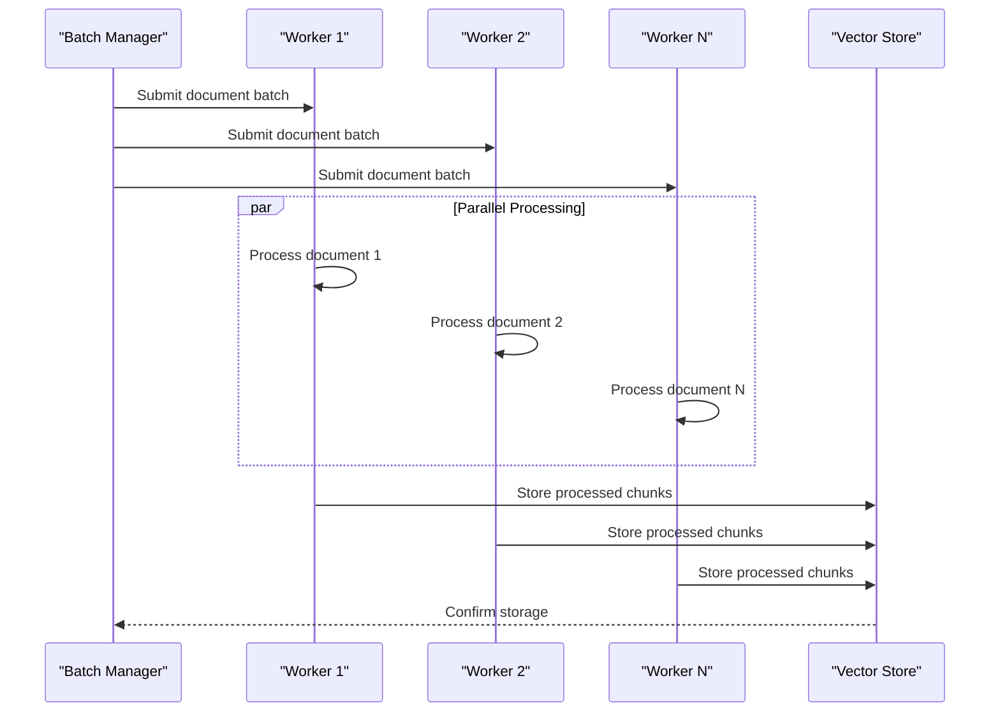

**Section sources**
- [examples/rag_integration.py](file://examples/rag_integration.py#L216-L267)

## Error Handling in Bulk Scenarios

Robust error handling is essential for reliable multi-document processing.

### Error Classification and Recovery

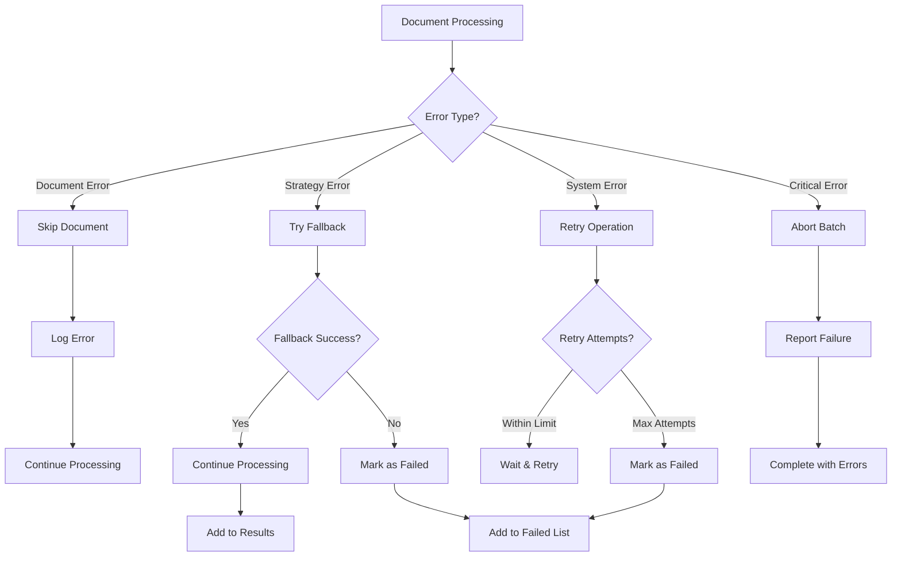

**Diagram sources**
- [markdown_chunker/api/error_handler.py](file://markdown_chunker/api/error_handler.py#L81-L118)
- [markdown_chunker/parser/errors.py](file://markdown_chunker/parser/errors.py#L262-L355)

### Error Handling Strategies

The system implements multiple error handling approaches:

1. **Graceful Degradation**: Continue processing despite individual document failures
2. **Fallback Mechanisms**: Automatic fallback to simpler strategies
3. **Retry Logic**: Intelligent retry with exponential backoff
4. **Error Reporting**: Comprehensive error logging and reporting

### Error Recovery Patterns

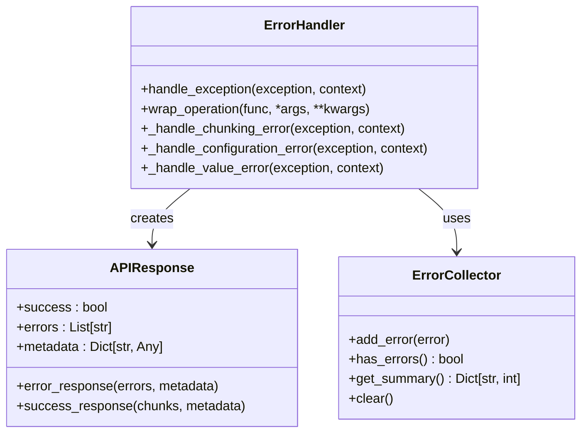

**Diagram sources**
- [markdown_chunker/api/error_handler.py](file://markdown_chunker/api/error_handler.py#L81-L118)
- [markdown_chunker/parser/errors.py](file://markdown_chunker/parser/errors.py#L262-L355)

**Section sources**
- [markdown_chunker/api/error_handler.py](file://markdown_chunker/api/error_handler.py#L81-L118)
- [markdown_chunker/parser/errors.py](file://markdown_chunker/parser/errors.py#L262-L355)

## Performance Considerations

Scaling to hundreds or thousands of documents requires careful performance optimization.

### Performance Metrics and Monitoring

Key performance indicators for multi-document processing:

| Metric | Description | Target Value | Monitoring Method |
|--------|-------------|--------------|-------------------|
| Throughput | Documents/second | >10 docs/sec | Timer-based measurement |
| Latency | Processing time per document | <100ms | Request timing logs |
| Memory Usage | Peak memory consumption | <2GB | System monitoring |
| Error Rate | Failed documents percentage | <1% | Error tracking |
| Chunk Quality | Average chunk size deviation | ±10% | Statistical analysis |

### Scaling Strategies

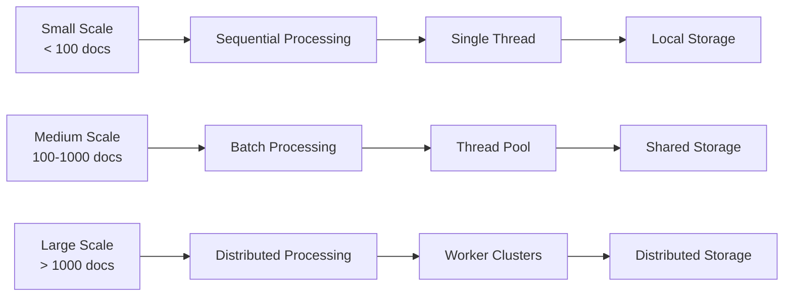

### Performance Optimization Techniques

1. **Strategy Caching**: Cache strategy selection decisions
2. **Result Memoization**: Avoid reprocessing identical content
3. **Parallel Processing**: Utilize multiple CPU cores
4. **Memory Pooling**: Reuse objects to reduce GC pressure
5. **Lazy Evaluation**: Defer expensive operations until needed

**Section sources**
- [markdown_chunker/chunker/performance.py](file://markdown_chunker/chunker/performance.py#L168-L207)

## Best Practices

### Document Preparation Guidelines

1. **Consistent Formatting**: Ensure uniform document structure
2. **Metadata Standardization**: Use consistent metadata schemas
3. **Content Validation**: Validate document integrity before processing
4. **Size Optimization**: Balance chunk size with context preservation

### Processing Configuration

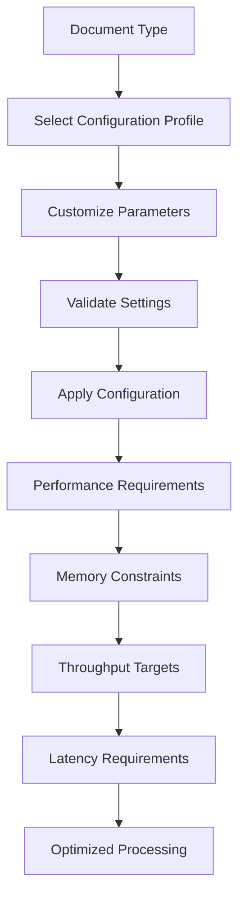

### Quality Assurance

1. **Chunk Validation**: Verify chunk integrity and size
2. **Metadata Consistency**: Ensure metadata uniformity
3. **Cross-Document Testing**: Test with diverse document collections
4. **Performance Benchmarking**: Regular performance measurements

**Section sources**
- [tests/chunker/test_integration.py](file://tests/chunker/test_integration.py#L12-L200)

## Advanced Patterns

### Dynamic Configuration Management

For large-scale deployments, dynamic configuration adjustment is essential:

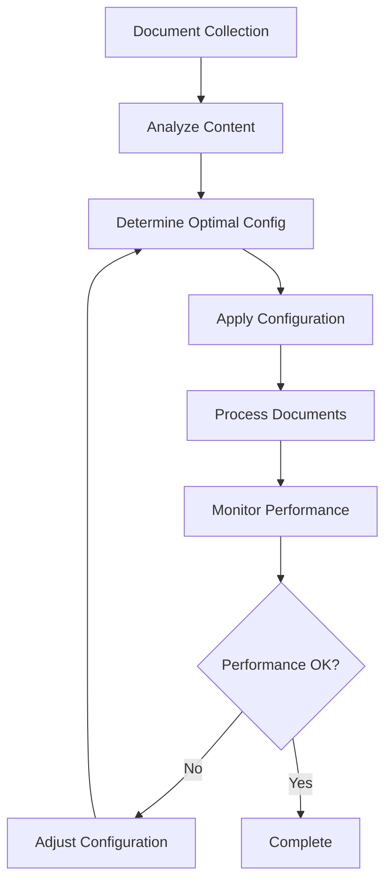

### Adaptive Processing Strategies

The system supports adaptive processing based on document characteristics:

1. **Content-Aware Strategies**: Choose strategies based on document type
2. **Performance-Based Routing**: Route documents to optimal processing paths
3. **Quality Feedback Loops**: Adjust processing based on output quality
4. **Resource-Aware Scheduling**: Optimize resource utilization

### Cross-Document Retrieval

For effective RAG systems, cross-document retrieval requires careful consideration:

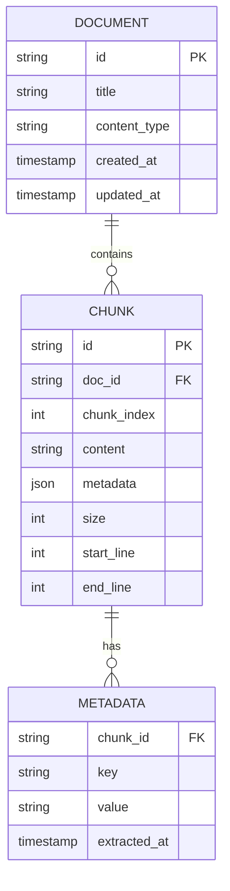

**Diagram sources**
- [markdown_chunker/chunker/types.py](file://markdown_chunker/chunker/types.py#L36-L290)

### Integration Patterns

The system supports various integration patterns for different architectures:

1. **Microservice Architecture**: Separate chunking service
2. **Event-Driven Processing**: Async document processing
3. **API Gateway Integration**: RESTful chunking endpoints
4. **Message Queue Processing**: Distributed document processing

**Section sources**
- [examples/rag_integration.py](file://examples/rag_integration.py#L1-L432)