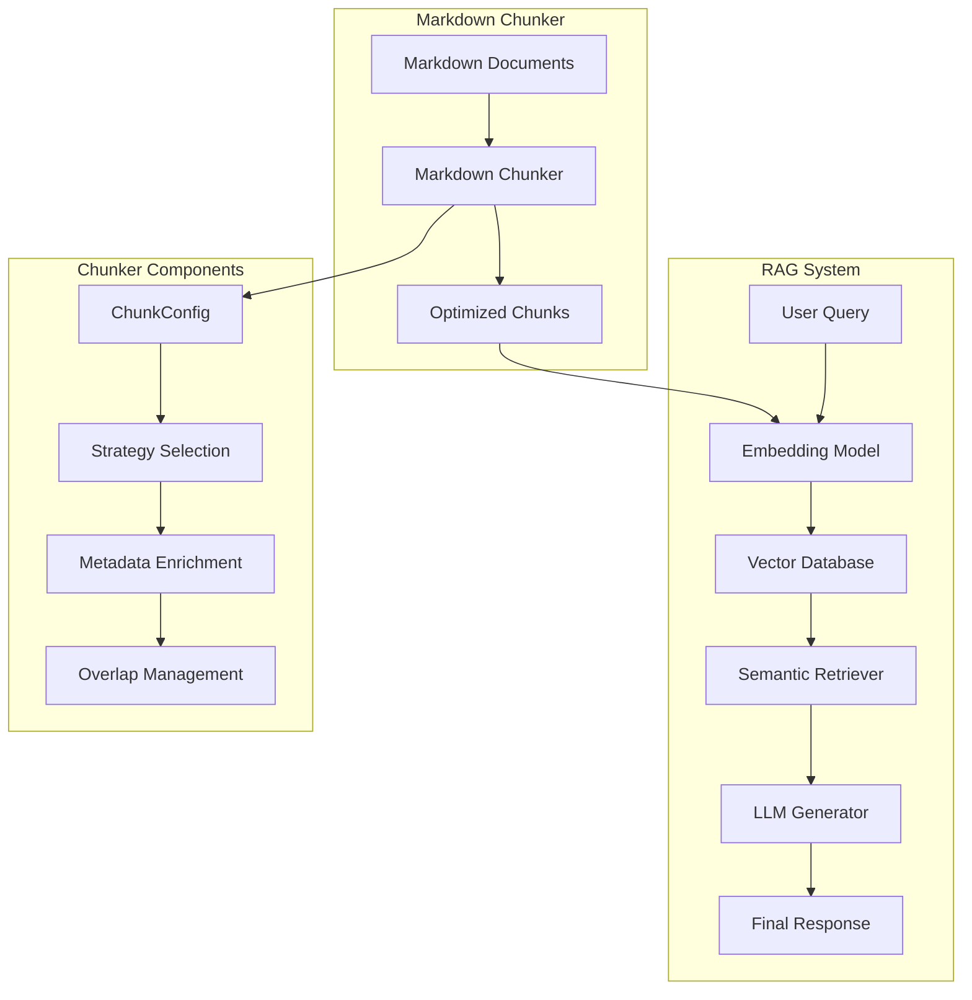
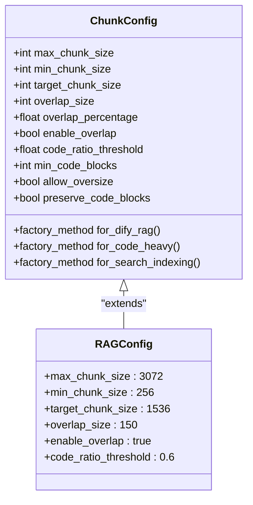
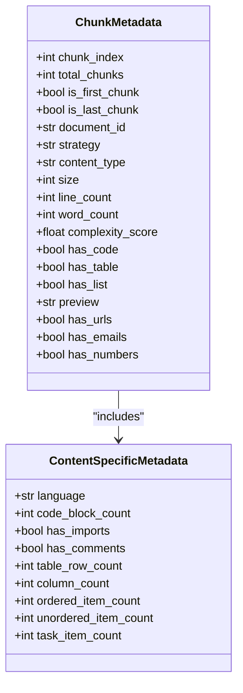
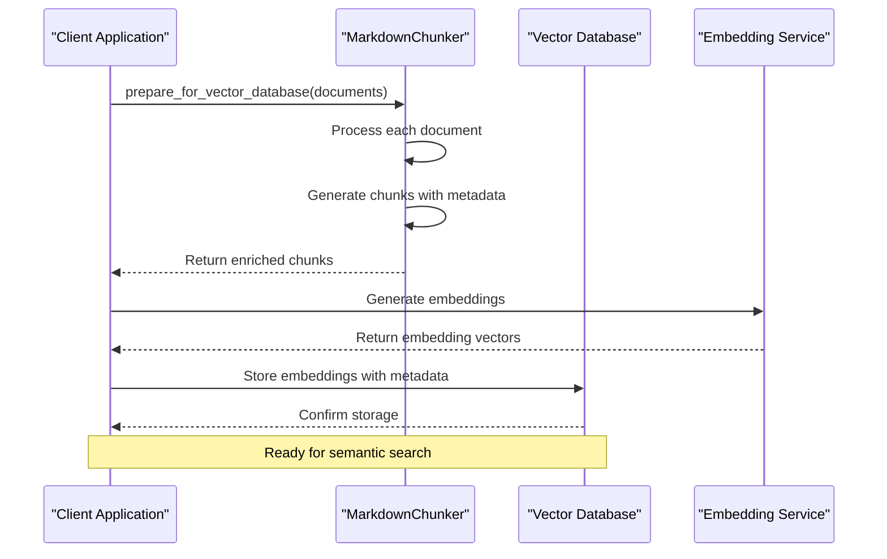
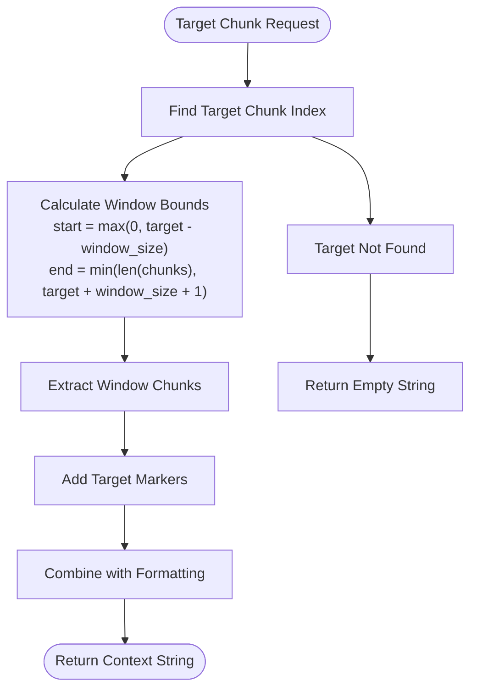
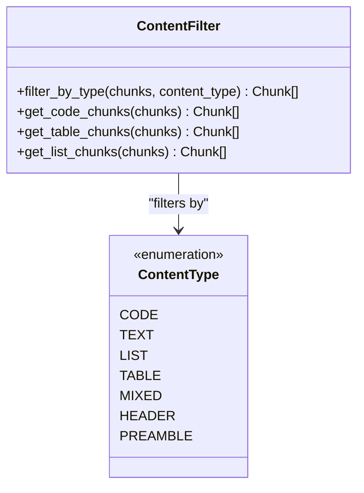
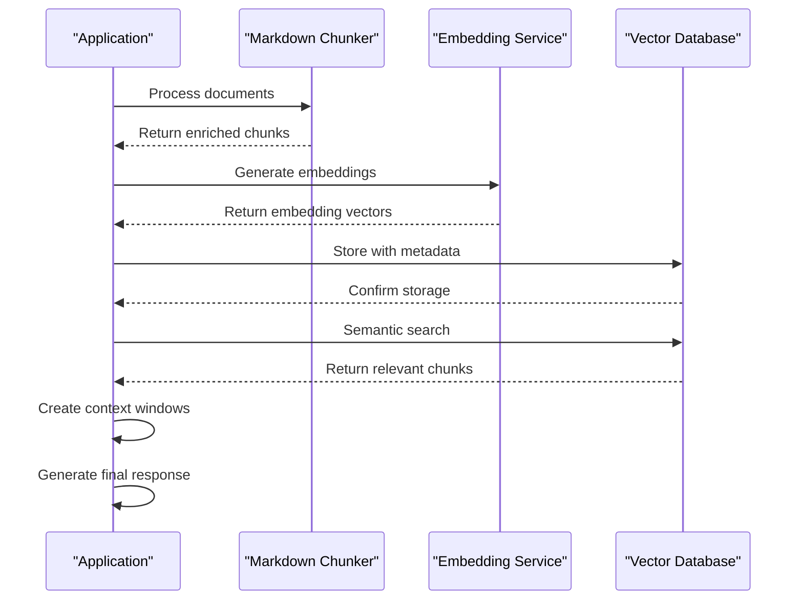

# RAG System Integration

<cite>
**Referenced Files in This Document**
- [examples/rag_integration.py](file://examples/rag_integration.py)
- [markdown_chunker/chunker/types.py](file://markdown_chunker/chunker/types.py)
- [markdown_chunker/chunker/orchestrator.py](file://markdown_chunker/chunker/orchestrator.py)
- [markdown_chunker/chunker/components/metadata_enricher.py](file://markdown_chunker/chunker/components/metadata_enricher.py)
- [markdown_chunker/chunker/strategies/code_strategy.py](file://markdown_chunker/chunker/strategies/code_strategy.py)
- [markdown_chunker/chunker/strategies/table_strategy.py](file://markdown_chunker/chunker/strategies/table_strategy.py)
- [markdown_chunker/chunker/strategies/list_strategy.py](file://markdown_chunker/chunker/strategies/list_strategy.py)
- [markdown_chunker/chunker/core.py](file://markdown_chunker/chunker/core.py)
- [examples/dify_integration.py](file://examples/dify_integration.py)
- [tests/integration/test_dify_plugin_integration.py](file://tests/integration/test_dify_plugin_integration.py)
- [tools/markdown_chunk_tool.py](file://tools/markdown_chunk_tool.py)
</cite>

## Table of Contents
1. [Introduction](#introduction)
2. [RAG System Architecture Overview](#rag-system-architecture-overview)
3. [ChunkConfig for RAG Optimization](#chunkconfig-for-rag-optimization)
4. [Metadata Enrichment for RAG Systems](#metadata-enrichment-for-rag-systems)
5. [Multi-Document Processing Workflows](#multi-document-processing-workflows)
6. [Context Window Creation](#context-window-creation)
7. [Content Type Filtering](#content-type-filtering)
8. [Vector Database Integration Patterns](#vector-database-integration-patterns)
9. [Embedding Model Optimization](#embedding-model-optimization)
10. [Performance Considerations](#performance-considerations)
11. [Best Practices and Guidelines](#best-practices-and-guidelines)
12. [Troubleshooting and Debugging](#troubleshooting-and-debugging)

## Introduction

The markdown chunker provides sophisticated capabilities for preparing content for Retrieval-Augmented Generation (RAG) systems. This documentation covers the patterns demonstrated in `examples/rag_integration.py` and explains how to optimize chunking configurations, enrich metadata, and prepare data for vector databases like Pinecone and Weaviate.

RAG systems rely heavily on well-structured, semantically meaningful chunks that preserve context while being appropriately sized for embedding models. The chunker's adaptive strategies and comprehensive metadata enrichment make it ideal for production RAG deployments.

## RAG System Architecture Overview

The markdown chunker integrates seamlessly with RAG architectures through several key components:



**Diagram sources**
- [examples/rag_integration.py](file://examples/rag_integration.py#L13-L53)
- [markdown_chunker/chunker/core.py](file://markdown_chunker/chunker/core.py#L41-L107)

The chunker operates in two stages:
1. **Stage 1**: Content analysis and element detection
2. **Stage 2**: Adaptive chunking based on content characteristics

**Section sources**
- [examples/rag_integration.py](file://examples/rag_integration.py#L1-L50)
- [markdown_chunker/chunker/core.py](file://markdown_chunker/chunker/core.py#L41-L107)

## ChunkConfig for RAG Optimization

### Core RAG Configuration Pattern

The foundation of RAG optimization lies in configuring `ChunkConfig` for optimal chunk sizes and overlap settings:



**Diagram sources**
- [markdown_chunker/chunker/types.py](file://markdown_chunker/chunker/types.py#L574-L905)

### Recommended RAG Configuration

For most RAG applications, the following configuration provides optimal balance:

| Parameter | Recommended Value | Purpose |
|-----------|------------------|---------|
| `max_chunk_size` | 3072 | Fits most embedding models' token limits |
| `min_chunk_size` | 256 | Prevents overly small chunks |
| `target_chunk_size` | 1536 | Balanced size for semantic coherence |
| `overlap_size` | 150 | Context preservation without redundancy |
| `enable_overlap` | `true` | Maintains semantic continuity |
| `code_ratio_threshold` | 0.6 | Aggressive code detection for technical docs |

### Factory Method Usage

The chunker provides specialized factory methods for different RAG scenarios:

```python
# RAG-optimized configuration
config = ChunkConfig.for_dify_rag()

# Code-heavy document optimization  
config = ChunkConfig.for_code_heavy()

# Fast processing for batch operations
config = ChunkConfig.for_fast_processing()
```

**Section sources**
- [markdown_chunker/chunker/types.py](file://markdown_chunker/chunker/types.py#L887-L928)
- [examples/rag_integration.py](file://examples/rag_integration.py#L13-L53)

## Metadata Enrichment for RAG Systems

### Comprehensive Metadata Structure

The metadata enricher adds rich contextual information to each chunk, enabling sophisticated filtering and retrieval:



**Diagram sources**
- [markdown_chunker/chunker/components/metadata_enricher.py](file://markdown_chunker/chunker/components/metadata_enricher.py#L13-L142)

### Content Type Detection

The system automatically detects and categorizes content types:

| Content Type | Detection Criteria | Metadata Fields |
|--------------|-------------------|-----------------|
| `code` | Language detection, code blocks | `language`, `code_block_count`, `has_imports` |
| `table` | Table structure patterns | `column_count`, `table_row_count`, `has_column_alignment` |
| `list` | List markers and hierarchy | `ordered_item_count`, `unordered_item_count`, `has_nested_lists` |
| `text` | Pure textual content | Standard statistics |

### Searchability Enhancements

Additional metadata improves search and retrieval performance:

```python
# Enhanced metadata structure
{
    'id': f"chunk_{chunk.index}",
    'text': chunk.content,
    'metadata': {
        'chunk_index': chunk.index,
        'lines': f"{chunk.start_line}-{chunk.end_line}",
        'size': chunk.size,
        'content_type': chunk.metadata.get('content_type', 'text'),
        'strategy': result.strategy_used,
        'has_code': 'language' in chunk.metadata,
        'has_table': 'column_count' in chunk.metadata,
        'has_list': 'list_type' in chunk.metadata,
        'complexity': result.complexity_score,
        'preview': first_sentence_preview,
        'has_urls': has_urls,
        'has_emails': has_emails,
        'has_numbers': has_numbers,
    }
}
```

**Section sources**
- [markdown_chunker/chunker/components/metadata_enricher.py](file://markdown_chunker/chunker/components/metadata_enricher.py#L13-L414)
- [examples/rag_integration.py](file://examples/rag_integration.py#L36-L51)

## Multi-Document Processing Workflows

### Batch Processing Pattern

For processing multiple documents efficiently:



**Diagram sources**
- [examples/rag_integration.py](file://examples/rag_integration.py#L56-L98)

### Document Organization Strategy

The multi-document processing function demonstrates proper document organization:

```python
def prepare_for_vector_database(documents: List[Dict[str, str]]) -> List[Dict[str, Any]]:
    """Prepare multiple documents for vector database storage."""
    chunker = MarkdownChunker(ChunkConfig(max_chunk_size=500, enable_overlap=True, overlap_size=50))
    
    all_chunks = []
    for doc in documents:
        doc_id = doc['id']
        content = doc['content']
        
        result = chunker.chunk_with_analysis(content)
        
        for chunk in result.chunks:
            all_chunks.append({
                'id': f"{doc_id}_chunk_{chunk.index}",
                'doc_id': doc_id,
                'chunk_id': chunk.index,
                'text': chunk.content,
                'metadata': {
                    'doc_id': doc_id,
                    'chunk_index': chunk.index,
                    'total_chunks': len(result.chunks),
                    'lines': f"{chunk.start_line}-{chunk.end_line}",
                    'size': chunk.size,
                    'strategy': result.strategy_used,
                    'content_type': result.content_type,
                    **chunk.metadata
                }
            })
    
    return all_chunks
```

### Document-Level Metadata

Each chunk includes comprehensive document-level metadata for efficient retrieval:

| Field | Purpose | Example Value |
|-------|---------|---------------|
| `doc_id` | Document identification | `"doc1"` |
| `chunk_id` | Chunk identification within document | `"chunk_0"` |
| `total_chunks` | Total chunks in document | `15` |
| `content_type` | Document content classification | `"technical"` |

**Section sources**
- [examples/rag_integration.py](file://examples/rag_integration.py#L56-L98)

## Context Window Creation

### Dynamic Context Window Construction

Creating effective context windows around target chunks enhances retrieval quality:



**Diagram sources**
- [examples/rag_integration.py](file://examples/rag_integration.py#L101-L136)

### Implementation Pattern

The context window function provides flexible window sizing:

```python
def create_context_window(chunks: List[Dict[str, Any]], target_chunk_id: str, window_size: int = 2) -> str:
    """Create context window around a target chunk for RAG."""
    # Find target chunk index
    target_idx = None
    for i, chunk in enumerate(chunks):
        if chunk['id'] == target_chunk_id:
            target_idx = i
            break
    
    if target_idx is None:
        return ""
    
    # Get window bounds
    start_idx = max(0, target_idx - window_size)
    end_idx = min(len(chunks), target_idx + window_size + 1)
    
    window_chunks = chunks[start_idx:end_idx]
    
    # Combine with markers
    context_parts = []
    for chunk in window_chunks:
        marker = ">>> TARGET <<<" if chunk['id'] == target_chunk_id else ""
        context_parts.append(f"{marker}\n{chunk['text']}\n")
    
    return "\n".join(context_parts)
```

### Context Window Benefits

- **Semantic Continuity**: Maintains context around target information
- **Relevance Scoring**: Enables ranking based on proximity to target
- **Query Expansion**: Provides broader context for complex queries
- **Error Recovery**: Offers fallback context when primary retrieval fails

**Section sources**
- [examples/rag_integration.py](file://examples/rag_integration.py#L101-L136)

## Content Type Filtering

### Type-Based Chunk Filtering

The chunker supports sophisticated content type filtering for specialized retrieval:



**Diagram sources**
- [examples/rag_integration.py](file://examples/rag_integration.py#L139-L171)

### Filtering Implementation

```python
def filter_chunks_by_type(chunks: List[Dict[str, Any]], content_type: str) -> List[Dict[str, Any]]:
    """Filter chunks by content type."""
    return [
        chunk for chunk in chunks
        if chunk['metadata'].get('content_type') == content_type
    ]

def get_code_chunks(chunks: List[Dict[str, Any]]) -> List[Dict[str, Any]]:
    """Get only chunks containing code."""
    return [
        chunk for chunk in chunks
        if chunk['metadata'].get('has_code', False)
    ]

def get_table_chunks(chunks: List[Dict[str, Any]]) -> List[Dict[str, Any]]:
    """Get only chunks containing tables."""
    return [
        chunk for chunk in chunks
        if chunk['metadata'].get('has_table', False)
    ]
```

### Content Type Specialization

Different content types benefit from specialized handling:

| Content Type | Filtering Method | Use Case |
|--------------|------------------|----------|
| `code` | `has_code` flag | API documentation, tutorials |
| `table` | `has_table` flag | Data specifications, reference docs |
| `list` | `has_list` flag | Instructions, features, comparisons |
| `text` | Default | General documentation, explanations |

**Section sources**
- [examples/rag_integration.py](file://examples/rag_integration.py#L139-L171)

## Vector Database Integration Patterns

### Pinecone Integration

For Pinecone vector database integration:

```python
# Prepare chunks for Pinecone
def prepare_for_pinecone(chunks: List[Dict[str, Any]]) -> List[Dict[str, Any]]:
    """Prepare chunks for Pinecone vector database."""
    prepared_chunks = []
    for chunk in chunks:
        prepared_chunks.append({
            'id': chunk['id'],
            'values': chunk['embedding'],  # Generated embedding vector
            'metadata': {
                'text': chunk['text'],
                'doc_id': chunk['metadata']['doc_id'],
                'chunk_index': chunk['metadata']['chunk_index'],
                'content_type': chunk['metadata']['content_type'],
                'size': chunk['metadata']['size'],
                'strategy': chunk['metadata']['strategy'],
                'created_at': datetime.now().isoformat()
            }
        })
    return prepared_chunks
```

### Weaviate Integration

For Weaviate vector database integration:

```python
# Prepare chunks for Weaviate
def prepare_for_weaviate(chunks: List[Dict[str, Any]]) -> List[Dict[str, Any]]:
    """Prepare chunks for Weaviate vector database."""
    prepared_chunks = []
    for chunk in chunks:
        prepared_chunks.append({
            'class': 'DocumentChunk',
            'properties': {
                'text': chunk['text'],
                'docId': chunk['metadata']['doc_id'],
                'chunkIndex': chunk['metadata']['chunk_index'],
                'contentType': chunk['metadata']['content_type'],
                'size': chunk['metadata']['size'],
                'strategy': chunk['metadata']['strategy'],
                'timestamp': datetime.now().isoformat()
            },
            'vector': chunk['embedding']  # Generated embedding vector
        })
    return prepared_chunks
```

### Universal Vector Database Pattern



**Diagram sources**
- [examples/rag_integration.py](file://examples/rag_integration.py#L56-L98)

**Section sources**
- [examples/rag_integration.py](file://examples/rag_integration.py#L56-L98)

## Embedding Model Optimization

### Optimal Chunk Sizes by Embedding Model

Different embedding models have varying optimal chunk sizes:

| Embedding Model | Recommended Chunk Size | Max Context | Notes |
|----------------|------------------------|-------------|-------|
| OpenAI text-embedding-ada-002 | 1536 chars | 8191 tokens | 3072 for overlap |
| Sentence Transformers | 512-1024 chars | 512 tokens | Minimal overlap |
| Cohere Embed | 1024 chars | 4096 tokens | Moderate overlap |
| BGE Large | 1024 chars | 8192 tokens | Efficient compression |

### Embedding Preparation Workflow

```python
def prepare_chunks_for_embeddings(markdown: str, max_chunk_size: int = 500) -> List[Dict[str, Any]]:
    """Prepare markdown chunks for embedding generation."""
    # Configure for embeddings (smaller chunks with overlap)
    config = ChunkConfig(
        max_chunk_size=max_chunk_size,
        min_chunk_size=100,
        enable_overlap=True,
        overlap_size=50  # 10% overlap for context
    )
    
    chunker = MarkdownChunker(config)
    result = chunker.chunk_with_analysis(markdown)
    
    embeddings_data = []
    for chunk in result.chunks:
        embeddings_data.append({
            'id': f"chunk_{chunk.index}",
            'text': chunk.content,
            'metadata': {
                'chunk_index': chunk.index,
                'lines': f"{chunk.start_line}-{chunk.end_line}",
                'size': chunk.size,
                'content_type': chunk.metadata.get('content_type', 'text'),
                'strategy': result.strategy_used,
                'has_code': 'language' in chunk.metadata,
                'has_table': 'column_count' in chunk.metadata,
                'has_list': 'list_type' in chunk.metadata,
                'complexity': result.complexity_score,
            }
        })
    
    return embeddings_data
```

### Embedding Quality Metrics

Track embedding quality through metadata:

```python
# Quality indicators in metadata
quality_metrics = {
    'chunk_index': chunk.index,
    'lines': f"{chunk.start_line}-{chunk.end_line}",
    'size': chunk.size,
    'content_type': chunk.metadata.get('content_type', 'text'),
    'strategy': result.strategy_used,
    'has_code': 'language' in chunk.metadata,
    'has_table': 'column_count' in chunk.metadata,
    'has_list': 'list_type' in chunk.metadata,
    'complexity': result.complexity_score,
}
```

**Section sources**
- [examples/rag_integration.py](file://examples/rag_integration.py#L13-L53)

## Performance Considerations

### Memory Optimization

For large document processing:

```python
# Streaming configuration for large documents
config = ChunkConfig(
    max_chunk_size=8192,  # Larger chunks
    enable_streaming=True,  # Enable streaming
    streaming_threshold=10 * 1024 * 1024,  # 10MB threshold
    overlap_size=400,  # Larger overlap for context
    overlap_percentage=0.05  # Smaller percentage
)
```

### Processing Speed Optimization

```python
# Fast processing configuration
config = ChunkConfig.for_fast_processing()
# - max_chunk_size: 8192
# - enable_overlap: False
# - allow_oversize: True
# - enable_streaming: True
```

### Batch Processing Patterns

```python
def process_large_document_set(documents: List[Dict], batch_size: int = 10) -> List[Dict]:
    """Process large document sets in batches."""
    all_chunks = []
    chunker = MarkdownChunker(ChunkConfig.for_fast_processing())
    
    for i in range(0, len(documents), batch_size):
        batch = documents[i:i + batch_size]
        batch_chunks = prepare_for_vector_database(batch)
        all_chunks.extend(batch_chunks)
        
        # Optional: Clear memory periodically
        if i % (batch_size * 10) == 0:
            import gc
            gc.collect()
    
    return all_chunks
```

**Section sources**
- [markdown_chunker/chunker/types.py](file://markdown_chunker/chunker/types.py#L783-L800)

## Best Practices and Guidelines

### Configuration Best Practices

1. **Start with Factory Methods**: Use `ChunkConfig.for_dify_rag()` as baseline
2. **Adjust Based on Content**: Modify thresholds for specific document types
3. **Test Chunk Sizes**: Validate with your embedding model's token limits
4. **Monitor Performance**: Track processing time and chunk quality

### Metadata Design Guidelines

```python
# Recommended metadata structure
{
    'id': f"{doc_id}_chunk_{chunk_index}",
    'text': chunk_content,
    'metadata': {
        # Required fields
        'doc_id': document_identifier,
        'chunk_index': chunk_number,
        'total_chunks': total_chunks_in_doc,
        
        # Content analysis
        'content_type': 'code'|'table'|'list'|'text',
        'strategy': 'code'|'table'|'list'|'structural'|'mixed'|'sentences',
        
        # Content features
        'has_code': bool,
        'has_table': bool,
        'has_list': bool,
        
        # Quality metrics
        'size': char_count,
        'line_count': line_count,
        'word_count': word_count,
        'complexity': 0.0-1.0,
        
        # Search enhancement
        'preview': first_sentence_or_preview,
        'has_urls': bool,
        'has_emails': bool,
        'has_numbers': bool,
        
        # Content-specific
        **content_specific_metadata
    }
}
```

### Search Tag Creation

```python
def create_search_tags(metadata: Dict) -> List[str]:
    """Create search tags from chunk metadata."""
    tags = []
    
    if metadata.get('has_code'):
        tags.append('code')
        if language := metadata.get('language'):
            tags.append(f"lang:{language}")
    
    if metadata.get('has_table'):
        tags.append('table')
        if column_count := metadata.get('column_count'):
            tags.append(f"cols:{column_count}")
    
    if metadata.get('has_list'):
        tags.append('list')
        if ordered_count := metadata.get('ordered_item_count'):
            tags.append('ordered')
        elif unordered_count := metadata.get('unordered_item_count'):
            tags.append('unordered')
    
    if metadata.get('content_type') != 'text':
        tags.append(metadata['content_type'])
    
    return tags
```

### Error Handling Patterns

```python
def robust_chunking_process(content: str, config: ChunkConfig) -> List[Dict]:
    """Robust chunking with error handling."""
    try:
        chunker = MarkdownChunker(config)
        result = chunker.chunk_with_analysis(content)
        
        if not result.success:
            logger.warning(f"Chunking failed: {result.errors}")
            # Fall back to smaller chunks
            fallback_config = ChunkConfig(
                max_chunk_size=config.max_chunk_size // 2,
                enable_overlap=True,
                overlap_size=config.overlap_size // 2
            )
            return robust_chunking_process(content, fallback_config)
        
        return process_chunks(result.chunks)
        
    except Exception as e:
        logger.error(f"Chunking failed: {e}")
        # Return minimal chunks as fallback
        return [{'text': content, 'metadata': {'error': str(e)}}]
```

## Troubleshooting and Debugging

### Common Issues and Solutions

| Issue | Symptoms | Solution |
|-------|----------|----------|
| Oversized chunks | Embedding failures, memory issues | Reduce `max_chunk_size` |
| Too many small chunks | Poor retrieval quality | Increase `target_chunk_size` |
| Missing context | Irrelevant results | Enable `enable_overlap` |
| Slow processing | High latency | Use `for_fast_processing()` config |

### Debugging Tools

```python
def debug_chunking_result(result: ChunkingResult) -> Dict:
    """Debug information about chunking result."""
    return {
        'success': result.success,
        'total_chunks': result.total_chunks,
        'strategy_used': result.strategy_used,
        'processing_time': result.processing_time,
        'average_chunk_size': result.average_chunk_size,
        'size_range': [result.min_chunk_size, result.max_chunk_size],
        'content_type': result.content_type,
        'complexity_score': result.complexity_score,
        'errors': result.errors,
        'warnings': result.warnings,
        'fallback_used': result.fallback_used,
        'fallback_level': result.fallback_level
    }

def analyze_chunk_distribution(chunks: List[Chunk]) -> Dict:
    """Analyze distribution of chunk sizes and types."""
    size_distribution = {}
    content_types = {}
    strategy_counts = {}
    
    for chunk in chunks:
        size_bucket = (chunk.size // 100) * 100
        size_distribution[size_bucket] = size_distribution.get(size_bucket, 0) + 1
        
        content_type = chunk.metadata.get('content_type', 'text')
        content_types[content_type] = content_types.get(content_type, 0) + 1
        
        strategy = chunk.metadata.get('strategy', 'unknown')
        strategy_counts[strategy] = strategy_counts.get(strategy, 0) + 1
    
    return {
        'size_distribution': size_distribution,
        'content_types': content_types,
        'strategy_counts': strategy_counts,
        'total_chunks': len(chunks)
    }
```

### Performance Monitoring

```python
def monitor_chunking_performance(content: str, configs: List[ChunkConfig]) -> Dict:
    """Compare different configurations."""
    results = {}
    
    for config_name, config in configs.items():
        start_time = time.time()
        chunker = MarkdownChunker(config)
        result = chunker.chunk_with_analysis(content)
        processing_time = time.time() - start_time
        
        results[config_name] = {
            'processing_time': processing_time,
            'total_chunks': result.total_chunks,
            'average_size': result.average_chunk_size,
            'strategy_used': result.strategy_used,
            'success': result.success
        }
    
    return results
```

**Section sources**
- [markdown_chunker/chunker/orchestrator.py](file://markdown_chunker/chunker/orchestrator.py#L24-L118)
- [examples/rag_integration.py](file://examples/rag_integration.py#L1-L50)