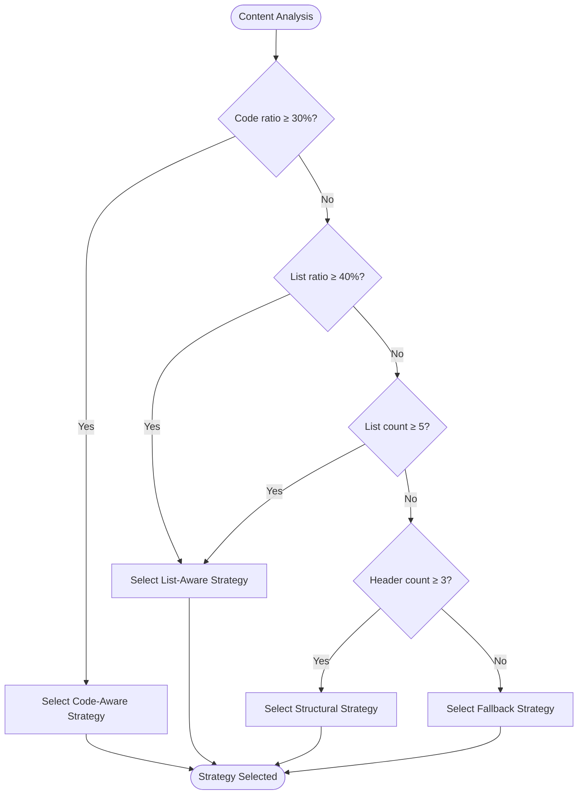
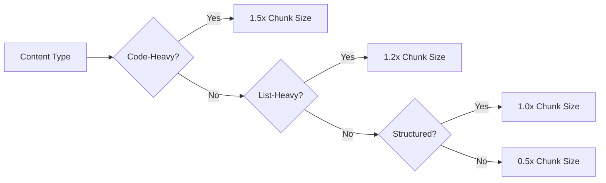

# Adaptive Chunking

<cite>
**Referenced Files in This Document**   
- [strategies.md](file://docs/architecture/strategies.md)
- [architecture_overview.md](file://tests/fixtures/corpus/structured/architecture_overview.md)
- [algorithms.md](file://docs/reference/algorithms.md)
</cite>

## Table of Contents
1. [Introduction](#introduction)
2. [Intelligent Chunking Strategies](#intelligent-chunking-strategies)
3. [Strategy Selection Mechanism](#strategy-selection-mechanism)
4. [Adaptive Chunk Sizing](#adaptive-chunk-sizing)
5. [Implementation Examples](#implementation-examples)
6. [Configuration and Tuning](#configuration-and-tuning)
7. [Performance Characteristics](#performance-characteristics)
8. [Trade-offs and Recommendations](#trade-offs-and-recommendations)

## Introduction

The Adaptive Chunking system in dify-markdown-chunker-1 is an intelligent document processing engine that automatically analyzes content and applies the most appropriate chunking strategy to preserve semantic integrity while optimizing for retrieval performance. The system employs four primary strategies—Code-Aware, List-Aware, Structural, and Fallback—each designed to handle specific document patterns and structures. This document details the automatic strategy selection mechanism, adaptive sizing features, and configuration options that enable optimal chunking across diverse document types.

**Section sources**
- [strategies.md](file://docs/architecture/strategies.md#L1-L529)

## Intelligent Chunking Strategies

The adaptive chunking system implements four intelligent strategies, each optimized for specific content patterns and document structures. These strategies are applied based on content analysis, with priority levels determining selection order.

### Code-Aware Strategy

The Code-Aware strategy is the highest-priority strategy, designed for technical documentation and code-heavy content. It activates when documents contain ≥30% code content, any code blocks, or tables. This strategy preserves code blocks and tables intact, groups related code with surrounding explanatory text, and maintains code-text relationships through enhanced context binding. It also handles nested fencing (quadruple/quintuple backticks) and recognizes patterns like Before/After examples and Code+Output pairs.

**Best for:** Technical documentation, API references with code examples, tutorials with code samples, and data documentation with tables.

**Section sources**
- [strategies.md](file://docs/architecture/strategies.md#L23-L63)

### List-Aware Strategy

The List-Aware strategy activates when documents contain ≥40% list content or at least 5 list items. It preserves list hierarchy intact, ensuring parent items are never separated from their children. The strategy detects and binds introduction context to lists, handles various list types (bullet, numbered, checkbox), and maintains nested list structure through smart grouping with context binding.

**Best for:** Changelogs, release notes, feature lists, task lists, structured outlines, and meeting notes with action items.

**Section sources**
- [strategies.md](file://docs/architecture/strategies.md#L82-L131)

### Structural Strategy

The Structural strategy activates when documents contain at least 3 headers. It chunks content by sections, maintaining hierarchical structure and preserving section relationships. The strategy builds header paths (e.g., "/Chapter 1/Section 1.1") for context preservation and respects header hierarchy levels to maintain document organization.

**Best for:** Long-form documentation, user guides, structured articles, README files, and academic papers.

**Section sources**
- [strategies.md](file://docs/architecture/strategies.md#L148-L191)

### Fallback Strategy

The Fallback strategy serves as the default for simple text without special structure or when other strategies don't apply. It chunks content by paragraphs and sentence boundaries, respecting paragraph integrity while providing simple, reliable text splitting. This strategy handles any content type gracefully and maintains readability through clean breaks at sentence boundaries when possible.

**Best for:** Plain text documents, simple content, unstructured content, and error recovery scenarios.

**Section sources**
- [strategies.md](file://docs/architecture/strategies.md#L207-L240)

## Strategy Selection Mechanism

The adaptive chunking system employs an automatic strategy selection mechanism via the StrategySelector component, which analyzes document characteristics and selects the optimal strategy based on priority levels and content thresholds.

### Content Analysis Process

The StrategySelector performs comprehensive content analysis by calculating multiple metrics:
- **Code ratio**: Percentage of content that is code (threshold: 30%)
- **Code blocks**: Presence and count of fenced code blocks
- **Tables**: Presence of markdown tables
- **List ratio**: Percentage of content that is lists (threshold: 40%)
- **List count**: Number of list items (threshold: 5)
- **Headers**: Number of headers (threshold: 3)
- **Document structure**: Overall structural complexity



**Diagram sources**
- [strategies.md](file://docs/architecture/strategies.md#L280-L307)

### Priority-Based Selection

Strategies are selected based on a priority hierarchy:
1. **Priority 1**: CodeAwareStrategy (if code_ratio ≥ 0.30 OR has_code_blocks OR has_tables)
2. **Priority 2**: ListAwareStrategy (if list_ratio ≥ 0.40 OR list_count ≥ 5)
3. **Priority 3**: StructuralStrategy (if header_count ≥ 3 AND has_hierarchy)
4. **Priority 4**: FallbackStrategy (default for all other cases)

This priority system ensures that complex, structured content receives the most sophisticated processing while simpler content is handled efficiently.

**Section sources**
- [strategies.md](file://docs/architecture/strategies.md#L291-L307)

## Adaptive Chunk Sizing

The adaptive chunking system features dynamic chunk sizing that adjusts based on content type and complexity, optimizing for both information density and retrieval performance.

### Dynamic Size Adjustment

The system automatically adjusts chunk sizes according to content characteristics:
- **1.5x sizing for code-heavy content**: Larger chunks (up to 6144 tokens) preserve complete code examples with context
- **1.0x sizing for structured content**: Standard chunks (4096 tokens) balance section completeness with searchability
- **0.5x sizing for simple text**: Smaller chunks (2048 tokens) enhance precision for plain content

These adjustments are driven by content complexity scoring, which evaluates multiple factors including code density, list nesting depth, and structural hierarchy.

### Configurable Thresholds

The system provides configurable thresholds for adaptive sizing:
- `max_chunk_size`: Maximum size in tokens (default: 4096)
- `min_chunk_size`: Minimum size in tokens (default: 512)
- `code_threshold`: Code ratio threshold for size adjustment (default: 0.3)
- `list_threshold`: List ratio threshold for size adjustment (default: 0.4)

These thresholds can be overridden in configuration to tune the adaptive behavior for specific use cases.



**Diagram sources**
- [strategies.md](file://docs/architecture/strategies.md#L68-L69)
- [strategies.md](file://docs/architecture/strategies.md#L136-L137)

**Section sources**
- [strategies.md](file://docs/architecture/strategies.md#L68-L69)
- [strategies.md](file://docs/architecture/strategies.md#L136-L137)

## Implementation Examples

The adaptive chunking system demonstrates its intelligence through various implementation examples, showing how different document types trigger specific strategies.

### Architecture Documentation Example

The architecture overview document from the test corpus demonstrates the Structural strategy in action. With multiple headers and a clear hierarchical structure, the document is chunked by sections while preserving header paths for context.

```markdown
# Целевая Архитектура: Обзор
## Версионирование
## Цели редизайна
## Ключевые метрики
```

**Chunking Result:**
- Chunk 1: "Целевая Архитектура: Обзор" with introduction
- Chunk 2: "Версионирование" section with content
- Chunk 3: "Цели редизайна" section with content
- Chunk 4: "Ключевые метрики" section with table

The Structural strategy maintains the document's organization while creating search-friendly chunks.

**Section sources**
- [architecture_overview.md](file://tests/fixtures/corpus/structured/architecture_overview.md#L1-L33)

### Code-Heavy Documentation Example

Technical documentation with code examples triggers the Code-Aware strategy, preserving code blocks intact while grouping them with explanatory text.

```markdown
# API Reference
The process function handles data transformation.
```python
def process(data):
    return data.upper()
```
Additional notes about thread safety.
```

**Chunking Result:** Single chunk containing the header, explanation, code block, and notes, ensuring complete context preservation.

**Section sources**
- [strategies.md](file://docs/architecture/strategies.md#L389-L405)

## Configuration and Tuning

The adaptive chunking system provides extensive configuration options for overriding automatic selection and tuning complexity weights to meet specific requirements.

### Strategy Override Options

Users can force specific strategies through configuration:
- `strategy: auto` - Automatic selection (default)
- `strategy: code_aware` - Force code-aware processing
- `strategy: list_aware` - Force list-aware processing
- `strategy: structural` - Force structural processing
- `strategy: fallback` - Force fallback processing

```yaml
config:
  strategy: code_aware
  max_chunk_size: 6144
```

### Complexity Weight Tuning

Advanced configuration allows tuning of complexity thresholds:
- `code_threshold`: Adjust code ratio threshold (default: 0.3)
- `list_ratio_threshold`: Adjust list ratio threshold (default: 0.4)
- `list_count_threshold`: Adjust minimum list count (default: 5)
- `structure_threshold`: Adjust minimum header count (default: 3)

```python
config = ChunkConfig(
    strategy_override="list_aware",
    list_ratio_threshold=0.35,
    list_count_threshold=3,
    max_chunk_size=3072
)
```

**Section sources**
- [strategies.md](file://docs/architecture/strategies.md#L349-L359)
- [strategies.md](file://docs/architecture/strategies.md#L431-L437)

## Performance Characteristics

The adaptive chunking system exhibits distinct performance characteristics for each strategy, balancing speed, quality, and resource usage.

| Strategy | Speed | Quality | Memory | Best For |
|----------|-------|---------|--------|----------|
| Code-Aware | Fast | Very High | Medium | Code/table-heavy docs |
| List-Aware | Fast | Very High | Low | List-heavy docs, changelogs |
| Structural | Medium | Very High | Medium | Structured docs |
| Fallback | Very Fast | Medium | Very Low | Simple text |
| Auto | Medium | Very High | Medium | General purpose |

The Auto strategy provides the best balance of quality and reliability, automatically selecting the optimal approach based on content analysis.

**Section sources**
- [strategies.md](file://docs/architecture/strategies.md#L338-L347)

## Trade-offs and Recommendations

Each chunking strategy presents specific trade-offs between quality, performance, and complexity that should inform selection and configuration decisions.

### Quality vs. Performance Trade-offs

**Code-Aware Strategy:**
- *Quality benefits*: Preserves code-context relationships, maintains code integrity
- *Performance costs*: Higher memory usage, moderate processing speed
- *Recommendation*: Use for technical documentation where code context is critical

**List-Aware Strategy:**
- *Quality benefits*: Maintains list hierarchy, preserves parent-child relationships
- *Performance costs*: Moderate processing overhead for hierarchy analysis
- *Recommendation*: Ideal for changelogs and feature lists

**Structural Strategy:**
- *Quality benefits*: Preserves document organization, maintains section integrity
- *Performance costs*: Requires full document parsing for header analysis
- *Recommendation*: Best for long-form documentation and user guides

**Fallback Strategy:**
- *Quality benefits*: Simple, reliable processing for any content
- *Performance costs*: Lower quality for structured content
- *Recommendation*: Use for simple text or as a fail-safe mechanism

The automatic strategy selection system generally provides the optimal balance, but specific use cases may benefit from manual strategy selection and threshold tuning.

**Section sources**
- [strategies.md](file://docs/architecture/strategies.md#L338-L347)
- [strategies.md](file://docs/architecture/strategies.md#L410-L415)