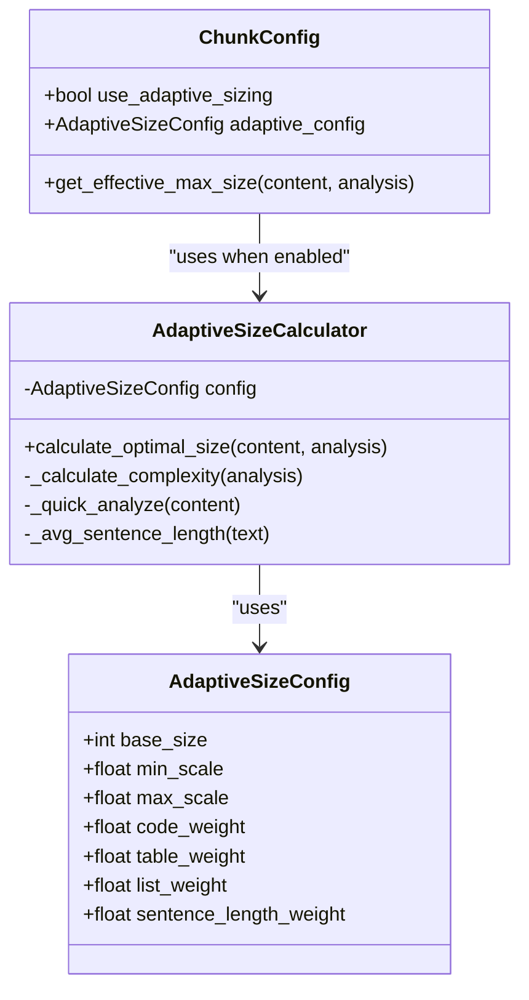
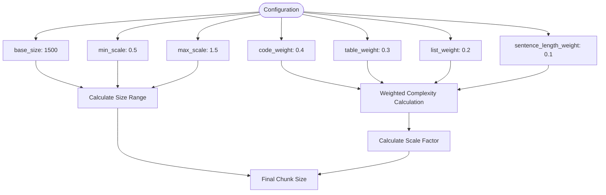
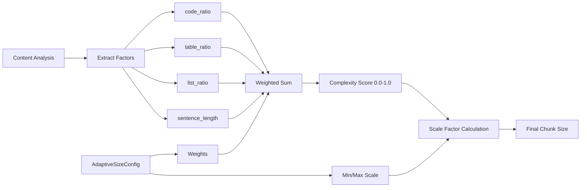
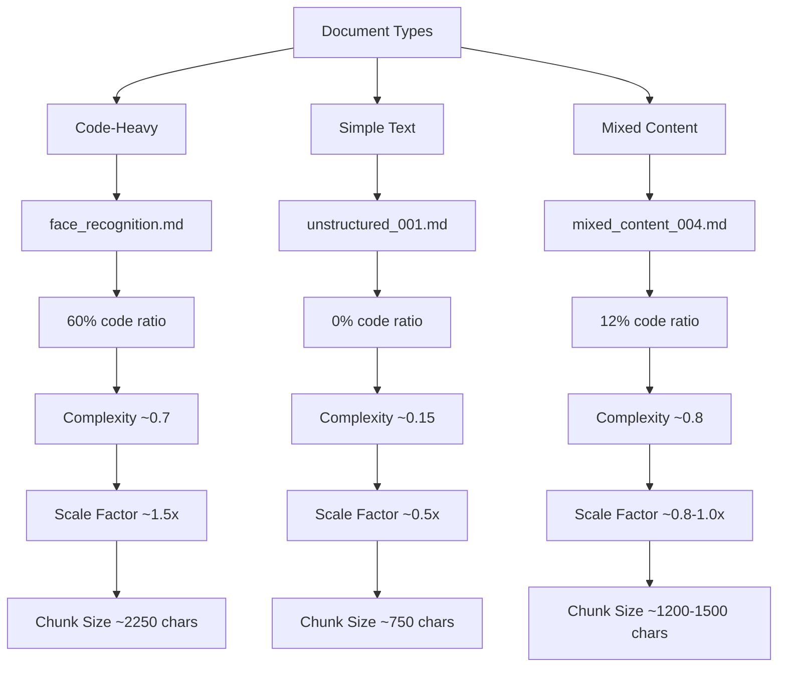

# Adaptive Sizing

<cite>
**Referenced Files in This Document**   
- [09-adaptive-chunk-sizing.md](file://docs/research/features/09-adaptive-chunk-sizing.md)
- [adaptive_sizing.md](file://tests/baseline_data/fixtures/adaptive_sizing.md)
- [face_recognition.md](file://tests/corpus/github_readmes/python/face_recognition.md)
- [unstructured_001.md](file://tests/corpus/personal_notes/unstructured/unstructured_001.md)
- [config.md](file://docs/api/config.md)
- [adaptive-sizing-migration.md](file://docs/guides/adaptive-sizing-migration.md)
- [types.md](file://docs/api/types.md)
</cite>

## Table of Contents
1. [Introduction](#introduction)
2. [Core Components](#core-components)
3. [AdaptiveSizeConfig Configuration](#adaptivesizeconfig-configuration)
4. [Complexity Scoring System](#complexity-scoring-system)
5. [Implementation Examples](#implementation-examples)
6. [Performance and Impact](#performance-and-impact)
7. [Configuration Tuning](#configuration-tuning)
8. [Conclusion](#conclusion)

## Introduction

The Adaptive Sizing feature in dify-markdown-chunker-1 dynamically adjusts chunk sizes based on content complexity analysis. This intelligent sizing mechanism analyzes document characteristics such as code ratio, table ratio, list ratio, and sentence length to determine optimal chunk sizes for different content types. By using weighted factors to calculate complexity scores between 0.0 and 1.0, the system scales the base chunk size within configurable minimum and maximum bounds (default 0.5x to 1.5x). This approach ensures that code-heavy documents receive larger chunks to preserve context while simple text receives smaller chunks for better retrieval precision.

**Section sources**
- [09-adaptive-chunk-sizing.md](file://docs/research/features/09-adaptive-chunk-sizing.md#L1-L390)

## Core Components

The adaptive chunk sizing system consists of two primary components: the AdaptiveSizeConfig class that defines configuration parameters and the AdaptiveSizeCalculator class that performs the actual size calculation. The system integrates with the main chunking process through the ChunkConfig class, which enables adaptive sizing as an optional feature. When enabled, the chunker analyzes content characteristics and adjusts chunk sizes accordingly, with the calculated size becoming the effective maximum chunk size for that particular content segment.

The implementation uses a weighted scoring system where different content features contribute to an overall complexity score. This score is then used to scale the base chunk size within the configured minimum and maximum bounds. The system is designed to be optional and backward compatible, allowing users to enable adaptive sizing without breaking existing configurations.

**Diagram sources**
- [09-adaptive-chunk-sizing.md](file://docs/research/features/09-adaptive-chunk-sizing.md#L44-L169)

**Section sources**
- [09-adaptive-chunk-sizing.md](file://docs/research/features/09-adaptive-chunk-sizing.md#L44-L214)

## AdaptiveSizeConfig Configuration

The AdaptiveSizeConfig class provides comprehensive control over the adaptive sizing behavior through several configurable parameters. The base_size parameter establishes the foundation for all size calculations, defaulting to 1500 characters. The min_scale and max_scale parameters define the range within which the base size can be adjusted, with defaults of 0.5 and 1.5 respectively, creating a range from 750 to 2250 characters for the default base size.

The configuration includes four weighted factors that influence the complexity calculation: code_weight (default 0.4), table_weight (default 0.3), list_weight (default 0.2), and sentence_length_weight (default 0.1). These weights determine the relative importance of each content characteristic in the overall complexity score. Users can customize these weights based on their specific content types and requirements, such as increasing the code_weight for technical documentation repositories.

**Diagram sources**
- [09-adaptive-chunk-sizing.md](file://docs/research/features/09-adaptive-chunk-sizing.md#L48-L60)
- [adaptive-sizing-migration.md](file://docs/guides/adaptive-sizing-migration.md#L73-L80)

**Section sources**
- [09-adaptive-chunk-sizing.md](file://docs/research/features/09-adaptive-chunk-sizing.md#L48-L60)
- [adaptive-sizing-migration.md](file://docs/guides/adaptive-sizing-migration.md#L68-L164)

## Complexity Scoring System

The complexity scoring system analyzes four key content characteristics to determine the optimal chunk size. The code_ratio measures the proportion of content within code blocks, with higher ratios indicating code-heavy documents that benefit from larger chunks to preserve context. The table_ratio assesses the amount of tabular data, which often requires larger chunks to keep tables intact. The list_ratio evaluates the presence of list structures, which may need larger chunks to maintain list coherence. The sentence_length factor considers the average sentence length, with longer sentences suggesting more complex text that may require larger context windows.

These factors are combined using weighted summation, where each factor is multiplied by its corresponding weight from the AdaptiveSizeConfig. The resulting complexity score ranges from 0.0 to 1.0, with higher scores indicating more complex content that warrants larger chunks. This score is then used to calculate a scale factor that adjusts the base chunk size within the configured minimum and maximum bounds. The system ensures that even with extreme content characteristics, chunk sizes remain within the specified limits.

**Diagram sources**
- [09-adaptive-chunk-sizing.md](file://docs/research/features/09-adaptive-chunk-sizing.md#L105-L127)
- [types.md](file://docs/api/types.md#L316-L323)

**Section sources**
- [09-adaptive-chunk-sizing.md](file://docs/research/features/09-adaptive-chunk-sizing.md#L96-L127)
- [types.md](file://docs/api/types.md#L316-L323)

## Implementation Examples

The adaptive sizing system demonstrates significant differences in chunk size based on content type. For code-heavy documents like face_recognition.md with approximately 60% code ratio, the system calculates a complexity score around 0.7, resulting in a scale factor near 1.5x the base size. This produces chunks of approximately 2250 characters (1500 × 1.5), providing sufficient context for code comprehension and retrieval.

In contrast, simple text documents like unstructured_001.md with 0% code ratio receive much smaller chunks. With minimal code, table, and list content, the complexity score remains low (around 0.15), resulting in a scale factor near 0.5x the base size. This produces chunks of approximately 750 characters (1500 × 0.5), optimizing retrieval precision for straightforward text content.

Mixed content documents receive intermediate chunk sizes based on their specific characteristics. The system evaluates the balance of code, tables, lists, and text to determine an appropriate complexity score and corresponding chunk size. This adaptive approach ensures that each document receives chunking optimized for its specific content composition.

**Diagram sources**
- [09-adaptive-chunk-sizing.md](file://docs/research/features/09-adaptive-chunk-sizing.md#L366-L389)
- [face_recognition.md](file://tests/corpus/github_readmes/python/face_recognition.md)
- [unstructured_001.md](file://tests/corpus/personal_notes/unstructured/unstructured_001.md)

**Section sources**
- [09-adaptive-chunk-sizing.md](file://docs/research/features/09-adaptive-chunk-sizing.md#L220-L260)
- [face_recognition.md](file://tests/corpus/github_readmes/python/face_recognition.md)
- [unstructured_001.md](file://tests/corpus/personal_notes/unstructured/unstructured_001.md)

## Performance and Impact

The adaptive sizing feature has minimal performance impact on the chunking process. The size calculation overhead is less than 0.1% of total processing time, making it negligible in practical applications. Similarly, the chunking time impact is less than 0.1%, ensuring that the adaptive sizing does not significantly affect overall processing speed.

The primary impact is increased memory usage due to additional metadata fields. The system adds three metadata fields per chunk: adaptive_size, content_complexity, and size_scale_factor, resulting in approximately 17.4% memory overhead. This additional metadata provides valuable information for downstream processes and debugging, helping to understand why specific chunk sizes were selected for different content segments.

The performance characteristics make adaptive sizing suitable for production environments, where the benefits of improved retrieval precision and chunk quality outweigh the minimal computational costs. The system is designed to be efficient, using quick analysis methods that don't require full document parsing to determine content characteristics.

**Section sources**
- [config.md](file://docs/api/config.md#L160-L165)
- [adaptive-sizing-migration.md](file://docs/guides/adaptive-sizing-migration.md#L61-L65)

## Configuration Tuning

Effective configuration tuning for adaptive sizing involves adjusting parameters based on specific use cases and content characteristics. For code-heavy documentation, users can increase the base_size to 2000-2500 characters and raise the code_weight to 0.5-0.6 to prioritize code context preservation. The scale range can be narrowed (e.g., min_scale=0.7, max_scale=1.8) for more predictable sizing in specialized repositories.

For general documentation with mixed content, the default configuration (base_size=1500, min_scale=0.5, max_scale=1.5) typically works well. Users can fine-tune the weights based on their content composition—for example, increasing table_weight for documentation heavy in tabular data or adjusting sentence_length_weight for technical writing with complex sentence structures.

The system also supports configuration profiles through factory methods like ChunkConfig.for_code_heavy() and ChunkConfig.for_structured(), providing quick setup options for common scenarios. These profiles can be further customized by enabling adaptive sizing and adjusting specific parameters as needed.

**Section sources**
- [adaptive-sizing-migration.md](file://docs/guides/adaptive-sizing-migration.md#L124-L164)
- [config.md](file://docs/api/config.md#L155-L158)

## Conclusion

The adaptive chunk sizing feature in dify-markdown-chunker-1 significantly improves retrieval precision and chunk quality across diverse content types. By analyzing content characteristics such as code ratio, table ratio, list ratio, and sentence length, the system intelligently adjusts chunk sizes to match the needs of different document types. Code-heavy documents receive larger chunks (up to 1.5x the base size) to preserve essential context, while simple text receives smaller chunks (down to 0.5x the base size) for optimal retrieval precision.

The configurable nature of the system allows users to tailor the behavior to their specific requirements through the AdaptiveSizeConfig class. With minimal performance impact and backward compatibility, adaptive sizing can be seamlessly integrated into existing workflows. The feature represents a significant advancement in intelligent document chunking, moving beyond fixed-size approaches to provide context-aware segmentation that enhances the effectiveness of retrieval-augmented generation systems.

**Section sources**
- [09-adaptive-chunk-sizing.md](file://docs/research/features/09-adaptive-chunk-sizing.md#L294-L301)
- [adaptive-sizing-migration.md](file://docs/guides/adaptive-sizing-migration.md#L585-L587)