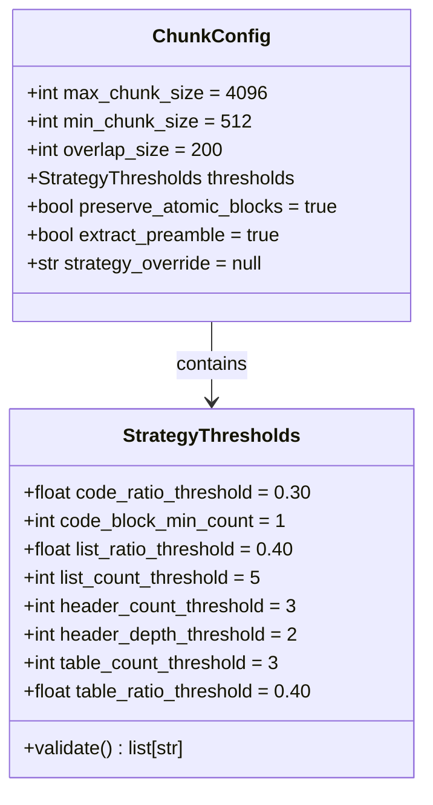
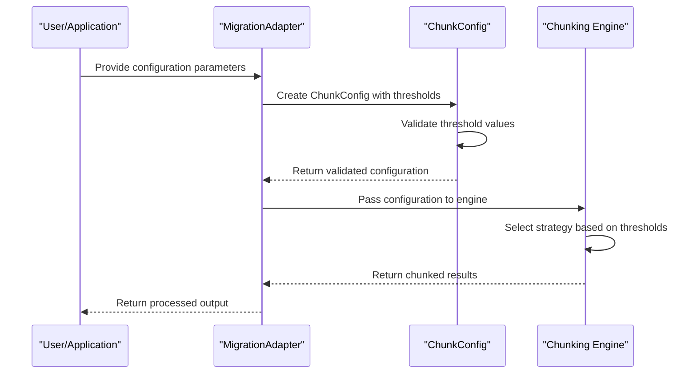

# Configurable Thresholds

<cite>
**Referenced Files in This Document**   
- [config_defaults_snapshot.json](file://tests/config_defaults_snapshot.json)
- [adapter.py](file://adapter.py)
- [markdown_chunk_tool.yaml](file://tools/markdown_chunk_tool.yaml)
- [docs/research/features/13-configurable-strategy-thresholds.md](file://docs/research/features/13-configurable-strategy-thresholds.md)
</cite>

## Table of Contents
1. [Introduction](#introduction)
2. [Core Threshold Parameters](#core-threshold-parameters)
3. [Threshold Configuration and Implementation](#threshold-configuration-and-implementation)
4. [Practical Use Cases and Examples](#practical-use-cases-and-examples)
5. [Trade-offs and Performance Considerations](#trade-offs-and-performance-considerations)
6. [Configuration Interface and Code Examples](#configuration-interface-and-code-examples)

## Introduction
The dify-markdown-chunker-1 provides configurable strategy thresholds that allow users to fine-tune the sensitivity of automatic strategy selection. These thresholds determine when specific chunking strategies are activated based on document characteristics such as code density, list structure, and hierarchical organization. By adjusting these parameters, users can optimize the chunking process for different document types and use cases, ensuring better performance and quality in Retrieval-Augmented Generation (RAG) systems.

**Section sources**
- [docs/research/features/13-configurable-strategy-thresholds.md](file://docs/research/features/13-configurable-strategy-thresholds.md)

## Core Threshold Parameters
The chunking engine utilizes several key threshold parameters to determine the appropriate strategy for processing Markdown documents. These parameters control the activation sensitivity of different chunking strategies:

- **code_threshold**: The default value is 30%, representing the minimum code-to-text ratio required to activate the code-aware strategy. Lowering this threshold makes the system more sensitive to code content, potentially activating the code-aware strategy earlier.

- **list_ratio_threshold**: Set to a default of 40%, this threshold determines the minimum proportion of list items in the document required to trigger the list-aware strategy. Reducing this value allows the list-aware strategy to activate with fewer list elements.

- **list_count_threshold**: With a default of 5, this parameter specifies the minimum number of list items needed to engage the list-aware strategy. Decreasing this threshold enables the strategy to activate with smaller lists.

- **structure_threshold**: The default value of 3 represents the minimum number of headers required to initiate the structural strategy. Lowering this threshold allows the structural strategy to activate with fewer headers, making it suitable for shorter documents.

These thresholds work together to ensure that the most appropriate chunking strategy is selected based on the document's content characteristics.

**Section sources**
- [config_defaults_snapshot.json](file://tests/config_defaults_snapshot.json)
- [docs/research/features/13-configurable-strategy-thresholds.md](file://docs/research/features/13-configurable-strategy-thresholds.md)

## Threshold Configuration and Implementation
The threshold configuration is implemented through the `ChunkConfig` class, which contains a nested `StrategyThresholds` dataclass. This structure allows for comprehensive control over the chunking behavior. The configuration system is designed to maintain backward compatibility while providing flexibility for advanced use cases.

The thresholds are validated to ensure they remain within appropriate ranges:
- Ratio-based thresholds (code_threshold, list_ratio_threshold) must be between 0 and 1
- Count-based thresholds (list_count_threshold, structure_threshold) must be positive integers

The configuration is loaded from a snapshot file (`config_defaults_snapshot.json`) that preserves the default values used in the system. This approach ensures consistency across different deployments while allowing users to override specific parameters as needed.

**Diagram sources**
- [config_defaults_snapshot.json](file://tests/config_defaults_snapshot.json)
- [docs/research/features/13-configurable-strategy-thresholds.md](file://docs/research/features/13-configurable-strategy-thresholds.md)

**Section sources**
- [config_defaults_snapshot.json](file://tests/config_defaults_snapshot.json)
- [docs/research/features/13-configurable-strategy-thresholds.md](file://docs/research/features/13-configurable-strategy-thresholds.md)

## Practical Use Cases and Examples
The configurable thresholds provide significant flexibility for optimizing the chunking process across different document types and use cases. Here are several practical examples demonstrating how threshold tuning can improve performance:

### Changelog Processing
For changelog documents, which typically contain numerous list items but relatively few headers, reducing the `list_ratio_threshold` from the default 40% to 30% ensures that the list-aware strategy activates appropriately. This adjustment allows the system to better preserve the hierarchical structure of version entries and changes.

### Shorter Documents
When processing shorter documents with limited structural elements, lowering the `structure_threshold` from 3 to 2 headers enables the structural strategy to activate even with minimal heading content. This adjustment is particularly useful for technical notes, meeting minutes, or brief documentation where maintaining section boundaries is important despite the document's brevity.

### Code-Heavy Documentation
For API documentation or technical guides with substantial code examples, adjusting the `code_threshold` can optimize strategy selection. Reducing this threshold makes the system more sensitive to code content, ensuring that the code-aware strategy activates appropriately even when code blocks are interspersed with explanatory text.

These examples demonstrate how threshold tuning can be used to optimize the chunking process for specific document types, improving both the quality of the output and the performance of downstream RAG applications.

**Section sources**
- [docs/research/features/13-configurable-strategy-thresholds.md](file://docs/research/features/13-configurable-strategy-thresholds.md)
- [tests/corpus/changelogs/changelogs_043.md](file://tests/corpus/changelogs/changelogs_043.md)

## Trade-offs and Performance Considerations
While configurable thresholds provide significant flexibility, there are important trade-offs to consider when adjusting these parameters. Aggressive strategy activation, achieved by lowering thresholds, can lead to increased processing overhead and potentially suboptimal chunking results in certain scenarios.

Lowering thresholds too aggressively may cause strategies to activate inappropriately, leading to:
- Unnecessary computational overhead from complex strategy algorithms
- Suboptimal chunk boundaries that don't align with semantic content
- Increased memory usage during processing
- Longer processing times for large documents

Conversely, setting thresholds too high may result in missed opportunities for optimal strategy selection, potentially leading to:
- Poor preservation of document structure
- Inadequate handling of specific content types (code, lists, tables)
- Reduced effectiveness in downstream RAG applications

The key is to find a balance that optimizes performance for the specific document types being processed while maintaining overall system efficiency. Users should consider the typical characteristics of their documents and adjust thresholds accordingly, testing different configurations to find the optimal settings for their use case.

**Section sources**
- [docs/research/features/13-configurable-strategy-thresholds.md](file://docs/research/features/13-configurable-strategy-thresholds.md)

## Configuration Interface and Code Examples
The threshold parameters are exposed through the configuration interface in `provider/markdown_chunker.py`, allowing users to customize the chunking behavior programmatically. The configuration system supports both direct parameter setting and YAML-based configuration for flexibility.

The `adapter.py` file demonstrates how these thresholds are integrated into the chunking pipeline, with the `MigrationAdapter` class handling the mapping between user configuration and the underlying chunking engine. This adapter pattern ensures backward compatibility while enabling advanced configuration options.

**Diagram sources**
- [adapter.py](file://adapter.py)
- [provider/markdown_chunker.py](file://provider/markdown_chunker.py)

**Section sources**
- [adapter.py](file://adapter.py)
- [provider/markdown_chunker.py](file://provider/markdown_chunker.py)
- [tools/markdown_chunk_tool.yaml](file://tools/markdown_chunk_tool.yaml)