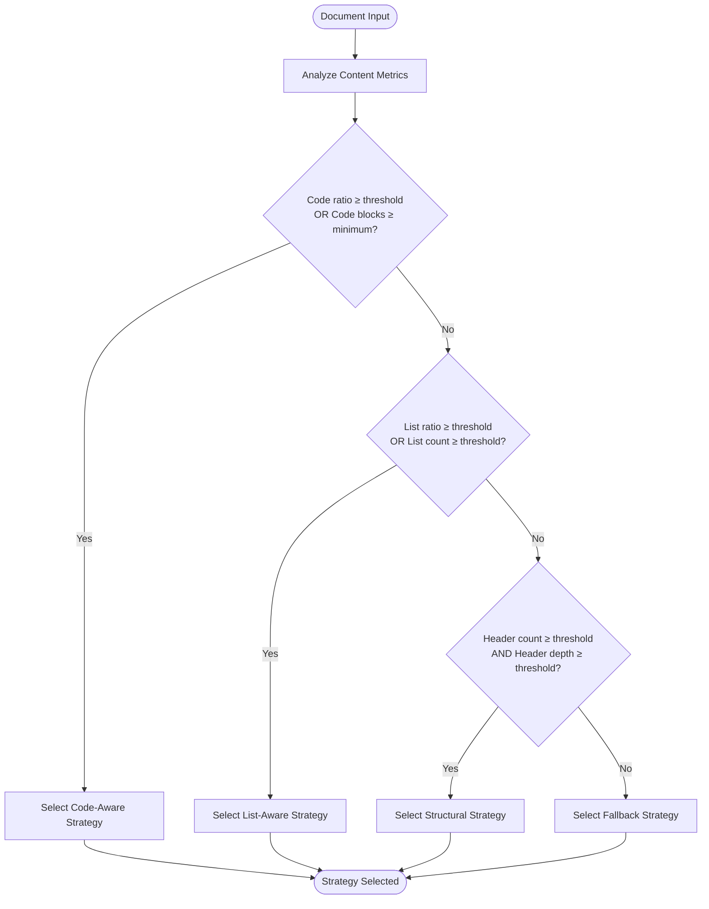
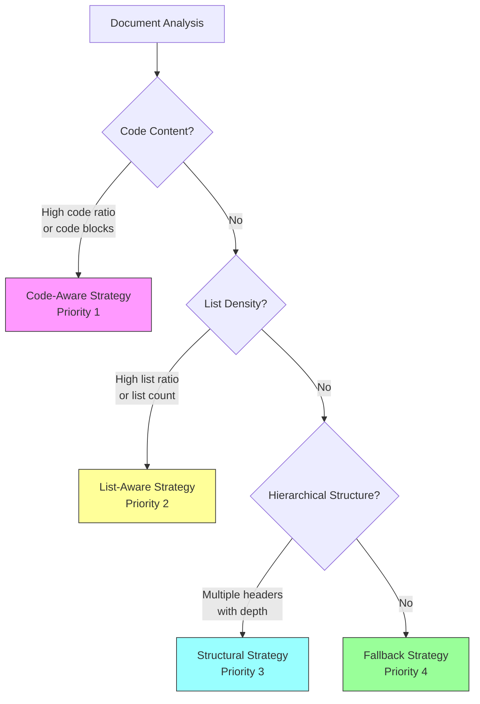
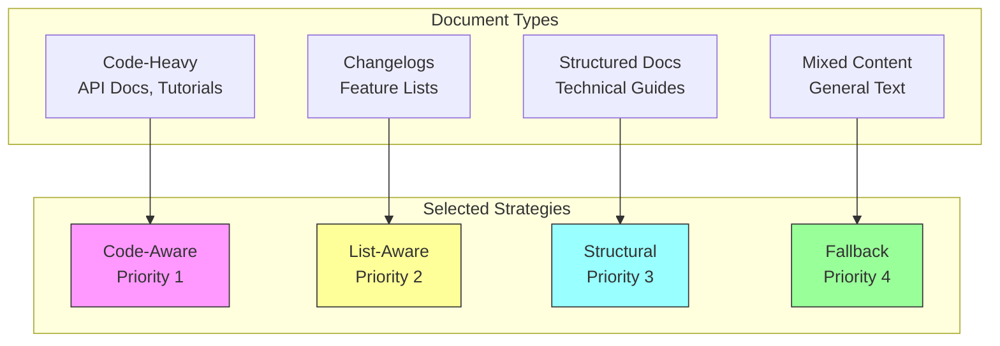

# Strategy Selection

<cite>
**Referenced Files in This Document**   
- [adapter.py](file://adapter.py#L101-L108)
- [docs/research/features/13-configurable-strategy-thresholds.md](file://docs/research/features/13-configurable-strategy-thresholds.md#L115-L163)
- [docs/reference/algorithms-ru.md](file://docs/reference/algorithms-ru.md#L111-L114)
- [docs/research/06_advanced_features.md](file://docs/research/06_advanced_features.md#L670-L671)
- [tests/fixtures/code_heavy.md](file://tests/fixtures/code_heavy.md)
- [tests/fixtures/structural.md](file://tests/fixtures/structural.md)
- [tests/fixtures/list_heavy.md](file://tests/fixtures/list_heavy.md)
- [tests/golden_before_migration/snapshot_index.json](file://tests/golden_before_migration/snapshot_index.json#L1741-L1774)
- [README.md](file://README.md#L850-L851)
</cite>

## Table of Contents
1. [Introduction](#introduction)
2. [Strategy Selection Algorithm](#strategy-selection-algorithm)
3. [Priority-Based Decision Tree](#priority-based-decision-tree)
4. [StrategySelector Class Behavior](#strategyselector-class-behavior)
5. [Content Analysis Metrics](#content-analysis-metrics)
6. [Document Type Examples](#document-type-examples)
7. [Configuration and Overrides](#configuration-and-overrides)
8. [Performance Implications](#performance-implications)
9. [Quality Trade-offs](#quality-trade-offs)

## Introduction

The strategy selection mechanism in dify-markdown-chunker-1 is a sophisticated system designed to automatically determine the optimal chunking strategy based on document content characteristics. This intelligent selection process analyzes various metrics such as code ratio, list density, header count, and table presence to ensure that each document is processed with the most appropriate strategy. The system follows a priority-based algorithm that evaluates content features and selects from four distinct strategies: Code-Aware, List-Aware, Structural, and Fallback. This approach maximizes chunking quality by preserving semantic boundaries and maintaining document structure integrity.

**Section sources**
- [docs/reference/algorithms-ru.md](file://docs/reference/algorithms-ru.md#L88-L161)

## Strategy Selection Algorithm

The strategy selection algorithm in dify-markdown-chunker-1 follows a systematic approach to evaluate document characteristics and determine the optimal chunking strategy. The process begins with content analysis, where the system computes various metrics including code ratio, list ratio, header count, and table presence. These metrics are then evaluated against configurable thresholds to determine strategy suitability. The algorithm implements a priority-based decision tree, where higher-priority strategies are evaluated first, and selection proceeds to lower-priority strategies only if higher-priority conditions are not met.

The algorithm supports two modes of operation: strict priority mode and weighted scoring mode. In strict mode, the first strategy whose conditions are satisfied is selected, following the predefined priority order. In weighted mode, strategies receive quality scores based on how well they match the document characteristics, and a weighted score combining priority and quality determines the final selection. This flexible approach allows users to balance between deterministic behavior and optimal strategy matching.

**Diagram sources**
- [docs/research/features/13-configurable-strategy-thresholds.md](file://docs/research/features/13-configurable-strategy-thresholds.md#L125-L141)

**Section sources**
- [docs/reference/algorithms-ru.md](file://docs/reference/algorithms-ru.md#L2926-L2965)
- [docs/research/features/13-configurable-strategy-thresholds.md](file://docs/research/features/13-configurable-strategy-thresholds.md#L125-L141)

## Priority-Based Decision Tree

The strategy selection mechanism employs a priority-based decision tree with four distinct strategies arranged in descending order of priority. The highest priority strategy is Code-Aware (priority 1), which is selected for documents with significant code content or tables. This is followed by List-Aware (priority 2) for documents with dense list structures, Structural (priority 3) for multi-header documents with clear hierarchical organization, and Fallback (priority 4) as the default strategy for general content.

The decision tree evaluates strategies in strict priority order, ensuring that documents with specialized content receive the most appropriate processing. Code-Aware strategy is triggered when either the code ratio exceeds the configured threshold or when the document contains at least one code block. List-Aware strategy activates when list density or count surpasses its thresholds, making it ideal for changelogs and feature lists. Structural strategy requires both sufficient header count and depth, ensuring it only processes genuinely hierarchical documents. The Fallback strategy serves as the default option when none of the specialized conditions are met.

This priority hierarchy reflects the principle that specialized content patterns should take precedence over general structural patterns, as preserving code context, list integrity, and hierarchical relationships is more critical than general text segmentation.

**Diagram sources**
- [docs/research/06_advanced_features.md](file://docs/research/06_advanced_features.md#L670-L671)
- [docs/reference/algorithms-ru.md](file://docs/reference/algorithms-ru.md#L367-L368)

**Section sources**
- [docs/research/features/13-configurable-strategy-thresholds.md](file://docs/research/features/13-configurable-strategy-thresholds.md#L129-L141)
- [docs/reference/algorithms-ru.md](file://docs/reference/algorithms-ru.md#L367-L368)

## StrategySelector Class Behavior

The StrategySelector class is the core component responsible for implementing the strategy selection logic in dify-markdown-chunker-1. This class evaluates content analysis results against configurable thresholds to determine the optimal chunking strategy. The selector follows a sequential evaluation process, checking conditions for each strategy in priority order and returning the first strategy whose conditions are satisfied.

The class interface provides a clean separation between strategy evaluation and configuration management. It accepts a ChunkConfig object during initialization, which contains all threshold values and selection parameters. The primary method, select(), takes a ContentAnalysis object as input and returns the appropriate strategy instance. The selector implements short-circuit evaluation, meaning it stops checking lower-priority strategies as soon as a suitable strategy is found, improving performance.

The StrategySelector also supports different selection modes through configuration. In strict mode, selection is based purely on priority order. In weighted mode, the selector calculates a composite score that combines strategy priority with quality metrics, allowing for more nuanced selection when multiple strategies could be appropriate. This flexibility enables users to balance between deterministic behavior and optimal strategy matching based on their specific use cases.

**Section sources**
- [docs/research/features/13-configurable-strategy-thresholds.md](file://docs/research/features/13-configurable-strategy-thresholds.md#L115-L163)
- [adapter.py](file://adapter.py#L101-L108)

## Content Analysis Metrics

The strategy selection mechanism relies on several key content analysis metrics to evaluate document characteristics and determine the appropriate chunking strategy. These metrics include code_ratio (percentage of document content that is code), code_block_count (number of code blocks), list_ratio (percentage of content in lists), list_count (number of list items), header_count (number of headings), and header_depth (maximum nesting level of headings).

These metrics are computed during the content analysis phase and serve as the foundation for strategy selection decisions. The code_ratio and code_block_count metrics trigger the Code-Aware strategy when they exceed their respective thresholds, ensuring that code-heavy documents receive specialized processing that preserves code context and boundaries. Similarly, list_ratio and list_count metrics activate the List-Aware strategy for documents with dense list structures, such as changelogs or feature lists.

The header_count and header_depth metrics work together to identify genuinely hierarchical documents that benefit from the Structural strategy. This dual requirement prevents the strategy from being triggered by documents with many shallow headers, ensuring it only processes documents with meaningful hierarchical organization. All metrics are configurable through the ChunkConfig object, allowing users to fine-tune the selection behavior for their specific document types and use cases.

**Section sources**
- [docs/research/features/13-configurable-strategy-thresholds.md](file://docs/research/features/13-configurable-strategy-thresholds.md#L143-L162)
- [docs/reference/algorithms-ru.md](file://docs/reference/algorithms-ru.md#L356-L363)

## Document Type Examples

The strategy selection mechanism demonstrates its effectiveness through various document types in the test corpus. For code-heavy documents like API documentation or technical tutorials, the Code-Aware strategy is automatically selected due to high code_ratio values or the presence of multiple code blocks. For example, the test fixture "code_heavy.md" contains several code examples in Python, JavaScript, and SQL, triggering the Code-Aware strategy to preserve code context and boundaries.

Changelogs and feature lists activate the List-Aware strategy through high list_ratio and list_count metrics. Documents like "changelogs_003.md" with extensive bullet-point lists of changes are processed with list-aware logic that maintains list item integrity and grouping. Structured technical documentation with multiple sections and subsections, such as "structural.md" with its hierarchical heading structure, triggers the Structural strategy when both header_count and header_depth exceed their thresholds.

Mixed-content documents without dominant patterns default to the Fallback strategy, which applies general-purpose chunking rules. The test corpus includes various edge cases, such as documents with tables, nested lists, and mixed formatting, allowing comprehensive validation of the selection logic across diverse document types.

**Diagram sources**
- [tests/fixtures/code_heavy.md](file://tests/fixtures/code_heavy.md)
- [tests/fixtures/structural.md](file://tests/fixtures/structural.md)
- [tests/fixtures/list_heavy.md](file://tests/fixtures/list_heavy.md)

**Section sources**
- [tests/golden_before_migration/snapshot_index.json](file://tests/golden_before_migration/snapshot_index.json#L1741-L1774)
- [tests/corpus/changelogs/changelogs_003.md](file://tests/corpus/changelogs/changelogs_003.md)

## Configuration and Overrides

The strategy selection mechanism provides both automatic selection and manual override capabilities through configuration options. By default, the system uses automatic selection (strategy="auto") where the StrategySelector evaluates content metrics and chooses the optimal strategy based on the priority decision tree. However, users can override this automatic selection using the strategy_override parameter in the configuration.

The strategy_override parameter accepts specific strategy names such as "code_aware", "list_aware", "structural", or "fallback", forcing the system to use the specified strategy regardless of content characteristics. This override capability is particularly useful for batch processing of homogeneous document collections or when users have specific requirements that differ from the automatic selection logic.

Configuration also includes threshold values for each strategy's activation conditions, allowing fine-tuning of the selection behavior. Users can adjust code_ratio_threshold, list_ratio_threshold, header_count_threshold, and other parameters to customize how aggressively each strategy is triggered. These configuration options provide flexibility for different use cases while maintaining the robustness of the automatic selection system.

**Section sources**
- [README.md](file://README.md#L850-L851)
- [adapter.py](file://adapter.py#L101-L108)

## Performance Implications

The strategy selection mechanism has several performance implications that affect processing speed and resource utilization. The content analysis phase, which computes all metrics used for selection, represents a fixed overhead for every document regardless of size. This analysis is generally efficient, using single-pass algorithms to extract structural elements and compute ratios.

The priority-based decision tree ensures that strategy selection is typically fast, as it employs short-circuit evaluation and usually determines the appropriate strategy after checking only the first one or two conditions. For most documents, the system quickly identifies whether code content is present and either selects the Code-Aware strategy or proceeds to evaluate other conditions.

Memory usage is optimized by computing metrics incrementally during parsing rather than storing multiple document representations. The selection process itself has minimal memory footprint, as it only needs to maintain the computed metrics and configuration values. Overall, the performance impact of strategy selection is negligible compared to the chunking process itself, making it a cost-effective approach to improving chunking quality.

**Section sources**
- [docs/reference/algorithms-ru.md](file://docs/reference/algorithms-ru.md#L102-L107)
- [docs/research/06_advanced_features.md](file://docs/research/06_advanced_features.md#L638-L640)

## Quality Trade-offs

The strategy selection mechanism involves several quality trade-offs that balance preservation of document structure against chunking efficiency. The priority hierarchy favors specialized strategies over general ones, which improves quality for documents with clear content patterns but may lead to suboptimal selection for mixed-content documents that don't strongly favor any single strategy.

The Code-Aware strategy prioritizes preserving code context and boundaries, which may result in larger chunks than necessary for non-code content. Conversely, the List-Aware strategy focuses on maintaining list integrity, potentially creating smaller chunks than optimal for surrounding text. The Structural strategy emphasizes hierarchical relationships, which can lead to chunk boundaries that don't align perfectly with semantic boundaries in flat sections of the document.

The Fallback strategy represents a compromise between these specialized approaches, applying general rules that work reasonably well across various content types but may not optimize for any specific pattern. The weighted selection mode attempts to address these trade-offs by considering both priority and quality metrics, but introduces additional complexity and may produce less predictable results than the strict priority mode.

These trade-offs reflect the fundamental challenge of adaptive chunking: balancing the benefits of specialized processing against the risks of overfitting to specific content patterns. The configurable thresholds and override options provide users with tools to navigate these trade-offs based on their specific quality requirements and document characteristics.

**Section sources**
- [docs/research/06_advanced_features.md](file://docs/research/06_advanced_features.md#L644-L655)
- [docs/reference/algorithms-ru.md](file://docs/reference/algorithms-ru.md#L2967-L2969)