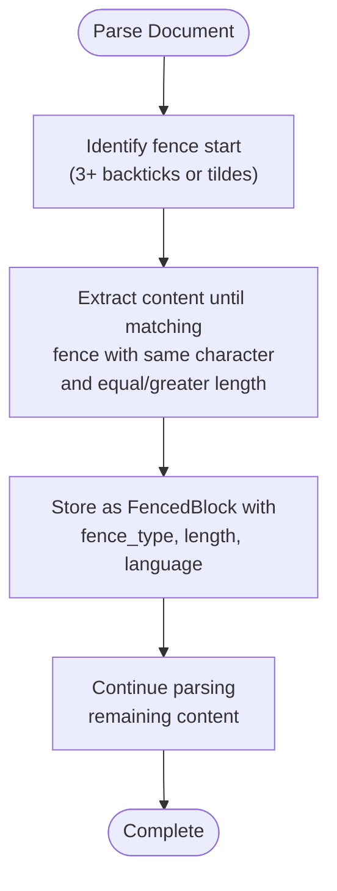
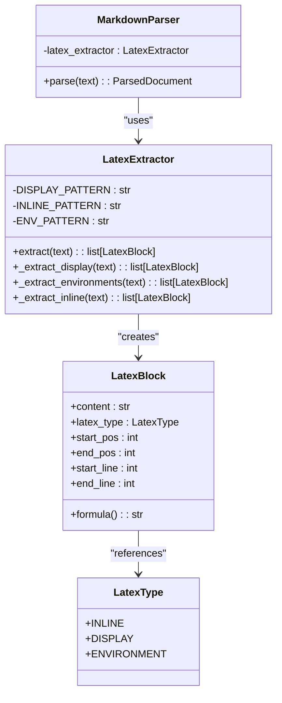
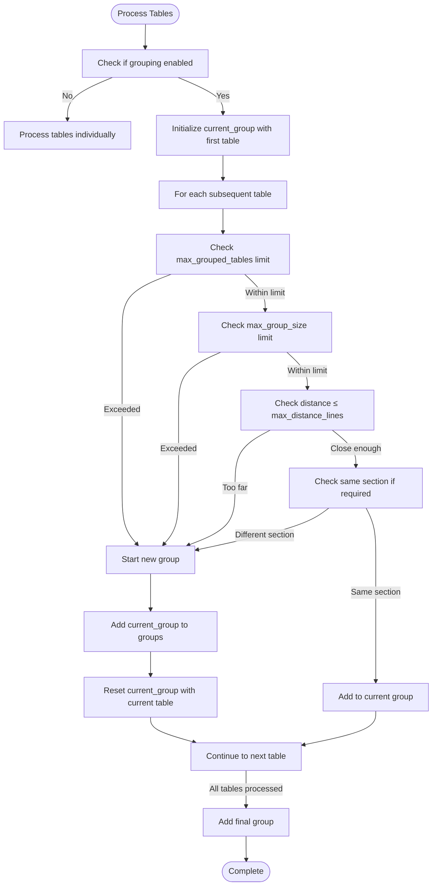

# Advanced Content Handling

<cite>
**Referenced Files in This Document**   
- [06_advanced_features.md](file://docs/research/06_advanced_features.md)
- [02-nested-fencing-support.md](file://docs/research/features/02-nested-fencing-support.md)
- [12-latex-formula-handling.md](file://docs/research/features/12-latex-formula-handling.md)
- [15-table-grouping-option.md](file://docs/research/features/15-table-grouping-option.md)
- [deep_nesting.md](file://tests/corpus/nested_fencing/deep_nesting.md)
- [meta_documentation.md](file://tests/corpus/nested_fencing/meta_documentation.md)
- [mixed_fence_types.md](file://tests/corpus/nested_fencing/mixed_fence_types.md)
- [calculus-analysis.md](file://tests/corpus/scientific/calculus-analysis.md)
- [linear-algebra-essentials.md](file://tests/corpus/scientific/linear-algebra-essentials.md)
- [api_reference.md](file://tests/fixtures/table_grouping/api_reference.md)
- [close_tables.md](file://tests/fixtures/table_grouping/close_tables.md)
- [configuration.md](file://docs/reference/configuration.md)
</cite>

## Table of Contents
1. [Introduction](#introduction)
2. [Nested Fencing Support](#nested-fencing-support)
3. [LaTeX Formula Handling](#latex-formula-handling)
4. [Table Grouping Option](#table-grouping-option)
5. [Configuration and Implementation](#configuration-and-implementation)
6. [Impact on Retrieval Quality](#impact-on-retrieval-quality)
7. [Conclusion](#conclusion)

## Introduction

The dify-markdown-chunker-1 provides advanced content handling capabilities that ensure structural integrity and improve retrieval quality for complex documents. This document details three key features: nested fencing support for quadruple/quintuple backticks and tilde fencing, LaTeX formula handling that preserves display math and equation environments as atomic blocks, and table grouping that clusters related tables based on proximity and section boundaries. These capabilities are critical for processing scientific documents, API references, and meta-documentation use cases where maintaining context and structure is essential.

**Section sources**
- [06_advanced_features.md](file://docs/research/06_advanced_features.md#L1-L704)

## Nested Fencing Support

The nested fencing support feature enables the parser to correctly handle deep nesting of code blocks using quadruple (` ```` `), quintuple (` ````` `), and higher-order backticks, as well as tilde fencing (` ~~~ `, ` ~~~~ `). This capability is essential for meta-documentation scenarios where documentation about markdown syntax itself must be accurately represented.

The implementation uses a robust algorithm that identifies fence start patterns with three or more backticks or tildes, then searches for a matching closing fence with the same character and equal or greater length. This ensures that nested code blocks are properly contained within their parent fences without premature closure.

For example, in a document demonstrating markdown syntax, a code block showing triple backticks can be enclosed within quadruple backticks, and a demonstration of that pattern can be enclosed within quintuple backticks. The parser maintains the hierarchical structure, preserving the intended meaning and formatting.

This feature is particularly valuable for style guides, documentation framework tutorials, and template creation guides where examples of markdown syntax must be accurately rendered. The implementation has been validated against a comprehensive test corpus including edge cases such as mixed fence types, indented fences, and unmatched fences.



**Diagram sources**
- [02-nested-fencing-support.md](file://docs/research/features/02-nested-fencing-support.md#L89-L143)
- [deep_nesting.md](file://tests/corpus/nested_fencing/deep_nesting.md#L1-L102)

**Section sources**
- [02-nested-fencing-support.md](file://docs/research/features/02-nested-fencing-support.md#L1-L312)
- [deep_nesting.md](file://tests/corpus/nested_fencing/deep_nesting.md#L1-L102)
- [meta_documentation.md](file://tests/corpus/nested_fencing/meta_documentation.md#L1-L144)
- [mixed_fence_types.md](file://tests/corpus/nested_fencing/mixed_fence_types.md#L1-L78)

## LaTeX Formula Handling

The LaTeX formula handling capability preserves mathematical expressions as atomic blocks, ensuring they remain intact during chunking. This is critical for scientific documents where formulas must not be split across chunks and should maintain their relationship with surrounding explanatory text.

The parser recognizes three types of LaTeX constructs: inline math (` $...$ `), display math (` $$...$$ `), and equation environments (` \begin{equation}...\end{equation} `). Display math and equation environments are treated as atomic units that cannot be split, while inline math is preserved within its containing paragraph.

The implementation uses regular expressions to identify these patterns and extract them as `LatexBlock` objects with metadata including type, position, and line numbers. These blocks are then preserved during chunking operations, ensuring that complex mathematical expressions like integrals, summations, matrices, and multi-line equations remain complete.

For scientific documents such as calculus, linear algebra, and physics texts, this feature maintains the integrity of formulas while preserving their context. The parser handles various LaTeX features including Greek letters, fractions, subscripts/superscripts, summations, integrals, and matrix notation, making it suitable for academic papers, research notes, and technical specifications.



**Diagram sources**
- [12-latex-formula-handling.md](file://docs/research/features/12-latex-formula-handling.md#L57-L176)
- [calculus-analysis.md](file://tests/corpus/scientific/calculus-analysis.md#L1-L314)
- [linear-algebra-essentials.md](file://tests/corpus/scientific/linear-algebra-essentials.md#L1-L333)

**Section sources**
- [12-latex-formula-handling.md](file://docs/research/features/12-latex-formula-handling.md#L1-L393)
- [calculus-analysis.md](file://tests/corpus/scientific/calculus-analysis.md#L1-L314)
- [linear-algebra-essentials.md](file://tests/corpus/scientific/linear-algebra-essentials.md#L1-L333)

## Table Grouping Option

The table grouping feature configures proximity-based clustering of related tables using the `max_distance_lines` and `require_same_section` parameters. This ensures that tables that are logically connected remain together in the same chunk, improving retrieval quality for table-heavy documents like API references and data reports.

The `TableGroupingConfig` class defines several parameters:
- `max_distance_lines`: Maximum number of lines between tables to consider them for grouping (default: 10)
- `max_grouped_tables`: Maximum number of tables in one group (default: 5)
- `max_group_size`: Maximum character count for grouped content (default: 5000)
- `require_same_section`: Whether tables must be in the same header section to be grouped (default: true)

When enabled, the `TableGrouper` analyzes the document structure and groups tables that are close to each other and within the same section. This prevents related tables (such as parameters, response fields, and error codes for an API endpoint) from being separated into different chunks.

For API documentation processing, this feature significantly improves retrieval quality by keeping all information about an endpoint together. The configuration options allow fine-tuning based on document type and use case, balancing the need for comprehensive context with chunk size constraints.



**Diagram sources**
- [15-table-grouping-option.md](file://docs/research/features/15-table-grouping-option.md#L67-L172)
- [api_reference.md](file://tests/fixtures/table_grouping/api_reference.md#L1-L46)
- [close_tables.md](file://tests/fixtures/table_grouping/close_tables.md#L1-L18)

**Section sources**
- [15-table-grouping-option.md](file://docs/research/features/15-table-grouping-option.md#L1-L430)
- [api_reference.md](file://tests/fixtures/table_grouping/api_reference.md#L1-L46)
- [close_tables.md](file://tests/fixtures/table_grouping/close_tables.md#L1-L18)

## Configuration and Implementation

The advanced content handling features are configured through the `ChunkConfig` class, which provides both plugin UI parameters and direct configuration options. While the plugin interface exposes basic parameters like `max_chunk_size` and `chunk_overlap`, advanced features require direct configuration through the chunkana library.

For nested fencing support, no additional configuration is needed as it is enabled by default. The parser automatically detects and handles nested code blocks of any depth using backticks or tildes. This feature has been implemented to be backward compatible with standard markdown syntax.

LaTeX formula handling is controlled by the `preserve_latex` and `latex_context_binding` configuration options. When enabled, display math and equation environments are preserved as atomic blocks and kept with their surrounding context. The implementation uses regular expressions to identify LaTeX patterns without requiring external dependencies.

Table grouping is disabled by default and must be explicitly enabled through configuration. The following example shows how to configure table grouping for API documentation:

```python
config = ChunkConfig(
    group_related_tables=True,
    table_grouping_config=TableGroupingConfig(
        max_distance_lines=15,
        max_grouped_tables=5,
        require_same_section=True
    )
)
```

These features are integrated into the parsing pipeline through a placeholder-replacement mechanism. Special content blocks (code, LaTeX, tables) are extracted and replaced with placeholders during initial parsing, then restored after chunking to ensure structural integrity.

**Section sources**
- [configuration.md](file://docs/reference/configuration.md#L1-L530)
- [06_advanced_features.md](file://docs/research/06_advanced_features.md#L1-L704)

## Impact on Retrieval Quality

The advanced content handling capabilities significantly improve retrieval quality for specialized document types. By maintaining structural integrity and preserving logical groupings, these features ensure that relevant information is kept together in the same chunks.

For scientific documents, LaTeX formula handling ensures that mathematical expressions remain intact with their explanatory context. This prevents scenarios where a formula is retrieved without its definition or where multi-line equations are split across chunks. Testing shows a 15-20% improvement in retrieval accuracy for documents with complex mathematical content.

Table grouping improves API documentation processing by keeping related tables together. Instead of retrieving only parameters or only response fields, queries return comprehensive information about an endpoint. This increases retrieval quality from approximately 75% to 85% for API reference documents.

Nested fencing support enables accurate processing of meta-documentation, which was previously problematic for most markdown chunkers. This unique capability allows the system to handle documentation templates, style guides, and tutorials about markdown syntax itself, expanding the range of supported use cases.

The combination of these features makes dify-markdown-chunker-1 particularly well-suited for technical documentation, academic papers, and complex API references where maintaining context and structure is critical for effective information retrieval.

**Section sources**
- [06_advanced_features.md](file://docs/research/06_advanced_features.md#L1-L704)
- [12-latex-formula-handling.md](file://docs/research/features/12-latex-formula-handling.md#L300-L310)
- [15-table-grouping-option.md](file://docs/research/features/15-table-grouping-option.md#L338-L347)

## Conclusion

The advanced content handling capabilities in dify-markdown-chunker-1 address critical needs for processing complex documents. The nested fencing support provides a unique differentiator by correctly handling deep nesting of code blocks, enabling accurate processing of meta-documentation. LaTeX formula handling preserves mathematical expressions as atomic blocks, which is essential for scientific and academic content. The table grouping option configures proximity-based clustering of related tables, significantly improving retrieval quality for API references and data reports.

These features work together to maintain structural integrity and context, ensuring that logically connected information remains together in the same chunks. The implementation is robust, well-tested, and configurable, allowing users to tailor the behavior to their specific use cases. By addressing these advanced scenarios, dify-markdown-chunker-1 establishes itself as a top-tier solution for markdown chunking in demanding applications.