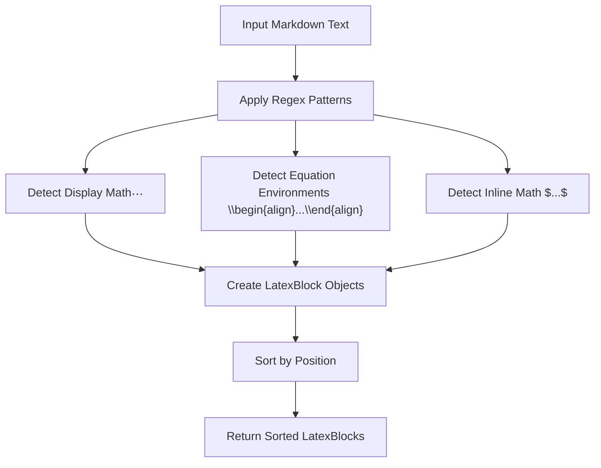
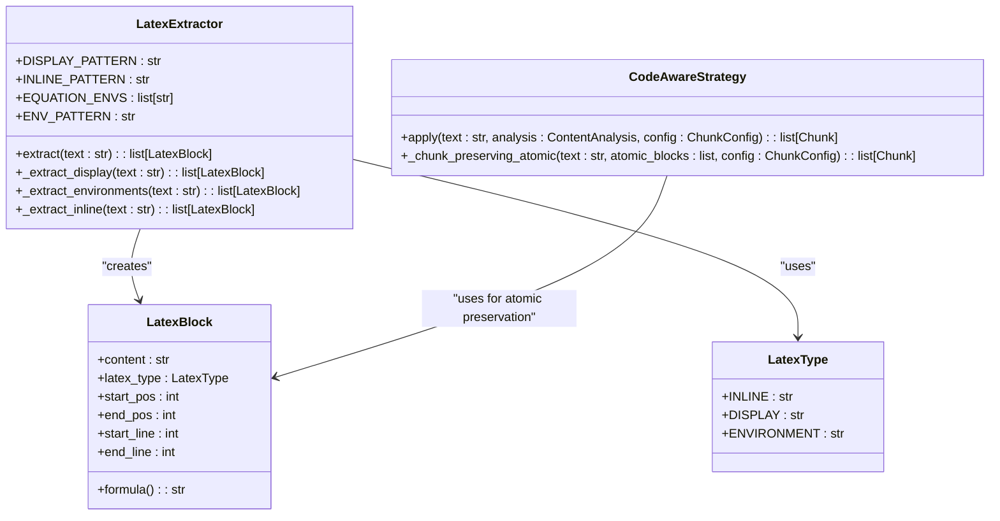

# LaTeX Formula Handling

<cite>
**Referenced Files in This Document**   
- [latex_formulas.md](file://tests/baseline_data/fixtures/latex_formulas.md)
- [12-latex-formula-handling.md](file://docs/research/features/12-latex-formula-handling.md)
- [06_advanced_features.md](file://docs/research/06_advanced_features.md)
- [README.md](file://README.md)
- [machine-learning-equations.md](file://tests/corpus/scientific/machine-learning-equations.md)
- [calculus-analysis.md](file://tests/corpus/scientific/calculus-analysis.md)
- [linear-algebra-essentials.md](file://tests/corpus/scientific/linear-algebra-essentials.md)
- [physics-equations.md](file://tests/corpus/scientific/physics-equations.md)
- [neural-network-backprop.md](file://tests/corpus/scientific/neural-network-backprop.md)
- [statistics-fundamentals.md](file://tests/corpus/scientific/statistics-fundamentals.md)
</cite>

## Table of Contents
1. [Introduction](#introduction)
2. [LaTeX Formula Detection](#latex-formula-detection)
3. [Atomic Preservation in Chunking](#atomic-preservation-in-chunking)
4. [Scientific Document Processing](#scientific-document-processing)
5. [Configuration and Integration](#configuration-and-integration)
6. [Conclusion](#conclusion)

## Introduction

The dify-markdown-chunker-1 implements robust LaTeX formula handling to preserve mathematical integrity during document chunking. This capability ensures that display math blocks ($$...$$) and equation environments are treated as atomic units, preventing fragmentation across chunks. The system uses regex-based detection patterns to identify LaTeX blocks and maintain their structural integrity, which is critical for academic and technical documents where mathematical expressions must remain complete and unbroken. This feature significantly improves retrieval quality in RAG systems by keeping formulas intact and preserving their contextual relationships with surrounding explanatory text.

**Section sources**
- [README.md](file://README.md#L87-L92)
- [06_advanced_features.md](file://docs/research/06_advanced_features.md#L426-L468)

## LaTeX Formula Detection

The LaTeX formula detection system employs precise regex patterns to identify and extract different types of mathematical expressions. The implementation distinguishes between three primary LaTeX block types: inline math ($...$), display math ($$...$$), and equation environments (\begin{equation}...\end{equation}). The detection process uses the `re.DOTALL` flag to handle multiline formulas correctly, ensuring that complex mathematical expressions spanning multiple lines are properly captured.

For display math blocks, the pattern `r'\$\$(.+?)\$\$'` identifies content enclosed in double dollar signs, while equation environments are detected using `r'\\begin\{(%s)\*?\}(.+?)\\end\{\1\*?\}'` where `%s` is dynamically replaced with supported environment names like equation, align, gather, multline, and eqnarray. The system also includes a more sophisticated pattern for inline math that avoids false positives by checking that the dollar signs are not part of a display math block.

The detection process returns a list of `LatexBlock` objects containing metadata such as content type, position in the original text, and line numbers. This information is crucial for maintaining the formula's context during chunking operations. The system prioritizes display math and equation environments for atomic preservation, while inline math handling can be configured based on use case requirements.

**Diagram sources**
- [12-latex-formula-handling.md](file://docs/research/features/12-latex-formula-handling.md#L56-L176)

**Section sources**
- [12-latex-formula-handling.md](file://docs/research/features/12-latex-formula-handling.md#L93-L176)
- [06_advanced_features.md](file://docs/research/06_advanced_features.md#L436-L462)

## Atomic Preservation in Chunking

The atomic preservation of LaTeX formulas is achieved through integration with the chunking strategy system, where detected LaTeX blocks are treated as atomic units similar to code blocks. In the `CodeAwareStrategy`, LaTeX blocks of type DISPLAY and ENVIRONMENT are added to the list of atomic blocks that must not be split across chunks. This ensures that complex mathematical expressions remain intact regardless of chunk boundaries.

The chunking process first extracts all LaTeX blocks using the `LatexExtractor`, then applies the selected strategy while respecting the atomic nature of these blocks. When a chunk boundary would otherwise split a LaTeX formula, the algorithm adjusts the boundary to preserve the entire formula within a single chunk. This approach maintains mathematical integrity while still optimizing chunk size for retrieval purposes.

For scientific documents with multiple related formulas, the system also preserves the contextual relationship between formulas and their explanatory text. This means that a formula and its surrounding explanation are typically kept within the same chunk, improving the semantic coherence of retrieved content. The preservation mechanism works across all chunking strategies (Code-Aware, List-Aware, Structural, and Fallback), ensuring consistent behavior regardless of the document type.

**Diagram sources**
- [12-latex-formula-handling.md](file://docs/research/features/12-latex-formula-handling.md#L56-L176)
- [12-latex-formula-handling.md](file://docs/research/features/12-latex-formula-handling.md#L208-L229)

**Section sources**
- [12-latex-formula-handling.md](file://docs/research/features/12-latex-formula-handling.md#L208-L229)
- [README.md](file://README.md#L87-L92)

## Scientific Document Processing

The LaTeX formula handling capability is extensively tested with scientific documents from the `tests/corpus/scientific/` directory, covering various academic domains. These test files demonstrate the system's ability to process complex mathematical content while preserving formula integrity. The corpus includes documents on machine learning equations, calculus and analysis, linear algebra, physics equations, and neural network backpropagation, each containing diverse LaTeX constructs.

In machine learning documents, the system successfully handles KL-Divergence, GAN objectives, VAE loss functions, and diffusion model equations, including multiline `align` environments. For calculus documents, it preserves limit definitions, derivative rules, Taylor series expansions, and integral theorems with proper formatting. Linear algebra documents with matrix notation, eigenvalue problems, and SVD decompositions are processed correctly, maintaining the structural integrity of mathematical expressions.

Physics documents containing Maxwell's equations, Schrödinger equation, and relativity formulas are handled with precision, ensuring that complex equation environments remain unbroken. The system also processes statistical formulas with Greek letters, summations, and probability distributions without fragmentation. These test cases validate that the chunking process maintains mathematical correctness while optimizing for retrieval performance in RAG systems.

**Section sources**
- [12-latex-formula-handling.md](file://docs/research/features/12-latex-formula-handling.md#L362-L392)
- [machine-learning-equations.md](file://tests/corpus/scientific/machine-learning-equations.md)
- [calculus-analysis.md](file://tests/corpus/scientific/calculus-analysis.md)
- [linear-algebra-essentials.md](file://tests/corpus/scientific/linear-algebra-essentials.md)
- [physics-equations.md](file://tests/corpus/scientific/physics-equations.md)
- [neural-network-backprop.md](file://tests/corpus/scientific/neural-network-backprop.md)
- [statistics-fundamentals.md](file://tests/corpus/scientific/statistics-fundamentals.md)

## Configuration and Integration

The LaTeX formula handling feature is integrated into the parser's AST processing pipeline, where LaTeX blocks are extracted before structural analysis and preserved throughout the chunking process. The system provides configuration options to control LaTeX block detection sensitivity and behavior. By default, display math and equation environments are always preserved as atomic units, while inline math handling can be enabled or disabled based on configuration settings.

The `ChunkConfig` class includes parameters for LaTeX handling, allowing users to control whether LaTeX blocks should be preserved and how they should be bound to surrounding context. The `preserve_latex` boolean flag enables or disables LaTeX preservation, while `latex_context_binding` determines whether formulas are kept with their explanatory text. These configuration options provide flexibility for different use cases, from strict mathematical document processing to more general content chunking.

Integration with the parser involves extracting LaTeX blocks before other structural elements, replacing them with placeholders during initial parsing, and restoring them after chunking. This approach prevents LaTeX syntax from interfering with Markdown parsing while ensuring that formulas are preserved in their original positions. The system's design allows for future enhancements, such as support for additional LaTeX environments or improved context binding algorithms, without requiring major architectural changes.

**Section sources**
- [12-latex-formula-handling.md](file://docs/research/features/12-latex-formula-handling.md#L313-L322)
- [12-latex-formula-handling.md](file://docs/research/features/12-latex-formula-handling.md#L178-L204)

## Conclusion

The LaTeX formula handling capability in dify-markdown-chunker-1 provides robust preservation of mathematical expressions during document chunking. By treating display math blocks and equation environments as atomic units, the system ensures that formulas remain intact and unfragmented, which is essential for maintaining mathematical integrity in academic and technical documents. The regex-based detection patterns effectively identify various LaTeX constructs, from simple inline equations to complex multiline environments.

This feature significantly improves retrieval quality in RAG systems by keeping formulas complete and preserving their contextual relationships with surrounding text. The implementation is validated through extensive testing with scientific documents across multiple domains, demonstrating reliable performance with complex mathematical content. The configurable nature of the feature allows it to adapt to different use cases while maintaining the core principle of mathematical expression preservation.

**Section sources**
- [README.md](file://README.md#L87-L92)
- [06_advanced_features.md](file://docs/research/06_advanced_features.md#L689-L690)