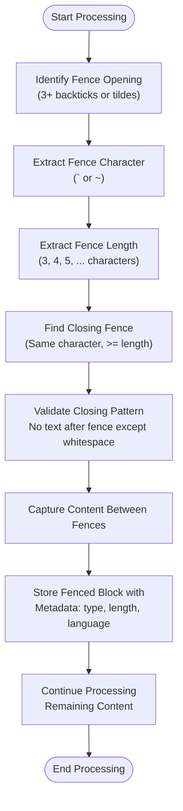
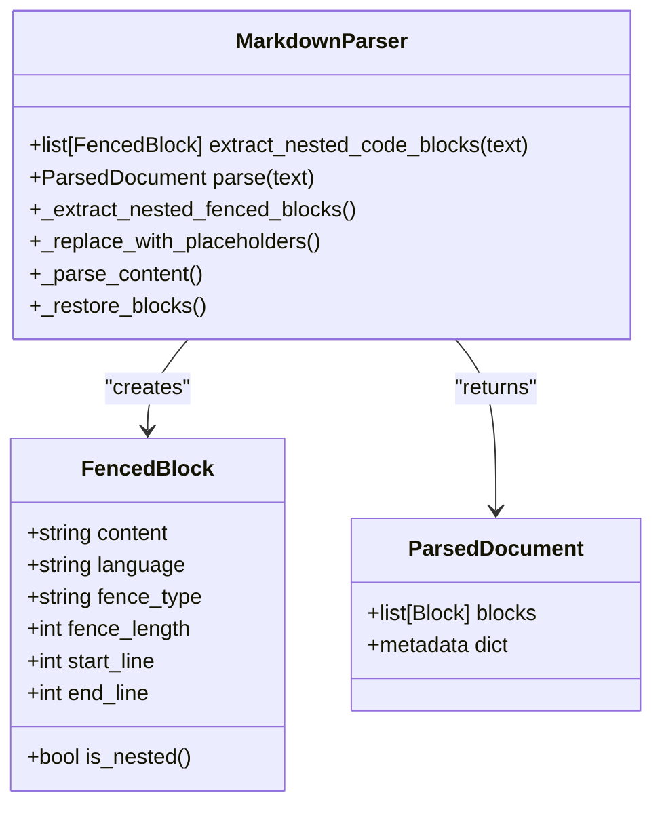
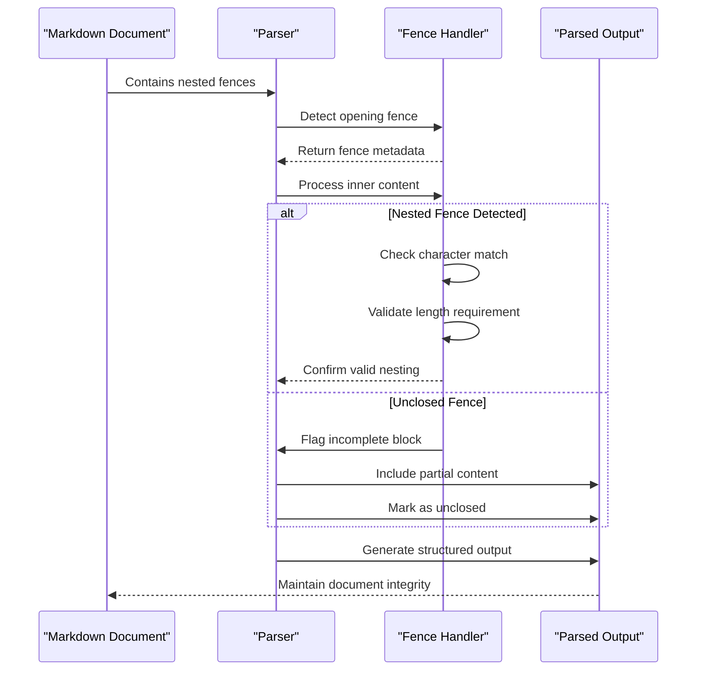

# Nested Fencing Support

<cite>
**Referenced Files in This Document**   
- [02-nested-fencing-support.md](file://docs/research/features/02-nested-fencing-support.md)
- [types.md](file://docs/api/types.md)
- [algorithms-ru.md](file://docs/reference/algorithms-ru.md)
- [edge_cases.md](file://tests/corpus/nested_fencing/edge_cases.md)
- [mixed_fences.md](file://tests/parser/fixtures/nesting/mixed_fences.md)
- [deep_nesting.md](file://tests/corpus/nested_fencing/deep_nesting.md)
- [meta_documentation.md](file://tests/corpus/nested_fencing/meta_documentation.md)
- [nested_fencing_011.md](file://tests/corpus/nested_fencing/nested_fencing_011.md)
- [nested_fencing_013.md](file://tests/corpus/nested_fencing/nested_fencing_013.md)
- [mixed_fence_types.md](file://tests/corpus/nested_fencing/mixed_fence_types.md)
- [tilde_fencing_basic.md](file://tests/corpus/nested_fencing/tilde_fencing_basic.md)
</cite>

## Table of Contents
1. [Introduction](#introduction)
2. [Core Implementation](#core-implementation)
3. [AST-Based Parsing Mechanism](#ast-based-parsing-mechanism)
4. [Edge Case Handling](#edge-case-handling)
5. [Configuration and Error Recovery](#configuration-and-error-recovery)
6. [Real-World Use Cases](#real-world-use-cases)
7. [Conclusion](#conclusion)

## Introduction

The nested fencing support feature in dify-markdown-chunker-1 enables robust parsing of deeply nested code blocks using both backticks (`````, ``````) and tildes (~~~). This capability is essential for processing complex technical documentation, meta-documentation scenarios, and code playgrounds where multiple levels of code examples are embedded within each other. The system handles mixed fence types within the same document while maintaining structural integrity through an AST-based parsing mechanism.

**Section sources**
- [02-nested-fencing-support.md](file://docs/research/features/02-nested-fencing-support.md#L1-L301)

## Core Implementation

The parser implements a sophisticated algorithm to handle nested code fences by tracking fence opening and closing patterns with precise character matching. It supports quadruple backticks (````), quintuple backticks (`````) for deep nesting, and tilde fencing (~~~, ~~~~) as alternative syntax. The implementation ensures that closing fences must match the same character type and have equal or greater length than the opening fence.



**Diagram sources**
- [02-nested-fencing-support.md](file://docs/research/features/02-nested-fencing-support.md#L88-L144)

**Section sources**
- [02-nested-fencing-support.md](file://docs/research/features/02-nested-fencing-support.md#L88-L144)
- [types.md](file://docs/api/types.md#L202-L207)

## AST-Based Parsing Mechanism

The system employs an Abstract Syntax Tree (AST)-based approach to maintain structural integrity during parsing. When encountering nested fences, the parser creates hierarchical node structures that preserve the nesting relationships. Each fenced block is represented as a node with properties including content, language specification, fence type, fence length, and positional metadata.

The parsing mechanism follows a three-phase process:
1. Extract all fenced blocks with proper nesting support
2. Replace blocks with placeholders for safe content parsing
3. Restore blocks after processing surrounding content

This approach prevents phantom closing of fences and ensures correct block termination even in complex nesting scenarios.



**Diagram sources**
- [02-nested-fencing-support.md](file://docs/research/features/02-nested-fencing-support.md#L148-L163)
- [02-nested-fencing-support.md](file://docs/research/features/02-nested-fencing-support.md#L168-L185)

**Section sources**
- [02-nested-fencing-support.md](file://docs/research/features/02-nested-fencing-support.md#L148-L185)
- [algorithms-ru.md](file://docs/reference/algorithms-ru.md#L802-L847)

## Edge Case Handling

The parser demonstrates robust handling of various edge cases, including unclosed fences and meta-documentation scenarios. For unclosed fences, the system gracefully processes the remaining content without breaking document structure. The implementation includes specific test cases from `tests/corpus/nested_fencing/edge_cases.md` and `tests/fixtures/unclosed_fence.md` to validate this behavior.

Mixed fence types are handled seamlessly, allowing backticks inside tildes and vice versa. The system processes documents with quadruple backticks and tilde fencing as shown in `tests/parser/fixtures/nesting/mixed_fences.md` and `tests/fixtures/mixed_fences_minimal.md`.



**Diagram sources**
- [edge_cases.md](file://tests/corpus/nested_fencing/edge_cases.md#L1-L15)
- [mixed_fences.md](file://tests/parser/fixtures/nesting/mixed_fences.md#L1-L46)

**Section sources**
- [edge_cases.md](file://tests/corpus/nested_fencing/edge_cases.md#L1-L15)
- [unclosed_fence.md](file://tests/fixtures/unclosed_fence.md#L1-L10)
- [mixed_fences.md](file://tests/parser/fixtures/nesting/mixed_fences.md#L1-L46)

## Configuration and Error Recovery

The system provides configuration options for fence validation and error recovery strategies. These settings allow users to control strictness of fence matching and handling of malformed blocks. The parser prioritizes document integrity over strict compliance, ensuring that errors in one section don't compromise the entire document.

Error recovery mechanisms include:
- Graceful handling of unclosed fences
- Prevention of phantom closing
- Preservation of content structure
- Accurate positional metadata

The configuration maintains backward compatibility with existing documents while supporting advanced nesting patterns.

**Section sources**
- [02-nested-fencing-support.md](file://docs/research/features/02-nested-fencing-support.md#L278-L289)
- [algorithms-ru.md](file://docs/reference/algorithms-ru.md#L802-L1839)

## Real-World Use Cases

The nested fencing support enables several practical applications:

### Technical Documentation with Embedded Examples
Documents like `tests/corpus/nested_fencing/deep_nesting.md` and `tests/corpus/nested_fencing/meta_documentation.md` demonstrate how the system handles meta-documentation scenarios where documentation about documentation requires multiple nesting levels.

### Code Playgrounds
The feature supports interactive coding environments where users can embed code examples within instructional content, as seen in `tests/corpus/nested_fencing/nested_fencing_011.md` and `tests/corpus/nested_fencing/nested_fencing_013.md`.

### Style Guides and Templates
Complex style guides with embedded examples, such as those in `tests/corpus/nested_fencing/mixed_fence_types.md`, benefit from the ability to show proper formatting techniques using nested fences.

### Documentation Frameworks
The system enables creation of comprehensive documentation frameworks that require deep nesting to illustrate best practices, as demonstrated in `tests/corpus/nested_fencing/tilde_fencing_basic.md`.

**Section sources**
- [deep_nesting.md](file://tests/corpus/nested_fencing/deep_nesting.md#L1-L102)
- [meta_documentation.md](file://tests/corpus/nested_fencing/meta_documentation.md#L1-L144)
- [nested_fencing_011.md](file://tests/corpus/nested_fencing/nested_fencing_011.md)
- [nested_fencing_013.md](file://tests/corpus/nested_fencing/nested_fencing_013.md)
- [mixed_fence_types.md](file://tests/corpus/nested_fencing/mixed_fence_types.md)
- [tilde_fencing_basic.md](file://tests/corpus/nested_fencing/tilde_fencing_basic.md)

## Conclusion

The nested fencing support in dify-markdown-chunker-1 provides comprehensive handling of deeply nested code blocks using both backticks and tildes. Through its AST-based parsing mechanism, the system maintains structural integrity even in complex scenarios with mixed fence types and unclosed blocks. This capability represents a unique differentiator, as no competing markdown chunker handles nested fencing correctly. The implementation supports real-world use cases including technical documentation, code playgrounds, and style guides, making it an essential feature for processing sophisticated markdown content.