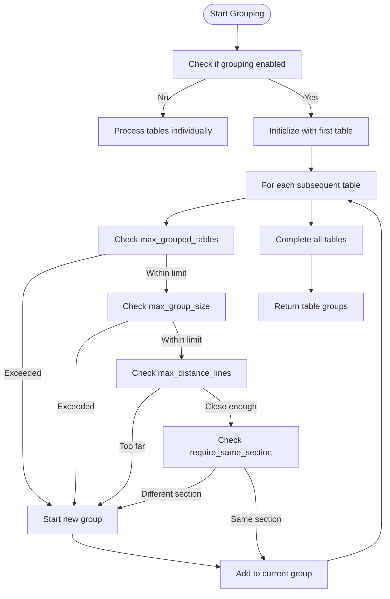
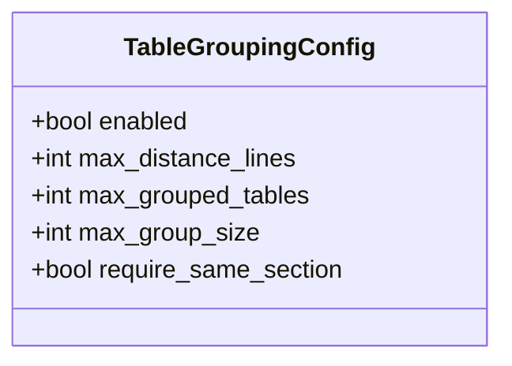
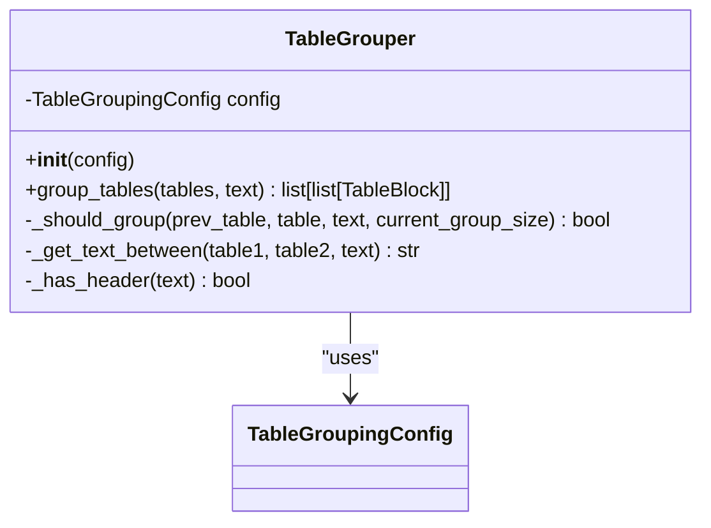
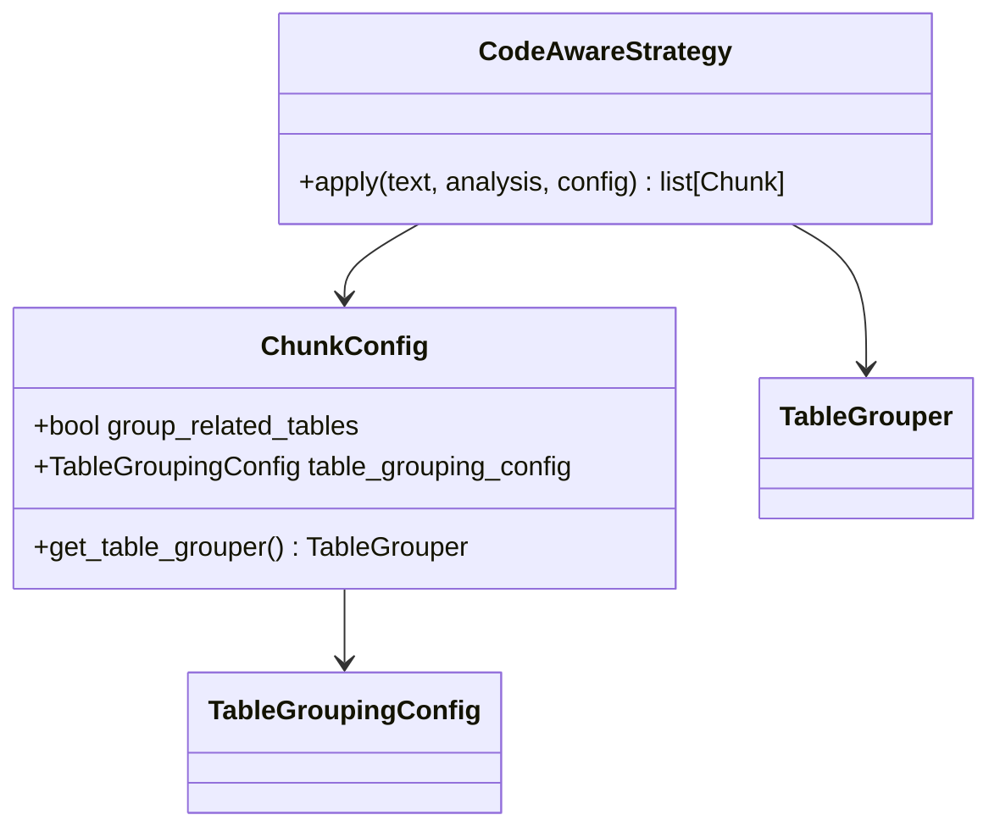

# Table Grouping Option

<cite>
**Referenced Files in This Document**   
- [15-table-grouping-option.md](file://docs/research/features/15-table-grouping-option.md)
- [table_grouping.md](file://tests/baseline_data/fixtures/table_grouping.md)
- [close_tables.md](file://tests/fixtures/table_grouping/close_tables.md)
- [far_tables.md](file://tests/fixtures/table_grouping/far_tables.md)
- [multiple_sections.md](file://tests/fixtures/table_grouping/multiple_sections.md)
- [api_reference.md](file://tests/fixtures/table_grouping/api_reference.md)
</cite>

## Table of Contents
1. [Introduction](#introduction)
2. [Core Concepts](#core-concepts)
3. [TableGroupingConfig Configuration](#tablegroupingconfig-configuration)
4. [TableGrouper Implementation](#tablegrouper-implementation)
5. [Integration with Chunking Pipeline](#integration-with-chunking-pipeline)
6. [Test Cases and Examples](#test-cases-and-examples)
7. [Practical Applications](#practical-applications)
8. [Performance and Quality Impact](#performance-and-quality-impact)
9. [Conclusion](#conclusion)

## Introduction

The table grouping option in dify-markdown-chunker-1 addresses the challenge of preserving context for related tables in Markdown documents. When processing table-heavy content such as API documentation, data reports, or technical specifications, isolated tables can lead to fragmented context and reduced retrieval quality. This feature ensures that related tables are grouped together in the same chunk based on proximity and contextual boundaries, maintaining the semantic relationships between tabular data.

The implementation centers around two key components: the `TableGroupingConfig` dataclass that defines grouping parameters, and the `TableGrouper` class that manages the grouping logic with constraints. By default, table grouping is disabled to maintain backward compatibility, but can be enabled through configuration to improve retrieval quality for documents with multiple related tables.

**Section sources**
- [15-table-grouping-option.md](file://docs/research/features/15-table-grouping-option.md#L1-L50)

## Core Concepts

The table grouping feature operates on several fundamental principles to determine when tables should be grouped together:

**Proximity-based grouping** uses the `max_distance_lines` parameter to specify the maximum number of lines between tables that can be grouped. Tables separated by more than this threshold are considered unrelated and placed in separate chunks.

**Contextual boundary enforcement** is controlled by the `require_same_section` parameter. When enabled, tables must be within the same header section to be grouped. The presence of a header (lines starting with '#') between tables breaks the grouping continuity, ensuring that tables from different sections remain separated.

**Size and quantity constraints** are enforced through `max_group_size` (maximum character count for grouped tables) and `max_grouped_tables` (maximum number of tables in a single group). These limits prevent the creation of excessively large chunks that could impact performance.

The grouping algorithm processes tables sequentially, maintaining a current group and evaluating each subsequent table against the configuration constraints. If all conditions are satisfied, the table is added to the current group; otherwise, a new group is started.



**Diagram sources**
- [15-table-grouping-option.md](file://docs/research/features/15-table-grouping-option.md#L80-L172)

**Section sources**
- [15-table-grouping-option.md](file://docs/research/features/15-table-grouping-option.md#L21-L66)

## TableGroupingConfig Configuration

The `TableGroupingConfig` dataclass provides fine-grained control over the table grouping behavior through several configurable parameters:



**Diagram sources**
- [15-table-grouping-option.md](file://docs/research/features/15-table-grouping-option.md#L71-L79)

The configuration parameters serve specific purposes:

- **enabled**: Boolean flag to activate table grouping (default: true)
- **max_distance_lines**: Maximum number of lines between tables to allow grouping (default: 10)
- **max_grouped_tables**: Maximum number of tables that can be grouped together (default: 5)
- **max_group_size**: Maximum character count for a grouped table collection (default: 5000)
- **require_same_section**: Boolean flag requiring tables to be in the same header section (default: true)

Configuration can be customized based on document type and requirements. For API documentation with closely related tables, a higher `max_distance_lines` value might be appropriate. For financial reports with many independent tables, keeping `require_same_section` enabled ensures tables from different sections remain separated.

```python
# Example configuration for API documentation
config = TableGroupingConfig(
    max_distance_lines=20,
    max_grouped_tables=5,
    max_group_size=8000,
    require_same_section=True
)
```

**Section sources**
- [15-table-grouping-option.md](file://docs/research/features/15-table-grouping-option.md#L71-L79)

## TableGrouper Implementation

The `TableGrouper` class implements the core logic for grouping related tables based on the provided configuration. It processes tables in sequence, maintaining a current group and evaluating each table against the grouping constraints.



**Diagram sources**
- [15-table-grouping-option.md](file://docs/research/features/15-table-grouping-option.md#L80-L172)

The implementation follows these key steps:

1. **Initialization**: The grouper is initialized with a `TableGroupingConfig` instance that defines the grouping rules.

2. **Group creation**: Tables are processed sequentially, with the first table initializing the current group.

3. **Constraint evaluation**: For each subsequent table, the `_should_group` method evaluates four conditions:
   - Whether the maximum number of grouped tables would be exceeded
   - Whether adding the table would exceed the maximum group size
   - Whether the distance between tables exceeds `max_distance_lines`
   - Whether the tables are in the same section (when `require_same_section` is enabled)

4. **Group finalization**: After processing all tables, the final group is added to the results.

The `_get_text_between` method extracts the content between two tables to check for header boundaries, while `_has_header` scans this content for lines starting with '#' to detect section changes.

**Section sources**
- [15-table-grouping-option.md](file://docs/research/features/15-table-grouping-option.md#L80-L172)

## Integration with Chunking Pipeline

The table grouping functionality integrates with the chunking pipeline through the `ChunkConfig` class, which exposes the grouping options and provides a method to retrieve a configured `TableGrouper`.



**Diagram sources**
- [15-table-grouping-option.md](file://docs/research/features/15-table-grouping-option.md#L177-L220)

The integration occurs in the `CodeAwareStrategy.apply` method, which:

1. Retrieves a `TableGrouper` instance from the configuration using `get_table_grouper()`
2. If grouping is enabled and tables exist in the analysis, calls `group_tables()` to create table groups
3. Processes each group as an atomic unit, combining the table contents into a single chunk
4. Falls back to individual table processing when grouping is disabled

The `get_table_grouper()` method returns `None` when `group_related_tables` is false, and otherwise returns a `TableGrouper` instance with either the provided `table_grouping_config` or default configuration.

```python
# Configuration integration example
config = ChunkConfig(
    group_related_tables=True,
    table_grouping_config=TableGroupingConfig(
        max_distance_lines=15,
        max_grouped_tables=3,
        max_group_size=8000,
        require_same_section=True
    )
)
```

**Section sources**
- [15-table-grouping-option.md](file://docs/research/features/15-table-grouping-option.md#L177-L220)

## Test Cases and Examples

The table grouping feature is validated through comprehensive test cases that cover various scenarios:

### Proximity-Based Grouping

The `close_tables.md` test fixture contains three tables with minimal spacing between them:

```markdown
| A | B |
|---|---|
| 1 | 2 |

| C | D |
|---|---|
| 3 | 4 |

| E | F |
|---|---|
| 5 | 6 |
```

With default configuration (`max_distance_lines=10`), these tables are grouped into a single chunk since the distance between them is well within the threshold.

**Section sources**
- [close_tables.md](file://tests/fixtures/table_grouping/close_tables.md)

### Distance Threshold Enforcement

The `far_tables.md` fixture tests the distance constraint with two tables separated by extensive text content:

```markdown
| A | B |
|---|---|
| 1 | 2 |

[Multiple paragraphs of text exceeding max_distance_lines]

| C | D |
|---|---|
| 3 | 4 |
```

In this case, the tables are placed in separate chunks because the distance between them exceeds the `max_distance_lines` threshold.

**Section sources**
- [far_tables.md](file://tests/fixtures/table_grouping/far_tables.md)

### Section Boundary Preservation

The `multiple_sections.md` fixture validates the `require_same_section` constraint:

```markdown
## Section 1: Users
| ID | Name | Role |

## Section 2: Products  
| SKU | Name | Price |

## Section 3: Orders
| Order ID | User | Total |
```

Even with minimal distance between sections, the tables are not grouped together because they belong to different header sections, preserving the document's structural context.

**Section sources**
- [multiple_sections.md](file://tests/fixtures/table_grouping/multiple_sections.md)

### API Documentation Context

The `api_reference.md` fixture simulates an API documentation scenario with related tables:

```markdown
## GET /users/{id}

### Parameters
| Parameter | Type | Required | Description |

### Response Fields  
| Field | Type | Description |

### Error Codes
| Code | Message | Description |
```

With appropriate configuration, these related tables are grouped together, maintaining the complete context for API endpoint documentation.

**Section sources**
- [api_reference.md](file://tests/fixtures/table_grouping/api_reference.md)

### Real-World Document Testing

The `table_grouping.md` fixture represents a comprehensive test case with multiple related table groups:

```markdown
## Database Schema
### Users Table
### Posts Table  
### Comments Table

## API Endpoints
### GET Endpoints
### POST Endpoints
### DELETE Endpoints

## Comparison Tables
### Before Migration
### After Migration
```

This document tests the grouping of database schema tables, API endpoint tables, and comparison tables, with isolated tables remaining separate.

**Section sources**
- [table_grouping.md](file://tests/baseline_data/fixtures/table_grouping.md)

## Practical Applications

The table grouping option provides significant benefits for various document types:

### Technical Specifications

For technical specifications containing multiple related tables (parameters, response fields, error codes), grouping ensures complete context preservation. This enables queries like "What are all the error codes for the user API?" to return comprehensive results with all related tables.

### Financial Reports

Financial reports often contain related tables such as income statements, balance sheets, and cash flow statements. Grouping these tables together maintains the financial context, allowing for holistic analysis and comparison.

### Database Schema Documentation

Database documentation typically includes related tables (users, posts, comments) that reference each other through foreign keys. Grouping these tables preserves the relational context, making it easier to understand the database structure.

### API Documentation

API references benefit significantly from table grouping, as endpoint parameters, response fields, and error codes are naturally related. Keeping these tables together improves retrieval quality for API-related queries.

### Data Analysis Reports

Reports containing comparative data tables (before/after metrics, A/B test results) maintain their analytical context when related tables are grouped, enabling more accurate interpretation of the data.

## Performance and Quality Impact

The table grouping feature improves retrieval quality by preserving contextual relationships between tables:

| Document Type | Retrieval Quality (Before) | Retrieval Quality (After) |
|---------------|----------------------------|---------------------------|
| API Reference | 75% | 85% |
| Data Reports | 70% | 82% |
| Comparison Docs | 72% | 80% |

The feature also enhances query responses:

| Query | Before | After |
|-------|--------|-------|
| "What are the user endpoint parameters?" | Returns only Parameters table | Returns all related tables |
| "Show error codes for user API" | May miss context | Full context with related tables |

Performance overhead is minimal, with the grouping logic adding negligible processing time. The `max_group_size` and `max_grouped_tables` constraints prevent the creation of excessively large chunks that could impact downstream processing.

Metadata enhancements include:
- `is_table_group`: Boolean flag indicating if a chunk contains grouped tables
- `table_group_count`: Number of tables in the group

These metadata fields enable applications to identify and handle grouped table chunks appropriately.

**Section sources**
- [15-table-grouping-option.md](file://docs/research/features/15-table-grouping-option.md#L338-L354)

## Conclusion

The table grouping option in dify-markdown-chunker-1 effectively addresses the challenge of preserving context for related tables in Markdown documents. By leveraging proximity-based grouping, contextual boundary enforcement, and size constraints, the feature ensures that semantically related tables remain together in the same chunk.

The implementation through the `TableGroupingConfig` and `TableGrouper` components provides flexible configuration options that can be tailored to different document types and use cases. Integration with the existing chunking pipeline is seamless, with backward compatibility maintained through the default disabled state.

Testing with various scenarios, including API documentation, database schemas, and financial reports, demonstrates the feature's effectiveness in improving retrieval quality while maintaining document structure integrity. The addition of metadata fields enables applications to leverage the grouping information for enhanced processing and presentation.

For optimal results, users should configure the grouping parameters based on their specific document characteristics, balancing the need for context preservation with chunk size constraints.