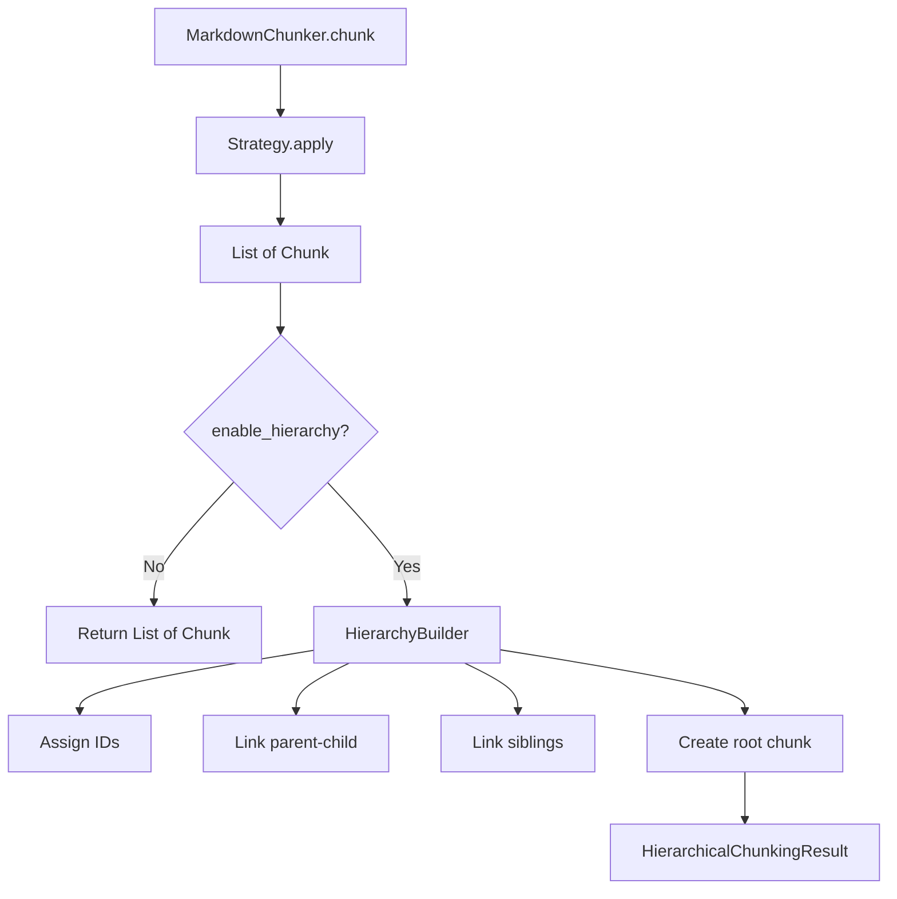

# Hierarchical Chunking

<cite>
**Referenced Files in This Document**   
- [11-hierarchical-chunking.md](file://docs/research/features/11-hierarchical-chunking.md)
- [types.md](file://docs/api/types.md)
- [chunker.md](file://docs/api/chunker.md)
</cite>

## Table of Contents
1. [Introduction](#introduction)
2. [Parent-Child Relationship Establishment](#parent-child-relationship-establishment)
3. [Chunk Metadata Fields](#chunk-metadata-fields)
4. [HierarchicalChunkingResult Class](#hierarchicalchunkingresult-class)
5. [Data Model and Navigation Methods](#data-model-and-navigation-methods)
6. [Backward Compatibility with Flat Retrieval](#backward-compatibility-with-flat-retrieval)
7. [Use Cases](#use-cases)
8. [Edge Cases and Test Scenarios](#edge-cases-and-test-scenarios)
9. [Performance Implications and Optimization](#performance-implications-and-optimization)

## Introduction

The hierarchical chunking feature in dify-markdown-chunker-1 enables the creation of structured document hierarchies through parent-child relationships between chunks. This system leverages the header hierarchy and section structure of Markdown documents to establish meaningful relationships between content segments. The implementation extends the existing chunking architecture by adding hierarchical metadata and navigation capabilities while maintaining backward compatibility with flat retrieval systems. This documentation details the technical implementation, data model, navigation methods, and practical applications of this feature.

**Section sources**
- [11-hierarchical-chunking.md](file://docs/research/features/11-hierarchical-chunking.md#L1-L1099)

## Parent-Child Relationship Establishment

The hierarchical chunking system establishes parent-child relationships between chunks by analyzing the header hierarchy and section structure of Markdown documents. The process begins with the existing `header_path` metadata, which contains the hierarchical path of each chunk in the format `/Level1/Level2/Level3`. This path information serves as the foundation for building the parent-child relationships.

The HierarchyBuilder component processes the chunks after the initial chunking phase and constructs the hierarchical relationships. For each chunk, the system identifies its parent by examining the `header_path` and finding the chunk with the immediate parent path (by removing the last segment of the path). For example, a chunk with `header_path` "/Introduction/Getting Started/Installation" would have its parent identified as the chunk with `header_path` "/Introduction/Getting Started".

When a parent chunk cannot be found through the header path (such as with preamble content), the system assigns the document root as the parent. The root chunk itself has no parent and serves as the top-level container for the entire document hierarchy. This approach ensures that all chunks are properly connected within the hierarchy, preserving the logical structure of the original document.

The relationship establishment process also handles edge cases such as documents without headers, where the entire content becomes a leaf chunk under the document root, and documents with only headers, where each header becomes a sibling chunk at the appropriate level.

**Diagram sources **
- [11-hierarchical-chunking.md](file://docs/research/features/11-hierarchical-chunking.md#L88-L100)

**Section sources**
- [11-hierarchical-chunking.md](file://docs/research/features/11-hierarchical-chunking.md#L76-L451)

## Chunk Metadata Fields

The hierarchical chunking system adds several metadata fields to each chunk to support navigation and relationship tracking within the hierarchy. These fields extend the existing chunk metadata without modifying the core chunk structure.

The `chunk_id` field contains a unique 8-character hash identifier generated from the chunk content and position, providing a compact alternative to UUIDs to minimize storage overhead. The `parent_id` field stores the ID of the parent chunk, with null values indicating root-level chunks. The `children_ids` field contains a list of IDs for all child chunks, enabling traversal down the hierarchy.

Sibling relationships are tracked through `prev_sibling_id` and `next_sibling_id` fields, which store the IDs of adjacent chunks at the same hierarchical level, ordered by their position in the original document. The `hierarchy_level` field indicates the depth of the chunk within the hierarchy, with values ranging from 0 (document level) to 3 (paragraph level), where H1 sections are level 1, H2 sections are level 2, and H3+ sections and paragraphs are level 3.

Additional boolean flags include `is_leaf`, which indicates whether a chunk has children (false for leaf nodes), and `is_root`, which identifies the document-level chunk. These metadata fields work together to enable efficient navigation and querying of the hierarchical structure without requiring recursive tree traversal.

**Section sources**
- [11-hierarchical-chunking.md](file://docs/research/features/11-hierarchical-chunking.md#L120-L128)
- [types.md](file://docs/api/types.md#L524-L533)

## HierarchicalChunkingResult Class

The HierarchicalChunkingResult class serves as a wrapper around the chunk collection, providing navigation methods and an optimized lookup index. This class does not create new chunk types but enhances existing chunks with hierarchical metadata and access patterns.

A key feature of the HierarchicalChunkingResult is its O(1) lookup index, implemented as a dictionary that maps chunk IDs to chunk objects. This index is built during initialization by iterating through all chunks and extracting their `chunk_id` metadata. The O(1) lookup capability enables efficient navigation methods without requiring linear searches through the chunk collection.

The class maintains references to all chunks (including the root document chunk), the root chunk ID, and the strategy used for chunking. The internal index is marked as non-representable to prevent serialization issues and ensure it's treated as a performance optimization rather than part of the data model.

This design allows the HierarchicalChunkingResult to provide rich navigation capabilities while preserving the original chunk objects and their metadata. The wrapper pattern ensures backward compatibility, as the underlying chunks remain accessible through standard iteration, while the enhanced navigation methods provide additional functionality for hierarchical retrieval scenarios.

**Section sources**
- [11-hierarchical-chunking.md](file://docs/research/features/11-hierarchical-chunking.md#L131-L235)
- [types.md](file://docs/api/types.md#L449-L455)

## Data Model and Navigation Methods

The hierarchical chunking data model provides several navigation methods through the HierarchicalChunkingResult class, enabling efficient traversal of the document hierarchy. These methods leverage the O(1) lookup index to provide fast access to related chunks.

The `get_children()` method retrieves all child chunks of a given chunk by looking up the parent chunk and then resolving each child ID in the `children_ids` list through the index. The `get_parent()` method finds the parent chunk by retrieving the `parent_id` from the chunk metadata and looking it up in the index. The `get_ancestors()` method returns all ancestor chunks from the immediate parent up to the root by iteratively following parent links until reaching the root.

The `get_siblings()` method returns all chunks at the same hierarchical level as the specified chunk, including the chunk itself. It accomplishes this by first finding the parent chunk and then retrieving all its children, which are inherently siblings to each other. This method is particularly useful for implementing navigation between related sections.

These navigation methods work together to support complex retrieval patterns, such as multi-level queries that combine information from different levels of the hierarchy. For example, a retrieval system could use `get_ancestors()` to gather contextual information from higher-level sections when returning a specific content chunk, providing users with a richer understanding of where the information fits within the overall document structure.

**Section sources**
- [11-hierarchical-chunking.md](file://docs/research/features/11-hierarchical-chunking.md#L154-L197)
- [types.md](file://docs/api/types.md#L460-L474)

## Backward Compatibility with Flat Retrieval

The hierarchical chunking system maintains backward compatibility with existing flat retrieval systems through the `get_flat_chunks()` method. This method returns only the leaf chunks from the hierarchy, effectively flattening the structure into a format compatible with traditional retrieval approaches.

The `get_flat_chunks()` method filters the chunk collection to include only those chunks marked as leaf nodes (where `is_leaf` is true or `children_ids` is empty). This approach ensures that systems designed to work with flat chunk collections can continue to function without modification, while still benefiting from the hierarchical metadata that can be used for context enrichment.

This backward compatibility is crucial for integrating the hierarchical chunking feature into existing workflows and systems that expect flat chunk structures. It allows gradual adoption of hierarchical features without requiring immediate changes to downstream components. The flat chunks retain all hierarchical metadata, enabling systems to optionally leverage parent-child relationships and other hierarchical information when needed, while defaulting to simple flat retrieval when not required.

The design ensures that the hierarchical structure is an enhancement rather than a replacement, allowing both hierarchical and flat access patterns to coexist within the same system.

**Section sources**
- [11-hierarchical-chunking.md](file://docs/research/features/11-hierarchical-chunking.md#L198-L205)
- [types.md](file://docs/api/types.md#L475-L477)

## Use Cases

The hierarchical chunking feature enables several advanced use cases that leverage the parent-child relationships and navigation capabilities. Multi-level retrieval allows systems to answer queries at different levels of granularity, from high-level overviews to detailed information, by navigating the hierarchy to find the appropriate level of detail.

Breadcrumb navigation provides users with context about their current position within a document by showing the path from the root to the current section. This is implemented using the `get_ancestors()` method to retrieve the chain of parent chunks and extract their header paths to create a navigational trail.

Section summarization leverages the hierarchical structure to generate summaries at different levels. The system can create a comprehensive summary by combining the content of high-level sections with selected details from subsections, or generate focused summaries of specific sections by aggregating their child chunks. This approach preserves the document's logical structure while providing concise overviews.

Other use cases include table of contents generation, where the hierarchy is traversed to create a structured outline; contextual search results, where retrieved chunks are enriched with information from parent sections; and document navigation interfaces that allow users to explore content by expanding and collapsing sections in a tree-like structure.

**Section sources**
- [11-hierarchical-chunking.md](file://docs/research/features/11-hierarchical-chunking.md#L517-L596)

## Edge Cases and Test Scenarios

The hierarchical chunking implementation includes comprehensive testing for various edge cases to ensure robustness. Deep nesting scenarios test the system's ability to handle documents with multiple levels of headings, verifying that parent-child relationships are correctly established even with complex header hierarchies.

The system handles same-header-path chunks that occur when large sections are split across multiple chunks. In such cases, the chunks become siblings at the same hierarchical level, maintaining the logical structure while accommodating size constraints. Documents without headers are processed by creating a single leaf chunk under the document root, with the root containing a summary of the content.

Other edge cases include documents with only headers (no content), where each header becomes a sibling chunk; very deep hierarchies (H6+), where levels beyond H3 are mapped to the paragraph level while preserving the full header path; and mixed strategy scenarios where different chunking approaches might create non-standard structures.

The test suite validates that all navigation methods work correctly across these edge cases, ensuring that parent-child links, sibling relationships, and ancestor chains are properly maintained regardless of the document structure.

**Section sources**
- [11-hierarchical-chunking.md](file://docs/research/features/11-hierarchical-chunking.md#L629-L650)
- [11-hierarchical-chunking.md](file://docs/research/features/11-hierarchical-chunking.md#L662-L780)

## Performance Implications and Optimization

The hierarchical chunking system implements several optimizations to mitigate performance implications and storage overhead. The use of 8-character hash IDs instead of UUIDs reduces storage requirements by approximately 78%, significantly decreasing the overall footprint of the hierarchical metadata.

The O(1) lookup index eliminates the need for linear searches when navigating the hierarchy, ensuring that operations like `get_chunk()`, `get_parent()`, and `get_children()` execute in constant time regardless of document size. This optimization is particularly important for large documents with hundreds of chunks, where linear search performance would degrade significantly.

Storage overhead is further minimized by avoiding duplication of content in the hierarchy. The root chunk contains only a summary of the document rather than the full content, preventing memory bloat. The system uses ID-based references rather than object references to avoid circular dependencies and enable safe serialization.

For very large documents, the implementation supports lazy loading and pagination of child chunks to manage memory usage. The post-processing nature of the hierarchy building allows it to work with any chunking strategy, making it adaptable to different performance requirements and document types.

**Section sources**
- [11-hierarchical-chunking.md](file://docs/research/features/11-hierarchical-chunking.md#L604-L619)
- [11-hierarchical-chunking.md](file://docs/research/features/11-hierarchical-chunking.md#L305-L312)