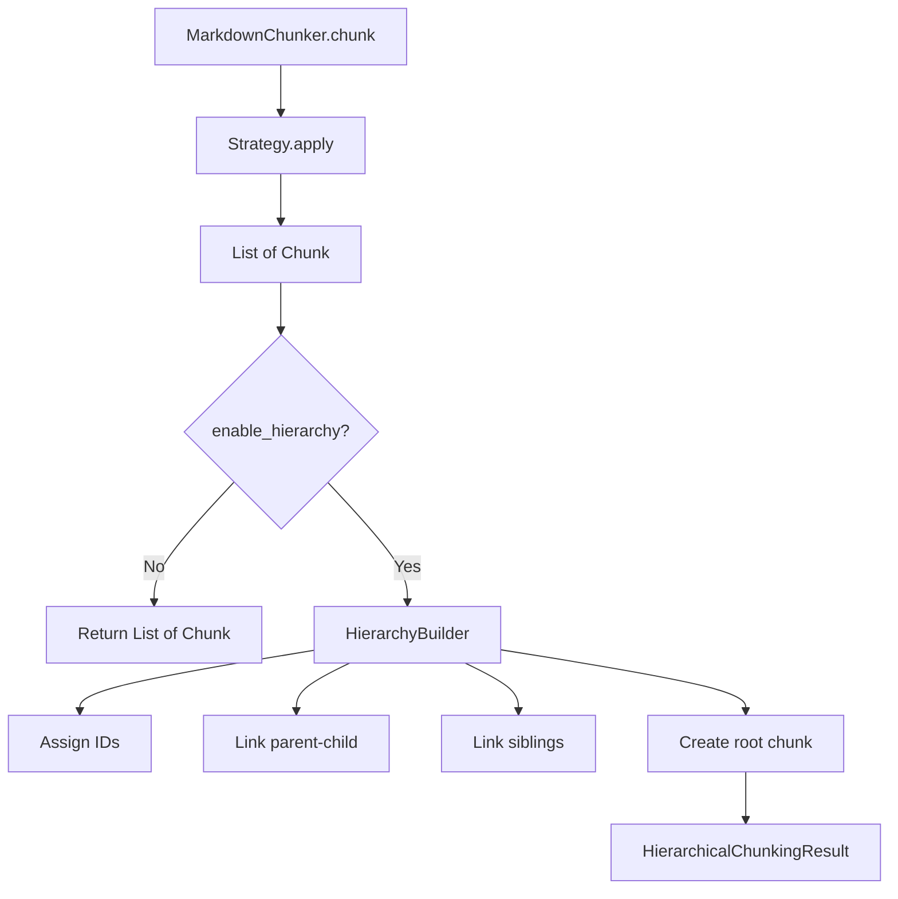
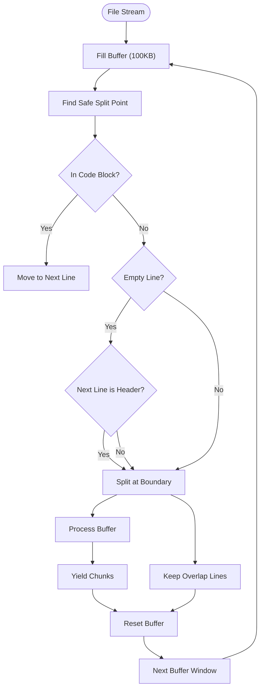

# Key Features

<cite>
**Referenced Files in This Document**   
- [README.md](file://README.md)
- [docs/research/features/01-smart-list-strategy.md](file://docs/research/features/01-smart-list-strategy.md)
- [docs/research/features/02-nested-fencing-support.md](file://docs/research/features/02-nested-fencing-support.md)
- [docs/research/features/06-enhanced-code-context-binding.md](file://docs/research/features/06-enhanced-code-context-binding.md)
- [docs/research/features/11-hierarchical-chunking.md](file://docs/research/features/11-hierarchical-chunking.md)
- [docs/research/features/14-streaming-processing.md](file://docs/research/features/14-streaming-processing.md)
- [docs/research/features/12-latex-formula-handling.md](file://docs/research/features/12-latex-formula-handling.md)
- [docs/research/features/15-table-grouping-option.md](file://docs/research/features/15-table-grouping-option.md)
- [docs/research/features/13-configurable-strategy-thresholds.md](file://docs/research/features/13-configurable-strategy-thresholds.md)
</cite>

## Table of Contents
1. [Adaptive Chunking Strategies](#adaptive-chunking-strategies)
2. [Hierarchical Chunking](#hierarchical-chunking)
3. [Streaming Processing](#streaming-processing)
4. [Advanced Content Handling](#advanced-content-handling)
5. [Configuration Profiles](#configuration-profiles)
6. [Performance Implications](#performance-implications)

## Adaptive Chunking Strategies

The dify-markdown-chunker-1 employs an intelligent, content-aware strategy selection system that automatically chooses the optimal chunking approach based on document analysis. This adaptive system evaluates various content metrics to determine the most appropriate strategy, ensuring high-quality chunking across diverse document types.

The system implements four primary strategies with a clear priority hierarchy:

| Strategy | Priority | Activation Conditions | Best For |
|----------|----------|----------------------|----------|
| **Code-Aware** | 1 (highest) | code_ratio ≥ 30% OR has code blocks/tables | Technical docs, API docs |
| **List-Aware** | 2 | list_ratio > 40% OR list_count ≥ 5 (AND logic for structured docs) | Changelogs, feature lists, task lists, outlines |
| **Structural** | 3 | ≥3 headers with hierarchy | Documentation, guides |
| **Fallback** | 4 (default) | Always applicable | Simple text, mixed content |

### Code-Aware Strategy

The Code-Aware strategy prioritizes the preservation of code blocks and related technical content. It activates when code constitutes at least 30% of the document or when code blocks are present. This strategy ensures that code examples, API references, and technical specifications remain intact and contextually relevant.

**Section sources**
- [README.md](file://README.md#L673-L674)

### List-Aware Strategy

The List-Aware strategy is specifically designed for documents with high list density, such as changelogs, feature lists, and task outlines. This competitive advantage preserves nested list hierarchies and maintains context binding between list introductions and their items.

The strategy activates based on two primary conditions:
- List ratio exceeds 40%
- List count is 5 or more

For documents with strong hierarchical structure (multiple headers), both conditions must be met. For less structured documents, either condition can trigger activation.

**Key capabilities:**
- **Hierarchy Preservation**: Nested lists never split across depth levels
- **Context Binding**: Introduction paragraphs automatically attached to their lists
- **Smart Grouping**: Related list items kept together based on structure
- **Type Detection**: Handles bullet lists, numbered lists, and checkboxes

This strategy is particularly effective for changelogs, where version releases with nested changes must remain coherent, and for feature lists with detailed descriptions.

**Section sources**
- [docs/research/features/01-smart-list-strategy.md](file://docs/research/features/01-smart-list-strategy.md)

### Structural Strategy

The Structural strategy focuses on document organization through headers and sections. It activates when a document contains three or more headers, indicating a structured format. This approach preserves the document's outline and section boundaries, making it ideal for comprehensive guides, documentation, and articles with clear hierarchical organization.

### Fallback Strategy

The Fallback strategy serves as the default option for documents that don't meet the criteria for specialized strategies. It provides reliable chunking for simple text and mixed-content documents, ensuring consistent performance across all input types.

## Hierarchical Chunking

Hierarchical chunking creates parent-child relationships between chunks, enabling multi-level retrieval and improved navigation. This feature preserves context across different levels of document structure, from document overview to detailed content.



**Diagram sources** 
- [docs/research/features/11-hierarchical-chunking.md](file://docs/research/features/11-hierarchical-chunking.md#L88-L100)

The hierarchical system implements several chunk types:

| Type | is_root | is_leaf | indexable | Description |
|------|---------|---------|-----------|-------------|
| Root | true | false | false | Document root, covers entire document |
| Internal | false | false | true | Section headers with children |
| Leaf | false | true | true | Content chunks for indexing |

**Key navigation methods:**
- `get_chunk(chunk_id)`: Retrieve a specific chunk by ID
- `get_children(chunk_id)`: Access child chunks of a section
- `get_parent(chunk_id)`: Navigate to parent section
- `get_ancestors(chunk_id)`: Retrieve all ancestor chunks
- `get_siblings(chunk_id)`: Access peer chunks at the same level
- `get_flat_chunks()`: Return only leaf chunks for vector database indexing

This hierarchical approach enables sophisticated retrieval patterns, allowing systems to provide both overview information and detailed content as needed.

**Section sources**
- [docs/research/features/11-hierarchical-chunking.md](file://docs/research/features/11-hierarchical-chunking.md)

## Streaming Processing

Streaming processing enables memory-efficient handling of large files, supporting documents exceeding 10MB with minimal memory footprint. This capability is essential for processing extensive documentation, concatenated changelogs, and generated API references.

The streaming architecture processes documents in configurable buffer windows (default 100KB), maintaining quality through smart window boundary detection. This approach ensures that atomic content units like code blocks, tables, and lists are not split across buffer boundaries.



**Diagram sources** 
- [docs/research/features/14-streaming-processing.md](file://docs/research/features/14-streaming-processing.md)

**Key benefits:**
- Processes files >10MB with <50MB RAM usage
- Configurable buffer management
- Progress tracking support for long-running operations
- Maintains quality through intelligent boundary detection
- Supports both synchronous and asynchronous processing

The system includes safeguards to prevent splitting atomic content units and maintains context through configurable overlap lines between buffers.

**Section sources**
- [docs/research/features/14-streaming-processing.md](file://docs/research/features/14-streaming-processing.md)

## Advanced Content Handling

The chunker provides sophisticated handling of complex Markdown elements, ensuring proper preservation of nested structures and specialized content types.

### Nested Fencing Support

The system correctly handles quadruple and quintuple backticks as well as tilde fencing, a unique capability not found in competing solutions. This support is critical for meta-documentation, documentation templates, and tutorial-style content with code examples.

The parsing algorithm identifies fence openings with three or more identical characters (backticks or tildes) and matches them with closing fences of the same or greater length. This ensures that nested code blocks remain intact and properly structured.

**Section sources**
- [docs/research/features/02-nested-fencing-support.md](file://docs/research/features/02-nested-fencing-support.md)

### LaTeX Formula Handling

Mathematical formulas in LaTeX format are preserved as atomic blocks, preventing them from being split across chunks. The system supports:
- Display math (`$$...$$`) 
- Inline math (`$...$`)
- Equation environments (`\begin{equation}`, `\begin{align}`)

This capability is essential for scientific papers, academic notes, and technical specifications containing mathematical content.

**Section sources**
- [docs/research/features/12-latex-formula-handling.md](file://docs/research/features/12-latex-formula-handling.md)

### Enhanced Code-Context Binding

The system intelligently binds code blocks to their explanatory context through pattern recognition. This feature identifies and preserves relationships between:
- **Before/After Comparisons**: Keeping refactoring examples together
- **Code + Output Pairs**: Binding execution results to code
- **Setup + Example**: Grouping installation instructions with usage examples
- **Sequential Steps**: Maintaining tutorial order

Each code chunk includes enhanced metadata:
- `code_role`: Classification (example, setup, output, before, after, error)
- `has_related_code`: Boolean flag for grouped blocks
- `code_relationship`: Relationship type (before_after, code_output, sequential)
- `explanation_bound`: Whether explanation context is available

**Section sources**
- [docs/research/features/06-enhanced-code-context-binding.md](file://docs/research/features/06-enhanced-code-context-binding.md)

### Table Grouping

Related tables can be grouped in the same chunk to improve retrieval quality for table-heavy documents like API references and data reports. This optional feature is configurable with parameters:
- `max_distance_lines`: Maximum lines between tables to group
- `require_same_section`: Whether tables must be in the same section
- `max_group_size`: Size limit for grouped content
- `max_grouped_tables`: Maximum tables in one group

This ensures that related information like parameters, response fields, and error codes remain together for comprehensive retrieval.

**Section sources**
- [docs/research/features/15-table-grouping-option.md](file://docs/research/features/15-table-grouping-option.md)

## Configuration Profiles

The system supports configuration profiles tailored to different document types and use cases. These profiles adjust strategy thresholds and chunking parameters to optimize performance for specific scenarios.

### Preset Profiles

```python
@dataclass
class ChunkConfig:
    @classmethod
    def for_api_docs(cls) -> "ChunkConfig":
        """Optimized for API documentation."""
        return cls(
            max_chunk_size=2500,
            thresholds=StrategyThresholds(
                code_ratio_threshold=0.20,
                table_count_threshold=2,
            )
        )
    
    @classmethod
    def for_user_guides(cls) -> "ChunkConfig":
        """Optimized for user guides."""
        return cls(
            max_chunk_size=1500,
            thresholds=StrategyThresholds(
                code_ratio_threshold=0.40,
                list_ratio_threshold=0.30,
            )
        )
    
    @classmethod
    def for_changelogs(cls) -> "ChunkConfig":
        """Optimized for changelogs."""
        return cls(
            max_chunk_size=2000,
            thresholds=StrategyThresholds(
                list_ratio_threshold=0.25,
                list_count_threshold=3,
            )
        )
```

**Section sources**
- [docs/research/features/13-configurable-strategy-thresholds.md](file://docs/research/features/13-configurable-strategy-thresholds.md)

### Custom Thresholds

Users can fine-tune strategy selection by adjusting thresholds for various content metrics:

| Threshold | Default | Description |
|-----------|---------|-------------|
| code_ratio_threshold | 0.30 | Minimum code ratio for Code-Aware strategy |
| list_ratio_threshold | 0.40 | Minimum list ratio for List strategy |
| header_count_threshold | 3 | Minimum headers for Structural strategy |
| list_count_threshold | 5 | Minimum list count for List strategy |

These configurable thresholds allow customization based on specific document characteristics and use cases.

## Performance Implications

Each feature has specific performance considerations and trade-offs that should be considered when configuring the chunker for different use cases.

### Memory Usage

| Feature | Memory Impact | Recommendation |
|---------|---------------|----------------|
| Streaming Processing | Low (50MB for any file size) | Enable for files >10MB |
| Hierarchical Chunking | Moderate (additional metadata) | Use when multi-level navigation is needed |
| Semantic Boundary Detection | High (requires ML model) | Disable if memory constrained |
| Table Grouping | Low | Enable for API documentation |

### Processing Speed

The base chunking process is optimized for performance, with typical processing times:
- Small documents (<5KB): <50ms
- Medium documents (50KB): <200ms  
- Large documents (200KB): <500ms

Features like semantic boundary detection significantly increase processing time due to the computational requirements of sentence embeddings, while streaming processing has minimal overhead compared to full-document loading.

### Trade-offs

When enabling specific features, consider the following trade-offs:

**Hierarchical Chunking:**
- *Pros*: Improved navigation, context preservation, multi-level retrieval
- *Cons*: Increased metadata overhead, more complex data structure
- *Best for*: Documentation systems requiring detailed navigation

**Streaming Processing:**
- *Pros*: Low memory footprint, ability to process very large files
- *Cons*: Slightly more complex implementation, potential boundary edge cases
- *Best for*: Large documentation sets, memory-constrained environments

**Enhanced Code-Context Binding:**
- *Pros*: Better retrieval quality for code-related queries, preserved relationships
- *Cons*: Potentially larger chunks, increased processing complexity
- *Best for*: Technical documentation, API references, code tutorials

**Table Grouping:**
- *Pros*: Improved retrieval of related tabular data, comprehensive context
- *Cons*: May create larger chunks, requires configuration tuning
- *Best for*: API documentation, data reports, comparison tables

The system is designed to maintain backward compatibility, with most advanced features disabled by default to ensure predictable behavior for existing implementations.

**Section sources**
- [docs/research/features/14-streaming-processing.md](file://docs/research/features/14-streaming-processing.md)
- [docs/research/features/11-hierarchical-chunking.md](file://docs/research/features/11-hierarchical-chunking.md)