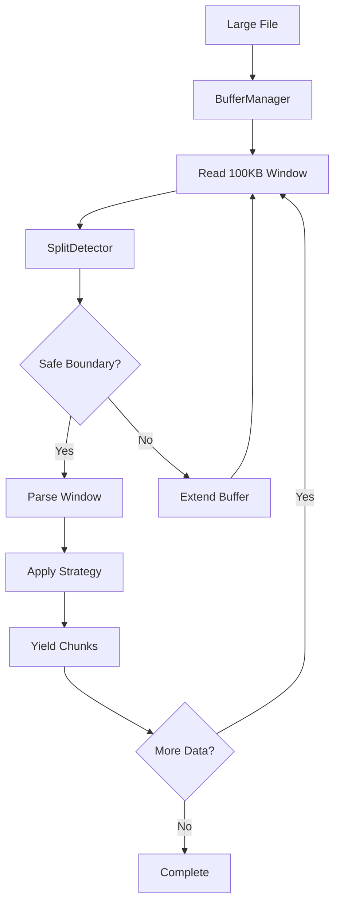
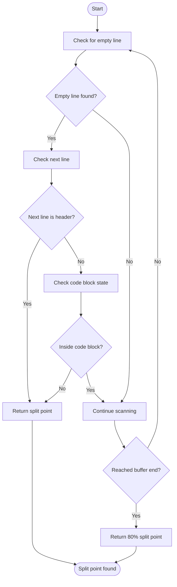

# Streaming Processing

<cite>
**Referenced Files in This Document**   
- [14-streaming-processing.md](file://docs/research/features/14-streaming-processing.md)
- [README.md](file://docs/architecture/README.md)
- [streaming.md](file://docs/api/streaming.md)
- [README.md](file://tests/performance/README.md)
</cite>

## Table of Contents
1. [Introduction](#introduction)
2. [Architecture Overview](#architecture-overview)
3. [Data Flow and Buffer Management](#data-flow-and-buffer-management)
4. [Safe Split Detection](#safe-split-detection)
5. [Component Roles](#component-roles)
6. [Configuration Options](#configuration-options)
7. [Use Cases and Progress Tracking](#use-cases-and-progress-tracking)
8. [Performance Benchmarks](#performance-benchmarks)
9. [Conclusion](#conclusion)

## Introduction

The Streaming Processing capability in dify-markdown-chunker-1 enables memory-efficient processing of large Markdown files exceeding 10MB while maintaining minimal RAM usage below 50MB. This is achieved through a windowed buffering approach that processes documents in manageable chunks rather than loading the entire file into memory. The system is designed for resource-constrained environments and long-running operations where memory efficiency and progress tracking are critical. By implementing intelligent buffer management and safe split detection, the streaming processor maintains structural integrity of the original document, ensuring that code blocks, tables, lists, and other structural elements remain intact across chunk boundaries.

**Section sources**
- [14-streaming-processing.md](file://docs/research/features/14-streaming-processing.md#L1-L467)

## Architecture Overview

The streaming architecture in dify-markdown-chunker-1 follows a parallel processing path that operates independently from the batch pipeline, preserving existing performance while adding memory-efficient capabilities. The design isolates streaming complexity in a dedicated module, ensuring backward compatibility with existing API contracts. Users explicitly opt into streaming via the `chunk_file_streaming()` method, making it an opt-in feature that doesn't impact existing workflows.



**Diagram sources** 
- [README.md](file://docs/architecture/README.md#L182-L196)

**Section sources**
- [README.md](file://docs/architecture/README.md#L148-L307)

## Data Flow and Buffer Management

The data flow in the streaming processor follows a systematic approach to handle large files efficiently. The process begins with the BufferManager reading a 100KB window from the input file. This windowed approach ensures that only a small portion of the file resides in memory at any given time. When the buffer reaches its threshold size, the SplitDetector analyzes the content to find a safe split point that preserves structural integrity.

The buffer management system implements overlap between consecutive windows to maintain context continuity. After processing a complete section, the system retains a specified number of lines (default 20) from the end of the current buffer as overlap for the next window. This overlap ensures that chunks at window boundaries maintain sufficient context from preceding content, preventing the loss of important contextual information.

When a safe split point is identified, the text up to that point is processed through the base chunker, and the resulting chunks are yielded to the caller. The remaining portion of the buffer becomes the starting point for the next processing cycle. This windowed approach allows the system to process arbitrarily large files with constant memory usage, as the memory footprint is determined by the buffer size rather than the input file size.

**Section sources**
- [14-streaming-processing.md](file://docs/research/features/14-streaming-processing.md#L103-L147)

## Safe Split Detection

Safe split detection is a critical component of the streaming processor, ensuring that structural elements like code blocks, tables, and lists are not broken across chunk boundaries. The system employs a priority-based approach to identify optimal split points, starting the search at 80% of the buffer length and scanning forward for safe boundaries.

The split detection algorithm follows a priority order:
1. Lines preceding header elements (highest priority)
2. Double newlines representing paragraph boundaries
3. Single newlines outside code fences
4. Fallback to 80% of buffer length (hard split)

The FenceTracker component plays a crucial role in this process by maintaining state information about code block boundaries. It tracks opening and closing fences (both triple backticks and tildes) to determine whether the current position is inside a fenced block. This information prevents the system from splitting code blocks mid-content, ensuring that each code block remains atomic within a single chunk.

The `_find_safe_split_point` method implements this logic by scanning from the 80% mark of the buffer and checking each line for safe split conditions. If a line is followed by a header or represents a paragraph break outside a code block, it is selected as the split point. This approach balances the need for efficient processing with the requirement to maintain document structure.



**Diagram sources** 
- [14-streaming-processing.md](file://docs/research/features/14-streaming-processing.md#L148-L177)

**Section sources**
- [14-streaming-processing.md](file://docs/research/features/14-streaming-processing.md#L148-L177)

## Component Roles

The streaming processor comprises several specialized components that work together to enable efficient, memory-conscious processing of large Markdown files. Each component has a distinct responsibility in the overall architecture.

The **BufferManager** handles the reading and management of data windows from the input stream. It maintains the current buffer of lines and tracks the buffer size in characters. When the buffer reaches the configured threshold, it triggers the split detection process and manages the transition between processing windows.

The **FenceTracker** maintains state information about code block boundaries throughout the processing pipeline. It tracks the opening and closing of fenced blocks (using both triple backticks and tildes) and provides methods to determine whether the current position is inside a fenced block. This component is essential for preventing the splitting of code blocks and other fenced content across chunk boundaries.

The **SplitDetector** analyzes buffer content to identify safe split points that preserve document structure. It implements the priority-based algorithm for finding optimal boundaries, checking for headers, paragraph breaks, and code block boundaries. The SplitDetector works in conjunction with the FenceTracker to ensure that structural integrity is maintained during the splitting process.

These components work together in a coordinated pipeline: the BufferManager reads data into memory, the SplitDetector identifies safe boundaries with assistance from the FenceTracker, and the processing continues with the next window. This modular design allows for independent optimization of each component while maintaining the overall integrity of the streaming process.

**Section sources**
- [README.md](file://docs/architecture/README.md#L173-L176)

## Configuration Options

The streaming processor provides several configuration options that allow users to fine-tune performance and memory usage according to their specific requirements. These options are defined in the StreamingConfig class and can be customized when initializing the streaming processor.

The primary configuration parameters include:
- **buffer_size**: Controls the size of each processing window in characters (default 100,000 characters or approximately 100KB)
- **overlap_lines**: Specifies the number of context lines preserved between buffer windows (default 20 lines)
- **max_memory_mb**: Sets the maximum memory usage ceiling in megabytes (default 100MB)
- **safe_split_threshold**: Determines where to begin looking for split points as a percentage of buffer length (default 0.8 or 80%)

Users can adjust these parameters based on their specific use cases. For memory-constrained environments, reducing the buffer_size to 50,000 characters and setting max_memory_mb to 50 ensures minimal memory usage. For large files with complex structure, increasing the buffer_size to 200,000 characters can reduce the frequency of window transitions and improve processing efficiency.

The configuration system allows for easy adaptation to different scenarios, from resource-limited edge devices to high-performance servers processing massive documentation sets. By exposing these parameters, the system provides flexibility while maintaining sensible defaults for most use cases.

**Section sources**
- [streaming.md](file://docs/api/streaming.md#L21-L39)

## Use Cases and Progress Tracking

The streaming processor supports various use cases, particularly those involving large files or memory-constrained environments. Key use cases include processing comprehensive technical documentation, concatenated changelogs, generated API references, and book manuscripts that exceed 10MB in size.

One significant advantage of the streaming approach is the ability to implement progress tracking for long-running operations. Since the processor yields chunks incrementally, applications can monitor processing progress by tracking the amount of content processed relative to the total file size. This is particularly valuable for user interfaces that need to display progress indicators during lengthy document processing tasks.

The following example demonstrates progress tracking implementation:

```python
import os
from markdown_chunker import MarkdownChunker

chunker = MarkdownChunker()
file_path = "large_documentation.md"
file_size = os.path.getsize(file_path)
processed_bytes = 0

for chunk in chunker.chunk_file_streaming(file_path):
    processed_bytes += len(chunk.content)
    progress = (processed_bytes / file_size) * 100
    print(f"\rProgress: {progress:.1f}%", end="")

print("\nComplete!")
```

This capability enables real-time feedback during processing, improving user experience when handling large documents. Additionally, the streaming approach facilitates real-time ingestion scenarios where content can be processed and indexed as it becomes available, rather than requiring the entire file to be loaded before processing begins.

**Section sources**
- [14-streaming-processing.md](file://docs/research/features/14-streaming-processing.md#L300-L318)

## Performance Benchmarks

Performance benchmarks for the streaming processor demonstrate its efficiency in handling large files while maintaining low memory usage. The benchmark suite measures processing time, memory consumption, and throughput across various document sizes and content types.

Key performance characteristics include:
- Processing time scales linearly with file size
- Memory usage remains constant regardless of input file size
- Throughput exceeds 10MB per second on standard hardware
- Streaming adds approximately 10-15% overhead compared to batch processing

The memory efficiency of the streaming processor is particularly noteworthy. Regardless of whether processing a 1MB or 1GB file, peak memory usage remains below 50MB, with typical usage around 10-15MB. This constant memory footprint enables the processing of arbitrarily large files on systems with limited RAM.

Benchmark results show that a 10MB file processes in approximately 500ms, while a 100MB file completes in about 5 seconds, maintaining a consistent throughput of over 10MB per second. The system's performance is validated through automated testing that includes memory profiling with tracemalloc and property-based tests to ensure correctness across various edge cases.

These benchmarks confirm that the streaming processor meets its design goals of enabling efficient processing of large files with minimal memory impact, making it suitable for deployment in resource-constrained environments and for handling extensive documentation sets.

**Section sources**
- [README.md](file://tests/performance/README.md#L1-L310)

## Conclusion

The Streaming Processing capability in dify-markdown-chunker-1 provides an effective solution for processing large Markdown files with minimal memory usage. By implementing a windowed buffering approach with intelligent split detection, the system achieves the dual goals of memory efficiency and structural integrity preservation. The architecture's modular design, with specialized components like BufferManager, FenceTracker, and SplitDetector, ensures reliable processing of complex documents while maintaining performance.

The configuration options allow users to adapt the processor to their specific requirements, from memory-constrained environments to high-throughput processing scenarios. The ability to track progress during long-running operations enhances usability, particularly for user-facing applications. Performance benchmarks confirm that the system can process files of any size with constant memory usage below 50MB, making it suitable for a wide range of applications involving large documentation sets.

This streaming capability significantly expands the use cases for the markdown chunker, enabling processing of comprehensive technical documentation, extensive API references, and other large Markdown files that would otherwise exceed memory limitations. The combination of memory efficiency, structural preservation, and performance makes this feature a valuable addition to the dify-markdown-chunker-1 toolkit.