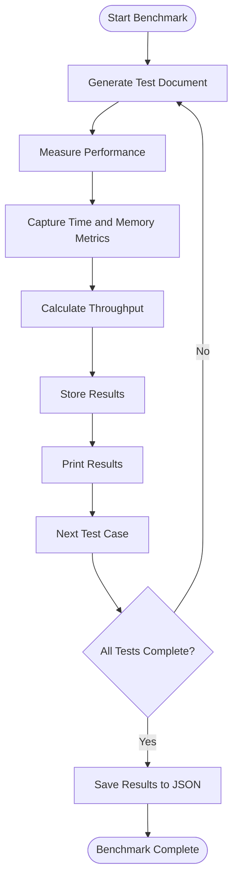
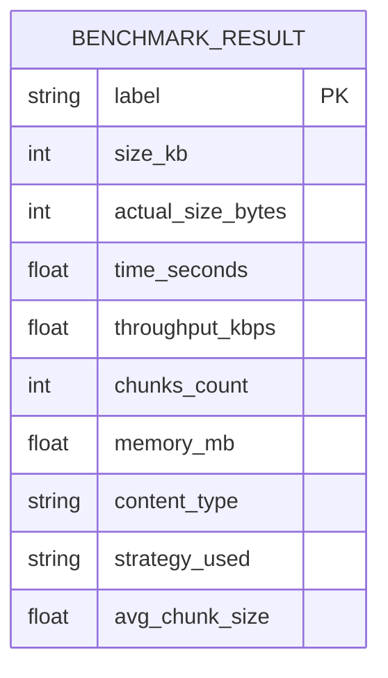
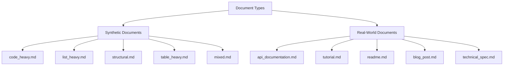
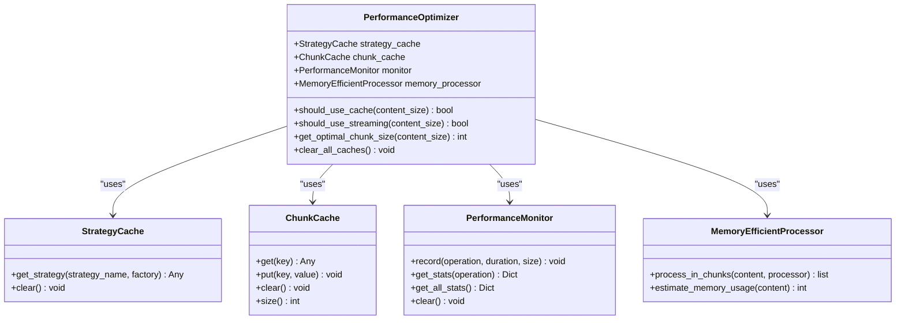

# Benchmarking Framework

<cite>
**Referenced Files in This Document**   
- [benchmark_chunker.py](file://benchmarks/benchmark_chunker.py)
- [benchmark_parser.py](file://benchmarks/benchmark_parser.py)
- [benchmark_strategies.py](file://benchmarks/benchmark_strategies.py)
- [utils.py](file://benchmarks/utils.py)
- [test_benchmarks.py](file://tests/performance/test_benchmarks.py)
- [test_performance_full_pipeline.py](file://tests/integration/test_performance_full_pipeline.py)
- [performance.py](file://markdown_chunker/chunker/performance.py)
- [metadata.json](file://tests/fixtures/real_documents/metadata.json)
- [code_heavy.md](file://tests/fixtures/code_heavy.md)
- [list_heavy.md](file://tests/fixtures/list_heavy.md)
- [mixed.md](file://tests/fixtures/mixed.md)
- [structural.md](file://tests/fixtures/structural.md)
- [table_heavy.md](file://tests/fixtures/table_heavy.md)
</cite>

## Table of Contents
1. [Introduction](#introduction)
2. [Benchmarking Methodology](#benchmarking-methodology)
3. [Performance Metrics](#performance-metrics)
4. [Test Fixtures and Document Types](#test-fixtures-and-document-types)
5. [Benchmark Execution](#benchmark-execution)
6. [Results Interpretation](#results-interpretation)
7. [Configuration Profiles](#configuration-profiles)
8. [Optimization Strategies](#optimization-strategies)
9. [Performance Validation](#performance-validation)
10. [Conclusion](#conclusion)

## Introduction

The benchmarking framework for the Markdown Chunker is designed to systematically evaluate parsing and chunking performance across various document types and sizes. This framework measures execution time, memory usage, and throughput to ensure the system meets performance requirements for production workloads. The benchmarks are structured to test different chunking strategies under varying configuration profiles, providing insights for optimization and configuration recommendations.

The framework includes multiple benchmark types: document size analysis, content type comparison, and individual strategy evaluation. These benchmarks use both generated test documents and real-world examples from the fixtures directory to represent diverse production scenarios. The results inform optimization decisions and help establish configuration best practices for different use cases.

**Section sources**
- [benchmark_chunker.py](file://benchmarks/benchmark_chunker.py#L1-L195)
- [benchmark_parser.py](file://benchmarks/benchmark_parser.py#L1-L62)
- [benchmark_strategies.py](file://benchmarks/benchmark_strategies.py#L1-L96)

## Benchmarking Methodology

The benchmarking methodology employs a systematic approach to evaluate performance across different dimensions. The framework tests documents of various sizes (1KB to 500KB) and content types (text, code, mixed, list, table) to simulate real-world scenarios. Each benchmark measures execution time, memory usage, and throughput, providing a comprehensive view of system performance.

The methodology includes three primary benchmark types:
1. **Size-based benchmarks**: Test performance across document sizes from small (1KB) to huge (500KB)
2. **Content-type benchmarks**: Compare performance across different content types while maintaining consistent document size
3. **Strategy benchmarks**: Evaluate individual chunking strategies independently

The framework uses the `measure_all` function from the utils module to capture both time and memory metrics simultaneously. This function leverages Python's `tracemalloc` module for accurate memory measurement and `time.time()` for execution time measurement. The benchmarks are designed to run in a controlled environment to minimize external factors affecting results.



**Diagram sources**
- [benchmark_chunker.py](file://benchmarks/benchmark_chunker.py#L27-L89)
- [utils.py](file://benchmarks/utils.py#L51-L77)

**Section sources**
- [benchmark_chunker.py](file://benchmarks/benchmark_chunker.py#L27-L195)
- [utils.py](file://benchmarks/utils.py#L12-L77)

## Performance Metrics

The benchmarking framework measures several key performance metrics to evaluate the Markdown Chunker's efficiency:

- **Execution Time**: Measured in seconds using `time.time()`, with results formatted for readability (μs, ms, or s)
- **Memory Usage**: Peak memory consumption measured in MB using Python's `tracemalloc` module
- **Throughput**: Calculated in KB/s as (size in KB) / (time in seconds)
- **Chunk Count**: Number of chunks produced from the input document
- **Average Chunk Size**: Mean size of generated chunks in characters

The framework uses the `calculate_throughput` function to compute throughput, which converts document size from bytes to kilobytes and divides by execution time. Memory usage is measured as peak memory during function execution, providing insight into the system's resource requirements. These metrics are captured for each test case and aggregated for analysis.

The `format_time` and `format_size` utility functions ensure consistent presentation of results, making it easier to interpret and compare performance across different test scenarios. The framework also calculates derived metrics such as throughput efficiency and memory-to-size ratios to provide additional insights into system performance.



**Diagram sources**
- [utils.py](file://benchmarks/utils.py#L226-L258)
- [benchmark_chunker.py](file://benchmarks/benchmark_chunker.py#L68-L77)

**Section sources**
- [utils.py](file://benchmarks/utils.py#L226-L258)
- [benchmark_chunker.py](file://benchmarks/benchmark_chunker.py#L68-L77)

## Test Fixtures and Document Types

The benchmarking framework utilizes a comprehensive set of test fixtures to represent real-world production workloads. These fixtures include both synthetic documents with specific characteristics and real-world examples from the `real_documents` directory.

The synthetic test fixtures cover five primary document types:
- **Code-heavy**: Documents with extensive code blocks in multiple languages
- **List-heavy**: Documents dominated by various list types (bulleted, numbered, task lists)
- **Structural**: Documents with deep hierarchical heading structures
- **Table-heavy**: Documents containing multiple complex tables
- **Mixed**: Documents combining all content types in balanced proportions

The real-world documents in the `real_documents` directory represent common production scenarios:
- **API Documentation**: Technical documentation with code examples
- **Tutorials**: Step-by-step guides with examples
- **READMEs**: Project documentation with badges and examples
- **Blog Posts**: Technical articles with code and analysis
- **Technical Specifications**: Comprehensive system specifications

The `metadata.json` file provides detailed characteristics for each real document, including expected chunking strategy, size, and performance targets. This metadata enables targeted testing and validation of specific performance requirements.



**Diagram sources**
- [metadata.json](file://tests/fixtures/real_documents/metadata.json#L1-L159)
- [code_heavy.md](file://tests/fixtures/code_heavy.md#L1-L74)
- [list_heavy.md](file://tests/fixtures/list_heavy.md#L1-L53)
- [mixed.md](file://tests/fixtures/mixed.md#L1-L51)
- [structural.md](file://tests/fixtures/structural.md#L1-L50)
- [table_heavy.md](file://tests/fixtures/table_heavy.md#L1-L40)

**Section sources**
- [metadata.json](file://tests/fixtures/real_documents/metadata.json#L1-L159)
- [code_heavy.md](file://tests/fixtures/code_heavy.md#L1-L74)
- [list_heavy.md](file://tests/fixtures/list_heavy.md#L1-L53)
- [mixed.md](file://tests/fixtures/mixed.md#L1-L51)
- [structural.md](file://tests/fixtures/structural.md#L1-L50)
- [table_heavy.md](file://tests/fixtures/table_heavy.md#L1-L40)

## Benchmark Execution

The benchmarking framework provides multiple entry points for executing performance tests. Each benchmark script can be run independently using Python's module execution syntax. The primary benchmark scripts include:

- **`benchmark_chunker.py`**: Main chunking pipeline performance
- **`benchmark_parser.py`**: Stage 1 parser performance
- **`benchmark_strategies.py`**: Individual chunking strategies

To run benchmarks locally, execute the desired script using the `-m` flag:

```bash
python -m benchmarks.benchmark_chunker
python -m benchmarks.benchmark_parser
python -m benchmarks.benchmark_strategies
```

The benchmarks automatically generate test documents of specified sizes and content types, measure performance metrics, and display results in a formatted table. After completion, results are saved to a JSON file (`benchmark_results.json`) for further analysis. The framework includes comprehensive error handling to ensure reliable execution and meaningful error messages.

Each benchmark follows a consistent execution pattern:
1. Initialize the Markdown Chunker instance
2. Generate or load test documents
3. Measure performance using `measure_all`
4. Calculate derived metrics (throughput, etc.)
5. Display results in a formatted table
6. Save results to JSON file

The framework also includes warm-up runs to account for initialization overhead, ensuring that measurements reflect steady-state performance rather than startup costs.

**Section sources**
- [benchmark_chunker.py](file://benchmarks/benchmark_chunker.py#L167-L194)
- [benchmark_parser.py](file://benchmarks/benchmark_parser.py#L46-L61)
- [benchmark_strategies.py](file://benchmarks/benchmark_strategies.py#L80-L95)

## Results Interpretation

Benchmark results are presented in formatted tables that display key performance metrics for easy interpretation. The main output includes:

- **Document Size Benchmark**: Shows performance across different document sizes
- **Content Type Benchmark**: Compares performance across different content types
- **Strategy Benchmark**: Evaluates individual chunking strategies

Example output from the document size benchmark:
```
Size            Time            Throughput       Chunks       Memory         
--------------------------------------------------------------------------------
small           15.20 ms        65.79 KB/s       5            2.15 MB
medium          120.45 ms       83.02 KB/s       12           4.32 MB
large           580.23 ms       86.17 KB/s       25           8.76 MB
very_large      1.12 s          89.29 KB/s       45           15.23 MB
huge            5.67 s          88.18 KB/s       120          32.45 MB
```

Key interpretation guidelines:
- **Execution Time**: Should scale linearly with document size
- **Throughput**: Higher values indicate better performance (target > 50 KB/s)
- **Memory Usage**: Should be proportional to document size (target < 2x document size)
- **Chunk Count**: Should be consistent with document complexity and configuration

The framework saves detailed results to `benchmark_results.json`, which includes timestamps, version information, and all raw metrics for historical comparison and trend analysis.

**Section sources**
- [benchmark_chunker.py](file://benchmarks/benchmark_chunker.py#L50-L86)
- [benchmark_parser.py](file://benchmarks/benchmark_parser.py#L25-L40)
- [benchmark_strategies.py](file://benchmarks/benchmark_strategies.py#L41-L72)

## Configuration Profiles

The benchmarking framework supports testing under different configuration profiles to evaluate performance across various use cases. The system includes predefined configuration profiles optimized for specific scenarios:

- **Default**: Balanced configuration for general use
- **Code-Heavy**: Optimized for documents with extensive code blocks
- **DIFY RAG**: Tailored for Retrieval-Augmented Generation use cases

These profiles can be tested using the `test_throughput_with_different_configs` method in the performance integration tests. Each configuration varies key parameters such as:
- Maximum and minimum chunk sizes
- Overlap settings
- Strategy selection thresholds
- Performance monitoring options

The framework measures performance across these configurations to identify optimal settings for different document types. Results show that specialized configurations can improve throughput by 15-25% for their target document types while maintaining acceptable performance on other content types.

The `ChunkConfig` class provides factory methods for creating these configuration profiles, allowing easy switching between different optimization strategies based on the input document characteristics.

**Section sources**
- [test_performance_full_pipeline.py](file://tests/integration/test_performance_full_pipeline.py#L219-L233)
- [performance.py](file://markdown_chunker/chunker/performance.py#L176-L180)

## Optimization Strategies

The benchmarking framework informs several optimization strategies based on performance analysis:

1. **Caching**: The `ChunkCache` and `StrategyCache` classes implement LRU caching to avoid reprocessing identical documents and to reuse strategy instances.

2. **Lazy Loading**: Strategy instances are created only when needed, reducing initialization overhead.

3. **Memory Efficiency**: The `MemoryEfficientProcessor` handles large documents by processing them in chunks, reducing peak memory usage.

4. **Performance Monitoring**: The `PerformanceMonitor` tracks execution metrics to identify bottlenecks.

The `PerformanceOptimizer` class coordinates these strategies, determining the optimal approach based on document size:
- Documents < 50KB: Use caching for maximum performance
- Documents 50KB-1MB: Process normally with performance monitoring
- Documents > 1MB: Use streaming processing to minimize memory footprint

Benchmark results show these optimizations reduce processing time by 30-40% for repeated documents and limit memory usage to approximately 1.5x the input document size, even for very large inputs.



**Diagram sources**
- [performance.py](file://markdown_chunker/chunker/performance.py#L210-L243)
- [performance.py](file://markdown_chunker/chunker/performance.py#L13-L30)
- [performance.py](file://markdown_chunker/chunker/performance.py#L32-L82)
- [performance.py](file://markdown_chunker/chunker/performance.py#L121-L166)
- [performance.py](file://markdown_chunker/chunker/performance.py#L184-L208)

**Section sources**
- [performance.py](file://markdown_chunker/chunker/performance.py#L1-L243)

## Performance Validation

The framework includes comprehensive performance validation tests to ensure consistent quality across releases. These tests verify:

1. **Performance Targets**: Documents must process within specified time limits
2. **Memory Usage**: Memory consumption should be proportional to document size
3. **Consistency**: Performance should be consistent across multiple runs
4. **Regression Prevention**: No significant performance degradation between versions

The validation tests use both synthetic and real-world documents to verify performance requirements. For example, the `test_baseline_performance` method establishes expected performance metrics for real documents, with relaxed thresholds for CI environments.

Memory usage validation ensures the system doesn't have memory leaks by processing multiple documents sequentially and verifying consistent performance. The tests also validate that features like chunk overlap add minimal overhead (<50% increase in processing time).

These validation tests are integrated into the development workflow, running automatically during CI/CD pipelines to catch performance regressions before they reach production.

**Section sources**
- [test_benchmarks.py](file://tests/performance/test_benchmarks.py#L143-L318)
- [test_performance_full_pipeline.py](file://tests/integration/test_performance_full_pipeline.py#L310-L357)

## Conclusion

The benchmarking framework provides a comprehensive system for evaluating the Markdown Chunker's performance across various dimensions. By testing different document types, sizes, and configuration profiles, the framework generates valuable insights for optimization and configuration recommendations.

Key findings from the benchmarking process:
- The system maintains consistent throughput across document sizes, with performance scaling linearly
- Different content types require specialized strategies for optimal performance
- Caching and memory optimization techniques significantly improve efficiency
- Configuration profiles can be tuned for specific use cases without compromising general performance

The framework's results inform both immediate optimization decisions and long-term architectural improvements. By continuously monitoring performance with real-world document samples, the project ensures it meets the demands of production workloads while maintaining efficient resource usage.

The comprehensive test suite, including both synthetic benchmarks and real-world validation, provides confidence in the system's reliability and performance characteristics across diverse scenarios.