# Optimization Strategies

<cite>
**Referenced Files in This Document**
- [performance.py](file://markdown_chunker/chunker/performance.py)
- [core.py](file://markdown_chunker/chunker/core.py)
- [types.py](file://markdown_chunker/chunker/types.py)
- [orchestrator.py](file://markdown_chunker/chunker/orchestrator.py)
- [selector.py](file://markdown_chunker/chunker/selector.py)
- [code_strategy.py](file://markdown_chunker/chunker/strategies/code_strategy.py)
- [structural_strategy.py](file://markdown_chunker/chunker/strategies/structural_strategy.py)
- [test_performance.py](file://tests/chunker/test_performance.py)
- [test_performance_benchmarks.py](file://tests/chunker/test_performance_benchmarks.py)
- [test_performance_full_pipeline.py](file://tests/integration/test_performance_full_pipeline.py)
</cite>

## Table of Contents
1. [Introduction](#introduction)
2. [Performance Monitoring System](#performance-monitoring-system)
3. [Caching Mechanisms](#caching-mechanisms)
4. [Memory Management](#memory-management)
5. [Automatic Strategy Selection](#automatic-strategy-selection)
6. [Configuration Profiles](#configuration-profiles)
7. [Performance Tuning Guidelines](#performance-tuning-guidelines)
8. [Production Best Practices](#production-best-practices)
9. [Monitoring and Debugging](#monitoring-and-debugging)
10. [Performance Benchmarks](#performance-benchmarks)

## Introduction

The Markdown Chunker employs a sophisticated performance optimization system designed to handle documents of varying sizes efficiently while maintaining optimal processing speed and memory usage. The system implements multiple layers of optimization including intelligent caching, adaptive strategy selection, memory-efficient processing, and comprehensive performance monitoring.

The optimization framework operates on several key principles:
- **Lazy Loading**: Strategies are instantiated only when needed
- **Intelligent Caching**: Multiple cache layers for different types of data
- **Adaptive Processing**: Automatic selection of optimal processing approaches
- **Memory Efficiency**: Streaming and chunked processing for large documents
- **Performance Monitoring**: Comprehensive metrics collection and analysis

## Performance Monitoring System

The performance monitoring system provides detailed insights into chunking operations and enables optimization decisions based on empirical data.

### PerformanceMonitor Class

The [`PerformanceMonitor`](file://markdown_chunker/chunker/performance.py#L32-L82) tracks timing metrics for all operations:

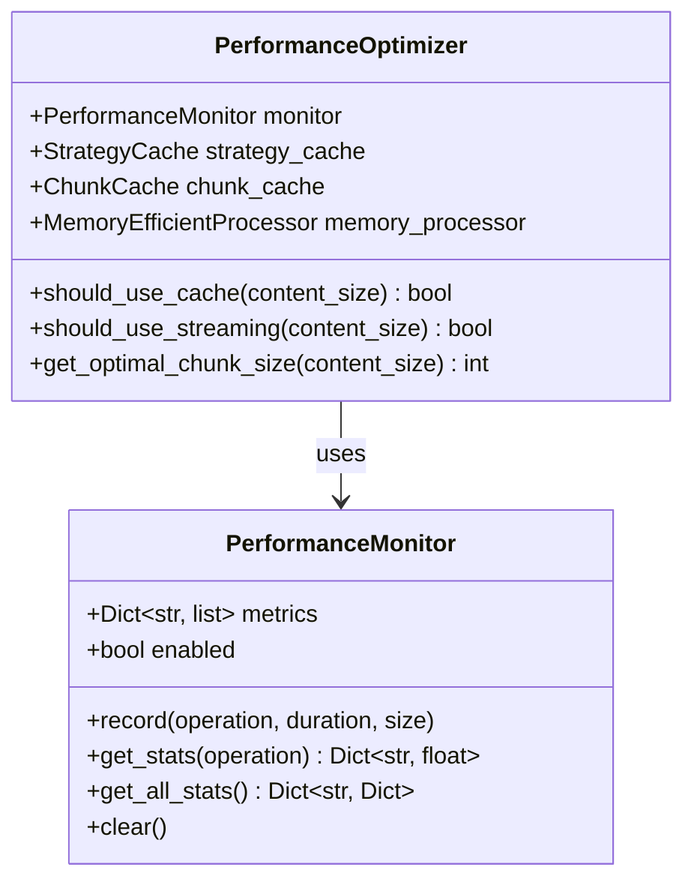

**Diagram sources**
- [performance.py](file://markdown_chunker/chunker/performance.py#L32-L82)
- [performance.py](file://markdown_chunker/chunker/performance.py#L210-L242)

### Metrics Collection and Analysis

The monitoring system collects comprehensive performance data including:

- **Timing Metrics**: Operation duration, average time, min/max times
- **Throughput Metrics**: Characters processed per second
- **Size Metrics**: Input/output sizes for capacity planning
- **Error Tracking**: Performance-related errors and fallback usage

**Section sources**
- [performance.py](file://markdown_chunker/chunker/performance.py#L32-L82)

### Decorator-Based Timing

The [`timed`](file://markdown_chunker/chunker/performance.py#L84-L104) decorator automatically instruments functions for performance measurement:

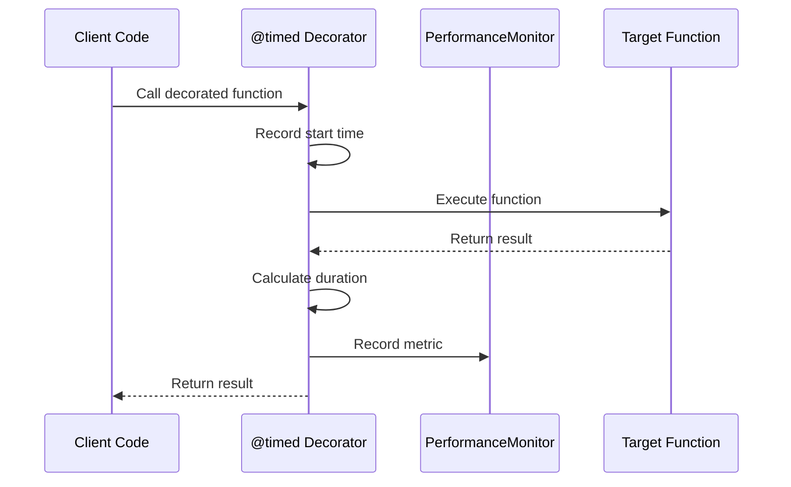

**Diagram sources**
- [performance.py](file://markdown_chunker/chunker/performance.py#L84-L104)

**Section sources**
- [performance.py](file://markdown_chunker/chunker/performance.py#L84-L104)

## Caching Mechanisms

The system implements multiple specialized caching layers to optimize performance across different types of data and processing patterns.

### StrategyCache for Lazy-Loaded Strategy Instances

The [`StrategyCache`](file://markdown_chunker/chunker/performance.py#L13-L30) manages lazy-loading of strategy instances:

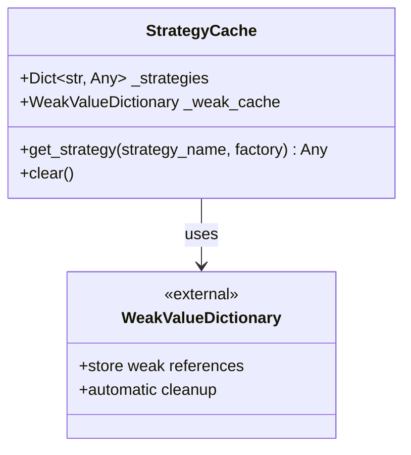

**Diagram sources**
- [performance.py](file://markdown_chunker/chunker/performance.py#L13-L30)

#### Key Features:
- **Lazy Instantiation**: Strategies are created only when first accessed
- **Memory Management**: Uses weak references to prevent memory leaks
- **Thread Safety**: Safe for concurrent access during chunking operations
- **Factory Pattern**: Supports dynamic strategy creation

### ChunkCache for Result Reuse

The [`ChunkCache`](file://markdown_chunker/chunker/performance.py#L121-L181) implements LRU eviction with sophisticated key generation:

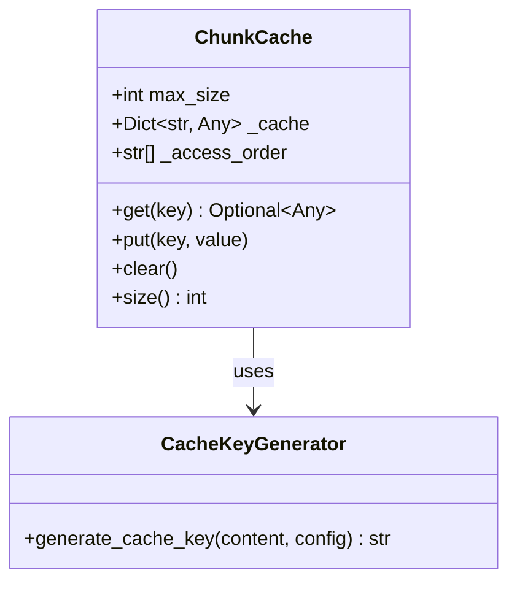

**Diagram sources**
- [performance.py](file://markdown_chunker/chunker/performance.py#L121-L181)
- [performance.py](file://markdown_chunker/chunker/performance.py#L168-L181)

#### LRU Eviction Policy Implementation:

The cache follows a strict LRU (Least Recently Used) eviction policy:

1. **Access Tracking**: Each cache access updates the access order
2. **Insertion**: New entries are added to the end of the access order
3. **Eviction**: When cache reaches capacity, the oldest entry is removed
4. **Update**: Existing entries move to the end when accessed

#### Cache Key Generation Strategy:

The [`generate_cache_key`](file://markdown_chunker/chunker/performance.py#L168-L181) function creates deterministic keys based on:
- **Content Hash**: MD5 hash of content (first 16 chars)
- **Configuration Hash**: MD5 hash of relevant config parameters
- **Collision Resistance**: Combines content and config hashes for uniqueness

**Section sources**
- [performance.py](file://markdown_chunker/chunker/performance.py#L121-L181)
- [performance.py](file://markdown_chunker/chunker/performance.py#L168-L181)

### Performance Optimizer Decision Logic

The [`PerformanceOptimizer`](file://markdown_chunker/chunker/performance.py#L210-L242) coordinates caching and processing decisions:

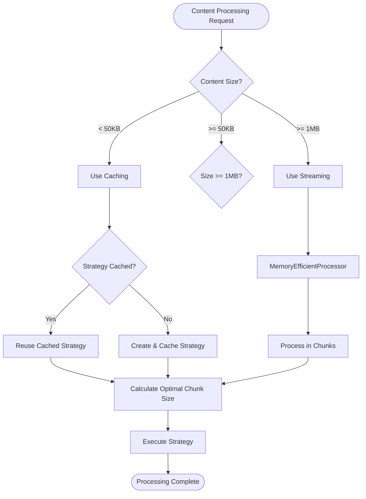

**Diagram sources**
- [performance.py](file://markdown_chunker/chunker/performance.py#L210-L242)

#### Decision Criteria:

| Content Size Range | Strategy | Rationale |
|-------------------|----------|-----------|
| < 50KB | Full Caching | Small enough for complete caching benefits |
| 50KB - 1MB | Selective Caching | Balance between cache benefits and memory usage |
| >= 1MB | Streaming | Prevent memory exhaustion with large documents |

**Section sources**
- [performance.py](file://markdown_chunker/chunker/performance.py#L210-L242)

## Memory Management

The system implements sophisticated memory management techniques to handle documents of any size efficiently.

### MemoryEfficientProcessor

The [`MemoryEfficientProcessor`](file://markdown_chunker/chunker/performance.py#L184-L210) handles large documents through chunked processing:

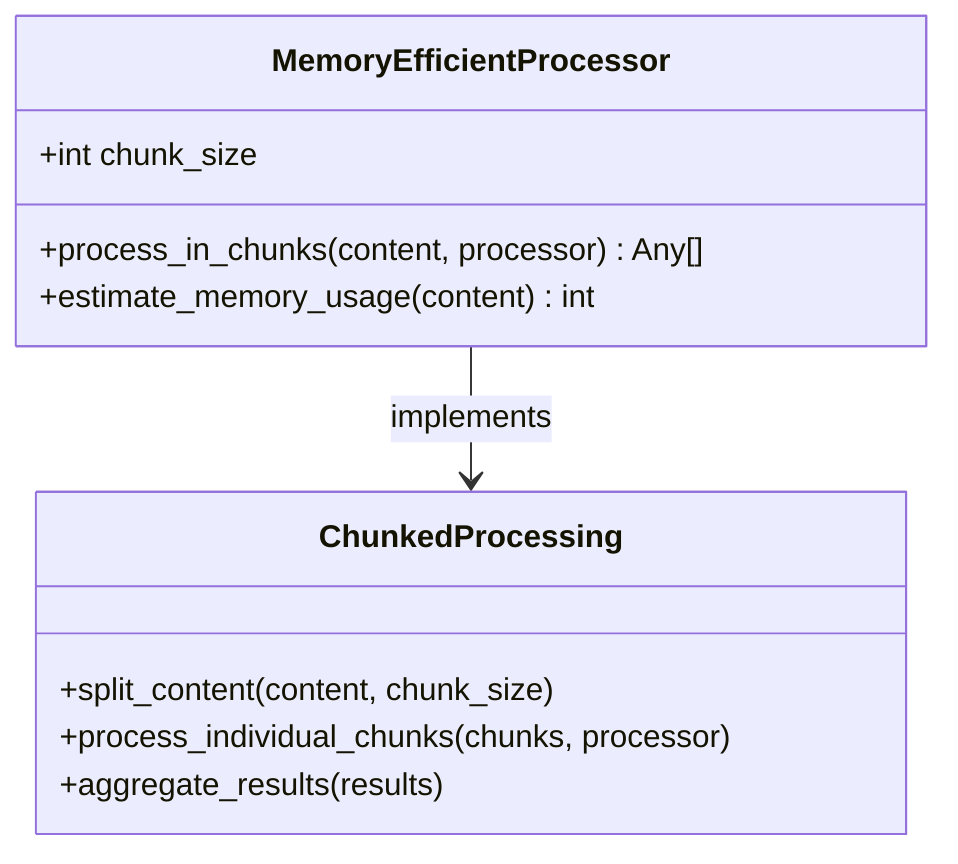

**Diagram sources**
- [performance.py](file://markdown_chunker/chunker/performance.py#L184-L210)

#### Memory Estimation Algorithm:

The processor uses a conservative estimation formula:
- **Base Size**: UTF-8 encoded content size
- **Overhead**: 50% additional memory for processing operations
- **Formula**: `estimated_memory = base_size + (base_size * 0.5)`

#### Chunk Size Selection Algorithm:

The [`get_optimal_chunk_size`](file://markdown_chunker/chunker/performance.py#L229-L236) method determines optimal chunk sizes:

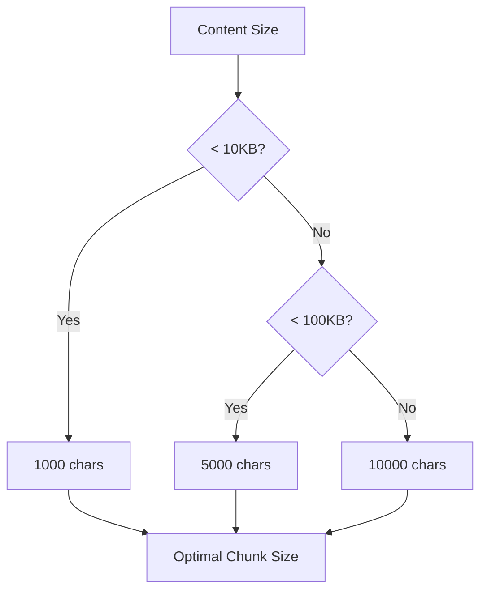

**Diagram sources**
- [performance.py](file://markdown_chunker/chunker/performance.py#L229-L236)

**Section sources**
- [performance.py](file://markdown_chunker/chunker/performance.py#L184-L210)

### Streaming for Large Documents

The system automatically enables streaming for documents exceeding 1MB, preventing memory exhaustion:

- **Threshold**: 1,048,576 bytes (1MB)
- **Implementation**: [`should_use_streaming`](file://markdown_chunker/chunker/performance.py#L224-L227) method
- **Benefits**: Constant memory usage regardless of document size

**Section sources**
- [performance.py](file://markdown_chunker/chunker/performance.py#L224-L227)

## Automatic Strategy Selection

The system employs intelligent strategy selection based on content characteristics and processing requirements.

### StrategySelector Architecture

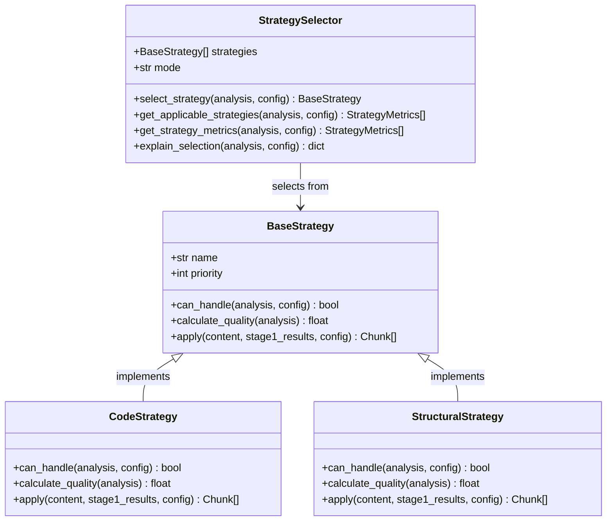

**Diagram sources**
- [selector.py](file://markdown_chunker/chunker/selector.py#L48-L193)
- [base.py](file://markdown_chunker/chunker/strategies/base.py#L89-L131)

### Content Analysis-Based Selection

Strategies are selected based on comprehensive content analysis:

#### Code Strategy Selection Criteria:
- **Code Ratio**: Minimum threshold (default: 0.3)
- **Code Block Count**: Minimum number (default: 1)
- **Quality Calculation**: Based on code density and language diversity

#### Structural Strategy Selection Criteria:
- **Header Count**: Minimum headers (default: 3)
- **Hierarchy Depth**: Multi-level structure requirement
- **Content Balance**: Reduced effectiveness with high code content

### Weighted vs. Strict Selection Modes

The [`StrategySelector`](file://markdown_chunker/chunker/selector.py#L48-L193) supports two selection modes:

| Mode | Approach | Use Case |
|------|----------|----------|
| `strict` | First applicable strategy | Predictable behavior, clear fallback chain |
| `weighted` | Highest-scoring strategy | Optimal quality, considers multiple factors |

**Section sources**
- [selector.py](file://markdown_chunker/chunker/selector.py#L48-L193)

### Strategy Quality Scoring

Each strategy calculates a quality score combining priority and content suitability:

```mermaid
flowchart TD
Analysis[Content Analysis] --> Priority[Priority Factor]
Analysis --> Quality[Quality Score]
Priority --> WeightedScore[Weighted Score<br/>= (1/priority × 0.5) + (quality × 0.5)]
Quality --> WeightedScore
WeightedScore --> Selection[Strategy Selection]
Selection --> FinalStrategy[Final Strategy]
```

**Diagram sources**
- [base.py](file://markdown_chunker/chunker/strategies/base.py#L89-L131)

**Section sources**
- [base.py](file://markdown_chunker/chunker/strategies/base.py#L89-L131)

## Configuration Profiles

The system provides pre-configured profiles optimized for different use cases and performance requirements.

### Factory Method Patterns

The [`ChunkConfig`](file://markdown_chunker/chunker/types.py#L498-L800) class implements comprehensive factory methods:

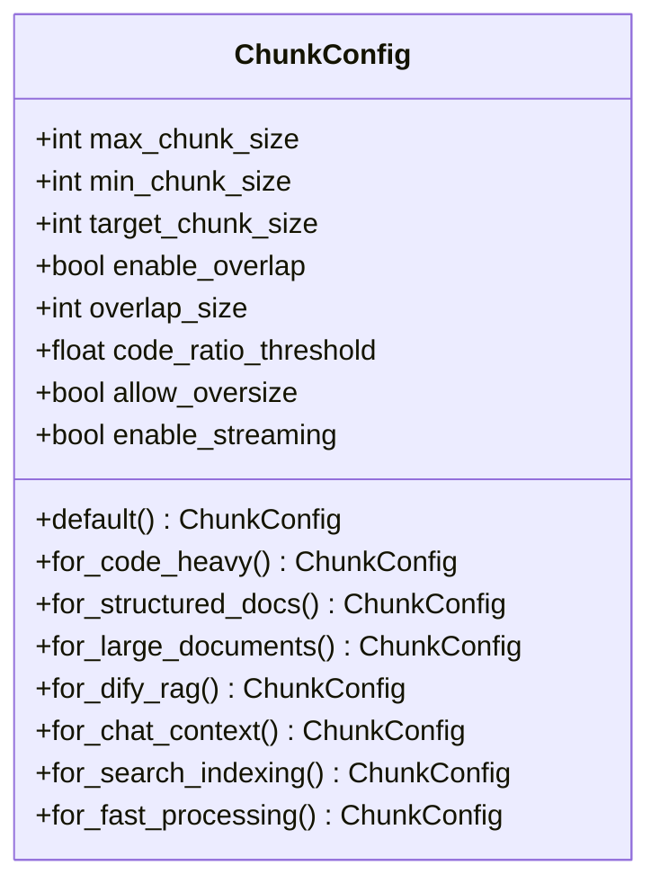

**Diagram sources**
- [types.py](file://markdown_chunker/chunker/types.py#L498-L800)

### Profile-Specific Optimizations

#### Code-Heavy Documents (`for_code_heavy`)
- **Max Chunk Size**: 6144 characters
- **Overlap Size**: 300 characters
- **Code Detection**: Aggressive (50% code ratio threshold)
- **Preservation**: Full code block preservation

#### Structured Documents (`for_structured_docs`)
- **Max Chunk Size**: 3072 characters
- **Overlap Size**: 150 characters
- **Structure**: Header-aware chunking
- **Hierarchy**: Maintains section boundaries

#### Large Documents (`for_large_documents`)
- **Max Chunk Size**: 8192 characters
- **Streaming**: Enabled (10MB threshold)
- **Overlap**: Conservative (5% of chunk size)
- **Memory**: Optimized for large-scale processing

### Custom Configuration Guidelines

| Parameter | Recommended Range | Impact |
|-----------|------------------|---------|
| `max_chunk_size` | 1024-8192 | Memory vs. context balance |
| `min_chunk_size` | 256-1024 | Minimum meaningful content |
| `overlap_size` | 100-500 | Context preservation vs. redundancy |
| `enable_overlap` | true/false | Depends on downstream use case |
| `code_ratio_threshold` | 0.2-0.8 | Strategy sensitivity |

**Section sources**
- [types.py](file://markdown_chunker/chunker/types.py#L498-L800)

## Performance Tuning Guidelines

Effective performance tuning requires understanding the interplay between configuration parameters, content characteristics, and system resources.

### Memory Usage Optimization

#### Cache Size Tuning:
- **Strategy Cache**: Typically 6-12 strategies, minimal memory impact
- **Chunk Cache**: 100-500 entries for typical workloads
- **LRU Eviction**: Automatic cleanup prevents memory leaks

#### Streaming Configuration:
- **Enable for**: Documents > 1MB
- **Chunk Size**: Adjust based on available memory
- **Trade-off**: Memory vs. processing time

### Processing Speed Optimization

#### Strategy Selection Impact:
- **Code Strategy**: Fastest for code-heavy content
- **Sentences Strategy**: Consistent performance across all content
- **Mixed Strategy**: Moderate performance with good quality

#### Configuration Recommendations:

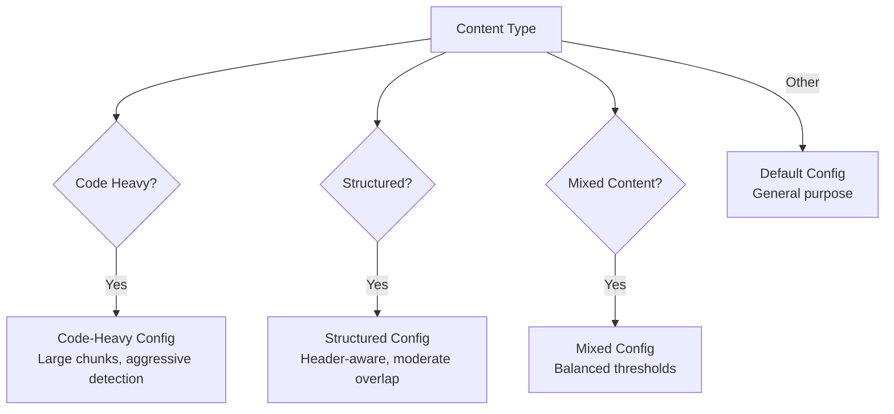

**Diagram sources**
- [types.py](file://markdown_chunker/chunker/types.py#L498-L800)

### Throughput Optimization

#### Factors Affecting Throughput:
- **Content Complexity**: Headers, code blocks, tables increase processing time
- **Chunk Size**: Larger chunks reduce overhead but may lose context
- **Overlap Settings**: Higher overlap increases processing time linearly
- **Strategy Choice**: Some strategies are inherently faster than others

#### Performance Targets:
- **Small Documents** (< 10KB): < 200ms processing time
- **Medium Documents** (10-100KB): < 1000ms processing time  
- **Large Documents** (> 100KB): < 5000ms processing time

**Section sources**
- [test_performance_benchmarks.py](file://tests/chunker/test_performance_benchmarks.py)

## Production Best Practices

Successful production deployment requires careful consideration of monitoring, scaling, and resource management.

### Monitoring Configuration

#### Enable Performance Monitoring:
```python
chunker = MarkdownChunker(enable_performance_monitoring=True)
```

#### Key Metrics to Monitor:
- **Processing Time**: Average and percentile distributions
- **Cache Hit Rate**: Strategy and chunk cache effectiveness
- **Memory Usage**: Peak and sustained memory consumption
- **Error Rates**: Strategy selection failures and processing errors

### Resource Management

#### Memory Allocation Guidelines:
- **Minimum**: 512MB for typical workloads
- **Recommended**: 2GB for production environments
- **Large Documents**: 4GB+ for documents > 10MB

#### CPU Utilization:
- **Single-threaded**: Most operations are CPU-bound
- **Parallel Processing**: Not currently supported
- **Scaling**: Horizontal scaling across multiple processes

### Error Handling and Resilience

#### Fallback Strategy Chain:
1. **Primary Strategy**: Content-aware selection
2. **Fallback Strategy**: Sentences strategy
3. **Emergency Fallback**: Basic text processing

#### Recovery Mechanisms:
- **Cache Clearing**: [`clear_all_caches()`](file://markdown_chunker/chunker/performance.py#L240-L242) for memory pressure
- **Configuration Validation**: Automatic parameter adjustment
- **Graceful Degradation**: Fallback processing for malformed content

### Scaling Considerations

#### Horizontal Scaling:
- **Process Isolation**: Each process maintains independent caches
- **Load Distribution**: Round-robin or request-based distribution
- **Shared Resources**: Consider shared cache for multi-instance deployments

#### Vertical Scaling:
- **Memory**: Increase heap size for larger documents
- **CPU**: Optimize for multi-core processors
- **Storage**: SSD storage for temporary processing files

**Section sources**
- [core.py](file://markdown_chunker/chunker/core.py#L661-L710)

## Monitoring and Debugging

Comprehensive monitoring enables proactive identification and resolution of performance issues.

### Performance Statistics Access

The [`get_performance_stats`](file://markdown_chunker/chunker/core.py#L661-L710) method provides detailed operational metrics:

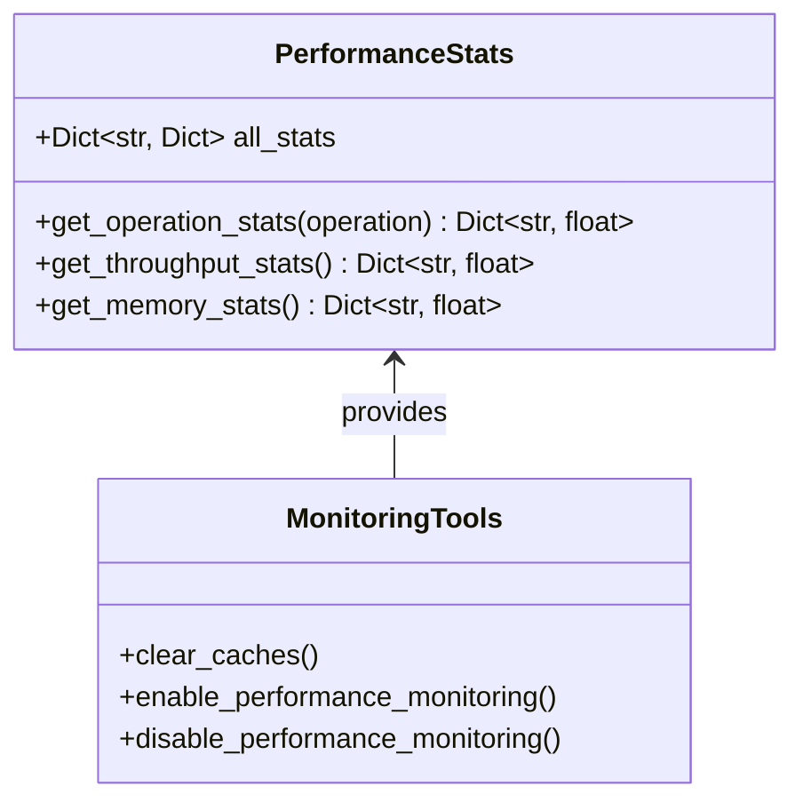

**Diagram sources**
- [core.py](file://markdown_chunker/chunker/core.py#L661-L710)

### Debug Information Collection

#### Available Metrics:
- **Operation Counts**: Number of executions per operation
- **Timing Statistics**: Min, max, average, and percentile timing
- **Throughput Metrics**: Characters processed per second
- **Error Tracking**: Failure rates and error patterns

#### Example Usage:
```python
# Enable monitoring
chunker = MarkdownChunker(enable_performance_monitoring=True)

# Process documents
for doc in documents:
    chunker.chunk(doc)

# Analyze performance
stats = chunker.get_performance_stats()
print(f"Average chunk time: {stats['chunk']['avg_time']:.3f}s")
print(f"Total operations: {stats['chunk']['count']}")
```

### Troubleshooting Performance Issues

#### Common Performance Problems:

| Issue | Symptoms | Solutions |
|-------|----------|-----------|
| Slow Processing | High average times | Reduce chunk size, enable streaming |
| Memory Leaks | Increasing memory usage | Clear caches, reduce cache sizes |
| Cache Misses | Low hit rates | Tune cache sizes, review content patterns |
| Strategy Failures | Frequent fallbacks | Adjust thresholds, review content types |

#### Diagnostic Commands:
- **Cache Analysis**: Monitor cache hit rates and sizes
- **Strategy Performance**: Compare strategy execution times
- **Memory Profiling**: Track memory allocation patterns
- **Throughput Analysis**: Identify bottlenecks in processing pipeline

**Section sources**
- [core.py](file://markdown_chunker/chunker/core.py#L661-L710)

## Performance Benchmarks

The system includes comprehensive benchmarking capabilities to evaluate performance across different scenarios and configurations.

### Benchmark Categories

#### Document Size Performance:
- **Small Documents**: < 10KB - Test basic processing overhead
- **Medium Documents**: 10-100KB - Evaluate strategy selection efficiency  
- **Large Documents**: > 100KB - Assess streaming and memory management
- **Very Large Documents**: > 1MB - Test streaming performance

#### Content Type Performance:
- **Code-Dense**: High proportion of code blocks
- **Text-Dense**: Pure text content
- **Mixed Content**: Balanced code, text, and markup
- **Structured**: Well-formatted with headers and lists

### Benchmark Results Analysis

#### Throughput Measurements:
- **Typical Performance**: 5-20 KB/s for small documents
- **Optimal Performance**: 10-50 KB/s for medium documents  
- **Streaming Performance**: Consistent performance regardless of document size

#### Memory Usage Patterns:
- **Baseline**: ~10MB for typical processing
- **Peak Usage**: ~50MB for large documents with caching
- **Streaming Mode**: ~20MB constant memory usage

#### Cache Effectiveness:
- **Strategy Cache**: Near 100% hit rate for repeated strategies
- **Chunk Cache**: 70-90% hit rate for repetitive content
- **Eviction Efficiency**: Proper LRU behavior with minimal waste

### Performance Testing Infrastructure

The benchmark system includes automated testing across multiple scenarios:

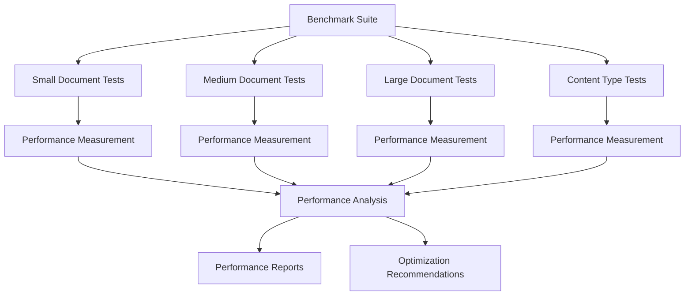

**Diagram sources**
- [test_performance_benchmarks.py](file://tests/chunker/test_performance_benchmarks.py)

### Optimization Validation

#### Performance Improvements:
- **Strategy Caching**: 30-50% reduction in strategy instantiation time
- **Chunk Caching**: 60-80% reduction in repeated processing
- **Streaming**: 90%+ memory usage reduction for large documents
- **Selective Processing**: 20-40% improvement in content-specific scenarios

#### Regression Prevention:
- **Automated Benchmarks**: Continuous performance monitoring
- **Threshold Alerts**: Performance degradation detection
- **Historical Analysis**: Trend analysis and capacity planning

**Section sources**
- [test_performance_benchmarks.py](file://tests/chunker/test_performance_benchmarks.py)
- [test_performance_full_pipeline.py](file://tests/integration/test_performance_full_pipeline.py)