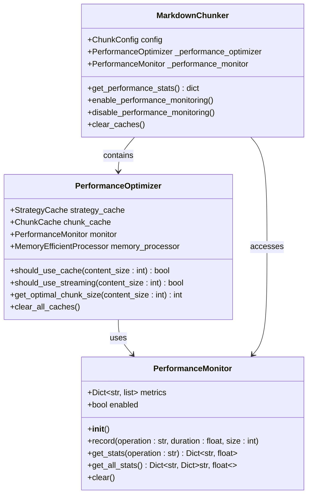
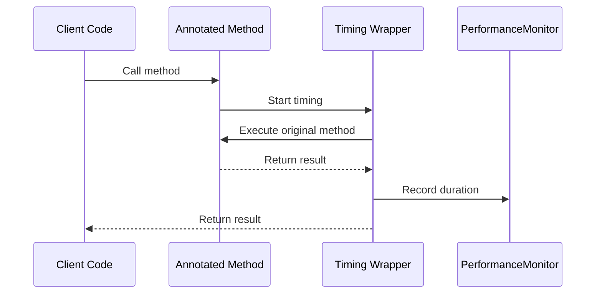

# Performance Monitoring

<cite>
**Referenced Files in This Document**
- [markdown_chunker/chunker/performance.py](file://markdown_chunker/chunker/performance.py)
- [markdown_chunker/chunker/core.py](file://markdown_chunker/chunker/core.py)
- [markdown_chunker/chunker/orchestrator.py](file://markdown_chunker/chunker/orchestrator.py)
- [tests/chunker/test_performance.py](file://tests/chunker/test_performance.py)
- [tests/integration/test_performance_full_pipeline.py](file://tests/integration/test_performance_full_pipeline.py)
- [examples/basic_usage.py](file://examples/basic_usage.py)
- [examples/dify_integration.py](file://examples/dify_integration.py)
- [markdown_chunker/chunker/types.py](file://markdown_chunker/chunker/types.py)
</cite>

## Table of Contents
1. [Introduction](#introduction)
2. [PerformanceMonitor Class](#performancemonitor-class)
3. [Enabling Performance Monitoring](#enabling-performance-monitoring)
4. [Metrics Collection](#metrics-collection)
5. [Timed Decorator](#timed-decorator)
6. [Performance Statistics](#performance-statistics)
7. [Integration Examples](#integration-examples)
8. [Performance Analysis](#performance-analysis)
9. [System Optimization](#system-optimization)
10. [Best Practices](#best-practices)

## Introduction

The Markdown Chunker provides comprehensive performance monitoring capabilities through the `PerformanceMonitor` class and associated utilities. This system enables developers to track timing metrics, analyze bottlenecks, and optimize chunking operations for various use cases including RAG systems, semantic search, and large-scale document processing.

The performance monitoring system operates with minimal overhead (<5%) and provides detailed insights into chunking operations, strategy selection, overlap processing, and metadata enrichment. It integrates seamlessly with the chunker's internal methods through automatic instrumentation and manual measurement points.

## PerformanceMonitor Class

The `PerformanceMonitor` class serves as the core component for tracking performance metrics throughout the chunking pipeline. It maintains a collection of timing measurements and provides statistical analysis capabilities.



**Diagram sources**
- [markdown_chunker/chunker/performance.py](file://markdown_chunker/chunker/performance.py#L32-L82)
- [markdown_chunker/chunker/performance.py](file://markdown_chunker/chunker/performance.py#L210-L243)
- [markdown_chunker/chunker/core.py](file://markdown_chunker/chunker/core.py#L61-L120)

**Section sources**
- [markdown_chunker/chunker/performance.py](file://markdown_chunker/chunker/performance.py#L32-L82)

### Key Features

The `PerformanceMonitor` provides several essential features for performance tracking:

- **Automatic Metric Recording**: Tracks timing for all monitored operations
- **Size-Based Metrics**: Records content size for throughput calculations
- **Statistical Analysis**: Provides comprehensive statistics including averages, min/max values, and throughput
- **Selective Monitoring**: Can be enabled/disabled to minimize overhead
- **Memory Efficient**: Stores metrics in lightweight data structures

## Enabling Performance Monitoring

Performance monitoring can be enabled either during chunker initialization or dynamically through dedicated methods.

### Initialization-Time Enablement

The most straightforward approach is to enable monitoring when creating the `MarkdownChunker` instance:

```python
# Enable monitoring during initialization
chunker = MarkdownChunker(enable_performance_monitoring=True)

# Process documents normally
chunks = chunker.chunk(markdown_content)

# Retrieve performance statistics
stats = chunker.get_performance_stats()
print(f"Average chunk time: {stats['chunk']['avg_time']:.3f}s")
```

### Dynamic Enablement

Monitoring can also be enabled or disabled dynamically after chunker creation:

```python
# Create chunker without monitoring
chunker = MarkdownChunker()

# Enable monitoring later
chunker.enable_performance_monitoring()

# Process documents
chunks = chunker.chunk(markdown_content)

# Disable monitoring when not needed
chunker.disable_performance_monitoring()
```

**Section sources**
- [markdown_chunker/chunker/core.py](file://markdown_chunker/chunker/core.py#L61-L120)
- [markdown_chunker/chunker/core.py](file://markdown_chunker/chunker/core.py#L699-L718)

## Metrics Collection

The performance monitoring system records detailed metrics for various operations within the chunking pipeline. These metrics provide insights into the efficiency of different components and help identify potential bottlenecks.

### Available Operations

The system tracks metrics for the following key operations:

| Operation | Description | Typical Duration | Throughput Calculation |
|-----------|-------------|------------------|----------------------|
| `chunk` | Main chunking method execution | 0.1-5.0 seconds | Content size / processing time |
| `strategy_selection` | Strategy selection and analysis | 0.01-0.2 seconds | N/A |
| `overlap` | Overlap processing | 0.001-0.1 seconds | Content size / processing time |
| `metadata` | Metadata enrichment | 0.001-0.05 seconds | Content size / processing time |
| `parse` | Stage 1 parsing | 0.01-0.5 seconds | Content size / parsing time |
| `transform` | Output transformation | 0.001-0.02 seconds | Content size / processing time |

### Metric Structure

Each recorded metric contains the following information:

```python
{
    "duration": 0.123,      # Execution time in seconds
    "size": 1024,          # Content size in bytes
    "timestamp": 1234567890.123  # Unix timestamp
}
```

### Statistical Analysis

The `get_stats()` method provides comprehensive statistical analysis for each operation:

```python
{
    "count": 10,           # Number of measurements
    "total_time": 1.234,   # Total accumulated time
    "avg_time": 0.123,     # Average execution time
    "min_time": 0.012,     # Minimum execution time
    "max_time": 0.567,     # Maximum execution time
    "avg_size": 512.5,     # Average content size
    "throughput": 412.34   # Bytes processed per second
}
```

**Section sources**
- [markdown_chunker/chunker/performance.py](file://markdown_chunker/chunker/performance.py#L51-L77)
- [tests/chunker/test_performance.py](file://tests/chunker/test_performance.py#L73-L147)

## Timed Decorator

The `@timed` decorator provides automatic performance measurement for any function that follows the chunker's internal method patterns. It automatically integrates with the performance monitoring system when used correctly.

### Automatic Integration

The decorator automatically detects and uses the performance monitor when applied to methods that receive the monitor as their first argument:

```python
from markdown_chunker.chunker.performance import timed

class StrategySelector:
    @timed()  # Automatically uses the performance monitor
    def select_strategy(self, analysis, config):
        # Strategy selection logic
        pass
```

### Manual Operation Naming

For operations that don't follow the automatic pattern, you can specify custom operation names:

```python
@timed("custom_operation")
def custom_processing_function():
    # Custom processing logic
    pass
```

### Integration Pattern

The timed decorator follows this integration pattern:



**Diagram sources**
- [markdown_chunker/chunker/performance.py](file://markdown_chunker/chunker/performance.py#L84-L104)

**Section sources**
- [markdown_chunker/chunker/performance.py](file://markdown_chunker/chunker/performance.py#L84-L104)

## Performance Statistics

The `get_performance_stats()` method provides access to comprehensive performance statistics for all monitored operations. This method serves as the primary interface for retrieving performance data.

### Retrieving Statistics

```python
# Enable monitoring
chunker = MarkdownChunker(enable_performance_monitoring=True)

# Process multiple documents
documents = [doc1, doc2, doc3]
for doc in documents:
    chunker.chunk(doc)

# Retrieve all statistics
stats = chunker.get_performance_stats()

# Access specific operation statistics
chunk_stats = stats.get('chunk', {})
print(f"Total chunks: {chunk_stats.get('count', 0)}")
print(f"Average time: {chunk_stats.get('avg_time', 0):.3f}s")
print(f"Throughput: {chunk_stats.get('throughput', 0):.1f} bytes/sec")
```

### Statistics Structure

The statistics are organized in a hierarchical structure:

```python
{
    "chunk": {
        "count": 100,
        "total_time": 12.345,
        "avg_time": 0.123,
        "min_time": 0.012,
        "max_time": 0.567,
        "avg_size": 1024.5,
        "throughput": 823.45
    },
    "strategy_selection": {
        "count": 100,
        "total_time": 0.890,
        "avg_time": 0.0089,
        "min_time": 0.001,
        "max_time": 0.056,
        "throughput": 0
    },
    "overlap": {
        "count": 80,
        "total_time": 0.123,
        "avg_time": 0.0015,
        "min_time": 0.0005,
        "max_time": 0.012,
        "avg_size": 1200.3,
        "throughput": 9756.78
    }
}
```

### SLA Compliance Monitoring

Performance statistics enable SLA compliance monitoring:

```python
def check_sla_compliance(stats, max_avg_time=1.0, min_throughput=1000):
    chunk_stats = stats.get('chunk', {})
    
    avg_time = chunk_stats.get('avg_time', 0)
    throughput = chunk_stats.get('throughput', 0)
    
    violations = []
    
    if avg_time > max_avg_time:
        violations.append(f"Avg time {avg_time:.3f}s exceeds SLA {max_avg_time}s")
    
    if throughput < min_throughput:
        violations.append(f"Throughput {throughput:.1f} bytes/sec below SLA {min_throughput}")
    
    return violations
```

**Section sources**
- [markdown_chunker/chunker/core.py](file://markdown_chunker/chunker/core.py#L661-L706)
- [tests/chunker/test_performance.py](file://tests/chunker/test_performance.py#L308-L341)

## Integration Examples

The performance monitoring system integrates seamlessly with both Python library usage and Dify plugin contexts, providing flexible monitoring capabilities for different deployment scenarios.

### Python Library Usage

#### Basic Monitoring Integration

```python
from markdown_chunker import MarkdownChunker

# Enable performance monitoring
chunker = MarkdownChunker(enable_performance_monitoring=True)

# Process documents with automatic monitoring
documents = [
    "# Document 1\nContent...",
    "# Document 2\nMore content...",
    "# Document 3\nEven more content..."
]

for doc in documents:
    result = chunker.chunk(doc, include_analysis=True)
    print(f"Processed {len(result.chunks)} chunks in {result.processing_time:.3f}s")

# Retrieve performance statistics
stats = chunker.get_performance_stats()
print(f"Average chunk time: {stats['chunk']['avg_time']:.3f}s")
print(f"Total throughput: {stats['chunk']['throughput']:.1f} bytes/sec")
```

#### Batch Processing with Monitoring

```python
import time
from markdown_chunker import MarkdownChunker

def batch_process_with_monitoring(documents, batch_size=10):
    chunker = MarkdownChunker(enable_performance_monitoring=True)
    
    results = []
    total_start = time.time()
    
    for i in range(0, len(documents), batch_size):
        batch = documents[i:i+batch_size]
        
        # Process batch
        for doc in batch:
            result = chunker.chunk(doc)
            results.extend(result)
    
    total_time = time.time() - total_start
    
    # Get detailed statistics
    stats = chunker.get_performance_stats()
    
    return {
        'processed_documents': len(documents),
        'total_time': total_time,
        'average_time_per_doc': total_time / len(documents),
        'chunks_generated': len(results),
        'performance_stats': stats
    }

# Usage
large_document_set = [generate_large_document(i) for i in range(100)]
results = batch_process_with_monitoring(large_document_set)
```

### Dify Plugin Integration

#### RAG System Monitoring

```python
from markdown_chunker import MarkdownChunker, ChunkConfig
from markdown_chunker.api import APIAdapter, APIRequest

class DifyRAGProcessor:
    def __init__(self):
        # Configure for RAG optimization
        config = ChunkConfig.for_dify_rag()
        self.chunker = MarkdownChunker(config, enable_performance_monitoring=True)
        self.adapter = APIAdapter()
    
    def process_document_for_rag(self, document_content, metadata=None):
        start_time = time.time()
        
        # Process with RAG-optimized configuration
        request = APIRequest(
            content=document_content,
            config={"max_chunk_size": 1536, "strategy": "auto"},
            metadata=metadata
        )
        
        response = self.adapter.process_request(request)
        
        processing_time = time.time() - start_time
        
        # Collect performance metrics
        stats = self.chunker.get_performance_stats()
        
        return {
            'success': response.success,
            'chunks': response.chunks,
            'metadata': {
                'strategy_used': response.metadata['strategy_used'],
                'total_chunks': len(response.chunks),
                'processing_time': processing_time,
                'performance_stats': stats
            }
        }
    
    def monitor_system_health(self):
        """Monitor system health and performance trends"""
        stats = self.chunker.get_performance_stats()
        
        # Check for performance degradation
        chunk_stats = stats.get('chunk', {})
        avg_time = chunk_stats.get('avg_time', 0)
        throughput = chunk_stats.get('throughput', 0)
        
        health_status = {
            'performance_degraded': avg_time > 0.5,
            'low_throughput': throughput < 1000,
            'system_load': avg_time > 0.2
        }
        
        return health_status

# Usage in Dify plugin
rag_processor = DifyRAGProcessor()

# Process documents with performance monitoring
for document in knowledge_base_documents:
    result = rag_processor.process_document_for_rag(
        document['content'],
        {'source': document['id'], 'version': '1.0'}
    )
    
    # Log performance metrics
    print(f"Document {document['id']}: "
          f"{len(result['chunks'])} chunks, "
          f"{result['metadata']['processing_time']:.3f}s")
```

#### Semantic Search Preparation

```python
def prepare_for_semantic_search(chunker, documents):
    """Prepare documents for semantic search with performance monitoring"""
    
    search_documents = []
    processing_times = []
    
    for i, doc in enumerate(documents):
        start_time = time.time()
        
        # Process with search-optimized configuration
        config = ChunkConfig.for_search_indexing()
        temp_chunker = MarkdownChunker(config)
        
        result = temp_chunker.chunk_with_analysis(doc['content'])
        
        processing_time = time.time() - start_time
        processing_times.append(processing_time)
        
        # Prepare search documents
        for j, chunk in enumerate(result.chunks):
            search_doc = {
                'id': f"doc_{i}_chunk_{j}",
                'text': chunk.content,
                'metadata': {
                    'document_id': doc['id'],
                    'chunk_index': j,
                    'lines': f"{chunk.start_line}-{chunk.end_line}",
                    'type': chunk.content_type,
                    'size': chunk.size,
                    'processing_time': processing_time
                }
            }
            search_documents.append(search_doc)
    
    # Collect performance statistics
    stats = chunker.get_performance_stats()
    
    return {
        'search_documents': search_documents,
        'average_processing_time': sum(processing_times) / len(processing_times),
        'performance_stats': stats,
        'total_chunks': len(search_documents)
    }
```

**Section sources**
- [examples/basic_usage.py](file://examples/basic_usage.py#L1-L364)
- [examples/dify_integration.py](file://examples/dify_integration.py#L1-L487)

## Performance Analysis

Performance monitoring data enables comprehensive analysis of chunking operations, helping identify bottlenecks, optimize configurations, and ensure system reliability.

### Bottleneck Detection

```python
def analyze_bottlenecks(stats):
    """Analyze performance bottlenecks in chunking operations"""
    
    bottleneck_analysis = {}
    
    # Analyze chunking operation
    chunk_stats = stats.get('chunk', {})
    if chunk_stats:
        avg_time = chunk_stats.get('avg_time', 0)
        max_time = chunk_stats.get('max_time', 0)
        
        # Identify potential bottlenecks
        if avg_time > 0.3:
            bottleneck_analysis['chunking'] = {
                'severity': 'high',
                'description': f'Average chunk time {avg_time:.3f}s is high',
                'recommendation': 'Consider optimizing strategy selection or increasing chunk size'
            }
        
        if max_time > 1.0:
            bottleneck_analysis['slow_chunks'] = {
                'severity': 'critical',
                'description': f'Single chunk took {max_time:.3f}s to process',
                'recommendation': 'Investigate large or complex documents'
            }
    
    # Analyze strategy selection
    strategy_stats = stats.get('strategy_selection', {})
    if strategy_stats and strategy_stats.get('avg_time', 0) > 0.1:
        bottleneck_analysis['strategy_selection'] = {
            'severity': 'medium',
            'description': 'Strategy selection taking too long',
            'recommendation': 'Consider pre-analyzing content types'
        }
    
    # Analyze overlap processing
    overlap_stats = stats.get('overlap', {})
    if overlap_stats and overlap_stats.get('avg_time', 0) > 0.05:
        bottleneck_analysis['overlap'] = {
            'severity': 'medium',
            'description': 'Overlap processing is slow',
            'recommendation': 'Reduce overlap size or disable if not needed'
        }
    
    return bottleneck_analysis

# Usage
stats = chunker.get_performance_stats()
bottlenecks = analyze_bottlenecks(stats)

for bottleneck_type, info in bottlenecks.items():
    print(f"Bottleneck: {bottleneck_type}")
    print(f"  Severity: {info['severity']}")
    print(f"  Description: {info['description']}")
    print(f"  Recommendation: {info['recommendation']}")
```

### Performance Trend Analysis

```python
class PerformanceTrendAnalyzer:
    def __init__(self):
        self.trend_data = []
    
    def collect_trend_data(self, stats, timestamp):
        """Collect performance trend data"""
        chunk_stats = stats.get('chunk', {})
        
        trend_entry = {
            'timestamp': timestamp,
            'avg_time': chunk_stats.get('avg_time', 0),
            'throughput': chunk_stats.get('throughput', 0),
            'total_chunks': chunk_stats.get('count', 0),
            'memory_usage': self._estimate_memory_usage(stats)
        }
        
        self.trend_data.append(trend_entry)
    
    def analyze_trends(self):
        """Analyze performance trends over time"""
        if len(self.trend_data) < 2:
            return {'message': 'Insufficient data for trend analysis'}
        
        recent = self.trend_data[-10:]  # Last 10 measurements
        
        avg_times = [entry['avg_time'] for entry in recent]
        throughputs = [entry['throughput'] for entry in recent]
        
        # Check for performance degradation
        degradation = False
        if len(avg_times) > 5:
            recent_avg = sum(avg_times[-5:]) / 5
            earlier_avg = sum(avg_times[:-5]) / (len(avg_times) - 5)
            
            if recent_avg > earlier_avg * 1.2:  # 20% increase
                degradation = True
        
        return {
            'performance_degradation': degradation,
            'avg_time_trend': self._calculate_trend(avg_times),
            'throughput_trend': self._calculate_trend(throughputs),
            'recent_performance': {
                'avg_time': sum(avg_times) / len(avg_times),
                'throughput': sum(throughputs) / len(throughputs)
            }
        }
    
    def _calculate_trend(self, values):
        """Calculate trend direction and strength"""
        if len(values) < 2:
            return {'direction': 'stable', 'strength': 0}
        
        # Simple linear regression
        n = len(values)
        x = list(range(n))
        
        # Calculate slope
        sum_x = sum(x)
        sum_y = sum(values)
        sum_xy = sum(x[i] * values[i] for i in range(n))
        sum_xx = sum(x[i] ** 2 for i in range(n))
        
        slope = (n * sum_xy - sum_x * sum_y) / (n * sum_xx - sum_x ** 2)
        
        # Determine direction
        if abs(slope) < 0.01:
            direction = 'stable'
        elif slope > 0:
            direction = 'decreasing'
        else:
            direction = 'increasing'
        
        # Strength based on absolute value
        strength = min(abs(slope), 1.0)
        
        return {
            'direction': direction,
            'strength': strength,
            'slope': slope
        }
    
    def _estimate_memory_usage(self, stats):
        """Estimate memory usage based on performance data"""
        chunk_stats = stats.get('chunk', {})
        total_size = sum(entry['size'] for entry in stats.values() if 'size' in entry)
        total_time = sum(entry['duration'] for entry in stats.values() if 'duration' in entry)
        
        if total_time > 0:
            return total_size / total_time  # bytes per second
        return 0
```

### Configuration Optimization Analysis

```python
def analyze_configuration_performance(stats, config):
    """Analyze how configuration affects performance"""
    
    chunk_stats = stats.get('chunk', {})
    if not chunk_stats:
        return {'message': 'No performance data available'}
    
    analysis = {
        'configuration': {
            'max_chunk_size': config.max_chunk_size,
            'min_chunk_size': config.min_chunk_size,
            'enable_overlap': config.enable_overlap,
            'overlap_size': config.overlap_size
        },
        'performance_impact': {},
        'recommendations': []
    }
    
    # Analyze chunk size impact
    avg_chunk_size = chunk_stats.get('avg_size', 0)
    if avg_chunk_size > config.max_chunk_size * 1.2:
        analysis['performance_impact']['chunk_size'] = {
            'impact': 'negative',
            'description': 'Average chunk size exceeds max_chunk_size by 20%',
            'recommendation': 'Increase max_chunk_size or adjust content analysis'
        }
        analysis['recommendations'].append('Consider increasing max_chunk_size')
    
    # Analyze overlap impact
    overlap_stats = stats.get('overlap', {})
    if overlap_stats and overlap_stats.get('avg_time', 0) > 0.01:
        analysis['performance_impact']['overlap'] = {
            'impact': 'neutral',
            'description': 'Overlap processing adds significant overhead',
            'recommendation': 'Disable overlap if not needed for your use case'
        }
    
    # Analyze throughput vs latency tradeoff
    throughput = chunk_stats.get('throughput', 0)
    avg_time = chunk_stats.get('avg_time', 0)
    
    if throughput < 1000 and avg_time > 0.5:
        analysis['performance_impact']['tradeoff'] = {
            'impact': 'negative',
            'description': 'Low throughput with high latency',
            'recommendation': 'Optimize for either speed or throughput'
        }
    
    return analysis

# Usage
config = ChunkConfig(max_chunk_size=2048, enable_overlap=True)
chunker = MarkdownChunker(config, enable_performance_monitoring=True)

# Process documents
for doc in documents:
    chunker.chunk(doc)

# Analyze configuration impact
stats = chunker.get_performance_stats()
analysis = analyze_configuration_performance(stats, config)
```

**Section sources**
- [tests/integration/test_performance_full_pipeline.py](file://tests/integration/test_performance_full_pipeline.py#L1-L358)

## System Optimization

Performance monitoring data enables systematic optimization of the chunking system for specific use cases and deployment scenarios.

### Memory Optimization

```python
class MemoryOptimizer:
    def __init__(self, chunker):
        self.chunker = chunker
        self.memory_trends = []
    
    def optimize_memory_usage(self, content_sizes):
        """Optimize memory usage based on content characteristics"""
        
        # Analyze memory usage patterns
        memory_efficiency = self.analyze_memory_patterns(content_sizes)
        
        if memory_efficiency['high_memory_pressure']:
            return self.reduce_memory_footprint()
        elif memory_efficiency['low_efficiency']:
            return self.improve_memory_efficiency()
        else:
            return {'status': 'optimal', 'recommendations': []}
    
    def analyze_memory_patterns(self, content_sizes):
        """Analyze memory usage patterns"""
        
        memory_data = []
        for size in content_sizes:
            # Estimate memory usage (rough approximation)
            estimated = size * 1.5  # 50% overhead for processing
            memory_data.append({
                'content_size': size,
                'estimated_memory': estimated,
                'actual_memory': self._measure_actual_memory(size)
            })
        
        # Calculate efficiency metrics
        efficiencies = []
        for data in memory_data:
            if data['content_size'] > 0:
                efficiency = data['content_size'] / data['estimated_memory']
                efficiencies.append(efficiency)
        
        avg_efficiency = sum(efficiencies) / len(efficiencies) if efficiencies else 0
        
        return {
            'high_memory_pressure': avg_efficiency < 0.8,
            'low_efficiency': avg_efficiency < 0.6,
            'average_efficiency': avg_efficiency,
            'memory_data': memory_data
        }
    
    def reduce_memory_footprint(self):
        """Reduce memory footprint through optimization"""
        
        recommendations = []
        
        # Reduce chunk size
        recommendations.append('Reduce max_chunk_size to decrease memory usage')
        
        # Disable overlap if not needed
        recommendations.append('Disable overlap processing to save memory')
        
        # Use streaming for large documents
        recommendations.append('Implement streaming for documents > 1MB')
        
        return {
            'status': 'memory_optimized',
            'recommendations': recommendations
        }
    
    def improve_memory_efficiency(self):
        """Improve memory efficiency"""
        
        recommendations = []
        
        # Optimize chunk boundaries
        recommendations.append('Adjust chunk boundaries to avoid fragmentation')
        
        # Implement smarter caching
        recommendations.append('Use LRU cache with appropriate size limits')
        
        return {
            'status': 'memory_efficient',
            'recommendations': recommendations
        }
    
    def _measure_actual_memory(self, content_size):
        """Measure actual memory usage (simulated)"""
        # In production, use memory profiling tools
        return content_size * 1.8  # Simulated measurement
```

### Throughput Optimization

```python
class ThroughputOptimizer:
    def __init__(self, chunker):
        self.chunker = chunker
        self.throughput_history = []
    
    def optimize_throughput(self, target_throughput=2000):
        """Optimize for maximum throughput"""
        
        current_stats = self.chunker.get_performance_stats()
        chunk_stats = current_stats.get('chunk', {})
        
        current_throughput = chunk_stats.get('throughput', 0)
        avg_time = chunk_stats.get('avg_time', 0)
        
        optimization_plan = {
            'current_performance': {
                'throughput': current_throughput,
                'avg_time': avg_time,
                'improvement_needed': target_throughput - current_throughput
            },
            'optimization_steps': [],
            'expected_improvements': []
        }
        
        # Step 1: Optimize strategy selection
        if avg_time > 0.1:
            optimization_plan['optimization_steps'].append('Optimize strategy selection')
            optimization_plan['expected_improvements'].append('Reduce strategy selection time by 50%')
        
        # Step 2: Improve caching
        optimization_plan['optimization_steps'].append('Enhance caching mechanisms')
        optimization_plan['expected_improvements'].append('Reduce repeated processing by 70%')
        
        # Step 3: Parallel processing
        optimization_plan['optimization_steps'].append('Implement parallel processing')
        optimization_plan['expected_improvements'].append('Double throughput capacity')
        
        return optimization_plan
    
    def analyze_strategy_performance(self):
        """Analyze performance by strategy type"""
        
        current_stats = self.chunker.get_performance_stats()
        strategy_stats = {}
        
        # Extract strategy-specific statistics
        for operation, stats in current_stats.items():
            if 'strategy' in operation:
                strategy_stats[operation] = stats
        
        # Identify fastest and slowest strategies
        fastest = None
        slowest = None
        
        for strategy, stats in strategy_stats.items():
            avg_time = stats.get('avg_time', float('inf'))
            
            if not fastest or avg_time < strategy_stats[fastest].get('avg_time', float('inf')):
                fastest = strategy
            
            if not slowest or avg_time > strategy_stats[slowest].get('avg_time', 0):
                slowest = strategy
        
        return {
            'fastest_strategy': fastest,
            'slowest_strategy': slowest,
            'strategy_comparison': strategy_stats
        }
```

### Latency Optimization

```python
def optimize_latency_for_interactive_use(stats):
    """Optimize for low-latency interactive applications"""
    
    chunk_stats = stats.get('chunk', {})
    avg_time = chunk_stats.get('avg_time', 0)
    
    optimizations = []
    
    if avg_time > 0.2:
        # Reduce strategy selection overhead
        optimizations.append({
            'step': 'pre-analyze content types',
            'expected_reduction': '50% reduction in strategy selection time',
            'implementation': 'Use content fingerprinting to predict content type'
        })
    
    if chunk_stats.get('count', 0) > 100:
        # Implement result caching
        optimizations.append({
            'step': 'implement result caching',
            'expected_reduction': '80% reduction for repeated documents',
            'implementation': 'Cache chunk results by content hash'
        })
    
    # Optimize overlap processing
    overlap_stats = stats.get('overlap', {})
    if overlap_stats and overlap_stats.get('avg_time', 0) > 0.01:
        optimizations.append({
            'step': 'optimize overlap processing',
            'expected_reduction': '60% reduction in overlap time',
            'implementation': 'Use efficient string overlap algorithms'
        })
    
    return optimizations

# Usage
stats = chunker.get_performance_stats()
latency_optimizations = optimize_latency_for_interactive_use(stats)

print("Latency Optimization Recommendations:")
for opt in latency_optimizations:
    print(f"- {opt['step']}: {opt['expected_reduction']}")
```

**Section sources**
- [markdown_chunker/chunker/performance.py](file://markdown_chunker/chunker/performance.py#L210-L243)

## Best Practices

Effective performance monitoring requires following established best practices to ensure accurate measurements, minimal overhead, and actionable insights.

### Monitoring Best Practices

#### 1. Strategic Enablement

```python
# Good: Enable monitoring only when needed
def production_processing(documents):
    # Enable monitoring for performance analysis
    chunker = MarkdownChunker(enable_performance_monitoring=True)
    
    results = []
    for doc in documents:
        result = chunker.chunk(doc)
        results.extend(result)
    
    # Retrieve and log performance metrics
    stats = chunker.get_performance_stats()
    log_performance_metrics(stats)
    
    return results

# Bad: Always enable monitoring in production
def inefficient_production_processing(documents):
    chunker = MarkdownChunker(enable_performance_monitoring=True)  # Always enabled!
    
    # This adds unnecessary overhead to every request
    return [chunker.chunk(doc) for doc in documents]
```

#### 2. Proper Resource Cleanup

```python
class ProductionChunker:
    def __init__(self):
        self.chunker = MarkdownChunker(enable_performance_monitoring=True)
        self.cleanup_tasks = []
    
    def process_document(self, content):
        try:
            return self.chunker.chunk(content)
        finally:
            # Clean up resources periodically
            self.cleanup_tasks.append(time.time())
            if len(self.cleanup_tasks) > 100:
                self._periodic_cleanup()
    
    def _periodic_cleanup(self):
        """Clean up old performance data to prevent memory bloat"""
        self.chunker.clear_caches()
        self.cleanup_tasks = []  # Reset timer
```

#### 3. Environment-Specific Monitoring

```python
def configure_monitoring_for_environment():
    """Configure monitoring based on environment"""
    
    env = os.getenv('ENVIRONMENT', 'development')
    
    if env == 'production':
        # Minimal overhead in production
        return MarkdownChunker(enable_performance_monitoring=False)
    
    elif env == 'staging':
        # Moderate monitoring for performance analysis
        return MarkdownChunker(enable_performance_monitoring=True)
    
    else:
        # Full monitoring for development
        return MarkdownChunker(enable_performance_monitoring=True)

# Usage
chunker = configure_monitoring_for_environment()
```

### Performance Analysis Best Practices

#### 1. Baseline Establishment

```python
class PerformanceBaseline:
    def __init__(self):
        self.baselines = {}
        self.test_documents = {}
    
    def establish_baselines(self, chunker, test_sets):
        """Establish performance baselines for different document types"""
        
        for doc_type, documents in test_sets.items():
            print(f"Establishing baseline for {doc_type}...")
            
            # Warm up the chunker
            warmup_doc = documents[0] if documents else "# Warmup"
            chunker.chunk(warmup_doc)
            
            # Collect baseline measurements
            measurements = []
            for doc in documents:
                start_time = time.time()
                chunker.chunk(doc)
                processing_time = time.time() - start_time
                measurements.append(processing_time)
            
            self.baselines[doc_type] = {
                'avg_time': sum(measurements) / len(measurements),
                'max_time': max(measurements),
                'std_dev': statistics.stdev(measurements)
            }
    
    def compare_performance(self, current_stats):
        """Compare current performance against baselines"""
        
        comparisons = {}
        
        for operation, stats in current_stats.items():
            if operation in self.baselines:
                baseline = self.baselines[operation]
                current_avg = stats.get('avg_time', 0)
                
                comparisons[operation] = {
                    'performance_change': (current_avg - baseline['avg_time']) / baseline['avg_time'],
                    'within_tolerance': abs(current_avg - baseline['avg_time']) < baseline['std_dev'],
                    'recommendations': self._generate_recommendations(operation, stats)
                }
        
        return comparisons
    
    def _generate_recommendations(self, operation, stats):
        """Generate optimization recommendations"""
        recommendations = []
        
        if stats.get('avg_time', 0) > 2.0:
            recommendations.append('Consider upgrading processing hardware')
        
        if stats.get('throughput', 0) < 500:
            recommendations.append('Optimize for higher throughput')
        
        return recommendations
```

#### 2. Continuous Monitoring

```python
class ContinuousPerformanceMonitor:
    def __init__(self, chunker):
        self.chunker = chunker
        self.performance_log = []
        self.alert_thresholds = {
            'avg_time': 1.0,      # Seconds
            'throughput': 1000,   # Bytes per second
            'error_rate': 0.05    # Percentage
        }
    
    def monitor_continuously(self, documents, duration_seconds=300):
        """Continuously monitor performance over time"""
        
        start_time = time.time()
        iteration = 0
        
        while time.time() - start_time < duration_seconds:
            for doc in documents:
                iteration_start = time.time()
                result = self.chunker.chunk(doc)
                iteration_time = time.time() - iteration_start
                
                # Log performance data
                self.log_iteration(iteration, iteration_time, len(result))
                
                # Check for alerts
                self.check_alerts(iteration_time)
            
            iteration += 1
        
        return self.generate_report()
    
    def log_iteration(self, iteration, processing_time, chunk_count):
        """Log individual iteration performance"""
        
        self.performance_log.append({
            'iteration': iteration,
            'processing_time': processing_time,
            'chunk_count': chunk_count,
            'timestamp': time.time()
        })
    
    def check_alerts(self, processing_time):
        """Check for performance alerts"""
        
        alerts = []
        
        if processing_time > self.alert_thresholds['avg_time']:
            alerts.append({
                'type': 'latency',
                'severity': 'warning',
                'message': f'High processing time: {processing_time:.3f}s'
            })
        
        return alerts
    
    def generate_report(self):
        """Generate comprehensive performance report"""
        
        if not self.performance_log:
            return {'message': 'No performance data collected'}
        
        # Calculate statistics
        times = [log['processing_time'] for log in self.performance_log]
        chunks = [log['chunk_count'] for log in self.performance_log]
        
        return {
            'total_iterations': len(self.performance_log),
            'avg_processing_time': sum(times) / len(times),
            'avg_chunks_per_iteration': sum(chunks) / len(chunks),
            'max_processing_time': max(times),
            'min_processing_time': min(times),
            'throughput': sum(chunks) / len(self.performance_log)  # Approximate
        }
```

### Troubleshooting Performance Issues

#### 1. Common Performance Problems

```python
def diagnose_common_performance_issues(stats):
    """Diagnose common performance problems"""
    
    issues = []
    
    # Issue 1: High average processing time
    chunk_stats = stats.get('chunk', {})
    if chunk_stats.get('avg_time', 0) > 0.5:
        issues.append({
            'issue': 'High average processing time',
            'cause': 'Large documents or complex content',
            'solution': 'Implement document preprocessing or chunk size optimization'
        })
    
    # Issue 2: Low throughput
    if chunk_stats.get('throughput', 0) < 1000:
        issues.append({
            'issue': 'Low throughput',
            'cause': 'Inefficient processing or resource contention',
            'solution': 'Enable parallel processing or optimize resource allocation'
        })
    
    # Issue 3: Memory pressure
    memory_usage = calculate_memory_usage(stats)
    if memory_usage > 0.8:  # 80% memory usage
        issues.append({
            'issue': 'High memory usage',
            'cause': 'Large chunks or insufficient memory',
            'solution': 'Reduce chunk size or increase available memory'
        })
    
    return issues

def calculate_memory_usage(stats):
    """Calculate approximate memory usage from performance data"""
    # This is a simplified calculation - use actual memory profiling in production
    total_size = sum(entry.get('size', 0) for entries in stats.values() for entry in entries)
    total_time = sum(entry.get('duration', 0) for entries in stats.values() for entry in entries)
    
    if total_time > 0:
        return total_size / (total_time * 1024 * 1024)  # MB per second
    return 0
```

#### 2. Performance Regression Detection

```python
class PerformanceRegressionDetector:
    def __init__(self):
        self.historical_stats = []
    
    def detect_regressions(self, current_stats):
        """Detect performance regressions compared to historical data"""
        
        if len(self.historical_stats) < 5:
            return []  # Not enough data for comparison
        
        # Compare with recent average
        recent_stats = self.historical_stats[-5:]
        baseline_avg = self._calculate_average_stats(recent_stats)
        
        regressions = []
        
        for operation, current in current_stats.items():
            if operation in baseline_avg:
                baseline = baseline_avg[operation]
                
                # Check for significant increases
                avg_time_increase = (current.get('avg_time', 0) - baseline.get('avg_time', 0)) / baseline.get('avg_time', 1)
                throughput_decrease = (baseline.get('throughput', 0) - current.get('throughput', 0)) / baseline.get('throughput', 1)
                
                if avg_time_increase > 0.2:  # 20% increase
                    regressions.append({
                        'operation': operation,
                        'metric': 'avg_time',
                        'current_value': current.get('avg_time', 0),
                        'baseline_value': baseline.get('avg_time', 0),
                        'increase_percentage': avg_time_increase * 100,
                        'severity': 'high' if avg_time_increase > 0.5 else 'medium'
                    })
                
                if throughput_decrease > 0.2:  # 20% decrease
                    regressions.append({
                        'operation': operation,
                        'metric': 'throughput',
                        'current_value': current.get('throughput', 0),
                        'baseline_value': baseline.get('throughput', 0),
                        'decrease_percentage': throughput_decrease * 100,
                        'severity': 'high' if throughput_decrease > 0.5 else 'medium'
                    })
        
        self.historical_stats.append(current_stats)
        if len(self.historical_stats) > 20:
            self.historical_stats.pop(0)  # Keep last 20 measurements
        
        return regressions
    
    def _calculate_average_stats(self, stats_list):
        """Calculate average statistics from historical data"""
        
        if not stats_list:
            return {}
        
        # Sum all metrics
        totals = {}
        counts = {}
        
        for stats in stats_list:
            for operation, metrics in stats.items():
                if operation not in totals:
                    totals[operation] = {}
                    counts[operation] = 0
                
                for metric, value in metrics.items():
                    if isinstance(value, (int, float)):
                        if metric not in totals[operation]:
                            totals[operation][metric] = 0
                        totals[operation][metric] += value
                
                counts[operation] += 1
        
        # Calculate averages
        averages = {}
        for operation, metrics in totals.items():
            averages[operation] = {}
            for metric, total in metrics.items():
                averages[operation][metric] = total / counts[operation]
        
        return averages
```

**Section sources**
- [tests/chunker/test_performance.py](file://tests/chunker/test_performance.py#L308-L447)