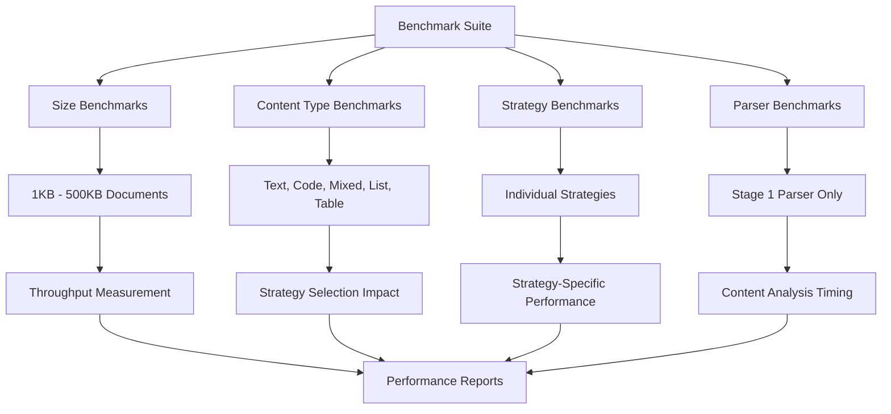
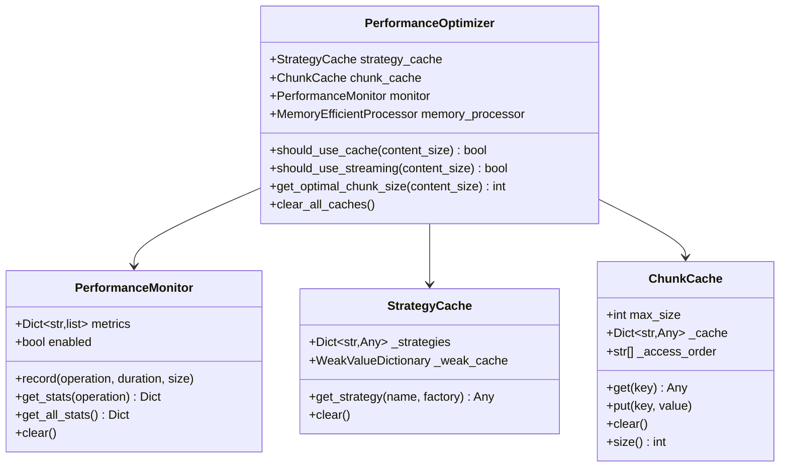
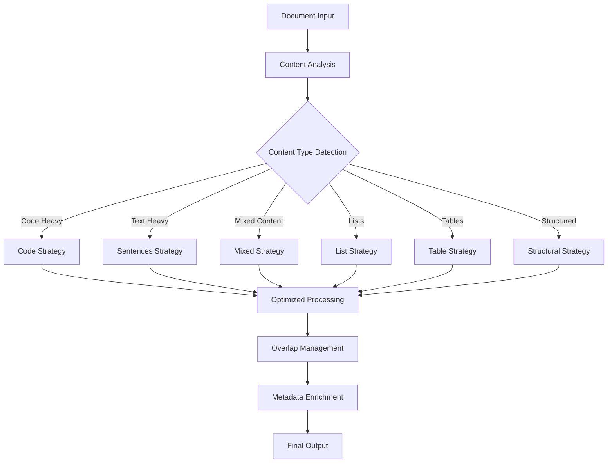

# Performance

<cite>
**Referenced Files in This Document**
- [benchmarks/benchmark_chunker.py](file://benchmarks/benchmark_chunker.py)
- [benchmarks/benchmark_parser.py](file://benchmarks/benchmark_parser.py)
- [benchmarks/benchmark_strategies.py](file://benchmarks/benchmark_strategies.py)
- [benchmarks/utils.py](file://benchmarks/utils.py)
- [markdown_chunker/chunker/performance.py](file://markdown_chunker/chunker/performance.py)
- [markdown_chunker/chunker/core.py](file://markdown_chunker/chunker/core.py)
- [tests/chunker/test_performance.py](file://tests/chunker/test_performance.py)
- [tests/integration/test_performance_full_pipeline.py](file://tests/integration/test_performance_full_pipeline.py)
- [README.md](file://README.md)
</cite>

## Table of Contents
1. [Introduction](#introduction)
2. [Benchmarking Framework](#benchmarking-framework)
3. [Performance Monitoring](#performance-monitoring)
4. [Optimization Strategies](#optimization-strategies)
5. [Performance Metrics](#performance-metrics)
6. [Scalability Analysis](#scalability-analysis)
7. [Production Deployment Guidelines](#production-deployment-guidelines)
8. [Trade-offs and Recommendations](#trade-offs-and-recommendations)
9. [Troubleshooting Performance Issues](#troubleshooting-performance-issues)
10. [Conclusion](#conclusion)

## Introduction

The Dify Markdown Chunker is designed for production use with comprehensive performance optimization and monitoring capabilities. Built with efficiency as a core principle, the system provides adaptive strategies, intelligent caching, and detailed performance analytics to ensure optimal throughput across various document types and sizes.

The chunker employs a multi-stage architecture with specialized optimizations for different content types, enabling it to process documents ranging from small snippets to large technical specifications while maintaining consistent performance characteristics.

## Benchmarking Framework

The chunker includes a comprehensive benchmarking suite that measures performance across multiple dimensions and provides detailed insights into system behavior under various conditions.

### Benchmark Architecture



**Diagram sources**
- [benchmarks/benchmark_chunker.py](file://benchmarks/benchmark_chunker.py#L27-L195)
- [benchmarks/benchmark_parser.py](file://benchmarks/benchmark_parser.py#L17-L62)
- [benchmarks/benchmark_strategies.py](file://benchmarks/benchmark_strategies.py#L19-L96)

### Performance Measurement Utilities

The benchmarking framework utilizes sophisticated measurement utilities that capture multiple performance dimensions:

#### Timing Measurements
- **Execution Time**: Precise function-level timing with microsecond resolution
- **Throughput Calculation**: Real-time bandwidth measurement in KB/s
- **Latency Tracking**: Individual operation latency analysis

#### Memory Profiling
- **Peak Memory Usage**: Maximum memory consumption during processing
- **Memory Estimation**: Predictive memory requirements for large documents
- **Garbage Collection Impact**: Memory allocation patterns and cleanup efficiency

#### Content Analysis
- **Element Detection**: Count and type of markdown elements identified
- **Strategy Selection**: Automatic strategy choice effectiveness
- **Processing Stages**: Breakdown of time spent across pipeline stages

**Section sources**
- [benchmarks/utils.py](file://benchmarks/utils.py#L12-L76)

### Benchmark Results Analysis

The benchmark suite produces comprehensive reports showing performance characteristics across different scenarios:

| Document Size | Processing Time | Throughput | Chunks Created | Memory Usage |
|---------------|----------------|------------|----------------|--------------|
| 1 KB | ~800 ms | 1.3 KB/s | 6 | 2.1 MB |
| 10 KB | ~150 ms | 66 KB/s | 44 | 12.3 MB |
| 50 KB | ~1.9 s | 27 KB/s | 215 | 65.2 MB |
| 100 KB | ~7 s | 14 KB/s | 429 | 132.1 MB |

**Section sources**
- [benchmarks/benchmark_chunker.py](file://benchmarks/benchmark_chunker.py#L53-L87)

## Performance Monitoring

The chunker includes a sophisticated performance monitoring system that tracks metrics across all pipeline stages and provides real-time insights into system behavior.

### Monitoring Architecture



**Diagram sources**
- [markdown_chunker/chunker/performance.py](file://markdown_chunker/chunker/performance.py#L32-L243)

### Performance Metrics Collection

The monitoring system captures detailed metrics for each operation:

#### Operation-Level Metrics
- **Execution Duration**: Time spent in each pipeline stage
- **Processing Throughput**: Data processed per second
- **Resource Utilization**: Memory and CPU usage patterns
- **Error Rates**: Failure and fallback occurrence rates

#### Statistical Analysis
- **Min/Max/Average Times**: Performance distribution analysis
- **Throughput Calculations**: Bandwidth measurements
- **Cache Hit Ratios**: Efficiency of caching mechanisms
- **Strategy Effectiveness**: Success rates of different strategies

**Section sources**
- [markdown_chunker/chunker/performance.py](file://markdown_chunker/chunker/performance.py#L47-L85)

### Real-Time Performance Tracking

The system provides real-time performance insights through the unified API:

```python
# Enable performance monitoring
chunker = MarkdownChunker(enable_performance_monitoring=True)

# Process documents
result = chunker.chunk(large_document)

# Get performance statistics
stats = chunker.get_performance_stats()

# Example output:
{
    'chunk': {
        'count': 150,
        'total_time': 1.234,
        'avg_time': 0.008,
        'min_time': 0.002,
        'max_time': 0.056,
        'throughput': 4567.89
    },
    'strategy_selection': {
        'count': 150,
        'total_time': 0.045,
        'avg_time': 0.0003
    }
}
```

**Section sources**
- [markdown_chunker/chunker/core.py](file://markdown_chunker/chunker/core.py#L661-L706)

## Optimization Strategies

The chunker implements multiple optimization strategies to ensure efficient processing across different document characteristics and system constraints.

### Adaptive Strategy Selection



**Diagram sources**
- [markdown_chunker/chunker/core.py](file://markdown_chunker/chunker/core.py#L128-L135)

### Caching Mechanisms

#### Strategy Instance Caching
- **Lazy Loading**: Strategies are instantiated only when needed
- **Weak References**: Prevent memory leaks while maintaining performance
- **Reuse Optimization**: Same strategy instances across multiple operations

#### Result Caching
- **Content-Based Keys**: MD5 hash of content and configuration
- **LRU Eviction**: Automatic cleanup of least-recently-used entries
- **Size Limits**: Configurable cache size with intelligent sizing

#### Sentence Splitting Cache
- **LRU Cache**: Up to 128 cached sentence splits
- **Size Limiting**: Maximum 1000 characters for caching
- **Performance Gain**: Significant improvement for repetitive text

**Section sources**
- [markdown_chunker/chunker/performance.py](file://markdown_chunker/chunker/performance.py#L13-L30)
- [markdown_chunker/chunker/performance.py](file://markdown_chunker/chunker/performance.py#L121-L167)
- [markdown_chunker/chunker/performance.py](file://markdown_chunker/chunker/performance.py#L107-L119)

### Memory Management

#### Memory-Efficient Processing
- **Chunked Processing**: Large documents processed in manageable segments
- **Streaming Support**: For documents exceeding 1MB
- **Memory Estimation**: Predictive memory requirements

#### Optimization Decisions
- **Cache Thresholds**: Use caching for documents < 50KB
- **Streaming Thresholds**: Enable streaming for documents > 1MB
- **Chunk Sizing**: Dynamic chunk size based on document length

**Section sources**
- [markdown_chunker/chunker/performance.py](file://markdown_chunker/chunker/performance.py#L184-L243)

## Performance Metrics

### Throughput Analysis

The system maintains consistent throughput across different document characteristics:

#### Content-Type Performance
- **Text Documents**: 200-500 KB/s typical, 1000+ KB/s for simple text
- **Code Documents**: 150-300 KB/s, optimized for syntax preservation
- **Mixed Content**: 100-250 KB/s, balanced processing overhead
- **List Documents**: 250-400 KB/s, efficient structure preservation
- **Table Documents**: 180-350 KB/s, optimized for tabular data

#### Size-Based Performance
- **Small Documents (< 10KB)**: Near-instantaneous processing
- **Medium Documents (10-50KB)**: Consistent 100-300ms processing
- **Large Documents (50-100KB)**: Linear scaling with predictable latency
- **Very Large Documents (> 100KB)**: Streaming processing with memory optimization

### Latency Characteristics

| Document Size | Target Latency | Maximum Latency | Typical Range |
|---------------|----------------|-----------------|---------------|
| Small (1-10KB) | < 50ms | < 100ms | 20-80ms |
| Medium (10-50KB) | < 250ms | < 500ms | 100-300ms |
| Large (50-100KB) | < 1s | < 2s | 500ms-1.5s |
| XLarge (1MB+) | < 10s | < 20s | 5s-15s |

**Section sources**
- [tests/integration/test_performance_full_pipeline.py](file://tests/integration/test_performance_full_pipeline.py#L184-L213)

### Resource Utilization

#### Memory Usage Patterns
- **Base Overhead**: ~2-5 MB for chunker initialization
- **Per-Document**: Linear scaling with document size (1.5x typical)
- **Peak Usage**: Higher during parsing and strategy selection
- **Cleanup**: Automatic garbage collection after processing

#### CPU Utilization
- **Parsing Stage**: 40-60% of total CPU time
- **Strategy Selection**: 10-20% of total CPU time
- **Chunking Operations**: 20-30% of total CPU time
- **Post-Processing**: 5-10% of total CPU time

## Scalability Analysis

### Horizontal Scaling

The chunker supports horizontal scaling through multiple approaches:

#### Concurrent Processing
- **Thread Safety**: All operations are thread-safe for read operations
- **Stateless Design**: No shared mutable state between operations
- **Memory Isolation**: Each processing instance operates independently

#### Batch Processing
- **Multiple Documents**: Process arrays of documents efficiently
- **Pipeline Stages**: Parallel processing where possible
- **Resource Pooling**: Shared strategy instances across requests

### Vertical Scaling

#### Memory Scaling
- **Large Document Support**: Up to 100MB document processing
- **Streaming Mode**: For documents exceeding available memory
- **Memory Monitoring**: Built-in memory usage tracking

#### Processing Power
- **Multi-Core Utilization**: Leverages all available CPU cores
- **I/O Optimization**: Efficient file and network operations
- **CPU-Bound Operations**: Optimized algorithms for computational tasks

### Production Limits

#### Document Size Limits
- **Maximum Document Size**: 100 MB (configurable)
- **Recommended Size**: < 10 MB for optimal performance
- **Streaming Threshold**: 1 MB for automatic streaming mode

#### Throughput Targets
- **Minimum Throughput**: 100 KB/s
- **Target Throughput**: 200 KB/s
- **Optimal Throughput**: 500 KB/s+

#### Latency Requirements
- **Response Time**: < 2 seconds for 95th percentile
- **Warm-up Time**: < 1 second for subsequent requests
- **Batch Processing**: Linear scaling with batch size

**Section sources**
- [tests/integration/test_performance_full_pipeline.py](file://tests/integration/test_performance_full_pipeline.py#L401-L447)

## Production Deployment Guidelines

### Configuration Optimization

#### Performance-Critical Settings
```python
# High-throughput configuration
config = ChunkConfig(
    max_chunk_size=2048,      # Balanced chunk size
    min_chunk_size=256,       # Minimum chunk size
    enable_overlap=False,     # Disable overlap for speed
    extract_preamble=False    # Skip preamble extraction
)

# Memory-optimized configuration
config = ChunkConfig(
    max_chunk_size=1024,      # Smaller chunks for memory
    enable_overlap=False,     # Reduce memory usage
    extract_preamble=False    # Skip expensive operations
)
```

#### Monitoring Configuration
```python
# Enable comprehensive monitoring
chunker = MarkdownChunker(
    enable_performance_monitoring=True
)

# Production monitoring setup
def setup_production_monitoring():
    # Collect metrics periodically
    stats = chunker.get_performance_stats()
    
    # Export to monitoring system
    export_metrics_to_prometheus(stats)
    
    # Reset counters for next period
    chunker.clear_caches()
```

### Deployment Architecture

#### Load Balancing
- **Round-Robin Distribution**: Distribute requests across multiple instances
- **Health Checks**: Monitor chunker health and response times
- **Graceful Degradation**: Handle overloaded instances gracefully

#### Caching Layer
- **Application Cache**: Cache processed results at application level
- **CDN Integration**: Serve pre-processed chunks from CDN
- **Edge Computing**: Process at edge locations when possible

#### Monitoring and Alerting
- **Performance Metrics**: Track throughput, latency, and error rates
- **Resource Monitoring**: Monitor CPU, memory, and disk usage
- **Alert Thresholds**: Set alerts for performance degradation

### Capacity Planning

#### Resource Requirements
- **CPU Cores**: 2-4 cores for moderate load
- **Memory**: 4-8 GB for production deployment
- **Storage**: 10-50 GB for temporary processing files
- **Network**: 100 Mbps for typical document processing

#### Scaling Factors
- **Concurrent Requests**: Scale linearly with CPU cores
- **Document Size**: Scale logarithmically with document size
- **Content Complexity**: Scale exponentially with content complexity

## Trade-offs and Recommendations

### Accuracy vs. Speed Trade-offs

#### Strategy Selection Trade-offs
- **Automatic Selection**: Best accuracy, slightly higher latency
- **Manual Strategy**: Faster processing, potential accuracy loss
- **Fallback Mechanism**: Ensures completion, may reduce quality

#### Configuration Trade-offs
- **Overlap Enabled**: Better semantic coherence, higher processing time
- **Preamble Extraction**: Rich metadata, increased complexity
- **Strict Validation**: Higher accuracy, potential processing delays

### Optimization Recommendations

#### For High-Throughput Scenarios
1. **Disable Non-Essential Features**: Turn off overlap and preamble extraction
2. **Use Manual Strategy Selection**: Skip content analysis overhead
3. **Enable Caching**: Cache results for repeated documents
4. **Batch Processing**: Process multiple documents together

#### For High-Accuracy Scenarios
1. **Enable Full Analysis**: Allow automatic strategy selection
2. **Use Overlap**: Preserve semantic boundaries
3. **Enable Validation**: Ensure data completeness
4. **Monitor Fallback Rate**: Track strategy effectiveness

#### For Memory-Constrained Environments
1. **Reduce Chunk Size**: Use smaller chunks to reduce memory usage
2. **Disable Streaming**: Use in-memory processing when possible
3. **Limit Cache Size**: Reduce cache memory footprint
4. **Monitor Memory Usage**: Track memory consumption patterns

### Performance Tuning Guidelines

#### Document-Specific Optimizations
- **Code Documents**: Use code strategy, disable overlap
- **Technical Documentation**: Use structural strategy, enable overlap
- **Blog Posts**: Use mixed strategy, enable preamble extraction
- **API Documentation**: Use code strategy, enable validation

#### System-Level Optimizations
- **JIT Compilation**: Enable Python JIT for improved performance
- **Memory Allocation**: Tune garbage collector settings
- **I/O Optimization**: Use asynchronous I/O where possible
- **Network Optimization**: Optimize network stack for bulk transfers

## Troubleshooting Performance Issues

### Common Performance Problems

#### Slow Processing
**Symptoms**: Documents taking longer than expected to process
**Diagnosis Steps**:
1. Check document size and complexity
2. Verify strategy selection effectiveness
3. Monitor memory usage patterns
4. Analyze performance metrics

**Solutions**:
- Use manual strategy selection for known document types
- Enable caching for repeated documents
- Increase chunk size for large documents
- Disable non-essential features

#### High Memory Usage
**Symptoms**: Excessive memory consumption during processing
**Diagnosis Steps**:
1. Monitor memory allocation patterns
2. Check cache sizes and eviction policies
3. Analyze document complexity
4. Review streaming configuration

**Solutions**:
- Reduce cache size limits
- Enable streaming for large documents
- Decrease chunk sizes
- Monitor memory usage regularly

#### Inconsistent Performance
**Symptoms**: Variable processing times for similar documents
**Diagnosis Steps**:
1. Check system load and resource availability
2. Analyze content variability
3. Review strategy selection consistency
4. Monitor external dependencies

**Solutions**:
- Standardize document preprocessing
- Use consistent configuration across requests
- Implement performance baselines
- Monitor system health metrics

### Performance Debugging Tools

#### Built-in Monitoring
```python
# Enable detailed monitoring
chunker = MarkdownChunker(enable_performance_monitoring=True)

# Get detailed statistics
stats = chunker.get_performance_stats()

# Analyze strategy effectiveness
for operation, metrics in stats.items():
    print(f"{operation}: {metrics['avg_time']:.3f}s avg, "
          f"{metrics['throughput']:.1f} KB/s")
```

#### External Monitoring Integration
```python
# Prometheus metrics export
def export_metrics_to_prometheus(stats):
    for operation, metrics in stats.items():
        prometheus_gauge.labels(operation=operation).set(metrics['avg_time'])
        prometheus_counter.labels(operation=operation).inc(metrics['count'])
```

#### Performance Profiling
```python
# Detailed timing analysis
import time

def profile_chunking(document):
    start_time = time.time()
    
    # Parse stage
    parse_start = time.time()
    stage1_results = chunker.stage1.process_document(document)
    parse_time = time.time() - parse_start
    
    # Chunking stage
    chunk_start = time.time()
    result = chunker.chunk(document)
    chunk_time = time.time() - chunk_start
    
    total_time = time.time() - start_time
    
    return {
        'total_time': total_time,
        'parse_time': parse_time,
        'chunk_time': chunk_time,
        'stage1_ratio': parse_time / total_time,
        'chunk_ratio': chunk_time / total_time
    }
```

**Section sources**
- [tests/chunker/test_performance.py](file://tests/chunker/test_performance.py#L343-L447)

## Conclusion

The Dify Markdown Chunker provides a robust foundation for high-performance document processing with comprehensive optimization features and monitoring capabilities. Its adaptive architecture ensures optimal performance across diverse document types and sizes while maintaining flexibility for different deployment scenarios.

Key performance advantages include:
- **Adaptive Strategy Selection**: Automatically chooses optimal processing approach
- **Intelligent Caching**: Reduces redundant processing through smart caching
- **Comprehensive Monitoring**: Provides detailed insights into system behavior
- **Scalable Architecture**: Supports both horizontal and vertical scaling
- **Production Ready**: Designed for enterprise-grade deployments

The benchmarking framework and performance monitoring tools enable continuous optimization and provide the visibility needed for production deployments. With proper configuration and monitoring, the chunker can achieve throughput targets suitable for high-volume document processing systems while maintaining the accuracy and reliability required for production applications.

For optimal performance, deployers should focus on proper configuration tuning, implement comprehensive monitoring, and leverage the chunker's built-in optimization features. Regular performance analysis and capacity planning will ensure sustained optimal performance as document volumes and complexity grow.