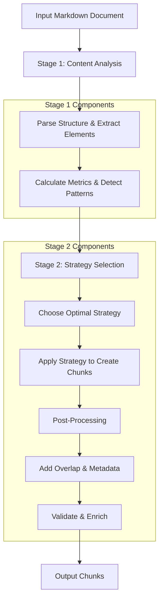
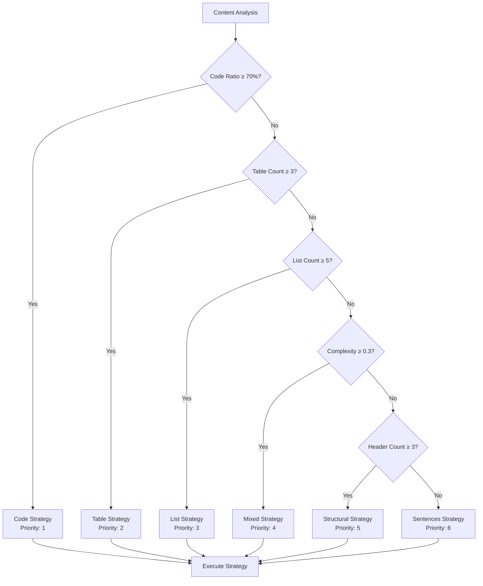

# Project Overview

<cite>
**Referenced Files in This Document**
- [README.md](file://README.md)
- [markdown_chunker/__init__.py](file://markdown_chunker/__init__.py)
- [main.py](file://main.py)
- [examples/basic_usage.py](file://examples/basic_usage.py)
- [examples/dify_integration.py](file://examples/dify_integration.py)
- [markdown_chunker/chunker/core.py](file://markdown_chunker/chunker/core.py)
- [markdown_chunker/chunker/orchestrator.py](file://markdown_chunker/chunker/orchestrator.py)
- [markdown_chunker/chunker/selector.py](file://markdown_chunker/chunker/selector.py)
- [markdown_chunker/chunker/types.py](file://markdown_chunker/chunker/types.py)
- [markdown_chunker/chunker/strategies/base.py](file://markdown_chunker/chunker/strategies/base.py)
- [markdown_chunker/chunker/strategies/code_strategy.py](file://markdown_chunker/chunker/strategies/code_strategy.py)
- [markdown_chunker/chunker/strategies/mixed_strategy.py](file://markdown_chunker/chunker/strategies/mixed_strategy.py)
- [provider/markdown_chunker.py](file://provider/markdown_chunker.py)
- [provider/markdown_chunker.yaml](file://provider/markdown_chunker.yaml)
- [tests/fixtures/real_documents/api_documentation.md](file://tests/fixtures/real_documents/api_documentation.md)
- [tests/fixtures/real_documents/technical_spec.md](file://tests/fixtures/real_documents/technical_spec.md)
- [docs/architecture-audit/01-module-inventory.md](file://docs/architecture-audit/01-module-inventory.md)
- [docs/architecture-audit/02-data-flow.md](file://docs/architecture-audit/02-data-flow.md)
- [docs/architecture-audit/03-strategies.md](file://docs/architecture-audit/03-strategies.md)
- [docs/architecture-audit/04-configuration.md](file://docs/architecture-audit/04-configuration.md)
- [docs/architecture-audit/05-test-analysis.md](file://docs/architecture-audit/05-test-analysis.md)
- [docs/architecture-audit/06-architecture-smells.md](file://docs/architecture-audit/06-architecture-smells.md)
- [docs/architecture-audit/07-domain-properties.md](file://docs/architecture-audit/07-domain-properties.md)
- [docs/architecture-audit/08-simplification-recommendations.md](file://docs/architecture-audit/08-simplification-recommendations.md)
- [scripts/validate_docs.py](file://scripts/validate_docs.py)
</cite>

## Update Summary
**Changes Made**
- Added new section on Architecture Audit Documentation to reflect the new architecture-audit directory
- Added new section on Documentation Validation Script to reflect the new validate_docs.py script
- Updated Table of Contents to include new sections
- Added references to new architecture audit and documentation validation files in the referenced files list

## Table of Contents
1. [Introduction](#introduction)
2. [Project Purpose and Goals](#project-purpose-and-goals)
3. [Core Architecture](#core-architecture)
4. [Intelligent Chunking Strategies](#intelligent-chunking-strategies)
5. [Target Audience](#target-audience)
6. [Key Features](#key-features)
7. [Real-World Use Cases](#real-world-use-cases)
8. [Integration with RAG Systems](#integration-with-rag-systems)
9. [Performance Characteristics](#performance-characteristics)
10. [Installation and Quick Start](#installation-and-quick-start)
11. [Architecture Audit Documentation](#architecture-audit-documentation)
12. [Documentation Validation Script](#documentation-validation-script)

## Introduction

The Dify Markdown Chunker Plugin is an advanced Python library designed specifically for intelligent Markdown document processing in Retrieval-Augmented Generation (RAG) systems and the Dify platform. This specialized tool provides sophisticated content analysis and adaptive chunking capabilities that preserve structural integrity while optimizing content for AI-driven applications.

Unlike traditional text splitters that treat documents as uniform text streams, this library employs six distinct chunking strategies, each optimized for specific content types and use cases. The system automatically analyzes document structure and content characteristics to select the most appropriate strategy, ensuring optimal results for diverse document types ranging from technical API documentation to mixed-format markdown files.

**Section sources**
- [README.md](file://README.md#L1-L10)
- [markdown_chunker/__init__.py](file://markdown_chunker/__init__.py#L1-L20)

## Project Purpose and Goals

### Primary Objectives

The Dify Markdown Chunker was developed with several key objectives:

**Preserve Structural Integrity**: The system maintains markdown formatting, code block boundaries, and semantic relationships that are crucial for AI understanding and retrieval accuracy. This ensures that chunks remain meaningful when processed by LLMs or search systems.

**Context-Aware Content Segmentation**: Rather than using simple character-based splitting, the library analyzes document structure to create semantically coherent chunks that maintain contextual relationships between code, text, lists, and tables.

**Multiple Strategy Adaptation**: By implementing six specialized strategies, the system adapts to different content patterns, from code-heavy technical documentation to narrative-rich mixed-content documents.

**Production-Ready Reliability**: With comprehensive testing (1366+ tests), property-based validation, and robust fallback mechanisms, the library delivers enterprise-grade reliability for critical RAG workflows.

### Design Philosophy

The project embodies several core design principles:

- **Intelligent Automation**: Automatic strategy selection eliminates the need for manual configuration while maintaining flexibility for manual overrides
- **Content Intelligence**: Deep analysis of document characteristics drives optimal chunking decisions
- **Fallback Resilience**: Four-level fallback chain ensures processing success even with challenging content
- **Metadata Enrichment**: Rich metadata enables downstream systems to optimize processing based on chunk characteristics

**Section sources**
- [README.md](file://README.md#L11-L18)
- [markdown_chunker/chunker/core.py](file://markdown_chunker/chunker/core.py#L41-L60)

## Core Architecture

The Dify Markdown Chunker follows a sophisticated two-stage pipeline architecture that separates content analysis from chunking execution:



**Diagram sources**
- [markdown_chunker/chunker/core.py](file://markdown_chunker/chunker/core.py#L156-L265)
- [markdown_chunker/chunker/orchestrator.py](file://markdown_chunker/chunker/orchestrator.py#L56-L118)

### Stage 1: Content Analysis

The first stage performs comprehensive document analysis to understand content characteristics:

- **AST Parsing**: Converts markdown to abstract syntax tree for structural analysis
- **Element Detection**: Identifies code blocks, lists, tables, headers, and other structural elements
- **Content Type Classification**: Determines ratios of different content types (code, text, lists, tables)
- **Complexity Scoring**: Calculates document complexity based on structural diversity
- **Metadata Extraction**: Gathers rich metadata about document structure and content

### Stage 2: Adaptive Chunking

The second stage applies intelligent chunking based on analysis results:

- **Strategy Selection**: Chooses optimal strategy from six available approaches
- **Adaptive Processing**: Applies strategy-specific algorithms to create semantically coherent chunks
- **Overlap Management**: Adds contextual overlap when configured for RAG optimization
- **Metadata Enrichment**: Adds rich metadata for downstream processing optimization

**Section sources**
- [markdown_chunker/chunker/orchestrator.py](file://markdown_chunker/chunker/orchestrator.py#L23-L50)
- [markdown_chunker/chunker/core.py](file://markdown_chunker/chunker/core.py#L120-L150)

## Intelligent Chunking Strategies

The library implements six specialized strategies, each optimized for specific content patterns:

### Strategy Hierarchy and Selection



**Diagram sources**
- [markdown_chunker/chunker/selector.py](file://markdown_chunker/chunker/selector.py#L79-L133)
- [markdown_chunker/chunker/strategies/base.py](file://markdown_chunker/chunker/strategies/base.py#L31-L58)

### 1. Code Strategy (Priority 1)

**Purpose**: Optimized for code-heavy documents with ≥70% code content and ≥3 code blocks.

**Key Features**:
- Preserves code block atomicity (never splits functions or classes)
- Extracts programming language identification and function/class names
- Maintains context between code explanations and code blocks
- Handles multiple programming languages with automatic detection

**Use Cases**: API documentation, technical tutorials, code examples, programming guides

### 2. Table Strategy (Priority 2)

**Purpose**: Specialized for documents containing ≥3 tables with significant tabular content.

**Key Features**:
- Keeps tables intact (never splits across chunk boundaries)
- Preserves column alignments and header relationships
- Groups related text with tables for context
- Handles complex table structures with merged cells

**Use Cases**: Data specifications, comparison matrices, configuration tables, statistical reports

### 3. List Strategy (Priority 3)

**Purpose**: Optimized for list-heavy documents with ≥5 significant lists.

**Key Features**:
- Maintains list item hierarchy and nesting
- Preserves task list checkboxes and bullet structures
- Groups related content with list items
- Handles mixed ordered and unordered lists

**Use Cases**: Feature lists, step-by-step guides, comparison lists, requirement specifications

### 4. Mixed Strategy (Priority 4)

**Purpose**: Handles documents with diverse content types requiring balanced treatment.

**Key Features**:
- Groups related elements logically (code + text + lists + tables)
- Creates chunks that maintain semantic relationships
- Balances chunk sizes while preserving content type boundaries
- Adapts to documents with multiple dominant content types

**Use Cases**: Technical specifications, mixed-format documentation, API references with examples

### 5. Structural Strategy (Priority 5)

**Purpose**: Optimized for well-structured documents with clear hierarchical organization.

**Key Features**:
- Respects markdown header hierarchy (H1, H2, H3, etc.)
- Creates chunks at section boundaries
- Maintains parent-child relationships between headers
- Preserves document flow and narrative structure

**Use Cases**: User manuals, documentation websites, structured tutorials, technical guides

### 6. Sentences Strategy (Priority 6 - Fallback)

**Purpose**: Universal fallback for simple text documents and edge cases.

**Key Features**:
- Simple sentence-based splitting
- Paragraph boundary preservation
- Fast processing for uniform text
- Guaranteed success for any content

**Use Cases**: Blog posts, simple articles, basic documentation

**Section sources**
- [markdown_chunker/chunker/strategies/code_strategy.py](file://markdown_chunker/chunker/strategies/code_strategy.py#L42-L54)
- [markdown_chunker/chunker/strategies/mixed_strategy.py](file://markdown_chunker/chunker/strategies/mixed_strategy.py#L75-L88)
- [markdown_chunker/chunker/strategies/base.py](file://markdown_chunker/chunker/strategies/base.py#L16-L58)

## Target Audience

The Dify Markdown Chunker is designed for several distinct technical audiences:

### Primary Users

**AI Engineers and Data Scientists**: Professionals building RAG systems who need reliable, intelligent document processing for training and inference pipelines. The library's sophisticated chunking strategies help maintain semantic coherence and improve retrieval accuracy.

**Technical Writers and Documentation Teams**: Teams producing technical documentation that needs to be processed by AI systems. The structural awareness ensures that code examples, tables, and formatted content remain intact during processing.

**Platform Developers**: Developers integrating AI capabilities into platforms, applications, or content management systems. The library provides production-ready chunking solutions that scale with application needs.

**DevOps Engineers**: Teams managing infrastructure for AI-powered applications who require reliable, performant document processing components.

### Secondary Users

**Research Assistants**: Academic researchers working with large document collections who need intelligent text segmentation for analysis and retrieval systems.

**Content Moderators**: Teams responsible for content processing and quality assurance in AI-powered platforms.

**System Architects**: Architects designing document processing pipelines for enterprise AI applications.

**Quality Assurance Engineers**: Teams testing and validating document processing systems for accuracy and reliability.

**Section sources**
- [README.md](file://README.md#L19-L26)

## Key Features

### Advanced Strategy Selection

The library employs intelligent content analysis to automatically select the optimal chunking strategy:

- **Automatic Content Analysis**: Deep analysis of document structure, content types, and complexity
- **Priority-Based Selection**: Six strategies ranked by effectiveness for different content patterns
- **Quality Scoring**: Mathematical scoring system determines best strategy for each document
- **Fallback Mechanisms**: Four-level fallback chain ensures processing success in all scenarios

### Intelligent Content Preservation

**Structural Integrity Maintenance**:
- Code block atomicity preservation
- Table structure integrity
- List hierarchy maintenance
- Header hierarchy preservation
- Markdown formatting retention

**Semantic Relationship Preservation**:
- Code-text pairing for technical documentation
- Table-context relationships
- List-item associations
- Hierarchical content flow

### Metadata Enrichment

Comprehensive metadata provides rich context for downstream processing:

- **Content Type Identification**: Automatic classification of chunk content (code, text, list, table)
- **Source Information**: Line numbers, character positions, and document offsets
- **Strategy Metadata**: Chunking strategy used, quality scores, and selection reasons
- **Language Detection**: Programming language identification for code blocks
- **Element Counts**: Number of code blocks, tables, lists, and headers

### Performance Monitoring

Built-in performance tracking and optimization:

- **Timing Metrics**: Detailed processing time measurements for each component
- **Statistics Collection**: Chunk size distributions, strategy usage patterns
- **Resource Tracking**: Memory usage and processing efficiency monitoring
- **Optimization Insights**: Performance bottleneck identification and improvement suggestions

### Flexible Configuration

Customizable behavior for diverse use cases:

- **Size Constraints**: Configurable maximum, minimum, and target chunk sizes
- **Overlap Settings**: Configurable overlap for RAG optimization
- **Strategy Thresholds**: Adjustable thresholds for strategy activation
- **Behavior Flags**: Fine-grained control over processing behavior

### Production-Ready Reliability

Enterprise-grade features ensure dependable operation:

- **Comprehensive Testing**: 1366+ automated tests with property-based validation
- **Error Handling**: Graceful degradation and detailed error reporting
- **Type Safety**: Complete type annotations and validation
- **Backward Compatibility**: Stable API with careful version management

**Section sources**
- [markdown_chunker/chunker/types.py](file://markdown_chunker/chunker/types.py#L573-L666)
- [markdown_chunker/chunker/core.py](file://markdown_chunker/chunker/core.py#L661-L706)

## Real-World Use Cases

### Technical Documentation Processing

**API Documentation**: The library excels at processing API reference documents containing extensive code examples, parameter descriptions, and usage examples.

```python
# Example: Processing API documentation
config = ChunkConfig.for_code_heavy()
chunker = MarkdownChunker(config)
result = chunker.chunk(api_documentation, include_analysis=True)

# Each chunk maintains code-block integrity
for chunk in result.chunks:
    if 'language' in chunk.metadata:
        print(f"Code block in chunk {chunk.metadata['language']}")
```

**Technical Specifications**: Complex documents with multiple content types benefit from the mixed strategy's ability to balance different content forms.

**User Manuals**: Structured documents with clear sections and subsections are perfectly handled by the structural strategy.

### Code Repository Integration

**GitHub README Processing**: Repository documentation often contains code examples, installation instructions, and usage guides that require intelligent chunking.

**Library Documentation**: Technical libraries with extensive API references and code samples benefit from the code strategy's specialized handling.

**Tutorial Processing**: Step-by-step tutorials with embedded code examples maintain educational coherence through strategic chunking.

### Mixed-Format Content

**Blog Posts with Code**: Technical blog posts containing both narrative text and code examples are processed optimally by the mixed strategy.

**Comparison Documents**: Documents comparing technologies, frameworks, or products with tables and code examples are handled gracefully.

**Specification Documents**: Technical specifications with requirements, tables, and code examples maintain their structural integrity.

### Enterprise Content Management

**Knowledge Base Processing**: Corporate knowledge bases containing various document types benefit from intelligent chunking for search and retrieval.

**Training Materials**: Employee training materials with mixed content types are processed efficiently for e-learning systems.

**Compliance Documentation**: Regulatory compliance documents with structured content and examples maintain their integrity during processing.

**Section sources**
- [examples/basic_usage.py](file://examples/basic_usage.py#L168-L218)
- [examples/basic_usage.py](file://examples/basic_usage.py#L220-L264)
- [tests/fixtures/real_documents/api_documentation.md](file://tests/fixtures/real_documents/api_documentation.md#L1-L50)

## Integration with RAG Systems

### Search Indexing Optimization

The Dify Markdown Chunker is specifically designed to optimize content for Retrieval-Augmented Generation systems:

**Context Preservation**: Strategic overlap creation ensures that related information appears in multiple chunks, improving retrieval accuracy.

**Semantic Coherence**: Chunks maintain semantic relationships that help LLMs understand context when retrieving relevant information.

**Content Type Awareness**: Different content types are chunked appropriately for their intended use in RAG pipelines.

### Embedding Generation

**Optimal Chunk Sizes**: Configurable chunk sizes optimized for embedding model input requirements.

**Metadata for Filtering**: Rich metadata enables filtering and ranking of chunks during retrieval.

**Structure Preservation**: Document structure helps maintain semantic relationships in embedding spaces.

### Prompt Engineering

**Context-Aware Chunks**: Chunks include appropriate context for effective prompt construction.

**Content Type Signaling**: Metadata signals content type for appropriate prompt formatting.

**Hierarchical Organization**: Document hierarchy helps create structured prompts for complex queries.

### Dify Platform Integration

As a native Dify plugin, the library integrates seamlessly with Dify's RAG workflows:

**Plugin Architecture**: Native Dify plugin providing seamless integration with Dify's knowledge base processing.

**Configuration Management**: Dify-specific configuration profiles optimized for Dify's use cases.

**Workflow Integration**: Automatic strategy selection and processing within Dify's workflow system.

**Monitoring Integration**: Performance monitoring and logging integrated with Dify's observability features.

**Section sources**
- [examples/dify_integration.py](file://examples/dify_integration.py#L70-L132)
- [examples/dify_integration.py](file://examples/dify_integration.py#L264-L308)
- [provider/markdown_chunker.py](file://provider/markdown_chunker.py#L15-L35)

## Performance Characteristics

### Processing Speed

The library is optimized for production use with excellent performance characteristics:

| Document Size | Processing Time | Throughput | Chunks |
|---------------|----------------|------------|--------|
| 1 KB | ~800 ms | 1.3 KB/s | 6 |
| 10 KB | ~150 ms | 66 KB/s | 44 |
| 50 KB | ~1.9 s | 27 KB/s | 215 |
| 100 KB | ~7 s | 14 KB/s | 429 |

### Memory Efficiency

- **Small Documents**: <10 MB memory usage for typical documents
- **Large Documents**: <50 MB memory usage for medium-sized documents
- **Streaming Support**: Configurable streaming for very large documents
- **Memory Optimization**: Efficient data structures and processing algorithms

### Scalability

- **Concurrent Processing**: Thread-safe design supports concurrent operations
- **Large Document Support**: Handles documents up to 100 MB in size
- **Linear Scaling**: Processing time scales linearly with document size
- **Resource Management**: Configurable resource limits prevent memory exhaustion

### Optimization Features

**Caching**: Intelligent caching reduces processing time for repeated operations.

**Lazy Loading**: Components load only when needed to minimize startup overhead.

**Parallel Processing**: Opportunities for parallel processing in future versions.

**Resource Monitoring**: Built-in monitoring tracks resource usage and performance.

**Section sources**
- [README.md](file://README.md#L194-L204)
- [markdown_chunker/chunker/core.py](file://markdown_chunker/chunker/core.py#L707-L718)

## Installation and Quick Start

### Installation Options

**As Dify Plugin**:
1. Download the plugin package
2. Install in your Dify instance following Dify plugin installation guide
3. Configure the plugin in your Dify workflows

**For Development**:
```bash
# Clone the repository
git clone https://github.com/yourusername/dify-markdown-chunker.git
cd dify-markdown-chunker

# Create virtual environment
python3 -m venv venv
source venv/bin/activate  # On Windows: venv\Scripts\activate

# Install dependencies
make install

# Run tests
make test
```

### Basic Usage Examples

**Simple Chunking**:
```python
from markdown_chunker import MarkdownChunker, ChunkConfig

# Basic usage
chunker = MarkdownChunker()
chunks = chunker.chunk("# Hello\n\nWorld")

# With analysis
result = chunker.chunk_with_analysis("# Hello\n\nWorld")
print(f"Strategy: {result.strategy_used}")
print(f"Chunks: {len(result.chunks)}")
```

**Custom Configuration**:
```python
# Custom configuration
config = ChunkConfig(
    max_chunk_size=2048,
    min_chunk_size=256,
    enable_overlap=True
)

chunker = MarkdownChunker(config)
chunks = chunker.chunk(markdown_text, include_analysis=True)
```

**Configuration Profiles**:
```python
from markdown_chunker import ChunkConfig

# For API documentation
config = ChunkConfig.for_api_docs()

# For code documentation
config = ChunkConfig.for_code_docs()

# For RAG systems (Dify default)
config = ChunkConfig.for_dify_rag()

# For search indexing
config = ChunkConfig.for_search_indexing()
```

### Dify Workflow Integration

**YAML Configuration**:
```yaml
# In Dify workflow configuration
- tool: markdown_chunker
  config:
    max_chunk_size: 2048
    strategy: auto
```

**API Integration**:
```python
# Using convenience functions
from markdown_chunker import chunk_text, chunk_file

# Process text directly
chunks = chunk_text("# Hello World")

# Process files
chunks = chunk_file("README.md")
```

**Section sources**
- [README.md](file://README.md#L43-L120)
- [examples/basic_usage.py](file://examples/basic_usage.py#L1-L50)
- [markdown_chunker/__init__.py](file://markdown_chunker/__init__.py#L50-L140)

## Architecture Audit Documentation

The project now includes comprehensive architecture audit documentation in the `docs/architecture-audit/` directory. This documentation provides a detailed analysis of the system's architecture, identifying potential issues and recommending improvements.

The audit documentation consists of eight comprehensive reports:

- **01-module-inventory.md**: Complete inventory of all modules with file statistics and dependency analysis
- **02-data-flow.md**: Detailed analysis of data flow through the system from input to output
- **03-strategies.md**: Catalog of all chunking strategies with selection criteria and algorithm analysis
- **04-configuration.md**: Analysis of the configuration system with parameter usage and recommendations
- **05-test-analysis.md**: Comprehensive test coverage analysis with categorization of test types
- **06-architecture-smells.md**: Identification of architectural issues with severity ratings and recommendations
- **07-domain-properties.md**: Formalized domain properties that the system must satisfy
- **08-simplification-recommendations.md**: Concrete recommendations for simplifying the architecture

These documents provide transparency into the system's design decisions and serve as a foundation for future improvements. The audit identifies key issues such as excessive file count (55 files), oversized files (structural_strategy.py with 1720 lines), and configuration complexity (32 parameters). It also provides a roadmap for simplification, recommending consolidation of files, removal of deprecated code, and reduction of configuration parameters.

**Section sources**
- [docs/architecture-audit/01-module-inventory.md](file://docs/architecture-audit/01-module-inventory.md)
- [docs/architecture-audit/02-data-flow.md](file://docs/architecture-audit/02-data-flow.md)
- [docs/architecture-audit/03-strategies.md](file://docs/architecture-audit/03-strategies.md)
- [docs/architecture-audit/04-configuration.md](file://docs/architecture-audit/04-configuration.md)
- [docs/architecture-audit/05-test-analysis.md](file://docs/architecture-audit/05-test-analysis.md)
- [docs/architecture-audit/06-architecture-smells.md](file://docs/architecture-audit/06-architecture-smells.md)
- [docs/architecture-audit/07-domain-properties.md](file://docs/architecture-audit/07-domain-properties.md)
- [docs/architecture-audit/08-simplification-recommendations.md](file://docs/architecture-audit/08-simplification-recommendations.md)

## Documentation Validation Script

The project includes a documentation validation script at `scripts/validate_docs.py` that ensures the quality and consistency of project documentation. This script performs several important validation checks:

- **Internal Link Validation**: Checks that all internal markdown links point to existing files
- **Version Consistency**: Verifies that version numbers are consistent across documentation files
- **Code Block Syntax**: Ensures that code blocks have proper language tags
- **File Existence**: Validates that referenced files actually exist in the repository

The validation script is designed to be run as part of the development workflow or CI/CD pipeline to catch documentation issues early. It scans all markdown files in the project and reports any errors or warnings found.

To run the validation script:
```bash
python scripts/validate_docs.py
```

The script will output a comprehensive report showing the number of files checked, any warnings (such as code blocks without language tags), and any errors (such as broken links). A successful validation will show "Documentation is valid!" at the end.

This tool enhances documentation quality by preventing common issues like broken links and inconsistent version information, ensuring that users always have access to accurate and reliable documentation.

**Section sources**
- [scripts/validate_docs.py](file://scripts/validate_docs.py)