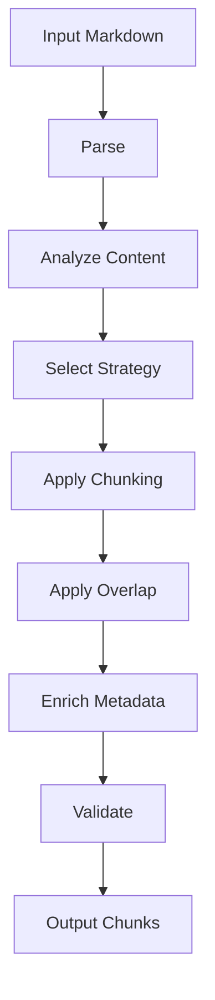
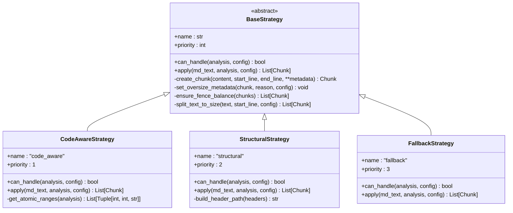
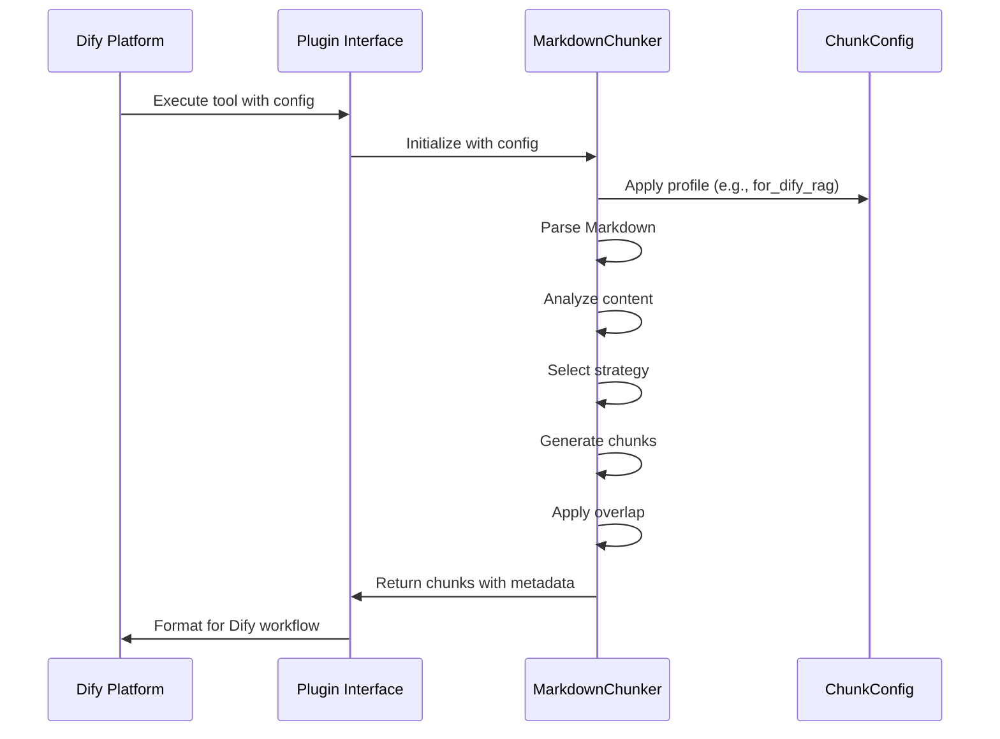
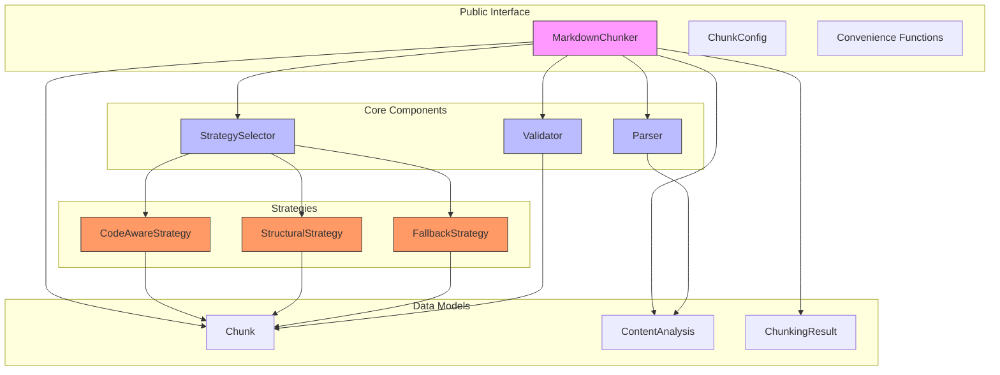

# Project Overview

<cite>
**Referenced Files in This Document**   
- [README.md](file://README.md)
- [docs/architecture-audit-to-be/01-overview.md](file://docs/architecture-audit-to-be/01-overview.md)
- [markdown_chunker/__init__.py](file://markdown_chunker/__init__.py)
- [markdown_chunker_legacy/__init__.py](file://markdown_chunker_legacy/__init__.py)
- [markdown_chunker_v2/__init__.py](file://markdown_chunker_v2/__init__.py)
- [main.py](file://main.py)
- [provider/markdown_chunker.py](file://provider/markdown_chunker.py)
- [markdown_chunker_v2/chunker.py](file://markdown_chunker_v2/chunker.py)
- [markdown_chunker_v2/strategies/base.py](file://markdown_chunker_v2/strategies/base.py)
- [markdown_chunker_v2/strategies/code_aware.py](file://markdown_chunker_v2/strategies/code_aware.py)
- [markdown_chunker_v2/strategies/structural.py](file://markdown_chunker_v2/strategies/structural.py)
- [markdown_chunker_v2/strategies/fallback.py](file://markdown_chunker_v2/strategies/fallback.py)
- [examples/basic_usage.py](file://examples/basic_usage.py)
- [examples/dify_integration.py](file://examples/dify_integration.py)
</cite>

## Table of Contents
1. [Core Purpose and Functionality](#core-purpose-and-functionality)
2. [Processing Pipeline](#processing-pipeline)
3. [Chunking Strategies](#chunking-strategies)
4. [Configuration and Metadata](#configuration-and-metadata)
5. [Integration with Dify Platform](#integration-with-dify-platform)
6. [Versioning Strategy](#versioning-strategy)
7. [Use Cases](#use-cases)
8. [Architecture Overview](#architecture-overview)

## Core Purpose and Functionality

The **dify-markdown-chunker.qoder** project is a specialized Python library designed for intelligent Markdown chunking optimized for Retrieval-Augmented Generation (RAG) systems. It addresses the limitations of simple text splitting by preserving document structure, maintaining context, and enabling efficient retrieval through advanced content-aware strategies.

Unlike basic chunking tools that split text at fixed intervals, this library performs deep content analysis using Abstract Syntax Tree (AST) parsing to understand the semantic structure of Markdown documents. It intelligently preserves atomic elements such as code blocks, tables, and lists while automatically selecting the most appropriate chunking strategy based on document characteristics.

The library serves dual purposes: as a standalone Python package for developers building RAG systems, and as a Dify plugin that integrates seamlessly into the Dify platform's knowledge base ingestion workflows. Its primary function is to transform large Markdown documents into semantically meaningful chunks that maintain contextual integrity, making them ideal for vector embedding and retrieval in AI applications.

**Section sources**
- [README.md](file://README.md#L35-L37)
- [docs/architecture-audit-to-be/01-overview.md](file://docs/architecture-audit-to-be/01-overview.md#L1-L152)

## Processing Pipeline

The library implements a linear, single-pass processing pipeline that ensures efficiency and consistency while maintaining content integrity. The pipeline consists of five sequential stages:

1. **Parsing**: The input Markdown text is parsed using AST analysis to extract structural elements, content types, and metadata. During this stage, line endings are normalized to Unix-style (`\n`) for consistent processing.

2. **Analysis**: The parser generates a comprehensive `ContentAnalysis` object that includes metrics such as code ratio, table count, header hierarchy, and complexity scoring. This analysis informs the strategy selection process.

3. **Strategy Selection**: Based on the content analysis, the system automatically selects the optimal chunking strategy from its available options. The selection follows a priority-based system where strategies are evaluated in order of specificity.

4. **Chunking**: The selected strategy processes the normalized Markdown text to produce chunks according to its specific algorithm. Each strategy preserves atomic blocks (code, tables) and respects document structure.

5. **Post-processing**: Final processing includes applying configurable overlap between chunks, enriching metadata, and validating the output against domain properties to ensure content completeness and integrity.

This linear pipeline eliminates redundant processing and conditional branching, resulting in predictable performance and easier testing. The entire process is designed to be deterministic, ensuring that the same input always produces the same output.

**Diagram sources**
- [docs/architecture-audit-to-be/01-overview.md](file://docs/architecture-audit-to-be/01-overview.md#L137-L179)
- [markdown_chunker_v2/chunker.py](file://markdown_chunker_v2/chunker.py#L43-L90)

## Chunking Strategies

The library implements three primary chunking strategies in its v2 architecture, each designed for specific document types and use cases. These strategies are selected automatically based on content analysis, with a fallback mechanism ensuring coverage for all document types.

### Code-Aware Strategy
The highest-priority strategy, designed for documents containing code blocks or tables. It preserves atomic blocks intact while splitting surrounding text. This strategy activates when the document contains at least one code block or table, or when the code ratio exceeds the configured threshold. It ensures that code snippets remain complete and functional within their chunks.

### Structural Strategy
The second-priority strategy, optimized for documents with hierarchical header structures. It splits content by headers while maintaining the header path hierarchy, allowing retrieval systems to understand the context of each chunk within the document's overall structure. This strategy requires a minimum number of headers and a header depth greater than one.

### Fallback Strategy
The universal strategy with the lowest priority, designed to handle any document type. It splits content by paragraph boundaries and groups paragraphs to fit within the maximum chunk size. This strategy serves as a safety net, ensuring that all documents can be processed even if they don't match the criteria for more specialized strategies.

The strategy selection process follows a clear priority order, with each strategy implementing a `can_handle` method that evaluates whether it should process the document based on the content analysis. This approach ensures that the most appropriate strategy is always selected while maintaining a graceful fallback path.

**Diagram sources**
- [markdown_chunker_v2/strategies/base.py](file://markdown_chunker_v2/strategies/base.py#L12-L233)
- [markdown_chunker_v2/strategies/code_aware.py](file://markdown_chunker_v2/strategies/code_aware.py#L15-L149)
- [markdown_chunker_v2/strategies/structural.py](file://markdown_chunker_v2/strategies/structural.py#L15-L151)
- [markdown_chunker_v2/strategies/fallback.py](file://markdown_chunker_v2/strategies/fallback.py#L15-L96)

## Configuration and Metadata

The library provides flexible configuration options through the `ChunkConfig` class, allowing users to customize chunking behavior for different use cases. The v2 architecture simplified configuration from 32 parameters to 8 core parameters, improving usability while maintaining functionality.

Key configuration options include:
- `max_chunk_size`: Maximum size of chunks in characters
- `min_chunk_size`: Minimum size of chunks in characters
- `enable_overlap`: Whether to enable overlap between consecutive chunks
- `overlap_size`: Size of overlap in characters
- `code_threshold`: Ratio threshold for code-heavy document detection
- `structure_threshold`: Minimum number of headers for structural strategy

The library offers predefined configuration profiles for common use cases, including `for_code_heavy()`, `for_dify_rag()`, `for_search_indexing()`, and `for_chat_context()`. These profiles provide optimized settings for specific scenarios, reducing the need for manual configuration.

Each chunk includes rich metadata that enhances retrieval and analysis capabilities. Metadata fields include:
- `content_type`: Type of content (code, text, list, table, mixed)
- `strategy`: Strategy used to create the chunk
- `header_path`: Hierarchical path of headers for context
- `previous_content` and `next_content`: Overlap content for context preservation
- `line_count` and `size`: Statistical information
- `language`: Programming language for code blocks

This metadata enrichment enables sophisticated retrieval patterns and provides valuable context for downstream processing in RAG systems.

**Section sources**
- [README.md](file://README.md#L274-L315)
- [examples/basic_usage.py](file://examples/basic_usage.py#L94-L138)

## Integration with Dify Platform

The library integrates with the Dify platform through a dedicated plugin system, enabling seamless use within Dify's workflow automation and knowledge base management features. The integration is implemented through several components:

The `main.py` file serves as the entry point for the Dify plugin, configuring the plugin environment with a 300-second timeout to accommodate large document processing. It uses the Dify Plugin SDK to expose the chunking functionality as a tool within Dify workflows.

The `provider/markdown_chunker.py` file implements the `MarkdownChunkerProvider` class, which manages the tool provider interface. Notably, this provider requires no credentials as chunking is a local operation that doesn't depend on external services or API keys.

The integration supports both direct API usage and workflow-based processing. In Dify workflows, the chunker can be configured with parameters such as `max_chunk_size`, `strategy`, and `chunk_overlap`. The output is formatted to be compatible with Dify's knowledge base ingestion pipeline, where chunks can be embedded and stored in vector databases.

Example use cases in Dify include:
- Knowledge base ingestion with automatic chunking of documentation
- API documentation processing with code-aware chunking
- Technical article processing with structural preservation
- Batch document processing for semantic search preparation

The examples in `dify_integration.py` demonstrate various integration scenarios, including RAG-optimized chunking, semantic search preparation, and embedding generation.

**Diagram sources**
- [main.py](file://main.py#L1-L31)
- [provider/markdown_chunker.py](file://provider/markdown_chunker.py#L1-L36)
- [examples/dify_integration.py](file://examples/dify_integration.py#L1-L487)

## Versioning Strategy

The project employs a sophisticated versioning strategy that maintains backward compatibility while introducing architectural improvements. Three versions coexist within the codebase:

### Legacy Implementation (markdown_chunker_legacy)
The original implementation with 55 files and approximately 24,000 lines of code. This version includes six chunking strategies and a complex configuration system with 32 parameters. It serves as the foundation for the current system but is being phased out in favor of the simplified v2 architecture.

### Current Implementation (markdown_chunker)
This is the primary interface that re-exports the v2 implementation. The `__init__.py` file in this directory imports all components from `markdown_chunker_v2`, making them available under the main package namespace. This layer provides backward compatibility and a stable API surface.

### V2 Implementation (markdown_chunker_v2)
The redesigned architecture that reduces complexity and improves maintainability. Key improvements include:
- Reduced from 55 to 12 files
- Codebase reduced from ~24,000 to ~5,000 lines
- Configuration parameters reduced from 32 to 8
- Chunking strategies consolidated from 6 to 3
- Test count reduced from 1,853 to approximately 100 (focused on property-based testing)

The v2 architecture follows semantic versioning (2.0.0) due to breaking changes in the API. However, the project maintains backward compatibility through re-exports and compatibility modules. The versioning strategy allows users to migrate gradually while benefiting from the improved performance and reliability of the v2 implementation.

The `MIGRATION.md` document provides detailed guidance for upgrading from v1.x to v2.0, including changes to the API, configuration, and strategy selection process.

**Section sources**
- [docs/architecture-audit-to-be/01-overview.md](file://docs/architecture-audit-to-be/01-overview.md#L1-L33)
- [markdown_chunker/__init__.py](file://markdown_chunker/__init__.py#L1-L33)
- [markdown_chunker_legacy/__init__.py](file://markdown_chunker_legacy/__init__.py#L1-L74)
- [markdown_chunker_v2/__init__.py](file://markdown_chunker_v2/__init__.py#L1-L41)

## Use Cases

The dify-markdown-chunker.qoder library addresses several key use cases in AI and knowledge management systems:

### AI Knowledge Base Construction
The library excels at preparing documentation for AI knowledge bases by intelligently chunking technical documentation, API references, and user guides. Its ability to preserve code blocks and maintain structural context ensures that AI systems can retrieve relevant information with proper context. For example, when processing API documentation, the code-aware strategy keeps code examples intact while the structural strategy maintains the relationship between endpoints and their descriptions.

### Technical Documentation Processing
For technical documentation containing code snippets, configuration examples, and command-line instructions, the library ensures that executable content remains complete and functional. The overlap feature provides context around code blocks, helping AI systems understand how to use the code in practice. Configuration profiles like `for_code_docs()` optimize chunking for technical content with appropriate size limits and overlap settings.

### Semantic Search Preparation
The library prepares documents for semantic search by creating chunks with rich metadata that enhance retrieval accuracy. The header path information allows search systems to understand the context of each chunk within the document hierarchy. The `for_search_indexing()` configuration profile creates smaller, more focused chunks ideal for search applications.

### Batch Document Processing
In enterprise scenarios involving large collections of Markdown documents, the library provides consistent, reliable chunking across diverse document types. The automatic strategy selection ensures that each document is processed with the most appropriate method, whether it's a code-heavy tutorial, a structured user manual, or a simple informational article.

### LLM Context Optimization
The library helps optimize content for Large Language Model (LLM) context windows by creating chunks that fit within specific token limits. Configuration profiles for different LLMs (GPT-3.5, GPT-4) ensure that chunks are sized appropriately for the target model's context window, maximizing information density while maintaining coherence.

**Section sources**
- [README.md](file://README.md#L257-L269)
- [examples/basic_usage.py](file://examples/basic_usage.py#L1-L364)
- [examples/dify_integration.py](file://examples/dify_integration.py#L1-L487)

## Architecture Overview

The architecture of the dify-markdown-chunker.qoder project follows a clean, modular design with clear separation of concerns. The system is organized into distinct components that work together to provide intelligent Markdown chunking.

The architecture implements several key principles:
- **Single Responsibility**: Each module has a focused purpose (parsing, chunking, validation)
- **No Duplication**: Shared functionality is centralized (overlap handling, metadata enrichment)
- **Linear Pipeline**: Processing follows a straight-through flow without conditional branching
- **Contract-First**: Domain properties define the expected behavior, with tests verifying these contracts

The public interface exposes a simplified API through the `MarkdownChunker` class and convenience functions like `chunk_text()` and `chunk_file()`. The core components handle the heavy lifting of parsing, strategy selection, and validation. The strategy implementations focus on their specific chunking algorithms, while the data models provide a consistent structure for input and output.

This architecture balances simplicity with functionality, making the library both powerful and easy to use. The modular design allows for future extensions while maintaining the core principles of reliability and performance.

**Diagram sources**
- [docs/architecture-audit-to-be/01-overview.md](file://docs/architecture-audit-to-be/01-overview.md#L94-L135)
- [markdown_chunker_v2/chunker.py](file://markdown_chunker_v2/chunker.py#L21-L90)