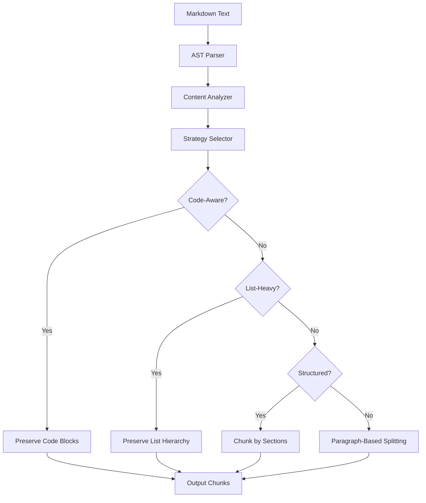

# Project Overview

<cite>
**Referenced Files in This Document**   
- [README.md](file://README.md)
- [main.py](file://main.py)
- [provider/markdown_chunker.py](file://provider/markdown_chunker.py)
- [provider/markdown_chunker.yaml](file://provider/markdown_chunker.yaml)
- [manifest.yaml](file://manifest.yaml)
- [docs/architecture/README.md](file://docs/architecture/README.md)
- [docs/architecture/strategies.md](file://docs/architecture/strategies.md)
- [docs/research/USAGE.md](file://docs/research/USAGE.md)
- [tests/corpus/README.md](file://tests/corpus/README.md)
</cite>

## Table of Contents
1. [Introduction](#introduction)
2. [Core Purpose and Functionality](#core-purpose-and-functionality)
3. [Key Features and Capabilities](#key-features-and-capabilities)
4. [Architecture and Design Concepts](#architecture-and-design-concepts)
5. [Integration with Dify Workflows](#integration-with-dify-workflows)
6. [Real-World Use Cases](#real-world-use-cases)
7. [Technical Implementation](#technical-implementation)
8. [Conclusion](#conclusion)

## Introduction

The dify-markdown-chunker-1 project is a specialized Python library called **chunkana** that has been wrapped as a Dify plugin for intelligent Markdown chunking in Retrieval-Augmented Generation (RAG) systems. This tool addresses the critical challenge of preserving document structure during the chunking process, which is essential for maintaining context and improving retrieval quality in AI applications. The project combines advanced parsing techniques with adaptive strategies to handle complex Markdown content while supporting both plugin-based integration with Dify and standalone library usage.

**Section sources**
- [README.md](file://README.md#L1-L800)
- [main.py](file://main.py#L1-L38)

## Core Purpose and Functionality

The primary purpose of the dify-markdown-chunker-1 project is to provide intelligent, structure-aware Markdown chunking for RAG systems. Unlike naive text splitters that simply divide content at fixed intervals, this tool preserves the semantic integrity of documents by maintaining structural elements such as code blocks, lists, tables, and mathematical expressions. The chunkana engine analyzes document content and automatically selects the most appropriate chunking strategy based on the document's characteristics, ensuring optimal results across diverse content types.

This tool serves a dual role as both a Dify plugin and a standalone Python library. As a plugin, it integrates seamlessly into Dify workflows for knowledge base processing, while the underlying chunkana library can be used independently in other applications. The system is designed to process Markdown content locally within the Dify instance, ensuring data privacy and security by avoiding external service calls.

The core functionality revolves around the concept of "structured chunking," which recognizes that different types of content require different processing approaches. For example, code-heavy documentation needs to preserve code blocks intact, while changelogs require preservation of list hierarchies. The tool addresses these needs through its adaptive strategy selection mechanism, which evaluates content characteristics such as code ratio, list density, and header hierarchy to determine the optimal processing approach.

**Section sources**
- [README.md](file://README.md#L38-L117)
- [main.py](file://main.py#L9-L14)

## Key Features and Capabilities

The dify-markdown-chunker-1 project offers several advanced features that distinguish it from basic chunking solutions. The most significant capability is its adaptive strategy selection, which automatically chooses from four intelligent strategies based on content analysis: Code-Aware, List-Aware, Structural, and Fallback. This ensures that each document is processed using the most appropriate method for its content type.

One of the standout features is the preservation of complex content structures. The tool maintains code blocks as atomic units, preventing them from being split mid-function or mid-statement. It also preserves tables and lists in their entirety, ensuring that related information remains together. For technical documentation containing LaTeX formulas, the tool treats mathematical expressions as atomic blocks, preventing them from being split across chunks.

The List-Aware strategy provides a competitive advantage by preserving nested list hierarchies and binding context to lists. This is particularly valuable for processing changelogs, feature lists, and task lists where maintaining the relationship between parent and child items is crucial. Similarly, the Code-Aware strategy includes enhanced code-context binding that recognizes patterns such as Before/After comparisons and Code+Output pairs, keeping related code blocks together.

Additional capabilities include hierarchical chunking, which creates parent-child relationships between chunks for multi-level retrieval, and streaming processing for memory-efficient handling of large files. The tool also supports metadata enrichment, embedding contextual information such as header paths, content types, and line numbers directly into chunks to improve retrieval quality.

**Section sources**
- [README.md](file://README.md#L66-L304)
- [docs/architecture/strategies.md](file://docs/architecture/strategies.md#L1-L529)

## Architecture and Design Concepts

The architecture of the dify-markdown-chunker-1 project is built around several key concepts that enable its advanced functionality. At the core is the chunkana engine, which implements a modular design with clear separation of responsibilities between components. The system follows a pipeline approach where Markdown content is first parsed into an Abstract Syntax Tree (AST), then analyzed for content characteristics, and finally chunked according to the selected strategy.

Adaptive strategies form a fundamental architectural concept, with the system automatically selecting the optimal approach based on content analysis. The strategy selection algorithm evaluates multiple factors including code ratio, list density, and header hierarchy to determine the best processing method. This adaptive approach ensures that different document types receive appropriate treatment without requiring manual configuration.

Hierarchical chunking is another key architectural feature, enabling the creation of parent-child relationships between chunks. This allows for multi-level retrieval where users can navigate from overview sections to detailed content while maintaining context. The hierarchical structure also supports programmatic navigation between related chunks, such as moving between siblings or accessing ancestor information.

Streaming processing represents a significant architectural innovation, allowing the tool to handle large files efficiently with minimal memory usage. This is achieved through a window-based approach that processes the document in manageable chunks while maintaining quality by detecting safe split boundaries. The streaming architecture includes sophisticated fence tracking to prevent splitting code blocks and other fenced content.

```mermaid
graph TB
A[Markdown Text] --> B[AST Parser]
B --> C[Content Analyzer]
C --> D[Strategy Selector]
D --> E{Code-Aware?}
E --> |Yes| F[Preserve Code Blocks]
E --> |No| G{List-Heavy?}
G --> |Yes| H[Preserve List Hierarchy]
G --> |No| I{Structured?}
I --> |Yes| J[Chunk by Sections]
I --> |No| K[Paragraph-Based Splitting]
F --> L[Output Chunks]
H --> L
J --> L
K --> L
```

**Diagram sources**
- [docs/architecture/README.md](file://docs/architecture/README.md#L35-L54)
- [docs/architecture/strategies.md](file://docs/architecture/strategies.md#L280-L313)

## Integration with Dify Workflows

The dify-markdown-chunker-1 project integrates seamlessly with Dify workflows as a tool plugin, enabling intelligent Markdown processing within knowledge base pipelines. The integration is configured through a YAML specification that defines the plugin parameters and their mapping to the underlying chunkana configuration. This allows users to control chunking behavior directly from the Dify interface without requiring code changes.

In a typical Dify workflow, the chunker is added as a tool node that processes Markdown content from a document loader. The output chunks are then passed to an embedding node for vectorization before being stored in a vector database. The plugin exposes key parameters such as max_chunk_size, strategy, and include_metadata, giving users control over the chunking process while maintaining simplicity.

The integration supports hierarchical chunking mode, which returns chunks organized in a tree structure with parent-child relationships. This enables advanced retrieval patterns where users can request either leaf chunks for indexing or the complete hierarchy for debugging purposes. The recommended configuration for vector database indexing uses leaf_only mode to ensure only content chunks are stored.

For users requiring advanced features not exposed in the plugin UI, the underlying chunkana library can be used directly. This provides access to capabilities such as adaptive chunk sizing based on content complexity, fine-grained code-context binding controls, and table grouping configuration. The dual nature of the tool—both as a plugin and standalone library—makes it flexible for different use cases and integration requirements.

**Section sources**
- [README.md](file://README.md#L175-L373)
- [provider/markdown_chunker.yaml](file://provider/markdown_chunker.yaml#L1-L23)
- [manifest.yaml](file://manifest.yaml#L1-L49)

## Real-World Use Cases

The dify-markdown-chunker-1 project has been designed and tested against a diverse corpus of real-world documents, demonstrating its effectiveness across various content types. The test corpus includes engineering blogs, GitHub READMEs, scientific documents, and other common Markdown formats, ensuring the tool performs well in practical scenarios.

For engineering blogs from sources like Netflix Tech Blog and Uber Engineering, the tool excels at preserving code examples within their explanatory context. These documents often contain complex code snippets in multiple languages, diagrams, and technical explanations that require careful handling to maintain coherence. The adaptive strategy selection ensures that code-heavy sections are processed with the Code-Aware strategy, keeping related code blocks and explanations together.

GitHub READMEs from popular repositories like Kubernetes, React, and TensorFlow present another important use case. These documents typically include badges, installation instructions with code examples, usage guides, and contribution guidelines. The tool's ability to preserve code blocks, tables, and lists ensures that installation commands and configuration examples remain intact and properly contextualized.

Scientific documents and research notes containing mathematical formulas represent a specialized use case where the tool's LaTeX formula handling is critical. The system preserves display math (`$$...$$`) and environment blocks (`\begin{equation}`, `\begin{align}`) as atomic units, preventing mathematical expressions from being split across chunks. This is essential for maintaining the integrity of scientific content in retrieval systems.

Changelogs and release notes demonstrate the effectiveness of the List-Aware strategy, which preserves nested list hierarchies and binds context to lists. This ensures that version release notes with nested changes remain coherent, with parent items kept together with their children. Similarly, API documentation benefits from the table grouping feature, which keeps related tables such as parameters, response fields, and error codes together in the same chunk.

**Section sources**
- [tests/corpus/README.md](file://tests/corpus/README.md#L1-L426)
- [README.md](file://README.md#L456-L574)

## Technical Implementation

The technical implementation of the dify-markdown-chunker-1 project follows a modular architecture with distinct components for parsing, analysis, and chunking. The system begins with AST parsing of Markdown content, which provides a structured representation of the document that preserves all syntactic elements. This foundation enables the subsequent analysis and chunking stages to make informed decisions based on the document's actual structure rather than simple text patterns.

The chunking process is driven by the StrategySelector component, which analyzes content characteristics and selects the appropriate strategy. Each strategy implements specific rules for handling different content types: Code-Aware preserves code blocks and tables, List-Aware maintains list hierarchies, Structural chunks by sections, and Fallback provides reliable paragraph-based splitting. The selection algorithm uses configurable thresholds for factors like code ratio and list density, allowing customization for specific use cases.

Metadata enrichment is implemented through the addition of structured metadata blocks to each chunk. These blocks contain information such as content type, header path, line numbers, and relationship indicators that enhance retrieval quality. When include_metadata is enabled, this information is embedded directly in the chunk text; when disabled, it can be accessed through the API for downstream processing.

The streaming processing implementation uses a window-based approach with configurable buffer sizes to handle large files efficiently. A FenceTracker component monitors code block boundaries to prevent inappropriate splits, while a SplitDetector identifies safe boundary points based on header positions and paragraph breaks. This ensures that even with streaming processing, the quality of chunking remains high and structural integrity is maintained.

**Section sources**
- [docs/architecture/README.md](file://docs/architecture/README.md#L1-L307)
- [docs/architecture/strategies.md](file://docs/architecture/strategies.md#L1-L529)
- [main.py](file://main.py#L1-L38)

## Conclusion

The dify-markdown-chunker-1 project represents a significant advancement in Markdown chunking technology for RAG systems. By combining the power of the chunkana library with seamless Dify integration, it provides a comprehensive solution for intelligent, structure-aware document processing. The tool's ability to preserve complex content structures while adapting to different document types makes it uniquely suited for modern AI applications that require high-quality retrieval.

Through its adaptive strategies, hierarchical chunking, and streaming processing capabilities, the project addresses the limitations of naive text splitting methods that often destroy document context and relationships. The extensive testing against a diverse corpus of real-world documents demonstrates its effectiveness across various content types, from engineering blogs to scientific papers.

The dual nature of the tool—as both a Dify plugin and standalone library—provides flexibility for different integration scenarios. While the plugin interface offers simplicity for Dify users, direct access to the chunkana library enables advanced customization for specialized requirements. This combination of accessibility and power makes the dify-markdown-chunker-1 project a valuable asset for any organization implementing RAG systems with Markdown content.