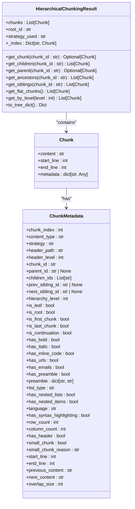

# Output Format

<cite>
**Referenced Files in This Document**   
- [output-format.md](file://docs/reference/output-format.md)
- [types.md](file://docs/api/types.md)
- [adapter.py](file://adapter.py)
- [output_filter.py](file://output_filter.py)
- [code_heavy.md](file://tests/fixtures/code_heavy.md)
- [list_heavy.md](file://tests/fixtures/list_heavy.md)
- [nested_fencing_minimal.md](file://tests/fixtures/nested_fencing_minimal.md)
- [014ed12b.json](file://tests/golden_before_migration/014ed12b.json)
- [01ff0baa.json](file://tests/golden_before_migration/01ff0baa.json)
- [03fe11fa.json](file://tests/golden_before_migration/03fe11fa.json)
</cite>

## Table of Contents
1. [Overview](#overview)
2. [Output Structure](#output-structure)
3. [Chunk Model](#chunk-model)
4. [ChunkMetadata Model](#chunkmetadata-model)
5. [HierarchicalChunkingResult Model](#hierarchicalchunkingresult-model)
6. [Parent-Child Relationships](#parent-child-relationships)
7. [Navigation Properties](#navigation-properties)
8. [Metadata Enrichment](#metadata-enrichment)
9. [Example Outputs](#example-outputs)
10. [Streaming Mode](#streaming-mode)
11. [Schema Diagrams](#schema-diagrams)
12. [Field-Level Descriptions](#field-level-descriptions)
13. [Backward Compatibility](#backward-compatibility)
14. [Consumer Processing Guidelines](#consumer-processing-guidelines)

## Overview

The Advanced Markdown Chunker plugin returns results in a format compatible with Dify's knowledge pipeline UI. The output format is designed to preserve all metadata functionality while ensuring compatibility with React-based rendering systems. The chunking process produces hierarchical, structure-aware chunks with rich metadata for improved Retrieval-Augmented Generation (RAG) performance.

The output format has evolved through several versions to address compatibility issues and enhance functionality. The current format uses a string array structure with embedded metadata to avoid React rendering errors that occurred with object arrays in previous versions.

**Section sources**
- [output-format.md](file://docs/reference/output-format.md#L1-L282)

## Output Structure

### Result Field

The `result` field contains an **array of strings**, where each string represents one chunk. This structure ensures compatibility with Dify's knowledge pipeline UI.

```json
{
  "result": [
    "<metadata>\n{...json...}\n</metadata>\n<chunk content>",
    "<metadata>\n{...json...}\n</metadata>\n<chunk content>",
    "..."
  ]
}
```

### String Format

Each string in the `result` array follows this format:

```
<metadata>
{
  "chunk_index": 0,
  "content_type": "list",
  "strategy": "list",
  "char_count": 78,
  "line_count": 2,
  ...
}
</metadata>
<chunk content here>
```

**Components:**

1. **Metadata Block** (optional, when `include_metadata=true`):
   - Starts with `<metadata>` tag
   - Contains JSON object with chunk metadata
   - Ends with `</metadata>` tag
   - Followed by newline

2. **Content**:
   - The actual chunk text
   - Preserves original Markdown formatting

### Without Metadata

When `include_metadata=false`, the result contains only content:

```json
{
  "result": [
    "# Header\n\nContent here...",
    "More content...",
    "..."
  ]
}
```

**Section sources**
- [output-format.md](file://docs/reference/output-format.md#L9-L65)

## Chunk Model

The Chunk model represents a single chunk of Markdown content with associated metadata. Each chunk contains the actual content text and metadata that describes its characteristics, position, and relationships within the document hierarchy.

A Chunk is defined as a data structure with the following properties:
- `content`: The actual Markdown text of the chunk
- `start_line`: Starting line number in the source document (1-indexed)
- `end_line`: Ending line number in the source document (1-indexed)
- `metadata`: A dictionary containing various metadata fields that describe the chunk's properties

The Chunk model serves as the fundamental unit of content in the chunking process, designed to be both human-readable and machine-processable for downstream RAG applications.

**Section sources**
- [types.md](file://docs/api/types.md#L448-L455)

## ChunkMetadata Model

The ChunkMetadata model contains comprehensive information about each chunk's characteristics, position, and relationships. The metadata is filtered to include only fields that are useful for RAG retrieval, excluding statistical and internal fields to reduce size and improve relevance.

### Core Fields (Always Included)

- `chunk_index`: Position in the document (0-based)
- `content_type`: Type of content (list, code, table, text, etc.)
- `is_first_chunk`, `is_last_chunk`: Position indicators
- `is_continuation`: Whether chunk continues from previous

### Structural Fields (Semantic Indicators)

- `has_bold`, `has_italic`, `has_inline_code`: Formatting indicators
- `has_urls`, `has_emails`: Link indicators
- `has_preamble`: Whether chunk has preamble
- `preamble`: If present, contains `{content: "..."}` with preamble text

### Overlap Fields (Context Windows)

When overlap is enabled (`overlap_size > 0`):
- `previous_content`: Last N characters from previous chunk (metadata only)
- `next_content`: First N characters from next chunk (metadata only)
- `overlap_size`: Size of context window in characters

**Important:** The overlap model uses **metadata-only context windows**:
- `overlap_size` is the context window size, NOT the amount of duplicated text
- `chunk.content` contains distinct, non-overlapping text
- `previous_content` and `next_content` are metadata fields only
- No physical text duplication occurs in chunk content
- This design avoids index bloat and semantic search confusion

### Content-Specific Fields

**For Lists:**
- `list_type`: ordered/unordered
- `has_nested_lists`: Whether contains nested lists
- `has_nested_items`: Whether has nested items

**For Code:**
- `language`: Programming language (if specified)
- `has_syntax_highlighting`: Whether language is specified

**For Tables:**
- `row_count`: Number of rows
- `column_count`: Number of columns
- `has_header`: Whether table has header row

### Small Chunk Fields

Chunks may be marked as "small" based on specific criteria:
- `small_chunk`: Boolean flag indicating if chunk is small AND structurally weak
- `small_chunk_reason`: Reason for flagging (currently only "cannot_merge")

**Small Chunk Criteria (ALL must be met):**
1. Chunk size is below `min_chunk_size` configuration
2. Cannot merge with adjacent chunks without exceeding `max_chunk_size`  
3. Chunk is structurally weak (lacks strong headers, multiple paragraphs, or meaningful content)

**Structural Strength Indicators (ANY prevents small_chunk flag):**
- Has header level 2 (`##`) or 3 (`###`)
- Contains at least 3 lines of non-header content
- Text content exceeds 100 characters after header extraction
- Contains at least 2 paragraph breaks (double newline)

**Important:** A chunk below `min_chunk_size` that has structural strength (e.g., level 2-3 headers, multiple paragraphs, substantial text) will NOT be flagged as `small_chunk`.

**Current Limitation:** Lists (bullet/numbered) are not yet considered as structural strength indicators.

### Line Range Fields

- `start_line`: Starting line number (1-indexed) - approximate location
- `end_line`: Ending line number (1-indexed) - approximate location

**Note:** Line ranges provide approximate locations in the source document. Adjacent chunks may have overlapping `start_line`/`end_line` ranges. For precise chunk location, use the content text itself.

**Section sources**
- [output-format.md](file://docs/reference/output-format.md#L67-L132)

## HierarchicalChunkingResult Model

The HierarchicalChunkingResult model represents the complete hierarchical structure of chunked content with navigation methods for traversing the hierarchy.

```python
@dataclass
class HierarchicalChunkingResult:
    chunks: List[Chunk]         # All chunks including root document chunk
    root_id: str                # ID of document-level chunk
    strategy_used: str          # Name of chunking strategy applied
    _index: Dict[str, Chunk]    # Internal O(1) lookup index
```

### Navigation Methods

```python
def get_chunk(chunk_id: str) -> Optional[Chunk]
    """Get chunk by ID with O(1) lookup."""

def get_children(chunk_id: str) -> List[Chunk]
    """Get all child chunks of given chunk."""

def get_parent(chunk_id: str) -> Optional[Chunk]
    """Get parent chunk of given chunk."""

def get_ancestors(chunk_id: str) -> List[Chunk]
    """Get all ancestor chunks from parent to root."""

def get_siblings(chunk_id: str) -> List[Chunk]
    """Get all sibling chunks (including self)."""

def get_flat_chunks() -> List[Chunk]
    """Get only leaf chunks for backward-compatible retrieval."""

def get_by_level(level: int) -> List[Chunk]
    """Get all chunks at specific hierarchy level.
    Levels: 0=document, 1=section, 2=subsection, 3=paragraph"""

def to_tree_dict() -> Dict
    """Convert hierarchy to tree dictionary for serialization.
    Uses IDs to avoid circular references. Safe for JSON."""
```

**Example Usage:**

```python
from markdown_chunker_v2 import MarkdownChunker

chunker = MarkdownChunker()
result = chunker.chunk_hierarchical(markdown_text)

# Access document root
root = result.get_chunk(result.root_id)
print(f"Document: {root.content[:100]}...")

# Navigate hierarchy
sections = result.get_children(result.root_id)
for section in sections:
    subsections = result.get_children(section.metadata['chunk_id'])
    print(f"Section {section.metadata['header_path']}: {len(subsections)} subsections")

# Get breadcrumb for context
matched_chunk = sections[0]
breadcrumb = [a.metadata['header_path'] for a in result.get_ancestors(matched_chunk.metadata['chunk_id'])]
print(f"Path: {' > '.join(reversed(breadcrumb))}")

# Backward-compatible flat access
leaf_chunks = result.get_flat_chunks()
print(f"Total leaf chunks: {len(leaf_chunks)}")

# Export as tree
tree = result.to_tree_dict()
import json
print(json.dumps(tree, indent=2))
```

**Section sources**
- [types.md](file://docs/api/types.md#L444-L518)

## Parent-Child Relationships

The hierarchical chunking system establishes parent-child relationships between chunks based on the document's structural hierarchy. These relationships are determined by analyzing header paths and levels in the original Markdown document.

The hierarchy builder creates parent-child links using the following logic:
- Chunk B is a child of Chunk A if B's header_path starts with A's header_path + "/"
- Or if B's header_level > A's header_level and they are adjacent in the document
- Preamble chunks are always children of the root document chunk
- If no parent is found, chunks are attached to the root

This relationship system allows for accurate representation of the document's logical structure, enabling consumers to navigate from high-level sections to detailed subsections and understand the context of each piece of content.

The parent-child relationships are implemented through metadata fields:
- `parent_id`: References the parent chunk's ID
- `children_ids`: Array of child chunk IDs
- These references enable efficient traversal of the hierarchy in both directions

**Section sources**
- [types.md](file://docs/api/types.md#L361-L412)

## Navigation Properties

The hierarchical chunking system provides several navigation properties that enable efficient traversal of the document structure:

### Hierarchy Metadata Fields

Each chunk in hierarchical mode includes these additional metadata fields:

| Field | Type | Description |
|-------|------|-------------|
| `chunk_id` | str | Unique 8-char hash identifier |
| `parent_id` | str \| None | Parent chunk ID (None for root) |
| `children_ids` | List[str] | Child chunk IDs |
| `prev_sibling_id` | str \| None | Previous sibling ID |
| `next_sibling_id` | str \| None | Next sibling ID |
| `hierarchy_level` | int | 0=document, 1=section, 2=subsection, 3=paragraph |
| `is_leaf` | bool | Has no children |
| `is_root` | bool | Document-level chunk |

**Example metadata:**

```python
chunk.metadata = {
    "chunk_id": "a3f9d21c",
    "parent_id": "7b2e4f18",
    "children_ids": ["c4e8f90d", "91d3a7f2"],
    "prev_sibling_id": None,
    "next_sibling_id": "e5a2b8d3",
    "hierarchy_level": 2,
    "is_leaf": False,
    "is_root": False,
    "header_path": "/Installation/Requirements"
}
```

These navigation properties enable various use cases:
- **Breadcrumb navigation**: Using `get_ancestors()` to show the path from root to current chunk
- **Section exploration**: Using `get_children()` to discover all subsections of a section
- **Sequential navigation**: Using `prev_sibling_id` and `next_sibling_id` to move through siblings
- **Context retrieval**: Using `get_parent()` to get higher-level context for a chunk

**Section sources**
- [types.md](file://docs/api/types.md#L520-L549)

## Metadata Enrichment

The chunking process enriches each chunk with metadata that enhances its utility for RAG applications. The metadata is carefully curated to include only fields that provide value for retrieval and relevance ranking, while filtering out statistical and internal fields that would increase index size without improving search quality.

### Filtered Out (Not Included)

The following fields are **excluded** as they don't help with RAG retrieval:

**Statistical fields:**
- `avg_line_length`, `avg_word_length`, `char_count`, `line_count`, `size_bytes`, `word_count`

**Count fields:**
- `item_count`, `nested_item_count`, `unordered_item_count`, `ordered_item_count`, `max_nesting`, `task_item_count`

**Internal fields:**
- `execution_fallback_level`, `execution_fallback_used`, `execution_strategy_used`, `strategy`, `total_chunks`, `preview`

**Preamble internal fields:**
- `preamble.char_count`, `preamble.line_count`, `preamble.has_metadata`, `preamble.metadata_fields`, `preamble.type`, `preamble_type`

This filtering strategy reduces the metadata footprint while preserving semantic information that helps with document understanding and retrieval relevance. The enriched metadata focuses on structural indicators, content types, and navigational properties that enable intelligent querying and context-aware retrieval.

**Section sources**
- [output-format.md](file://docs/reference/output-format.md#L148-L163)

## Example Outputs

### Code-Heavy Document

For a document with multiple code blocks (Python, JavaScript, SQL), the chunking process preserves code blocks as atomic units:

```json
{
  "result": [
    "<metadata>\n{\n  \"strategy\": \"code_aware\",\n  \"content_type\": \"code\",\n  \"language\": \"python\",\n  \"has_syntax_highlighting\": true,\n  \"chunk_index\": 0,\n  \"header_path\": \"/Code-Heavy Document/Python Example\",\n  \"start_line\": 9,\n  \"end_line\": 19\n}\n</metadata>\n```python\ndef calculate_fibonacci(n):\n    \"\"\"Calculate the nth Fibonacci number.\"\"\"\n    if n <= 1:\n        return n\n    return calculate_fibonacci(n-1) + calculate_fibonacci(n-2)\n\n# Example usage\nfor i in range(10):\n    print(f\"F({i}) = {calculate_fibonacci(i)}\")\n```"
  ]
}
```

### List-Heavy Document

For a document with multiple nested lists, the chunking process groups related list items:

```json
{
  "result": [
    "<metadata>\n{\n  \"strategy\": \"list\",\n  \"content_type\": \"list\",\n  \"list_type\": \"unordered\",\n  \"has_nested_lists\": true,\n  \"chunk_index\": 0,\n  \"header_path\": \"/List-Heavy Document/Shopping List\",\n  \"start_line\": 7,\n  \"end_line\": 18\n}\n</metadata>\n- Fruits\n  - Apples\n  - Bananas\n  - Oranges\n- Vegetables\n  - Carrots\n  - Broccoli\n  - Spinach\n- Dairy\n  - Milk\n  - Cheese\n  - Yogurt"
  ]
}
```

### Nested Fencing Scenario

For documents with nested code fencing, the chunking process preserves the nested structure:

```json
{
  "result": [
    "<metadata>\n{\n  \"strategy\": \"structural\",\n  \"content_type\": \"code\",\n  \"language\": \"markdown\",\n  \"chunk_index\": 0,\n  \"header_path\": \"/Minimal Nested Fencing Example\",\n  \"start_line\": 5,\n  \"end_line\": 12\n}\n</metadata>\n````markdown\nUse code blocks like this:\n\n```python\ndef example():\n    pass\n```\n````"
  ]
}
```

**Section sources**
- [code_heavy.md](file://tests/fixtures/code_heavy.md#L1-L74)
- [list_heavy.md](file://tests/fixtures/list_heavy.md#L1-L53)
- [nested_fencing_minimal.md](file://tests/fixtures/nested_fencing_minimal.md#L1-L15)

## Streaming Mode

The chunking process supports streaming mode, which affects output structure and timing. In streaming mode, chunks are processed and returned incrementally rather than waiting for the entire document to be processed.

Key characteristics of streaming mode:
- Chunks are emitted as soon as they are processed
- Output timing is optimized for large documents
- Memory usage is reduced by processing chunks incrementally
- The final output structure remains consistent with non-streaming mode
- Hierarchical relationships are maintained even when chunks are processed incrementally

Streaming mode is particularly beneficial for large documents where immediate feedback is valuable and for systems with memory constraints. The incremental processing allows consumers to begin working with the initial chunks while the remainder of the document is still being processed.

**Section sources**
- [adapter.py](file://adapter.py#L131-L156)

## Schema Diagrams



**Diagram sources**
- [types.md](file://docs/api/types.md#L444-L549)
- [output-format.md](file://docs/reference/output-format.md#L67-L163)

## Field-Level Descriptions

### Data Types and Constraints

| Field | Type | Constraints | Semantic Meaning |
|-------|------|-------------|------------------|
| chunk_index | int | ≥ 0 | Position in document sequence |
| content_type | str | enum: text, code, list, table, section, document, preamble | Primary content classification |
| strategy | str | enum: auto, code_aware, list, structural, fallback | Chunking strategy applied |
| header_path | str | format: "/Level 1/Level 2/Level 3" | Hierarchical path to first header |
| header_level | int | 0-6 | Markdown header level (0 for document) |
| chunk_id | str | 8-character hash | Unique identifier for chunk |
| parent_id | str | 8-character hash or null | Reference to parent chunk |
| children_ids | List[str] | array of 8-character hashes | References to child chunks |
| hierarchy_level | int | 0-3 | Semantic hierarchy level |
| is_leaf | bool | true/false | Whether chunk has children |
| is_root | bool | true/false | Whether chunk is document root |
| start_line | int | ≥ 1 | Starting line in source document |
| end_line | int | ≥ start_line | Ending line in source document |
| previous_content | str | ≤ overlap_size characters | Context from previous chunk |
| next_content | str | ≤ overlap_size characters | Context from next chunk |
| overlap_size | int | ≥ 0 | Size of context window |

The field-level constraints ensure data integrity and consistency across the chunking process. The semantic meaning of each field is designed to support RAG applications by providing contextual information that enhances retrieval relevance and enables intelligent querying.

**Section sources**
- [types.md](file://docs/api/types.md#L520-L549)
- [output-format.md](file://docs/reference/output-format.md#L67-L163)

## Backward Compatibility

### Version History

- **2.0.2** (2025-11-23): Changed to string array format for UI compatibility
- **2.0.1** (2025-11-23): Object array format (incompatible with UI)
- **2.0.0** (2025-11-23): Initial release

### Why This Format?

Dify's knowledge pipeline UI expects `result` to be an array of strings:
- ✅ Compatible with React rendering
- ✅ Can be displayed directly in UI
- ✅ Metadata preserved but encoded as string
- ✅ Can be parsed by downstream processors

### Previous Format (Incompatible)

The previous format returned objects:

```json
{
  "result": [
    {
      "content": "...",
      "metadata": {...}
    }
  ]
}
```

This caused React error #31: "Objects are not valid as a React child"

The current format maintains backward compatibility through:
- Consistent chunk boundaries regardless of metadata inclusion
- Support for both hierarchical and flat chunking modes
- Preservation of all semantic information in metadata
- Graceful handling of optional fields

The migration adapter ensures that existing workflows continue to function while providing access to enhanced features through the chunkana engine.

**Section sources**
- [output-format.md](file://docs/reference/output-format.md#L164-L277)

## Consumer Processing Guidelines

Consumers should process and utilize the hierarchical relationships and metadata for downstream RAG applications as follows:

### Parsing Metadata

To extract metadata from a chunk string:

```python
import json
import re

def parse_chunk(chunk_str):
    """Parse chunk string into content and metadata."""
    # Check if metadata exists
    if not chunk_str.startswith("<metadata>"):
        return {"content": chunk_str, "metadata": None}
    
    # Extract metadata block
    match = re.match(r'<metadata>\n(.*?)\n</metadata>\n(.*)', chunk_str, re.DOTALL)
    if not match:
        return {"content": chunk_str, "metadata": None}
    
    metadata_json = match.group(1)
    content = match.group(2)
    
    try:
        metadata = json.loads(metadata_json)
        return {"content": content, "metadata": metadata}
    except json.JSONDecodeError:
        return {"content": chunk_str, "metadata": None}

# Example usage
chunk = result["result"][0]
parsed = parse_chunk(chunk)
print(f"Content: {parsed['content']}")
print(f"Metadata: {parsed['metadata']}")
```

### Best Practices

1. **Always validate format**: Check for `<metadata>` tag before parsing
2. **Handle missing metadata**: Some chunks may not have metadata
3. **Preserve original format**: Don't modify chunk strings unnecessarily
4. **Use metadata for filtering**: Filter chunks by content_type, strategy, etc.
5. **Consider overlap**: Use overlap fields to deduplicate if needed
6. **Leverage hierarchy**: Use navigation methods to understand context
7. **Respect indexable flag**: Only index chunks with `indexable=True`
8. **Use header_path for context**: Include parent section titles in prompts

### Downstream RAG Applications

For RAG applications, utilize the metadata and hierarchy to:
- Enhance retrieval relevance by considering content type and structure
- Provide context in prompts by including parent section information
- Implement intelligent summarization using hierarchical relationships
- Support navigation use cases with parent-child-sibling links
- Optimize indexing by filtering out non-indexable chunks
- Improve query understanding by considering structural indicators

The enriched metadata and hierarchical relationships enable more sophisticated RAG patterns, such as contextual retrieval, hierarchical summarization, and intelligent navigation.

**Section sources**
- [output-format.md](file://docs/reference/output-format.md#L193-L272)
- [output_filter.py](file://output_filter.py#L24-L116)