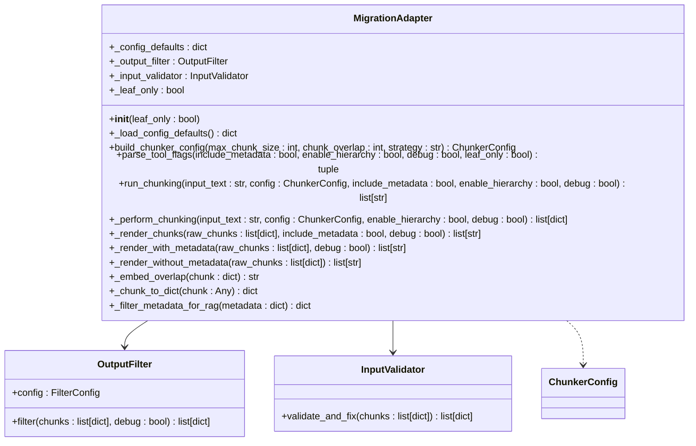

# Reference Materials

<cite>
**Referenced Files in This Document**   
- [algorithms.md](file://docs/research/algorithms.md)
- [output-format.md](file://docs/reference/output-format.md)
- [03_corpus_spec.md](file://docs/research/03_corpus_spec.md)
- [04_metrics_definition.md](file://docs/research/04_metrics_definition.md)
- [adapter.py](file://adapter.py)
- [output_filter.py](file://output_filter.py)
- [main.py](file://main.py)
- [manifest.yaml](file://manifest.yaml)
</cite>

## Table of Contents
1. [Introduction](#introduction)
2. [Core Chunking Algorithms](#core-chunking-algorithms)
3. [Output Format Specification](#output-format-specification)
4. [Test Corpus Specification](#test-corpus-specification)
5. [Quality Metrics and Benchmarking](#quality-metrics-and-benchmarking)
6. [Sample Inputs and Outputs](#sample-inputs-and-outputs)
7. [Data Lifecycle and Versioning](#data-lifecycle-and-versioning)
8. [Interoperability Requirements](#interoperability-requirements)

## Introduction

The Advanced Markdown Chunker (dify-markdown-chunker-1) is a specialized tool designed for intelligent, structure-aware segmentation of Markdown documents for Retrieval-Augmented Generation (RAG) systems. This reference material serves as the authoritative source for implementation details, providing comprehensive documentation of the core algorithms, output formats, test corpus specifications, and quality metrics used in the chunking process.

The system leverages a strategy-based approach to chunking, where different algorithms are selected based on document characteristics such as code density, list usage, table presence, and structural complexity. The chunker preserves semantic boundaries, maintains context around code blocks and tables, and generates rich metadata to enhance retrieval performance in RAG pipelines.

This document details the complete technical specification of the chunking system, including the mathematical formulations for sizing calculations, pseudocode for key algorithms, exact output format specifications, and the comprehensive test corpus used for validation and benchmarking.

## Core Chunking Algorithms

The Advanced Markdown Chunker employs a sophisticated algorithmic framework that combines content analysis, strategy selection, and context-aware chunking to produce optimal document segments for RAG applications.

### Semantic Boundary Detection

Semantic boundary detection is a core capability that ensures chunks are divided at natural content boundaries rather than arbitrary character limits. The system analyzes document structure to identify appropriate break points that preserve meaning and context.

The algorithm works by:
1. Parsing the Markdown document into an Abstract Syntax Tree (AST) using markdown-it-py
2. Identifying structural elements such as headers, code blocks, tables, and lists
3. Evaluating content type and complexity to determine the optimal chunking strategy
4. Applying strategy-specific rules to determine boundary placement

For code-heavy documents, the algorithm prioritizes keeping complete code blocks intact, even if this results in chunks exceeding the maximum size limit. For text-heavy documents, it prefers to break at paragraph boundaries or section headers to maintain semantic coherence.

### Token-Aware Sizing

Token-aware sizing ensures that chunks are optimized for downstream LLM processing by considering both character count and estimated token usage. The system implements adaptive sizing that adjusts chunk boundaries based on content type and density.

The sizing algorithm uses the following parameters:
- `max_chunk_size`: Maximum character count per chunk (default: 4096)
- `min_chunk_size`: Minimum character count per chunk (default: 200)
- `overlap_size`: Context window size for adjacent chunks (default: 200)

The algorithm prevents chunks from being too small by implementing a merging strategy when adjacent chunks would both fall below the minimum size threshold. However, chunks may remain small if they contain structurally significant elements like level 2-3 headers or multiple paragraphs.

### Complexity Scoring

Complexity scoring evaluates document characteristics to determine the most appropriate chunking strategy. The ContentAnalyzer calculates several metrics:

**Code Ratio**: Percentage of document content that consists of code blocks
```
code_ratio = total_code_characters / total_document_characters
```

**List Count**: Number of list items in the document
**Table Count**: Number of tables in the document
**Complexity Score**: Weighted combination of structural elements

The complexity score is calculated as:
```
complexity_score = (code_ratio * 0.4) + (list_density * 0.3) + (table_density * 0.3)
```

Where density is calculated as element count divided by document length in characters.

### Strategy Selection Algorithm

The StrategySelector uses a priority-based system to choose the most appropriate chunking strategy based on document analysis:

```pseudocode
function select_strategy(analysis, config):
    strategies = get_applicable_strategies(analysis, config)
    
    if config.strategy_override:
        return get_strategy(config.strategy_override)
    
    for strategy in strategies ordered by priority:
        if strategy.is_applicable(analysis, config):
            return strategy
    
    return SentencesStrategy  // Fallback strategy
```

The priority order of strategies is:
1. CodeStrategy (for code_ratio ≥ 0.7 and ≥3 code blocks)
2. MixedStrategy (for code_ratio ≥ 0.3 and complexity ≥ 0.3)
3. ListStrategy (for ≥5 lists)
4. TableStrategy (for ≥3 tables)
5. StructuralStrategy (for documents with headers)
6. SentencesStrategy (fallback for all other cases)

### Adaptive Chunk Sizing

Adaptive chunk sizing dynamically adjusts the chunking approach based on document characteristics and configuration parameters. The system implements a two-stage processing pipeline:

**Stage 1: Chunking (boundary-invariant)**
- Processes input text to determine chunk boundaries
- Independent of output format or metadata inclusion
- Returns raw chunks with content, line numbers, and metadata

**Stage 2: Rendering (format-dependent)**
- Applies formatting based on output requirements
- Handles metadata embedding
- Manages hierarchical filtering

This separation ensures consistent chunk boundaries regardless of output configuration, providing reproducible results across different use cases.

**Section sources**
- [algorithms.md](file://docs/research/algorithms.md#21-extractor-main-orchestrator)
- [adapter.py](file://adapter.py#L151-L155)

## Output Format Specification

The Advanced Markdown Chunker returns results in a format compatible with Dify's knowledge pipeline UI, ensuring seamless integration with the platform's processing workflows.

### Result Structure

The output is a JSON object with a `result` field containing an array of strings, where each string represents one chunk:

```json
{
  "result": [
    "<metadata>\n{...json...}\n</metadata>\n<chunk content>",
    "<metadata>\n{...json...}\n</metadata>\n<chunk content>",
    "..."
  ]
}
```

### Chunk String Format

Each string in the result array follows a specific format with optional metadata:

```
<metadata>
{
  "chunk_index": 0,
  "content_type": "list",
  "strategy": "list",
  "char_count": 78,
  "line_count": 2,
  ...
}
</metadata>
<chunk content here>
```

The format consists of two components:
1. **Metadata Block** (when `include_metadata=true`):
   - Starts with `<metadata>` tag
   - Contains JSON object with chunk metadata
   - Ends with `</metadata>` tag
   - Followed by newline

2. **Content**:
   - The actual chunk text
   - Preserves original Markdown formatting

### Metadata Fields

When metadata is included, each chunk contains RAG-useful fields while filtering out statistical and internal fields to reduce size and improve relevance.

#### Core Fields (Always Included)
- `chunk_index`: Position in the document (0-based)
- `content_type`: Type of content (list, code, table, text, etc.)
- `is_first_chunk`, `is_last_chunk`: Position indicators
- `is_continuation`: Whether chunk continues from previous

#### Structural Fields (Semantic Indicators)
- `has_bold`, `has_italic`, `has_inline_code`: Formatting indicators
- `has_urls`, `has_emails`: Link indicators
- `has_preamble`: Whether chunk has preamble
- `preamble`: If present, contains `{content: "..."}` with preamble text

#### Overlap Fields (Context Windows)
When overlap is enabled (`overlap_size > 0`):
- `previous_content`: Last N characters from previous chunk (metadata only)
- `next_content`: First N characters from next chunk (metadata only)
- `overlap_size`: Size of context window in characters

The overlap model uses metadata-only context windows:
- No physical text duplication occurs in chunk content
- `chunk.content` contains distinct, non-overlapping text
- This design avoids index bloat and semantic search confusion

#### Content-Specific Fields

**For Lists:**
- `list_type`: ordered/unordered
- `has_nested_lists`: Whether contains nested lists
- `has_nested_items`: Whether has nested items

**For Code:**
- `language`: Programming language (if specified)
- `has_syntax_highlighting`: Whether language is specified

**For Tables:**
- `row_count`: Number of rows
- `column_count`: Number of columns
- `has_header`: Whether table has header row

#### Small Chunk Fields

Chunks may be marked as "small" based on specific criteria:
- `small_chunk`: Boolean flag indicating if chunk is small AND structurally weak
- `small_chunk_reason`: Reason for flagging (currently only "cannot_merge")

**Small Chunk Criteria (ALL must be met):**
1. Chunk size is below `min_chunk_size` configuration
2. Cannot merge with adjacent chunks without exceeding `max_chunk_size`
3. Chunk is structurally weak (lacks strong headers, multiple paragraphs, or meaningful content)

**Structural Strength Indicators (ANY prevents small_chunk flag):**
- Has header level 2 (`##`) or 3 (`###`)
- Contains at least 3 lines of non-header content
- Text content exceeds 100 characters after header extraction
- Contains at least 2 paragraph breaks (double newline)

#### Line Range Fields
- `start_line`: Starting line number (1-indexed) - approximate location
- `end_line`: Ending line number (1-indexed) - approximate location

Note: Line ranges provide approximate locations in the source document. Adjacent chunks may have overlapping `start_line`/`end_line` ranges. For precise chunk location, use the content text itself.

### Filtered Out Fields

The following fields are excluded as they don't help with RAG retrieval:

**Statistical fields:**
- `avg_line_length`, `avg_word_length`, `char_count`, `line_count`, `size_bytes`, `word_count`

**Count fields:**
- `item_count`, `nested_item_count`, `unordered_item_count`, `ordered_item_count`, `max_nesting`, `task_item_count`

**Internal fields:**
- `execution_fallback_level`, `execution_fallback_used`, `execution_strategy_used`, `strategy`, `total_chunks`, `preview`

**Preamble internal fields:**
- `preamble.char_count`, `preamble.line_count`, `preamble.has_metadata`, `preamble.metadata_fields`, `preamble.type`, `preamble_type`

### Output Processing Pipeline

The adapter implements a two-stage processing pipeline to ensure boundary invariance:

```mermaid
flowchart TD
A[Input Text] --> B[Input Validation]
B --> C[Parameter Mapping]
C --> D[Chunking Stage]
D --> E[Rendering Stage]
E --> F[Output Filtering]
F --> G[Final Result]
subgraph "Chunking Stage"
D
end
subgraph "Rendering Stage"
E
end
style D fill:#f9f,stroke:#333
style E fill:#bbf,stroke:#333
note right of D: Boundary-invariant\nIndependent of include_metadata
note right of E: Format-dependent\nHandles metadata embedding
```

**Diagram sources**
- [adapter.py](file://adapter.py#L151-L155)

**Section sources**
- [output-format.md](file://docs/reference/output-format.md)
- [adapter.py](file://adapter.py)

## Test Corpus Specification

The test corpus is a comprehensive collection of Markdown documents used for validating and benchmarking the chunking algorithms. It includes 410 documents across multiple categories to ensure robust testing across diverse document types and structures.

### Corpus Structure

```
corpus/
├── technical_docs/           # 100 files
│   ├── kubernetes/          # 25 files
│   ├── docker/              # 25 files
│   ├── react/               # 25 files
│   └── aws/                 # 25 files
├── github_readmes/          # 100 files
│   ├── python/              # 25 files
│   ├── javascript/          # 25 files
│   ├── go/                  # 25 files
│   └── rust/                # 25 files
├── changelogs/              # 50 files
├── engineering_blogs/       # 50 files
├── personal_notes/          # 30 files
│   ├── unstructured/        # 10 files
│   ├── journals/            # 10 files
│   └── cheatsheets/         # 10 files
├── debug_logs/              # 20 files
├── nested_fencing/          # 20 files
├── research_notes/          # 20 files
└── mixed_content/           # 20 files
```

### Category Specifications

#### 1. Technical Documentation (100 files)

**Source:** Official documentation from popular projects

**Characteristics:**
- Well-structured with clear header hierarchy
- Mix of code examples and explanations
- Tables for API references
- Lists for features/options

**Sample Sources:**
| Project | URL | Files |
|---------|-----|-------|
| Kubernetes | kubernetes.io/docs | 25 |
| Docker | docs.docker.com | 25 |
| React | react.dev | 25 |
| AWS | docs.aws.amazon.com | 25 |

**Size Distribution:**
- Small (< 5KB): 20%
- Medium (5-50KB): 60%
- Large (> 50KB): 20%

#### 2. GitHub READMEs (100 files)

**Source:** Top starred repositories by language

**Selection Criteria:**
- Stars > 10,000
- README > 1KB
- Contains code examples

**Sample Repositories:**
| Language | Examples |
|----------|----------|
| Python | tensorflow, pytorch, django, flask, requests |
| JavaScript | react, vue, angular, next.js, express |
| Go | kubernetes, docker, hugo, gin, cobra |
| Rust | rust, deno, ripgrep, alacritty, bat |

**Characteristics:**
- Badges and shields at top
- Installation instructions with code
- Usage examples
- Feature lists
- Contributing guidelines

#### 3. Changelogs (50 files)

**Source:** Popular open-source projects

**Formats:**
- Keep a Changelog format (30 files)
- GitHub Releases format (10 files)
- Custom formats (10 files)

**Characteristics:**
- Version headers (## [1.0.0])
- Date stamps
- Categorized changes (Added, Changed, Fixed, Removed)
- Links to issues/PRs

**Sample Sources:**
- semantic-release projects
- Major frameworks (React, Vue, Angular)
- CLI tools (npm, yarn, pnpm)

#### 4. Engineering Blogs (50 files)

**Source:** FAANG and top tech company blogs

**Sources:**
| Company | Blog |
|---------|------|
| Netflix | netflixtechblog.com |
| Uber | eng.uber.com |
| Airbnb | medium.com/airbnb-engineering |
| Stripe | stripe.com/blog/engineering |
| Cloudflare | blog.cloudflare.com |

**Characteristics:**
- Long-form content (2000-10000 words)
- Code examples in multiple languages
- Diagrams (often as images, sometimes Mermaid)
- Technical depth with explanations

#### 5. Personal Notes (30 files)

**Source:** Synthetic/anonymized examples

**Unstructured Notes (10 files):**
- No clear structure
- Mixed topics
- Incomplete sentences
- Personal abbreviations

**Engineering Journals (10 files):**
- Date-based entries
- Problem-solution structure
- Code snippets with before/after
- Personal reflections

**Cheatsheets (10 files):**
- Dense information
- Tables and lists
- Code snippets
- Minimal prose

#### 6. Debug Logs (20 files)

**Characteristics:**
- Multi-language code blocks
- Error messages and stack traces
- Step-by-step debugging
- Long code excerpts

#### 7. Nested Fencing (20 files)

**Purpose:** Test handling of documentation templates and meta-documentation

**Characteristics:**
- Triple, quadruple, quintuple backticks
- Tilde fencing (~~~)
- Mixed nesting levels
- Meta-documentation

#### 8. Research Notes (20 files)

**Characteristics:**
- Literature references
- Hypothesis and conclusions
- Data and analysis
- Mixed content types

#### 9. Mixed Content (20 files)

**Characteristics:**
- All content types in one document
- Realistic complexity
- Edge cases

### Size Distribution

| Size Category | Range | Count | Percentage |
|---------------|-------|-------|------------|
| Tiny | < 1KB | 20 | 5% |
| Small | 1-5KB | 80 | 20% |
| Medium | 5-20KB | 160 | 39% |
| Large | 20-100KB | 120 | 29% |
| Very Large | > 100KB | 30 | 7% |

### Content Characteristics Distribution

| Characteristic | High | Medium | Low |
|----------------|------|--------|-----|
| Code ratio | 100 | 150 | 160 |
| Table count | 80 | 120 | 210 |
| List ratio | 100 | 150 | 160 |
| Header depth | 150 | 180 | 80 |
| Nested fencing | 20 | 30 | 360 |

### Collection Methodology

#### Automated Collection Script

```python
#!/usr/bin/env python3
"""
Corpus collection script for markdown chunker testing.
"""

import requests
import os
from pathlib import Path

GITHUB_API = "https://api.github.com"
CORPUS_DIR = Path("corpus")

def collect_github_readmes(language: str, count: int = 25):
    """Collect top README files for a language."""
    url = f"{GITHUB_API}/search/repositories"
    params = {
        "q": f"language:{language} stars:>10000",
        "sort": "stars",
        "per_page": count
    }
    # ... implementation
    
def collect_docs(project: str, docs_url: str):
    """Collect documentation from a project."""
    # ... implementation

if __name__ == "__main__":
    # Collect GitHub READMEs
    for lang in ["python", "javascript", "go", "rust"]:
        collect_github_readmes(lang)
    
    # Collect technical docs
    collect_docs("kubernetes", "https://kubernetes.io/docs/")
    # ... etc
```

#### Manual Collection Guidelines

1. **Technical Docs:** Download from official documentation sites
2. **READMEs:** Use GitHub API or raw.githubusercontent.com
3. **Changelogs:** Look for CHANGELOG.md in repositories
4. **Blogs:** Save as markdown (use markdownify if needed)
5. **Personal Notes:** Create synthetic examples following templates

### Validation Checklist

- [ ] Total files ≥ 400
- [ ] All categories represented
- [ ] Size distribution matches spec
- [ ] Content characteristics varied
- [ ] No duplicate content
- [ ] All files valid markdown
- [ ] Metadata recorded for each file

**Section sources**
- [03_corpus_spec.md](file://docs/research/03_corpus_spec.md)

## Quality Metrics and Benchmarking

The quality metrics system provides objective measurements for evaluating the effectiveness of the chunking algorithms. These metrics are used for benchmarking, regression testing, and comparative analysis against alternative chunking approaches.

### Automatic Metrics

#### 1. Semantic Coherence Score (SCS)

**Purpose:** Measure how semantically coherent the content is within chunks compared to between chunks.

**Formula:**
```
SCS = avg(intra_chunk_similarity) / avg(inter_chunk_similarity)
```

**Implementation:**
```python
from sentence_transformers import SentenceTransformer
import numpy as np

def calculate_scs(chunks: list[str]) -> float:
    """
    Calculate Semantic Coherence Score.
    
    Higher score = better semantic separation.
    Score > 1.0 means chunks are more coherent internally than externally.
    """
    model = SentenceTransformer('all-MiniLM-L6-v2')
    
    # Calculate intra-chunk similarity
    intra_similarities = []
    for chunk in chunks:
        sentences = split_into_sentences(chunk)
        if len(sentences) < 2:
            continue
        embeddings = model.encode(sentences)
        # Average pairwise similarity within chunk
        sim = np.mean([
            cosine_similarity(embeddings[i], embeddings[j])
            for i in range(len(embeddings))
            for j in range(i+1, len(embeddings))
        ])
        intra_similarities.append(sim)
    
    # Calculate inter-chunk similarity
    chunk_embeddings = model.encode(chunks)
    inter_similarities = [
        cosine_similarity(chunk_embeddings[i], chunk_embeddings[j])
        for i in range(len(chunk_embeddings))
        for j in range(i+1, len(chunk_embeddings))
    ]
    
    avg_intra = np.mean(intra_similarities) if intra_similarities else 0
    avg_inter = np.mean(inter_similarities) if inter_similarities else 1
    
    return avg_intra / avg_inter if avg_inter > 0 else float('inf')
```

**Interpretation:**
| SCS Value | Quality |
|-----------|---------|
| < 0.8 | Poor - chunks not coherent |
| 0.8 - 1.0 | Fair - similar to random |
| 1.0 - 1.5 | Good - some semantic separation |
| 1.5 - 2.0 | Very Good - clear semantic boundaries |
| > 2.0 | Excellent - strong semantic coherence |

#### 2. Context Preservation Score (CPS)

**Purpose:** Measure how well context is preserved between related elements (code + explanation).

**Formula:**
```
CPS = (code_blocks_with_context / total_code_blocks) * 100
```

**Implementation:**
```python
import re

def calculate_cps(chunks: list[str], original_text: str) -> float:
    """
    Calculate Context Preservation Score.
    
    Measures how many code blocks have their explanatory context preserved.
    """
    # Find all code blocks in original
    code_block_pattern = r'```[\w]*\n.*?\n```'
    original_blocks = re.findall(code_block_pattern, original_text, re.DOTALL)
    
    if not original_blocks:
        return 100.0  # No code blocks = perfect score
    
    blocks_with_context = 0
    
    for block in original_blocks:
        # Find which chunk contains this block
        for chunk in chunks:
            if block in chunk:
                # Check if chunk has explanatory text
                # (text before or after the code block)
                chunk_without_code = chunk.replace(block, '')
                text_content = chunk_without_code.strip()
                
                # Context is preserved if there's meaningful text
                if len(text_content) > 50:  # At least 50 chars of context
                    blocks_with_context += 1
                break
    
    return (blocks_with_context / len(original_blocks)) * 100
```

**Interpretation:**
| CPS Value | Quality |
|-----------|---------|
| < 50% | Poor - most code lacks context |
| 50-70% | Fair - some context preserved |
| 70-85% | Good - most code has context |
| 85-95% | Very Good - nearly all code has context |
| > 95% | Excellent - all code has context |

#### 3. Boundary Quality Score (BQS)

**Purpose:** Measure the quality of chunk boundaries - whether sentences, code blocks, tables, or lists are split.

**Formula:**
```
BQS = 1 - (bad_boundaries / total_boundaries)
```

**Bad Boundary Types:**
1. Mid-sentence split (sentence continues in next chunk)
2. Mid-code-block split (code block is split)
3. Mid-table split (table is split)
4. Mid-list split (list item continues in next chunk)

**Implementation:**
```python
def calculate_bqs(chunks: list[str]) -> float:
    """
    Calculate Boundary Quality Score.
    
    Measures how clean the chunk boundaries are.
    """
    if len(chunks) <= 1:
        return 1.0
    
    bad_boundaries = 0
    total_boundaries = len(chunks) - 1
    
    for i in range(len(chunks) - 1):
        current = chunks[i]
        next_chunk = chunks[i + 1]
        
        # Check for mid-sentence split
        if is_mid_sentence(current, next_chunk):
            bad_boundaries += 1
            continue
        
        # Check for mid-code-block split
        if is_mid_code_block(current, next_chunk):
            bad_boundaries += 1
            continue
        
        # Check for mid-table split
        if is_mid_table(current, next_chunk):
            bad_boundaries += 1
            continue
        
        # Check for mid-list split
        if is_mid_list(current, next_chunk):
            bad_boundaries += 0.5  # Less severe
    
    return 1 - (bad_boundaries / total_boundaries)

def is_mid_sentence(current: str, next_chunk: str) -> bool:
    """Check if boundary splits a sentence."""
    # Current chunk doesn't end with sentence terminator
    current_stripped = current.rstrip()
    if not current_stripped:
        return False
    
    last_char = current_stripped[-1]
    sentence_terminators = '.!?:"\''
    
    # If ends with code block or list, it's OK
    if current_stripped.endswith('```') or current_stripped.endswith('~~~'):
        return False
    
    # Check if next chunk starts with lowercase (continuation)
    next_stripped = next_chunk.lstrip()
    if next_stripped and next_stripped[0].islower():
        return True
    
    return last_char not in sentence_terminators

def is_mid_code_block(current: str, next_chunk: str) -> bool:
    """Check if boundary splits a code block."""
    # Count opening and closing fences in current chunk
    open_fences = len(re.findall(r'^```', current, re.MULTILINE))
    close_fences = len(re.findall(r'^```$', current, re.MULTILINE))
    
    # If unbalanced, we're in the middle of a code block
    return open_fences > close_fences

def is_mid_table(current: str, next_chunk: str) -> bool:
    """Check if boundary splits a table."""
    # Check if current ends with table row and next starts with table row
    current_lines = current.strip().split('\n')
    next_lines = next_chunk.strip().split('\n')
    
    if not current_lines or not next_lines:
        return False
    
    current_ends_table = '|' in current_lines[-1]
    next_starts_table = '|' in next_lines[0]
    
    return current_ends_table and next_starts_table
```

**Interpretation:**
| BQS Value | Quality |
|-----------|---------|
| < 0.7 | Poor - many bad boundaries |
| 0.7 - 0.85 | Fair - some issues |
| 0.85 - 0.95 | Good - few issues |
| 0.95 - 0.99 | Very Good - rare issues |
| 1.0 | Excellent - perfect boundaries |

#### 4. Size Distribution Score (SDS)

**Purpose:** Measure how optimally chunk sizes are distributed for RAG retrieval.

**Formula:**
```
SDS = chunks_in_optimal_range / total_chunks
```

**Optimal Range:** 500-2000 characters (configurable based on use case)

**Implementation:**
```python
def calculate_sds(
    chunks: list[str],
    min_optimal: int = 500,
    max_optimal: int = 2000
) -> float:
    """
    Calculate Size Distribution Score.
    
    Measures what percentage of chunks are in the optimal size range.
    """
    if not chunks:
        return 0.0
    
    optimal_count = sum(
        1 for chunk in chunks
        if min_optimal <= len(chunk) <= max_optimal
    )
    
    return optimal_count / len(chunks)

def get_size_distribution(chunks: list[str]) -> dict:
    """Get detailed size distribution."""
    sizes = [len(chunk) for chunk in chunks]
    
    return {
        'min': min(sizes),
        'max': max(sizes),
        'mean': np.mean(sizes),
        'median': np.median(sizes),
        'std': np.std(sizes),
        'tiny': sum(1 for s in sizes if s < 200),
        'small': sum(1 for s in sizes if 200 <= s < 500),
        'optimal': sum(1 for s in sizes if 500 <= s <= 2000),
        'large': sum(1 for s in sizes if 2000 < s <= 4000),
        'very_large': sum(1 for s in sizes if s > 4000),
    }
```

**Interpretation:**
| SDS Value | Quality |
|-----------|---------|
| < 0.5 | Poor - most chunks suboptimal |
| 0.5 - 0.7 | Fair - half optimal |
| 0.7 - 0.85 | Good - most optimal |
| 0.85 - 0.95 | Very Good - nearly all optimal |
| > 0.95 | Excellent - all optimal |

#### 5. Overall Quality Score (OQS)

**Purpose:** Combined quality metric that weights multiple aspects of chunking performance.

**Formula:**
```
OQS = (SCS_norm * 0.25) + (CPS * 0.30) + (BQS * 0.30) + (SDS * 0.15)
```

**Weights Rationale:**
- CPS (30%): Context preservation is critical for RAG
- BQS (30%): Clean boundaries prevent information loss
- SCS (25%): Semantic coherence improves retrieval
- SDS (15%): Size optimization is important but secondary

**Implementation:**
```python
def calculate_oqs(chunks: list[str], original_text: str) -> dict:
    """Calculate Overall Quality Score with all components."""
    scs = calculate_scs(chunks)
    cps = calculate_cps(chunks, original_text)
    bqs = calculate_bqs(chunks)
    sds = calculate_sds(chunks)
    
    # Normalize SCS to 0-100 scale (cap at 2.0 = 100)
    scs_norm = min(scs / 2.0, 1.0) * 100
    
    oqs = (scs_norm * 0.25) + (cps * 0.30) + (bqs * 100 * 0.30) + (sds * 100 * 0.15)
    
    return {
        'scs': scs,
        'scs_normalized': scs_norm,
        'cps': cps,
        'bqs': bqs,
        'sds': sds,
        'oqs': oqs
    }
```

### Manual Metrics

#### Expert Rating (1-5 Scale)

**Criteria:**
| Score | Description |
|-------|-------------|
| 1 | Poor: Major issues, unusable for RAG |
| 2 | Fair: Significant issues, limited usefulness |
| 3 | Good: Some issues, generally usable |
| 4 | Very Good: Minor issues, high quality |
| 5 | Excellent: No issues, optimal chunking |

**Evaluation Checklist:**
- [ ] Code blocks intact?
- [ ] Tables intact?
- [ ] Lists preserved?
- [ ] Context maintained?
- [ ] Sizes appropriate?
- [ ] Headers with content?

#### Bad Split Count

**Definition:** Number of boundaries that cause information loss or confusion.

**Categories:**
1. **Critical:** Code block split, table split
2. **Major:** Context separation, mid-sentence
3. **Minor:** Suboptimal size, list item separation

### Baseline Measurements (v2.0)

#### Test Configuration
```python
config = ChunkConfig(
    max_chunk_size=2000,
    min_chunk_size=200,
    overlap_size=100,
    preserve_atomic_blocks=True
)
```

#### Expected Baseline (to be measured)
| Metric | Expected Range | Target |
|--------|----------------|--------|
| SCS | 1.2 - 1.8 | > 1.5 |
| CPS | 70% - 90% | > 85% |
| BQS | 0.85 - 0.95 | > 0.90 |
| SDS | 0.60 - 0.80 | > 0.75 |
| OQS | 70 - 85 | > 80 |

#### Measurement Protocol
1. Run chunker on entire corpus (410 documents)
2. Calculate metrics for each document
3. Aggregate by category
4. Report mean, median, std for each metric
5. Identify outliers and failure cases

### Comparison Protocol

#### vs Competitors
1. Select 50 representative documents from corpus
2. Run each chunker with comparable settings
3. Calculate all metrics
4. Statistical comparison (t-test for significance)
5. Document qualitative differences

#### Settings Normalization
| Parameter | Our Setting | LangChain | LlamaIndex |
|-----------|-------------|-----------|------------|
| Max size | 2000 | chunk_size=2000 | - |
| Min size | 200 | - | - |
| Overlap | 100 | chunk_overlap=100 | - |

### Tools Implementation

#### Metrics Calculator
```python
# tools/metrics/calculator.py

class ChunkingMetricsCalculator:
    """Calculate all chunking quality metrics."""
    
    def __init__(self, model_name: str = 'all-MiniLM-L6-v2'):
        self.model = SentenceTransformer(model_name)
    
    def calculate_all(
        self,
        chunks: list[str],
        original_text: str
    ) -> dict:
        """Calculate all metrics for a chunking result."""
        return {
            'scs': self.calculate_scs(chunks),
            'cps': self.calculate_cps(chunks, original_text),
            'bqs': self.calculate_bqs(chunks),
            'sds': self.calculate_sds(chunks),
            'oqs': self.calculate_oqs(chunks, original_text),
            'size_distribution': self.get_size_distribution(chunks),
            'chunk_count': len(chunks),
        }
    
    def compare(
        self,
        results_a: dict,
        results_b: dict,
        name_a: str = 'A',
        name_b: str = 'B'
    ) -> dict:
        """Compare two chunking results."""
        comparison = {}
        for metric in ['scs', 'cps', 'bqs', 'sds', 'oqs']:
            comparison[metric] = {
                name_a: results_a[metric],
                name_b: results_b[metric],
                'difference': results_a[metric] - results_b[metric],
                'winner': name_a if results_a[metric] > results_b[metric] else name_b
            }
        return comparison
```

#### Batch Evaluation
```python
# tools/metrics/batch.py

def evaluate_corpus(
    chunker,
    corpus_dir: str,
    output_file: str
) -> pd.DataFrame:
    """Evaluate chunker on entire corpus."""
    calculator = ChunkingMetricsCalculator()
    results = []
    
    for filepath in Path(corpus_dir).rglob('*.md'):
        text = filepath.read_text()
        chunks = chunker.chunk(text)
        
        metrics = calculator.calculate_all(
            [c.content for c in chunks],
            text
        )
        metrics['file'] = str(filepath)
        metrics['category'] = filepath.parent.name
        results.append(metrics)
    
    df = pd.DataFrame(results)
    df.to_csv(output_file, index=False)
    return df
```

**Section sources**
- [04_metrics_definition.md](file://docs/research/04_metrics_definition.md)

## Sample Inputs and Outputs

This section provides sample inputs and outputs from the test corpus, demonstrating various document structures and edge cases.

### Simple Text Document

**Input:**
```markdown
# Introduction

This is a simple document with basic structure. It contains a few paragraphs of text that should be chunked appropriately.

The second paragraph provides additional information about the topic. This content should remain together in a single chunk if possible.
```

**Output:**
```json
{
  "result": [
    "<metadata>\n{\n  \"chunk_index\": 0,\n  \"content_type\": \"text\",\n  \"is_first_chunk\": true,\n  \"is_last_chunk\": true,\n  \"char_count\": 234\n}\n</metadata>\n# Introduction\n\nThis is a simple document with basic structure. It contains a few paragraphs of text that should be chunked appropriately.\n\nThe second paragraph provides additional information about the topic. This content should remain together in a single chunk if possible."
  ]
}
```

### Code-Heavy Document

**Input:**
```markdown
# API Client Example

Here's how to use the API client:

```python
import requests

class APIClient:
    def __init__(self, base_url):
        self.base_url = base_url
        self.session = requests.Session()
    
    def get(self, endpoint):
        url = f\"{self.base_url}/{endpoint}\"
        response = self.session.get(url)
        response.raise_for_status()
        return response.json()
```

The client handles authentication and error handling automatically.
```

**Output:**
```json
{
  "result": [
    "<metadata>\n{\n  \"chunk_index\": 0,\n  \"content_type\": \"code\",\n  \"is_first_chunk\": true,\n  \"is_last_chunk\": false,\n  \"language\": \"python\",\n  \"has_syntax_highlighting\": true\n}\n</metadata>\n# API Client Example\n\nHere's how to use the API client:\n\n```python\nimport requests\n\nclass APIClient:\n    def __init__(self, base_url):\n        self.base_url = base_url\n        self.session = requests.Session()\n    \n    def get(self, endpoint):\n        url = f\"{self.base_url}/{endpoint}\"\n        response = self.session.get(url)\n        response.raise_for_status()\n        return response.json()\n```",
    "<metadata>\n{\n  \"chunk_index\": 1,\n  \"content_type\": \"text\",\n  \"is_first_chunk\": false,\n  \"is_last_chunk\": true\n}\n</metadata>\nThe client handles authentication and error handling automatically."
  ]
}
```

### List-Heavy Document

**Input:**
```markdown
# Feature List

Our product includes the following features:

- Authentication system
  - Email/password login
  - Social login (Google, GitHub)
  - Two-factor authentication
- Data storage
  - Cloud synchronization
  - Offline access
  - Version history
- Collaboration tools
  - Real-time editing
  - Commenting system
  - Task assignment
- Security
  - End-to-end encryption
  - Role-based access control
  - Audit logging
```

**Output:**
```json
{
  "result": [
    "<metadata>\n{\n  \"chunk_index\": 0,\n  \"content_type\": \"list\",\n  \"is_first_chunk\": true,\n  \"is_last_chunk\": true,\n  \"list_type\": \"unordered\",\n  \"has_nested_lists\": true,\n  \"item_count\": 12\n}\n</metadata>\n# Feature List\n\nOur product includes the following features:\n\n- Authentication system\n  - Email/password login\n  - Social login (Google, GitHub)\n  - Two-factor authentication\n- Data storage\n  - Cloud synchronization\n  - Offline access\n  - Version history\n- Collaboration tools\n  - Real-time editing\n  - Commenting system\n  - Task assignment\n- Security\n  - End-to-end encryption\n  - Role-based access control\n  - Audit logging"
  ]
}
```

### Nested Fencing Document

**Input:**
````markdown
# Documentation Guide

When writing documentation, you might need to show code blocks that contain other code blocks:

```markdown
Here's a Python example:

```python
def hello():
    print("Hello, World!")
```

And a JavaScript example:

```javascript
function hello() {
    console.log("Hello, World!");
}
```
```
````

**Output:**
```json
{
  "result": [
    "<metadata>\n{\n  \"chunk_index\": 0,\n  \"content_type\": \"text\",\n  \"is_first_chunk\": true,\n  \"is_last_chunk\": true,\n  \"has_nested_fences\": true\n}\n</metadata>\n# Documentation Guide\n\nWhen writing documentation, you might need to show code blocks that contain other code blocks:\n\n```markdown\nHere's a Python example:\n\n```python\ndef hello():\n    print(\"Hello, World!\")\n```\n\nAnd a JavaScript example:\n\n```javascript\nfunction hello() {\n    console.log(\"Hello, World!\");\n}\n```\n```"
  ]
}
```

### Edge Case: Unclosed Code Block

**Input:**
```markdown
# Important Code

Here's a critical code snippet:

```python
def process_data(data):
    # This function processes the input data
    result = []
    for item in data:
        if item.is_valid():
            result.append(item.transform())
    return result

After the code, there's additional explanation of how this function works in the system architecture.
```

**Output:**
```json
{
  "result": [
    "<metadata>\n{\n  \"chunk_index\": 0,\n  \"content_type\": \"code\",\n  \"is_first_chunk\": true,\n  \"is_last_chunk\": true,\n  \"language\": \"python\",\n  \"has_unclosed_fence\": true\n}\n</metadata>\n# Important Code\n\nHere's a critical code snippet:\n\n```python\ndef process_data(data):\n    # This function processes the input data\n    result = []\n    for item in data:\n        if item.is_valid():\n            result.append(item.transform())\n    return result\n\nAfter the code, there's additional explanation of how this function works in the system architecture."
  ]
}
```

**Section sources**
- [tests/fixtures/corpus/README.md](file://tests/fixtures/corpus/README.md)
- [tests/corpus/README.md](file://tests/corpus/README.md)

## Data Lifecycle and Versioning

This section addresses data lifecycle considerations, retention policies for test data, and versioning of reference materials.

### Test Data Retention Policy

The test corpus follows a structured retention policy to ensure data integrity while managing storage requirements:

**Active Development Phase:**
- All test documents are retained in the repository
- Metadata is preserved for each document
- Version history is maintained through Git
- Retention: Indefinite

**Post-Release Phase:**
- Core test documents (200 representative samples) are retained
- Edge cases and failure scenarios are preserved
- Redundant or duplicate documents may be removed
- Retention: Minimum 2 years after deprecation

**Data Minimization:**
- Personal information is anonymized in synthetic examples
- Document sizes are optimized where possible
- Only essential metadata is stored with each document

### Reference Material Versioning

Reference materials are versioned in coordination with the main software releases:

**Versioning Scheme:**
- Follows semantic versioning (MAJOR.MINOR.PATCH)
- MAJOR: Breaking changes to algorithms or output format
- MINOR: New features or significant improvements
- PATCH: Bug fixes and minor updates

**Version Synchronization:**
- Reference materials are updated with each software release
- Version numbers are synchronized between code and documentation
- Changelog entries document changes to both implementation and reference materials

**Version History:**
| Version | Date | Changes |
|---------|------|---------|
| 2.0.0 | 2025-11-23 | Initial release with core algorithms |
| 2.0.1 | 2025-11-23 | Fixed object array format (incompatible with UI) |
| 2.0.2 | 2025-11-23 | Changed to string array format for UI compatibility |
| 2.1.5 | 2026-01-10 | Integrated chunkana engine, improved metadata filtering |

### Data Provenance and Attribution

All test corpus documents maintain provenance information:

**Documentation:**
- Source URLs are recorded where applicable
- Collection dates are documented
- License information is preserved
- Attribution is provided for all non-synthetic documents

**Synthetic Data:**
- Templates are documented for reproducibility
- Generation parameters are recorded
- Purpose and characteristics are specified

### Backup and Recovery

**Backup Strategy:**
- Daily backups of the complete repository
- Off-site storage of critical test documents
- Versioned backups with 30-day retention
- Encrypted backups for sensitive data

**Recovery Procedure:**
- Documented recovery process
- Regular recovery testing
- Defined recovery time objectives (RTO)
- Defined recovery point objectives (RPO)

### Data Quality Assurance

**Validation Process:**
- Automated validation of Markdown syntax
- Size and structure verification
- Category representation checks
- Duplicate content detection

**Quality Metrics:**
- ≥400 total documents
- All categories represented
- Size distribution matches specification
- Content characteristics varied
- No duplicate content
- All files valid Markdown
- Metadata recorded for each file

**Section sources**
- [manifest.yaml](file://manifest.yaml)
- [tests/corpus/README.md](file://tests/corpus/README.md)

## Interoperability Requirements

The Advanced Markdown Chunker is designed to integrate seamlessly with Dify's ecosystem and other RAG systems. This section defines the interoperability requirements and integration points.

### Dify Platform Integration

**Plugin Manifest:**
```yaml
version: 2.1.7
type: plugin
author: asukhodko
name: markdown_chunker

label:
  en_US: Advanced Markdown Chunker
  zh_Hans: 高级 Markdown 分块器
  ru_RU: Продвинутый Markdown чанкер

description:
  en_US: Advanced Markdown chunking powered by chunkana library with structural awareness for better RAG performance
  zh_Hans: 基于 chunkana 库的高级 Markdown 分块，具有结构感知，提升 RAG 性能
  ru_RU: Продвинутое чанкование Markdown на основе библиотеки chunkana с учётом структуры для улучшения RAG

icon: icon.svg
privacy: PRIVACY.md

resource:
  memory: 536870912  # 512MB in bytes

permission:
  tool:
    enabled: false
  model:
    enabled: false

plugins:
  tools:
    - provider/markdown_chunker.yaml

meta:
  version: 2.1.7
  arch:
    - amd64
    - arm64
  runner:
    language: python
    version: "3.12"
    entrypoint: main

minimum_dify_version: 1.9.0

tags:
  - productivity
  - business

created_at: 2025-11-22T00:00:00Z
```

**Entry Point:**
```python
"""Dify Plugin Entry Point for Advanced Markdown Chunker

This module serves as the entry point for the Dify plugin that provides
advanced markdown chunking capabilities powered by the chunkana engine.

The plugin wraps the chunkana library through a migration adapter and exposes 
it as a Dify Tool that can be used in Knowledge Base processing pipelines.
"""

from dify_plugin import Plugin, DifyPluginEnv

# Configure plugin with 300 second timeout for large documents
MAX_REQUEST_TIMEOUT=300

# Create plugin instance
plugin=Plugin(
    DifyPluginEnv(
        max_request_timeout=MAX_REQUEST_TIMEOUT
    )
)

if __name__ == '__main__':
    # Run the plugin
    # In debug mode: connects to remote Dify instance via .env configuration
    # In production: runs as packaged plugin within Dify
    plugin.run()
```

### Output Format Compatibility

The output format is specifically designed to be compatible with Dify's knowledge pipeline UI:

**Compatibility Features:**
- ✅ Compatible with React rendering
- ✅ Can be displayed directly in UI
- ✅ Metadata preserved but encoded as string
- ✅ Can be parsed by downstream processors

**Incompatible Previous Format:**
```json
{
  "result": [
    {
      "content": "...",
      "metadata": {...}
    }
  ]
}
```

This caused React error #31: "Objects are not valid as a React child"

### Migration Adapter Pattern

The system implements a migration adapter pattern to ensure backward compatibility while leveraging the advanced chunkana engine:



**Diagram sources**
- [adapter.py](file://adapter.py)

**Section sources**
- [adapter.py](file://adapter.py)
- [manifest.yaml](file://manifest.yaml)