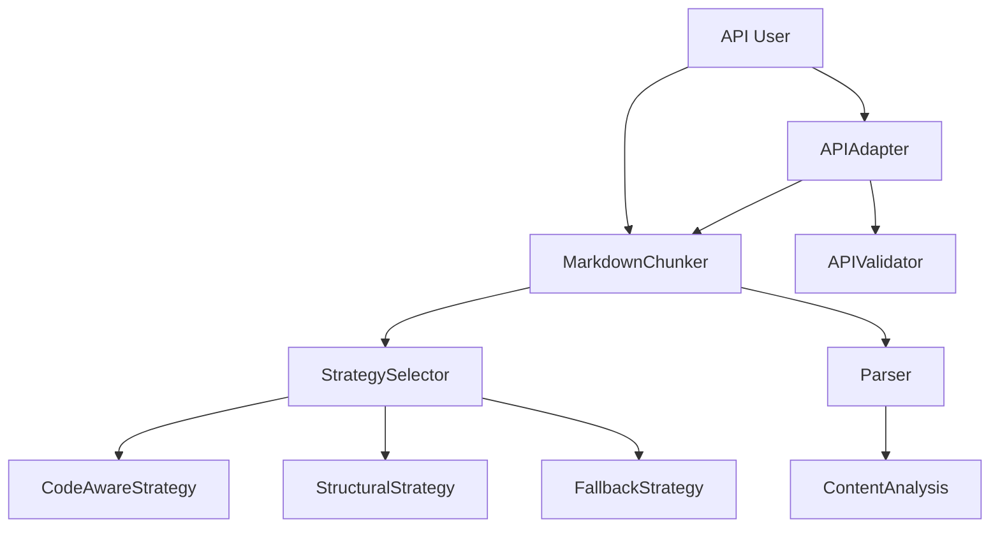
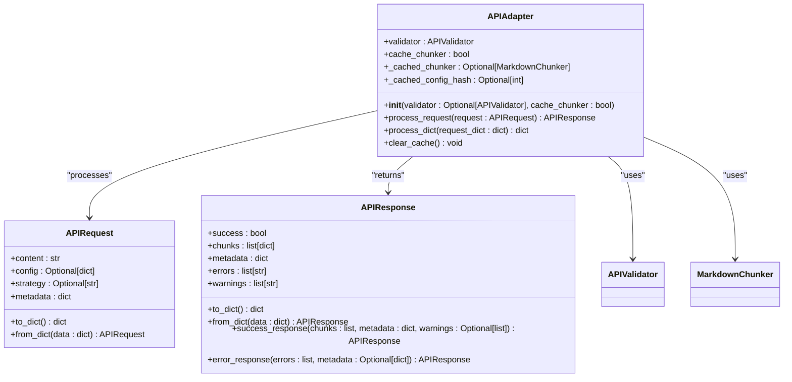

# API Reference

<cite>
**Referenced Files in This Document**   
- [markdown_chunker/__init__.py](file://markdown_chunker/__init__.py)
- [markdown_chunker_v2/__init__.py](file://markdown_chunker_v2/__init__.py)
- [markdown_chunker_v2/chunker.py](file://markdown_chunker_v2/chunker.py)
- [markdown_chunker_v2/config.py](file://markdown_chunker_v2/config.py)
- [markdown_chunker_v2/types.py](file://markdown_chunker_v2/types.py)
- [markdown_chunker_v2/strategies/__init__.py](file://markdown_chunker_v2/strategies/__init__.py)
- [markdown_chunker_legacy/api/adapter.py](file://markdown_chunker_legacy/api/adapter.py)
- [markdown_chunker_legacy/api/types.py](file://markdown_chunker_legacy/api/types.py)
- [examples/api_usage.py](file://examples/api_usage.py)
- [tests/api/test_adapter.py](file://tests/api/test_adapter.py)
</cite>

## Table of Contents
1. [Introduction](#introduction)
2. [Core API Components](#core-api-components)
3. [MarkdownChunker Class](#markdownchunker-class)
4. [ChunkConfig Configuration](#chunkconfig-configuration)
5. [Strategy Selection API](#strategy-selection-api)
6. [API Adapter Pattern](#api-adapter-pattern)
7. [Usage Examples](#usage-examples)
8. [Versioning and Compatibility](#versioning-and-compatibility)

## Introduction

The Markdown chunker provides a comprehensive API for processing markdown documents into chunks suitable for retrieval-augmented generation (RAG) systems. The API exposes a simplified interface through the `MarkdownChunker` class, with supporting components for configuration, strategy selection, and REST integration. The system is designed to be both powerful and easy to use, with sensible defaults and extensive customization options.

The API is organized into several key components:
- **MarkdownChunker**: Main class for chunking operations
- **ChunkConfig**: Configuration object with factory methods for common use cases
- **StrategySelector**: Automatic strategy selection based on document analysis
- **APIAdapter**: Adapter pattern implementation for REST integration
- **Types**: Data classes for chunks, analysis results, and validation

The API follows a clean, consistent design with clear separation of concerns. The core chunking functionality is exposed through simple methods, while advanced features are available through configuration options and extension points.

**Section sources**
- [markdown_chunker/__init__.py](file://markdown_chunker/__init__.py#L1-L33)
- [markdown_chunker_v2/__init__.py](file://markdown_chunker_v2/__init__.py#L1-L41)

## Core API Components

The API consists of several core components that work together to provide a complete markdown chunking solution. The main entry point is the `MarkdownChunker` class, which coordinates the chunking process. Configuration is handled through the `ChunkConfig` class, while strategy selection is managed by the `StrategySelector`. For REST integration, the `APIAdapter` provides a high-level interface that handles request validation, processing, and response formatting.

The component relationships can be visualized as follows:



**Diagram sources **
- [markdown_chunker_v2/chunker.py](file://markdown_chunker_v2/chunker.py#L21-L357)
- [markdown_chunker_v2/strategies/__init__.py](file://markdown_chunker_v2/strategies/__init__.py#L20-L75)
- [markdown_chunker_legacy/api/adapter.py](file://markdown_chunker_legacy/api/adapter.py#L15-L169)

**Section sources**
- [markdown_chunker_v2/chunker.py](file://markdown_chunker_v2/chunker.py#L21-L357)
- [markdown_chunker_v2/strategies/__init__.py](file://markdown_chunker_v2/strategies/__init__.py#L20-L75)

## MarkdownChunker Class

The `MarkdownChunker` class is the primary interface for chunking markdown documents. It provides methods for processing text, with options for returning additional metadata and metrics.

### Class Definition

```python
class MarkdownChunker:
    def __init__(self, config: Optional[ChunkConfig] = None)
    def chunk(self, md_text: str) -> List[Chunk]
    def chunk_with_metrics(self, md_text: str) -> tuple
    def chunk_with_analysis(self, md_text: str) -> tuple
```

### Constructor

**`__init__(config: Optional[ChunkConfig] = None)`**

Initializes a new `MarkdownChunker` instance.

**Parameters:**
- `config`: Chunking configuration (uses defaults if None)

**Returns:**
- `MarkdownChunker` instance

### Methods

**`chunk(md_text: str) -> List[Chunk]`**

Chunks a markdown document into a list of `Chunk` objects.

**Parameters:**
- `md_text`: Raw markdown text to chunk

**Returns:**
- List of `Chunk` objects containing the chunked content

**Pipeline:**
1. Parse document once
2. Select appropriate strategy
3. Apply strategy to create chunks
4. Merge small chunks with adjacent chunks
5. Apply overlap between chunks (if enabled)
6. Add standard metadata to chunks
7. Validate results against domain properties

**`chunk_with_metrics(md_text: str) -> tuple`**

Chunks a document and returns metrics about the chunking results.

**Returns:**
- Tuple of (chunks, metrics) where metrics is a `ChunkingMetrics` object

**`chunk_with_analysis(md_text: str) -> tuple`**

Chunks a document and returns the analysis information used for strategy selection.

**Returns:**
- Tuple of (chunks, strategy_name, analysis) where analysis is a `ContentAnalysis` object

**Section sources**
- [markdown_chunker_v2/chunker.py](file://markdown_chunker_v2/chunker.py#L21-L357)
- [markdown_chunker_v2/types.py](file://markdown_chunker_v2/types.py#L100-L187)

## ChunkConfig Configuration

The `ChunkConfig` class provides configuration options for the chunking process. It has been simplified from 32 parameters in the legacy version to 8 core parameters in v2.0.

### Class Definition

```python
@dataclass
class ChunkConfig:
    max_chunk_size: int = 4096
    min_chunk_size: int = 512
    overlap_size: int = 200
    preserve_atomic_blocks: bool = True
    extract_preamble: bool = True
    code_threshold: float = 0.3
    structure_threshold: int = 3
    strategy_override: Optional[str] = None
```

### Parameters

| Parameter | Type | Default | Description |
|---------|------|---------|-------------|
| `max_chunk_size` | int | 4096 | Maximum size of a chunk in characters |
| `min_chunk_size` | int | 512 | Minimum size of a chunk in characters |
| `overlap_size` | int | 200 | Size of overlap between chunks (0 = disabled) |
| `preserve_atomic_blocks` | bool | True | Keep code blocks and tables intact |
| `extract_preamble` | bool | True | Extract content before first header as preamble |
| `code_threshold` | float | 0.3 | Code ratio threshold for CodeAwareStrategy |
| `structure_threshold` | int | 3 | Minimum headers for StructuralStrategy |
| `strategy_override` | str | None | Force specific strategy (code_aware, structural, fallback) |

### Factory Methods

The `ChunkConfig` class provides several factory methods for common configuration profiles:

**`default()`**
Creates a default configuration with standard values.

**`for_code_heavy()`**
Creates a configuration optimized for code-heavy documents with larger chunk sizes and lower code threshold.

**`for_structured()`**
Creates a configuration optimized for structured documents with hierarchical headers.

**`minimal()`**
Creates a minimal configuration with small chunks for testing or constrained environments.

**`from_legacy(**kwargs)`**
Creates a configuration from legacy parameters with deprecation warnings. Maps old parameter names to new ones and ignores removed parameters.

**Section sources**
- [markdown_chunker_v2/config.py](file://markdown_chunker_v2/config.py#L12-L170)
- [markdown_chunker_v2/types.py](file://markdown_chunker_v2/types.py#L100-L187)

## Strategy Selection API

The strategy selection system automatically chooses the best chunking strategy based on document analysis. The `StrategySelector` class coordinates this process, selecting from three available strategies.

### StrategySelector Class

```python
class StrategySelector:
    def __init__(self)
    def select(self, analysis: ContentAnalysis, config: ChunkConfig) -> BaseStrategy
    def get_by_name(self, name: str) -> BaseStrategy
```

The selector follows a priority-based approach:
1. Check for `strategy_override` in configuration
2. Try strategies in order of priority (CodeAwareStrategy → StructuralStrategy → FallbackStrategy)
3. Return the first strategy that can handle the document
4. Fall back to FallbackStrategy if no other strategy is suitable

### Available Strategies

**CodeAwareStrategy (priority: 1)**
- Used for documents with code blocks or tables
- Preserves atomic blocks (code, tables) intact
- Splits text around atomic blocks
- Activated when: code blocks ≥ 1 OR tables ≥ 1 OR code ratio ≥ code_threshold

**StructuralStrategy (priority: 2)**
- Used for documents with hierarchical headers
- Splits document by headers into sections
- Maintains header hierarchy in metadata
- Activated when: headers ≥ structure_threshold AND max_header_depth > 1

**FallbackStrategy (priority: 3)**
- Universal fallback for any document
- Uses simple paragraph-based splitting
- Always works, but may not preserve document structure optimally

### BaseStrategy Abstract Class

All strategies inherit from `BaseStrategy`, which defines the common interface:

```python
class BaseStrategy(ABC):
    @property
    @abstractmethod
    def name(self) -> str: pass
    
    @property
    @abstractmethod
    def priority(self) -> int: pass
    
    @abstractmethod
    def can_handle(self, analysis: ContentAnalysis, config: ChunkConfig) -> bool: pass
    
    @abstractmethod
    def apply(self, md_text: str, analysis: ContentAnalysis, config: ChunkConfig) -> List[Chunk]: pass
```

**Section sources**
- [markdown_chunker_v2/strategies/__init__.py](file://markdown_chunker_v2/strategies/__init__.py#L20-L75)
- [markdown_chunker_v2/strategies/base.py](file://markdown_chunker_v2/strategies/base.py#L12-L233)
- [markdown_chunker_v2/strategies/code_aware.py](file://markdown_chunker_v2/strategies/code_aware.py#L15-L149)
- [markdown_chunker_v2/strategies/structural.py](file://markdown_chunker_v2/strategies/structural.py#L15-L151)

## API Adapter Pattern

The `APIAdapter` class implements the adapter pattern to provide a consistent interface for REST integration. It handles request validation, chunking, and response formatting, abstracting away the complexity of the underlying chunking system.

### Class Definition

```python
class APIAdapter:
    def __init__(self, validator: Optional[APIValidator] = None, cache_chunker: bool = True)
    def process_request(self, request: APIRequest) -> APIResponse
    def process_dict(self, request_dict: dict) -> dict
    def clear_cache(self) -> None
```

### Key Features

**Request Validation**
- Validates incoming requests using `APIValidator`
- Returns appropriate error responses for invalid requests
- Checks content, configuration, and strategy parameters

**Chunker Caching**
- Caches `MarkdownChunker` instances for performance
- Cache key based on configuration hash
- Automatically invalidated when configuration changes
- Can be disabled via `cache_chunker=False`

**Response Formatting**
- Converts chunking results to standardized `APIResponse` format
- Includes metadata about strategy used, processing time, etc.
- Handles both success and error cases consistently

**Error Handling**
- Catches and handles exceptions during processing
- Returns structured error responses with error type metadata
- Provides meaningful error messages for debugging

### API Types

The adapter uses several data classes to define the request/response contract:

**`APIRequest`**
- `content`: Markdown content to chunk
- `config`: Optional configuration dictionary
- `strategy`: Optional strategy override
- `metadata`: Optional request metadata

**`APIResponse`**
- `success`: Whether operation succeeded
- `chunks`: List of chunk dictionaries
- `metadata`: Response metadata (strategy, timing, etc.)
- `errors`: List of error messages
- `warnings`: List of warning messages

**`APIError`**
- `code`: Error code (VALIDATION_ERROR, PROCESSING_ERROR, CONFIGURATION_ERROR)
- `message`: Error message
- `details`: Optional error details
- `field`: Optional field that caused the error



**Diagram sources **
- [markdown_chunker_legacy/api/adapter.py](file://markdown_chunker_legacy/api/adapter.py#L15-L169)
- [markdown_chunker_legacy/api/types.py](file://markdown_chunker_legacy/api/types.py#L11-L162)

**Section sources**
- [markdown_chunker_legacy/api/adapter.py](file://markdown_chunker_legacy/api/adapter.py#L15-L169)
- [markdown_chunker_legacy/api/types.py](file://markdown_chunker_legacy/api/types.py#L11-L162)

## Usage Examples

The following examples demonstrate common usage patterns for the API.

### Basic Usage

```python
from markdown_chunker import MarkdownChunker

# Create chunker with default configuration
chunker = MarkdownChunker()

# Chunk a markdown document
chunks = chunker.chunk("# Hello World\n\nThis is a test document.")
print(f"Created {len(chunks)} chunks")
```

### Custom Configuration

```python
from markdown_chunker import MarkdownChunker, ChunkConfig

# Create chunker with custom configuration
config = ChunkConfig(
    max_chunk_size=2048,
    min_chunk_size=256,
    overlap_size=100
)
chunker = MarkdownChunker(config)

# Process document
chunks = chunker.chunk(md_text)
```

### Strategy Override

```python
from markdown_chunker import MarkdownChunker, ChunkConfig

# Force use of structural strategy
config = ChunkConfig(strategy_override="structural")
chunker = MarkdownChunker(config)

chunks = chunker.chunk(md_text)
```

### Using Convenience Functions

```python
from markdown_chunker import chunk_text, chunk_file

# Chunk text directly
chunks = chunk_text(md_text)

# Chunk a file
chunks = chunk_file("document.md")
```

### REST API Integration

```python
from markdown_chunker.api import APIAdapter, APIRequest

# Create API adapter
adapter = APIAdapter()

# Create API request
request = APIRequest(
    content="# Test\n\nContent here.",
    config={"max_chunk_size": 2048},
    strategy="auto"
)

# Process request
response = adapter.process_request(request)

if response.success:
    print(f"Chunks: {len(response.chunks)}")
    print(f"Strategy: {response.metadata['strategy_used']}")
else:
    print(f"Error: {response.errors}")
```

**Section sources**
- [examples/api_usage.py](file://examples/api_usage.py#L1-L356)
- [markdown_chunker_v2/__init__.py](file://markdown_chunker_v2/__init__.py#L32-L41)

## Versioning and Compatibility

The API follows semantic versioning with a focus on backward compatibility. Version 2.0 introduced significant simplifications while maintaining compatibility with common use cases.

### Backward Compatibility

The v2.0 API maintains backward compatibility through several mechanisms:

**Parameter Mapping**
- Old parameter names are mapped to new ones with deprecation warnings
- Removed parameters are ignored with appropriate warnings
- Legacy configuration parameters are supported via `from_legacy()` method

**Deprecated Parameters**
The following parameters from v1.x are deprecated and ignored in v2.0:
- `enable_overlap` (use `overlap_size > 0`)
- `block_based_splitting` (always enabled)
- `preserve_code_blocks`, `preserve_tables` (always enabled)
- `enable_deduplication`, `enable_regression_validation` (removed)
- `use_enhanced_parser` (always enabled)

**Migration Path**
The `MIGRATION.md` document provides detailed guidance for upgrading from v1.x to v2.0. The main changes include:
- Reduced configuration parameters from 32 to 8
- Simplified strategy system from 6 to 3 strategies
- Linear processing pipeline without duplication
- Improved API consistency and error handling

### Version Guarantees

The API provides the following backward compatibility guarantees:
- Minor versions (2.x) will not break existing functionality
- Deprecated features will be supported for at least one major version
- Configuration parameters will be supported via mapping or defaults
- Core API methods (`chunk`, `chunk_with_metrics`) will maintain signature compatibility

**Section sources**
- [markdown_chunker_v2/config.py](file://markdown_chunker_v2/config.py#L82-L135)
- [markdown_chunker/__init__.py](file://markdown_chunker/__init__.py#L7-L15)