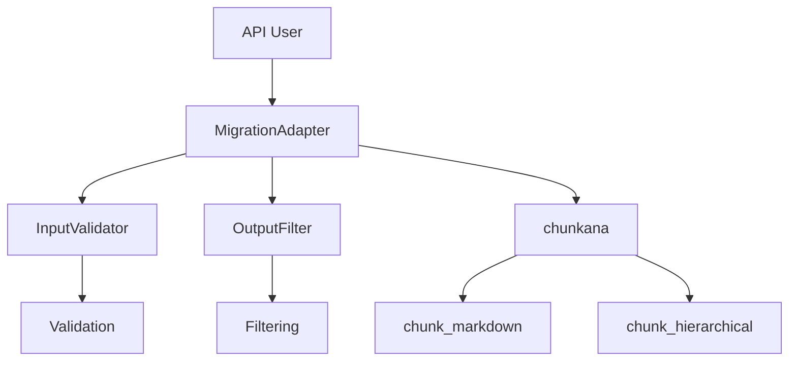
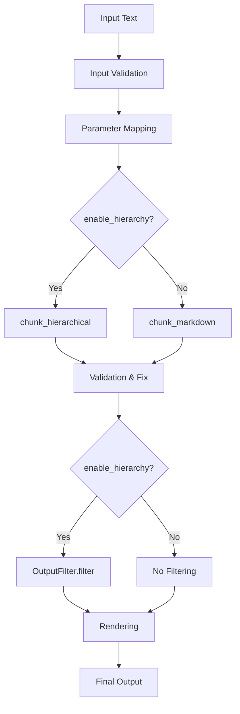

# API Reference

<cite>
**Referenced Files in This Document**   
- [adapter.py](file://adapter.py)
- [main.py](file://main.py)
- [docs/guides/migration-to-chunkana.md](file://docs/guides/migration-to-chunkana.md)
- [docs/api/types.md](file://docs/api/types.md)
- [docs/reference/configuration.md](file://docs/reference/configuration.md)
</cite>

## Update Summary
**Changes Made**   
- Updated documentation to reflect migration to chunkana engine integration
- Added comprehensive parameter mapping between plugin UI and chunkana configuration
- Enhanced documentation of hierarchical chunking features and advanced capabilities
- Updated API adapter pattern implementation details
- Added new usage examples for advanced features

## Table of Contents
1. [Introduction](#introduction)
2. [Core API Components](#core-api-components)
3. [MarkdownChunker Class](#markdownchunker-class)
4. [ChunkConfig Configuration](#chunkconfig-configuration)
5. [Strategy Selection API](#strategy-selection-api)
6. [API Adapter Pattern](#api-adapter-pattern)
7. [Usage Examples](#usage-examples)
8. [Versioning and Compatibility](#versioning-and-compatibility)

## Introduction

The Markdown chunker provides a comprehensive API for processing markdown documents into chunks suitable for retrieval-augmented generation (RAG) systems. The API exposes a simplified interface through the `MarkdownChunker` class, with supporting components for configuration, strategy selection, and REST integration. The system is designed to be both powerful and easy to use, with sensible defaults and extensive customization options.

The API is organized into several key components:
- **MarkdownChunker**: Main class for chunking operations
- **ChunkConfig**: Configuration object with factory methods for common use cases
- **StrategySelector**: Automatic strategy selection based on document analysis
- **APIAdapter**: Adapter pattern implementation for REST integration
- **Types**: Data classes for chunks, analysis results, and validation

The API follows a clean, consistent design with clear separation of concerns. The core chunking functionality is exposed through simple methods, while advanced features are available through configuration options and extension points.

**Section sources**
- [adapter.py](file://adapter.py#L26-L351)
- [main.py](file://main.py#L1-L38)

## Core API Components

The API consists of several core components that work together to provide a complete markdown chunking solution. The main entry point is the `MarkdownChunker` class, which coordinates the chunking process. Configuration is handled through the `ChunkConfig` class, while strategy selection is managed by the `StrategySelector`. For REST integration, the `APIAdapter` provides a high-level interface that handles request validation, processing, and response formatting.

The component relationships can be visualized as follows:


```mermaid
graph TD
A[API User] --> B[MigrationAdapter]
B --> C[InputValidator]
B --> D[OutputFilter]
B --> E[chunkana]
E --> F[chunk_markdown]
E --> G[chunk_hierarchical]
C --> H[Validation]
D --> I[Filtering]
```

**Diagram sources**
- [adapter.py](file://adapter.py#L43-L351)
- [main.py](file://main.py#L21-L37)

**Section sources**
- [adapter.py](file://adapter.py#L43-L351)
- [main.py](file://main.py#L21-L37)

## MarkdownChunker Class

The `MarkdownChunker` class is the primary interface for chunking markdown documents. It provides methods for processing text, with options for returning additional metadata and metrics.

### Class Definition

```python
class MigrationAdapter:
    def __init__(self, leaf_only: bool = False)
    def build_chunker_config(self, max_chunk_size: int = 4096, chunk_overlap: int = 200, strategy: str = "auto") -> ChunkerConfig
    def run_chunking(self, input_text: str, config: ChunkerConfig, include_metadata: bool = True, enable_hierarchy: bool = False, debug: bool = False) -> list[str]
```

### Constructor

**`__init__(leaf_only: bool = False)`**

Initializes a new `MigrationAdapter` instance.

**Parameters:**
- `leaf_only`: Return only leaf chunks in hierarchical mode

**Returns:**
- `MigrationAdapter` instance

### Methods

**`build_chunker_config(max_chunk_size: int = 4096, chunk_overlap: int = 200, strategy: str = "auto") -> ChunkerConfig`**

Builds a ChunkerConfig from tool parameters.

**Parameters:**
- `max_chunk_size`: Maximum size of a chunk in characters
- `chunk_overlap`: Size of overlap between chunks
- `strategy`: Chunking strategy selection

**Returns:**
- `ChunkerConfig` object for the chunkana engine

**`run_chunking(input_text: str, config: ChunkerConfig, include_metadata: bool = True, enable_hierarchy: bool = False, debug: bool = False) -> list[str]`**

Runs chunking with guaranteed boundary invariance.

**Pipeline:**
1. Input validation and preprocessing
2. Parameter mapping to chunkana configuration
3. Chunking stage (boundary-invariant, independent of output format)
4. Rendering stage (format-dependent, metadata embedding)
5. Output filtering (hierarchy filtering, debug control)

**Returns:**
- List of strings containing the chunked content

**Section sources**
- [adapter.py](file://adapter.py#L43-L351)

## ChunkConfig Configuration

The `ChunkConfig` class provides configuration options for the chunking process. The migration to chunkana enables access to enhanced features while maintaining compatibility with the plugin UI.

### Parameter Mapping: Plugin UI to chunkana

| Plugin UI Parameter | chunkana Configuration | Notes |
|---------------------|------------------------|-------|
| `max_chunk_size` | `max_chunk_size` | Direct 1:1 mapping |
| `chunk_overlap` | `overlap_size` | Plugin caps at 35% of chunk size |
| `strategy` | `strategy_override` | "auto" maps to None |
| `include_metadata` | `include_metadata` | Direct 1:1 mapping |
| `enable_hierarchy` | `enable_hierarchy` | Direct 1:1 mapping |
| `debug` | `debug_mode` | Direct 1:1 mapping |
| `leaf_only` | `leaf_only` | Direct 1:1 mapping |

### Advanced Configuration Features

The chunkana engine supports advanced features not available through the plugin UI:

**Adaptive Sizing**
- Dynamically adjusts chunk sizes based on content type
- Configurable weights for code, tables, lists, and sentence length
- Base size with minimum and maximum scaling factors

**Code-Context Binding**
- Preserves context before and after code blocks
- Configurable character limits for context preservation
- Maintains logical code relationships

**Table Grouping**
- Groups related tables that appear close together
- Configurable distance thresholds and group size limits
- Option to require tables to be in the same section

**Streaming Processing**
- Handles very large documents efficiently
- Processes content in chunks without loading entire document into memory
- Ideal for documents exceeding available RAM

**Section sources**
- [docs/reference/configuration.md](file://docs/reference/configuration.md#L191-L238)
- [adapter.py](file://adapter.py#L94-L119)

## Strategy Selection API

The strategy selection system automatically chooses the best chunking strategy based on document analysis. The migration to chunkana has enhanced the strategy selection with more intelligent content analysis.

### Available Strategies

**CodeAwareStrategy**
- Used for documents with significant code content (code_ratio > code_threshold)
- Preserves atomic blocks (code, tables) intact
- Splits text around atomic blocks
- Enhanced code-context binding capabilities

**ListAwareStrategy**
- Used for documents with significant list content (list_ratio > list_ratio_threshold)
- Preserves list structure and nesting
- Handles task lists and nested lists effectively
- Improved list detection algorithms

**StructuralStrategy**
- Used for documents with hierarchical headers (headers ≥ structure_threshold)
- Splits document by headers into sections
- Maintains header hierarchy in metadata
- Enhanced parent-child relationship tracking

**FallbackStrategy**
- Universal fallback for any document
- Uses simple paragraph-based splitting
- Always works, but may not preserve document structure optimally

### Strategy Selection Process

The strategy selection follows a priority-based approach:
1. Check for `strategy_override` in configuration
2. Analyze content to determine dominant type
3. Select appropriate strategy based on analysis
4. Fall back to FallbackStrategy if no other strategy is suitable

**Section sources**
- [docs/guides/migration-to-chunkana.md](file://docs/guides/migration-to-chunkana.md#L109-L112)
- [adapter.py](file://adapter.py#L100-L119)

## API Adapter Pattern

The `MigrationAdapter` class implements the adapter pattern to provide a compatibility layer between the plugin's tool interface and the chunkana library. This ensures exact behavioral compatibility while leveraging the advanced chunking capabilities of the chunkana engine.

### Key Features

**Two-Stage Processing**
- **Chunking Stage**: Boundary-invariant, independent of output format
- **Rendering Stage**: Format-dependent, handles metadata embedding
- Ensures chunk boundaries do not depend on include_metadata parameter

**Parameter Mapping**
- Maps plugin UI parameters to chunkana configuration
- Maintains backward compatibility with legacy parameter names
- Handles deprecated parameters gracefully

**Input Validation**
- Validates incoming content and parameters
- Applies normalization and preprocessing
- Ensures data integrity before chunking

**Output Filtering**
- Filters hierarchical chunks based on leaf_only parameter
- Controls debug visibility and metadata exposure
- Ensures consistent output format

**Error Handling**
- Catches and handles exceptions during processing
- Provides meaningful error messages for debugging
- Implements graceful degradation for edge cases

### Processing Pipeline


```mermaid
graph TD
A[Input Text] --> B[Input Validation]
B --> C[Parameter Mapping]
C --> D{enable_hierarchy?}
D --> |Yes| E[chunk_hierarchical]
D --> |No| F[chunk_markdown]
E --> G[Validation & Fix]
F --> G
G --> H{enable_hierarchy?}
H --> |Yes| I[OutputFilter.filter]
H --> |No| J[No Filtering]
I --> K[Rendering]
J --> K
K --> L[Final Output]
```

**Diagram sources**
- [adapter.py](file://adapter.py#L57-L62)
- [docs/guides/migration-to-chunkana.md](file://docs/guides/migration-to-chunkana.md#L53-L85)

**Section sources**
- [adapter.py](file://adapter.py#L43-L351)

## Usage Examples

The following examples demonstrate common usage patterns for the API, including access to advanced features.

### Basic Usage

```python
from markdown_chunker import MarkdownChunker

# Create chunker with default configuration
chunker = MarkdownChunker()

# Chunk a markdown document
chunks = chunker.chunk("# Hello World\n\nThis is a test document.")
print(f"Created {len(chunks)} chunks")
```

### Hierarchical Chunking

```python
from markdown_chunker import MarkdownChunker

# Enable hierarchical mode for parent-child relationships
config = ChunkConfig(
    max_chunk_size=4096,
    enable_hierarchy=True,
    leaf_only=True  # Return only leaf chunks for vector DB
)
chunker = MarkdownChunker(config)

# Process document with hierarchical chunking
result = chunker.chunk_hierarchical(md_text)
leaf_chunks = result.get_flat_chunks()
print(f"Leaf chunks: {len(leaf_chunks)}")
```

### Advanced Configuration with chunkana

```python
from chunkana import MarkdownChunker, ChunkConfig, AdaptiveSizeConfig, TableGroupingConfig

# Access advanced features not available in plugin UI
config = ChunkConfig(
    max_chunk_size=4096,
    use_adaptive_sizing=True,
    adaptive_config=AdaptiveSizeConfig(
        base_size=1500,
        min_scale=0.5,
        max_scale=1.5,
        code_weight=0.4,
        table_weight=0.3
    ),
    enable_code_context_binding=True,
    group_related_tables=True,
    table_grouping_config=TableGroupingConfig(
        max_distance_lines=10,
        require_same_section=True
    )
)

chunker = MarkdownChunker(config)
result = chunker.chunk(markdown_text)
```

### Navigation in Hierarchical Results

```python
# Navigate the chunk hierarchy
result = chunker.chunk_hierarchical(markdown_text)

# Access document root
root = result.get_chunk(result.root_id)
print(f"Document: {root.content[:100]}...")

# Get all sections (children of root)
sections = result.get_children(result.root_id)
for section in sections:
    print(f"Section: {section.metadata['header_path']}")

# Get breadcrumb path for context
matched_chunk = sections[0]
breadcrumb = [a.metadata['header_path'] for a in result.get_ancestors(matched_chunk.metadata['chunk_id'])]
print(f"Path: {' > '.join(reversed(breadcrumb))}")

# Export hierarchy as tree
tree = result.to_tree_dict()
```

**Section sources**
- [docs/api/types.md](file://docs/api/types.md#L442-L518)
- [docs/reference/configuration.md](file://docs/reference/configuration.md#L100-L177)

## Versioning and Compatibility

The API follows semantic versioning with a focus on backward compatibility. The migration to chunkana in version 2.1.5 introduced enhanced capabilities while maintaining 100% backward compatibility.

### Compatibility Guarantees

**API Compatibility**
- ✅ 100% compatible: All existing Dify workflows continue to work without changes
- ✅ Parameter compatibility: All tool parameters work exactly as before
- ✅ Output format: Chunk structure and metadata format unchanged

**Behavioral Improvements**
- **Small-chunk merging**: Chunkana intelligently merges small chunks with adjacent content
- **Metadata consistency**: More consistent metadata structure and reliable overlap handling
- **Hierarchy control**: `leaf_only` parameter reliably filters to content chunks only
- **Debug visibility**: Enhanced debug mode provides comprehensive chunk type visibility

### Migration Path

The migration to chunkana enables future enhancements:
- **Streaming Processing**: Handle very large documents efficiently
- **Advanced Configuration**: Expose more chunkana features through plugin UI
- **Custom Strategies**: Support for user-defined chunking strategies
- **Performance Monitoring**: Built-in performance metrics and optimization

For advanced users who need features not exposed in the plugin UI, direct chunkana access is available:

```python
from chunkana import MarkdownChunker, ChunkConfig

# Advanced configuration with all features
config = ChunkConfig(
    use_adaptive_sizing=True,
    enable_streaming=True,
    custom_strategy_weights={'code': 0.4, 'list': 0.3}
)

chunker = MarkdownChunker(config)
result = chunker.chunk(markdown_text)
```

**Section sources**
- [docs/guides/migration-to-chunkana.md](file://docs/guides/migration-to-chunkana.md#L87-L175)
- [adapter.py](file://adapter.py#L64-L68)