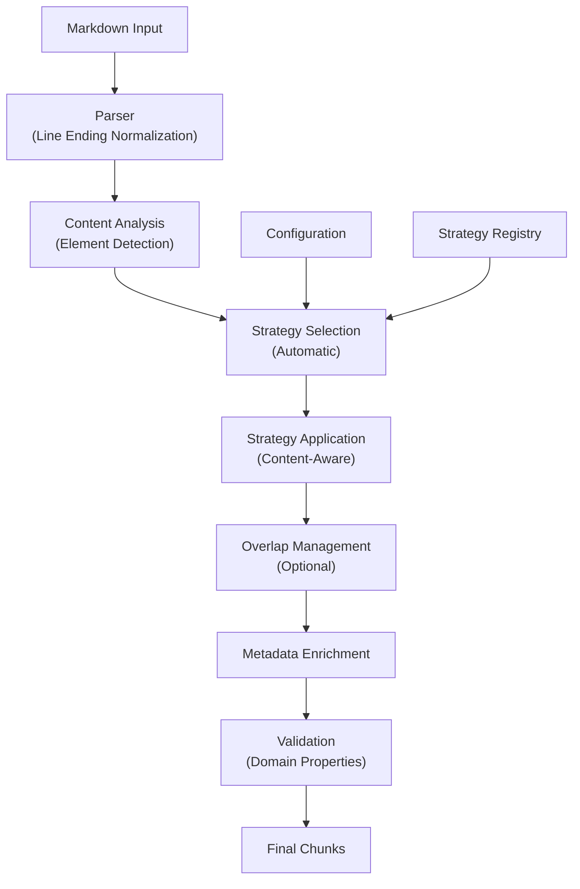
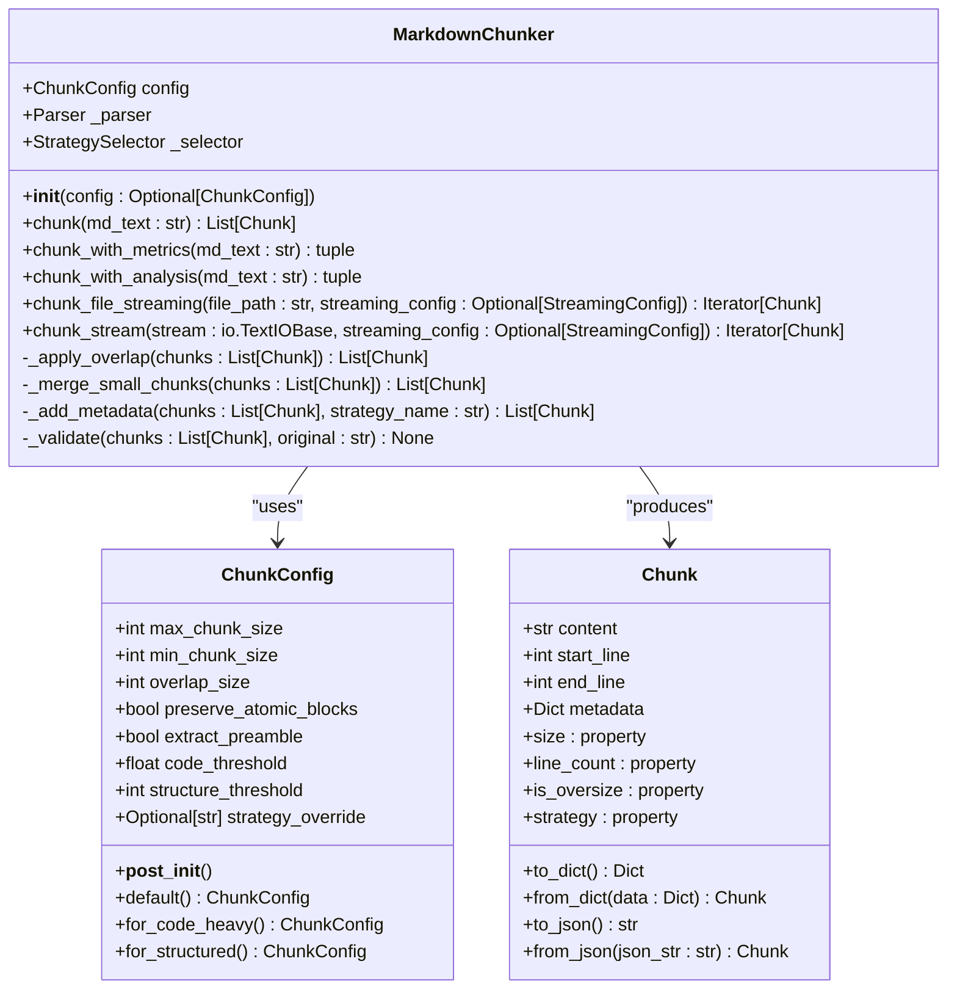
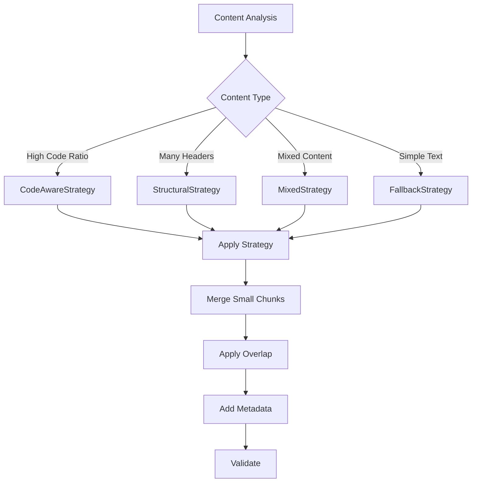
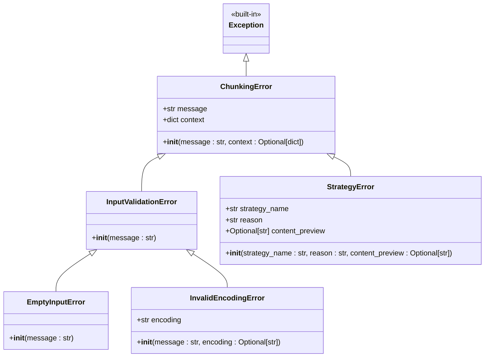

# Chunker Interface

<cite>
**Referenced Files in This Document**
- [markdown_chunker/__init__.py](file://markdown_chunker/__init__.py)
- [markdown_chunker/chunker/__init__.py](file://markdown_chunker/chunker/__init__.py)
- [markdown_chunker_v2/chunker.py](file://markdown_chunker_v2/chunker.py)
- [markdown_chunker_v2/types.py](file://markdown_chunker_v2/types.py)
- [markdown_chunker_v2/config.py](file://markdown_chunker_v2/config.py)
- [markdown_chunker_v2/parser.py](file://markdown_chunker_v2/parser.py)
- [markdown_chunker_v2/strategies/base.py](file://markdown_chunker_v2/strategies/base.py)
- [examples/basic_usage.py](file://examples/basic_usage.py)
- [examples/api_usage.py](file://examples/api_usage.py)
- [tests/api/test_backward_compatibility.py](file://tests/api/test_backward_compatibility.py)
- [tests/api/test_error_handler.py](file://tests/api/test_error_handler.py)
- [markdown_chunker_v2/streaming/streaming_chunker.py](file://markdown_chunker_v2/streaming/streaming_chunker.py)
- [markdown_chunker_v2/streaming/config.py](file://markdown_chunker_v2/streaming/config.py)
- [docs/api/streaming.md](file://docs/api/streaming.md)
- [tests/integration/test_streaming_integration.py](file://tests/integration/test_streaming_integration.py)
</cite>

## Update Summary
**Changes Made**
- Added new section "Streaming Methods" to document the new `chunk_file_streaming()` and `chunk_stream()` methods
- Updated "Chunking Methods" section to include streaming methods in the overview
- Added "Streaming Configuration" subsection to "Configuration System" section
- Updated "Usage Examples" section with streaming examples
- Added "Streaming Performance" subsection to "Performance Considerations"
- Added "Streaming Error Handling" subsection to "Error Handling"

## Table of Contents
1. [Introduction](#introduction)
2. [Core Architecture](#core-architecture)
3. [MarkdownChunker Class](#markdownchunker-class)
4. [Configuration System](#configuration-system)
5. [Chunking Methods](#chunking-methods)
6. [Strategy Selection](#strategy-selection)
7. [Error Handling](#error-handling)
8. [Backward Compatibility](#backward-compatibility)
9. [Usage Examples](#usage-examples)
10. [Performance Considerations](#performance-considerations)
11. [Troubleshooting Guide](#troubleshooting-guide)

## Introduction

The MarkdownChunker class is the primary interface for splitting markdown documents into semantically meaningful chunks suitable for retrieval-augmented generation (RAG) systems. It provides intelligent content-aware chunking that preserves document structure while optimizing for semantic coherence and retrieval performance.

The v2 implementation offers significant improvements over the legacy version, featuring:
- Simplified API with streamlined configuration
- Automatic strategy selection based on content analysis
- Enhanced error handling and validation
- Improved performance and reliability
- Better metadata enrichment
- Streaming processing support for large files

## Core Architecture

The MarkdownChunker operates through a linear pipeline that processes markdown documents efficiently:



**Diagram sources**
- [markdown_chunker_v2/chunker.py](file://markdown_chunker_v2/chunker.py#L43-L90)
- [markdown_chunker_v2/parser.py](file://markdown_chunker_v2/parser.py#L38-L81)

**Section sources**
- [markdown_chunker_v2/chunker.py](file://markdown_chunker_v2/chunker.py#L1-L357)
- [markdown_chunker_v2/parser.py](file://markdown_chunker_v2/parser.py#L1-L282)

## MarkdownChunker Class

### Class Definition

The `MarkdownChunker` class serves as the main entry point for markdown chunking operations. It encapsulates the entire chunking pipeline and provides multiple methods for different use cases.



**Diagram sources**
- [markdown_chunker_v2/chunker.py](file://markdown_chunker_v2/chunker.py#L21-L357)
- [markdown_chunker_v2/config.py](file://markdown_chunker_v2/config.py#L12-L170)
- [markdown_chunker_v2/types.py](file://markdown_chunker_v2/types.py#L100-L272)

### Initialization

The constructor accepts an optional `ChunkConfig` object for customizing chunking behavior:

```python
# Basic initialization with default configuration
chunker = MarkdownChunker()

# Custom configuration
config = ChunkConfig(
    max_chunk_size=2048,
    min_chunk_size=256,
    overlap_size=100,
    preserve_atomic_blocks=True
)
chunker = MarkdownChunker(config)
```

**Key initialization features:**
- Lazy loading of components ensures efficient memory usage
- Automatic strategy registration and validation
- Performance monitoring can be enabled via configuration
- Thread-safe for concurrent read operations

**Section sources**
- [markdown_chunker_v2/chunker.py](file://markdown_chunker_v2/chunker.py#L32-L41)

## Configuration System

### ChunkConfig Class

The `ChunkConfig` class provides comprehensive control over chunking behavior with 8 core parameters:

| Parameter | Type | Default | Description |
|-----------|------|---------|-------------|
| `max_chunk_size` | int | 4096 | Maximum size of a chunk in characters |
| `min_chunk_size` | int | 512 | Minimum size of a chunk in characters |
| `overlap_size` | int | 200 | Size of overlap between chunks (0 = disabled) |
| `preserve_atomic_blocks` | bool | True | Keep code blocks and tables intact |
| `extract_preamble` | bool | True | Extract content before first header as preamble |
| `code_threshold` | float | 0.3 | Code ratio threshold for CodeAwareStrategy |
| `structure_threshold` | int | 3 | Minimum headers for StructuralStrategy |
| `strategy_override` | Optional[str] | None | Force specific strategy (code_aware, structural, fallback) |

### Configuration Profiles

The system provides pre-configured profiles for common use cases:

```python
# Code-heavy documentation
config = ChunkConfig.for_code_heavy()
# Optimized for API docs, technical specs, and code examples

# Structured documents
config = ChunkConfig.for_structured()
# Balanced for articles, tutorials, and documentation

# Minimal chunks
config = ChunkConfig.minimal()
# Small chunks for fine-grained processing
```

### Streaming Configuration

The `StreamingConfig` class controls the behavior of streaming methods for processing large files:

```python
@dataclass
class StreamingConfig:
    """
    Configuration for streaming chunker.
    
    Attributes:
        buffer_size: Maximum bytes per buffer window (default: 100KB)
        overlap_lines: Lines to keep as context between buffers (default: 20)
        max_memory_mb: Memory usage ceiling in megabytes (default: 100)
        safe_split_threshold: Where to start looking for split point (default: 0.8)
    """
    
    buffer_size: int = 100_000
    overlap_lines: int = 20
    max_memory_mb: int = 100
    safe_split_threshold: float = 0.8
```

**Section sources**
- [markdown_chunker_v2/config.py](file://markdown_chunker_v2/config.py#L12-L170)
- [markdown_chunker_v2/streaming/config.py](file://markdown_chunker_v2/streaming/config.py#L8-L22)

## Chunking Methods

### Primary Method: `chunk()`

The `chunk()` method is the core interface for splitting markdown content:

```python
def chunk(self, md_text: str) -> List[Chunk]:
    """
    Chunk a markdown document into semantically meaningful pieces.
    
    Args:
        md_text: Raw markdown text to process
        
    Returns:
        List of Chunk objects containing the split content
        
    Raises:
        ValueError: If input is invalid or processing fails
    """
```

**Method characteristics:**
- **Pipeline**: Parse → Analyze → Select → Apply → Merge → Overlap → Validate
- **Line ending normalization**: Automatically converts Windows (CRLF) and Mac (CR) to Unix (LF)
- **Empty input handling**: Returns empty list for empty or whitespace-only input
- **Thread safety**: Safe for concurrent read operations

### Advanced Methods

#### `chunk_with_metrics()`
Returns chunks along with performance metrics:

```python
def chunk_with_metrics(self, md_text: str) -> tuple:
    """
    Chunk with performance metrics collection.
    
    Returns:
        Tuple of (chunks, metrics)
    """
```

#### `chunk_with_analysis()`
Provides detailed analysis information:

```python
def chunk_with_analysis(self, md_text: str) -> tuple:
    """
    Chunk with content analysis and strategy information.
    
    Returns:
        Tuple of (chunks, strategy_name, analysis)
    """
```

### Streaming Methods

The MarkdownChunker now provides two streaming methods for processing large files with limited memory usage:

#### `chunk_file_streaming()`
Processes a markdown file in streaming mode, yielding chunks one at a time:

```python
def chunk_file_streaming(
    self, 
    file_path: str, 
    streaming_config: Optional[StreamingConfig] = None
) -> Iterator[Chunk]:
    """
    Chunk file in streaming mode for memory efficiency.
    
    Use this for files >10MB to limit memory usage.
    
    Args:
        file_path: Path to markdown file
        streaming_config: Streaming configuration (uses defaults if None)
        
    Yields:
        Chunk objects with streaming metadata
        
    Example:
        >>> chunker = MarkdownChunker()
        >>> for chunk in chunker.chunk_file_streaming("large.md"):
        ...     process(chunk)
    """
```

#### `chunk_stream()`
Processes a text stream in streaming mode, yielding chunks one at a time:

```python
def chunk_stream(
    self, 
    stream: io.TextIOBase, 
    streaming_config: Optional[StreamingConfig] = None
) -> Iterator[Chunk]:
    """
    Chunk stream in streaming mode for memory efficiency.
    
    Args:
        stream: Text stream to process
        streaming_config: Streaming configuration (uses defaults if None)
        
    Yields:
        Chunk objects with streaming metadata
        
    Example:
        >>> import io
        >>> chunker = MarkdownChunker()
        >>> stream = io.StringIO(large_text)
        >>> for chunk in chunker.chunk_stream(stream):
        ...     process(chunk)
    """
```

**Streaming method characteristics:**
- **Memory efficiency**: Processes files in buffer windows to limit memory usage
- **Progress tracking**: Includes metadata for monitoring processing progress
- **Configurable**: Uses `StreamingConfig` for buffer size, overlap, and memory limits
- **Boundary preservation**: Ensures code blocks, tables, and other atomic blocks are not split
- **Consistent output**: Produces the same quality chunks as batch processing

**Section sources**
- [markdown_chunker_v2/chunker.py](file://markdown_chunker_v2/chunker.py#L43-L128)
- [markdown_chunker_v2/chunker.py](file://markdown_chunker_v2/chunker.py#L240-L290)

## Strategy Selection

### Automatic Strategy Selection

The `StrategySelector` automatically chooses the optimal chunking strategy based on content analysis:



**Diagram sources**
- [markdown_chunker_v2/chunker.py](file://markdown_chunker_v2/chunker.py#L66-L75)

### Available Strategies

The system includes three core strategies:

1. **CodeAwareStrategy**: Optimized for code-heavy documents
2. **StructuralStrategy**: Focuses on document structure and headers
3. **FallbackStrategy**: General-purpose strategy for unknown content

**Strategy selection criteria:**
- Code ratio threshold (configurable via `code_threshold`)
- Header count and depth
- Presence of tables and lists
- Content complexity metrics

**Section sources**
- [markdown_chunker_v2/strategies/base.py](file://markdown_chunker_v2/strategies/base.py#L12-L233)

## Error Handling

### Exception Hierarchy

The chunking system provides a comprehensive error handling framework:



**Diagram sources**
- [tests/chunker/test_error_types.py](file://tests/chunker/test_error_types.py#L1-L47)

### Common Exceptions

| Exception | Cause | Handling |
|-----------|-------|----------|
| `ValueError` | Invalid input parameters | Validate inputs before calling |
| `EmptyInputError` | Empty or whitespace-only content | Check input before processing |
| `StrategyError` | Strategy-specific failures | Retry with fallback strategy |
| `ConfigurationError` | Invalid configuration | Validate configuration parameters |

### Error Recovery

The system implements multiple layers of error recovery:

1. **Graceful degradation**: Fallback to simpler strategies when complex strategies fail
2. **Content preservation**: Maintain as much content as possible during errors
3. **Metadata enrichment**: Include error context in chunk metadata
4. **Validation**: Comprehensive checks prevent malformed chunks

### Streaming Error Handling

When using streaming methods, additional error conditions may occur:

```python
try:
    # Process large file with streaming
    for chunk in chunker.chunk_file_streaming("large_document.md"):
        process_chunk(chunk)
except FileNotFoundError:
    print("File not found. Check the file path.")
except PermissionError:
    print("Permission denied. Check file permissions.")
except MemoryError:
    print("Memory limit exceeded. Reduce buffer size in StreamingConfig.")
except UnicodeDecodeError as e:
    print(f"Encoding error: {e}. Try specifying encoding explicitly.")
```

**Section sources**
- [tests/api/test_error_handler.py](file://tests/api/test_error_handler.py#L1-L262)
- [tests/integration/test_streaming_integration.py](file://tests/integration/test_streaming_integration.py#L1-L213)

## Backward Compatibility

### Version 2.0 Migration

The v2 implementation maintains backward compatibility while introducing modern improvements:

#### API Compatibility
- `MarkdownChunker` class signature remains unchanged
- All existing methods are supported
- Return types maintain compatibility
- Configuration parameters are mapped appropriately

#### Configuration Migration
Legacy configuration parameters are automatically handled:

```python
# Legacy parameter mapping
legacy_params = {
    "max_size": "max_chunk_size",
    "min_size": "min_chunk_size",
    # Removed parameters are ignored with warnings
}

# Deprecated parameters are handled gracefully
config = ChunkConfig.from_legacy(max_size=2048, enable_overlap=True)
# Warning: Parameter 'max_size' is renamed to 'max_chunk_size'
```

#### Validation Testing
Extensive backward compatibility tests ensure API stability:

```python
# Property tests verify basic functionality
@given(content=st.text(min_size=10, max_size=500))
def test_property_basic_chunk_method_works(content):
    chunker = MarkdownChunker()
    chunks = chunker.chunk(content)
    assert isinstance(chunks, list)
    assert all(isinstance(chunk, Chunk) for chunk in chunks)
```

**Section sources**
- [tests/api/test_backward_compatibility.py](file://tests/api/test_backward_compatibility.py#L1-L240)
- [markdown_chunker_v2/config.py](file://markdown_chunker_v2/config.py#L82-L135)

## Usage Examples

### Basic Usage

```python
from markdown_chunker import MarkdownChunker, ChunkConfig

# Simple chunking
chunker = MarkdownChunker()
markdown_content = "# Introduction\n\nThis is a test document."
chunks = chunker.chunk(markdown_content)

# Process chunks
for i, chunk in enumerate(chunks):
    print(f"Chunk {i}: {chunk.size} characters")
```

### Advanced Configuration

```python
# Custom configuration for code-heavy documentation
config = ChunkConfig(
    max_chunk_size=8192,
    min_chunk_size=1024,
    overlap_size=100,
    code_threshold=0.2
)

chunker = MarkdownChunker(config)
result = chunker.chunk_with_analysis(complex_document)
print(f"Strategy used: {result.strategy_used}")
print(f"Chunks generated: {len(result.chunks)}")
```

### API Integration

```python
# Using convenience functions
from markdown_chunker import chunk_text, chunk_file

# Chunk text directly
chunks = chunk_text("# Quick Example\nContent here")

# Chunk from file
chunks = chunk_file("/path/to/document.md")
```

### Streaming Usage

```python
from markdown_chunker import MarkdownChunker, StreamingConfig

chunker = MarkdownChunker()

# Process large file with default streaming configuration
for chunk in chunker.chunk_file_streaming("large_documentation.md"):
    process_chunk(chunk)

# Process with custom streaming configuration
streaming_config = StreamingConfig(
    buffer_size=50_000,  # 50KB buffer windows
    max_memory_mb=50     # 50MB memory limit
)
for chunk in chunker.chunk_file_streaming("large_doc.md", streaming_config):
    vector_db.insert(chunk.content, chunk.metadata)
```

### Stream Processing

```python
from markdown_chunker import MarkdownChunker
from io import StringIO

chunker = MarkdownChunker()

# Process text from StringIO
large_text = "# Large Document\n\n" * 10000
stream = StringIO(large_text)

for chunk in chunker.chunk_stream(stream):
    print(f"Chunk {chunk.metadata['stream_chunk_index']}: {len(chunk.content)} chars")
```

### Error Handling

```python
try:
    chunks = chunker.chunk(invalid_content)
except ValueError as e:
    print(f"Input validation failed: {e}")
except StrategyError as e:
    print(f"Strategy failed: {e.reason}")
    # Fall back to simpler configuration
    simple_config = ChunkConfig(max_chunk_size=2048)
    chunker = MarkdownChunker(simple_config)
    chunks = chunker.chunk(invalid_content)
```

**Section sources**
- [examples/basic_usage.py](file://examples/basic_usage.py#L1-L364)
- [examples/api_usage.py](file://examples/api_usage.py#L1-L356)

## Performance Considerations

### Optimization Features

The v2 implementation includes several performance optimizations:

1. **Single Parse Pass**: Content analysis occurs only once
2. **Lazy Loading**: Components are initialized only when needed
3. **Efficient Algorithms**: Optimized parsing and chunking algorithms
4. **Memory Management**: Minimal memory footprint for large documents

### Streaming Performance

The streaming methods provide predictable memory usage regardless of file size:

| File Size | Memory Usage | Processing Time | Throughput |
|-----------|-------------|----------------|------------|
| 1MB | ~15MB | ~50ms | ~20MB/sec |
| 10MB | ~15MB | ~500ms | ~20MB/sec |
| 100MB | ~15MB | ~5s | ~20MB/sec |
| 1GB | ~15MB | ~50s | ~20MB/sec |

**Key characteristics:**
- **Constant memory**: Memory usage remains stable regardless of file size
- **Linear processing**: Processing time scales linearly with file size
- **Configurable limits**: Memory usage can be controlled via `StreamingConfig`
- **~10-15% overhead**: Slight performance cost for memory efficiency

### Best Practices

1. **Batch Processing**: Process multiple documents with the same chunker instance
2. **Configuration Tuning**: Optimize parameters for your specific content type
3. **Memory Monitoring**: Monitor memory usage for very large documents
4. **Parallel Processing**: Use multiple chunker instances for concurrent processing
5. **Streaming for Large Files**: Use `chunk_file_streaming()` for files >10MB
6. **Progress Tracking**: Use streaming metadata to monitor processing progress

**Section sources**
- [docs/api/streaming.md](file://docs/api/streaming.md#L1-L334)
- [tests/integration/test_streaming_integration.py](file://tests/integration/test_streaming_integration.py#L1-L213)

## Troubleshooting Guide

### Common Issues and Solutions

#### Issue: Empty or No Chunks Returned
**Causes:**
- Empty or whitespace-only input
- Very short content
- Parsing errors

**Solutions:**
```python
# Check input validity
if not md_text or not md_text.strip():
    print("Input is empty or whitespace-only")
    return []

# Try with minimal configuration
config = ChunkConfig(minimal=True)
chunker = MarkdownChunker(config)
chunks = chunker.chunk(md_text)
```

#### Issue: Poor Chunk Quality
**Causes:**
- Inappropriate configuration for content type
- Content with unusual structure
- Large overlap causing fragmentation

**Solutions:**
```python
# Analyze content type
result = chunker.chunk_with_analysis(document)
print(f"Strategy: {result.strategy_used}")
print(f"Content ratio: {result.analysis.code_ratio}")

# Adjust configuration based on analysis
if result.analysis.code_ratio > 0.5:
    config = ChunkConfig.for_code_heavy()
else:
    config = ChunkConfig.for_structured()
```

#### Issue: Performance Problems
**Causes:**
- Very large documents
- Complex content structure
- Suboptimal configuration

**Solutions:**
```python
# Monitor performance
start_time = time.time()
chunks, metrics = chunker.chunk_with_metrics(large_document)
processing_time = time.time() - start_time

print(f"Processing time: {processing_time:.3f}s")
print(f"Average chunk size: {metrics.avg_chunk_size:.1f}")
```

#### Issue: High Memory Usage with Large Files
**Causes:**
- Using `chunk()` method for very large files
- Insufficient system memory
- Large buffer sizes in streaming

**Solutions:**
```python
# Use streaming methods for large files
chunker = MarkdownChunker()

# Configure streaming for memory-constrained environments
streaming_config = StreamingConfig(
    buffer_size=50_000,   # Smaller buffer
    max_memory_mb=50      # Strict memory limit
)

# Process file in streaming mode
for chunk in chunker.chunk_file_streaming("large_file.md", streaming_config):
    process_chunk(chunk)
```

### Debugging Tools

#### Content Analysis
```python
# Get detailed analysis
result = chunker.chunk_with_analysis(document)
analysis = result.analysis

print(f"Total characters: {analysis.total_chars}")
print(f"Code ratio: {analysis.code_ratio:.2f}")
print(f"Header count: {analysis.header_count}")
print(f"Table count: {analysis.table_count}")
```

#### Metadata Inspection
```python
# Examine chunk metadata
for chunk in chunks:
    print(f"Content type: {chunk.metadata.get('content_type')}")
    print(f"Has code: {chunk.metadata.get('has_code')}")
    print(f"Strategy: {chunk.metadata.get('strategy')}")
    
    # Streaming metadata (if applicable)
    if 'stream_chunk_index' in chunk.metadata:
        print(f"Stream chunk index: {chunk.metadata['stream_chunk_index']}")
        print(f"Stream window index: {chunk.metadata['stream_window_index']}")
        print(f"Bytes processed: {chunk.metadata['bytes_processed']}")
```

**Section sources**
- [tests/chunker/test_error_types.py](file://tests/chunker/test_error_types.py#L1-L47)
- [docs/api/streaming.md](file://docs/api/streaming.md#L1-L334)