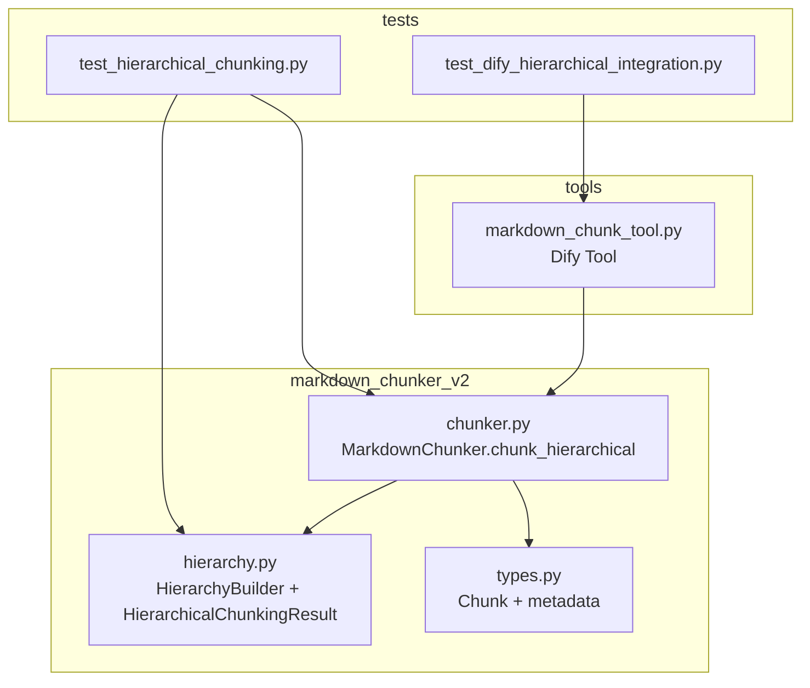
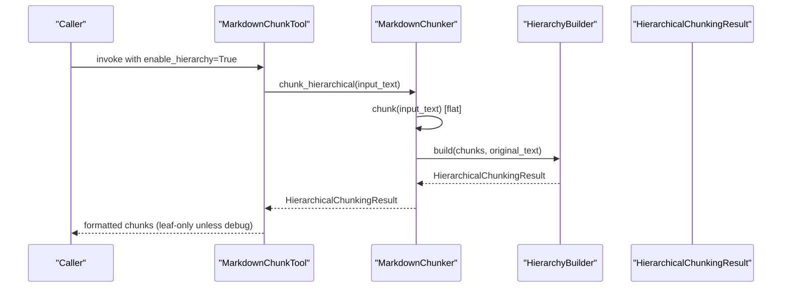
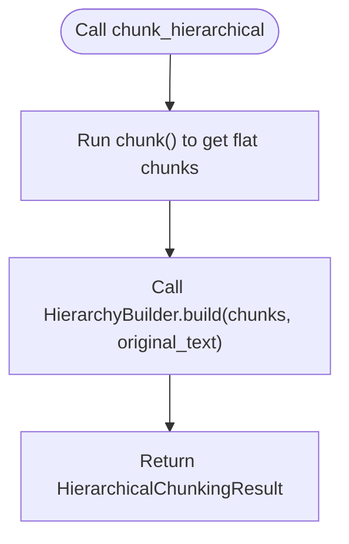
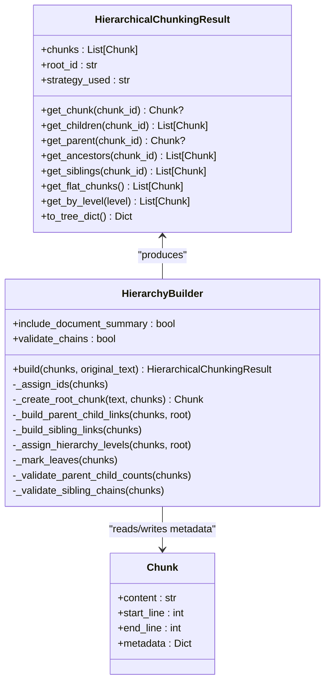
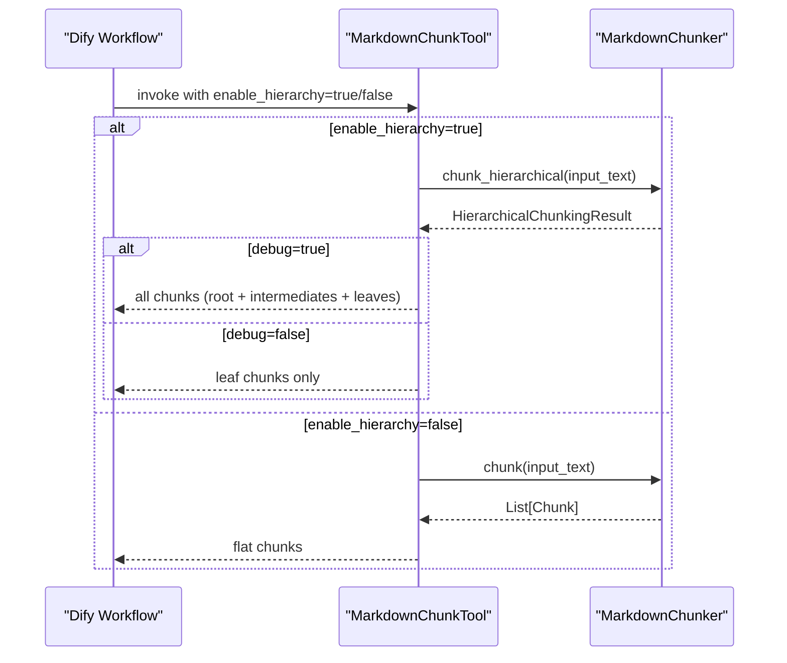
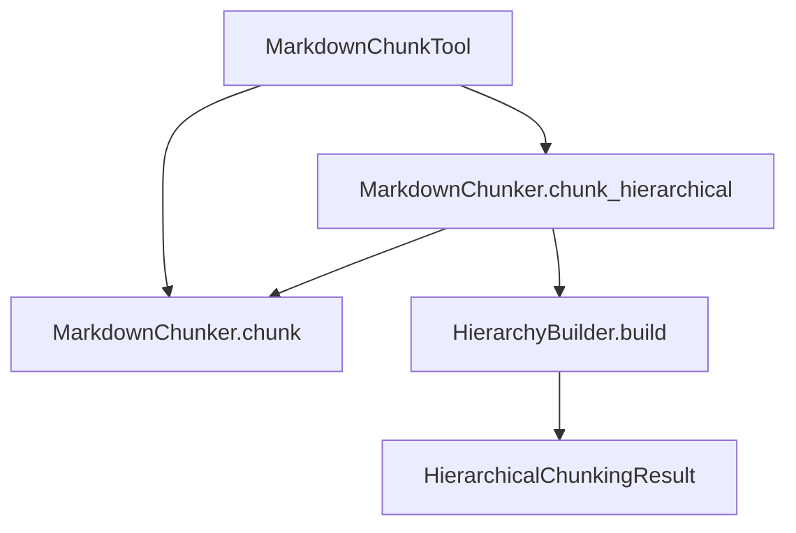

# chunk_hierarchical Method

<cite>
**Referenced Files in This Document**
- [chunker.py](file://markdown_chunker_v2/chunker.py)
- [hierarchy.py](file://markdown_chunker_v2/hierarchy.py)
- [types.py](file://markdown_chunker_v2/types.py)
- [markdown_chunk_tool.py](file://tools/markdown_chunk_tool.py)
- [test_hierarchical_chunking.py](file://tests/chunker/test_hierarchical_chunking.py)
- [test_dify_hierarchical_integration.py](file://tests/integration/test_dify_hierarchical_integration.py)
- [dify-integration.md](file://docs/architecture/dify-integration.md)
</cite>

## Table of Contents
1. [Introduction](#introduction)
2. [Project Structure](#project-structure)
3. [Core Components](#core-components)
4. [Architecture Overview](#architecture-overview)
5. [Detailed Component Analysis](#detailed-component-analysis)
6. [Dependency Analysis](#dependency-analysis)
7. [Performance Considerations](#performance-considerations)
8. [Troubleshooting Guide](#troubleshooting-guide)
9. [Conclusion](#conclusion)

## Introduction
This document explains the chunk_hierarchical method, which produces a hierarchical representation of Markdown documents by building parent-child and sibling relationships among chunks. It also describes how this method integrates with the Dify plugin ecosystem and how to use it effectively in workflows.

## Project Structure
The hierarchical chunking feature lives in the markdown_chunker_v2 package and is consumed by the Dify tool. The key files are:
- markdown_chunker_v2/chunker.py: Implements MarkdownChunker and exposes chunk_hierarchical
- markdown_chunker_v2/hierarchy.py: Implements HierarchyBuilder and HierarchicalChunkingResult
- markdown_chunker_v2/types.py: Defines Chunk and related types used by both flat and hierarchical modes
- tools/markdown_chunk_tool.py: Dify tool that invokes chunk_hierarchical when enabled
- tests/chunker/test_hierarchical_chunking.py: Unit tests validating hierarchical behavior
- tests/integration/test_dify_hierarchical_integration.py: Integration tests for Dify plugin
- docs/architecture/dify-integration.md: Dify integration documentation

**Diagram sources**
- [chunker.py](file://markdown_chunker_v2/chunker.py#L176-L207)
- [hierarchy.py](file://markdown_chunker_v2/hierarchy.py#L149-L197)
- [types.py](file://markdown_chunker_v2/types.py#L186-L242)
- [markdown_chunk_tool.py](file://tools/markdown_chunk_tool.py#L135-L204)
- [test_hierarchical_chunking.py](file://tests/chunker/test_hierarchical_chunking.py#L1-L120)
- [test_dify_hierarchical_integration.py](file://tests/integration/test_dify_hierarchical_integration.py#L1-L120)

**Section sources**
- [chunker.py](file://markdown_chunker_v2/chunker.py#L176-L207)
- [hierarchy.py](file://markdown_chunker_v2/hierarchy.py#L149-L197)
- [types.py](file://markdown_chunker_v2/types.py#L186-L242)
- [markdown_chunk_tool.py](file://tools/markdown_chunk_tool.py#L135-L204)
- [test_hierarchical_chunking.py](file://tests/chunker/test_hierarchical_chunking.py#L1-L120)
- [test_dify_hierarchical_integration.py](file://tests/integration/test_dify_hierarchical_integration.py#L1-L120)

## Core Components
- MarkdownChunker.chunk_hierarchical: Orchestrates flat chunking and then builds a hierarchy using HierarchyBuilder. It returns a HierarchicalChunkingResult with navigation methods.
- HierarchyBuilder: Post-processes a flat list of chunks to assign IDs, create a root document chunk (optional), build parent-child and sibling links, compute hierarchy levels, mark leaves, and optionally validate chains.
- HierarchicalChunkingResult: Wraps the chunk list and root_id, and provides O(1) lookup plus navigation APIs (get_chunk, get_children, get_parent, get_ancestors, get_siblings, get_flat_chunks, get_by_level, to_tree_dict).
- Chunk: The underlying data structure carrying content, line ranges, and metadata. Hierarchical metadata is added during hierarchy construction.

Key responsibilities:
- chunk_hierarchical: Performs flat chunking, then delegates to HierarchyBuilder to enrich with hierarchy metadata and navigation.
- HierarchyBuilder: Uses existing header_path and header_level metadata to infer parent-child relationships; assigns chunk_id, parent_id, children_ids, prev_sibling_id, next_sibling_id, hierarchy_level, and is_leaf.
- HierarchicalChunkingResult: Exposes navigation and filtering APIs and serializes to a tree-like dictionary.

**Section sources**
- [chunker.py](file://markdown_chunker_v2/chunker.py#L176-L207)
- [hierarchy.py](file://markdown_chunker_v2/hierarchy.py#L149-L197)
- [types.py](file://markdown_chunker_v2/types.py#L186-L242)

## Architecture Overview
The chunk_hierarchical method follows a simple, linear flow:
1. Perform flat chunking via MarkdownChunker.chunk
2. Pass the resulting chunks to HierarchyBuilder.build
3. Return a HierarchicalChunkingResult with navigation methods

**Diagram sources**
- [markdown_chunk_tool.py](file://tools/markdown_chunk_tool.py#L135-L204)
- [chunker.py](file://markdown_chunker_v2/chunker.py#L176-L207)
- [hierarchy.py](file://markdown_chunker_v2/hierarchy.py#L223-L275)

## Detailed Component Analysis

### chunk_hierarchical Method
- Purpose: Produce a hierarchical chunk structure from raw Markdown text.
- Inputs: Markdown text string.
- Output: HierarchicalChunkingResult containing:
  - chunks: list of Chunk with hierarchy metadata
  - root_id: ID of the document-level root chunk
  - strategy_used: strategy name used for flat chunking
- Behavior:
  - Delegates to chunk() to produce flat chunks
  - Calls HierarchyBuilder.build to add parent-child, sibling, and level metadata
  - Returns the result for downstream navigation and serialization

**Diagram sources**
- [chunker.py](file://markdown_chunker_v2/chunker.py#L176-L207)
- [hierarchy.py](file://markdown_chunker_v2/hierarchy.py#L223-L275)

**Section sources**
- [chunker.py](file://markdown_chunker_v2/chunker.py#L176-L207)

### HierarchyBuilder and HierarchicalChunkingResult
- HierarchyBuilder responsibilities:
  - Assign unique chunk_id to each chunk
  - Optionally create a root document chunk with a summary and header_path "/"
  - Build parent-child links using header_path metadata
  - Build sibling links ordered by start_line
  - Assign hierarchy_level based on tree depth (0=root, 1=sections, 2=subsections, 3+=paragraphs)
  - Mark is_leaf for nodes without children
  - Optional validation of parent-child counts and sibling chains
- HierarchicalChunkingResult provides:
  - O(1) lookup via chunk_id index
  - Navigation: get_chunk, get_children, get_parent, get_ancestors, get_siblings
  - Filtering: get_flat_chunks (leaf-only), get_by_level
  - Serialization: to_tree_dict for JSON-safe tree representation

**Diagram sources**
- [hierarchy.py](file://markdown_chunker_v2/hierarchy.py#L149-L197)
- [hierarchy.py](file://markdown_chunker_v2/hierarchy.py#L223-L275)
- [types.py](file://markdown_chunker_v2/types.py#L186-L242)

**Section sources**
- [hierarchy.py](file://markdown_chunker_v2/hierarchy.py#L149-L197)
- [hierarchy.py](file://markdown_chunker_v2/hierarchy.py#L223-L275)
- [types.py](file://markdown_chunker_v2/types.py#L186-L242)

### Dify Integration and Usage
- The Dify tool reads parameters including enable_hierarchy and debug.
- When enable_hierarchy is True:
  - chunk_hierarchical is invoked
  - In normal mode (debug=False), only leaf chunks are returned
  - In debug mode (debug=True), all chunks (root and intermediates) are returned
- When enable_hierarchy is False:
  - chunk() is used and only flat chunks are returned

**Diagram sources**
- [markdown_chunk_tool.py](file://tools/markdown_chunk_tool.py#L135-L204)
- [chunker.py](file://markdown_chunker_v2/chunker.py#L176-L207)

**Section sources**
- [markdown_chunk_tool.py](file://tools/markdown_chunk_tool.py#L135-L204)
- [test_dify_hierarchical_integration.py](file://tests/integration/test_dify_hierarchical_integration.py#L1-L120)
- [dify-integration.md](file://docs/architecture/dify-integration.md#L1-L159)

## Dependency Analysis
- chunk_hierarchical depends on:
  - chunk(): Produces flat chunks with header_path and header_level metadata
  - HierarchyBuilder: Consumes flat chunks and adds hierarchy metadata
  - HierarchicalChunkingResult: Wraps results and provides navigation
- Dify tool depends on:
  - MarkdownChunker.chunk_hierarchical when enable_hierarchy is True
  - MarkdownChunker.chunk when enable_hierarchy is False

**Diagram sources**
- [chunker.py](file://markdown_chunker_v2/chunker.py#L176-L207)
- [hierarchy.py](file://markdown_chunker_v2/hierarchy.py#L223-L275)
- [markdown_chunk_tool.py](file://tools/markdown_chunk_tool.py#L135-L204)

**Section sources**
- [chunker.py](file://markdown_chunker_v2/chunker.py#L176-L207)
- [hierarchy.py](file://markdown_chunker_v2/hierarchy.py#L223-L275)
- [markdown_chunk_tool.py](file://tools/markdown_chunk_tool.py#L135-L204)

## Performance Considerations
- Complexity:
  - chunk_hierarchical orchestrates flat chunking (linear in document size) and then hierarchy building (linear in number of chunks)
  - HierarchyBuilder uses O(1) indexing for parent lookup and sorts siblings by start_line
- Memory:
  - HierarchicalChunkingResult maintains an internal index for O(1) chunk lookup
  - Root chunk summary is generated heuristically; it does not duplicate full content
- Practical tips:
  - Use debug mode only when you need to inspect root and intermediate chunks
  - Adjust max_chunk_size and overlap_size to balance chunk granularity and retrieval quality
  - For very large documents with many headers, expect more chunks and deeper hierarchy

[No sources needed since this section provides general guidance]

## Troubleshooting Guide
Common issues and resolutions:
- Empty or whitespace-only input:
  - The tool returns an error message indicating input_text is required and cannot be empty
- Missing hierarchy metadata:
  - Ensure enable_hierarchy is True in the tool parameters
  - In normal mode, only leaf chunks are returned; use debug mode to include root and intermediate chunks
- Unexpected chunk counts:
  - In normal mode, only leaf chunks are returned; in debug mode, all chunks are included
- Validation failures:
  - HierarchyBuilder can optionally validate parent-child counts and sibling chains; if enabled, errors will be raised on inconsistencies

**Section sources**
- [markdown_chunk_tool.py](file://tools/markdown_chunk_tool.py#L153-L204)
- [test_dify_hierarchical_integration.py](file://tests/integration/test_dify_hierarchical_integration.py#L1-L120)
- [hierarchy.py](file://markdown_chunker_v2/hierarchy.py#L565-L738)

## Conclusion
The chunk_hierarchical method provides a robust, structure-aware hierarchical representation of Markdown documents by leveraging existing header_path and header_level metadata. It integrates cleanly with the Dify plugin, enabling multi-level retrieval and contextual navigation. Use enable_hierarchy to activate hierarchical mode and debug to inspect the full tree, including root and intermediate chunks.