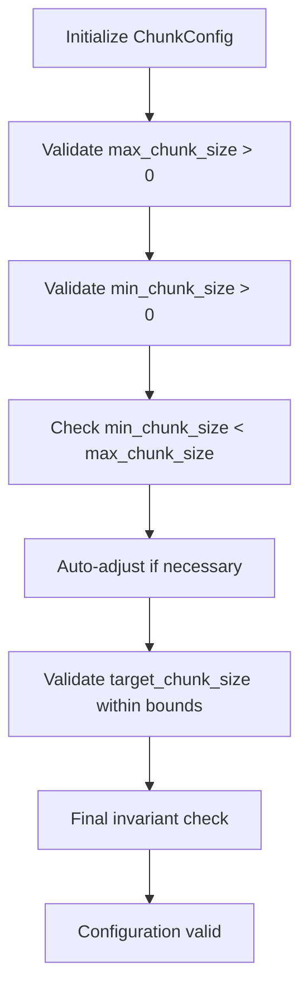
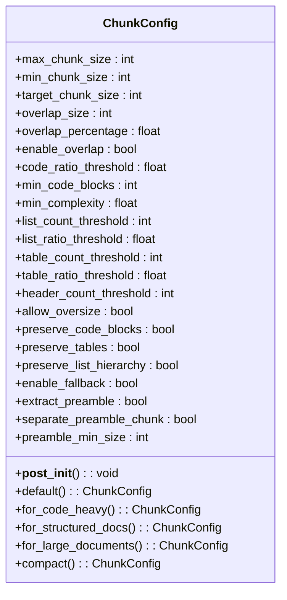
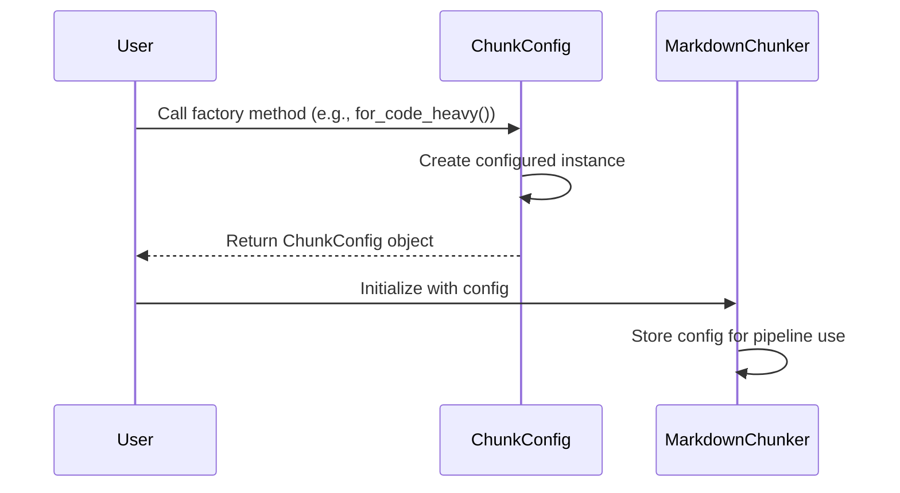
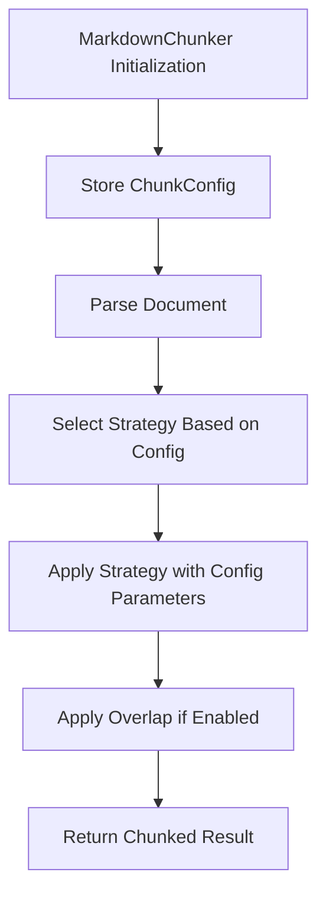

# Configuration Model

<cite>
**Referenced Files in This Document**   
- [ChunkConfig](file://markdown_chunker_legacy/chunker/types.py#L501-L800)
- [ChunkConfig](file://markdown_chunker_v2/config.py#L13-L170)
- [test_chunk_config_validation.py](file://tests/chunker/test_chunk_config_validation.py#L1-L207)
- [test_config_profiles.py](file://tests/chunker/test_config_profiles.py#L1-L70)
- [test_preamble_config.py](file://tests/chunker/test_preamble_config.py#L1-L168)
- [basic_usage.py](file://examples/basic_usage.py#L1-L364)
- [api_usage.py](file://examples/api_usage.py#L1-L356)
- [MarkdownChunker](file://markdown_chunker_v2/chunker.py#L21-L200)
</cite>

## Table of Contents
1. [Introduction](#introduction)
2. [Core Configuration Parameters](#core-configuration-parameters)
3. [Pydantic-based Validation System](#pydantic-based-validation-system)
4. [Configuration Profiles and Factory Methods](#configuration-profiles-and-factory-methods)
5. [Configuration Loading Methods](#configuration-loading-methods)
6. [Configuration Pipeline Integration](#configuration-pipeline-integration)
7. [Best Practices for Configuration Management](#best-practices-for-configuration-management)
8. [Test Cases and Error Conditions](#test-cases-and-error-conditions)

## Introduction
The ChunkConfig data model serves as the central configuration system for the markdown chunker, providing fine-grained control over the chunking process. This configuration system enables users to customize various aspects of document processing, including size limits, strategy selection thresholds, overlap settings, and behavior flags. The model is designed with sensible defaults for most use cases while offering factory methods that provide pre-configured profiles for common scenarios. The configuration is passed through the pipeline from the MarkdownChunker to individual strategies, ensuring consistent behavior across the entire chunking process.

**Section sources**
- [ChunkConfig](file://markdown_chunker_legacy/chunker/types.py#L501-L510)

## Core Configuration Parameters
The ChunkConfig data model exposes several key parameters that control the chunking behavior. These parameters are categorized into size limits, overlap settings, strategy selection thresholds, and behavior flags.

### Size Parameters
The size parameters define the boundaries for chunk creation:
- **max_chunk_size**: Maximum size of a chunk in characters (default: 4096)
- **min_chunk_size**: Minimum size of a chunk in characters (default: 512)
- **target_chunk_size**: Target size for chunks (default: 2048)

### Overlap Settings
Overlap settings control the context preservation between adjacent chunks:
- **overlap_size**: Size of overlap between chunks in characters (default: 200)
- **overlap_percentage**: Percentage of chunk to overlap (default: 0.1)
- **enable_overlap**: Boolean flag to enable or disable overlap (default: True)

### Strategy Selection Thresholds
These parameters determine which chunking strategy is selected based on document characteristics:
- **code_ratio_threshold**: Threshold for code strategy selection (default: 0.3)
- **min_code_blocks**: Minimum code blocks for code strategy (default: 1)
- **min_complexity**: Minimum complexity for mixed strategy (default: 0.3)
- **list_count_threshold**: Minimum lists for list strategy (default: 5)
- **list_ratio_threshold**: Threshold for list strategy (default: 0.6)
- **table_count_threshold**: Minimum tables for table strategy (default: 3)
- **table_ratio_threshold**: Threshold for table strategy (default: 0.4)
- **header_count_threshold**: Minimum headers for structural strategy (default: 3)

### Behavior Flags
Various behavior flags control specific aspects of the chunking process:
- **allow_oversize**: Allow chunks larger than max_chunk_size for indivisible elements
- **preserve_code_blocks**: Keep code blocks intact (default: True)
- **preserve_tables**: Keep tables intact (default: True)
- **preserve_list_hierarchy**: Keep list items together (default: True)
- **enable_fallback**: Enable fallback strategies (default: True)
- **extract_preamble**: Extract content before first header as preamble (default: True)
- **separate_preamble_chunk**: Create a separate chunk for preamble content (default: False)
- **preamble_min_size**: Minimum size for preamble content (default: 10)

**Section sources**
- [ChunkConfig](file://markdown_chunker_legacy/chunker/types.py#L513-L574)

## Pydantic-based Validation System
The ChunkConfig model implements a comprehensive validation system that ensures configuration integrity and enforces size invariants. The validation occurs in the `__post_init__` method, which is automatically called after object initialization.

### Size Invariant Validation
The validation system ensures that size parameters maintain proper relationships:


When min_chunk_size is greater than or equal to max_chunk_size, the system automatically adjusts min_chunk_size to be half of max_chunk_size (with a minimum value of 1). Similarly, if target_chunk_size exceeds max_chunk_size, it is adjusted down to max_chunk_size, and if it's smaller than min_chunk_size, it's adjusted up to min_chunk_size.

### Percentage Validation
All percentage values are validated to ensure they fall within the 0.0 to 1.0 range:
- overlap_percentage
- code_ratio_threshold
- list_ratio_threshold
- table_ratio_threshold

Invalid values outside this range raise a ValueError with an appropriate message.

### Auto-adjustment Logic
The validation system implements intelligent auto-adjustment rather than failing on invalid configurations. This approach ensures that the chunker can handle a wide range of input configurations while maintaining operational integrity. For example, when max_chunk_size is set to a very small value like 10, the system automatically adjusts min_chunk_size to 5 and target_chunk_size to 10, preserving the hierarchical relationship between these parameters.



**Diagram sources**
- [ChunkConfig](file://markdown_chunker_legacy/chunker/types.py#L501-L800)
- [test_chunk_config_validation.py](file://tests/chunker/test_chunk_config_validation.py#L1-L207)

**Section sources**
- [ChunkConfig](file://markdown_chunker_legacy/chunker/types.py#L636-L683)
- [test_chunk_config_validation.py](file://tests/chunker/test_chunk_config_validation.py#L1-L207)

## Configuration Profiles and Factory Methods
The ChunkConfig class provides several factory methods that create pre-configured profiles optimized for specific use cases. These profiles simplify configuration for common scenarios and ensure best practices are followed.

### Available Factory Methods
- **default()**: Creates a balanced configuration suitable for most markdown documents
- **for_code_heavy()**: Optimized for code-heavy documents with larger chunk sizes and aggressive code detection
- **for_structured_docs()**: Designed for well-organized documentation with clear sections and headers
- **for_large_documents()**: Configured for efficient processing of large documents with streaming enabled
- **for_dify_rag()**: Optimized for RAG (Retrieval-Augmented Generation) systems with smaller chunks and overlap
- **for_fast_processing()**: Prioritizes speed with larger chunks and disabled overlap
- **compact()**: Creates small chunks for memory-constrained environments

### Profile Characteristics
Each profile has distinct characteristics tailored to its intended use case:

| Profile | max_chunk_size | min_chunk_size | overlap_size | Special Features |
|--------|----------------|----------------|--------------|------------------|
| default | 4096 | 512 | 200 | Balanced settings for general use |
| for_code_heavy | 6144 | 1024 | 300 | Larger chunks for code blocks, aggressive code detection |
| for_structured_docs | 3072 | 512 | 150 | Respects document hierarchy, preserves list structure |
| for_dify_rag | 3072 | 256 | 150 | Optimized for retrieval systems, preserves code blocks |
| for_fast_processing | 8192 | 1024 | 100 | Streaming enabled, overlap disabled for speed |



**Diagram sources**
- [ChunkConfig](file://markdown_chunker_legacy/chunker/types.py#L686-L800)
- [test_config_profiles.py](file://tests/chunker/test_config_profiles.py#L1-L70)

**Section sources**
- [ChunkConfig](file://markdown_chunker_legacy/chunker/types.py#L686-L800)
- [test_config_profiles.py](file://tests/chunker/test_config_profiles.py#L1-L70)

## Configuration Loading Methods
The ChunkConfig system supports multiple methods for loading and instantiating configurations, providing flexibility for different deployment scenarios.

### Programmatic Instantiation
The most direct method is programmatic instantiation using the class constructor:

```python
config = ChunkConfig(
    max_chunk_size=2048,
    min_chunk_size=256,
    overlap_size=150,
    enable_overlap=True
)
```

### Dictionary-based Configuration
Configurations can be loaded from dictionaries, which is particularly useful when receiving configuration data from APIs or external sources:

```python
config_dict = {
    "max_chunk_size": 3072,
    "min_chunk_size": 512,
    "overlap_size": 200,
    "enable_overlap": True
}
config = ChunkConfig(**config_dict)
```

### YAML File Loading
For complex configurations or when using configuration files, YAML loading provides a clean and readable approach:

```python
import yaml

with open('config.yaml', 'r') as file:
    config_data = yaml.safe_load(file)
    config = ChunkConfig(**config_data)
```

### Example Configuration File (YAML)
```yaml
max_chunk_size: 4096
min_chunk_size: 512
overlap_size: 200
enable_overlap: true
code_ratio_threshold: 0.3
header_count_threshold: 3
extract_preamble: true
preamble_min_size: 10
```

### API Request Configuration
When using the API adapter, configurations can be passed directly in the request payload:

```python
request = APIRequest(
    content=markdown_text,
    config={
        "max_chunk_size": 2048,
        "overlap_size": 150,
        "enable_overlap": True
    }
)
```

**Section sources**
- [basic_usage.py](file://examples/basic_usage.py#L116-L121)
- [api_usage.py](file://examples/api_usage.py#L57-L80)

## Configuration Pipeline Integration
The configuration system is tightly integrated into the chunking pipeline, with the ChunkConfig instance being passed from the MarkdownChunker to individual strategies.

### Pipeline Flow


### Configuration Propagation
The configuration is passed through the pipeline as follows:

1. **Initialization**: The MarkdownChunker receives the ChunkConfig during initialization
2. **Strategy Selection**: The strategy selector uses configuration thresholds to determine the appropriate strategy
3. **Strategy Execution**: Each strategy receives the configuration to guide its chunking behavior
4. **Overlap Application**: The overlap manager uses overlap_size and enable_overlap settings
5. **Validation**: The final validation step ensures all chunks comply with size constraints

### Strategy-specific Configuration
Different strategies utilize specific configuration parameters:

- **CodeStrategy**: Uses code_ratio_threshold, min_code_blocks, and preserve_code_blocks
- **ListStrategy**: Uses list_count_threshold and list_ratio_threshold
- **TableStrategy**: Uses table_count_threshold and table_ratio_threshold
- **StructuralStrategy**: Uses header_count_threshold and section_boundary_level
- **MixedStrategy**: Uses min_complexity and various content thresholds

**Section sources**
- [MarkdownChunker](file://markdown_chunker_v2/chunker.py#L21-L200)
- [ChunkConfig](file://markdown_chunker_legacy/chunker/types.py#L501-L800)

## Best Practices for Configuration Management
Effective configuration management is crucial for optimal performance and reliability in different deployment scenarios.

### Environment-specific Configuration
Use different configuration profiles based on the deployment environment:

- **Development**: Use default or detailed profiles for comprehensive analysis
- **Production**: Use optimized profiles like for_dify_rag or for_fast_processing
- **Testing**: Use compact or minimal profiles for faster test execution

### Configuration Validation
Always validate configurations before use, even when using factory methods:

```python
def validate_configuration(config):
    """Validate configuration before use."""
    assert config.max_chunk_size > 0, "max_chunk_size must be positive"
    assert config.min_chunk_size > 0, "min_chunk_size must be positive"
    assert config.overlap_size >= 0, "overlap_size must be non-negative"
    return True
```

### Error Handling
Implement proper error handling for configuration-related exceptions:

```python
try:
    config = ChunkConfig(max_chunk_size=500, min_chunk_size=1000)
    # Auto-adjustment will handle the invalid size relationship
    chunker = MarkdownChunker(config)
except ValueError as e:
    print(f"Configuration error: {e}")
    # Fall back to default configuration
    config = ChunkConfig.default()
    chunker = MarkdownChunker(config)
```

### Performance Considerations
Consider performance implications when configuring the chunker:

- **Large Documents**: Enable streaming and use larger chunk sizes
- **Real-time Processing**: Disable overlap and use faster strategies
- **Memory-constrained Environments**: Use smaller chunk sizes and disable unnecessary features

### Configuration Caching
Cache frequently used configurations to avoid repeated instantiation:

```python
_config_cache = {}

def get_config(profile_name):
    """Get configuration from cache or create new one."""
    if profile_name not in _config_cache:
        if profile_name == "code_heavy":
            _config_cache[profile_name] = ChunkConfig.for_code_heavy()
        elif profile_name == "dify_rag":
            _config_cache[profile_name] = ChunkConfig.for_dify_rag()
        else:
            _config_cache[profile_name] = ChunkConfig.default()
    return _config_cache[profile_name]
```

**Section sources**
- [basic_usage.py](file://examples/basic_usage.py#L1-L364)
- [api_usage.py](file://examples/api_usage.py#L1-L356)

## Test Cases and Error Conditions
The configuration system includes comprehensive test cases that validate both normal behavior and error conditions.

### Valid Configuration Tests
The test suite verifies that valid configurations work as expected:

- Default configuration creates valid instances
- Factory methods return properly configured instances
- Size invariants are maintained after auto-adjustment
- Percentage values within valid ranges are accepted

### Error Condition Tests
The system is tested against various error conditions:

- **Invalid Size Values**: max_chunk_size or min_chunk_size set to zero or negative values
- **Invalid Percentage Values**: overlap_percentage or threshold values outside 0.0-1.0 range
- **Size Invariant Violations**: min_chunk_size >= max_chunk_size
- **Target Size Issues**: target_chunk_size larger than max_chunk_size or smaller than min_chunk_size

### Integration Tests
Integration tests verify that configurations work correctly within the full pipeline:

- Configuration is properly passed to the MarkdownChunker
- Strategy selection respects configuration thresholds
- Overlap is applied according to configuration settings
- Preamble extraction behaves as configured

### Example Test Cases
```python
def test_small_max_chunk_size_auto_adjustment():
    """Test auto-adjustment when max_chunk_size is smaller than default min_chunk_size."""
    config = ChunkConfig(max_chunk_size=500)
    assert config.max_chunk_size == 500
    assert config.min_chunk_size == 250  # Auto-adjusted
    assert config.target_chunk_size == 500  # Adjusted to max_chunk_size

def test_percentage_validation():
    """Test that percentage values are validated correctly."""
    with pytest.raises(ValueError, match="overlap_percentage must be between 0.0 and 1.0"):
        ChunkConfig(overlap_percentage=1.5)
```

**Section sources**
- [test_chunk_config_validation.py](file://tests/chunker/test_chunk_config_validation.py#L1-L207)
- [test_preamble_config.py](file://tests/chunker/test_preamble_config.py#L1-L168)