# Data Types and Models

<cite>
**Referenced Files in This Document**
- [markdown_chunker_v2/types.py](file://markdown_chunker_v2/types.py)
- [docs/api/types.md](file://docs/api/types.md)
- [tests/corpus/nested_fencing/mixed_fence_types.md](file://tests/corpus/nested_fencing/mixed_fence_types.md)
</cite>

## Table of Contents
1. [Introduction](#introduction)
2. [Core Data Types Overview](#core-data-types-overview)
3. [Chunk Dataclass](#chunk-dataclass)
4. [ChunkingResult Wrapper](#chunkingresult-wrapper)
5. [ContentAnalysis Model](#contentanalysis-model)
6. [StrategyMetrics Structure](#strategymetrics-structure)
7. [Metadata Schema Definitions](#metadata-schema-definitions)
8. [Configuration Types](#configuration-types)
9. [Type Compatibility and Migration](#type-compatibility-and-migration)
10. [Usage Patterns and Examples](#usage-patterns-and-examples)
11. [Testing and Validation](#testing-and-validation)
12. [Best Practices](#best-practices)

## Introduction

The markdown_chunker library provides a comprehensive set of data types and models that form the foundation of its chunking pipeline. These types define the structure of processed content, metadata schemas, configuration parameters, and result containers. Understanding these core types is essential for effectively using the library in RAG applications, document processing pipelines, and content analysis workflows.

The type system has evolved through multiple versions, with v2.0 introducing significant simplifications while maintaining backward compatibility through migration paths. The current architecture emphasizes type safety, extensibility, and performance optimization.

## Core Data Types Overview

The library's type system consists of several interconnected components:

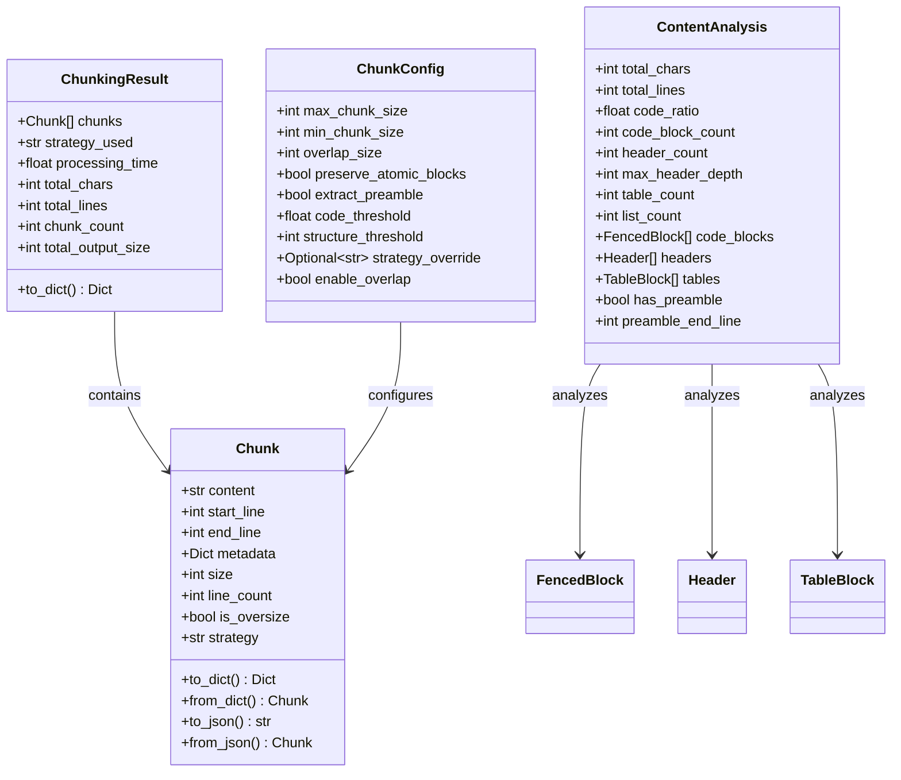

**Diagram sources**
- [markdown_chunker_v2/types.py](file://markdown_chunker_v2/types.py#L99-L272)
- [markdown_chunker_v2/config.py](file://markdown_chunker_v2/config.py#L12-L170)

## Chunk Dataclass

The `Chunk` dataclass represents the fundamental unit of processed content in the chunking pipeline. It encapsulates both the content and metadata necessary for downstream processing.

### Core Fields

| Field | Type | Description | Constraints |
|-------|------|-------------|-------------|
| `content` | `str` | The actual text content of the chunk | Cannot be empty or whitespace-only |
| `start_line` | `int` | Starting line number (1-indexed) | Must be ≥ 1 |
| `end_line` | `int` | Ending line number (1-indexed) | Must be ≥ start_line |
| `metadata` | `Dict[str, Any]` | Additional information about the chunk | Default: empty dict |

### Properties and Methods

The Chunk class provides several computed properties and utility methods:

#### Computed Properties
- **`size`**: Character count of the chunk content
- **`line_count`**: Number of lines spanned by the chunk
- **`is_oversize`**: Whether chunk exceeds normal size limits
- **`strategy`**: Strategy used to create this chunk

#### Metadata Accessors
- **`add_metadata(key, value)`**: Add metadata to the chunk
- **`get_metadata(key, default=None)`**: Retrieve metadata with optional default
- **`get_section_path()`**: Hierarchical section path (Phase 2)
- **`get_source_range()`**: Character offset range in source document
- **`get_section_id()`**: Stable section identifier

#### Serialization Methods
- **`to_dict()`**: Convert to dictionary for JSON serialization
- **`from_dict(data)`**: Create from dictionary
- **`to_json()`**: Serialize to JSON string
- **`from_json(json_str)`**: Deserialize from JSON string

### Validation Rules

The Chunk constructor enforces several validation rules:

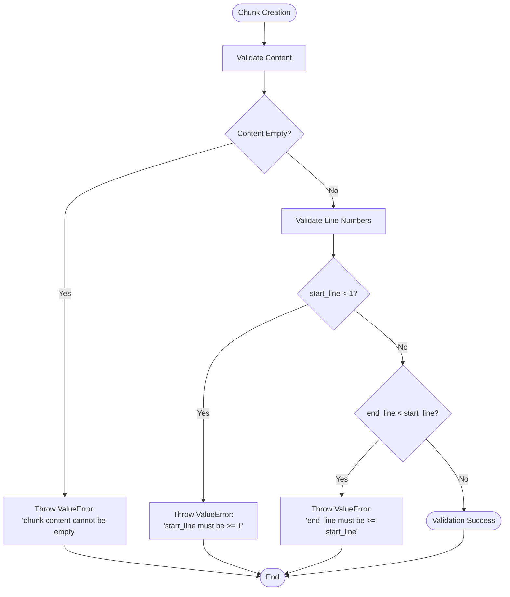

**Diagram sources**
- [markdown_chunker_v2/types.py](file://markdown_chunker_v2/types.py#L115-L122)

**Section sources**
- [markdown_chunker_v2/types.py](file://markdown_chunker_v2/types.py#L99-L272)
- [markdown_chunker_legacy/chunker/types.py](file://markdown_chunker_legacy/chunker/types.py#L36-L324)

## ChunkingResult Wrapper

The `ChunkingResult` class serves as a comprehensive container for the results of a chunking operation, including the generated chunks, processing metadata, and analysis information.

### Core Structure

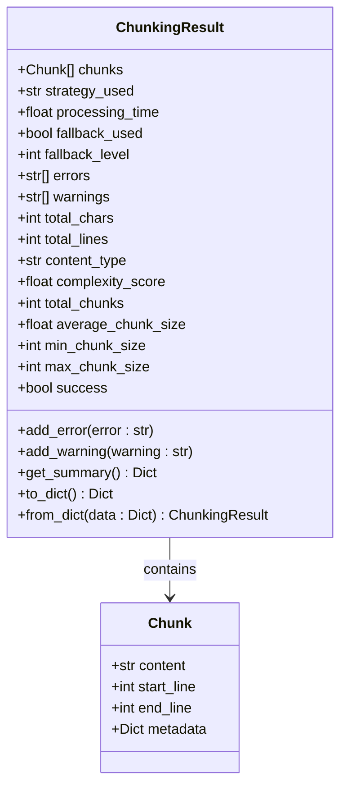

**Diagram sources**
- [markdown_chunker_v2/types.py](file://markdown_chunker_v2/types.py#L240-L272)
- [markdown_chunker_legacy/chunker/types.py](file://markdown_chunker_legacy/chunker/types.py#L325-L497)

### Key Properties

| Property | Type | Description |
|----------|------|-------------|
| `total_chunks` | `int` | Total number of chunks created |
| `average_chunk_size` | `float` | Mean size of all chunks |
| `min_chunk_size` | `int` | Size of smallest chunk |
| `max_chunk_size` | `int` | Size of largest chunk |
| `success` | `bool` | Whether chunking completed successfully |
| `fallback_used` | `bool` | Whether fallback strategy was employed |
| `fallback_level` | `int` | Depth of fallback strategy used |

### Quality Metrics

The ChunkingResult provides sophisticated quality metrics for monitoring and tuning:

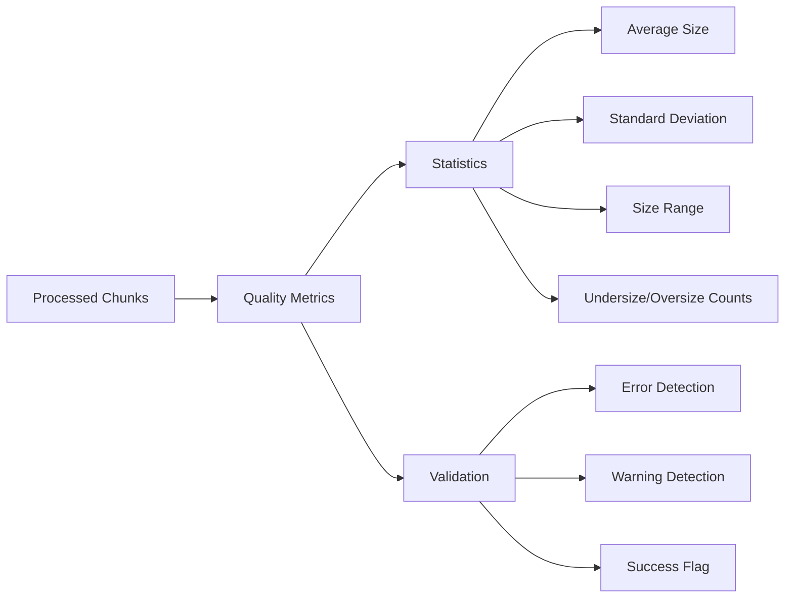

**Diagram sources**
- [markdown_chunker_v2/types.py](file://markdown_chunker_v2/types.py#L190-L238)

**Section sources**
- [markdown_chunker_v2/types.py](file://markdown_chunker_v2/types.py#L240-L272)
- [markdown_chunker_legacy/chunker/types.py](file://markdown_chunker_legacy/chunker/types.py#L325-L497)

## ContentAnalysis Model

The `ContentAnalysis` model provides comprehensive analysis of markdown documents, extracting metrics and structural information used for strategy selection and content classification.

### Analysis Components

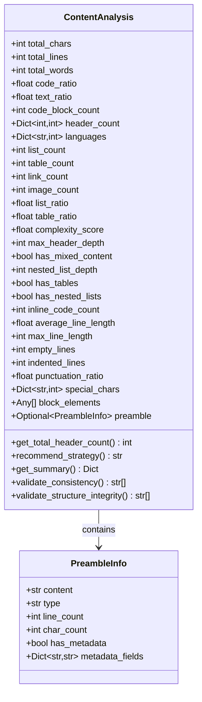

**Diagram sources**
- [markdown_chunker_legacy/parser/types.py](file://markdown_chunker_legacy/parser/types.py#L370-L932)

### Content Classification

The ContentAnalysis model determines content type based on various factors:

| Content Type | Criteria | Code Ratio | Complexity Score |
|--------------|----------|------------|------------------|
| `code_heavy` | High code content | ≥ 0.7 | Low |
| `mixed` | Balanced content | ≥ 0.3 | Medium-High |
| `text_heavy` | Primarily text | < 0.3 | Low |

### Strategy Recommendations

The analysis provides intelligent strategy recommendations:

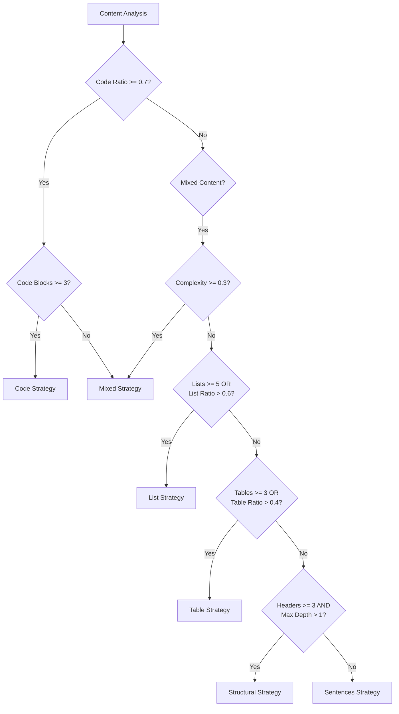

**Diagram sources**
- [markdown_chunker_legacy/parser/types.py](file://markdown_chunker_legacy/parser/types.py#L636-L649)

**Section sources**
- [markdown_chunker_legacy/parser/types.py](file://markdown_chunker_legacy/parser/types.py#L370-L932)

## StrategyMetrics Structure

The `StrategyMetrics` structure provides detailed evaluation metrics for strategy selection, enabling informed decisions about which chunking strategy to use.

### Metric Components

| Metric | Type | Description | Validation |
|--------|------|-------------|------------|
| `strategy_name` | `str` | Name of the strategy being evaluated | Required |
| `can_handle` | `bool` | Whether strategy can handle the content | Required |
| `quality_score` | `float` | Quality assessment (0.0-1.0) | 0.0 ≤ score ≤ 1.0 |
| `priority` | `int` | Strategy priority (≥ 1) | ≥ 1 |
| `final_score` | `float` | Weighted final score (0.0-1.0) | 0.0 ≤ score ≤ 1.0 |
| `reason` | `str` | Evaluation rationale | Required |

### Evaluation Process

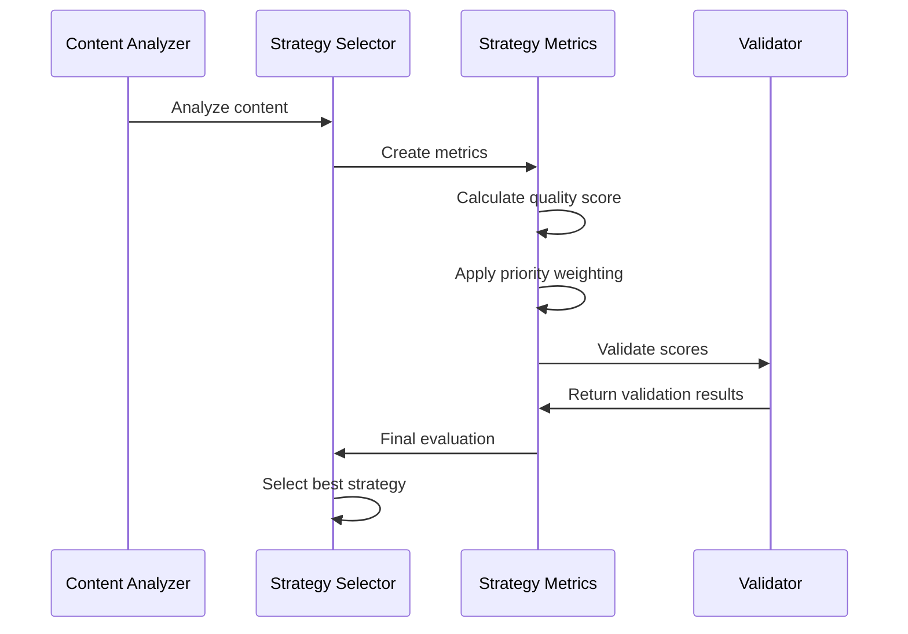

**Diagram sources**
- [markdown_chunker_legacy/chunker/selector.py](file://markdown_chunker_legacy/chunker/selector.py#L355-L385)

**Section sources**
- [tests/chunker/test_types.py](file://tests/chunker/test_types.py#L288-L347)

## Metadata Schema Definitions

The library uses a comprehensive metadata schema to track information about chunks and their processing characteristics.

### Standard Metadata Fields

| Field | Type | Purpose | Example Values |
|-------|------|---------|----------------|
| `content_type` | `str` | Content classification | `"code"`, `"text"`, `"mixed"` |
| `strategy` | `str` | Chunking strategy used | `"code"`, `"structural"`, `"sentences"` |
| `language` | `str` | Programming language | `"python"`, `"javascript"`, `"java"` |
| `allow_oversize` | `bool` | Oversize allowance | `true` for atomic blocks |
| `fence_balance_error` | `bool` | Code fence balance issue | `true` if unbalanced |
| `section_path` | `List[str]` | Hierarchical path | `["Chapter 1", "Introduction"]` |
| `start_offset` | `int` | Character offset | `100` |
| `end_offset` | `int` | Character offset | `200` |
| `section_id` | `str` | Stable section identifier | `"introduction-section"` |

### Content-Specific Metadata

#### Code Blocks
- **`language`**: Programming language identifier
- **`fence_char`**: Fence delimiter type (`"` or `"~"`)
- **`fence_length`**: Length of fence delimiters
- **`nesting_level`**: Code block nesting level
- **`is_closed`**: Whether code block is properly closed

#### Lists
- **`list_type`**: List type (`"ordered"`, `"unordered"`, `"task"`)
- **`list_item_count`**: Number of items in the list
- **`max_nesting_level`**: Maximum nesting depth

#### Tables
- **`column_count`**: Number of columns
- **`row_count`**: Number of data rows
- **`alignment`**: Column alignment specifications

### Metadata Validation

The system validates metadata consistency during processing:

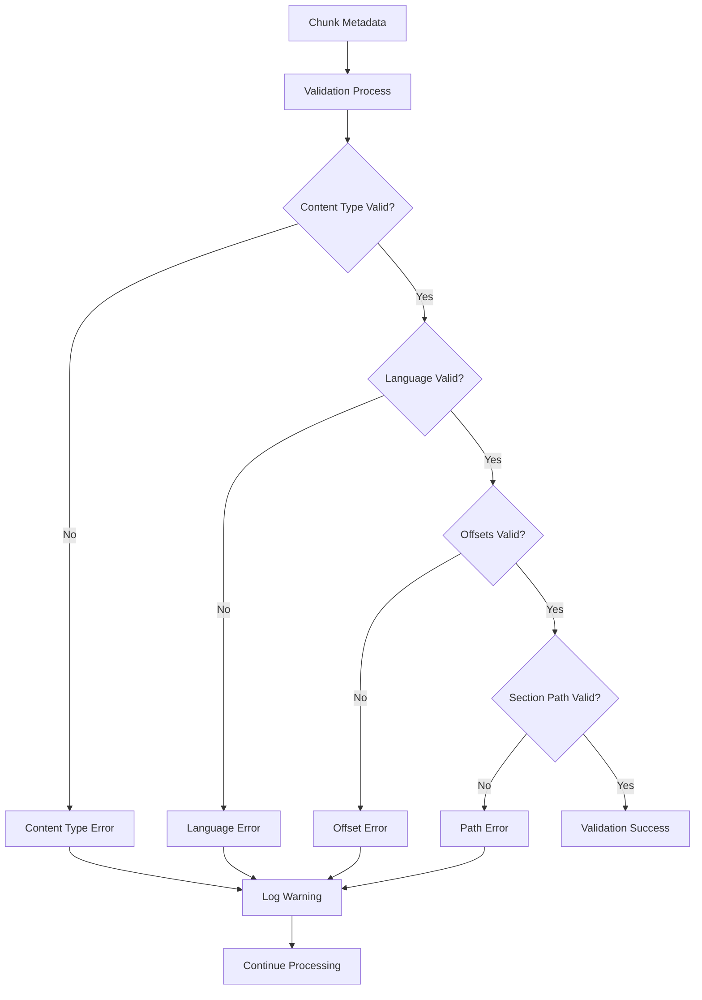

**Diagram sources**
- [markdown_chunker_legacy/parser/enhanced_ast_builder.py](file://markdown_chunker_legacy/parser/enhanced_ast_builder.py#L623-L653)

**Section sources**
- [markdown_chunker_legacy/chunker/types.py](file://markdown_chunker_legacy/chunker/types.py#L36-L324)
- [markdown_chunker_v2/types.py](file://markdown_chunker_v2/types.py#L99-L272)

## Configuration Types

The `ChunkConfig` class provides comprehensive configuration for chunking behavior, controlling size limits, strategy selection thresholds, and processing options.

### Core Configuration Parameters

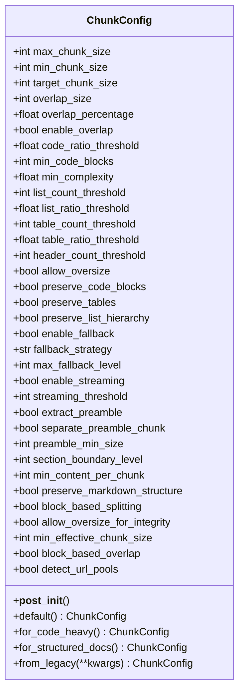

**Diagram sources**
- [markdown_chunker_legacy/chunker/types.py](file://markdown_chunker_legacy/chunker/types.py#L500-L1080)

### Configuration Profiles

The library provides predefined configuration profiles for common use cases:

| Profile | Purpose | Key Settings |
|---------|---------|--------------|
| `default()` | General documents | `max_chunk_size=4096`, `overlap_size=200` |
| `for_code_heavy()` | Code documentation | `max_chunk_size=6144`, `code_ratio_threshold=0.5` |
| `for_structured_docs()` | Structured content | `max_chunk_size=3072`, `header_count_threshold=2` |

### Validation Rules

The configuration system enforces several validation rules:

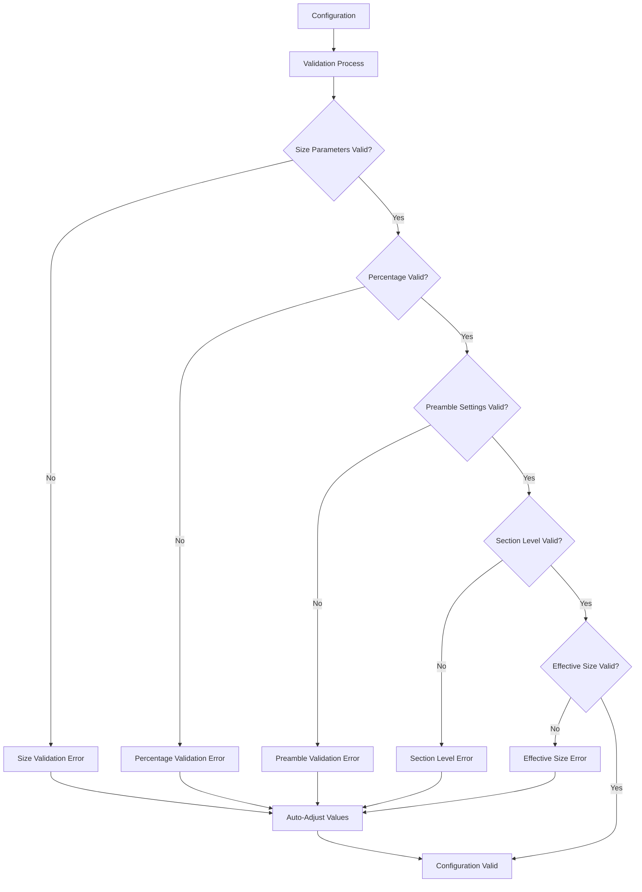

**Diagram sources**
- [markdown_chunker_legacy/chunker/types.py](file://markdown_chunker_legacy/chunker/types.py#L636-L684)

**Section sources**
- [markdown_chunker_legacy/chunker/types.py](file://markdown_chunker_legacy/chunker/types.py#L500-L1080)
- [markdown_chunker_v2/config.py](file://markdown_chunker_v2/config.py#L12-L170)

## Type Compatibility and Migration

The library maintains backward compatibility through a sophisticated migration system that handles breaking changes between versions.

### Migration Architecture

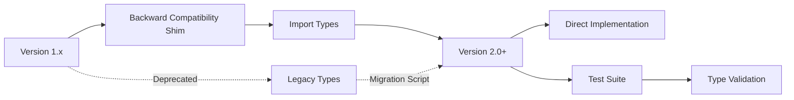

**Diagram sources**
- [markdown_chunker/chunker/types.py](file://markdown_chunker/chunker/types.py#L1-L9)

### Breaking Changes

Key breaking changes from v1.x to v2.0:

| Aspect | v1.x | v2.0 | Impact |
|--------|------|------|--------|
| **Parameters** | 32+ parameters | 8 core parameters | Simplified configuration |
| **Methods** | `chunk_with_analysis()` | Direct `chunk()` | Metadata moved to chunks |
| **Strategies** | Multiple strategies | Consolidated strategies | Better performance |
| **Metadata** | Extensive metadata | Essential metadata | Reduced overhead |

### Migration Examples

#### Configuration Migration
```python
# v1.x
config = ChunkConfig(
    max_size=1000,
    enable_overlap=True,
    overlap_size=100,
    block_based_splitting=True,
    preserve_code_blocks=True,
    enable_deduplication=False
)

# v2.0
config = ChunkConfig(
    max_chunk_size=1000,
    overlap_size=100,
    preserve_atomic_blocks=True
)
```

#### Analysis Migration
```python
# v1.x
result = chunker.chunk_with_analysis(text)
chunks = result.chunks
strategy = result.strategy_used

# v2.0
chunks = chunker.chunk(text)
strategy = chunks[0].metadata.get('strategy') if chunks else None
```

**Section sources**
- [docs/MIGRATION.md](file://docs/MIGRATION.md#L1-L223)

## Usage Patterns and Examples

### Basic Chunking Pipeline

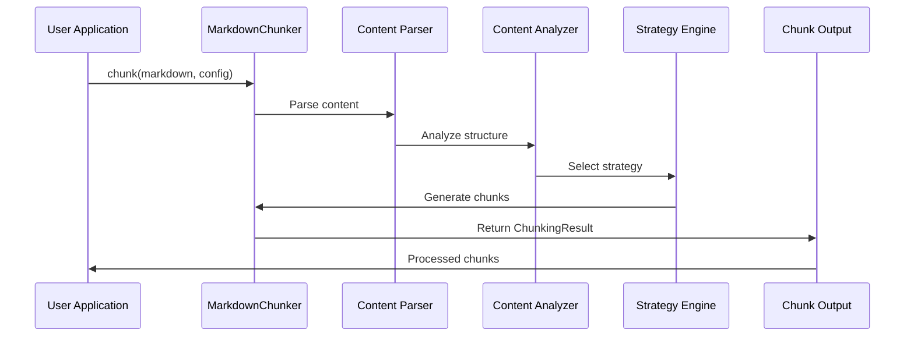

**Diagram sources**
- [examples/basic_usage.py](file://examples/basic_usage.py#L14-L48)

### RAG Integration Pattern

The library provides specialized patterns for Retrieval-Augmented Generation (RAG) applications:

#### Embedding Preparation
```python
def prepare_chunks_for_embeddings(markdown: str, max_chunk_size: int = 500) -> List[Dict[str, Any]]:
    config = ChunkConfig(
        max_chunk_size=max_chunk_size,
        min_chunk_size=100,
        enable_overlap=True,
        overlap_size=50
    )
    
    chunker = MarkdownChunker(config)
    result = chunker.chunk_with_analysis(markdown)
    
    embeddings_data = []
    for chunk in result.chunks:
        embeddings_data.append({
            'id': f"chunk_{chunk.index}",
            'text': chunk.content,
            'metadata': {
                'chunk_index': chunk.index,
                'lines': f"{chunk.start_line}-{chunk.end_line}",
                'size': chunk.size,
                'content_type': chunk.metadata.get('content_type', 'text'),
                'strategy': result.strategy_used,
                'has_code': 'language' in chunk.metadata,
                'has_table': 'column_count' in chunk.metadata,
                'has_list': 'list_type' in chunk.metadata,
                'complexity': result.complexity_score,
            }
        })
    
    return embeddings_data
```

#### Vector Database Integration
```python
def prepare_for_vector_database(documents: List[Dict[str, str]]) -> List[Dict[str, Any]]:
    chunker = MarkdownChunker(ChunkConfig(
        max_chunk_size=500,
        enable_overlap=True,
        overlap_size=50
    ))
    
    all_chunks = []
    for doc in documents:
        doc_id = doc['id']
        content = doc['content']
        
        result = chunker.chunk_with_analysis(content)
        
        for chunk in result.chunks:
            all_chunks.append({
                'id': f"{doc_id}_chunk_{chunk.index}",
                'doc_id': doc_id,
                'chunk_id': chunk.index,
                'text': chunk.content,
                'metadata': {
                    'doc_id': doc_id,
                    'chunk_index': chunk.index,
                    'total_chunks': len(result.chunks),
                    'lines': f"{chunk.start_line}-{chunk.end_line}",
                    'size': chunk.size,
                    'strategy': result.strategy_used,
                    'content_type': result.content_type,
                    **chunk.metadata
                }
            })
    
    return all_chunks
```

**Section sources**
- [examples/rag_integration.py](file://examples/rag_integration.py#L13-L432)

## Testing and Validation

The library includes comprehensive test suites that validate type correctness and backward compatibility.

### Type Validation Tests

The test suite covers all major data types:

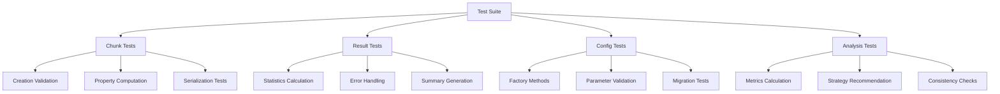

**Diagram sources**
- [tests/chunker/test_types.py](file://tests/chunker/test_types.py#L1-L347)
- [tests/parser/test_types.py](file://tests/parser/test_types.py#L1-L193)

### Backward Compatibility Tests

The library ensures backward compatibility through:

1. **Import Compatibility**: All v1.x imports resolve to v2.0 implementations
2. **Behavior Preservation**: Core functionality remains unchanged
3. **Migration Validation**: Migration scripts produce identical results
4. **Type Safety**: Strong typing prevents runtime errors

**Section sources**
- [tests/chunker/test_types.py](file://tests/chunker/test_types.py#L1-L347)
- [tests/parser/test_types.py](file://tests/parser/test_types.py#L1-L193)

## Best Practices

### Configuration Guidelines

1. **Choose Appropriate Profiles**: Use predefined profiles for common use cases
2. **Balance Size Parameters**: Ensure `min_chunk_size` ≤ `target_chunk_size` ≤ `max_chunk_size`
3. **Enable Overlap for RAG**: Use overlap for better context preservation in retrieval systems
4. **Monitor Complexity**: Adjust thresholds based on content characteristics

### Metadata Usage

1. **Track Strategy Selection**: Use metadata to understand which strategies were applied
2. **Filter by Content Type**: Leverage content type information for specialized processing
3. **Preserve Structure**: Enable structure preservation for hierarchical content
4. **Validate Integrity**: Check for metadata consistency in production systems

### Performance Optimization

1. **Batch Processing**: Process multiple documents together when possible
2. **Streaming Support**: Enable streaming for large documents
3. **Memory Management**: Monitor memory usage with large configurations
4. **Caching Results**: Cache analysis results for repeated processing

### Integration Patterns

1. **RAG Pipelines**: Use smaller chunks with overlap for embedding generation
2. **Search Indexing**: Optimize for search relevance with appropriate chunk sizes
3. **Content Analysis**: Leverage analysis results for strategy selection
4. **Monitoring**: Track chunking metrics for system optimization