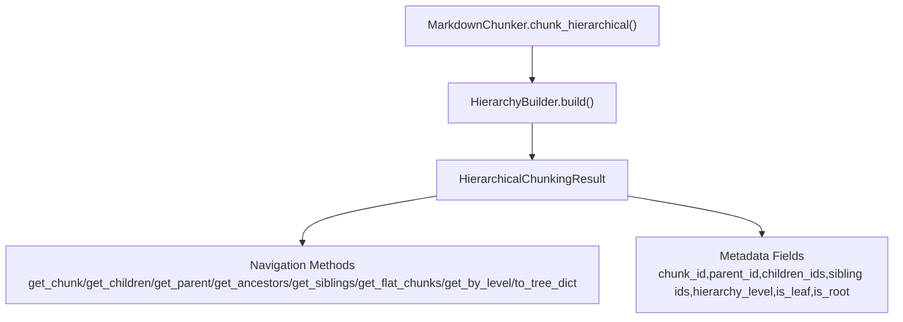
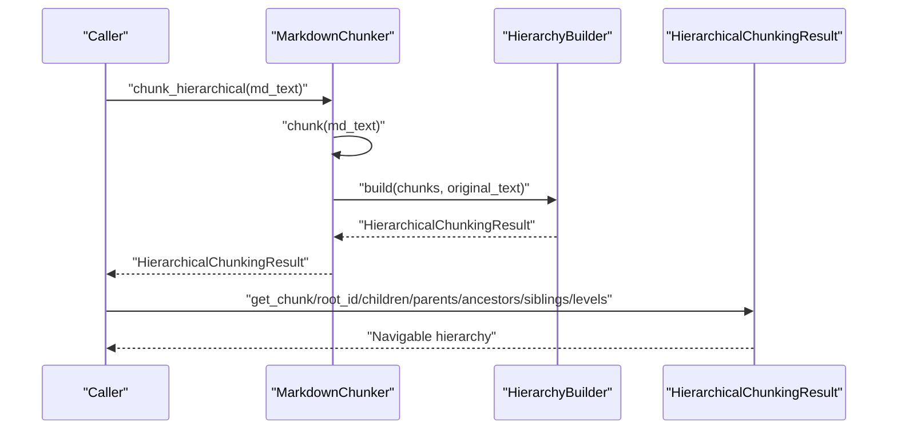
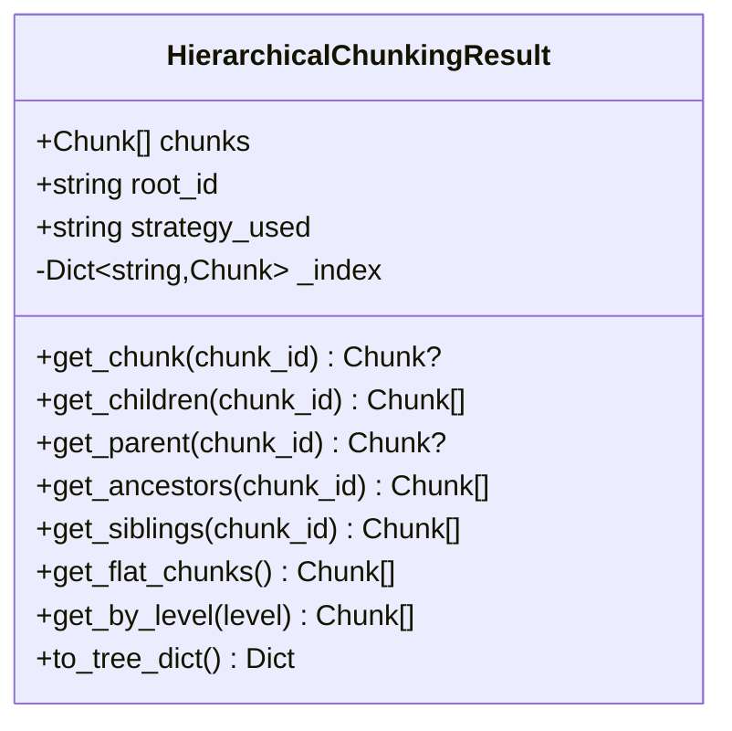
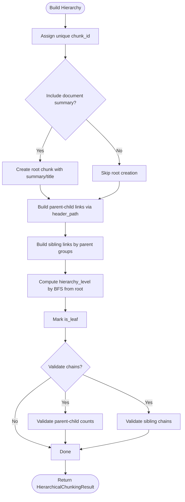
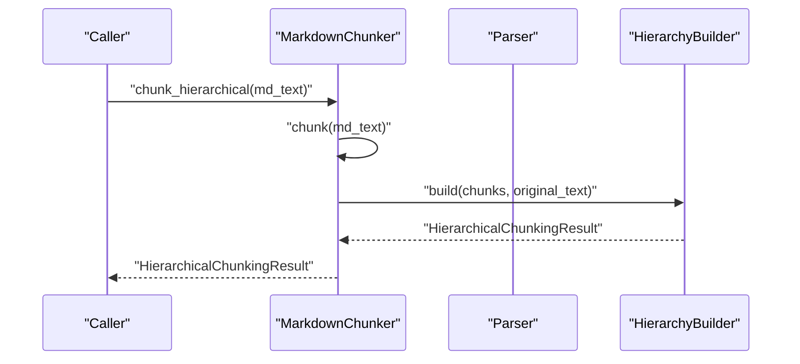
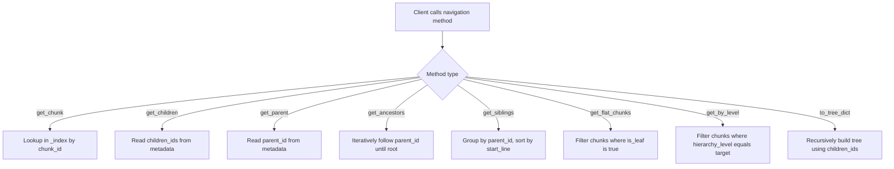
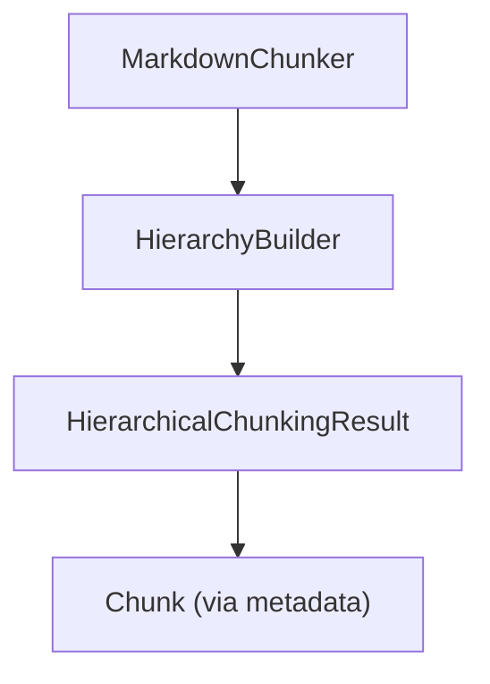

# HierarchicalChunkingResult

<cite>
**Referenced Files in This Document**
- [hierarchy.py](file://markdown_chunker_v2/hierarchy.py)
- [chunker.py](file://markdown_chunker_v2/chunker.py)
- [types.py](file://markdown_chunker_v2/types.py)
- [test_hierarchical_chunking.py](file://tests/chunker/test_hierarchical_chunking.py)
- [test_dify_hierarchical_integration.py](file://tests/integration/test_dify_hierarchical_integration.py)
- [types.md](file://docs/api/types.md)
- [11-hierarchical-chunking.md](file://docs/research/features/11-hierarchical-chunking.md)
</cite>

## Table of Contents
1. [Introduction](#introduction)
2. [Project Structure](#project-structure)
3. [Core Components](#core-components)
4. [Architecture Overview](#architecture-overview)
5. [Detailed Component Analysis](#detailed-component-analysis)
6. [Dependency Analysis](#dependency-analysis)
7. [Performance Considerations](#performance-considerations)
8. [Troubleshooting Guide](#troubleshooting-guide)
9. [Conclusion](#conclusion)

## Introduction
HierarchicalChunkingResult is the result object for hierarchical chunking in markdown_chunker v2. It augments flat chunks with parent-child-sibling relationships and navigation methods, enabling multi-level retrieval and contextual navigation. It stores all chunks (including a root document chunk when enabled) and provides O(1) lookup by chunk ID, plus methods to traverse the hierarchy.

## Project Structure
The hierarchical chunking feature spans several modules:
- Result object and navigation: markdown_chunker_v2/hierarchy.py
- Chunking orchestration: markdown_chunker_v2/chunker.py
- Shared types: markdown_chunker_v2/types.py
- Tests and integration: tests/chunker/test_hierarchical_chunking.py, tests/integration/test_dify_hierarchical_integration.py
- API docs and research: docs/api/types.md, docs/research/features/11-hierarchical-chunking.md

**Diagram sources**
- [chunker.py](file://markdown_chunker_v2/chunker.py#L176-L206)
- [hierarchy.py](file://markdown_chunker_v2/hierarchy.py#L14-L196)
- [types.py](file://markdown_chunker_v2/types.py#L186-L321)

**Section sources**
- [hierarchy.py](file://markdown_chunker_v2/hierarchy.py#L14-L196)
- [chunker.py](file://markdown_chunker_v2/chunker.py#L176-L206)
- [types.py](file://markdown_chunker_v2/types.py#L186-L321)

## Core Components
- HierarchicalChunkingResult: Holds chunks, root_id, strategy_used, and an internal O(1) index for chunk lookup. Provides navigation APIs and tree serialization.
- HierarchyBuilder: Post-processes flat chunks to assign IDs, build parent-child and sibling links, compute hierarchy levels, mark leaves, and optionally create a root document summary chunk.
- Chunker integration: MarkdownChunker.chunk_hierarchical() performs normal chunking and delegates hierarchy construction to HierarchyBuilder.

Key metadata fields added during hierarchy building:
- chunk_id: Unique short ID for each chunk
- parent_id: Parent chunk ID
- children_ids: List of child chunk IDs
- prev_sibling_id/next_sibling_id: Sibling linkage
- hierarchy_level: Tree depth level (0=root, 1=sections, 2=subsections, 3+=paragraphs)
- is_leaf/is_root: Structural flags
- header_path: Path used for parent assignment

**Section sources**
- [hierarchy.py](file://markdown_chunker_v2/hierarchy.py#L14-L196)
- [chunker.py](file://markdown_chunker_v2/chunker.py#L176-L206)
- [types.md](file://docs/api/types.md#L442-L486)
- [11-hierarchical-chunking.md](file://docs/research/features/11-hierarchical-chunking.md#L118-L235)

## Architecture Overview
The hierarchical chunking pipeline:
1. MarkdownChunker.chunk() produces flat chunks with header_path and other metadata.
2. HierarchyBuilder.build() assigns IDs, optionally creates a root summary chunk, builds parent-child and sibling links, computes hierarchy levels, marks leaves, and validates chains.
3. HierarchicalChunkingResult exposes navigation methods and serialization.

**Diagram sources**
- [chunker.py](file://markdown_chunker_v2/chunker.py#L176-L206)
- [hierarchy.py](file://markdown_chunker_v2/hierarchy.py#L223-L275)

## Detailed Component Analysis

### HierarchicalChunkingResult
Responsibilities:
- Store flat list of chunks plus root_id and strategy_used
- Provide O(1) chunk lookup via internal index keyed by chunk_id
- Navigation APIs:
  - get_chunk(chunk_id)
  - get_children(chunk_id)
  - get_parent(chunk_id)
  - get_ancestors(chunk_id)
  - get_siblings(chunk_id)
  - get_flat_chunks() (leaf-only)
  - get_by_level(level)
  - to_tree_dict() for safe serialization

Implementation highlights:
- __post_init__ builds the index from chunk.metadata["chunk_id"]
- Navigation methods rely on metadata fields populated by HierarchyBuilder
- to_tree_dict serializes the hierarchy using IDs to avoid circular references

**Diagram sources**
- [hierarchy.py](file://markdown_chunker_v2/hierarchy.py#L14-L196)

**Section sources**
- [hierarchy.py](file://markdown_chunker_v2/hierarchy.py#L14-L196)
- [types.md](file://docs/api/types.md#L442-L486)

### HierarchyBuilder
Responsibilities:
- Assign unique chunk_id to each chunk
- Optionally create a root document chunk with summary and title
- Build parent-child relationships using header_path metadata
- Build sibling chains ordered by start_line
- Compute hierarchy_level based on tree depth (BFS)
- Mark is_leaf and is_root
- Validate parent-child counts and sibling chains

Key steps in build():
- _assign_ids
- _create_root_chunk (optional)
- _build_parent_child_links
- _build_sibling_links
- _assign_hierarchy_levels
- _mark_leaves
- Validation (optional)

**Diagram sources**
- [hierarchy.py](file://markdown_chunker_v2/hierarchy.py#L223-L275)
- [hierarchy.py](file://markdown_chunker_v2/hierarchy.py#L277-L341)
- [hierarchy.py](file://markdown_chunker_v2/hierarchy.py#L342-L488)
- [hierarchy.py](file://markdown_chunker_v2/hierarchy.py#L489-L564)
- [hierarchy.py](file://markdown_chunker_v2/hierarchy.py#L565-L738)

**Section sources**
- [hierarchy.py](file://markdown_chunker_v2/hierarchy.py#L223-L275)
- [hierarchy.py](file://markdown_chunker_v2/hierarchy.py#L277-L341)
- [hierarchy.py](file://markdown_chunker_v2/hierarchy.py#L342-L488)
- [hierarchy.py](file://markdown_chunker_v2/hierarchy.py#L489-L564)
- [hierarchy.py](file://markdown_chunker_v2/hierarchy.py#L565-L738)

### Integration with MarkdownChunker
MarkdownChunker.chunk_hierarchical() orchestrates:
- Normal chunking via chunk()
- Passing chunks and original text to HierarchyBuilder.build()
- Returning HierarchicalChunkingResult with navigation methods

**Diagram sources**
- [chunker.py](file://markdown_chunker_v2/chunker.py#L176-L206)
- [hierarchy.py](file://markdown_chunker_v2/hierarchy.py#L223-L275)

**Section sources**
- [chunker.py](file://markdown_chunker_v2/chunker.py#L176-L206)

### API Surface and Usage Patterns
- Navigation methods: get_chunk, get_children, get_parent, get_ancestors, get_siblings, get_flat_chunks, get_by_level, to_tree_dict
- Metadata fields: chunk_id, parent_id, children_ids, prev_sibling_id, next_sibling_id, hierarchy_level, is_leaf, is_root, header_path
- Serialization: to_tree_dict returns a tree dictionary using IDs to avoid circular references

**Diagram sources**
- [hierarchy.py](file://markdown_chunker_v2/hierarchy.py#L41-L196)

**Section sources**
- [hierarchy.py](file://markdown_chunker_v2/hierarchy.py#L41-L196)
- [types.md](file://docs/api/types.md#L442-L486)

## Dependency Analysis
- HierarchicalChunkingResult depends on Chunk metadata fields populated by HierarchyBuilder
- HierarchyBuilder depends on Chunk and uses header_path to infer parent-child relationships
- MarkdownChunker.chunk_hierarchical() composes chunk() and HierarchyBuilder.build()

**Diagram sources**
- [chunker.py](file://markdown_chunker_v2/chunker.py#L176-L206)
- [hierarchy.py](file://markdown_chunker_v2/hierarchy.py#L14-L196)
- [types.py](file://markdown_chunker_v2/types.py#L186-L321)

**Section sources**
- [chunker.py](file://markdown_chunker_v2/chunker.py#L176-L206)
- [hierarchy.py](file://markdown_chunker_v2/hierarchy.py#L14-L196)
- [types.py](file://markdown_chunker_v2/types.py#L186-L321)

## Performance Considerations
- O(1) chunk lookup via internal index built in __post_init__
- Navigation methods operate on metadata fields; complexity is proportional to number of children/siblings
- to_tree_dict uses ID-based recursion to avoid circular references and is safe for JSON serialization
- HierarchyBuilder’s build() orchestrates a series of O(n) passes over chunks with dictionary lookups

Practical guidance:
- Prefer get_flat_chunks() for systems that do not support hierarchy to reduce payload size
- Use get_by_level() to target specific levels for retrieval
- Enable debug mode in tool integrations to include root and intermediate chunks when needed

**Section sources**
- [hierarchy.py](file://markdown_chunker_v2/hierarchy.py#L14-L196)
- [test_dify_hierarchical_integration.py](file://tests/integration/test_dify_hierarchical_integration.py#L262-L319)

## Troubleshooting Guide
Common issues and resolutions:
- Missing chunk_id: Ensure HierarchyBuilder._assign_ids was executed (part of build())
- Broken parent-child links: Validate via HierarchyBuilder._validate_parent_child_counts
- Broken sibling chains: Validate via HierarchyBuilder._validate_sibling_chains
- Empty or missing root: Confirm include_document_summary setting and that _create_root_chunk ran
- Unexpected flat chunks: Verify get_flat_chunks() usage; non-leaf chunks are excluded by design
- Serialization errors: Use to_tree_dict() which serializes IDs instead of object references

Validation routines:
- Parent-child count validation
- Sibling chain integrity checks (first sibling, chain traversal, cycle detection)

**Section sources**
- [hierarchy.py](file://markdown_chunker_v2/hierarchy.py#L565-L738)
- [test_hierarchical_chunking.py](file://tests/chunker/test_hierarchical_chunking.py#L410-L464)

## Conclusion
HierarchicalChunkingResult provides a robust, metadata-driven approach to hierarchical chunking. By adding parent-child-sibling relationships and navigation methods to flat chunks, it enables multi-level retrieval and contextual navigation without altering the underlying chunk content. The design emphasizes O(1) lookups, safe serialization, and validation to ensure reliable behavior across diverse documents.