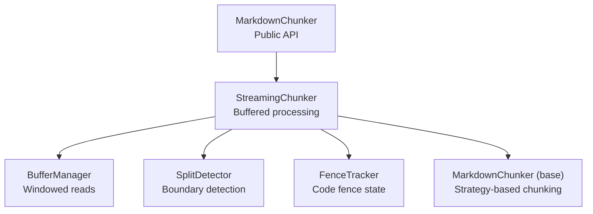
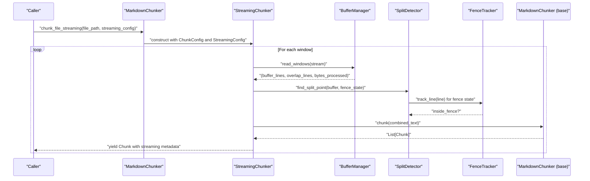
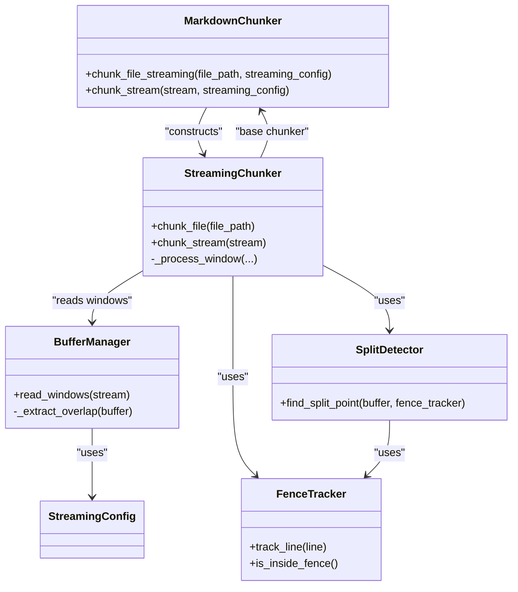
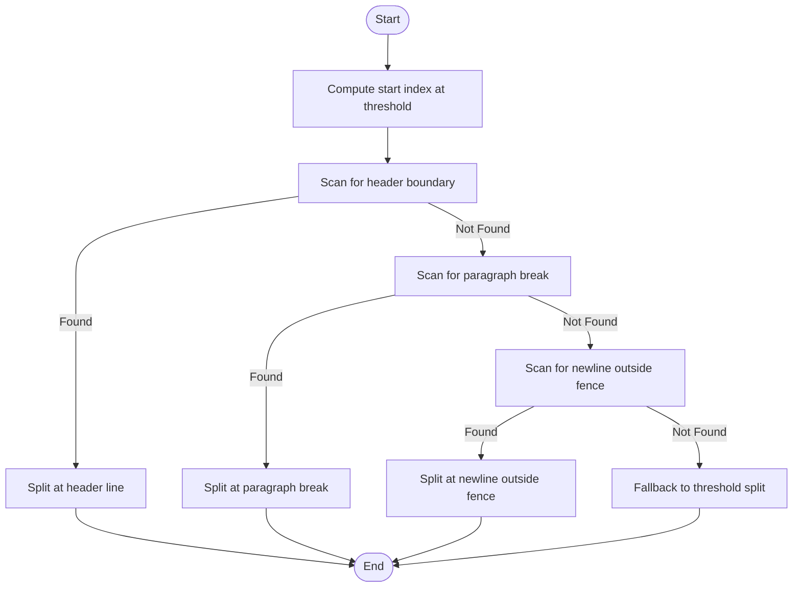

# Streaming API Reference

<cite>
**Referenced Files in This Document**
- [docs/api/streaming.md](file://docs/api/streaming.md)
- [markdown_chunker_v2/chunker.py](file://markdown_chunker_v2/chunker.py)
- [markdown_chunker_v2/streaming/__init__.py](file://markdown_chunker_v2/streaming/__init__.py)
- [markdown_chunker_v2/streaming/config.py](file://markdown_chunker_v2/streaming/config.py)
- [markdown_chunker_v2/streaming/streaming_chunker.py](file://markdown_chunker_v2/streaming/streaming_chunker.py)
- [markdown_chunker_v2/streaming/buffer_manager.py](file://markdown_chunker_v2/streaming/buffer_manager.py)
- [markdown_chunker_v2/streaming/split_detector.py](file://markdown_chunker_v2/streaming/split_detector.py)
- [markdown_chunker_v2/streaming/fence_tracker.py](file://markdown_chunker_v2/streaming/fence_tracker.py)
- [tests/integration/test_streaming_integration.py](file://tests/integration/test_streaming_integration.py)
</cite>

## Table of Contents
1. [Introduction](#introduction)
2. [Project Structure](#project-structure)
3. [Core Components](#core-components)
4. [Architecture Overview](#architecture-overview)
5. [Detailed Component Analysis](#detailed-component-analysis)
6. [Dependency Analysis](#dependency-analysis)
7. [Performance Considerations](#performance-considerations)
8. [Troubleshooting Guide](#troubleshooting-guide)
9. [Conclusion](#conclusion)
10. [Appendices](#appendices)

## Introduction
This document describes the Streaming API for processing large Markdown files efficiently. It focuses on the public interface and internal architecture that enables memory-bounded chunking through buffered windows, safe split detection, and streaming metadata. It also provides guidance on configuration tuning, performance characteristics, and troubleshooting.

## Project Structure
The Streaming API is implemented under the streaming module and integrated into the main MarkdownChunker class. The primary entry points are:
- chunk_file_streaming(file_path, streaming_config): streams chunks from a file path
- chunk_stream(stream, streaming_config): streams chunks from a text stream

These methods delegate to StreamingChunker, which orchestrates buffer windows, overlap handling, and safe split detection.

**Diagram sources**
- [markdown_chunker_v2/chunker.py](file://markdown_chunker_v2/chunker.py#L240-L290)
- [markdown_chunker_v2/streaming/streaming_chunker.py](file://markdown_chunker_v2/streaming/streaming_chunker.py#L18-L104)
- [markdown_chunker_v2/streaming/buffer_manager.py](file://markdown_chunker_v2/streaming/buffer_manager.py#L13-L64)
- [markdown_chunker_v2/streaming/split_detector.py](file://markdown_chunker_v2/streaming/split_detector.py#L12-L98)
- [markdown_chunker_v2/streaming/fence_tracker.py](file://markdown_chunker_v2/streaming/fence_tracker.py#L11-L66)

**Section sources**
- [markdown_chunker_v2/chunker.py](file://markdown_chunker_v2/chunker.py#L240-L290)
- [markdown_chunker_v2/streaming/__init__.py](file://markdown_chunker_v2/streaming/__init__.py#L1-L14)

## Core Components
- StreamingConfig: Defines buffer size, overlap lines, memory ceiling, and safe split threshold.
- StreamingChunker: Orchestrates windowed reading, overlap handling, and yields chunks with streaming metadata.
- BufferManager: Reads input line-by-line into fixed-size windows and manages overlap between windows.
- SplitDetector: Determines safe split points prioritizing headers, paragraph breaks, and newline outside fences.
- FenceTracker: Tracks fenced code/table state to prevent mid-block splits.
- MarkdownChunker (base): Applies strategy-based chunking to each window’s combined text.

Key streaming metadata fields:
- stream_window_index: Which buffer window produced the chunk
- stream_chunk_index: Global chunk index across all windows
- bytes_processed: Cumulative bytes processed up to this chunk

**Section sources**
- [markdown_chunker_v2/streaming/config.py](file://markdown_chunker_v2/streaming/config.py#L8-L24)
- [markdown_chunker_v2/streaming/streaming_chunker.py](file://markdown_chunker_v2/streaming/streaming_chunker.py#L18-L104)
- [markdown_chunker_v2/streaming/buffer_manager.py](file://markdown_chunker_v2/streaming/buffer_manager.py#L13-L64)
- [markdown_chunker_v2/streaming/split_detector.py](file://markdown_chunker_v2/streaming/split_detector.py#L12-L98)
- [markdown_chunker_v2/streaming/fence_tracker.py](file://markdown_chunker_v2/streaming/fence_tracker.py#L11-L66)
- [markdown_chunker_v2/chunker.py](file://markdown_chunker_v2/chunker.py#L240-L290)

## Architecture Overview
The Streaming API integrates with the main chunking pipeline by processing input in overlapping windows and applying the same strategy-based chunking to each window. The StreamingChunker coordinates:
- Windowed reading via BufferManager
- Overlap preservation between windows
- Safe split detection via SplitDetector
- Fence-aware boundary detection via FenceTracker
- Base chunking via MarkdownChunker

**Diagram sources**
- [markdown_chunker_v2/chunker.py](file://markdown_chunker_v2/chunker.py#L240-L290)
- [markdown_chunker_v2/streaming/streaming_chunker.py](file://markdown_chunker_v2/streaming/streaming_chunker.py#L43-L104)
- [markdown_chunker_v2/streaming/buffer_manager.py](file://markdown_chunker_v2/streaming/buffer_manager.py#L29-L64)
- [markdown_chunker_v2/streaming/split_detector.py](file://markdown_chunker_v2/streaming/split_detector.py#L28-L64)
- [markdown_chunker_v2/streaming/fence_tracker.py](file://markdown_chunker_v2/streaming/fence_tracker.py#L18-L49)

## Detailed Component Analysis

### StreamingConfig
Defines the runtime parameters for streaming:
- buffer_size: Character count per window
- overlap_lines: Lines carried over to the next window
- max_memory_mb: Upper bound for memory usage
- safe_split_threshold: Fraction of buffer to start looking for split points

Tuning guidance:
- Increase buffer_size to reduce window transitions for very large files
- Increase overlap_lines to improve context continuity across windows
- Adjust max_memory_mb to fit constrained environments

**Section sources**
- [markdown_chunker_v2/streaming/config.py](file://markdown_chunker_v2/streaming/config.py#L8-L24)
- [docs/api/streaming.md](file://docs/api/streaming.md#L15-L60)

### StreamingChunker
Responsibilities:
- Initialize with ChunkConfig and optional StreamingConfig
- Read windows from a stream using BufferManager
- Combine overlap with buffer and apply base chunking
- Attach streaming metadata to each yielded chunk

Behavior:
- Yields chunks one at a time, enabling low memory footprint
- Preserves overlap context via metadata-only fields in base chunking

**Section sources**
- [markdown_chunker_v2/streaming/streaming_chunker.py](file://markdown_chunker_v2/streaming/streaming_chunker.py#L18-L104)
- [markdown_chunker_v2/chunker.py](file://markdown_chunker_v2/chunker.py#L240-L290)

### BufferManager
Responsibilities:
- Read input line-by-line
- Accumulate lines until buffer_size threshold is met
- Emit tuples of (buffer_lines, overlap_lines, bytes_processed)
- Extract overlap from the end of the previous buffer

Complexity:
- O(n) over input lines
- Memory per window is bounded by buffer_size and overlap_lines

**Section sources**
- [markdown_chunker_v2/streaming/buffer_manager.py](file://markdown_chunker_v2/streaming/buffer_manager.py#L13-L64)

### SplitDetector
Priority order for split detection:
1. Header boundary: line before a header line
2. Paragraph break: double newline
3. Newline outside fence: single newline when not inside a fenced block
4. Fallback: threshold position

Fence awareness:
- Uses FenceTracker to avoid splitting inside fenced code blocks or tables

**Section sources**
- [markdown_chunker_v2/streaming/split_detector.py](file://markdown_chunker_v2/streaming/split_detector.py#L12-L98)
- [markdown_chunker_v2/streaming/fence_tracker.py](file://markdown_chunker_v2/streaming/fence_tracker.py#L11-L66)

### FenceTracker
Maintains a stack of open fences to prevent mid-block splits. It tracks opening and closing fences and exposes is_inside_fence() to downstream detectors.

**Section sources**
- [markdown_chunker_v2/streaming/fence_tracker.py](file://markdown_chunker_v2/streaming/fence_tracker.py#L11-L66)

### Public API: chunk_file_streaming and chunk_stream
- chunk_file_streaming(file_path, streaming_config=None) -> Iterator[Chunk]
- chunk_stream(stream, streaming_config=None) -> Iterator[Chunk]

Both methods construct a StreamingChunker with the provided or default StreamingConfig and delegate to StreamingChunker’s chunk_file or chunk_stream respectively.

Streaming metadata attached:
- stream_window_index
- stream_chunk_index
- bytes_processed

**Section sources**
- [markdown_chunker_v2/chunker.py](file://markdown_chunker_v2/chunker.py#L240-L290)
- [docs/api/streaming.md](file://docs/api/streaming.md#L64-L179)

## Dependency Analysis
The Streaming API composes several modules with clear separation of concerns:
- StreamingChunker depends on BufferManager, SplitDetector, FenceTracker, and the base MarkdownChunker
- SplitDetector depends on FenceTracker for fence-awareness
- BufferManager depends on StreamingConfig
- Public API delegates to StreamingChunker

**Diagram sources**
- [markdown_chunker_v2/chunker.py](file://markdown_chunker_v2/chunker.py#L240-L290)
- [markdown_chunker_v2/streaming/streaming_chunker.py](file://markdown_chunker_v2/streaming/streaming_chunker.py#L18-L104)
- [markdown_chunker_v2/streaming/buffer_manager.py](file://markdown_chunker_v2/streaming/buffer_manager.py#L13-L64)
- [markdown_chunker_v2/streaming/split_detector.py](file://markdown_chunker_v2/streaming/split_detector.py#L12-L98)
- [markdown_chunker_v2/streaming/fence_tracker.py](file://markdown_chunker_v2/streaming/fence_tracker.py#L11-L66)
- [markdown_chunker_v2/streaming/config.py](file://markdown_chunker_v2/streaming/config.py#L8-L24)

**Section sources**
- [markdown_chunker_v2/streaming/__init__.py](file://markdown_chunker_v2/streaming/__init__.py#L1-L14)
- [markdown_chunker_v2/streaming/streaming_chunker.py](file://markdown_chunker_v2/streaming/streaming_chunker.py#L18-L104)

## Performance Considerations
- Throughput: The API targets consistent throughput across sizes, with benchmarked speeds for typical hardware.
- Memory usage: Peak memory is bounded by buffer_size, overlap size, and processing overhead, with a configurable max_memory_mb ceiling.
- Overhead: Streaming introduces modest overhead compared to batch processing; trade-off favors predictable memory usage.
- Recommendations:
  - Use larger buffer_size for very large files to reduce window transitions
  - Increase overlap_lines to improve cross-window continuity
  - Reduce buffer_size and overlap_lines in memory-constrained environments

**Section sources**
- [docs/api/streaming.md](file://docs/api/streaming.md#L182-L210)
- [docs/api/streaming.md](file://docs/api/streaming.md#L121-L131)

## Troubleshooting Guide
Common issues and resolutions:
- Out of memory despite streaming:
  - Reduce buffer_size and/or overlap_lines
  - Lower max_memory_mb to enforce stricter ceilings
- File not found:
  - Validate file path existence before invoking chunk_file_streaming
- Encoding issues:
  - Open files with explicit UTF-8 encoding when passing file objects
- Cross-window boundaries:
  - Streaming metadata includes stream_window_index and stream_chunk_index to track chunk provenance
- Code block integrity:
  - Fence-aware split detection ensures fenced blocks are not split mid-way

Verification via tests:
- Streaming metadata presence and correctness
- Equivalence with batch chunking for small files
- Large corpus file processing without empty chunks
- Custom buffer and overlap configurations
- Preservation of fenced code blocks across windows

**Section sources**
- [docs/api/streaming.md](file://docs/api/streaming.md#L263-L334)
- [tests/integration/test_streaming_integration.py](file://tests/integration/test_streaming_integration.py#L1-L213)

## Conclusion
The Streaming API provides a robust, memory-efficient mechanism for processing large Markdown files. By combining windowed reading, overlap preservation, and safe split detection, it maintains chunk quality while bounding memory usage. The public API is simple and consistent with the base chunking pipeline, enabling seamless integration into larger systems.

## Appendices

### API Definitions
- chunk_file_streaming(file_path, streaming_config=None) -> Iterator[Chunk]
- chunk_stream(stream, streaming_config=None) -> Iterator[Chunk]

Streaming metadata fields:
- stream_window_index: int
- stream_chunk_index: int
- bytes_processed: int

**Section sources**
- [markdown_chunker_v2/chunker.py](file://markdown_chunker_v2/chunker.py#L240-L290)
- [docs/api/streaming.md](file://docs/api/streaming.md#L64-L179)

### Algorithm Flow: Split Detection

**Diagram sources**
- [markdown_chunker_v2/streaming/split_detector.py](file://markdown_chunker_v2/streaming/split_detector.py#L28-L64)
- [markdown_chunker_v2/streaming/fence_tracker.py](file://markdown_chunker_v2/streaming/fence_tracker.py#L18-L49)